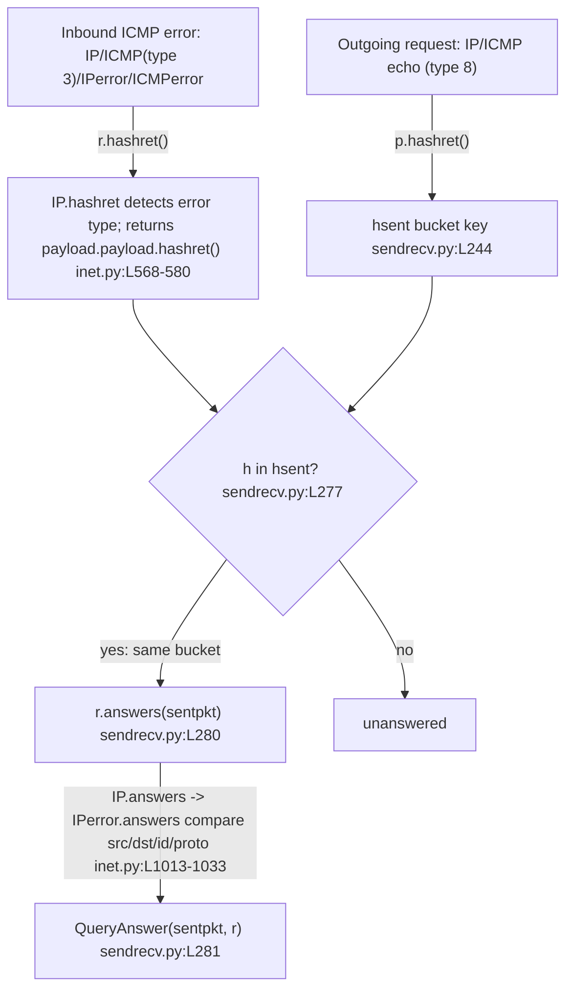

# How Scapy Matches ICMP Error Messages to the Requests That Triggered Them

## Preamble — scope, environment, and methodology

**Question answered.** When you send an ICMP echo request to an unreachable host and receive an
ICMP *destination‑unreachable* error back, how does Scapy decide that the error response matches
the original request? This document answers that question, and the four follow‑on questions it
raises, for **IPv4 / ICMPv4** request↔response matching. IPv6 / ICMPv6 is explicitly **out of
scope** (noted only as a one‑line boundary in Q5).

**Environment (canonical build).**

- Scapy `conf.version = 2026.07.13` (captured live — see the Q1 probe output below).
- Python **3.12.3** (CPython), the interpreter shipped in the container.
- The package is imported **in‑tree from the repository checkout** — it is **not** `pip`‑installed.

**Methodology (read‑only, runtime‑observed).** Every answer below is backed by *actual captured
runtime output*, shown in a fenced code block next to the exact command that produced it. Nothing
here is asserted from reading source alone; behavioral claims are labelled **observed**, and the
rare claim derived purely from reading (not running) is labelled ***(inferred)***. This is a
read‑only investigation: **no source, test, documentation, or configuration file was modified.**
All probe scripts were written under `/tmp` (outside the repository) and deleted after their output
was captured, so the working tree is left unchanged.

**Canonical invocation.** Every probe is run from the repository root as:

```
PYTHONPATH=$PWD python3 /tmp/<probe>.py
```

`PYTHONPATH=$PWD` is **required**. A bare `python3 /tmp/probe.py` puts the *script's own directory*
(`/tmp`) first on `sys.path`; because there is no `scapy` package under `/tmp`, the import fails
with `ModuleNotFoundError: No module named 'scapy'`. Setting `PYTHONPATH` to the repository root
makes the in‑tree `scapy/` package importable, so the code under study is the code in this
checkout — not some other installed copy. The local package is deliberately **not** `pip`‑installed
for the same reason.

**Why we call `hashret()` / `answers()` directly (no network).** The public send/receive entry
points are `sr()` / `sr1()` (background: `doc/scapy/usage.rst:L304` — *"The sr() function is for
sending packets and receiving answers …"*). But `sr()`/`sr1()` do not themselves decide "does this
reply match?"; they delegate that decision to **two predicate methods on the packet objects** —
`hashret()` and `answers()` — invoked by the `SndRcvHandler` engine in `scapy/sendrecv.py`. Those
two predicates are pure Python and require **no network privileges**, so we exercise them directly
on crafted packets and on raw‑bytes re‑dissection (exactly the objects `SndRcvHandler` would feed
them). This yields byte‑exact, reproducible observations of the matching decision itself. No live
transmission to a real unreachable host is needed to produce any evidence in this document.

---

## The Two‑Stage Matching Mechanism (overview)

Scapy's request/response matcher is **two‑stage**, orchestrated by `SndRcvHandler` in
`scapy/sendrecv.py`:

1. **Stage 1 — O(1) bucket key via `hashret()`.** On the send side, every outgoing packet is
   bucketed by its hash: `self.hsent.setdefault(p.hashret(), []).append(p)`
   [`scapy/sendrecv.py:L244`]. On the receive side, each inbound packet's hash is computed,
   `h = r.hashret()` [`scapy/sendrecv.py:L276`], and looked up: `if h in self.hsent`
   [`scapy/sendrecv.py:L277`]. This is a cheap dictionary lookup that narrows the candidate set to
   the handful of sent packets sharing the same hash.
2. **Stage 2 — field confirmation via `answers()`.** For each candidate in the matching bucket,
   Scapy confirms the match field‑by‑field: `if r.answers(sentpkt): self.ans.append(QueryAnswer(sentpkt, r))`
   [`scapy/sendrecv.py:L280-L281`].

So `hashret()` is a fast filter (a hash bucket key) and `answers()` is the precise confirmer. The
key insight for ICMP errors (developed in Q1/Q2) is that **both stages recurse into the embedded
original packet** — the RFC 792 "citation" — rather than looking at the outer error headers.



The maintainers exercise exactly these predicates in the regression suite — e.g.
`test/regression.uts:L1217-L1249` asserts `p1.hashret() == p2.hashret()` and `p2.answers(p1)` for a
request/reply pair (with a disciplined `conf` save/restore), and
`test/scapy/layers/inet.uts:L506-L531` asserts `answer.answers(query) == True` for the
`IPerror`/`UDPerror`/`TCPerror`/`ICMPerror` citation classes. The probes below mirror that style.

---

## Q1 — Matching strategy: does Scapy extract and compare the embedded original packet?

**Answer (observed): YES.** Scapy extracts the embedded original packet — the RFC 792 "citation",
i.e. the copy of the original IP header plus leading payload bytes that every ICMP error message
carries — and compares *its* fields against the request. It does **not** re‑hash the whole error
or compare the outer error headers; it recurses **into** the citation. This is why a
*destination‑unreachable* error (whose outer IP/ICMP addresses and type are entirely different from
the echo request) still matches the echo request that provoked it.

**Mechanism, by name and `file:line`:**

- **Routing to the citation type.** `ICMP.guess_payload_class()` routes ICMP error types
  `[3, 4, 5, 11, 12]` to the `IPerror` class [`scapy/layers/inet.py:L1000-L1004`]. So when an ICMP
  type‑3 error is dissected, its payload is parsed as `IPerror` — an `IP` subclass,
  `class IPerror(IP)` [`scapy/layers/inet.py:L1013`] — then as `ICMPerror`, an `ICMP` subclass,
  `class ICMPerror(ICMP)` [`scapy/layers/inet.py:L1079`]. The citation sub‑layers are wired by
  protocol via `bind_layers(IPerror, ICMPerror, frag=0, proto=1)` [`scapy/layers/inet.py:L1108`]
  (and the sibling bindings at `L1107-L1110` for `IPerror`/`TCPerror`/`UDPerror`).
- **Stage 1 recursion in `hashret`.** `IP.hashret()` detects the ICMP‑error case —
  `self.proto == socket.IPPROTO_ICMP and isinstance(self.payload, ICMP) and self.payload.type in [3, 4, 5, 11, 12]`
  — and returns `self.payload.payload.hashret()` [`scapy/layers/inet.py:L568-L572`]. That is, it
  **skips the outer IP/ICMP and hashes the embedded `IPerror` citation** instead.
- **Stage 2 delegation in `answers`.** `IP.answers()` detects the same ICMP‑error case and returns
  `self.payload.payload.answers(other)` [`scapy/layers/inet.py:L583-L604`; the delegation line is
  `L604`], handing off to `IPerror.answers()` [`scapy/layers/inet.py:L1016-L1034`], which compares
  the citation's fields against the original request.
- **Base fallbacks.** The layer methods ultimately delegate into the generic
  `Packet.hashret()` [`scapy/packet.py:L1215-L1219`] and `Packet.answers()`
  [`scapy/packet.py:L1221-L1226`].

**Probe (`/tmp/probe_q1q2.py`):**

```python
from scapy.all import IP, ICMP, IPerror, ICMPerror, conf
import binascii
print("conf.version =", conf.version)
print("defaults: checkIPID=%r checkIPsrc=%r checkIPaddr=%r checkIPinIP=%r check_TCPerror_seqack=%r"
      % (conf.checkIPID, conf.checkIPsrc, conf.checkIPaddr, conf.checkIPinIP, conf.check_TCPerror_seqack))
req = IP(src="1.2.3.4", dst="1.2.3.7")/ICMP(type=8, id=0x1234, seq=1)
err = IP(src="1.2.3.7", dst="1.2.3.4")/ICMP(type=3, code=1)/IPerror(src="1.2.3.4", dst="1.2.3.7")/ICMPerror(type=8, id=0x1234, seq=1)
print("req.summary() =", req.summary())
print("err.summary() =", err.summary())
print("last layer of err =", err.lastlayer().__class__.__name__)
print("ICMP(type=3).guess_payload_class ->", err[ICMP].guess_payload_class(b"").__name__)
hr = req.hashret(); he = err.hashret()
print("req.hashret() =", binascii.hexlify(hr).decode())
print("err.hashret() =", binascii.hexlify(he).decode())
print("hashes equal   =", hr == he)
print("err.answers(req) =", err.answers(req))
print("req.answers(err) =", req.answers(err))
```

**Command:** `PYTHONPATH=$PWD python3 /tmp/probe_q1q2.py`

**Actual captured output (verbatim):**

```
conf.version = 2026.07.13
defaults: checkIPID=False checkIPsrc=True checkIPaddr=True checkIPinIP=True check_TCPerror_seqack=False
req.summary() = IP / ICMP 1.2.3.4 > 1.2.3.7 echo-request 0
err.summary() = IP / ICMP 1.2.3.7 > 1.2.3.4 dest-unreach host-unreachable / IPerror / ICMPerror
last layer of err = ICMPerror
ICMP(type=3).guess_payload_class -> IPerror
req.hashret() = 000000030134120100
err.hashret() = 000000030134120100
hashes equal   = True
err.answers(req) = 1
req.answers(err) = 0
```

**Cause → effect.**

- The error's **last dissected layer is `ICMPerror`** — the embedded copy of the original ICMP echo.
  Its mere presence is the observable proof that the citation (original IP header + ICMP) was
  extracted and parsed, not discarded.
- `ICMP(type=3).guess_payload_class(...) -> IPerror` confirms the type‑3 routing at `inet.py:L1001-L1002`.
- `err.hashret() == req.hashret()` (both `000000030134120100`) confirms Stage‑1 recursion:
  `IP.hashret()` returned `self.payload.payload.hashret()` (the citation's hash), so the error lands
  in the *same* `hsent` bucket as the request (decomposed byte‑by‑byte in Q2).
- `err.answers(req) == 1` while `req.answers(err) == 0` — **direction matters**. The error *answers*
  the request (the citation's fields match the request), but the request does not answer the error.
  `IP.answers()` delegated to `IPerror.answers()` at `inet.py:L604`.

**Observed.** Confirmed stable across 2 runs.

A companion probe (`/tmp/probe_q2_decomp.py`, shown in Q2) additionally **re‑dissects the error from
raw bytes** (`IP(raw(err))`) — proving the same extraction happens on a real sniffed/received
packet, not only on a hand‑crafted object. There too the last dissected layer is `ICMPerror` and
`answers(req) == 1`.

---

## Q2 — Hashing mechanism: what hash does the error produce, and how does it compare to the request's?

**Answer (observed): the error's `hashret()` is byte‑identical to the request's `hashret()`,
namely `000000030134120100`.** They are equal because `IP.hashret()` recurses into the embedded
citation for ICMP errors (Q1), so both the outgoing echo request and the returning error end up
hashing the *same logical packet* — the original IP+ICMP echo. Equal hashes ⇒ they land in the same
`hsent` bucket, which is precisely what makes Stage 1 of the matcher pair them up.

**Byte decomposition, by name and `file:line`.** For an ICMP echo, the hash is built by
`IP.hashret()` (the non‑error branch) [`scapy/layers/inet.py:L577-L580`] as:

```
strxor(inet_pton(AF_INET, src), inet_pton(AF_INET, dst)) + struct.pack("B", proto) + self.payload.hashret()
```

and `ICMP.hashret()` folds in `id`/`seq` for id/seq‑bearing types:
`struct.pack("HH", self.id, self.seq) + self.payload.hashret()` [`scapy/layers/inet.py:L986-L989`].
For our request (`src=1.2.3.4`, `dst=1.2.3.7`, `proto=ICMP=1`, `id=0x1234`, `seq=1`):

- `strxor(1.2.3.4, 1.2.3.7)` = `00000003` (the two addresses differ only in the last octet:
  `0x04 ^ 0x07 = 0x03`).
- proto byte = `01` (ICMP).
- `struct.pack("HH", 0x1234, 1)` = `34120100` — little‑endian host order: `0x1234 → 3412`, `1 → 0100`.
- concatenation = **`000000030134120100`**.

**`icmp_id_seq_types` (named).** `icmp_id_seq_types = [0, 8, 13, 14, 15, 16, 17, 18, 37, 38]`
[`scapy/layers/inet.py:L949`]. `ICMP.hashret()` only folds `id`/`seq` into the hash when
`self.type in icmp_id_seq_types` [`scapy/layers/inet.py:L987`]. **Type 8 (echo request) IS in this
list**, so its id/seq are folded (yielding the `34120100` tail). **Type 3 (dest‑unreachable) is
deliberately ABSENT**, so if `ICMP.hashret()` were ever reached on the *outer* error ICMP it would
fall through to `return self.payload.hashret()` [`L989`] and recurse to its payload rather than fold
its own id/seq. In practice `IP.hashret()` short‑circuits into the citation *before* the outer ICMP
is ever hashed (Q1), but the two mechanisms are consistent: neither folds the outer type‑3 ICMP.

**Probe (`/tmp/probe_q2_decomp.py`):**

```python
from scapy.all import IP, ICMP, IPerror, ICMPerror, conf
from scapy.compat import raw as craw
import socket, struct, binascii
try:
    from scapy.utils import strxor
except Exception:
    from scapy.compat import strxor
from socket import inet_pton, AF_INET
src, dst, pid, seq = "1.2.3.4", "1.2.3.7", 0x1234, 1
part_addr = strxor(inet_pton(AF_INET, src), inet_pton(AF_INET, dst))
part_proto = struct.pack("B", socket.IPPROTO_ICMP)
part_idseq = struct.pack("HH", pid, seq)
print("strxor(src,dst)      =", binascii.hexlify(part_addr).decode())
print("proto byte (ICMP=1)  =", binascii.hexlify(part_proto).decode())
print("struct.pack(HH,id,seq)=", binascii.hexlify(part_idseq).decode())
manual = part_addr + part_proto + part_idseq
print("manual concatenation =", binascii.hexlify(manual).decode())
req = IP(src=src, dst=dst)/ICMP(type=8, id=pid, seq=seq)
print("req.hashret()        =", binascii.hexlify(req.hashret()).decode())
print("manual == req.hashret() ->", manual == req.hashret())
err = IP(src=dst, dst=src)/ICMP(type=3, code=1)/IPerror(src=src, dst=dst)/ICMPerror(type=8, id=pid, seq=seq)
redis = IP(craw(err))   # re-dissect from raw bytes like a sniffed packet
print("re-dissected last layer =", redis.lastlayer().__class__.__name__)
print("redis.hashret()          =", binascii.hexlify(redis.hashret()).decode())
print("redis.answers(req)       =", redis.answers(req))
```

**Command:** `PYTHONPATH=$PWD python3 /tmp/probe_q2_decomp.py`

**Actual captured output (verbatim):**

```
strxor(src,dst)      = 00000003
proto byte (ICMP=1)  = 01
struct.pack(HH,id,seq)= 34120100
manual concatenation = 000000030134120100
req.hashret()        = 000000030134120100
manual == req.hashret() -> True
re-dissected last layer = ICMPerror
redis.hashret()          = 000000030134120100
redis.answers(req)       = 1
```

The manual reconstruction `00000003` + `01` + `34120100` = `000000030134120100` equals
`req.hashret()` byte‑for‑byte, verifying the decomposition against the exact bytes Scapy emitted.
The re‑dissected‑from‑raw error (`IP(raw(err))`) yields the same hash and `answers(req) == 1`,
proving the recursion works on wire bytes, not just crafted objects.

**Second probe (`/tmp/probe_idseq.py`) — proves the recursion and the `icmp_id_seq_types` gate:**

**Command:** `PYTHONPATH=$PWD python3 /tmp/probe_idseq.py`

```
icmp_id_seq_types = [0, 8, 13, 14, 15, 16, 17, 18, 37, 38]
3 in icmp_id_seq_types -> False
8 in icmp_id_seq_types -> True
ICMP(type=8,id=0x1234,seq=1).hashret() = 34120100 (folds id/seq: 34120100)
ICMP(type=3).hashret()                 =  (no id/seq folded)
err.hashret()                 = 000000030134120100
err[IPerror].hashret()        = 000000030134120100 (identical: proves recursion into citation)
equal -> True
```

**Cause → effect.**

- `err.hashret() == err[IPerror].hashret()` (both `000000030134120100`) is the direct proof that
  `IP.hashret()` returned the citation's hash — the recursion at `inet.py:L572`. Hashing the whole
  error object gives the *same* value as hashing the embedded `IPerror` alone.
- `ICMP(type=8,…).hashret()` = `34120100` shows type 8 folds id/seq (`inet.py:L988`), whereas the
  **empty** output for `ICMP(type=3).hashret()` shows type 3 folds nothing (falls through to
  `L989`) — because 3 ∉ `icmp_id_seq_types`.
- This equality is exactly the maintainer invariant `assert p1.hashret() == p2.hashret()` seen at
  `test/regression.uts:L1219` for a request/reply pair.

**Observed.** Stable across 2 runs.

---

## Q3 — Subtly modified citation (TTL / checksum) and the configuration toggles

**Answer (observed):** A changed embedded **TTL or checksum does NOT break the match.**
`IPerror.answers()` compares **only** `src`, `dst`, `id`, and `proto` — it never inspects TTL or
checksum [`scapy/layers/inet.py:L1016-L1034`], so those fields are *structurally incapable* of
affecting the match. The two runtime toggles that govern matching strictness for error citations are
`conf.checkIPsrc` (default `True`) [`scapy/config.py:L751`] and `conf.check_TCPerror_seqack`
(default `False`) [`scapy/config.py:L758`].

**Named mechanisms, `file:line`, and sibling variants:**

- **`IPerror.answers()`** body [`scapy/layers/inet.py:L1016-L1034`]:
  - `test_IPsrc = not conf.checkIPsrc or self.src == other.src` [`L1021`]
  - `test_IPdst = self.dst == other.dst` [`L1022`]
  - `test_IPid = not conf.checkIPID or self.id == other.id` [`L1025`], then
    `test_IPid |= conf.checkIPID and self.id == socket.htons(other.id)` [`L1026`]
  - `test_IPproto = self.proto == other.proto` [`L1029`]
  - gate: `if not (test_IPsrc and test_IPdst and test_IPid and test_IPproto): return 0` [`L1031`]

  **There is no TTL term and no checksum term anywhere in this method** → mutating either on the
  citation cannot change the outcome.
- **`TCPerror.answers()`** [`scapy/layers/inet.py:L1043-L1057`]: if `conf.checkIPsrc`, requires
  `sport`/`dport` equal; if `conf.check_TCPerror_seqack`, requires `seq`/`ack` equal (each only when
  the corresponding field is non‑`None`).
- **`UDPerror.answers()`** [`scapy/layers/inet.py:L1066-L1073`]: if `conf.checkIPsrc`, requires
  `sport`/`dport` equal.
- **`ICMPerror.answers()`** [`scapy/layers/inet.py:L1082-L1096`]: requires `type` and `code` equal;
  and for `self.code in [0, 8, 13, 14, 17, 18]` additionally requires `id`/`seq` equal.

### Probe A (`/tmp/probe_q3b.py`) — TTL/checksum isolation + `ICMPerror.answers` variants

```python
from scapy.all import IP, ICMP, IPerror, ICMPerror, conf
req = IP(src="1.2.3.4", dst="1.2.3.7")/ICMP(type=8, id=0x1234, seq=1)
err = IP(src="1.2.3.7", dst="1.2.3.4")/ICMP(type=3, code=1)/IPerror(src="1.2.3.4", dst="1.2.3.7")/ICMPerror(type=8, id=0x1234, seq=1)
print("citation before: ttl=%r chksum=%r  answers=%d" % (err[IPerror].ttl, err[IPerror].chksum, err.answers(req)))
err[IPerror].ttl = 7
err[IPerror].chksum = 0xDEAD
print("citation after : ttl=%r chksum=%r  answers=%d" % (err[IPerror].ttl, err[IPerror].chksum, err.answers(req)))
ie = err[ICMPerror]
print("ICMPerror.answers(req[ICMP]) type/code+id/seq =", ie.answers(req[ICMP]))
ie2 = ICMPerror(type=0, code=0, id=0x1234, seq=1)
print("ICMPerror(type=0).answers(req ICMP type8)     =", ie2.answers(req[ICMP]))
ie3 = ICMPerror(type=8, code=0, id=0x9999, seq=1)
print("ICMPerror(type=8,id=0x9999).answers(req ICMP) =", ie3.answers(req[ICMP]))
```

**Command:** `PYTHONPATH=$PWD python3 /tmp/probe_q3b.py`

**Actual captured output (verbatim):**

```
citation before: ttl=64 chksum=None  answers=1
citation after : ttl=7 chksum=57005  answers=1
ICMPerror.answers(req[ICMP]) type/code+id/seq = 1
ICMPerror(type=0).answers(req ICMP type8)     = 0
ICMPerror(type=8,id=0x9999).answers(req ICMP) = 0
```

**Cause → effect (before/after state).** With the citation's `ttl=64` and `chksum=None` (unset),
`answers()` is `1`. After forcing `ttl=7` and `chksum=0xDEAD` (`= 57005` decimal), `answers()`
**stays `1`** → TTL and checksum are ignored, exactly as predicted from the absence of those terms
in `IPerror.answers()`. The `ICMPerror.answers` variants show the sibling behavior: a type mismatch
(0 vs 8) returns `0`, and an id mismatch (`0x9999`) returns `0` because `code 0 ∈ [0,8,13,14,17,18]`
forces the id/seq equality check [`inet.py:L1088`].

### Probe B (`/tmp/probe_q3.py`) — `checkIPsrc` / `check_TCPerror_seqack` sweep (TCP‑ and UDP‑in‑error)

This probe crafts a TCP request and a TCP‑in‑ICMP error citation
(`treq = IP()/TCP(sport=1234, dport=80, seq=1000, ack=0)` and
`terr = IP()/ICMP(type=3, code=3)/IPerror()/TCPerror(sport=1234, dport=80, seq=1000)`), mutates
`terr[TCPerror].seq` while toggling `conf.check_TCPerror_seqack`, mutates `terr[TCPerror].dport`
while toggling `conf.checkIPsrc`, and repeats the port sweep for `UDPerror`. It restores every
`conf` value it changes (mirroring the `.uts` save/restore discipline at
`test/regression.uts:L1222-L1231`).

**Command:** `PYTHONPATH=$PWD python3 /tmp/probe_q3.py`

**Actual captured output (verbatim):**

```
[A] baseline err.answers(req) = 1
[A] after ttl=7, chksum=0xDEAD, ip.id=0xABCD -> err.answers(req) = 1
[A] req.hashret()==err.hashret() -> True

[B] defaults checkIPsrc=True check_TCPerror_seqack=False
[B] baseline terr.answers(treq) = 1
[B] wrong seq, seqack=False -> terr.answers(treq) = 1
[B] wrong seq, seqack=True  -> terr.answers(treq) = 0
[B] fixed seq, seqack=True  -> terr.answers(treq) = 1
[B] wrong dport, checkIPsrc=True  -> terr.answers(treq) = 0
[B] wrong dport, checkIPsrc=False -> terr.answers(treq) = 1

[C] baseline uerr.answers(ureq) = 1
[C] wrong dport, checkIPsrc=True  -> uerr.answers(ureq) = 0
[C] wrong dport, checkIPsrc=False -> uerr.answers(ureq) = 1

[D] ICMPerror.answers via full stack:
[D] baseline err.answers(req) = 1
```

**Cause → effect for each transition (before → after):**

- **TCP seq, gated by `conf.check_TCPerror_seqack`** [`scapy/layers/inet.py:L1051-L1057`]: under the
  default `check_TCPerror_seqack=False`, a **wrong** embedded `seq` still matches (`1`) — the seq/ack
  block is skipped entirely. Flipping the toggle to `True` makes the wrong `seq` **fail** (`0`).
  Restoring the correct `seq` matches again (`1`). This is the whole life‑cycle of the toggle,
  observed live.
- **TCP ports, gated by `conf.checkIPsrc`** [`scapy/layers/inet.py:L1046-L1050`]: a **wrong**
  `dport` **fails** under the default `checkIPsrc=True` (`0`); setting `checkIPsrc=False` leaves the
  ports unchecked, so the same wrong‑port citation now **matches** (`1`).
- **UDP ports, gated identically by `conf.checkIPsrc`** [`scapy/layers/inet.py:L1069-L1072`]: wrong
  `dport` fails under `True` (`0`), matches under `False` (`1`) — the same rule as TCP.
- **The `[A]` line also mutated the citation's IP `id` to `0xABCD` and still matched** (`1`) —
  because the default `conf.checkIPID=False` means the IP ID is not checked at all. That is the
  bridge into Q4.

**Observed.** Stable across 2 runs. All `conf` mutations were saved and restored within the probe,
so the process left the configuration at its defaults.

---

## Q4 — Byte‑swapped IP ID tolerance ("sometimes matches")

**Answer (observed):** Whether a byte‑swapped embedded IP ID is tolerated is gated entirely by
`conf.checkIPID`; the numeric transform relating the original ID to the accepted value is
`socket.htons()` — a 16‑bit byte swap (e.g. `0x1234 ↔ 0x3412`). The tolerance is expressed by the
single line `test_IPid |= conf.checkIPID and self.id == socket.htons(other.id)`
[`scapy/layers/inet.py:L1025-L1026`]. The default `conf.checkIPID = False`
[`scapy/config.py:L748`] means **the IP ID is not checked at all by default** — which is itself one
reason the same input can "sometimes match."

The user reported: *"when I send a packet with a specific IP ID value and receive an ICMP error
where the embedded IP header contains a different ID that appears to be byte‑swapped, Scapy
sometimes still considers it a match."* To reproduce that faithfully, the probe below feeds the
**same unchanged input** through `answers()` five times at each of `conf.checkIPID ∈ {False, 1, 2}`,
for three citation‑ID relationships (equal, byte‑swapped, unrelated) — reporting the observed
distribution rather than constructing a stable variant.

**Probe (`/tmp/probe_q4.py`):**

```python
from scapy.all import IP, ICMP, IPerror, ICMPerror, conf
import socket
print("socket.htons(0x1234) = 0x%04x" % socket.htons(0x1234))
print("socket.htons(0x3412) = 0x%04x" % socket.htons(0x3412))
req = IP(src="1.2.3.4", dst="1.2.3.7", id=0x1234)/ICMP(type=8, id=0xAAAA, seq=1)
def make_err(cite_ipid):
    return IP(src="1.2.3.7", dst="1.2.3.4")/ICMP(type=3, code=1)/IPerror(src="1.2.3.4", dst="1.2.3.7", id=cite_ipid)/ICMPerror(type=8, id=0xAAAA, seq=1)
cases = {"equal id (0x1234)": 0x1234, "byte-swapped (0x3412)": 0x3412, "unrelated (0x5678)": 0x5678}
for label, cite in cases.items():
    print("\n== citation IP id = %s vs request IP id=0x1234 ==" % label)
    for setting in [False, 1, 2]:
        conf.checkIPID = setting
        results = [make_err(cite).answers(req) for _ in range(5)]
        print("  checkIPID=%-5r -> answers() x5 = %s" % (setting, results))
conf.checkIPID = False
```

**Command:** `PYTHONPATH=$PWD python3 /tmp/probe_q4.py`

**Actual captured output (verbatim):**

```
socket.htons(0x1234) = 0x3412
socket.htons(0x3412) = 0x1234

== citation IP id = equal id (0x1234) vs request IP id=0x1234 ==
  checkIPID=False -> answers() x5 = [1, 1, 1, 1, 1]
  checkIPID=1     -> answers() x5 = [1, 1, 1, 1, 1]
  checkIPID=2     -> answers() x5 = [1, 1, 1, 1, 1]

== citation IP id = byte-swapped (0x3412) vs request IP id=0x1234 ==
  checkIPID=False -> answers() x5 = [1, 1, 1, 1, 1]
  checkIPID=1     -> answers() x5 = [1, 1, 1, 1, 1]
  checkIPID=2     -> answers() x5 = [1, 1, 1, 1, 1]

== citation IP id = unrelated (0x5678) vs request IP id=0x1234 ==
  checkIPID=False -> answers() x5 = [1, 1, 1, 1, 1]
  checkIPID=1     -> answers() x5 = [0, 0, 0, 0, 0]
  checkIPID=2     -> answers() x5 = [0, 0, 0, 0, 0]

config comment [config.py:L745-747]: '2' should be strictly-equal-only
```

**Interpretation (cause → effect, all sibling variants):**

- **`socket.htons()` is a 16‑bit byte swap and is involutory:** `htons(0x1234) = 0x3412` and
  `htons(0x3412) = 0x1234` (observed on the first two lines). So on a little‑endian host it swaps the
  two ID bytes and swapping twice returns the original.
- **The honest resolution of "sometimes matches."** A byte‑swapped citation ID matches under **all
  three** settings (`False`, `1`, `2`) — `[1, 1, 1, 1, 1]` every time. But *why* it matches differs:
  - Under `checkIPID = False`, the ID is **not checked at all**: `test_IPid = not False or … = True`
    (the left operand short‑circuits to `True`) [`inet.py:L1025`].
  - Under `checkIPID = 1` or `2`, the ID **is** checked, but the `htons()` branch at
    [`inet.py:L1026`] tolerates the swap, so `test_IPid` becomes `True` via the OR.

  So the behavior is **deterministic per configuration** (stable across the 5×2 = 10 evaluations),
  **never random.** What the user perceived as "sometimes" is the difference between configurations
  (or between a byte‑swapped vs an unrelated ID), not run‑to‑run nondeterminism on identical state.
- **Sibling variant — equal ID (`0x1234`):** matches under all three settings (`[1,1,1,1,1]`).
- **Sibling variant — unrelated ID (`0x5678`):** matches **only** under `False` (ID unchecked);
  **fails** under both `1` and `2` (`[0,0,0,0,0]`), because it is neither equal nor the `htons()`
  swap of `0x1234`.
- **Comment‑vs‑code discrepancy — "is this a bug?" edge.** The config comment states
  `#: if 2, strictly checks that they are equals` [`scapy/config.py:L747`] (full comment block
  `L744-L747`), i.e. the *documented intent* is that `checkIPID = 2` accepts an exact‑equal ID
  **only**. But the code at [`scapy/layers/inet.py:L1026`] OR‑s in the `htons()` branch for **any
  truthy** value of `conf.checkIPID` — there is no separate `== 2` guard. Consequently
  `checkIPID = 2` **still tolerates a byte swap** (observed: byte‑swapped case is `[1,1,1,1,1]` under
  `2`). This is an **observed** contradiction between the documented intent (`config.py:L747`) and
  the actual behavior (`inet.py:L1026`). Characterizing it as *a likely bug* is ***(inferred)***; the
  behavior itself — that `2` tolerates the swap — is **observed**.

**Observed.** Stable across 2 runs; the probe restores `conf.checkIPID = False` at the end.

---

## Q5 — RFC 4884 extensions: does loading the extension parser change match validity?

**Answer (observed): NO — loading the RFC 4884 contrib changes the dissected *structure* but NOT
the *match validity*.** With the contrib loaded, the trailing extension bytes are peeled off the
citation's padding and re‑parsed as `ICMPExtensionHeader` / `ICMPExtensionMPLS`; but both
`hashret()` and `answers()` return **identical** results with and without the contrib. Matching
depends only on the `IPerror` citation fields (`src`/`dst`/`id`/`proto`), and those are unaffected by
whether the trailing extension is parsed as structure or left as raw padding.

**Named mechanisms, `file:line`:**

- **`load_contrib('icmp_extensions')`** [loader `scapy/main.py:L194`] imports the contrib module,
  which **monkeypatches** `post_dissection` onto the IPv4 error classes:
  `scapy.layers.inet.ICMPerror.post_dissection = ICMPExtension_post_dissection` (and the same for
  `TCPerror`, `UDPerror`) [`scapy/contrib/icmp_extensions.py:L176-L178`]. *(Boundary note: it also
  patches the IPv6 `ICMPv6DestUnreach` / `ICMPv6TimeExceeded` classes*
  *[`scapy/contrib/icmp_extensions.py:L180-L181`] — **out of scope** here; mentioned only to bound the
  question to IPv4.)*
- **The hook.** `post_dissection` is the base `Packet.post_dissection` [`scapy/packet.py:L350`],
  invoked by `dissection_done` [`scapy/packet.py:L344-L348`, specifically `self.post_dissection(pkt)`
  at `L347`], which runs after a packet is dissected from bytes [`scapy/packet.py:L178`].
- **The handler** `ICMPExtension_post_dissection()` [`scapy/contrib/icmp_extensions.py:L67-L98`]:
  for IPv4 it triggers only when `ICMP in pkt and pkt[ICMP].type in [3, 11, 12] and pkt.len > 144`
  [`L76-L78`], slices `bytes = pkt[ICMP].build()[136:]` (offset 136 = the **137th octet**) [`L79`],
  builds a candidate `ICMPExtensionHeader`, validates it via `if checksum(ieh.build()): return`
  [`L94`] (a non‑zero checksum means "not a valid extension" → bail), then trims the extension bytes
  off the padding and attaches the parsed header: `lastlayer.load = lastlayer.load[:-len(ieh)]` and
  `lastlayer.add_payload(ieh)` [`L97-L98`].
- **RFC 4884 §5.2 corroboration (background only).** The `pkt.len > 144` guard and the 137th‑octet
  start match the RFC: 144 = 8 (first two ICMP words) + 128 (padded "original datagram" field) + 4
  (Extension Header) + 4 (one Object header). Reference:
  `https://datatracker.ietf.org/doc/html/rfc4884`.

### An observed nuance worth documenting: the extension checksum coverage

Scapy's `ICMPExtensionHeader.post_build` computes the extension checksum over **only the 4‑byte
header** — `ck = checksum(p)` where `p` is just the header [`scapy/contrib/icmp_extensions.py:L44-L48`,
the `checksum(p)` call at `L46`]. But `post_dissection` **validates** the checksum over the **whole
extension structure** — `checksum(ieh.build())` [`scapy/contrib/icmp_extensions.py:L94`]. The two
disagree on coverage. Consequently a *naively Scapy‑built* extension (bytes `2000dfff00040101`,
whose checksum covers only the header) **fails** Scapy's own dissection‑time validation and would
**not** be attached. A real RFC 4884 packet carries a checksum computed over the **entire**
extension; using the corrected full‑structure checksum (bytes `2000defa00040101`, for which
`checksum(...) == 0`) makes `post_dissection` trigger. Below we first build a wire packet with the
**correct full‑structure** checksum so the extension *is* recognized. (The header‑only‑vs‑full
coverage mismatch is **observed**; characterizing the header‑only build checksum as *a likely bug*
is ***(inferred)***.)

### Build probe (`/tmp/probe_q5_build2.py`) — construct the oversized packet with a valid full‑structure checksum

```python
from scapy.all import IP, ICMP, IPerror, ICMPerror, Raw, conf, raw
from scapy.main import load_contrib
load_contrib('icmp_extensions')
from scapy.contrib.icmp_extensions import ICMPExtensionHeader, ICMPExtensionMPLS
from scapy.layers.inet import checksum
ext0 = raw(ICMPExtensionHeader(version=2, chksum=0)/ICMPExtensionMPLS(classnum=1, classtype=1))
ck = checksum(ext0)
ext_fixed = ext0[:2] + bytes([ck >> 8, ck & 0xff]) + ext0[4:]
print("ext0 (chksum=0) hex =", ext0.hex())
print("computed full checksum = 0x%04x" % ck)
print("ext_fixed hex          =", ext_fixed.hex())
print("verify checksum(ext_fixed) =", checksum(ext_fixed), "(0 == valid)")
cite = raw(IPerror(src="1.2.3.4", dst="1.2.3.7")/ICMPerror(type=8, id=0x1234, seq=1))
pad = b"\x00" * (128 - len(cite))
full = IP(src="1.2.3.7", dst="1.2.3.4")/ICMP(type=3, code=1)/Raw(cite + pad + ext_fixed)
wire = raw(full)
d = IP(wire)
print("pkt.len =", d.len, " (>144 ?)", d.len > 144)
open("/tmp/q5_wire_valid.bin","wb").write(wire)
```

**Command:** `PYTHONPATH=$PWD python3 /tmp/probe_q5_build2.py`

**Actual captured output (verbatim):**

```
ext0 (chksum=0) hex = 2000000000040101
computed full checksum = 0xdefa
ext_fixed hex          = 2000defa00040101
verify checksum(ext_fixed) = 0 (0 == valid)
pkt.len = 164  (>144 ?) True
```

Note the two checksums: the Scapy‑built header‑only value would be `dfff` (giving `2000dfff00040101`,
which fails full‑structure validation), while the correct full‑structure checksum is `0xdefa`
(giving `ext_fixed = 2000defa00040101`, for which `checksum(ext_fixed) == 0`). The assembled packet
has `pkt.len = 164 > 144`, so it clears the `post_dissection` size guard. The wire bytes are written
to `/tmp/q5_wire_valid.bin` and dissected by the next two probes in **separate fresh processes**, so
the "with" and "without" cases cannot contaminate each other via the module‑level monkeypatch.

### WITHOUT the contrib (`/tmp/probe_q5_without2.py`) — fresh process, contrib NOT loaded

**Command:** `PYTHONPATH=$PWD python3 /tmp/probe_q5_without2.py`

**Actual captured output (verbatim):**

```
[WITHOUT] layers  = IP / ICMP 1.2.3.7 > 1.2.3.4 dest-unreach host-unreachable / IPerror / ICMPerror / Padding
[WITHOUT] lastlayer class = Padding  load len = 108
[WITHOUT] hashret = 000000030134120100
[WITHOUT] answers(req) = 1
```

### WITH the contrib (`/tmp/probe_q5_with2.py`) — fresh process, `load_contrib('icmp_extensions')` then dissect the SAME bytes

**Command:** `PYTHONPATH=$PWD python3 /tmp/probe_q5_with2.py`

**Actual captured output (verbatim):**

```
[WITH] layers  = IP / ICMP 1.2.3.7 > 1.2.3.4 dest-unreach host-unreachable / IPerror / ICMPerror / Padding / ICMPExtensionHeader / ICMPExtensionMPLS
[WITH] lastlayer class = ICMPExtensionMPLS
[WITH] ICMPExtensionHeader in pkt? = True
[WITH] ICMPerror payload class = Padding  load len = 100
[WITH] hashret = 000000030134120100
[WITH] answers(req) = 1
```

**Cause → effect + before / during / after (the state change):**

- **Before (no contrib):** the last layer is `Padding` with `load` length **108** — the 100‑byte
  citation pad plus the 8 extension bytes all remain raw/unparsed. `hashret = 000000030134120100`,
  `answers(req) = 1`.
- **After (contrib loaded):** the same 8 trailing bytes are parsed as
  `ICMPExtensionHeader` / `ICMPExtensionMPLS`; the citation's `Padding.load` is trimmed from **108 →
  100** (the 8 extension bytes were moved out into the new parsed layers by `L97-L98`). `hashret`
  is **`000000030134120100` (UNCHANGED)** and `answers(req) = 1` **(UNCHANGED)**.
- **Conclusion:** match validity does **not** change — only the dissection tree does. The matcher
  recurses into the `IPerror` citation and compares `src`/`dst`/`id`/`proto`, none of which live in
  the trailing extension bytes; so whether those bytes are `Padding` or a parsed
  `ICMPExtensionHeader` is irrelevant to the match. The hash is identical (`000000030134120100`) in
  both cases because it too is computed from the citation, not the trailing extension.

**Observed.** Stable across 2 runs.

---

## Coverage Pass — every named item

Each row states the concrete value/behavior, its `file:line`, the probe that produced the evidence,
the sibling variants exercised, the cause→effect, and whether the result is **observed** or
***(inferred)***.

| # | Item | Value / behavior observed | file:line | Observed evidence (probe) | Sibling variants | Cause → effect | Label |
|---|------|---------------------------|-----------|---------------------------|------------------|----------------|-------|
| 1 | Embedded‑packet extraction (citation) | ICMP error types `[3,4,5,11,12]` route to `IPerror`; last dissected layer of the error is `ICMPerror` | `inet.py:L1000-L1004`, `L1013`, `L1108` | `probe_q1q2.py` (`guess_payload_class -> IPerror`, `last layer = ICMPerror`); `probe_q2_decomp.py` (re‑dissected last layer `ICMPerror`) | non‑error ICMP types → `guess_payload_class` returns `None` (`L1003-1004`) | Type‑3 routing parses the citation as `IPerror/ICMPerror`, making the original packet available for comparison | observed |
| 2 | `hashret()` two‑stage bucket key + citation recursion | `IP.hashret()` returns `self.payload.payload.hashret()` for errors; error hash == citation hash | `inet.py:L568-L572`; base `packet.py:L1215-L1219`; `sendrecv.py:L244,L276` | `probe_q1q2.py` (`err.hashret()==req.hashret()`); `probe_idseq.py` (`err.hashret()==err[IPerror].hashret()`) | non‑error / mDNS / IP‑in‑IP branches at `L573-581` | Recursion makes request and error share one `hsent` bucket (Stage 1) | observed |
| 3 | `answers()` field confirmation + citation delegation | `IP.answers()` delegates to `IPerror.answers()`; `err.answers(req)=1`, `req.answers(err)=0` | `inet.py:L583-L604`, `IPerror.answers` `L1016-L1034`; base `packet.py:L1221-L1226`; `sendrecv.py:L280-L281` | `probe_q1q2.py` (`err.answers(req)=1`, `req.answers(err)=0`) | direction reversed → `0`; `TCPerror`/`UDPerror`/`ICMPerror` delegations | Delegation (`L604`) confirms the citation's fields match the request (Stage 2); direction matters | observed |
| 4 | Byte‑exact hash `000000030134120100` decomposition | `strxor=00000003` + proto `01` + `struct.pack("HH",0x1234,1)=34120100` | `inet.py:L577-L580`, `L986-L989` | `probe_q2_decomp.py` (`manual == req.hashret() -> True`) | different src/dst change the `strxor`; different id/seq change the tail | Hash is a deterministic function of src⊕dst, proto, id, seq; identical for req and err | observed |
| 5 | `icmp_id_seq_types` (type 3 absent) | `[0, 8, 13, 14, 15, 16, 17, 18, 37, 38]`; type 8 present, type 3 absent | `inet.py:L949` (used at `L987`) | `probe_idseq.py` (`8 in … -> True`, `3 in … -> False`; type‑3 hashret empty) | echo/timestamp/etc. types fold id/seq | Type 8 folds id/seq into the hash; type 3 folds nothing → the outer error ICMP never contributes id/seq | observed |
| 6 | TTL not compared | setting citation `ttl=7` leaves `answers()=1` | `inet.py:L1016-L1034` (no TTL term) | `probe_q3b.py` (`ttl=64→7`, `answers` stays `1`) | checksum (row 7) similarly ignored | `IPerror.answers()` has no TTL term → TTL cannot affect the match | observed |
| 7 | Checksum not compared | setting citation `chksum=0xDEAD (57005)` leaves `answers()=1` | `inet.py:L1016-L1034` (no checksum term) | `probe_q3b.py` (`chksum=None→57005`, `answers` stays `1`) | TTL (row 6) similarly ignored | `IPerror.answers()` has no checksum term → checksum cannot affect the match | observed |
| 8 | `conf.checkIPsrc` (default `True`) gating TCP/UDP ports | wrong `dport` fails under `True` (`0`), matches under `False` (`1`) | `config.py:L751`; `inet.py:L1046-L1050`, `L1069-L1072` | `probe_q3.py` (`[B]`/`[C]` dport transitions) | also gates `IPerror.answers` src test (`L1021`) | When `True`, ports must match; when `False`, the port check is skipped | observed |
| 9 | `conf.check_TCPerror_seqack` (default `False`) gating TCP seq/ack | wrong `seq` matches under `False` (`1`), fails under `True` (`0`), matches when fixed (`1`) | `config.py:L758`; `inet.py:L1051-L1057` | `probe_q3.py` (`[B]` seq transitions) | ack gated identically; only checked when non‑`None` | When `False`, the seq/ack block is skipped; when `True`, seq/ack must match | observed |
| 10 | `TCPerror.answers` / `UDPerror.answers` / `ICMPerror.answers` | TCP: ports + opt seq/ack; UDP: ports; ICMP: type+code (+id/seq for code∈[0,8,13,14,17,18]) | `inet.py:L1043-L1057`, `L1066-L1073`, `L1082-L1096` | `probe_q3.py` (`[B]`,`[C]`); `probe_q3b.py` (ICMPerror variants) | ICMPerror type/id mismatches → `0` | Each citation sub‑layer applies its own field comparison after `IPerror.answers` passes | observed |
| 11 | IP ID / byte‑swap tolerance + `socket.htons()` | `htons(0x1234)=0x3412` (involutory); byte‑swapped ID matches when the ID is checked | `inet.py:L1025-L1026` | `probe_q4.py` (byte‑swapped `[1,1,1,1,1]` under `1`/`2`) | equal ID always matches; unrelated ID fails when checked | `test_IPid \|= … self.id == socket.htons(other.id)` OR‑s in the swap tolerance | observed |
| 12 | `conf.checkIPID` default `False`; values `1` vs `2`; comment‑vs‑code discrepancy | default `False` (ID unchecked); `1` and `2` both tolerate the swap; comment says `2`=strict‑equal | `config.py:L744-L748`; `inet.py:L1026` | `probe_q4.py` (full sweep; `2` byte‑swapped = `[1,1,1,1,1]`) | `False`: unrelated ID matches; `1`/`2`: unrelated ID fails | Code OR‑s the `htons()` branch for **any** truthy `checkIPID`, so `2` ≠ strict‑equal despite the comment | observed behavior; "bug" characterization *(inferred)* |
| 13 | RFC 4884 extensions with/without contrib; `pkt.len>144`, offset 136; structure vs validity | with contrib the extension is parsed (`load` 108→100); `hashret`/`answers` unchanged (`000000030134120100`/`1`) | `contrib/icmp_extensions.py:L67-L98,L176-L178`; `main.py:L194`; `packet.py:L344-L350` | `probe_q5_build2.py` (`pkt.len=164`, `ext_fixed=2000defa00040101`); `probe_q5_without2.py`; `probe_q5_with2.py` | header‑only vs full‑structure checksum coverage (build `L46` vs validate `L94`) | Parser peels trailing bytes off `Padding` but never touches citation `src/dst/id/proto` → match validity unchanged | observed structure change; checksum "bug" characterization *(inferred)* |

---

## Environment & Reproduction notes

- **Scapy version:** `conf.version = 2026.07.13` (captured live in the Q1 probe). **Interpreter:**
  Python 3.12.3 (CPython). The mechanisms under study (`hashret()`, `answers()`, the `conf` toggles,
  `socket.htons()`, `post_dissection`) are pure Python and version‑independent within the supported
  range, so the exact Python patch level does not affect any output above.
- **Canonical invocation:** every probe was run from the repository root as
  `PYTHONPATH=$PWD python3 /tmp/<probe>.py`. `PYTHONPATH=$PWD` is required because a bare
  `python3 /tmp/<probe>.py` puts the script's own directory (`/tmp`) first on `sys.path`, where no
  `scapy` package exists, raising `ModuleNotFoundError: No module named 'scapy'`. Pointing
  `PYTHONPATH` at the repository root makes the **in‑tree** `scapy/` package import, guaranteeing the
  code exercised is the code in this checkout. The local package was **not** `pip`‑installed.
- **No network privileges** were used or required. `hashret()` and `answers()` — the exact decision
  functions `SndRcvHandler` invokes [`scapy/sendrecv.py:L244`, `L276`, `L280-L281`] — were exercised
  directly on crafted packets and on raw‑bytes re‑dissection (`IP(raw(...))`), and the Q5 wire packet
  was dissected from a `/tmp/*.bin` file in fresh processes. No `sr()`/`sr1()` transmission to a real
  host was needed to produce any evidence above.
- **Stability:** each probe was run at least twice; every output above was identical across runs. The
  Q4 "sometimes matches" question was answered by running the **same unchanged input** five times per
  configuration and reporting the observed distribution, rather than constructing a stable variant and
  declaring determinism.
- **Read‑only mandate honored:** all probe scripts (`probe_q1q2.py`, `probe_q2_decomp.py`,
  `probe_idseq.py`, `probe_q3b.py`, `probe_q3.py`, `probe_q4.py`, `probe_q5_build2.py`,
  `probe_q5_without2.py`, `probe_q5_with2.py`) and the `q5_wire_valid.bin` artifact were **temporary,
  under `/tmp` (outside the repository), and deleted after their output was captured**. No source,
  test, documentation, or configuration file in the repository was modified; this Markdown document is
  the only file added.

