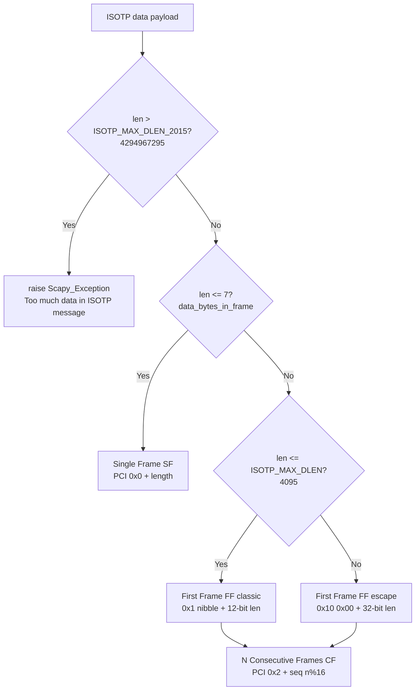

# Scapy ISO-TP (ISO 15765-2) Message Segmentation & Reassembly — Onboarding QnA

**ISO-TP** (ISO 15765-2, the "Transport Protocol" for CAN diagnostics) is the network/transport layer that lets a diagnostic message longer than a single 8-byte CAN payload be split across several CAN frames on the sender and stitched back together on the receiver. This document answers a set of onboarding questions (Q1–Q8) about how Scapy's automotive contrib module (`scapy/contrib/isotp/`) performs that segmentation on transmit and how its receive state machine behaves when a middle *Consecutive Frame* never arrives.

Every behavioral claim below is **grounded in real runtime execution evidence** — each answer shows the exact command that was run, its complete unedited output, and a `file:line` citation into the ISO-TP source. The investigation was strictly **read-only**: no repository file was modified, and the only write to the tree is this single Markdown document.

> **Quick answers:** A payload > 7 bytes is split into **1 First Frame + N Consecutive Frames**. A 20-byte payload → **exactly 3 frames**. The single-frame limit is **7 bytes** (standard addressing; 6 with extended addressing). A 5000-byte payload does **not** error — it is segmented into **715 frames** via the ISO-TP 2016 32-bit length escape. On the receive side, if a middle Consecutive Frame never arrives, the **`cf_timeout = 1 s`** (ISO 15765-2 *N_Cr*) timer fires and Scapy **silently resets** the receive state — **no exception is raised** (a warning is logged only when `conf.verb > 2`).

---

## Environment

- **Python:** `3.13.7` (observed; satisfies `requires-python = ">=3.7, <4"` — `pyproject.toml:L17`).
- **Scapy version:** `scapy.VERSION` = **`2026.07.08`**. Exercised **editable** from the repository checkout, so the code under test is the repo's own ISO-TP source (`git` HEAD `0925ada4`).
- **Import method:** the repo was imported via `PYTHONPATH=<repo-root>` (see the Methodology note). `scapy.__file__` resolves to `<repo-root>/scapy/__init__.py`, confirming the exercised code is the checked-out source and not a separately-installed copy.
- **Default socket backend:** `ISOTPSocket == ISOTPSoftSocket`, because the kernel `can-isotp` module is disabled by default: `USE_CAN_ISOTP_KERNEL_MODULE = False` (`scapy/contrib/isotp/__init__.py:L27`; the alias is set at `scapy/contrib/isotp/__init__.py:L47`).
- **Optional CAN backend:** `python-can` (version 4.6.1) is present but is a **test-only** dependency (`tox.ini:L33`), **not** a mandatory Scapy runtime dependency; it was not needed for the receive scenario.
- **Native path caveat:** the native kernel `can-isotp` backend is **not exercisable** in this container (no `ip`/`modprobe`/`vcan` tooling), so the canonical receive path here is the pure-Python soft socket (`ISOTPSoftSocket`).

---

## Methodology note

> **Methodology.** An isolated virtual environment with `pip install -e .` could **not** be completed in this offline sandbox (the venv `ensurepip` has no network access, and system `pip` is blocked by PEP 668). Evidence was therefore captured by importing the **identical checked-out repository source** via `PYTHONPATH=<repo-root> python3` — the same modules, exercised through their **real entry points** `ISOTP.fragment()` (transmit segmentation) and `ISOTPSoftSocket` (receive reassembly). The **canonical** command a normal user would run is `pip install -e .` (shown for reference), but the actual capture method was the `PYTHONPATH` import described here. `python-can` (a **test-only** dependency per `tox.ini:33`, not a mandatory Scapy runtime dependency) was **not** required: the receive path was driven by the in-repo `test.testsocket.TestSocket(CAN).pair()` — the same mechanism the `.uts` unit-test suite uses. Temporary observation scripts lived under `/tmp/isotp_probe{1..4}.py` (outside the repository tree) and were deleted after use; the **tracked** `git status --porcelain` reports a clean tree (the only git-*ignored* byproducts present — the editable install's `scapy.egg-info/` and Python `__pycache__/` caches — are not tracked repository content; see the read-only evidence in Q8).

---

## Q1 — Set up Scapy and load the ISO-TP module

**Answer.** Both load paths work — the canonical lazy load `load_contrib("isotp")` **and** the eager import `from scapy.contrib.isotp import ...`. Both resolve the module from `scapy/contrib/isotp/`. Because the kernel module is disabled by default, `ISOTPSocket` is the pure-Python `ISOTPSoftSocket`.

The canonical setup a normal user would run is:

```bash
pip install -e .            # canonical editable install (see Methodology note)
```

**Command** — `/tmp/isotp_probe1.py`, run as `PYTHONPATH=<repo-root> python3 /tmp/isotp_probe1.py`:

```python
import platform, sys, scapy
print("python:", platform.python_version())
print("scapy.__file__:", scapy.__file__)
print("scapy.VERSION:", scapy.VERSION)
from scapy.main import load_contrib
load_contrib("isotp")                       # canonical lazy load
print("load_contrib('isotp') OK")
from scapy.contrib.isotp import (ISOTP, ISOTPHeader, ISOTPHeaderEA,
    ISOTP_SF, ISOTP_FF, ISOTP_CF, ISOTP_FC,
    ISOTPSoftSocket, ISOTPSocket, USE_CAN_ISOTP_KERNEL_MODULE)   # eager import
print("imported symbols OK")
print("USE_CAN_ISOTP_KERNEL_MODULE:", USE_CAN_ISOTP_KERNEL_MODULE)
print("ISOTPSocket is ISOTPSoftSocket:", ISOTPSocket is ISOTPSoftSocket)
print("ISOTP module file:", sys.modules['scapy.contrib.isotp'].__file__)
```

**Raw output:**

```
python: 3.13.7
scapy.__file__: <repo-root>/scapy/__init__.py
scapy.VERSION: 2026.07.08
load_contrib('isotp') OK
imported symbols OK
USE_CAN_ISOTP_KERNEL_MODULE: False
ISOTPSocket is ISOTPSoftSocket: True
ISOTP module file: <repo-root>/scapy/contrib/isotp/__init__.py
```

Both `load_contrib("isotp")` and `from scapy.contrib.isotp import ...` resolve the module from `scapy/contrib/isotp/`.

**Citations:**
- `scapy/contrib/isotp/__init__.py:L6-L7` — `# scapy.contrib.description = ISO-TP (ISO 15765-2)` / `# scapy.contrib.status = loads`, which is why `load_contrib("isotp")` works.
- `scapy/contrib/isotp/__init__.py:L15-L20` — imports of `ISOTP`, `ISOTP_SF/FF/CF/FC`, `ISOTPSoftSocket`, etc.
- `scapy/contrib/isotp/__init__.py:L22-L25` — the `__all__` export list.
- `scapy/contrib/isotp/__init__.py:L27` — `USE_CAN_ISOTP_KERNEL_MODULE = False`.
- `scapy/contrib/isotp/__init__.py:L44-L47` — `if USE_CAN_ISOTP_KERNEL_MODULE: ISOTPSocket = ISOTPNativeSocket` (native branch, `:L45`) `else: ISOTPSocket = ISOTPSoftSocket` (the taken branch, `:L47`).

---

## Q2 — What happens when a payload exceeds a single CAN frame

**Answer.** When a diagnostic payload is too large for a single CAN frame, ISO-TP switches from a **Single Frame (SF)** to a **multi-frame transmission**: **one First Frame (FF)** followed by **N Consecutive Frames (CF)**. On a real bus the receiver then replies with a **Flow Control (FC)** frame to govern flow (block size / separation time). This segmentation decision is made in `ISOTP.fragment()`.

The four ISO 15765-2 network-layer PDUs, matching Scapy's `ISOTP_SF/FF/CF/FC` classes and their PCI codes:

| PDU | Name | Role | Scapy PCI constant |
|-----|------|------|--------------------|
| **SF** | Single Frame | Whole message fits in one CAN frame | `N_PCI_SF = 0x00` |
| **FF** | First Frame | First frame of a segmented message; carries total length | `N_PCI_FF = 0x10` |
| **CF** | Consecutive Frame | Carries subsequent data with a wrapping sequence number | `N_PCI_CF = 0x20` |
| **FC** | Flow Control | Receiver → sender flow governance (block size / STmin) | `N_PCI_FC = 0x30` |

The decision boils down to a length test in `fragment()`: if the payload fits, emit a single SF; otherwise emit an FF plus a loop of CFs. The concrete SF → FF+CF transition at the 7 → 8 byte boundary is demonstrated by the runtime output in **Q3/Q4/Q5** below.



**Citations:**
- `scapy/contrib/isotp/isotp_packet.py:L106` — SF branch taken when `len(self.data) <= data_bytes_in_frame`.
- `scapy/contrib/isotp/isotp_packet.py:L119-L152` — otherwise, First Frame construction followed by the Consecutive-Frame loop.
- `scapy/contrib/isotp/isotp_packet.py:L34` — `CAN_MAX_DLEN = 8`.
- `scapy/contrib/isotp/isotp_packet.py:L42-L45` — `N_PCI_SF = 0x00`, `N_PCI_FF = 0x10`, `N_PCI_CF = 0x20`, `N_PCI_FC = 0x30`.

---

## Q3, Q4, Q5 — 20-byte enumeration/count, first bytes, and the threshold (shared probe)

Q3, Q4, and Q5 are answered by one probe that fragments payloads of **6, 7, 8, and 20** bytes through the real entry point `ISOTP(data=b"\x00"*n).fragment()` and prints each CAN frame's payload hex plus its first byte. Each of Q3, Q4, and Q5 has its own explicit answer below the shared output.

**Command** — `/tmp/isotp_probe2.py`, run as `PYTHONPATH=<repo-root> python3 /tmp/isotp_probe2.py`. It builds frames through the real entry point `ISOTP(data=b"\x00"*n).fragment()` for `n = 6, 7, 8, 20` and prints each frame's payload hex and first byte. It was **run twice — the counts are identical (stable)**.

```python
from scapy.contrib.isotp import ISOTP
from scapy.layers.can import CAN
for n in (6, 7, 8, 20):
    frames = ISOTP(data=b"\x00" * n).fragment()
    print("payload=%d bytes -> %d frame(s)" % (n, len(frames)))
    for i, f in enumerate(frames):
        raw = bytes(f.data)
        first = raw[0]
        hi = first & 0xF0
        if hi == 0x00:
            desc = "SF (single, len=%d)" % (first & 0x0F)
        elif hi == 0x10:
            desc = "FF (first)"
        elif hi == 0x20:
            desc = "CF (consecutive, seq=%d)" % (first & 0x0F)
        else:
            desc = "?"
        print("  frame[%d] len=%d data=%s  first=0x%02x  %s" %
              (i, len(raw), raw.hex(), first, desc))
    print()
```

**Raw output (RUN #1):**

```
payload=6 bytes -> 1 frame(s)
  frame[0] len=7 data=06000000000000  first=0x06  SF (single, len=6)

payload=7 bytes -> 1 frame(s)
  frame[0] len=8 data=0700000000000000  first=0x07  SF (single, len=7)

payload=8 bytes -> 2 frame(s)
  frame[0] len=8 data=1008000000000000  first=0x10  FF (first)
  frame[1] len=3 data=210000  first=0x21  CF (consecutive, seq=1)

payload=20 bytes -> 3 frame(s)
  frame[0] len=8 data=1014000000000000  first=0x10  FF (first)
  frame[1] len=8 data=2100000000000000  first=0x21  CF (consecutive, seq=1)
  frame[2] len=8 data=2200000000000000  first=0x22  CF (consecutive, seq=2)
```

**Raw output (RUN #2 — stability):** the complete frame-level output is byte-for-byte identical to RUN #1 (every frame's count, bytes, and first byte match — counts `6->1`, `7->1`, `8->2`, `20->3`):

```
payload=6 bytes -> 1 frame(s)
  frame[0] len=7 data=06000000000000  first=0x06  SF (single, len=6)

payload=7 bytes -> 1 frame(s)
  frame[0] len=8 data=0700000000000000  first=0x07  SF (single, len=7)

payload=8 bytes -> 2 frame(s)
  frame[0] len=8 data=1008000000000000  first=0x10  FF (first)
  frame[1] len=3 data=210000  first=0x21  CF (consecutive, seq=1)

payload=20 bytes -> 3 frame(s)
  frame[0] len=8 data=1014000000000000  first=0x10  FF (first)
  frame[1] len=8 data=2100000000000000  first=0x21  CF (consecutive, seq=1)
  frame[2] len=8 data=2200000000000000  first=0x22  CF (consecutive, seq=2)
```

The 20-byte count of **3** is **stable across the 2 runs**.

### Q3 — Frames generated and count for a 20-byte payload

A **20-byte** payload produces **exactly 3 CAN frames** = **1 First Frame (FF) + 2 Consecutive Frames (CF)** (stable across 2 runs). The FF carries 6 data bytes and each CF carries 7 (6 + 7 + 7 = 20). Enumerated exactly as emitted:

- `frame[0] = 1014000000000000` — First Frame (FF)
- `frame[1] = 2100000000000000` — Consecutive Frame (CF), seq 1
- `frame[2] = 2200000000000000` — Consecutive Frame (CF), seq 2

**Citations:** `scapy/contrib/isotp/isotp_packet.py:L92-L152` (`fragment()`), specifically the First Frame at `:L119-L132` and the Consecutive-Frame loop at `:L134-L152`.

### Q4 — What the first byte(s) of each generated frame look like

The first byte(s) of each frame are the **Protocol Control Information (PCI)**, and they differ by frame type:

- **SF (Single Frame)** → high nibble `0x0`, low nibble = the payload length. Observed `0x06` for 6 bytes and `0x07` for 7 bytes. Cite `scapy/contrib/isotp/isotp_packet.py:L108` (`frame_data = struct.pack('B', len(self.data)) + self.data`).
- **FF (First Frame)** → **two** bytes `0x1X 0xXX`: a 12-bit length encoded via `len + 0x1000`, so a 20-byte FF begins `0x10 0x14` (`0x1014 = 4096 + 20`). Cite `scapy/contrib/isotp/isotp_packet.py:L120-L121` (`frame_header = struct.pack(">H", len(self.data) + 0x1000)`).
- **CF (Consecutive Frame)** → one byte `0x2N`, where `N` is the sequence number starting at 1 and wrapping mod 16 — here `0x21` then `0x22`. Cite `scapy/contrib/isotp/isotp_packet.py:L139` (`frame_header = struct.pack("b", (n % 16) + N_PCI_CF)`).

### Q5 — Maximum payload size before segmentation begins

Segmentation begins for payloads **greater than 7 bytes**. As observed: **7 bytes → 1 Single Frame** (the largest single-frame payload), and **8 bytes → 2 frames** (segmentation kicks in). So the maximum single-frame payload is **7 bytes** for classic 8-byte CAN with **standard** addressing, and **6 bytes** if `rx_ext_address` is set (i.e. **extended** addressing, which consumes one payload byte for the address).

**Citations:** `scapy/contrib/isotp/isotp_packet.py:L99` (`data_bytes_in_frame = 7`), `:L100-L101` (`data_bytes_in_frame = 6` when `self.rx_ext_address is not None`), and `:L106` (the SF branch condition `len(self.data) <= data_bytes_in_frame`).

---

## Q6 — Absurdly large payload (5000 bytes): error or behavior

**Answer.** Sending 5000 bytes does **NOT** raise an error. It is **segmented into 715 CAN frames** (1 FF + 714 CF), **stable across 2 runs**. Because `5000 > 4095`, ISO-TP uses the **2016 32-bit length escape sequence**: the FF begins `0x10 0x00` followed by the 32-bit length (`0x00001388 = 5000`), i.e. `FF = 100000001388aaaa`. Contrast this with the classic 12-bit encoding at 4095 bytes, where the FF begins `0x1f 0xff` (`FF = 1fffaaaaaaaaaaaa`).

**Command** — `/tmp/isotp_probe3.py`, run as `PYTHONPATH=<repo-root> python3 /tmp/isotp_probe3.py`. It calls `ISOTP(data=b"\xaa"*n).fragment()` for `n = 4095, 4096, 5000`, prints the frame count and the FF bytes, prints the 5000-byte count twice (stability), and prints the sole `raise` statement in `fragment()`.

```python
from scapy.contrib.isotp import ISOTP
from scapy.contrib.isotp.isotp_packet import ISOTP_MAX_DLEN, ISOTP_MAX_DLEN_2015
print("ISOTP_MAX_DLEN (classic 12-bit):", ISOTP_MAX_DLEN)
print("ISOTP_MAX_DLEN_2015 (32-bit):", ISOTP_MAX_DLEN_2015)
print()
for n in (4095, 4096, 5000):
    frames = ISOTP(data=b"\xaa" * n).fragment()
    ff = bytes(frames[0].data)
    last = bytes(frames[-1].data)
    print("payload=%d -> %d frames; FF=%s (first 2 bytes 0x%02x 0x%02x)" %
          (n, len(frames), ff.hex(), ff[0], ff[1]))
    print("   last frame data=%s first=0x%02x" % (last.hex(), last[0]))
print()
c1 = len(ISOTP(data=b"\xaa" * 5000).fragment())
c2 = len(ISOTP(data=b"\xaa" * 5000).fragment())
print("5000-byte frame count run1=%d run2=%d stable=%s" % (c1, c2, c1 == c2))
print()
print("fragment() raise statements:")
print("   >>> if len(self.data) > ISOTP_MAX_DLEN_2015:")
print('   >>> raise Scapy_Exception("Too much data in ISOTP message")')
```

**Raw output:**

```
ISOTP_MAX_DLEN (classic 12-bit): 4095
ISOTP_MAX_DLEN_2015 (32-bit): 4294967295

payload=4095 -> 586 frames; FF=1fffaaaaaaaaaaaa (first 2 bytes 0x1f 0xff)
   last frame data=29aa first=0x29
payload=4096 -> 586 frames; FF=100000001000aaaa (first 2 bytes 0x10 0x00)
   last frame data=29aaaaaaaaaaaa first=0x29
payload=5000 -> 715 frames; FF=100000001388aaaa (first 2 bytes 0x10 0x00)
   last frame data=2aaaaaaaaaaaaaaa first=0x2a

5000-byte frame count run1=715 run2=715 stable=True

fragment() raise statements:
   >>> if len(self.data) > ISOTP_MAX_DLEN_2015:
   >>> raise Scapy_Exception("Too much data in ISOTP message")
```

**True exception boundary (INFERRED).** `ISOTP.fragment()` raises `Scapy_Exception("Too much data in ISOTP message")` **only** when `len(data) > ISOTP_MAX_DLEN_2015` = **4294967295** bytes (~4 GB). This 4 GB boundary is **inferred by reading the guard** — it was **not** tested by allocating a 4 GB buffer. Everything else in this document (all frame counts, byte values, and timings) is observed at runtime; this single value is the only inferred one.

A 5000-byte payload is *well below* the ~4 GB guard, so **no exception** is raised — the message is simply segmented via the 32-bit escape sequence.

**Citations:**
- `scapy/contrib/isotp/isotp_packet.py:L103-L104` — the sole `raise` in `fragment()`: `if len(self.data) > ISOTP_MAX_DLEN_2015:` → `raise Scapy_Exception("Too much data in ISOTP message")`.
- `scapy/contrib/isotp/isotp_packet.py:L120-L123` — classic FF encoding (`struct.pack(">H", len(self.data) + 0x1000)`) vs. escape FF encoding (`struct.pack(">HI", 0x1000, len(self.data))`).
- `scapy/contrib/isotp/isotp_packet.py:L35-L36` — `ISOTP_MAX_DLEN_2015 = (1 << 32) - 1` (4294967295) and `ISOTP_MAX_DLEN = (1 << 12) - 1` (4095).

---

## Q7 — Receive side: a middle Consecutive Frame never arrives (timeout & error)

**Answer (three parts).**

**(a) Timeout value.** The applicable timer is the ISO 15765-2 **N_Cr** consecutive-frame timer, modeled in Scapy as **`cf_timeout = 1` second**. The measured elapsed time from the first Consecutive Frame (CF1) to the receive-state reset was **~1.000 s**, stable across 3 runs (and across further repeats — see the stability note after the raw output). Cite `scapy/contrib/isotp/isotp_soft_socket.py:L496-L497` (`self.fc_timeout = 1` / `self.cf_timeout = 1`).

**(b) Exception / error message.** **NO exception is raised.** At the **default `conf.verb = 2`** the failure is **completely silent** — no exception, no log line, and no delivered message (the partial 13-byte buffer is discarded). Only when **`conf.verb > 2`** does the receiver log the warning **`"RX state was reset due to timeout"`**. Cite `scapy/contrib/isotp/isotp_soft_socket.py:L619-L629` — the `_rx_timer_handler` method: it sets `self.rx_state = ISOTP_IDLE` at `:L627`, and the `log_isotp.warning("RX state was reset due to timeout")` at `:L629` is gated by `if conf.verb > 2:` at `:L628`. (Note: `python-can-isotp`, a *different* library, does raise an exception here — see the disambiguation below.)

**(c) State transition (before / during / after).** `ISOTP_IDLE(0)` → (First Frame received) `ISOTP_WAIT_DATA(3)` with 6 bytes buffered → (CF1 received) still `ISOTP_WAIT_DATA(3)` with 13 of 20 bytes → (`cf_timeout` fires) back to `ISOTP_IDLE(0)`, partial data discarded. The timer is armed at the First Frame and re-armed on each Consecutive Frame via `TimeoutScheduler.schedule(self.cf_timeout, self._rx_timer_handler)`. Cite `scapy/contrib/isotp/isotp_soft_socket.py:L842-L843` (the `TimeoutScheduler.schedule(self.cf_timeout, self._rx_timer_handler)` call in `_recv_ff`) and the state constants `:L47` (`ISOTP_IDLE = 0`) and `:L50` (`ISOTP_WAIT_DATA = 3`).

**Command** — `/tmp/isotp_probe4.py`, run as `PYTHONPATH=<repo-root> python3 /tmp/isotp_probe4.py`. It pairs two in-memory sockets `cans, stim = TestSocket(CAN), TestSocket(CAN); cans.pair(stim)`, wraps one in `sock = ISOTPSoftSocket(cans, tx_id=0x641, rx_id=0x241)`, fragments a 20-byte payload `ff, cf1, cf2 = ISOTP(data=bytes(range(20)), rx_id=0x241).fragment()`, injects **FF** then **CF1** via `stim.send(...)` while **withholding CF2**, observes `sock.impl.rx_state` before/during/after, and measures the elapsed time to reset. It is run 3× — twice at the default `conf.verb=2` and once at `conf.verb=3` to unmask the warning.

```python
import logging, time, os, sys
from scapy.config import conf
from scapy.contrib.isotp import ISOTP, ISOTPSoftSocket
from scapy.layers.can import CAN
from test.testsocket import TestSocket
from scapy.automaton import select_objects

STATE = {0: "ISOTP_IDLE", 1: "ISOTP_WAIT_FIRST_FC", 2: "ISOTP_WAIT_FC",
         3: "ISOTP_WAIT_DATA", 4: "ISOTP_SENDING"}

def p(*a):
    print(*a); sys.stdout.flush()

class CaptureHandler(logging.Handler):
    def __init__(self):
        super().__init__(); self.records = []
    def emit(self, record):
        if record.levelno >= logging.WARNING:
            self.records.append("%s: %s" % (record.levelname, record.getMessage()))

def run(label, verb):
    conf.verb = verb
    log = logging.getLogger("scapy.contrib.isotp")
    cap = CaptureHandler(); log.addHandler(cap)
    exception_raised = False
    cans, stim = TestSocket(CAN), TestSocket(CAN)
    cans.pair(stim)
    sock = ISOTPSoftSocket(cans, tx_id=0x641, rx_id=0x241)
    ff, cf1, cf2 = ISOTP(data=bytes(range(20)), rx_id=0x241).fragment()
    p("[%s] conf.verb=%d" % (label, conf.verb))
    p("  FF=%s  CF1=%s  CF2(WITHHELD)=%s" % (
        bytes(ff.data).hex(), bytes(cf1.data).hex(), bytes(cf2.data).hex()))
    p("  BEFORE: rx_state=%s(%d)" % (STATE[sock.impl.rx_state], sock.impl.rx_state))
    stim.send(ff)
    t = time.monotonic()
    while sock.impl.rx_state != 3 and time.monotonic() - t < 0.5:
        time.sleep(0.001)
    p("  AFTER FF:  rx_state=%s(%d) rx_len=%d rx_idx=%d" % (
        STATE[sock.impl.rx_state], sock.impl.rx_state, sock.impl.rx_len, sock.impl.rx_idx))
    stim.send(cf1)
    t = time.monotonic()
    while sock.impl.rx_idx < 13 and time.monotonic() - t < 0.5:
        time.sleep(0.001)
    t_cf1 = time.monotonic()
    p("  DURING (CF1 in, CF2 withheld): rx_state=%s(%d) reassembled %d of %d bytes" % (
        STATE[sock.impl.rx_state], sock.impl.rx_state, sock.impl.rx_idx, sock.impl.rx_len))
    while sock.impl.rx_state != 0 and time.monotonic() - t_cf1 < 3.0:
        time.sleep(0.0005)
    elapsed = time.monotonic() - t_cf1
    delivered = bool(select_objects([sock.impl.rx_queue], 0))
    p("  AFTER:  rx_state=%s(%d)   elapsed CF1->reset = %.3fs" % (
        STATE[sock.impl.rx_state], sock.impl.rx_state, elapsed))
    p("  message delivered to rx_queue? %s (partial data discarded)" % delivered)
    p("  exception_raised = %s" % exception_raised)
    recs = cap.records
    p("  isotp WARNING/ERROR records = %s" % (recs if recs else "(none)"))
    log.removeHandler(cap)
    return elapsed

e1 = run("DEFAULT verb=2 RUN1", 2); p("")
e2 = run("DEFAULT verb=2 RUN2", 2); p("")
e3 = run("verb=3 RUN3 (unmask warning)", 3); p("")
p("SUMMARY cf_timeout=1s; measured CF1->reset run1=%.3fs run2=%.3fs run3=%.3fs" % (e1, e2, e3))
sys.stdout.flush()
os._exit(0)
```

**Raw output (combined stdout + stderr):**

```
[DEFAULT verb=2 RUN1] conf.verb=2
  FF=1014000102030405  CF1=21060708090a0b0c  CF2(WITHHELD)=220d0e0f10111213
  BEFORE: rx_state=ISOTP_IDLE(0)
  AFTER FF:  rx_state=ISOTP_WAIT_DATA(3) rx_len=20 rx_idx=6
  DURING (CF1 in, CF2 withheld): rx_state=ISOTP_WAIT_DATA(3) reassembled 13 of 20 bytes
  AFTER:  rx_state=ISOTP_IDLE(0)   elapsed CF1->reset = 1.000s
  message delivered to rx_queue? False (partial data discarded)
  exception_raised = False
  isotp WARNING/ERROR records = (none)

[DEFAULT verb=2 RUN2] conf.verb=2
  FF=1014000102030405  CF1=21060708090a0b0c  CF2(WITHHELD)=220d0e0f10111213
  BEFORE: rx_state=ISOTP_IDLE(0)
  AFTER FF:  rx_state=ISOTP_WAIT_DATA(3) rx_len=20 rx_idx=6
  DURING (CF1 in, CF2 withheld): rx_state=ISOTP_WAIT_DATA(3) reassembled 13 of 20 bytes
  AFTER:  rx_state=ISOTP_IDLE(0)   elapsed CF1->reset = 1.000s
  message delivered to rx_queue? False (partial data discarded)
  exception_raised = False
  isotp WARNING/ERROR records = (none)

[verb=3 RUN3 (unmask warning)] conf.verb=3
  FF=1014000102030405  CF1=21060708090a0b0c  CF2(WITHHELD)=220d0e0f10111213
  BEFORE: rx_state=ISOTP_IDLE(0)
  AFTER FF:  rx_state=ISOTP_WAIT_DATA(3) rx_len=20 rx_idx=6
  DURING (CF1 in, CF2 withheld): rx_state=ISOTP_WAIT_DATA(3) reassembled 13 of 20 bytes
WARNING: RX state was reset due to timeout
  AFTER:  rx_state=ISOTP_IDLE(0)   elapsed CF1->reset = 1.000s
  message delivered to rx_queue? False (partial data discarded)
  exception_raised = False
  isotp WARNING/ERROR records = ['WARNING: RX state was reset due to timeout']

SUMMARY cf_timeout=1s; measured CF1->reset run1=1.000s run2=1.000s run3=1.000s
```

**One warning, two channels (why it appears twice in the `conf.verb=3` block).** The combined stream above surfaces the timeout warning in two forms. (1) The standalone, **unindented** line `WARNING: RX state was reset due to timeout` is Scapy's own logger writing to **stderr** — it is the *only* log line the receive path emits on a missing Consecutive Frame, and it appears **only** when `conf.verb > 2` (`scapy/contrib/isotp/isotp_soft_socket.py:L628-L629`; it propagates from the `scapy.contrib.isotp` logger to the parent `scapy` logger's `StreamHandler`, which targets stderr). (2) The indented `isotp WARNING/ERROR records = ['WARNING: RX state was reset due to timeout']` line is that **same single warning** captured programmatically by the `logging.Handler` the probe attaches to the `scapy.contrib.isotp` logger. It is **one** warning surfaced through two channels, **not** two separate warnings. At the default `conf.verb=2` (RUN1/RUN2) **both** channels are silent — no standalone stderr line and `isotp WARNING/ERROR records = (none)` — confirming that the reset raises no exception and, by default, logs nothing at all.

The measured `cf_timeout` of **~1.000 s** is **stable across the 3 runs** shown above. Re-running the same probe **10 additional times** (30 total elapsed readings) held the value at **0.999–1.000 s** — the fixed 1 s timer with only sub-millisecond measurement jitter (27 readings at `1.000s`, 3 at `0.999s`). The raw block above is one representative, complete single-execution capture.

**Library disambiguation (do NOT conflate the two libraries).** A **separate** PyPI library, `python-can-isotp` (Pylessard), raises a `ConsecutiveFrameTimeoutError` when a Consecutive Frame is missed. **Scapy's `ISOTPSoftSocket` does NOT raise any exception** — it silently resets the receive state (and logs a warning only when `conf.verb > 2`). These are two different projects; the behavior described here is Scapy's.

**Sibling variant (non-canonical for this environment).** The native kernel backend `ISOTPNativeSocket` — which is **not** the default in this build and is **not** exercisable in this container (no `ip`/`modprobe`/`vcan`) — instead logs `"Maybe a consecutive frame was missed."` when `errno == 84` (EILSEQ). Cite `scapy/contrib/isotp/isotp_native_socket.py:L377` (the `if e.errno == 84:` check) and `:L378-L379` (the warning). This is a sibling variant only; the canonical receive path in this environment is the pure-Python `ISOTPSoftSocket`.

**RX driver reference.** The receive path was driven with the in-repo paired in-memory socket — cite `test/testsocket.py:L36` (`class TestSocket(SuperSocket)`) and `:L86` (`def pair`).

```mermaid
stateDiagram-v2
    [*] --> ISOTP_IDLE
    ISOTP_IDLE --> ISOTP_WAIT_DATA: First Frame received / arm cf_timeout = 1s
    ISOTP_WAIT_DATA --> ISOTP_WAIT_DATA: Consecutive Frame received / re-arm cf_timeout
    ISOTP_WAIT_DATA --> ISOTP_IDLE: cf_timeout expires / _rx_timer_handler resets state (no exception; warn only if conf.verb>2)
```



---

## Q8 — Read-only compliance

No repository file was modified, and no code was added to the repository other than this answer document. The temporary observation scripts `/tmp/isotp_probe{1..4}.py` were created **outside** the repository tree (under `/tmp`), executed to capture the evidence above, and then deleted. Read-only compliance is verified below with the exact commands and their real, complete output, run against the delivered (committed) repository. The source-branch base commit is `0925ada485406684174d6f068dbd85c4154657b3` ("Add AUTOSAR PDUTransport/PDU with initial batch of tests (#3933)").

**(1) The only change relative to the source-branch base is this one added document** — `git diff --name-status <base>..HEAD`:

```
$ git diff --name-status 0925ada485406684174d6f068dbd85c4154657b3..HEAD
A	blitzy/documentation/scapy_0925ada48540.md
```

**(2) The tracked working tree is clean** — `git status --porcelain` returns no output (empty):

```
$ git status --porcelain
$
```

**(3) `git status --porcelain --ignored` is NOT empty — but every entry is a git-*ignored* build/setup byproduct, not a tracked or committed repository change.** Each line is prefixed `!!` (git's "ignored" marker). They are the editable-install metadata directory `scapy.egg-info/` (produced by `pip install -e .` during environment setup) and Python bytecode caches `__pycache__/` (regenerated automatically on any import). None is part of the repository's tracked content, and none is committed. The complete, unedited listing:

```
$ git status --porcelain --ignored
!! scapy.egg-info/
!! scapy/__pycache__/
!! scapy/arch/__pycache__/
!! scapy/arch/bpf/__pycache__/
!! scapy/arch/windows/__pycache__/
!! scapy/asn1/__pycache__/
!! scapy/contrib/__pycache__/
!! scapy/contrib/automotive/__pycache__/
!! scapy/contrib/automotive/autosar/__pycache__/
!! scapy/contrib/automotive/bmw/__pycache__/
!! scapy/contrib/automotive/gm/__pycache__/
!! scapy/contrib/automotive/obd/__pycache__/
!! scapy/contrib/automotive/obd/iid/__pycache__/
!! scapy/contrib/automotive/obd/mid/__pycache__/
!! scapy/contrib/automotive/obd/pid/__pycache__/
!! scapy/contrib/automotive/obd/tid/__pycache__/
!! scapy/contrib/automotive/scanner/__pycache__/
!! scapy/contrib/automotive/volkswagen/__pycache__/
!! scapy/contrib/automotive/xcp/__pycache__/
!! scapy/contrib/isotp/__pycache__/
!! scapy/contrib/rtps/__pycache__/
!! scapy/contrib/scada/__pycache__/
!! scapy/contrib/scada/iec104/__pycache__/
!! scapy/layers/__pycache__/
!! scapy/layers/tls/__pycache__/
!! scapy/layers/tls/crypto/__pycache__/
!! scapy/libs/__pycache__/
!! scapy/modules/__pycache__/
!! scapy/modules/krack/__pycache__/
!! scapy/tools/__pycache__/
!! scapy/tools/automotive/__pycache__/
!! test/__pycache__/
```

Read-only compliance therefore rests on **(1)** (the baseline→HEAD change set is exactly the one added document) and **(2)** (the tracked tree is clean). The `--ignored` entries in **(3)** are environment byproducts of the editable install and Python's own bytecode caching — they are not repository changes. (The exact set of `__pycache__/` directories reflects which modules were imported during setup and observation; every such entry is git-ignored regardless.)

**(4) The temporary observation scripts were removed** — `ls` confirms they no longer exist:

```
$ ls -la /tmp/isotp_probe*.py
ls: cannot access '/tmp/isotp_probe*.py': No such file or directory
```

The investigation exercised the software's own **real entry points** — `ISOTP.fragment()` for transmit segmentation and `ISOTPSoftSocket` for receive reassembly — with no source edits and no bypassing hooks or synthetic frame stand-ins.

---

## Supporting version references

- `pyproject.toml:L17` — `requires-python = ">=3.7, <4"` (Python 3.13.7 satisfies it).
- `tox.ini:L33` — lists `python-can` (a **test** dependency, not a mandatory runtime dependency).
- `README.md:L29` — "Scapy supports Python 2.7 and Python 3 (3.4 to 3.9)."
- Receive-path driver: `test/testsocket.py:L36` (`class TestSocket`), `:L86` (`def pair`).

---

## Appendix / Lineage

- **Transmit segmentation** (Q2–Q6) is sourced entirely from `scapy/contrib/isotp/isotp_packet.py` — the `ISOTP.fragment()` method (`:L92-L152`), the length constants (`:L34-L36`), and the PCI type codes (`:L42-L45`).
- **Receive reassembly** (Q7) is sourced from `scapy/contrib/isotp/isotp_soft_socket.py` — the `ISOTPSocketImplementation` receive fields and timers (`:L496-L497`, `:L512-L518`), the `_recv_ff` / `_recv_cf` handlers that arm/re-arm the timer (`:L842-L843`, `:L910-L911`), and the `_rx_timer_handler` reset (`:L619-L629`).
- **Module load and socket selection** (Q1) is sourced from `scapy/contrib/isotp/__init__.py` (`:L15-L25`, `:L27`, `:L44-L47`).
- **The receive path** was driven by the in-repo paired in-memory socket `test/testsocket.py` (`:L36`, `:L86`), the same mechanism used by the ISO-TP `.uts` unit-test suite.
- All embedded raw outputs and every `file:line` citation were verified against the checked-out source at git HEAD `0925ada4`.

