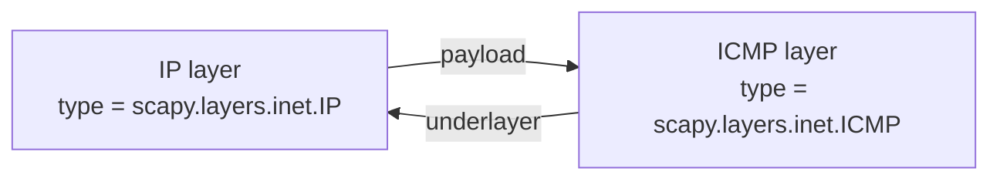

# Scapy Runtime Onboarding — Answers (Scapy source baseline @ `0925ada4`)

Welcome to the team. This document answers the specific questions you asked about how the
cloned Scapy repository *actually behaves at runtime* — not what the source tree looks like,
but what a running session shows on this machine. Every answer below leads with the direct
result, then the captured evidence, then the exact source mechanism that produces it.

> This is a **read-only investigation**. No Scapy source file was modified. The only artifact
> created is this Markdown document. Every probe ran with byte-compilation disabled and wrote
> nothing into the repository tree; any temporary scratch lived outside it. The working tree was
> confirmed unchanged and free of byte-compiled cache afterward.

---

## Environment & Metadata

| Property | Value (observed) |
|----------|------------------|
| Repository | Cloned Scapy checkout (not pip-installed) |
| Scapy source baseline | commit `0925ada4` — the Scapy source files are byte-for-byte at this commit, and every `[path:line]` citation below resolves against it (verified: `git diff --name-status 0925ada4` shows only this document as added) |
| Commit that added this document | `0a0a3437` (commit `docs: add …`, confirmed via `git log --diff-filter=A -- blitzy/documentation/scapy_0925ada48540.md`) — the commit that first introduced this document; distinct from the Scapy source baseline above, which is unchanged. Because later commits (e.g. addressing review feedback) advance `HEAD`, this provenance hash is intentionally **not** presented as the live `git rev-parse --short HEAD`, which changes with every new commit. |
| Repo root on this system | `/tmp/blitzy/scapy/blitzy-ef754fd9-de82-482c-9b3b-fccada46eab5_55352c` |
| Operating system | Linux |
| Python interpreter | **Python 3.13.7** (`python3 --version`) |
| Scapy import origin | the checkout — `scapy.__file__` → `…/scapy/__init__.py` inside the repo |
| Interactive console | **standard Python shell** — IPython is absent, so Scapy falls back to `code.interact()` |
| PyX | absent (import fails) → `psdump()`/`pdfdump()` unavailable, and a startup INFO line is printed |
| `cryptography` | installed, **v43.0.0** (relevant to a startup deprecation warning — see Q1) |
| Configuration | untouched `conf` defaults |
| Date of observation | 2026-07-14 (UTC) |

> **Note on interpreter version.** The canonical, provided interpreter on this system is
> **Python 3.13.7**, and all values below are captured under it. Per the run-first discipline,
> this document reports only what is *actually* observed on this machine.

### Methodology — run first, then write

Everything here was **executed** before being written down:

- For the **interactive banner and theme**, the console was started with the canonical launcher
  `./run_scapy` — equivalently `PYTHONPATH=<repo> python3 -m scapy` — feeding `exit()` on stdin
  so the session starts, prints, and exits non-interactively.
- For **programmatic inspection** (layer counts, verbosity, sockets, packet structure, theme
  object), short `python3 -c "…"` one-liners were run with `from scapy.all import …`.
- Every probe ran with `PYTHONDONTWRITEBYTECODE=1` (no `__pycache__`/`.pyc` created) and
  `PYTHONPATH=.` from the repo root so `import scapy` resolves to the checkout.

**Capture policy (so every fenced block is literal and reproducible).** Two consistent
conventions are used, and each block states which one applies:

- **The Q1 banner capture** is shown from the **combined stream** (`2>&1`) with **ANSI color
  codes stripped for readability** (the real output *is* colored — see Q5); the strip is done
  with `sed 's/\x1b\[[0-9;]*m//g'`. That block includes the leading startup log lines *and* the
  trailing `>>> now exiting InteractiveConsole...` line that the shell prints on exit.
- **Stdout-only captures** append `2>/dev/null` and show only what the command writes to stdout.
  This convention covers both the **Q5 interactive-theme** capture *and* every **programmatic
  `python3 -c`** probe. On this system each `from scapy.all …` import — and the interactive
  `-m scapy` startup — writes **two identical `TripleDES … CryptographyDeprecationWarning` lines
  to stderr** (from `cryptography` v43.0.0 — see Q1 for the exact text and
  `[scapy/layers/ipsec.py:573]`/`[scapy/layers/ipsec.py:577]`); `2>/dev/null` suppresses exactly
  those. For the Q5 interactive run it additionally discards the colored banner and the trailing
  `>>> now exiting InteractiveConsole...` line (both emitted on stderr), leaving only the `>>> `
  prompt and the two printed theme lines, which are on stdout; that block is likewise
  **ANSI-stripped** with the same `sed 's/\x1b\[[0-9;]*m//g'` as Q1 (its prompt/banner is
  colored). Any command that is expected to write to stderr (e.g. `ls` of a missing file) is
  instead shown with `2>&1` and its exit status, so nothing is hidden.

All explanatory annotations are kept **outside** the fenced blocks; the fences contain only
literal captured bytes, modulo two disclosed normalizations: the ANSI-color strip described
above, and a trailing-whitespace trim applied wherever the terminal emits trailing padding
(the ASCII logo in Q1 and the aligned `show()` dump in Q4). The trim removes only trailing
spaces for patch hygiene — every visible glyph, field name, and value is preserved verbatim.

Each section below records **(1)** the exact command, **(2)** the captured output in a fenced
block, **(3)** the grounded source explanation with inline `[path:line]` citations, and
**(4)** a short cause→effect rationale. Any value that is not directly observable (e.g. a
date-derived version string) is explicitly labeled **inferred** and explained from source.

---

## Q1 — What welcome message and version does Scapy display at startup?

**Direct answer.** On startup Scapy prints a colored ASCII logo beside a panel that reads
**"Welcome to Scapy"**, **"Version 2026.07.14"**, the project URL
**`https://github.com/secdev/scapy`**, **"Have fun!"**, and one **randomly chosen quote**. A few
log lines print *before* the banner. The version string `2026.07.14` is a **date**, not a
semantic tag — that is what this particular clone yields because it has no usable version tag
to describe (explained below).

**Exact command (non-interactive capture of the interactive console):**

```bash
printf 'exit()\n' | PYTHONDONTWRITEBYTECODE=1 PYTHONPATH=. python3 -m scapy 2>&1 | sed 's/\x1b\[[0-9;]*m//g'
# Canonical launcher equivalent: ./run_scapy   (which does: PYTHONPATH=$DIR exec "$PYTHON" -m scapy)
```

**Captured output** (combined `2>&1` stream, ANSI color codes stripped per the capture policy —
the real banner *is* colored, see Q5). The startup log lines precede the banner, and the
`>>> now exiting InteractiveConsole...` line is printed by the shell as it exits on the piped
`exit()`:

```
INFO: Can't import PyX. Won't be able to use psdump() or pdfdump().
INFO: No IPv6 support in kernel
/tmp/blitzy/scapy/blitzy-ef754fd9-de82-482c-9b3b-fccada46eab5_55352c/scapy/layers/ipsec.py:573: CryptographyDeprecationWarning: TripleDES has been moved to cryptography.hazmat.decrepit.ciphers.algorithms.TripleDES and will be removed from this module in 48.0.0.
  cipher=algorithms.TripleDES,
/tmp/blitzy/scapy/blitzy-ef754fd9-de82-482c-9b3b-fccada46eab5_55352c/scapy/layers/ipsec.py:577: CryptographyDeprecationWarning: TripleDES has been moved to cryptography.hazmat.decrepit.ciphers.algorithms.TripleDES and will be removed from this module in 48.0.0.
  cipher=algorithms.TripleDES,
WARNING: IPython not available. Using standard Python shell instead.
AutoCompletion, History are disabled.

                     aSPY//YASa
             apyyyyCY//////////YCa       |
            sY//////YSpcs  scpCY//Pp     | Welcome to Scapy
 ayp ayyyyyyySCP//Pp           syY//C    | Version 2026.07.14
 AYAsAYYYYYYYY///Ps              cY//S   |
         pCCCCY//p          cSSps y//Y   | https://github.com/secdev/scapy
         SPPPP///a          pP///AC//Y   |
              A//A            cyP////C   | Have fun!
              p///Ac            sC///a   |
              P////YCpc           A//A   | We are in France, we say Skappee.
       scccccp///pSP///p          p//Y   | OK? Merci.
      sY/////////y  caa           S//P   |             -- Sebastien Chabal
       cayCyayP//Ya              pY/Ya   |
        sY/PsY////YCc          aC//Yp
         sc  sccaCY//PCypaapyCP//YSs
                  spCPY//////YPSps
                       ccaacs

>>> now exiting InteractiveConsole...
```

**What varies vs. what is fixed (observed):**

- The **last panel line is a random quote** and **changes between runs**. The run above produced
  *"We are in France, we say Skappee. OK? Merci. — Sebastien Chabal"*; a second run produced
  *"Craft packets before they craft you. — Socrate"*. Treat this line as **non-deterministic**.
- The four fixed panel lines (`Welcome to Scapy`, `Version 2026.07.14`, the URL, `Have fun!`)
  are stable across runs on this checkout.

**About the startup log lines (observed before the banner).** Each `INFO:`/`WARNING:` line is
emitted from a specific source during library import:

- `INFO: Can't import PyX. Won't be able to use psdump() or pdfdump().` — logged at
  `[scapy/libs/test_pyx.py:45]` in the `except ImportError` branch that runs because the optional
  PyX dependency is absent here.
- `INFO: No IPv6 support in kernel` — logged at `[scapy/route6.py:66]` when the constructed IPv6
  routing table comes back empty on this host.
- `WARNING: IPython not available. Using standard Python shell instead.` /
  `AutoCompletion, History are disabled.` — logged at `[scapy/main.py:574-576]` in the
  `except ImportError` branch of `interact()` that runs because IPython is absent, which is why
  the console is the standard Python shell.

**About the two `TripleDES … CryptographyDeprecationWarning` lines (observed on this system).**
These two lines **are printed at startup on this machine** because `cryptography` **v43.0.0** is
installed and Scapy's IPsec layer constructs DES/3DES cipher algorithms using
`algorithms.TripleDES` at `[scapy/layers/ipsec.py:573]` (the `DES` entry) and
`[scapy/layers/ipsec.py:577]` (the `3DES` entry). `cryptography` emits a `DeprecationWarning`
for `TripleDES` in this version range, so importing the IPsec layer (pulled in via
`scapy.all`) surfaces the warning. This is **environment-dependent**: on hosts with an older
`cryptography` the warning may not appear. It is reported here because it is genuinely observed
in this session.

**Source explanation — how the banner is built:**

- **Entry chain.** `run_scapy` sets `PYTHONPATH` and runs `exec "$PYTHON" -m scapy` `[run_scapy:13]`.
  `python -m scapy` executes `scapy/__main__.py`, which does `from scapy.main import interact`
  `[scapy/__main__.py:13]` and calls `interact()` `[scapy/__main__.py:15]`. The packaged console
  script maps `scapy = "scapy.main:interact"` `[pyproject.toml:46-47]`, and the distribution
  version is dynamic from `scapy.VERSION` `[pyproject.toml:77-78]` (`requires-python = ">=3.7, <4"`
  `[pyproject.toml:17]`).
- **Banner assembly.** `interact()` `[scapy/main.py:503]` builds the panel list
  `[scapy/main.py:628-639]`: `"   | Welcome to Scapy"` `[scapy/main.py:632]`,
  `"   | Version %s" % conf.version` `[scapy/main.py:633]`, the GitHub URL `[scapy/main.py:635]`,
  and `"   | Have fun!"` `[scapy/main.py:637]`. The random quote is appended via
  `quote, author = choice(QUOTES)` `[scapy/main.py:646]` → `_prepare_quote(...)`
  `[scapy/main.py:647]` (the `QUOTES` list is defined at `[scapy/main.py:49]`,
  `_prepare_quote` at `[scapy/main.py:476]`). This `choice(...)` is exactly why the quote line
  differs run-to-run.
- **Version source.** The printed version is `conf.version` `[scapy/main.py:633]`, a read-only
  attribute wired to the module-level `VERSION` `[scapy/config.py:726]`, and
  `VERSION = __version__ = _version()` `[scapy/__init__.py:169]`.

**Cause→effect — why the version is `2026.07.14` (the key mechanism).**
`_version()` `[scapy/__init__.py:122]` tries five strategies in order and returns the first that
succeeds:

1. `os.environ['SCAPY_VERSION']` `[scapy/__init__.py:129-133]` — **unset** here → `KeyError`,
   skipped. *(Verified: `echo "${SCAPY_VERSION:-<unset>}"` → `<unset>`.)*
2. The packaged `VERSION` file `[scapy/__init__.py:135-143]` — **absent** in a clone →
   `FileNotFoundError`, skipped. *(Verified with the combined stream and exit status:
   `ls scapy/VERSION 2>&1` prints `ls: cannot access 'scapy/VERSION': No such file or directory`
   and exits with status `2`.)*
3. `_version_from_git_archive()` `[scapy/__init__.py:145-149]` — raises
   `ValueError('not a git archive')` because the `$Format:…$` placeholder is unsubstituted in a
   clone `[scapy/__init__.py:56]`, skipped.
4. `_version_from_git_describe()` `[scapy/__init__.py:151-155]` — fails because
   `git describe --tags --always --long` returns a **bare commit hash with no tag** (this
   history carries no version tag), so the tag parse raises and is caught. *(Verified: this
   history is untagged at every point, so `git describe --tags --always --long` yields such a
   bare commit whichever commit `HEAD` currently points at — the specific hash advances as new
   commits (e.g. review-feedback fixes) are added, so it is deliberately not pinned to a literal
   value here — and the Scapy source baseline is likewise untagged,
   `git describe --tags --always --long 0925ada4` → `0925ada4`. Either way the result is a bare
   commit, so this step is skipped. When Scapy authored the version, `_version()` ran against the
   same untagged history, hence the fallback below.)*
5. **Fallback** `[scapy/__init__.py:157-163]` — returns the **modification time** of
   `scapy/__init__.py`, formatted `d.strftime('%Y.%m.%d')`. On this checkout that mtime is
   2026-07-14, so the version resolves to **`2026.07.14`**.

Verified two ways (both print the value on stdout; the first appends `2>/dev/null`, and the
second is clean without it via the timezone-aware form explained below):

```bash
PYTHONDONTWRITEBYTECODE=1 PYTHONPATH=. python3 -c "from scapy.all import conf; print(conf.version)" 2>/dev/null
# reproduce the fallback's mtime computation directly:
PYTHONDONTWRITEBYTECODE=1 PYTHONPATH=. python3 -c "import os,datetime; print(datetime.datetime.fromtimestamp(os.path.getmtime('scapy/__init__.py'), datetime.UTC).strftime('%Y.%m.%d'))"
```

```
2026.07.14
2026.07.14
```

The reproduction uses the timezone-aware `datetime.fromtimestamp(..., datetime.UTC)` rather than
the library's own `datetime.utcfromtimestamp(...)` call at `[scapy/__init__.py:160]`: on Python
3.13 the latter is deprecated and, when run directly in a `-c` command, prints an unrelated
`DeprecationWarning`. Both forms compute the same value; the aware form keeps this probe's output
clean. (Scapy's import-time call does not surface that warning under the default warning filters.)

> **Observed vs. inferred:** the printed string **`2026.07.14` is observed** (it appears in the
> banner and in `conf.version`). However, because it derives from a *file mtime*, its **specific
> value is inferred to be environment/checkout-dependent** — it would differ if `__init__.py`
> were re-touched or the clone were re-made at a different time. That is precisely why the banner
> shows a **date-like** version instead of a semantic version tag.

---

## Q2 — How many protocol layers are *actually loaded and ready to use*?

**Direct answer.** At runtime there are **49 configured layer modules** (`conf.load_layers`) and
**1319 registered protocol classes** (`conf.layers`). This is deliberately **different** from the
**57 layer source files** on disk — the question asks what is *loaded and ready*, not how many
files exist.

**Exact commands** (probe values are stdout only, `2>/dev/null` per the capture policy):

```bash
PYTHONDONTWRITEBYTECODE=1 PYTHONPATH=. python3 -c "from scapy.all import conf; print('load_layers', len(conf.load_layers)); print('layers', len(conf.layers))" 2>/dev/null
ls scapy/layers/*.py | wc -l   # source-file count, for contrast
```

**Captured output:**

```
load_layers 49
layers 1319
57
```

**Proving "loaded and ready" (not merely listed).** `conf.load_layers` is a plain list of module
names, and the loader `[scapy/layers/all.py:24-29]` wraps each `load_layer(...)` in a
`try/except` that **logs a warning and continues** if a module fails to import — so a nonzero
`len(conf.load_layers)` alone would *not* prove the modules actually loaded. The following
failure-capable probe asserts that every configured `scapy.layers.<name>` is present in
`sys.modules` and prints any that are missing:

```bash
PYTHONDONTWRITEBYTECODE=1 PYTHONPATH=. python3 -c "
import sys
from scapy.all import conf
missing = [n for n in conf.load_layers if 'scapy.layers.%s' % n not in sys.modules]
print('configured modules:', len(conf.load_layers))
print('loaded (in sys.modules):', len(conf.load_layers) - len(missing))
print('missing:', missing)
" 2>/dev/null
```

```
configured modules: 49
loaded (in sys.modules): 49
missing: []
```

An empty `missing` list with `49/49` confirms all configured layer modules are genuinely
imported and ready — not just enumerated.

**Source explanation:**

- `conf.load_layers` `[scapy/config.py:848]` is the list of layer **modules** loaded on import.
  The literal list in `config.py` `[scapy/config.py:849-896]` holds **48** module names (the
  comment `[scapy/config.py:847]` notes that CAN, TLS, HTTP and a few others are *not* loaded by
  default); on Linux/BSD the arch layer then appends `tuntap`
  `[scapy/arch/__init__.py:148-151]`, giving the **49** observed here.
- These 49 modules are imported when `scapy.all` runs `from scapy.layers.all import *`
  `[scapy/all.py:40]`, which drives the loader loop `[scapy/layers/all.py:24-29]`.
- `conf.layers` is a `LayersList()` `[scapy/config.py:735]`; the class `LayersList`
  `[scapy/config.py:265]` exposes `register()` `[scapy/config.py:278]`. Every **non-private**
  metaclass-created `Packet` class auto-registers itself into this list: the metaclass registers
  `newcls` only when its name does not start with `_` (`if newcls.__name__[0] != "_":`
  `[scapy/base_classes.py:367]`) by calling `config.conf.layers.register(newcls)`
  `[scapy/base_classes.py:369]`. Importing `scapy.all` `[scapy/all.py:40]` pulls in the
  **default configured set** of layers, triggering registration of **1319** classes.
- The source tree has **57** files matching `scapy/layers/*.py`.

**Cause→effect.** The three numbers measure three different things, which is why they differ:

- **49 modules** (`conf.load_layers`) — the layer *modules* Scapy loads by default. Not every
  file under `scapy/layers/` is listed here, so this is smaller than the file count.
- **1319 classes** (`conf.layers`) — the *protocol classes* registered at runtime. Each loaded
  module typically defines **many** `Packet` subclasses, and registered classes also come from
  modules **outside** `scapy/layers/` (core/base protocols). Hence classes ≫ modules.
- **57 files** — a static count of source files, which is *not* what "loaded and ready to use"
  means.

So the answer to "how many are actually loaded and ready" is the **runtime** pair —
**49 modules / 1319 classes** — explicitly not the 57 files on disk.

---

## Q3 — Default configuration: verbosity and socket implementation

### Q3a — What is the verbosity level at startup?

**Direct answer.** `conf.verb` is **2**.

**Exact command:**

```bash
PYTHONDONTWRITEBYTECODE=1 PYTHONPATH=. python3 -c "from scapy.all import conf; print(conf.verb)" 2>/dev/null
```

**Captured output:**

```
2
```

**Source.** `verb = 2  #: level of verbosity, from 0 (almost mute) to 3 (verbose)`
`[scapy/config.py:759]`.

**Cause→effect.** `verb` is a plain class attribute initialized to `2` on `class Conf(ConfClass)`
— `verb = 2` `[scapy/config.py:759]` — and the runtime singleton `conf = Conf()`
`[scapy/config.py:951]` inherits that value. Nothing in the default startup path reassigns it, so
a fresh default session begins at verbosity **2** (the mid-scale level) unless the user explicitly
sets `conf.verb`. That is precisely why the send/receive operations examined in Q3b read `2` as
their default verbosity.

### Q3b — What does that number actually mean for output behavior?

**Direct answer.** Verbosity is a **0–3 scale** — **0** is "almost mute", **3** is "verbose".
There is no single global switch; each send/receive operation gates its own output against the
current `verbose` value with **operation-specific thresholds**. At the default **2** you get the
full send/receive summaries and per-result detail (the `> 1` paths), while the one **level-3**
extra — `sendpfast()` dumping the raw `tcpreplay` stdout — stays off.

**Exact command** (safe, read-only source inspection — no packets are sent):

```bash
# 1) the documented scale, at the definition of conf.verb:
sed -n '759p' scapy/config.py
# 2) every place verbosity gates output in the send/receive engine:
grep -n "if verbose:\|if self.verbose:\|verbose > 1\|self.verbose > 1\|verbose == 1\|if verbose and\|conf.verb > 2" scapy/sendrecv.py
```

**Captured output:**

```
    verb = 2  #: level of verbosity, from 0 (almost mute) to 3 (verbose)
216:        if verbose:
238:            if self.verbose:
249:            if self.verbose:
282:                    if self.verbose > 1:
297:            if self.verbose > 1:
379:                if verbose:
391:    if verbose:
552:            elif conf.verb > 2:
745:            if verbose > 1:
750:            if verbose > 1 and prn and len(res[0]) > 0:
756:            if verbose > 1 and prnfail and len(res[1]) > 0:
762:            if verbose > 1 and not (prn or prnfail):
766:            if verbose == 1:
780:    if verbose and n > 0:
```

**Source explanation — the scale, bounded to each operation.** The scale is documented at the
definition: *"from 0 (almost mute) to 3 (verbose)"* `[scapy/config.py:759]`. `conf.verb` is the
default each send/receive entry point copies into a local `verbose` when the caller passes none:
`verbose = conf.verb` at `[scapy/sendrecv.py:133]` (the `SndRcvHandler`),
`[scapy/sendrecv.py:355]` (`__gen_send`), and `[scapy/sendrecv.py:730]` (`__sr_loop`). Each operation
then gates its own output, and the thresholds differ:

- **Truthy gate (`verbose` / `self.verbose`)** — lines that appear at level ≥ 1 and are silenced
  at level 0: `[scapy/sendrecv.py:216]`, `[scapy/sendrecv.py:238]`, `[scapy/sendrecv.py:249]`,
  `[scapy/sendrecv.py:379]`, `[scapy/sendrecv.py:391]`, and the trailing summary
  `[scapy/sendrecv.py:780]`.
- **`== 1` gate** — a compact single-line loop indicator specific to level 1:
  `[scapy/sendrecv.py:766]`.
- **`> 1` gate** — the detailed per-result output enabled at level ≥ 2 (so on at the default):
  `[scapy/sendrecv.py:282]`, `[scapy/sendrecv.py:297]`, `[scapy/sendrecv.py:745]`,
  `[scapy/sendrecv.py:750]`, `[scapy/sendrecv.py:756]`, `[scapy/sendrecv.py:762]`.
- **`conf.verb > 2` gate** — **not** a general level-3 switch: it is specific to `sendpfast()`
  `[scapy/sendrecv.py:486]` and prints the raw `tcpreplay` **stdout** only at level 3:
  `elif conf.verb > 2:` `[scapy/sendrecv.py:552]`.

**Cause→effect — what the default 2 means, level by level.**

- **Level 0 ("almost mute")** — every truthy-gated line above is suppressed; operations run
  essentially silently.
- **Level 1** — the truthy-gated lines appear, plus the compact `== 1` loop indicator
  `[scapy/sendrecv.py:766]`; the `> 1` detail paths stay off.
- **Level 2 (the default)** — additionally the `> 1` detail paths turn on
  `[scapy/sendrecv.py:282]`, `[scapy/sendrecv.py:297]`, `[scapy/sendrecv.py:745]`,
  `[scapy/sendrecv.py:750]`, `[scapy/sendrecv.py:756]`, `[scapy/sendrecv.py:762]`, giving full
  send/receive summaries and per-result detail; the `sendpfast` `> 2` stdout dump stays off.
- **Level 3 ("verbose")** — additionally `sendpfast()` dumps the raw `tcpreplay` stdout
  `[scapy/sendrecv.py:552]`.

So the default of **2** yields normal, detailed send/receive output while withholding only the
`sendpfast`/`tcpreplay` raw-stdout dump that requires level 3. *(The thresholds are read directly
from source above; fully exercising each branch requires live send/receive, so the inspection
grounds the per-operation behavior, and the runtime value `2` is observed via `conf.verb` in
Q3a.)*

### Q3c — What networking socket implementation is used on this system?

**Direct answer.** Native **Linux `PF_PACKET` sockets** — `L3PacketSocket` (layer 3),
`L2Socket` (layer 2), `L2ListenSocket` (layer-2 listen) — **not** libpcap and **not** BPF
(`use_pcap=False`, `use_bpf=False`).

**Exact command:**

```bash
PYTHONDONTWRITEBYTECODE=1 PYTHONPATH=. python3 -c "from scapy.all import conf; print('L3socket', conf.L3socket); print('L2socket', conf.L2socket); print('L3socket6', conf.L3socket6); print('L2listen', conf.L2listen); print('use_pcap', conf.use_pcap); print('use_bpf', conf.use_bpf)" 2>/dev/null
```

**Captured output:**

```
L3socket <L3PacketSocket: read/write packets at layer 3 using Linux PF_PACKET sockets>
L2socket <L2Socket: read/write packets at layer 2 using Linux PF_PACKET sockets>
L3socket6 functools.partial(<L3PacketSocket: read/write packets at layer 3 using Linux PF_PACKET sockets>, filter='ip6')
L2listen <L2ListenSocket: read packets at layer 2 using Linux PF_PACKET sockets. Also receives the packets going OUT>
use_pcap False
use_bpf False
```

**Source explanation.** Socket classes are chosen by `_set_conf_sockets()`
`[scapy/config.py:606]`. Because `conf.use_pcap` and `conf.use_bpf` are both `False`, the
libpcap branch `[scapy/config.py:620-634]` and the BPF branch `[scapy/config.py:635-644]` are
skipped, and the **`if LINUX:` branch `[scapy/config.py:645-658]`** runs, wiring
`conf.L3socket = L3PacketSocket`,
`conf.L3socket6 = functools.partial(L3PacketSocket, filter="ip6")`,
`conf.L2socket = L2Socket`, and `conf.L2listen = L2ListenSocket`. These classes
live in `scapy/arch/linux.py`: `class L2Socket(SuperSocket)` `[scapy/arch/linux.py:475]`,
`class L2ListenSocket(L2Socket)` `[scapy/arch/linux.py:579]`, and
`class L3PacketSocket(L2Socket)` `[scapy/arch/linux.py:587]`. Before `_set_conf_sockets()` runs,
all four `conf` socket attributes default to `None` — `L3socket` `[scapy/config.py:772]`,
`L3socket6` `[scapy/config.py:773]`, `L2socket` `[scapy/config.py:774]`, and `L2listen`
`[scapy/config.py:775]`.

**Cause→effect.** On this Linux host, with libpcap/BPF disabled, Scapy sends and receives via
the **kernel's native `PF_PACKET` interface** at layers 2 and 3 — not libpcap, not BPF. The IPv6
layer-3 socket is the same `L3PacketSocket` pre-bound with an `ip6` filter via
`functools.partial`. That is the concrete socket implementation "on this system".

---

## Q4 — What is the actual structure of a basic ICMP ping packet?

**Direct answer.** `IP()/ICMP()` is **not** a single flat/composite object. It is a
**doubly-linked chain of two distinct `Packet` objects**: an outer **`IP`** whose `.payload` is a
separate **`ICMP`** object, and that `ICMP`'s `.underlayer` points back to the `IP`. The two
layers are `scapy.layers.inet.IP` and `scapy.layers.inet.ICMP`.

**Exact command:**

```bash
PYTHONDONTWRITEBYTECODE=1 PYTHONPATH=. python3 -c "
from scapy.all import IP, ICMP
p = IP()/ICMP()
print('type(p):', type(p))
print('layers():', p.layers())
print('payload type:', type(p.payload))
print('p[ICMP].underlayer:', type(p[ICMP].underlayer))
print('payload.underlayer is p:', p.payload.underlayer is p)
print('command():', p.command())
print('summary():', p.summary())
p.show()
" 2>/dev/null
```

**Captured output** (stdout only, `2>/dev/null` per the capture policy):

```
type(p): <class 'scapy.layers.inet.IP'>
layers(): [<class 'scapy.layers.inet.IP'>, <class 'scapy.layers.inet.ICMP'>]
payload type: <class 'scapy.layers.inet.ICMP'>
p[ICMP].underlayer: <class 'scapy.layers.inet.IP'>
payload.underlayer is p: True
command(): IP()/ICMP()
summary(): IP / ICMP 127.0.0.1 > 127.0.0.1 echo-request 0
```

And the `p.show()` layered dump:

```
###[ IP ]###
  version   = 4
  ihl       = None
  tos       = 0x0
  len       = None
  id        = 1
  flags     =
  frag      = 0
  ttl       = 64
  proto     = icmp
  chksum    = None
  src       = 127.0.0.1
  dst       = 127.0.0.1
  \options   \
###[ ICMP ]###
     type      = echo-request
     code      = 0
     chksum    = None
     id        = 0x0
     seq       = 0x0
     unused    = ''
```

**Source explanation — a chain, not a merged object:**

- The `/` operator is `__div__` / `__truediv__` `[scapy/packet.py:596-607]`. It **copies both
  operands** (`cloneA = self.copy()`, `cloneB = other.copy()`) and calls
  `cloneA.add_payload(cloneB)`, returning `cloneA` (the outer `IP`).
- `add_payload` `[scapy/packet.py:360-377]` sets `self.payload = payload` and back-links via
  `payload.add_underlayer(self)`, establishing the **bidirectional** link.
- Each layer is a subclass of `class Packet` `[scapy/packet.py:77]`:
  `class IP(Packet, IPTools)` `[scapy/layers/inet.py:521]` and `class ICMP(Packet)`
  `[scapy/layers/inet.py:952]`. The specific `IP`→`ICMP` binding that makes `ICMP` a valid IP
  payload (and sets `proto=1` for dissection) is declared by
  `bind_layers(IP, ICMP, frag=0, proto=1)` `[scapy/layers/inet.py:1112]`. (The nearby
  `bind_layers(Ether, IP, type=2048)` `[scapy/layers/inet.py:1101]` is the *Ethernet*→`IP`
  binding, not the one exercised here.)
- The observations above come from `Packet` methods used directly by the probe:
  `layers()` `[scapy/packet.py:1228]` returns the ordered list of layer classes,
  `show()` `[scapy/packet.py:1459]` prints the hierarchical per-layer dump, and
  `command()` `[scapy/packet.py:1662]` reconstructs the constructor string `IP()/ICMP()`.

**The bidirectional payload/underlayer relationship:**



**Cause→effect.** `p.layers() == [IP, ICMP]` together with `p.payload.underlayer is p → True`
proves a **two-node, bidirectionally linked** chain (composition — not a single merged object).
`type(p)` is the **outer `IP`**; `p.command()` reproduces exactly `IP()/ICMP()`, confirming the
object is precisely two stacked layers; and the `p.show()` dump visually confirms the nested
`###[ IP ]###` then `###[ ICMP ]###` structure. The ICMP layer's default `type = echo-request`
is exactly the classic **ping** request — so `IP()/ICMP()` is an ICMP echo-request stacked on IP.

---

## Q5 — Which terminal theme is active by default, and what is it called in the code?

**Direct answer.** In an interactive session the active theme is **`DefaultTheme`** — that is
also its **class name in the code**. (The configuration-level default before the console starts
is `NoTheme`, and a Windows-without-IPython session would use `BlackAndWhite`; neither applies to
this Linux session.)

**Exact command — active theme in the interactive session** (stdout only via `2>/dev/null`,
ANSI-stripped as in Q1):

```bash
printf 'print("THEME_NAME:", type(conf.color_theme).__name__); print("THEME_REPR:", repr(conf.color_theme)); exit()\n' | PYTHONDONTWRITEBYTECODE=1 PYTHONPATH=. python3 -m scapy 2>/dev/null | sed 's/\x1b\[[0-9;]*m//g'
```

**Captured output:**

```
>>> THEME_NAME: DefaultTheme
THEME_REPR: <DefaultTheme>
```

The leading `>>> ` on the first line is Scapy's interactive prompt (written to stdout and colored
via the active theme; the ANSI codes are stripped here). `2>/dev/null` discarded the banner and
the two TripleDES warnings, which are emitted on stderr. So in the interactive session
`type(conf.color_theme).__name__` is `DefaultTheme` and `repr(conf.color_theme)` is
`<DefaultTheme>`.

**Exact command — configuration-level default on a bare library import** (no `interact()`):

```bash
PYTHONDONTWRITEBYTECODE=1 PYTHONPATH=. python3 -c "from scapy.all import conf; print(type(conf.color_theme).__name__, repr(conf.color_theme))" 2>/dev/null
```

**Captured output:**

```
NoTheme <NoTheme>
```

**Source explanation — active theme and its code name:**

- In the interactive console the active theme is **`DefaultTheme`**, set by
  `conf.color_theme = DefaultTheme()` `[scapy/main.py:514]` (immediately after
  `conf.interactive = True` `[scapy/main.py:513]`). The class is
  `class DefaultTheme(AnsiColorTheme)` `[scapy/themes.py:167]`; its `style_*` attributes — from
  `style_normal`/`style_prompt` through `style_logo` `[scapy/themes.py:167-190]` — carry the ANSI
  color codes that make the banner and output colored.
- **Contrast / edge cases (observed and source-grounded):** the **configuration-level default**
  is `NoTheme()` `[scapy/config.py:818]` — observed on a bare `from scapy.all import *` *before*
  `interact()` overrides it (`NoTheme <NoTheme>` above). `BlackAndWhite()` is substituted **only
  on Windows-without-IPython** `[scapy/main.py:578-582]`
  (`class BlackAndWhite(AnsiColorTheme, NoTheme)` `[scapy/themes.py:163]`) — that branch is
  **not** taken on this Linux system.

**Cause→effect.** `interact()` overrides the `NoTheme` config default with `DefaultTheme`, and
the banner is rendered through `conf.color_theme.logo(...)` and `conf.color_theme.success(...)`
`[scapy/main.py:649-655]`. Because `DefaultTheme` carries ANSI styles, the startup banner appears
**colored** — which is exactly why the Q1 banner is colored. On this Linux + no-IPython system
the Windows `BlackAndWhite` branch is skipped, so `DefaultTheme` remains active. Its **code name
is `DefaultTheme`**.

---

## Coverage Summary

| # | Question | Observed answer |
|---|----------|-----------------|
| Q1 | Startup banner & version | Colored ASCII logo + panel: "Welcome to Scapy", **Version `2026.07.14`**, GitHub URL, "Have fun!", + a **random** quote; preceded by PyX/IPv6 INFO, two TripleDES deprecation warnings (cryptography 43.0.0), and the IPython-absent WARNING. Version is the **mtime fallback**. |
| Q2 | Loaded protocol layers (runtime) | **49** configured layer modules (`conf.load_layers`) and **1319** registered protocol classes (`conf.layers`) — vs **57** `scapy/layers/*.py` source files. |
| Q3a | Startup verbosity level | `conf.verb` = **2**. |
| Q3b | Meaning of verbosity | Scale **0 (almost mute) → 3 (verbose)** with **operation-specific** thresholds; default **2** turns on the `> 1` detail paths (full send/receive summaries), while the `sendpfast`/`tcpreplay` raw-stdout dump gated at `conf.verb > 2` stays off. |
| Q3c | Socket implementation | Native Linux **`PF_PACKET`** sockets — `L3PacketSocket` / `L2Socket` / `L2ListenSocket` (+ `partial(L3PacketSocket, filter='ip6')`); `use_pcap=False`, `use_bpf=False`. |
| Q4 | ICMP ping packet structure | **Doubly-linked chain**, not a flat composite: outer `IP` → `.payload` `ICMP`, `ICMP.underlayer` → `IP`; `p.command() == 'IP()/ICMP()'`; layer types `scapy.layers.inet.IP` and `…ICMP`. |
| Q5 | Default terminal theme | **`DefaultTheme`** in the interactive session (config default is `NoTheme`; Windows-no-IPython would be `BlackAndWhite`). |

---

## Reproducibility & Read-Only Notes

- **Read-only:** no Scapy source file was modified, created, or deleted. Every `scapy/*` path
  above is a **reference**, cited inline as `[path:line]` against the Scapy source baseline
  `0925ada4`. Verified: `git diff --name-status 0925ada4` reports a single added path,
  `A  blitzy/documentation/scapy_0925ada48540.md`, and all **18** distinct cited paths — the
  16 `scapy/*` source files plus the `pyproject.toml` manifest and the `run_scapy` launcher —
  are byte-identical to that baseline.
- **Commits:** the Scapy source baseline is commit `0925ada4`, while this document was first
  added by commit `0a0a3437` (`docs: add …`, per `git log --diff-filter=A` on this file). These
  are distinct commits, and the Scapy source tree itself is unchanged from the baseline. `HEAD`
  advances beyond `0a0a3437` as later commits are made (for example, ones addressing review
  feedback), so `0a0a3437` is recorded here as the document's provenance rather than as the live
  `git rev-parse --short HEAD` output.
- **Cleanup:** all probes ran with `PYTHONDONTWRITEBYTECODE=1` (so no new `__pycache__`/`.pyc`
  were created), and any temporary scratch lived **outside** the repository tree. Pre-existing
  byte-compiled cache was also removed so the repository is byte-clean. Verified literally:
  `find . -type d -name __pycache__ | wc -l` → `0`, `find . -type f -name '*.pyc' | wc -l` → `0`;
  `git status --porcelain` returns zero lines; and `git status --ignored --porcelain` reports no
  `__pycache__`/`.pyc` residue.
- **Environment sensitivity:** the version string (`2026.07.14`) is derived from a file mtime and
  the banner quote is random — both are expected to vary. The two TripleDES deprecation warnings
  depend on the installed `cryptography` version (v43.0.0 here). The remaining values
  (49 / 1319 / 57, `conf.verb = 2`, the socket classes, the `IP`/`ICMP` structure, `DefaultTheme`)
  are those captured on **this exact host and configuration** — Python 3.13.7 on this Linux host,
  Scapy from the `0925ada4` checkout, the standard Python shell (IPython absent), and default
  `conf`. They can differ under a different interpreter, platform, optional-dependency posture
  (for example `SCAPY_USE_LIBPCAP` selecting libpcap sockets), or host routing state — so treat
  them as accurate for this captured session rather than for Linux in general.
