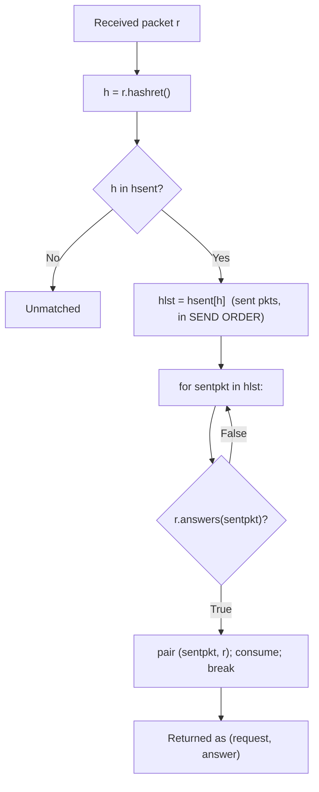

# Why Scapy's `sr()`/`sr1()`/`srp()` match a response to the wrong probe across multiple gateways

*A code-grounded root-cause analysis against branch `scapy_0925ada48540` @ HEAD `0925ada4` (`scapy.VERSION = 2026.06.26`). Every technical claim below is paired with a `path:line` citation into the read-only Scapy source, and the worked examples were produced by driving the real in-repository `hashret()`/`answers()` and a faithful copy of the `SndRcvHandler` matching loop over in-memory packets (no root, no live network).*

---

## 1. Question & TL;DR root cause

You are building a network-path-probing tool that fires ICMP probes at several distinct destinations — tunnel endpoints / gateways — using Scapy's send-and-receive primitives (`sr()`/`sr1()`/`srp()`). The defect you see is a **cross-gateway mismatch**: a response that physically originated at gateway **B** is handed back by Scapy paired with the probe you sent to gateway **A**, i.e. an incorrect `(request, answer)` couple. You have already proven the wire is correct — `tcpdump` shows each response arriving from the correct gateway and Wireshark confirms each probe carries distinct addresses — so the fault is in **Scapy's in-process matching logic**, not on the network.

You also reported a set of remediation attempts that did not fix it: setting `conf.checkIPsrc = False` **and** `conf.checkIPaddr = False`; assigning each probe a unique ICMP sequence number; using ICMP-based probes; sending sequentially with delays; "disabling `multi_recv`"; and reading `hashret`/`answers` without finding why matching fails when destination IPs differ.

> **TL;DR — the root cause.** Scapy matches replies to probes in **two stages**: (1) it buckets every sent packet by its `hashret()` value `[scapy/sendrecv.py:L244]`, then (2) for each received packet it scans the matching bucket **in send order** and pairs the reply with the **first** (earliest-sent) probe whose `answers()` returns true `[scapy/sendrecv.py:L276-L292]`. By setting **both** `conf.checkIPsrc=False` and `conf.checkIPaddr=False`, you removed the source/destination IP address from **both** stages — from the bucket key in `IP.hashret` `[scapy/layers/inet.py:L577,L581]` and from the address comparison in `IP.answers` `[scapy/layers/inet.py:L595,L607]`. For plain ICMP **echo** probes that share the same `(id, seq)` — and the ICMP `id` defaults to a fixed `0` `[scapy/layers/inet.py:L957]` — probes to different gateways then produce an **identical** `hashret()` and land in the **same bucket**, while `answers()` no longer compares addresses. A single reply therefore satisfies `answers()` for *any* member of that bucket and is paired with the **earliest-sent** member — frequently a probe to the wrong gateway. In other words, **disabling `conf.checkIPaddr` is the very action that *causes* the cross-gateway mismatch**, because once ICMP `id`/`seq` collide the destination IP is the *only* field that distinguishes these probes. Note up front that `multi_recv` is not a Scapy parameter at all (passing it raises a `TypeError` rather than changing matching — see Section 7), and that none of this involves Scapy's separate `IPSession`/`TCPSession` reassembly machinery (see Section 10).

---

## 2. How Scapy matches replies to probes (two-stage algorithm + call chain)

### 2.1 The call chain

The public send-and-receive functions all funnel into one matching engine:

- `sr1()` `[scapy/sendrecv.py:L656]` calls `sr()` `[scapy/sendrecv.py:L635]`, which calls `sndrcv()` `[scapy/sendrecv.py:L322]`, which constructs and drives the `SndRcvHandler` class `[scapy/sendrecv.py:L100]`.
- The layer-2 variants `srp()` `[scapy/sendrecv.py:L668]` and `srp1()` `[scapy/sendrecv.py:L693]` follow the **same** path through `sndrcv()` and `SndRcvHandler` — only the socket layer differs. So the `srp()` in your question is matched by exactly the same logic analysed here.

All of these return the documented stimulus-response result: a list of `(request, answer)` couples plus the unmatched packets. The couples are produced entirely by the two-stage matcher below.

### 2.2 Stage 1 — bucketing sent packets by `hashret()`

As each packet is transmitted, `SndRcvHandler` indexes it into a dictionary of buckets keyed by its `hashret()`, appending to a list so that **send order is preserved within each bucket** `[scapy/sendrecv.py:L244]`:

```python
self.hsent.setdefault(p.hashret(), []).append(p)
```

The intent is that a reply will compute the *same* `hashret()` as the request it answers, so the matcher only has to search one small bucket instead of every outstanding probe. The bucket is therefore a **coarse content key**; whatever fields `hashret()` folds in are the fields that separate probes into different buckets. This is the first place IP addresses can enter — or leave — the matching decision (Section 3).

### 2.3 Stage 2 — first `answers()` hit, in send order

For each received packet `r`, `_process_packet` `[scapy/sendrecv.py:L270]` computes `h = r.hashret()`, looks up `hlst = self.hsent[h]`, iterates the bucket **in send order**, and pairs `r` with the **first** `sentpkt` for which `r.answers(sentpkt)` is true. In the default non-`multi` mode it then deletes that sent packet from the bucket and `break`s `[scapy/sendrecv.py:L276-L292]`:

```python
h = r.hashret()
if h in self.hsent:
    hlst = self.hsent[h]
    for i, sentpkt in enumerate(hlst):
        if r.answers(sentpkt):
            self.ans.append(QueryAnswer(sentpkt, r))
            if self.verbose > 1:
                os.write(1, b"*")
            ok = True
            if not self.multi:
                del hlst[i]
                self.noans += 1
            else:
                if not hasattr(sentpkt, '_answered'):
                    self.noans += 1
                sentpkt._answered = 1
            break
```

**The decisive consequence:** *if a bucket holds more than one sent packet, the reply is paired with the **earliest-sent** member whose `answers()` returns true — not necessarily the true originator.* The matcher never looks for a "best" match; it takes the first acceptable one and stops at the `break`. So the entire question of correctness reduces to two things: **what goes into the bucket key (`hashret`)** and **what `answers()` actually compares**.



---

## 3. Where IP addresses enter matching (gated by `conf.checkIPsrc`/`conf.checkIPaddr`)

The IP addresses you rely on to tell gateways apart only participate in matching when the configuration flags allow it. Both matching stages gate on the same flags.

### 3.1 `IP.hashret` — the bucket key

`IP.hashret` `[scapy/layers/inet.py:L568-L581]` folds the source/destination addresses into the bucket key **only when both** `conf.checkIPsrc` and `conf.checkIPaddr` are true `[scapy/layers/inet.py:L577]`; otherwise it falls back to a key of just the protocol byte plus the payload hash `[scapy/layers/inet.py:L581]`:

```python
if conf.checkIPsrc and conf.checkIPaddr:
    return (strxor(inet_pton(socket.AF_INET, self.src),
                   inet_pton(socket.AF_INET, self.dst)) +
            struct.pack("B", self.proto) + self.payload.hashret())
return struct.pack("B", self.proto) + self.payload.hashret()
```

So with the default flags, the address pair is XOR-folded (`strxor(src, dst)`) into the key and two probes to different destinations get **different** keys. Turn the flags off and the addresses vanish from the key — leaving only `proto` + the payload's own `hashret()`.

### 3.2 `IP.answers` — the confirmation test

`IP.answers` `[scapy/layers/inet.py:L583-L610]` performs its address comparisons **only inside `if conf.checkIPaddr:` guards**. The "reply source must equal my destination" check `self.dst != other.src` `[scapy/layers/inet.py:L598]` sits under `if conf.checkIPaddr:` `[scapy/layers/inet.py:L595]`, and the symmetric "reply destination must equal my source" check is written as `conf.checkIPaddr and (self.src != other.dst)` `[scapy/layers/inet.py:L607]`. When `conf.checkIPaddr` is false, **both** of these address comparisons are skipped, and `answers()` is left checking only the protocol and the payload.

### 3.3 The defaults (the safe baseline)

`scapy/config.py` ships these matching-control flags defaulting to:

- `checkIPsrc = True` `[scapy/config.py:L751]`
- `checkIPaddr = True` `[scapy/config.py:L752]`
- `checkIPID = False` `[scapy/config.py:L748]`
- `checkIPinIP = True` `[scapy/config.py:L755]`

### 3.4 The key insight

Setting **both** `conf.checkIPsrc` and `conf.checkIPaddr` to `False` simultaneously **(a)** drops the addresses from the **bucket key** (Stage 1, via `[scapy/layers/inet.py:L577,L581]`) and **(b)** drops the address comparison from **`answers()`** (Stage 2, via `[scapy/layers/inet.py:L595,L607]`). After that, the only remaining discriminators between two ICMP probes are the **protocol** byte and the **ICMP payload's `(id, seq)`**. If those collide, nothing distinguishes the probes anymore.

---

## 4. The ICMP discriminators

Once addresses are out of the picture, everything hinges on the ICMP payload's contribution to `hashret`/`answers`.

- **Which ICMP types carry `id`/`seq`.** `icmp_id_seq_types = [0, 8, 13, 14, 15, 16, 17, 18, 37, 38]` `[scapy/layers/inet.py:L949]` lists the types for which the `id`/`seq` fields exist and participate in matching — type 8 is echo-request, type 0 is echo-reply.
- **The fixed defaults.** The ICMP `id` field defaults to `0` `[scapy/layers/inet.py:L957]` and `seq` defaults to `0` `[scapy/layers/inet.py:L958]`. Crucially, **`id` is never auto-randomized** — unlike, say, IP's `id`, Scapy leaves ICMP `id` at the literal default `0` unless you set it. So if your tool leaves `id` alone, only `seq` can vary between probes (and only if you explicitly set `seq`).
- **`ICMP.hashret`.** For echo-type messages it returns `struct.pack("HH", self.id, self.seq) + self.payload.hashret()` `[scapy/layers/inet.py:L986-L989]` (the `id`/`seq` are packed at `[scapy/layers/inet.py:L988]`). This is exactly the `(id, seq)` contribution that follows the proto byte in the bucket key.
- **`ICMP.answers`.** It requires a matching **type pair** drawn from `[(8, 0), (13, 14), (15, 16), (17, 18), (33, 34), (35, 36), (37, 38)]` **and** `self.id == other.id and self.seq == other.seq` `[scapy/layers/inet.py:L991-L998]` (the id/seq equality is at `[scapy/layers/inet.py:L995-L996]`). Note it does **not** look at addresses at all — that is `IP.answers`' job.

For completeness, the base semantics these build on: `Packet.hashret` delegates to the payload `[scapy/packet.py:L1215]`; `Packet.answers` `[scapy/packet.py:L1221]`; and `NoPayload.hashret` returns `b""` `[scapy/packet.py:L1812-L1814]`, which is the recursion base case that terminates the `payload.hashret()` chain. So an `IP/ICMP` echo probe's `hashret()` is, conceptually, `[addr-fold?] + proto + struct.pack("HH", id, seq) + b""`.

---

## 5. Root-cause synthesis

Putting Sections 2–4 together:

- With `conf.checkIPaddr = False` (and `conf.checkIPsrc = False`), two echo probes sent to **different** gateways that share the same ICMP `(id, seq)` produce an **identical** `hashret()` — because the addresses are gone from the key `[scapy/layers/inet.py:L581]` and only `proto + (id, seq)` remain `[scapy/layers/inet.py:L988]`. They therefore land in the **same** bucket (a Stage-1 collision at `[scapy/sendrecv.py:L244]`).
- Because `answers()` no longer compares addresses either `[scapy/layers/inet.py:L595,L607]`, a single reply satisfies the `answers()` test for **any** member of that bucket. Stage 2 consequently pairs the reply with the **earliest-sent** member `[scapy/sendrecv.py:L276-L292]` — frequently a probe addressed to a *different* gateway.
- Therefore **disabling `conf.checkIPaddr` is the precise action that *causes* the cross-gateway mismatch**, because once `(id, seq)` collide the destination IP is the *only* field that distinguishes these probes — and you removed it from both stages. This is why your first remediation made the problem worse rather than better: it did not loosen an overly-strict check, it deleted the one discriminator that was keeping the gateways apart.

---

## 6. Four concrete worked examples (with real `hashret` bytes)

The bytes below were produced by driving Scapy's **real** `hashret()`/`answers()` and a faithful copy of the `SndRcvHandler` matching loop `[scapy/sendrecv.py:L244,L276-L292]` over **in-memory** packets (no root, no live network). Setup: prober `192.168.1.50`, gateways `10.0.0.1` (GW1) and `10.0.0.2` (GW2); default `conf` confirmed at import as `checkIPsrc=True, checkIPaddr=True, checkIPID=False, checkIPinIP=True`. Packets were taken through a `raw()` round-trip so `IP.proto` resolves to ICMP (`1`).

**How to decode a key.** In `0100006400`: `01` = proto ICMP, `0000` = ICMP `id` 0, `6400` = ICMP `seq` 100 in little-endian — this is the native `struct.pack("HH", id, seq)` layout on x86-64 `[scapy/layers/inet.py:L988]`. Helper facts: `strxor(192.168.1.50, 10.0.0.1) = caa80133`, `strxor(192.168.1.50, 10.0.0.2) = caa80130`, `struct.pack("HH", 0, 100) = 00006400`, `struct.pack("HH", 0, 200) = 0000c800`.

### Example A — the failure (`conf.checkIPaddr=False`, identical `id=0`/`seq=100`)

- Both probes hash to the **identical** key **`0100006400`** — addresses absent (the no-address fallback `[scapy/layers/inet.py:L581]`).
- They share one bucket: `{'0100006400': [10.0.0.1, 10.0.0.2]}` (in send order).
- A reply that genuinely came from `10.0.0.2` is paired with the **`10.0.0.1`** probe — the *first* bucket member, chosen by the `break` after the first `answers()` hit `[scapy/sendrecv.py:L280-L292]`. **Wrong-probe match confirmed.**

### Example B — the default protects (`conf.checkIPaddr=True`, identical `id=0`/`seq=100`)

- The same two probes now hash to **distinct** keys **`caa801330100006400`** (GW1) and **`caa801300100006400`** (GW2).
- The prefixes are the XOR-folded address pairs from `[scapy/layers/inet.py:L578-L580]`: `caa80133 = strxor(192.168.1.50, 10.0.0.1)` and `caa80130 = strxor(192.168.1.50, 10.0.0.2)`.
- The probes occupy **separate** buckets, so the reply from `10.0.0.2` matches the **correct** probe. This proves `conf.checkIPaddr` is the disambiguator.

### Example C1 — unique `seq` separates echo buckets (`conf.checkIPaddr=False`, `seq` 100 vs 200)

- With addresses disabled but **distinct** sequence numbers, the keys differ: **`0100006400`** (seq 100) vs **`010000c800`** (seq 200) — separate buckets — and the echo reply (seq 200) matches the **correct** probe.
- Implication: for echo replies, a genuinely unique **and preserved/echoed** `seq` does separate buckets. So if your failure **persists** even with unique sequence numbers, it indicates one of: the responses are **not** simple echo replies (Section 8); the `seq` is colliding/repeating across rounds; or `id` collisions dominate (the default `id=0` `[scapy/layers/inet.py:L957]` is shared by every probe unless you set it).

### Example C2 — the ICMP-error/traceroute path stays correct (`conf.checkIPaddr=False`, identical `id`/`seq`)

- A Time-Exceeded error (ICMP type 11) quoting the probe sent to `10.0.0.2` shares the **same** bucket key **`0100006400`** as the `10.0.0.1` probe. (For ICMP-error types, `IP.hashret` recurses into the **quoted inner packet** — `[scapy/layers/inet.py:L569-L572]` — and with addresses disabled the inner key reduces to the same `0100006400`.)
- Yet it is **still** paired with the **correct** `10.0.0.2` probe.
- The linchpin: **`IPerror.answers` always evaluates `test_IPdst = self.dst == other.dst`, UNGATED by `conf.checkIPaddr`** `[scapy/layers/inet.py:L1022]` (within `IPerror.answers` `[scapy/layers/inet.py:L1016-L1034]`). Note that `conf.checkIPaddr` is *never referenced* in that function — only `test_IPsrc` consults `conf.checkIPsrc` `[scapy/layers/inet.py:L1021]` and `test_IPid` consults `conf.checkIPID` `[scapy/layers/inet.py:L1025-L1026]`. So the **inner-quoted destination** disambiguates error replies regardless of the flag. (`ICMPerror.answers` `[scapy/layers/inet.py:L1082-L1095]` then matches the quoted ICMP `id`/`seq` for the relevant codes.) In the loop, the GW1 probe fails `test_IPdst` and is skipped; the GW2 probe passes — so the `break` lands on the correct probe.

---

## 7. `multi` vs. the non-existent `multi_recv`

**`multi_recv` does not exist anywhere in `scapy/`.** A repository-wide search (`grep -rn "multi_recv" scapy/`) returns **no match**, so it is not a Scapy matching parameter. Your "disabling `multi_recv`" therefore passed a keyword that Scapy does not define — and, importantly, this is *unsupported* rather than silently ignored. `sndrcv(*args, **kwargs)` forwards every keyword straight through to `SndRcvHandler(*args, **kwargs)` `[scapy/sendrecv.py:L322-L328]`, and `SndRcvHandler.__init__` has an **explicit** signature that includes `multi` `[scapy/sendrecv.py:L122]` but **no** `multi_recv` and **no** `**kwargs` `[scapy/sendrecv.py:L114-L128]`. The keyword is therefore not swallowed anywhere; the call raises `TypeError: SndRcvHandler.__init__() got an unexpected keyword argument 'multi_recv'` — verified empirically against the in-repository code for both the engine entry point `sndrcv(None, [], multi_recv=False)` and the full `sr(IP()/ICMP(), multi_recv=False)` path. In any case, **no Scapy matching knob by that name can change cross-gateway disambiguation**.

The real parameter is **`multi`**, which defaults to `False` `[scapy/sendrecv.py:L122]`. It controls whether a single stimulus may be matched by **multiple** answers. In the default `multi=False` mode, a matched sent packet is **deleted** from its bucket (`del hlst[i]`) so it cannot match again `[scapy/sendrecv.py:L286]`; in `multi=True` mode the `else` branch leaves the sent packet in the bucket and merely flags `sentpkt._answered = 1` `[scapy/sendrecv.py:L288-L291]`. Either way, `multi` governs *how many replies one probe may collect* — it does **not** change which bucket a packet lands in or whether `answers()` compares addresses, so it has nothing to do with cross-gateway disambiguation.

---

## 8. Precise scope: echo-reply path vs. ICMP-error/traceroute path

The vulnerability is specific to **which kind of ICMP response** your tool relies on:

- **Echo-reply path (types 8 → 0).** **Vulnerable** to the cross-gateway mismatch when `conf.checkIPaddr=False` and the probes' `(id, seq)` collide, because the only discriminators left are `ICMP.hashret`/`ICMP.answers` `[scapy/layers/inet.py:L986-L998]` plus the (now-disabled) address gating in `IP.*`. This is exactly Example A.
- **ICMP-error / traceroute path (types 3, 4, 5, 11, 12 quoting the original packet).** **Robust** even with `conf.checkIPaddr=False`, because the matcher recurses into the quoted inner packet and `IPerror.answers` compares the inner-quoted destination **ungated** `[scapy/layers/inet.py:L1022]`. This is exactly Example C2.

So the practical boundary is: a tool relying on **echo replies** with addresses disabled is exposed to the wrong-probe pairing; a tool relying on **TTL-expiry / ICMP errors** (classic traceroute) is **not** exposed along the destination dimension, because the quoted destination still disambiguates.

---

## 9. Why each user attempt behaved as it did

- **`conf.checkIPsrc=False` + `conf.checkIPaddr=False`.** This *removed* address disambiguation from **both** matching stages — the bucket key `[scapy/layers/inet.py:L577,L581]` and the `answers()` comparisons `[scapy/layers/inet.py:L595,L607]`. **This is the direct cause of your mismatch, not a cure** (Sections 3 & 5, Example A).
- **A unique ICMP `seq`.** This helps **only** when the unique value both reaches `hashret()` (`ICMP.hashret` packs `id`/`seq` at `[scapy/layers/inet.py:L988]`) **and** is preserved/echoed in the reply so that `ICMP.answers`' `self.seq == other.seq` test `[scapy/layers/inet.py:L996]` still holds (Example C1). It cannot help if responses share `(id, seq)`, if `seq` repeats across rounds, or if `id` collisions dominate (default `id=0` `[scapy/layers/inet.py:L957]`). If it did not fix things, the responses are likely not plain echo replies (Section 8) or the `seq` is not actually distinct/echoed.
- **ICMP-based probes.** Unrelated to the cause. ICMP simply routes matching through `ICMP.hashret`/`ICMP.answers` `[scapy/layers/inet.py:L986-L998]`; TCP-flag validation (`TCP.answers`) was never involved in this scenario, so switching to ICMP neither caused nor cured the problem.
- **Sequential sends with delays.** Cannot help, because matching is keyed by **packet content** via `hashret`/`answers`, not by timing or inter-stimulus arrival order. Spacing the sends in time does not change what goes into a bucket. (Within a single bucket, *send order* does decide which member is chosen first `[scapy/sendrecv.py:L279-L292]` — but delaying the sends does not change the bucket's membership, so the collision persists.)
- **"Disabling `multi_recv`".** That keyword does not exist anywhere in `scapy/`, so it is not a Scapy parameter (Section 7); passing it directly to `sr`/`sndrcv` is forwarded into `SndRcvHandler.__init__` and **raises** `TypeError: ... got an unexpected keyword argument 'multi_recv'` `[scapy/sendrecv.py:L114-L128,L322-L328]` rather than tuning anything. The real knob is `multi` `[scapy/sendrecv.py:L122]`, and it would not have helped here anyway.

---

## 10. Code-implied remedy + `IPSession`/`TCPSession` disambiguation

### 10.1 The code-implied remedy (explanatory — do **not** patch the repo)

This is a root-cause explanation, not a workaround to ship. With that said, the code points to two clean directions:

- **Re-enable destination matching (the default).** The behaviour you actually want — distinguishing probes by destination — is exactly what **`conf.checkIPaddr=True` (the default)** provides. Re-enabling it restores address-based bucketing in `IP.hashret` `[scapy/layers/inet.py:L577-L580]` and the address checks in `IP.answers` `[scapy/layers/inet.py:L598,L607]`. Example B shows this immediately fixes the pairing. If you only disabled the flags to work around some *other* symptom, prefer fixing that symptom over disabling address matching globally.
- **If address matching must stay disabled** (e.g. NAT or broadcast scenarios such as the documented DHCP case), give each probe a **distinct, reply-preserved ICMP `id`/`seq`** so the buckets separate on `(id, seq)` instead of address (Example C1). The realistic caveat: the *responder* must echo those exact values back, or `ICMP.answers`' `self.id == other.id and self.seq == other.seq` test `[scapy/layers/inet.py:L995-L996]` will not match.
- For tunnel / IP-in-IP responses specifically, `conf.checkIPinIP` `[scapy/config.py:L755]` is the relevant flag controlling whether encapsulated IP layers are matched (see the external references); it is `True` by default.

### 10.2 Disambiguation note (do not conflate two subsystems)

This entire analysis concerns the **`sr`/`sr1`/`srp` request/response matcher** — the `SndRcvHandler` loop `[scapy/sendrecv.py:L100,L244,L276-L292]` together with `hashret`/`answers` (`IP.hashret`/`IP.answers` `[scapy/layers/inet.py:L568-L610]`, `ICMP.hashret`/`ICMP.answers` `[scapy/layers/inet.py:L986-L998]`). That is a *different subsystem* from Scapy's **`IPSession`/`TCPSession` reassembly machinery**, which performs IP-fragment and TCP-stream reassembly for `sniff(session=...)`. The session classes are **not** involved in `sr`/`sr1` matching at all and play no role in the cross-gateway mismatch. If you were investigating `IPSession`/`TCPSession`, that is a dead end for this bug — the decision is made entirely by `hashret()` bucketing and the first-`answers()`-hit loop described above.

### 10.3 References (secondary corroboration)

The primary evidence above is the in-repository `path:line` citations and the empirically reproduced bytes. The following external sources corroborate (but do not replace) that code analysis:

- **Scapy usage documentation** — confirms Scapy normally expects replies from the IP the stimulus was sent to, and that `conf.checkIPaddr = False` is the documented switch for the DHCP broadcast case where that is not true: <https://scapy.readthedocs.io/en/latest/usage.html>.
- **Scapy configuration API documentation** — confirms the default flag values used here (`checkIPaddr`, `checkIPsrc`, `checkIPinIP` true; `checkIPID` false): <https://scapy.readthedocs.io/en/stable/api/scapy.config.html>.
- **Community code reference** reproducing the exact `IP.hashret` body (addresses folded only when both flags are true): <https://www.programcreek.com/python/example/103954/scapy.config.conf.checkIPaddr>.
- **GitHub issue secdev/scapy#383** and **PR secdev/scapy#387** — context on IP-in-IP / encapsulated responses and the introduction of `conf.checkIPinIP`, relevant to tunnel-endpoint probing: <https://github.com/secdev/scapy/issues/383>, <https://github.com/secdev/scapy/pull/387>.

