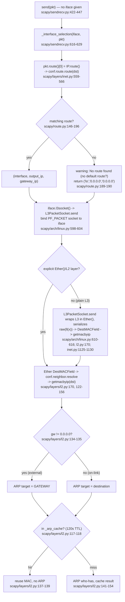

# How Scapy Decides *Where* and *How* to Send Packets

> A code-grounded onboarding walkthrough of Scapy's send/route/ARP subsystems, answering five
> questions an engineer asked while learning the codebase.
>
> **Branch:** `scapy_0925ada48540` · **Commit:** `0925ada4` · **Reported version:** `2026.06.26`
>
> Every answer below is (a) stated plainly, (b) traced to the exact source line(s) in the
> repository, and (c) confirmed by *running Scapy from the repository source* and observing the
> behavior. Citations use the form `path:line` and point at the source as it exists at this commit
> — if a line shifts in a later commit, trust the file. Warning/error strings are transcribed
> verbatim.

---

## Part 1 — Primer: Scapy keeps its *own* network stack

The single most important thing to internalize before reading the answers: **Scapy does not ask the
operating system where to send each packet.** Instead, at import time it builds and caches its own
view of the host's network configuration and then makes routing, interface, and neighbor (ARP)
decisions itself. Three structures hold that state:

| Concern | Scapy structure | Source |
|---|---|---|
| IPv4 routing table | `conf.route` — a `scapy.route.Route` object, mirrored from the OS table (e.g. `/proc/net/route` on Linux) | `scapy/route.py:31` (`class Route:`), populated via `self.routes = read_routes()` `scapy/route.py:45` |
| Interfaces | `conf.ifaces` / `conf.iface` (the default interface) | resolved at import of `scapy.all` |
| ARP cache | `_arp_cache`, a timeout-based cache (120 s TTL) | `scapy/layers/l2.py:118` |

Because this state is queried from the OS *once* (and can be re-synced or edited in memory), Scapy can
route packets differently from the host if you ask it to — see the `conf.route` add/delt/resync
examples in `doc/scapy/usage.rst:1065`.

### Critical: how to populate `conf.route` / `conf.iface`

These attributes are *empty* (`None`) if you only import the configuration module. They are populated
by importing `scapy.all`, which triggers the OS-querying bindings:

```python
import scapy.config        # conf.route / conf.iface are still None
from scapy.all import conf  # NOW conf.route and conf.iface are populated
```

All evidence in this document was gathered with `from scapy.all import *` (or `import scapy.all`).

### Running Scapy from source (develop mode)

The library runs directly from the repository checkout (develop/editable install), so the code being
executed *is* the repository source — there is no separately installed copy to diverge from. Two
quick confirmations:

```text
$ pip show scapy
WARNING: Package(s) not found: scapy        # no system-wide install

$ python -c "import scapy; print(scapy.__file__)"
/.../scapy_0925ada48540/scapy/__init__.py    # import resolves to the repo
```

A `run_scapy` launcher exists at the repo root; it simply sets `PYTHONPATH` to the repo and runs
`python -m scapy`. Throughout this document, evidence was produced by running throwaway scripts with
the repository on `PYTHONPATH` (the scripts live only under `/tmp` and are never committed).

### Container routing baseline (the evidence backdrop)

All of the live results below were captured on a host with the following routing configuration. The
gateway `10.236.12.1` is what makes the "external destination" experiments (Q3) observable.

```text
# OS view (ip route)
default via 10.236.12.1 dev eth0
10.236.12.0/24 via 10.236.12.1 dev eth0 src 10.236.12.185
10.236.12.1 dev eth0 scope link src 10.236.12.185
172.17.0.0/16 dev docker0 proto kernel scope link src 172.17.0.1
```

Scapy's mirror of that table, its default interface, and the interface list:

```pycon
>>> from scapy.all import conf, get_if_list
>>> conf.iface
<NetworkInterface eth0 [UP+BROADCAST+RUNNING+SLAVE]>
>>> get_if_list()
['lo', 'eth0', 'docker0']
>>> conf.route
Network      Netmask          Gateway      Iface    Output IP      Metric
0.0.0.0      0.0.0.0          10.236.12.1  eth0     10.236.12.185  0
10.236.12.0  255.255.255.0    10.236.12.1  eth0     10.236.12.185  0
10.236.12.1  255.255.255.255  0.0.0.0      eth0     10.236.12.185  0
127.0.0.0    255.0.0.0        0.0.0.0      lo       127.0.0.1      1
172.17.0.0   255.255.0.0      0.0.0.0      docker0  172.17.0.1     0
>>> type(conf.route)
<class 'scapy.route.Route'>
```

> **Note on addresses.** The IPs above (`10.236.12.0/24`, gateway `10.236.12.1`, output IP
> `10.236.12.185`) are the *actual* values observed on this host and are used consistently in every
> example. On a different host the numbers will differ; the *behavior* — and every code path cited —
> is identical.

---

## Part 2 — Q1: How does Scapy decide *where* to send a packet?

### (a) Direct answer

Scapy decides *where* by consulting **its own** routing table through `Route.route(dst)`, which does a
**longest-prefix match** over the table and returns the triple **`(interface, output_ip, gateway_ip)`**.
The most specific matching route wins; route metric breaks ties.

### (b) Code walkthrough — `scapy/route.py`

The whole decision lives in `Route.route()`, `scapy/route.py:146-196`:

```python
# scapy/route.py:146
def route(self, dst=None, verbose=conf.verb):
    ...
    # scapy/route.py:152  (docstring)
    returns: (iface, output_ip, gateway_ip)
```

The method proceeds in four steps:

1. **Result cache short-circuit** — repeated lookups for the same destination are memoized:

   ```python
   # scapy/route.py:163-164
   if dst in self.cache:
       return self.cache[dst]
   ```

2. **Longest-prefix scan** — every row of the mirrored table is tested; a row whose network matches
   the destination under its netmask becomes a candidate. Each candidate is recorded together with
   its netmask `m` and metric `me`:

   ```python
   # scapy/route.py:176
   for d, m, gw, i, a, me in self.routes:
       ...
       # scapy/route.py:184-185
       if (atol_dst & m) == (d & m):
           paths.append((m, me, (i, a, gw)))
   ```

   Here `i` is the interface, `a` is the output (source) IP, and `gw` is the gateway — i.e. the
   `(i, a, gw)` payload *is* the `(interface, output_ip, gateway_ip)` triple.

3. **Selection / tie-break** — candidates are sorted by *greatest* netmask first (longest prefix),
   then by metric, and the best one is taken:

   ```python
   # scapy/route.py:193
   paths.sort(key=lambda x: (-x[0], x[1]))
   ...
   # scapy/route.py:195
   ret = paths[0][2]
   ```

4. **No match** — if nothing matched, Scapy degrades to loopback rather than raising; that branch is
   the subject of **Q5** (`scapy/route.py:187-190`).

**Rationale.** Scapy mirrors the OS routing table into `self.routes` once (via `read_routes()`,
`scapy/route.py:45`) and then matches against it *itself* on every send — it does not shell out to the
kernel per packet. "Where to send" therefore reduces to a longest-prefix match the library performs
in pure Python, which is also why you can edit `conf.route` in memory and change where packets go.

### (c) Evidence

```pycon
>>> conf.route.route('8.8.8.8')        # external dst -> default route -> via gateway
('eth0', '10.236.12.185', '10.236.12.1')
>>> conf.route.route('127.0.0.1')      # on-link loopback -> no gateway
('lo', '127.0.0.1', '0.0.0.0')
>>> conf.route.route('10.236.12.1')    # on-link subnet -> no gateway
('eth0', '10.236.12.185', '0.0.0.0')
```

The external address `8.8.8.8` matches only the default route `0.0.0.0/0`, so it resolves out `eth0`
with output IP `10.236.12.185` **via gateway `10.236.12.1`**. The loopback and on-link cases match
more specific routes with no gateway (`0.0.0.0`). In every case the returned tuple is
`(interface, output_ip, gateway_ip)`.

---

## Part 3 — Q2: Which interface does Scapy pick when you don't specify one?

### (a) Direct answer

When no `iface` is given, `send()` derives the interface from the packet's own route — it calls
`_interface_selection()`, which takes **`packet.route()[0]`** (the interface element of the route
triple) and **falls back to `conf.iface`** when the packet has no routable L3 destination.

### (b) Code walkthrough — `scapy/sendrecv.py` + `scapy/layers/inet.py`

`send()` ("Send packets at layer 3") is at `scapy/sendrecv.py:422-447`. Before anything is
transmitted it resolves the interface:

```python
# scapy/sendrecv.py:422
def send(x, iface=None, **kargs):
    """Send packets at layer 3 ..."""
    # scapy/sendrecv.py:442
    iface = _interface_selection(iface, x)
    # scapy/sendrecv.py:443-447
    return _send(
        x,
        lambda iface: iface.l3socket(),
        iface=iface,
        **kargs
    )
```

`_interface_selection()` is at `scapy/sendrecv.py:616-629`. When the caller passed `iface=None`, it
reads the interface straight off the packet's route, guarding against packets that can't be routed:

```python
# scapy/sendrecv.py:616
def _interface_selection(iface, packet):
    """Select the network interface according to the layer 3 destination"""
    if iface is None:
        try:
            # scapy/sendrecv.py:626
            iff = next(packet.__iter__()).route()[0]
        except AttributeError:
            iff = None
        # scapy/sendrecv.py:629
        return iff or conf.iface
```

`packet.route()` for an IP packet is `IP.route()` at `scapy/layers/inet.py:559-566`, which simply
delegates to the routing table from Q1 (lazily importing `scapy.route` to populate `conf.route` if
needed):

```python
# scapy/layers/inet.py:559
def route(self):
    dst = self.dst
    if isinstance(dst, Gen):
        dst = next(iter(dst))
    if conf.route is None:
        # scapy/layers/inet.py:563-565  (unused import, only to initialize conf.route)
        import scapy.route  # noqa: F401
    # scapy/layers/inet.py:566
    return conf.route.route(dst)
```

**Rationale.** Interface choice is a *consequence* of route resolution, not a separate decision: the
same `Route.route()` from Q1 supplies element `[0]` of its triple. The `iff or conf.iface` expression
at `scapy/sendrecv.py:629` makes `conf.iface` the safety net for packets that have no L3 destination
to route (e.g. a bare L2 frame), whose `route()` yields `(None, None, None)`.

### (c) Evidence

```pycon
>>> from scapy.all import conf, IP, Ether
>>> from scapy.sendrecv import _interface_selection
>>> IP(dst='8.8.8.8').route()                       # delegates to conf.route.route()
('eth0', '10.236.12.185', '10.236.12.1')
>>> _interface_selection(None, IP(dst='8.8.8.8'))   # == packet.route()[0]
'eth0'
>>> Ether().route()                                 # no routable L3 dst
(None, None, None)
>>> _interface_selection(None, Ether())             # falls back to conf.iface
<NetworkInterface eth0 [UP+BROADCAST+RUNNING+SLAVE]>
```

Note the two return shapes: for a routable packet the function returns the interface **name string**
(`'eth0'`, straight from `route()[0]`); for the fallback it returns the **`conf.iface` object**. Both
identify `eth0` here, and the routed value equals `conf.route.route('8.8.8.8')[0]`.

---

## Part 4 — Q3: How is the destination MAC found for a destination *outside* the subnet?

### (a) Direct answer

For a destination outside the local subnet the next hop is the **gateway**, so ARP resolves the
**gateway's** MAC — not the external IP's. This holds on *both* send paths. Whether you build an
explicit `Ether()` layer or send a bare `IP(...)`, on a normal Ethernet interface it is **Scapy
itself** — not the OS kernel — that resolves the next-hop (gateway) MAC via `getmacbyip` *before* the
frame is handed to the kernel: the layer-3 socket wraps the packet in the interface's registered L2
class and serializes it, which triggers MAC resolution prior to `sendto`.

### (b) Code walkthrough — `scapy/layers/l2.py`, `scapy/layers/inet.py`, `scapy/arch/linux.py`

`getmacbyip()` is the function that maps an IP to a MAC, `scapy/layers/l2.py:122-156`:

```python
# scapy/layers/l2.py:122
def getmacbyip(ip, chainCC=0):
    ...
    # scapy/layers/l2.py:129-130   multicast special case
    if (tmp[0] & 0xf0) == 0xe0:  # mcast @
        return "01:00:5e:%.2x:%.2x:%.2x" % (tmp[1] & 0x7f, tmp[2], tmp[3])
    # scapy/layers/l2.py:131       route the target (reuses Q1)
    iff, _, gw = conf.route.route(ip)
    # scapy/layers/l2.py:132-133   loopback / broadcast short-circuit
    if (iff == conf.loopback_name) or (ip in conf.route.get_if_bcast(iff)):
        return "ff:ff:ff:ff:ff:ff"
    # scapy/layers/l2.py:134-135   *** THE gateway next-hop swap ***
    if gw != "0.0.0.0":
        ip = gw
    ...
    # scapy/layers/l2.py:141-148   ARP who-has for the (possibly swapped) ip
    res = srp1(Ether(dst=ETHER_BROADCAST) / ARP(op="who-has", pdst=ip),
               type=ETH_P_ARP,
               iface=iff,
               timeout=2,           # scapy/layers/l2.py:145
               verbose=0,
               chainCC=chainCC,
               nofilter=1)
```

The crux is `scapy/layers/l2.py:134-135`: if the route returned a non-zero gateway (the off-subnet
case), the ARP target `ip` is **reassigned to the gateway**. ARP then asks *who-has the gateway*,
because ARP is link-local — you cannot ARP for an address that is not on your link.

How does an `Ether()` layer get its destination MAC filled in? Through the neighbor resolver
registered for `(Ether, IP)` in `scapy/layers/inet.py:1125-1130`:

```python
# scapy/layers/inet.py:1125-1126
def inet_register_l3(l2, l3):
    return getmacbyip(l3.dst)

# scapy/layers/inet.py:1129-1130
conf.neighbor.register_l3(Ether, IP, inet_register_l3)
conf.neighbor.register_l3(Dot3, IP, inet_register_l3)
```

…and the L2 `DestMACField` invokes that resolver when the destination MAC is unset
(`scapy/layers/l2.py:170`):

```python
# scapy/layers/l2.py:170
x = conf.neighbor.resolve(pkt, pkt.payload)
```

**The plain L3 path resolves the MAC the same way — still inside Scapy.** It is tempting to assume
that a bare `IP(...)` send (no explicit `Ether()` layer) hands the packet to the kernel and lets the
kernel do ARP. The source shows otherwise: `L3PacketSocket.send()` (`scapy/arch/linux.py:598-619`)
does the L2 work itself. After selecting the interface (`x.route()[0]`, falling back to `conf.iface`)
and binding the `PF_PACKET` socket to it, it reads the socket's hardware type and — for a normal
Ethernet interface — **wraps the L3 packet in the interface's registered L2 class** (`Ether`) and
serializes it:

```python
# scapy/arch/linux.py:598-619  (abridged; comments added)
def send(self, x):
    iff = x.route()[0]                      # scapy/arch/linux.py:600  interface from route (Q2)
    if iff is None:
        iff = network_name(conf.iface)      # scapy/arch/linux.py:601-602  fallback to conf.iface
    sdto = (iff, self.type)
    self.outs.bind(sdto)                    # scapy/arch/linux.py:604  bind PF_PACKET socket to iface
    sn = self.outs.getsockname()            # scapy/arch/linux.py:605
    ll = lambda x: x                        # scapy/arch/linux.py:606  default: no wrapping
    type_x = type(x)
    if type_x in conf.l3types:
        sdto = (iff, conf.l3types.layer2num[type_x])
    if sn[3] in conf.l2types:               # scapy/arch/linux.py:610  Ethernet hw type detected
        ll = lambda x: conf.l2types.num2layer[sn[3]]() / x   # :611  wrap the IP packet in Ether()
    ...
    sx = raw(ll(x))                         # scapy/arch/linux.py:616  *** serialize -> fills DestMACField ***
    x.sent_time = time.time()
    return self.outs.sendto(sx, sdto)       # scapy/arch/linux.py:619  send the fully-built frame
```

The decisive step is `sx = raw(ll(x))` at `scapy/arch/linux.py:616`. Because `sn[3]` (the socket's
hardware type, `ARPHDR_ETHER == 1` for Ethernet, `scapy/data.py:53`) is registered in `conf.l2types`
to the `Ether` class (`conf.l2types.register(ARPHDR_ETHER, Ether)`, `scapy/layers/l2.py:718`), `ll`
prepends a fresh `Ether()` to the packet. Serializing that `Ether()` forces its `DestMACField` to be
filled, which calls `conf.neighbor.resolve(pkt, pkt.payload)` (`scapy/layers/l2.py:170`). For an
`(Ether, IP)` packet that resolver is `inet_register_l3`, which calls `getmacbyip(l3.dst)`
(`scapy/layers/inet.py:1125-1130`). So the **same `getmacbyip` path documented above runs here too** —
the gateway swap (`scapy/layers/l2.py:134-135`) and the 120 s ARP cache (Q4) all apply — and the
destination MAC is resolved **before** `self.outs.sendto(...)` (`scapy/arch/linux.py:619`) hands the
frame to the kernel. The kernel receives a fully-formed Ethernet frame; it does **not** perform ARP on
this path.

(For contrast, a *listen-only* socket refuses to send at all — `L2ListenSocket.send` raises
`Scapy_Exception("Can't send anything with L2ListenSocket")`, `scapy/arch/linux.py:584`.)

**Rationale.** On a normal Ethernet interface it is **Scapy**, not the kernel, that resolves the
next-hop MAC via `getmacbyip` — regardless of whether you supplied an `Ether()` layer yourself or sent
a bare `IP(...)`. The explicit-`Ether()` path simply makes that resolution visible in the layer you
constructed; the plain-L3 path performs the identical resolution inside `L3PacketSocket.send`, which
adds the `Ether()` for you and serializes it before `sendto`. Either way, for an off-subnet target the
link-layer destination is the **gateway**.

### (c) Evidence

Sending real ARP onto the wire isn't necessary to *observe the decision* — we intercept `srp1` (the
function `getmacbyip` uses to emit the who-has) in a throwaway `/tmp` script and record the target it
was asked about:

```python
import scapy.layers.l2 as l2mod
from scapy.all import conf, getmacbyip, ARP, Ether

captured = {}
def fake_srp1(pkt, *a, **k):
    captured['pdst'] = pkt[ARP].pdst          # what ARP is asked to resolve
    captured['iface'] = k.get('iface')
    return Ether() / ARP(op="is-at", hwsrc="aa:bb:cc:dd:ee:ff", psrc=pkt[ARP].pdst)

l2mod.srp1 = fake_srp1                          # intercept the who-has
getmacbyip('8.8.8.8')                           # external destination
print(conf.route.route('8.8.8.8'), captured)
```

Output:

```text
('eth0', '10.236.12.185', '10.236.12.1') {'pdst': '10.236.12.1', 'iface': 'eth0'}
```

The ARP `who-has` carried **`pdst=10.236.12.1`** — the **gateway** — not the external `8.8.8.8`,
exactly as the `gw != "0.0.0.0"` swap at `scapy/layers/l2.py:134-135` dictates.

The block above proves the gateway swap, but it calls `getmacbyip` directly. To prove that the **plain
layer-3 send path itself** (a bare `IP(...)` with no explicit `Ether()`) drives that same resolution
**inside Scapy before the frame reaches the kernel**, we exercise the *real* `L3PacketSocket.send`
([`scapy/arch/linux.py:598-619`]) with a dummy Ethernet `outs` socket — no kernel socket is opened and
no real traffic leaves the host. The dummy `getsockname()` returns `sn[3] = ARPHDR_ETHER (1)` so the
real code takes the Ethernet branch and wraps the packet (`ll = lambda x: conf.l2types.num2layer[sn[3]]() / x`),
and we patch `srp1` to record the ARP target and the operation order:

```python
import scapy.layers.l2 as l2mod
from scapy.all import conf, IP, ICMP, Ether
from scapy.arch.linux import L3PacketSocket
from scapy.data import ETH_P_ALL, ARPHDR_ETHER

events, captured = [], {}
def fake_srp1(pkt, *a, **k):                      # intercept the who-has
    captured['arp_pdst'] = pkt[l2mod.ARP].pdst
    events.append("srp1(who-has %s)" % pkt[l2mod.ARP].pdst)
    return Ether() / l2mod.ARP(op="is-at", hwsrc="aa:bb:cc:dd:ee:ff", psrc=pkt[l2mod.ARP].pdst)
l2mod.srp1 = fake_srp1

class DummyEtherOuts:                              # records bind / getsockname / sendto
    def bind(self, sdto):       events.append("outs.bind(%r)" % (sdto,))
    def getsockname(self):      return ("eth0", ETH_P_ALL, 0, ARPHDR_ETHER, b"\x00" * 6)
    def sendto(self, sx, sdto): events.append("outs.sendto(len=%d)" % len(sx)); captured['frame'] = sx; return len(sx)

sock = L3PacketSocket.__new__(L3PacketSocket)      # real send(), no kernel socket
sock.type, sock.lvl, sock.LL, sock.outs = ETH_P_ALL, 3, IP, DummyEtherOuts()
l2mod._arp_cache.flush()                           # force a fresh resolution
sock.send(IP(dst="8.8.8.8") / ICMP())              # a PLAIN L3 packet (no explicit Ether)

print("ARP who-has pdst   =", captured['arp_pdst'])
print("resolved Ether.dst =", Ether(captured['frame']).dst)
print("operation order    =", events)
```

Output:

```text
ARP who-has pdst   = 10.236.12.1
resolved Ether.dst = aa:bb:cc:dd:ee:ff
operation order    = ["outs.bind(('eth0', 3))", 'srp1(who-has 10.236.12.1)', 'outs.sendto(len=42)']
```

Three facts fall out of this run, and together they settle the question:

1. **Scapy wrapped the L3 packet in `Ether()`** — the serialized buffer parses back as `Ether / IP / ICMP`,
   produced by the `ll(x)` wrap at `scapy/arch/linux.py:610-611`.
2. **Scapy — not the kernel — resolved the MAC**, and it resolved the **gateway**: the `who-has`
   carried `pdst=10.236.12.1` and the finished frame's destination is the resolved
   `aa:bb:cc:dd:ee:ff`, not the `ff:ff:ff:ff:ff:ff` broadcast fallback.
3. **Resolution happened *before* `sendto`** — the operation order is `bind` → `srp1` (the ARP
   who-has) → `outs.sendto`. The frame already carried the next-hop MAC by the time it was handed to
   the kernel via `sendto` at `scapy/arch/linux.py:619`.

This is the same `DestMACField` → `conf.neighbor.resolve` → `inet_register_l3` → `getmacbyip` chain
([`scapy/layers/l2.py:170`], [`scapy/layers/inet.py:1125-1130`], [`scapy/layers/l2.py:122-156`]) that the
explicit-`Ether()` path uses — so the two paths agree, and on neither of them does the kernel issue the
ARP for an off-subnet destination.


---

## Part 5 — Q4: What ARP happens if you send the same packet twice in quick succession?

### (a) Direct answer

The second send within the cache TTL emits **no new ARP request** — it's a **cache hit**. Scapy keeps
a 120-second ARP cache, so a repeated quick send reuses the already-resolved MAC.

### (b) Code walkthrough — `scapy/layers/l2.py` + `scapy/config.py`

The cache is created once at module load, with an explicit 120-second TTL:

```python
# scapy/layers/l2.py:117-118
# cache entries expire after 120s
_arp_cache = conf.netcache.new_cache("arp_cache", 120)
```

Inside `getmacbyip`, *before* any ARP is sent, the cache is consulted and a hit returns immediately:

```python
# scapy/layers/l2.py:137-139
mac = _arp_cache.get(ip)
if mac:
    return mac
```

Only on a miss does the function fall through to the `srp1(... who-has ...)` call
(`scapy/layers/l2.py:141-148`); after a successful resolution it stores the result so the *next* call
hits the cache (`scapy/layers/l2.py:152-156`, store at line 154):

```python
# scapy/layers/l2.py:152-155
if res is not None:
    mac = res.payload.hwsrc
    _arp_cache[ip] = mac        # scapy/layers/l2.py:154
    return mac
```

The TTL itself is enforced by `CacheInstance` in `scapy/config.py:347-410`. The timeout is stored at
construction, every entry is timestamped on write, and reads past the TTL raise `KeyError`:

```python
# scapy/config.py:347
class CacheInstance(Dict[str, Any], object):
    ...
    # scapy/config.py:352
    self.timeout = timeout
    ...
    # scapy/config.py:371-372   (inside __getitem__)
    if time.time() - t > self.timeout:
        raise KeyError(item)
    ...
    # scapy/config.py:388       (inside __setitem__)
    self._timetable[item] = time.time()
```

Crucially, `get()` is overridden so that lookups go through that TTL check (a plain `dict.get` would
not), returning the value on a hit and `default` (`None`) on expiry:

```python
# scapy/config.py:375-382
def get(self, item, default=None):
    # overloading this method is needed to force the dict to go through
    # the timetable check
    try:
        return self[item]
    except KeyError:
        return default
```

**Rationale.** A repeated, quick send is well within 120 s, so `_arp_cache.get()` at
`scapy/layers/l2.py:137` returns the stored MAC and short-circuits *before* any `srp1`/who-has — no
extra ARP traffic. After 120 s the entry expires (`__getitem__` raises `KeyError`, so `get()` returns
`None`), and the next send issues a fresh who-has. For an off-subnet target the cache is keyed on the
**gateway** IP (because of the Q3 swap), so all external destinations sharing a gateway share one
cache entry.

### (c) Evidence

A throwaway `/tmp` script counts how many times `srp1` (the who-has emitter) is actually invoked
across two consecutive resolutions:

```python
import scapy.layers.l2 as l2mod
from scapy.all import conf, getmacbyip, ARP, Ether

l2mod._arp_cache.flush()                       # start from a clean cache
count = {'n': 0}
def counting_srp1(pkt, *a, **k):
    count['n'] += 1
    return Ether() / ARP(op="is-at", hwsrc="aa:bb:cc:dd:ee:ff", psrc=pkt[ARP].pdst)
l2mod.srp1 = counting_srp1

print("TTL:", l2mod._arp_cache.timeout)
getmacbyip('8.8.8.8'); print("after 1st call, srp1 count =", count['n'])
getmacbyip('8.8.8.8'); print("after 2nd call, srp1 count =", count['n'])
```

Output:

```text
TTL: 120
after 1st call, srp1 count = 1
after 2nd call, srp1 count = 1
```

The who-has was sent **once** across two resolutions: the first call missed and resolved (count → 1),
the second was a cache hit and emitted nothing (count stays 1).

---

## Part 6 — Q5: When does a send to an unreachable destination fail, and what is the exact message?

### (a) Direct answer

A send to an unreachable destination does **not raise by default**. `Route.route()` logs the warning
**`No route found (no default route?)`** and returns a **loopback fallback**, after which `send()`
transmits on loopback and still reports success. A hard exception (`ScapyNoDstMacException`) occurs
only in the L2 destination-MAC path, and only when `conf.raise_no_dst_mac` is explicitly enabled.

### (b) Code walkthrough — `scapy/route.py` + `scapy/layers/l2.py`

The "failure" point is the no-match branch of `Route.route()`, `scapy/route.py:187-190`:

```python
# scapy/route.py:187-190
if not paths:
    if verbose:
        warning("No route found (no default route?)")          # scapy/route.py:189
    return conf.loopback_name, "0.0.0.0", "0.0.0.0"            # scapy/route.py:190
```

So when nothing matches, Scapy emits the warning (verbatim: **`No route found (no default route?)`**)
and *returns* the loopback fallback triple `(conf.loopback_name, "0.0.0.0", "0.0.0.0")`. There is no
exception — `send()` simply proceeds to transmit on loopback.

A genuine exception is possible only on the **L2 destination-MAC** path, in `DestMACField.i2h`
(`scapy/layers/l2.py:161-183`). When neighbor resolution yields no MAC, the behavior is *conditional*:

```python
# scapy/layers/l2.py:170     resolve the next-hop MAC
x = conf.neighbor.resolve(pkt, pkt.payload)
...
if x is None:
    # scapy/layers/l2.py:174-175   opt-in strict mode
    if conf.raise_no_dst_mac:
        raise ScapyNoDstMacException()
    else:
        # scapy/layers/l2.py:177-178   default: broadcast + warning
        x = "ff:ff:ff:ff:ff:ff"
        warning("Mac address to reach destination not found. Using broadcast.")
```

By default (`conf.raise_no_dst_mac` is `False`) Scapy falls back to the broadcast MAC and logs the
verbatim warning **`Mac address to reach destination not found. Using broadcast.`**. The
`ScapyNoDstMacException` at `scapy/layers/l2.py:175` is raised *only* if you opt into strict mode.

**Rationale.** Scapy is a packet *crafting and sending* tool, so by default it degrades gracefully —
loopback fallback and broadcast fallback, each with a warning — rather than aborting the operation.
Strictness is opt-in via `conf.raise_no_dst_mac`. The headline for Q5 is therefore: **graceful
degradation, not an exception, by default.**

### (c) Evidence

**No-route send (graceful default).** A throwaway `/tmp` script clears Scapy's *in-memory* routing
table (process-local; the OS table and the repo are untouched) and sends to an external address:

```python
from scapy.all import conf, IP, ICMP, send

conf.route.routes = []            # clear in-memory table (process-local only)
conf.route.invalidate_cache()
print(conf.route.route('8.8.8.8'))   # triggers the no-route branch

raised = None
try:
    send(IP(dst='8.8.8.8') / ICMP())
except Exception as e:
    raised = e
print("Exception raised? ->", repr(raised))
```

Output (the warning is logged to stderr; `Sent 1 packets.` to stdout):

```text
WARNING: No route found (no default route?)
('lo', '0.0.0.0', '0.0.0.0')
WARNING: No route found (no default route?)
WARNING: more No route found (no default route?)
.
Sent 1 packets.
Exception raised? -> None
```

The lookup returns the loopback fallback `('lo', '0.0.0.0', '0.0.0.0')`, `send()` prints
**`Sent 1 packets.`**, and **no exception is raised** — it transmitted on loopback. (The
`more No route found ...` line is Scapy's log de-duplication for the repeated warning.)

**L2 dest-MAC fallback (and opt-in exception).** Simulating an unresolvable MAC by patching
`getmacbyip` to return `None`, then building an `Ether()/IP()`:

```python
import scapy.layers.inet as inet
from scapy.all import conf, Ether, IP
from scapy.error import ScapyNoDstMacException

inet.getmacbyip = lambda ip, chainCC=0: None     # force resolution to fail

# default (conf.raise_no_dst_mac == False): broadcast fallback + warning
resolved = (Ether() / IP(dst="8.8.8.8")).dst     # -> triggers DestMACField.i2h
print("Ether.dst resolved to:", resolved)

conf.raise_no_dst_mac = True                     # opt into strict mode
try:
    _ = (Ether() / IP(dst="8.8.8.8")).dst
except ScapyNoDstMacException as e:
    print("Raised:", type(e).__name__)
```

Output:

```text
WARNING: Mac address to reach destination not found. Using broadcast.
Ether.dst resolved to: ff:ff:ff:ff:ff:ff
Raised: ScapyNoDstMacException
```

With the default config the destination MAC degrades to `ff:ff:ff:ff:ff:ff` plus the verbatim
warning; only after setting `conf.raise_no_dst_mac = True` does the build raise
`ScapyNoDstMacException`.


---

## Part 7 — Summary

### Decision table

| Question | What Scapy does | Key locator(s) | Observed evidence |
|---|---|---|---|
| **Q1 — Where to send** | Longest-prefix match over its *own* mirrored routing table; returns `(interface, output_ip, gateway_ip)` | `scapy/route.py:146-196` (match `184-185`, select `193`/`195`) | `conf.route.route('8.8.8.8')` → `('eth0', '10.236.12.185', '10.236.12.1')` |
| **Q2 — Interface selection** | `send()` → `_interface_selection()` reads `packet.route()[0]`; else `conf.iface` | `scapy/sendrecv.py:442`, `616-629` (`626`, `629`); `scapy/layers/inet.py:566` | `_interface_selection(None, IP(dst='8.8.8.8'))` → `'eth0'`; bare `Ether()` → `conf.iface` |
| **Q3 — External dest MAC** | Next hop is the **gateway** (`if gw != "0.0.0.0": ip = gw`), so ARP resolves the gateway's MAC. The plain L3 path resolves it **in Scapy** too: `L3PacketSocket.send` wraps the packet in `Ether()` and serializes it, triggering `getmacbyip` before `sendto` — the kernel does not ARP | `scapy/layers/l2.py:134-135`, `122-156`, `170`; `scapy/layers/inet.py:1125-1130`; `scapy/arch/linux.py:598-619` | who-has `pdst=10.236.12.1` (gateway), not `8.8.8.8`; dummy-`outs` `L3PacketSocket.send(IP(dst='8.8.8.8')/ICMP())` resolves gateway MAC before `sendto` |
| **Q4 — Repeated send** | 120 s ARP cache; second send within TTL is a **cache hit**, no new ARP | `scapy/layers/l2.py:117-118`, `137-139`; `scapy/config.py:347-388` | `srp1` count stays **1** across two `getmacbyip('8.8.8.8')` calls |
| **Q5 — No route** | **No exception by default**: warn + loopback fallback; hard `ScapyNoDstMacException` only if `conf.raise_no_dst_mac` | `scapy/route.py:187-190`; `scapy/layers/l2.py:174-178` | warning `No route found (no default route?)` then `Sent 1 packets.`, no exception |

### Verbatim strings (as they appear in source)

| String | Source |
|---|---|
| `No route found (no default route?)` | `scapy/route.py:189` |
| `Mac address to reach destination not found. Using broadcast.` | `scapy/layers/l2.py:178` |
| `Can't send anything with L2ListenSocket` | `scapy/arch/linux.py:584` |
| `Sent 1 packets.` (printed by `send()` for one packet) | `scapy/sendrecv.py:392` |

### Accuracy note — route-tuple order

`conf.route.route()` returns the triple **`(interface, output_ip, gateway_ip)`**. This is confirmed
three independent ways:

1. **Source docstring** — `scapy/route.py:152`: `returns: (iface, output_ip, gateway_ip)`.
2. **Live run** — `conf.route.route('8.8.8.8')` → `('eth0', '10.236.12.185', '10.236.12.1')` (an
   *interface name*, then the *output/source IP*, then the *gateway*).
3. **Official documentation** — `doc/scapy/routing.rst:54` states the call "will return
   `(interface, outgoing_ip, gateway)`", with the live example at `doc/scapy/routing.rst:58-59`:
   `conf.route.route("127.0.0.1")` → `('lo', '127.0.0.1', '0.0.0.0')`.

> **Correction.** This **corrects the order stated in tech-spec §4.8.2**, which lists the tuple as
> `(iface, gateway, src_address)`. The verified order is `(interface, output_ip, gateway_ip)` — the
> gateway is the **third** element, and the second element is the output/source IP, not the gateway.

### End-to-end flow

The single decision that fans out to both *where* (Q1) and *which interface* (Q2) is route
resolution; the L2 specifics (Q3/Q4) and the no-route handling (Q5) hang off it:



### Key takeaways

- **Route resolution is the hub.** "Where" (Q1) and "which interface" (Q2) are the *same* decision:
  `_interface_selection` literally reads `packet.route()[0]` (`scapy/sendrecv.py:626`).
- **The gateway swap is the crux of Q3.** `if gw != "0.0.0.0": ip = gw` (`scapy/layers/l2.py:134-135`)
  is *why* an external destination's ARP targets the gateway.
- **Q4 is entirely the cache.** `CacheInstance.get()` (`scapy/config.py:375-382`) enforces the 120 s
  timetable; the second quick send short-circuits before any who-has.
- **Q5 is graceful degradation, not an exception.** Warn + loopback fallback is the default
  (`scapy/route.py:187-190`); `ScapyNoDstMacException` is opt-in via `conf.raise_no_dst_mac`
  (`scapy/layers/l2.py:174-175`).

