# Scapy DNS Name Compression — Code-Grounded Q&A (commit `0925ada4`)

## Section 0 — Title & Overview

This document is a code-grounded knowledge artifact that answers **nine** questions about how **DNS name compression** works inside the Scapy library — both when packets are **parsed (decompressed)** and **rebuilt (compressed)**. Its scope is intentionally narrow: the DNS name-compression machinery in `scapy/layers/dns.py`, the byte primitives it relies on in `scapy/compat.py`, and the regression tests that pin the behavior in `test/scapy/layers/dns.uts`. The methodology is **code-as-truth**: every behavioral claim is justified by the actual source at the currently checked-out commit `0925ada4`, and every behavior was confirmed by **building and running** Scapy (importing it in place and parsing/constructing real DNS packets), not by reading alone. Where the code implements or diverges from a standard, RFC 1035 §4.1.4 and RFC 9267 are cited for context only — the code remains the primary truth.

All line numbers in this document are pinned to commit `0925ada4`. At that revision, `scapy/layers/dns.py` is 1179 lines, `scapy/compat.py` is 187 lines, and `test/scapy/layers/dns.uts` is 241 lines.

### How to read the citations

Every factual claim about the system carries an inline citation of the form `[path:locator]`:

- `[scapy/layers/dns.py:L114]` — a single source line.
- `[scapy/layers/dns.py:L95-L141]` — an inclusive range of source lines.
- `[test/scapy/layers/dns.uts:L150-L153]` — a corroborating regression test.
- `[scapy/compat.py:L146-L150]` — a supporting byte primitive.
- `[pyproject.toml:L17]` — the declared runtime baseline.

A reader can open the cited file at the cited lines to audit any statement directly against the code.

### Question → governing-code map

| # | Question (short) | Primary governing code |
|---|------------------|------------------------|
| Q1 | Pointer-chain unwinding & where it begins | `dns_get_str` loop `[scapy/layers/dns.py:L95-L141]` |
| Q2 | Wire-format label encoding | `dns_encode` `[scapy/layers/dns.py:L154-L172]` |
| Q3 | The `0xc0` marker test | `if cur & 0xc0:` `[scapy/layers/dns.py:L103]` |
| Q4 | Loop protection | `processed_pointers` `[scapy/layers/dns.py:L88,L115-L117]` |
| Q5 | Out-of-bounds / truncation | guards `[scapy/layers/dns.py:L96-L100,L108-L112,L126-L129,L134]` |
| Q6 | Cross-record full-packet access | `InheritOriginDNSStrPacket` `[scapy/layers/dns.py:L270-L277]`; `_orig_s` plumbing `[scapy/layers/dns.py:L90-L93,L118-L125]` |
| Q7 | Compression walk & reference choice | `dns_compress` `[scapy/layers/dns.py:L184-L267]` |
| Q8 | Strategy equivalence on decode | `dns_get_str` determinism `[scapy/layers/dns.py:L95-L141]` |
| Q9 | End-to-end dissection & build | `DNSRRField.getfield` `[scapy/layers/dns.py:L375-L396]`; `post_build`/`compress` `[scapy/layers/dns.py:L509-L516]` |

---

## Section 1 — Background Primer (shared vocabulary)

This section establishes the vocabulary every later answer relies on.

### The DNS message layout

A DNS message is a **12-byte fixed header** followed by four variable-length sections in order: **Question (`qd`)**, **Answer (`an`)**, **Authority (`ns`)**, and **Additional (`ar`)**. Scapy models this directly: the `DNS` packet's `fields_desc` declares the header bit-fields and the four section count-fields, then the four section fields `qd`, `an`, `ns`, `ar` `[scapy/layers/dns.py:L462-L489]`. The header carries an ID, flags, and the four record-count fields `qdcount`/`ancount`/`nscount`/`arcount` `[scapy/layers/dns.py:L481-L484]` that tell the parser how many records to read from each section.

The 12-byte header length matters for compression arithmetic (see the `-12` nuance below). A pointer offset of `0` refers to the first byte of the message — i.e., the first byte of the header/ID field — per RFC 1035 §4.1.4.

### Wire-format names: length-prefixed labels + a zero terminator

On the wire, a domain name is **not** a dotted ASCII string. It is a sequence of **length-prefixed labels** terminated by a **zero octet**. For example, `www.example.com` becomes:

```text
03 'w' 'w' 'w'  07 'e' 'x' 'a' 'm' 'p' 'l' 'e'  03 'c' 'o' 'm'  00
```

Each label is preceded by a single length octet; the trailing `00` length octet marks the end of the name. This is exactly what Scapy's encoder produces `[scapy/layers/dns.py:L154-L172]`, and it is observable in the default DNS query whose `qname` is `www.example.com` — `raw(DNS())` ends in `...\x03www\x07example\x03com\x00\x00\x01\x00\x01` `[test/scapy/layers/dns.uts:L227-L229]`. (RFC 1035 §4.1.4 defines this label/terminator grammar; the code is the primary truth here.)

### The two-octet compression pointer

To avoid repeating a suffix that already appears earlier in the message, RFC 1035 §4.1.4 allows a name (or its trailing labels) to be replaced by a **two-octet pointer**. The pointer's top two bits are `11` (the `0xc0` mask); the remaining **14 bits** hold an **offset measured from the start of the message** (offset `0` = the first header byte). When a parser following a name encounters such a pointer, it jumps to that offset and continues reading labels there. Scapy detects the pointer with a high-bit test `[scapy/layers/dns.py:L103]` and computes the jump target from the 14-bit offset `[scapy/layers/dns.py:L114]`.

### Two cross-cutting Scapy nuances (referred to throughout)

These two implementation details recur across many answers, so they are introduced once here and revisited in **Section 11 — Cross-Cutting Topics**:

1. **The pointer test is a high-bit *mask* `cur & 0xc0`, not a strict equality `== 0xc0`** `[scapy/layers/dns.py:L103]`. RFC 1035 blesses only the `11` (`0xc0`) bit-combination as a pointer, but Scapy treats **any** length octet with either of the top two bits set — `0x40` (`01......`), `0x80` (`10......`), and `0xc0` (`11......`) — as a pointer. This is a verified divergence from the strict standard, analyzed (not "fixed") in this document.

2. **The `-12` body-offset adjustment** `[scapy/layers/dns.py:L114]`. RFC pointer offsets are message-relative (counting from the 12-byte header), but Scapy stores the **header-stripped body** in `_orig_s` and decodes against it, so it subtracts `12` to convert a message-relative offset into a body-relative index. A pointer value of `0x0c` (`12`) therefore resolves to body index `0` — the first byte after the header, which is exactly where the Question's `qname` begins.

---

## Section 2 — Q1: "How does Scapy unravel a chain of compression-pointer references into a readable domain name, and WHERE does the unwinding begin?"

**Explanation.** Decompression is performed by `dns_get_str(s, pointer=0, pkt=None, _fullpacket=False)` `[scapy/layers/dns.py:L69-L144]`. Unwinding **begins at the supplied `pointer` index** (default `0`) into the working buffer `s` `[scapy/layers/dns.py:L69,L101]`. The main `while True` loop `[scapy/layers/dns.py:L95-L141]` reads one length octet per iteration — `cur = orb(s[pointer])` then `pointer += 1` `[scapy/layers/dns.py:L101-L102]` — and branches three ways: it is a **pointer** (top bits set), an **ordinary label** (`cur > 0`), or the **zero terminator** (`cur == 0`). When a pointer is detected, the next jump target is computed and the loop *continues* from there; an ordinary label is appended; the terminator ends the name `[scapy/layers/dns.py:L136-L137]`.

**Code excerpt** — the jump-target computation and the flat-name accumulation:

```python
pointer = ((cur & ~0xc0) << 8) + orb(s[pointer]) - 12          # L114 follow pointer
name += s[pointer:pointer + cur] + b"."                         # L134 append a label
```
`[scapy/layers/dns.py:L114,L132-L135]`

A subtle but important detail is `after_pointer`: the first time a pointer is followed, the index of the byte right after the two-byte pointer token is saved `[scapy/layers/dns.py:L104-L107]`, and at the end the function returns that as the resume position rather than wherever the jump chain finished `[scapy/layers/dns.py:L138-L140]`.

**Signature nuance (cite the real return).** The docstring advertises a 3-tuple `(decoded_string, end_index, left_string)` `[scapy/layers/dns.py:L77]`, but the function actually **returns a 4-tuple** `(name, pointer, bytes_left, len(processed_pointers) != 0)` `[scapy/layers/dns.py:L144]`. The 4th element is the loop/compression flag, consumed downstream by `DNSStrField.getfield` as `self.compressed` `[scapy/layers/dns.py:L305]`.

**Rationale.** The loop's job is to turn a possibly-pointered byte stream into a flat `label.label.…` byte string. Tracking `after_pointer` separates *where the name's bytes physically end inside this record* from *where a pointer sent the cursor* — essential so that the caller can keep reading the next field right after the name even though decoding "teleported" elsewhere to resolve a back-reference.

**Runtime-verified observation.** Feeding a label `data` followed by a pointer back to offset `0`:

```text
dns_get_str(b"\x04data\xc0\x0c", 0, _fullpacket=True)  ->  (b'data.data.', 7, b'', True)
```
The `\xc0\x0c` pointer (offset `12` → body index `0`) re-reads the `data` label, yielding `data.data.`, and the returned resume index is `7` (right after the 2-byte token). This is the 4-tuple in action; it is corroborated by the regression test `[test/scapy/layers/dns.uts:L153]`.

---

## Section 3 — Q2: "How are domain names encoded into length-prefixed label sequences (wire format) before compression?"

**Explanation.** Encoding to wire format is `dns_encode(x, check_built=False)` `[scapy/layers/dns.py:L154-L172]`. An empty input or the bare root `b"."` encodes to a single zero octet `b"\x00"` `[scapy/layers/dns.py:L161-L162]`. Otherwise the name is split on dots, each label is prefixed with its length byte (clamped to 63 bytes), and a trailing zero terminator is appended if not already present `[scapy/layers/dns.py:L170-L171]`.

**Code excerpt** — the one-line core transform:

```python
x = b"".join(chb(len(y)) + y for y in (k[:63] for k in x.split(b".")))   # L169
```
`[scapy/layers/dns.py:L169]`

The `k[:63]` slice enforces the RFC's 63-byte maximum label length, and `chb` emits each single length octet via `struct.pack("!B", x)` `[scapy/compat.py:L140-L143]`. The `check_built` parameter, together with the `_is_ptr` helper `[scapy/layers/dns.py:L147-L151,L164-L166]`, lets the encoder recognize a value that is *already* in wire/pointer form and skip re-encoding it — an idempotence guard the compressor relies on.

**Rationale.** Length-prefixing eliminates any need for an in-band delimiter (so a label may itself contain arbitrary bytes), the 63-byte clamp enforces the RFC label-length limit, and the zero terminator unambiguously marks the end of the name. This is the canonical *pre-compression* form every name starts in before `dns_compress` may later replace a suffix with a pointer.

**Runtime-verified observation.**

```text
dns_encode(b"www.example.com")        ->  b'\x03www\x07example\x03com\x00'
dns_encode(b"*")                      ->  b'\x01*\x00'
dns_encode(dns_encode(b"*"))          ->  b'\x03\x01*\x00'   (double-encode edge case)
```
These match the regression tests `dns_encode(b"www.google.com") == b'\x03www\x06google\x03com\x00'` `[test/scapy/layers/dns.uts:L223]`, `dns_encode(b"*") == b'\x01*\x00'` `[test/scapy/layers/dns.uts:L224]`, and the idempotence/double-encode case `dns_encode(dns_encode(b"*")) == b'\x03\x01*\x00'` `[test/scapy/layers/dns.uts:L225]`.

---

## Section 4 — Q3: "How does the 0xc0 marker distinguish a compression pointer from a normal label length?"

**Explanation.** The decode loop decides "pointer vs label" with a single bitmask test on the length octet `[scapy/layers/dns.py:L103]`. If either of the top two bits is set, the octet is treated as the first byte of a two-octet pointer; otherwise a nonzero value is a label length `[scapy/layers/dns.py:L132-L135]` and zero terminates `[scapy/layers/dns.py:L136-L137]`.

**Code excerpt:**

```python
if cur & 0xc0:        # L103  Label pointer  (bitmask test, NOT == 0xc0)
    ...
elif cur > 0:         # L132  ordinary label
```
`[scapy/layers/dns.py:L103,L132]`

**Verified deviation (flagged explicitly).** RFC 1035 §4.1.4 reserves only the `11` bit-combination (`0xc0`) for pointers; the `10` and `01` combinations are reserved/undefined. Because Scapy uses `cur & 0xc0` rather than `cur == 0xc0`, it treats `0x40` (`01......`), `0x80` (`10......`) **and** `0xc0` (`11......`) all as pointers. This is a documented divergence from the strict standard. It is **analyzed here, not changed** — modifying the source is explicitly out of scope.

**Rationale.** The mask is a cheap single-instruction test and "fails toward" treating an ambiguous high-bit length as a pointer. Since a legal label length is at most 63 (`0x3f`), any octet ≥ `0x40` cannot be a valid label length anyway, so masking never mis-classifies a *valid* label — but it does accept the standard-reserved `0x40`/`0x80` forms that a strict parser would reject.

**Runtime-verified observation.** Each of the markers `0x40`, `0x80`, and `0xc0` causes `dns_get_str` to take the **pointer branch** (attempt a jump) rather than read a literal label. Probing a two-byte token beginning with each marker (e.g. `bytes([marker, 0x0c]) + b"\x04data"`, decoded with `_fullpacket=True`) makes the 4th tuple element (the pointer/loop flag) become `True` for all three markers — empirical proof that all three are classified as pointers, not labels. (With these particular probes the jump lands at body offset `0`, immediately re-reads the marker, and the loop guard terminates with the flag set — see Q4.)

---


## Section 5 — Q4: "What tracking prevents infinite loops when pointers loop back on each other? What triggers that protection and what does the system do when it catches a loop mid-flight?"

**Explanation.** A list `processed_pointers` records every jump target the decoder has already visited `[scapy/layers/dns.py:L88]`. After computing a new jump target, the loop checks whether that target has been seen before; if so it logs a warning and breaks `[scapy/layers/dns.py:L115-L117]`. Otherwise the target is appended to the visited list and decoding continues `[scapy/layers/dns.py:L130]`.

**Code excerpt:**

```python
if pointer in processed_pointers:                 # L115
    warning("DNS decompression loop detected")    # L116
    break                                          # L117
```
`[scapy/layers/dns.py:L115-L117]`

**Trigger.** The protection fires the moment a pointer resolves to an offset already present in `processed_pointers` — i.e., a pointer chain that revisits a previously followed target (the classic "pointer that loops back on itself").

**Response (graceful, not an exception).** Scapy logs `warning("DNS decompression loop detected")` and performs a plain `break`. It **returns the name decoded so far and does not raise** `[scapy/layers/dns.py:L115-L117]`. The returned 4-tuple's last element is `True`, signaling that a pointer (and here, a loop) was involved `[scapy/layers/dns.py:L144]`.

**Standards context.** RFC 9267 documents compression-pointer loops as a denial-of-service anti-pattern: a pointer that blindly jumps onto itself causes unbounded processing. Scapy's visited-target list is precisely the guard against that DoS class (standards context only — the code remains the truth).

**Rationale.** Bounding work by the invariant "never follow the same target twice" guarantees termination on hostile or buggy input, because the number of distinct offsets in a finite buffer is finite. Choosing a *warning + break* (best-effort partial name) over an exception keeps dissection robust: a malformed packet degrades to a usable result instead of crashing the parser.

**Runtime-verified observation.**

```text
dns_get_str(b"\x04data\xc0\x0c", 0, _fullpacket=True)  ->  (b'data.data.', 7, b'', True)
# stderr: WARNING: DNS decompression loop detected
```
The pointer re-reads `data` once, then the second visit to offset `0` trips the guard. This is corroborated by `[test/scapy/layers/dns.uts:L150-L153]` (`b"\x04data\xc0\x0c"` → `b"data.data."`). A larger, real-world loop sample is dissected without crashing at `[test/scapy/layers/dns.uts:L161-L164]`.

---

## Section 6 — Q5: "What happens when a compression pointer jumps to a non-existent location or lands outside packet boundaries, or when data is truncated mid-label/mid-pointer — graceful retreat or something more dramatic?"

There are **three graceful paths** and exactly **one dramatic path**. Being precise about which is which is the whole point of this answer.

**Graceful #1 — out-of-bounds / negative target.** Before reading each octet the loop checks `abs(pointer) >= max_length`; if so it logs an info message and breaks `[scapy/layers/dns.py:L96-L100]`. The `abs(...)` is deliberate: a small RFC offset minus the `-12` adjustment can go negative, and `abs` catches that case too.

```python
if abs(pointer) >= max_length:
    log_runtime.info("DNS RR prematured end (ofs=%i, len=%i)", pointer, len(s))   # L97-L99
    break
```
`[scapy/layers/dns.py:L96-L100]`

**Graceful #2 — incomplete jump token.** If the second byte of a pointer is missing (the marker is the last byte), the post-marker index is already out of range, so it logs and breaks `[scapy/layers/dns.py:L108-L112]`.

```python
if pointer >= max_length:
    log_runtime.info("DNS incomplete jump token at (ofs=%i)", pointer)            # L109-L111
    break
```
`[scapy/layers/dns.py:L108-L112]`

**Graceful #3 — truncated label.** A label whose declared length overruns the buffer is **clamped by Python slicing** `s[pointer:pointer + cur]` `[scapy/layers/dns.py:L134]`; slicing never raises on overrun, so you simply get whatever bytes are available.

**The sole dramatic path — `Scapy_Exception`.** When a pointer is encountered but **neither** `_fullpacket` is `True` **nor** `pkt._orig_s` is available, the decoder cannot resolve the jump and raises `[scapy/layers/dns.py:L126-L129]`:

```python
raise Scapy_Exception("DNS message can't be compressed " +
                      "at this point!")                                            # L128-L129
```
`[scapy/layers/dns.py:L126-L129]`

**Rationale.** During normal dissection Scapy always supplies `_fullpacket=True` (top-level rrname/qname decode) or threads `pkt._orig_s` (rdata decode), so the exception almost never fires in practice. The three graceful paths exist so that malformed or truncated packets decode to a *best-effort* name instead of aborting — important for a packet-analysis tool that must tolerate hostile traffic.

**Runtime-verified observations.**

```text
dns_get_str(b"\x06da", 0, _fullpacket=True)          ->  b"da."     # length 6 clamped to 2 available bytes
dns_get_str(b"\x04data\xc0\x01", 0, _fullpacket=True) ->  b"data."   # short/OOB jump -> prematured end
dns_get_str(b"\xc0\x0cabc", 0)                        ->  raises Scapy_Exception(
                                                            "DNS message can't be compressed at this point!")
```
The first two are the regression tests `[test/scapy/layers/dns.uts:L158]` and `[test/scapy/layers/dns.uts:L159]`. The third is the dramatic path: with defaults `_fullpacket=False, pkt=None`, the pointer cannot be resolved `[scapy/layers/dns.py:L126-L129]`.

---

## Section 7 — Q6: "When pointers reference names spanning across record boundaries, how does decompression maintain access to the full original packet bytes?"

**Explanation.** Each DNS record packet is an `InheritOriginDNSStrPacket`, which extends `Packet` with two extra slots that carry the original full body and the record's offset `[scapy/layers/dns.py:L270-L277]`. When `decodeRR` builds a resource record, it threads the **entire packet body** `s` into the record via `_orig_s=s` `[scapy/layers/dns.py:L360]`. Inside `dns_get_str`, the full body is read from `pkt._orig_s` into `s_full` `[scapy/layers/dns.py:L90-L93]`; when a pointer must be followed and `_fullpacket` is not already set, the decoder **switches its working buffer to the full body** `[scapy/layers/dns.py:L118-L125]`.

**Code excerpt** — threading the full body into every record, then switching to it on a jump:

```python
rr = cls(b"\x00" + ret + s[p:p + rdlen], _orig_s=s, _orig_p=p)   # L360 carry full body
...
bytes_left = s[after_pointer:]; s = s_full; _fullpacket = True   # L122-L125 switch buffer
```
`[scapy/layers/dns.py:L360,L118-L125]`

**Rationale.** A compression pointer's offset is **message-relative**, so resolving a back-reference may require bytes that live in an *earlier record* — outside the slice handed to the current field. By attaching `_orig_s` (the whole body) to every record, Scapy makes the full message reachable from inside per-field decoding; the `bytes_left = s[after_pointer:]` save preserves the *current* record's continuation before the buffer is swapped, so parsing resumes correctly after the cross-record jump.

**Runtime-verified observation.** A name at body offset `22` that ends in a pointer back to `cheese` earlier in the buffer resolves across the boundary:

```text
dns_get_str(b"\x06cheese\x00blobofdata....\x06hamand\xc0\x0c", 22, _fullpacket=True)[0]
  ->  b'hamand.cheese.'
```
This is the advanced cross-record test `[test/scapy/layers/dns.uts:L141-L148]`. Real packets that exercise cross-record names (e.g. an SOA whose `mname`/`rname` point back to the question's `google.com`) are dissected at `[test/scapy/layers/dns.uts:L194-L209]`.

---


## Section 8 — Q7: "When Scapy BUILDS a DNS packet and compresses names, how does it decide which parts are worth compressing and which earlier names to reference? Is there a pattern to how it walks the packet hunting for compression opportunities?"

**Explanation.** Compression is performed by `dns_compress(pkt)` `[scapy/layers/dns.py:L184-L267]`. It first builds the uncompressed packet bytes, then walks every compressible name. An inner generator `field_gen` iterates the sections **in the fixed order `qd → an → ns → ar`** and, within each, walks the payload chain yielding every `DNSStrField` value (plus the `MultipleTypeField` rdata for record types 2, 3, 4, 5, 12, 15) `[scapy/layers/dns.py:L196-L209]`. For each name, `possible_shortens` yields the **full name first, then each successive dot-suffix** `[scapy/layers/dns.py:L211-L215]`, so longer matches are considered before shorter tails.

**Code excerpt** — the deterministic section walk and the suffix enumeration:

```python
for lay in [dns_pkt.qd, dns_pkt.an, dns_pkt.ns, dns_pkt.ar]:    # L196 walk order
...
yield dat                                                       # L213 full name first
for x in range(1, dat.count(b".")):
    yield dat.split(b".", x)[x]                                 # L214-L215 then suffixes
```
`[scapy/layers/dns.py:L196,L211-L215]`

**First occurrence vs. duplicate.** The first time a (sub)name is seen, its byte offset in the built packet is located with `build_pkt.index(encoded)` and a two-byte pointer is precomputed `[scapy/layers/dns.py:L221-L230]`:

```python
fb_index = ((index >> 8) | 0xc0)                                # L227
sb_index = index - (256 * (fb_index - 0xc0))                    # L228
pointer  = chb(fb_index) + chb(sb_index)                        # L229
```
`[scapy/layers/dns.py:L227-L229]`

Subsequent occurrences are recorded and later rewritten so the duplicate's tail becomes `kept_string + replace_pointer`; the record's `rdlen` is then deleted so it recomputes `[scapy/layers/dns.py:L231-L261]`, specifically `del rep[0].rdlen` `[scapy/layers/dns.py:L259]`.

**Rationale.** By registering the **first** occurrence of every name and every compressible suffix, then pointing all later duplicates at that first offset, Scapy maximizes reuse (the most-repeated suffixes collapse to 2-byte pointers). The deterministic `qd → an → ns → ar` walk makes the chosen reference targets predictable and stable across builds, which is what allows exact round-trip equality in the tests.

**Runtime-verified observation.** A packet that repeats `www.example.com` in both the question and an answer shrinks on compression:

```text
pkt = DNS(qd=DNSQR(qname="www.example.com"),
          an=DNSRR(rrname="www.example.com", type="A", rdata="1.2.3.4"))
len(bytes(pkt))            -> 64    # two uncompressed copies of the 17-byte name
len(bytes(pkt.compress())) -> 49    # one copy + a 2-byte pointer  b"\xc0\x0c"
```
This is corroborated by `[test/scapy/layers/dns.uts:L194-L209]`, where after `dns_compress` the SOA's `rrname → b'\xc0\x10'`, `mname → b'\x03ns1\xc0\x10'`, and `rname → b'\tdns-admin\xc0\x10'`, and by the close-index test `[test/scapy/layers/dns.uts:L211-L219]`.

---

## Section 9 — Q8: "If the same domain appears multiple times with slightly different compression strategies, do they all decompress to identical strings or can subtle pointer-placement differences lead to surprising results?"

**Explanation.** Decompression is governed solely by the `dns_get_str` decode loop `[scapy/layers/dns.py:L95-L141]`. The output is the concatenation of the labels reachable by following pointers from the start index — it depends only on *which labels are reached*, not on *how* the compressor chose to place the pointers. Two different byte encodings that reference the same labels therefore decompress to **identical** name strings.

**Code excerpt** — the output is built purely from reached labels and the terminator:

```python
name += s[pointer:pointer + cur] + b"."   # L134 only reached labels contribute
...
else:
    break                                  # L136-L137 terminator ends the name
```
`[scapy/layers/dns.py:L132-L137]`

The only ways to get *different* results are genuinely different label content, or the malformed cases from Q5 (truncation/loops) — not benign differences in compression strategy.

**Rationale.** `dns_get_str` is effectively a **pure function of `(buffer, start_index)`**: equal reachable-label sequences imply equal results. Pointer placement is an encoder-side optimization that is invisible to the decoder once the labels it reaches are fixed. This determinism is what makes compression safe — a sender may choose any valid pointer arrangement and the receiver still reconstructs the same name.

**Runtime-verified observation.** The MX test packet `[test/scapy/layers/dns.uts:L130-L139]` contains the same `aspmx.l.google.com` suffix compressed via several different pointer placements, yet every `exchange` resolves consistently:

```text
[x.exchange for x in pkt.an.iterpayloads()]
  -> [b'alt2.aspmx.l.google.com.', b'alt1.aspmx.l.google.com.',
      b'alt4.aspmx.l.google.com.', b'alt3.aspmx.l.google.com.',
      b'aspmx.l.google.com.']
```
and the round-trip `raw(dns_compress(pkt)) == frame` holds `[test/scapy/layers/dns.uts:L135-L139]` — confirming that differing pointer strategies decompress to the same strings.

---

## Section 10 — Q9: "End-to-end: what happens from raw bytes entering the DNS layer to a fully resolved name emerging, for both well-formed and deliberately twisted packets?"

This answer traces **both** runtime pipelines: dissection (raw bytes → resolved name) and build (name → optionally compressed bytes).

### Dissection (raw bytes → resolved name)

1. `DNSRRField.getfield` drives record decoding; for each record it first resolves the rrname with `dns_get_str(s, p, _fullpacket=True)` `[scapy/layers/dns.py:L375-L396]` (the call is at `[scapy/layers/dns.py:L387]`).
2. `decodeRR` slices the fixed 10-byte RR header `ret = s[p:p+10]`, unpacks `typ, cls, _, rdlen = struct.unpack("!HHIH", ret)`, dispatches the record class via `DNSRR_DISPATCHER.get(typ, DNSRR)`, and constructs the record carrying the full body — `cls(b"\x00" + ret + s[p:p + rdlen], _orig_s=s, _orig_p=p)` `[scapy/layers/dns.py:L354-L373]` (dispatcher table `[scapy/layers/dns.py:L1012-L1025]`).
3. rdata that is *itself* a name (a `DNSStrField`, e.g. NS/CNAME/PTR types 2, 3, 4, 5, 12 `[scapy/layers/dns.py:L1051-L1053]`) is resolved by `DNSStrField.getfield` → `dns_get_str(s, 0, pkt)` `[scapy/layers/dns.py:L300-L307]`, which records whether compression was used in `self.compressed` `[scapy/layers/dns.py:L305]`; `decodeRR` then `del rr.rdlen` when compression was used, so the length recomputes `[scapy/layers/dns.py:L362-L369]`.
4. Output: a fully resolved name such as `b'www.example.com.'`.

### Build (name → compressed bytes)

- `DNS.post_build` adds **only** the TCP length prefix and performs **no compression** `[scapy/layers/dns.py:L509-L512]`.
- Compression is **opt-in** via `DNS.compress()` → `dns_compress(self)` `[scapy/layers/dns.py:L514-L516]` (the walk and pointer assignment of Q7).
- For DNS over TCP, `pre_dissect` validates the 2-byte length prefix before dissection begins `[scapy/layers/dns.py:L518-L538]`.

### Twisted (deliberately malformed) packets

The malformed behaviors from Q4 and Q5 apply here: compression **loops** → `warning` + `break` `[scapy/layers/dns.py:L115-L117]`; out-of-bounds targets and truncation → `log_runtime.info` + `break` `[scapy/layers/dns.py:L96-L100,L108-L112]` or a slice-clamp `[scapy/layers/dns.py:L134]`; and the single `Scapy_Exception` path when a pointer cannot be resolved at all `[scapy/layers/dns.py:L126-L129]`. In every case **except** that one exception, Scapy decodes to a best-effort name rather than crashing.

### End-to-end pipeline diagram

```mermaid
flowchart TD
    subgraph DISSECT["Dissection (raw bytes to resolved name)"]
        R["Raw DNS bytes"] --> RRF["DNSRRField.getfield / DNSQRField<br/>L375-L396, L399-L406"]
        RRF --> GS1["dns_get_str(s, p, _fullpacket=True)<br/>L69-L144"]
        GS1 --> DEC["decodeRR: unpack type/cls/ttl/rdlen<br/>dispatch via DNSRR_DISPATCHER<br/>L354-L373"]
        DEC --> ORIG["construct RR with _orig_s=s, _orig_p=p<br/>L360"]
        ORIG --> DSF["DNSStrField.getfield in rdata<br/>dns_get_str(s, 0, pkt)<br/>L300-L307"]
        DSF --> NAME["Resolved name (e.g. b'www.example.com.')"]
    end
    subgraph BUILD["Build (name to compressed bytes)"]
        P["DNS packet object"] --> PB["post_build: TCP length only,<br/>NO compression<br/>L509-L512"]
        P --> CMP["compress() to dns_compress(pkt)<br/>L514-L516, L184-L267"]
        CMP --> FG["field_gen walks qd, an, ns, ar<br/>L196-L208"]
        FG --> PS["possible_shortens: full name + suffixes<br/>L210-L217"]
        PS --> PTR["assign 2-byte pointer 0xc0|offset<br/>rewrite duplicates<br/>L222-L261"]
        PTR --> CB["Compressed DNS bytes"]
    end
%% Two independent runtime paths: dissection resolves names; build optionally compresses
```



**Diagram explanation.** The **DISSECT** lane shows raw bytes entering through `DNSRRField.getfield`/`DNSQRField` `[scapy/layers/dns.py:L375-L406]`, the rrname resolved by `dns_get_str(..., _fullpacket=True)` `[scapy/layers/dns.py:L69-L144]`, `decodeRR` unpacking the header and dispatching the class `[scapy/layers/dns.py:L354-L373]`, each record constructed with `_orig_s`/`_orig_p` `[scapy/layers/dns.py:L360]`, and finally rdata names resolved by `DNSStrField.getfield` → `dns_get_str(s, 0, pkt)` `[scapy/layers/dns.py:L300-L307]`, emitting the resolved name. The **BUILD** lane shows that `post_build` only prepends the TCP length `[scapy/layers/dns.py:L509-L512]` while compression is the opt-in `compress()`/`dns_compress` path `[scapy/layers/dns.py:L514-L516,L184-L267]` that walks `qd, an, ns, ar` `[scapy/layers/dns.py:L196-L208]`, enumerates suffixes `[scapy/layers/dns.py:L211-L217]`, and assigns/rewrites pointers `[scapy/layers/dns.py:L222-L261]`. The two lanes are independent runtime paths: dissection always resolves names; building compresses only on request.

**Runtime-verified observations.**

```text
raw(DNS())  ->  b'\x00\x00\x01\x00\x00\x01\x00\x00\x00\x00\x00\x00'
                b'\x03www\x07example\x03com\x00\x00\x01\x00\x01'
```
This default-query bytes match `[test/scapy/layers/dns.uts:L227-L229]`. A real google.com SOA packet round-trips through dissection and `dns_compress` at `[test/scapy/layers/dns.uts:L194-L209]`; rdlen is preserved for uncompressed rdata but recomputed for compressed rdata — `an[0].rdlen == 4`, `an[1].rdlen == 6`, `an[2].rdlen is None` `[test/scapy/layers/dns.uts:L231-L241]`; and a twisted loop sample dissects without crashing at `[test/scapy/layers/dns.uts:L161-L164]`.

---


## Section 11 — Cross-Cutting Topics

These four themes recur across the answers above; they are collected here with citation and rationale.

### 11.1 Compression is opt-in (`compress()` vs `post_build`)

Building a DNS packet does **not** compress it. `DNS.post_build` only prepends the TCP length prefix and otherwise returns the bytes unchanged `[scapy/layers/dns.py:L509-L512]`; compression happens **only** through the explicit `DNS.compress()` → `dns_compress(self)` path `[scapy/layers/dns.py:L514-L516,L184-L267]`.

- **Rationale.** Keeping compression opt-in means `bytes(pkt)` is a faithful, lossless serialization of exactly the fields the user set, while `pkt.compress()` is an explicit optimization step. This avoids surprising the caller with rewritten offsets they did not ask for.
- **Evidence.** A packet repeating `www.example.com` is **64 bytes** under plain `bytes(pkt)` but **49 bytes** under `bytes(pkt.compress())` (one copy + the pointer `b"\xc0\x0c"`).

### 11.2 The `cur & 0xc0` mask vs. a strict `== 0xc0`

The pointer test is a high-bit **mask** `[scapy/layers/dns.py:L103]`, so `0x40`, `0x80`, and `0xc0` are *all* treated as pointers, whereas RFC 1035 §4.1.4 blesses only `0xc0` (the `11` combination).

- **Rationale.** A legal label length is ≤ 63 (`0x3f`), so any octet ≥ `0x40` is never a valid label length; masking is a cheap test that "fails toward" pointer interpretation. This is documented as a **deviation** from the strict standard and is deliberately **not changed** (out of scope).

### 11.3 The `-12` body-offset adjustment

A pointer resolves to `((cur & ~0xc0) << 8) + orb(s[pointer]) - 12` `[scapy/layers/dns.py:L114]`. RFC offsets are measured from the start of the 12-byte header, but Scapy decodes against the **header-stripped body** stored in `_orig_s`.

- **Rationale.** Subtracting `12` converts a message-relative offset into a body-relative index. Hence the canonical pointer `0x0c` (`12`) lands at body index `0` — the first byte after the header, exactly where the question's `qname` begins.

### 11.4 Supporting byte primitives (`scapy/compat.py`)

The DNS algorithms lean on a handful of tiny, cross-version helpers:

| Primitive | Behavior | Citation |
|-----------|----------|----------|
| `orb(x)` | byte → int (`ord(x)` if not already an int) | `[scapy/compat.py:L146-L150]` |
| `chb(x)` | int → one byte via `struct.pack("!B", x)` | `[scapy/compat.py:L140-L143]` |
| `raw(x)` | build a packet to its `bytes` (`bytes(x)`) | `[scapy/compat.py:L112-L118]` |
| `bytes_encode(x)` | ensure a value is `bytes` (`str` → `.encode()`) | `[scapy/compat.py:L121-L130]` |
| `plain_str(x)` | bytes → `str` (`decode(errors="backslashreplace")`) | `[scapy/compat.py:L132-L137]` |

- **Rationale.** Centralizing byte↔int conversions in `compat` keeps the DNS code concise and portable; `orb`/`chb` in particular appear throughout `dns_get_str`, `dns_encode`, and `dns_compress`.

---

## Section 12 — Appendix

### A. Runtime experiments summary

All experiments were run with **Scapy in place via `PYTHONPATH`** (no install artifacts written into the source tree). The behaviors were verified at the architecture stage on **Python 3.12.3** and reproduced identically here on **Python 3.13.7**; both satisfy the declared `requires-python ">=3.7, <4"` `[pyproject.toml:L17]`, and the name-compression logic is pure, version-independent Python. All temporary scripts lived **only under `/tmp`** and were deleted afterward, leaving the source tree clean.

| # | Input | Observed output | Demonstrates |
|---|-------|-----------------|--------------|
| 1 | `dns_encode(b"www.example.com")` | `b'\x03www\x07example\x03com\x00'` | wire format (Q2) |
| 2 | `dns_encode(b"*")` / `dns_encode(dns_encode(b"*"))` | `b'\x01*\x00'` / `b'\x03\x01*\x00'` | terminator + idempotence (Q2) |
| 3 | repeated `www.example.com`: `len(bytes(pkt))` | `64` (two uncompressed copies) | opt-in compression (Q7, §11.1) |
| 4 | repeated `www.example.com`: `len(bytes(pkt.compress()))` | `49` (one copy + `b"\xc0\x0c"`) | compression saves 15 bytes (Q7) |
| 5 | markers `0x40` / `0x80` / `0xc0` | all take the **pointer** branch (flag `True`) | mask, not `== 0xc0` (Q3, §11.2) |
| 6 | `dns_get_str(b"\x04data\xc0\x0c", 0, _fullpacket=True)` | `(b'data.data.', 7, b'', True)` + loop `warning` | 4-tuple + loop guard (Q1, Q4) |
| 7 | `dns_get_str(b"\x06da", 0, _fullpacket=True)` | `b'da.'` | slice-clamp truncation (Q5) |
| 8 | `dns_get_str(b"\x04data\xc0\x01", 0, _fullpacket=True)` | `b'data.'` | prematured-end / OOB (Q5) |
| 9 | `dns_get_str(b"\xc0\x0cabc", 0)` | raises `Scapy_Exception("DNS message can't be compressed at this point!")` | sole dramatic path (Q5) |
| 10 | `dns_get_str(b"\x06cheese\x00blobofdata....\x06hamand\xc0\x0c", 22, _fullpacket=True)` | `b'hamand.cheese.'` | cross-record back-reference (Q6) |
| 11 | `raw(DNS())` | `b'...\x03www\x07example\x03com\x00\x00\x01\x00\x01'` | end-to-end build (Q9) |

### B. Corroborating regression tests (`test/scapy/layers/dns.uts`)

Running the DNS unit-test specification confirms the documented behavior:
`PYTHONPATH=. python -m scapy.tools.UTscapy -t test/scapy/layers/dns.uts -f text -N -K netaccess -K needs_root -q` → **18 passed, 0 failed** (one test excluded because it needs live DNS + root, which is unavailable in an offline/non-root sandbox; not a defect).

| Behavior | Test citation |
|----------|---------------|
| MX multi-strategy compression / round-trip | `[test/scapy/layers/dns.uts:L130-L139]` |
| Advanced cross-record decompression (`hamand.cheese.`) | `[test/scapy/layers/dns.uts:L141-L148]` |
| Decompression loop (`data.data.`) | `[test/scapy/layers/dns.uts:L150-L153]` |
| Prematured end / truncation | `[test/scapy/layers/dns.uts:L155-L159]` |
| Other (real-world) decompression loop | `[test/scapy/layers/dns.uts:L161-L164]` |
| `dns_compress` on google.com SOA | `[test/scapy/layers/dns.uts:L194-L209]` |
| `dns_compress` on close indexes | `[test/scapy/layers/dns.uts:L211-L219]` |
| `dns_encode` edge cases | `[test/scapy/layers/dns.uts:L221-L225]` |
| Simple request `raw(DNS())` | `[test/scapy/layers/dns.uts:L227-L229]` |
| rdlen preservation (compressed vs uncompressed rdata) | `[test/scapy/layers/dns.uts:L231-L241]` |

### C. References

- **RFC 1035 §4.1.4** — *Message compression*: the two-octet pointer format (top two bits `11`), the 14-bit message-relative offset, and the length-prefixed-label + zero-terminator wire format for names.
- **RFC 9267** — *Common Implementation Anti-Patterns Related to DNS Resource Record (RR) Processing*: documents the compression-pointer loop as a denial-of-service anti-pattern, the class of attack Scapy's `processed_pointers` guard defends against.
- **Scapy source (commit `0925ada4`)** — `scapy/layers/dns.py` (DNS layer: `dns_get_str`, `dns_encode`, `dns_compress`, field classes, `DNS` packet), `scapy/compat.py` (byte primitives), `test/scapy/layers/dns.uts` (regression tests), and `pyproject.toml` (runtime baseline).

> **Primacy of code.** Throughout this document the **Scapy source code is the primary source of truth**; RFC 1035 and RFC 9267 are cited only to provide standards context and to highlight where the implementation aligns with or deviates from the standard. Every behavioral claim is backed by an inline `[path:locator]` citation and was confirmed by building and running Scapy at commit `0925ada4`. No file in the Scapy source tree was modified in producing this document.

