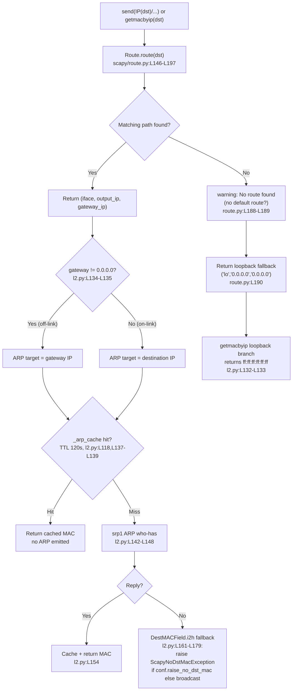

# How Scapy Decides Where to Send a Packet (branch `scapy_0925ada48540`)

This document answers four onboarding questions about how Scapy chooses an egress
interface, resolves the next‑hop MAC, caches ARP results, and behaves when there is
no route. **Every behavioral claim below is backed by two things: (a) a `file:line`
citation into the unmodified source tree, and (b) verbatim runtime output captured by
running Scapy's real entry points** (`conf.route.route()`, `getmacbyip()`, `send()`).
The investigation was performed by *running the code first*; the prose was written from
what was observed.

---

## Setup instructions (reproduced verbatim)

> Set up Scapy from the repository and start an interactive session.

> If you need to run temporary scripts for testing, that's fine, but leave the actual codebase unchanged.

---

## Interactive session, build & environment

Scapy is pure Python and runs **directly from the working tree** — there is no build or
install step. The canonical launcher `run_scapy` performs exactly one thing
(`run_scapy:L13`):

```sh
PYTHONPATH=$DIR exec "$PYTHON" -m scapy $@
```

`$PYTHON` defaults to `python3` (`run_scapy:L5`: `PYTHON=${PYTHON:-python3}`), so the
canonical launch — the one used for every observation in this document — is:

```sh
# from the repository root, as root (raw sockets require it)
PYTHONPATH=. python3 -m scapy      # equivalently: sudo ./run_scapy
```

`README.md:L42-L50` documents this same interactive convention (`sudo ./run_scapy` →
`Welcome to Scapy` banner → `>>>` prompt).

**Observed interactive banner.** Command (the `conf.version` line was typed at the `>>>`
prompt). The output block that follows is the **complete, unedited** capture — including
the raw ANSI color-escape bytes Scapy's console emits, which are explained in the note
directly after the block:

```sh
printf 'conf.version\nexit()\n' | PYTHONPATH=. python3 -m scapy
```

```
INFO: Can't import PyX. Won't be able to use psdump() or pdfdump().
INFO: No IPv6 support in kernel
/tmp/blitzy/scapy/blitzy-bb7aacb7-6abc-402a-a41a-17d4e6e59dbc_27f9eb/scapy/layers/ipsec.py:573: CryptographyDeprecationWarning: TripleDES has been moved to cryptography.hazmat.decrepit.ciphers.algorithms.TripleDES and will be removed from this module in 48.0.0.
  cipher=algorithms.TripleDES,
/tmp/blitzy/scapy/blitzy-bb7aacb7-6abc-402a-a41a-17d4e6e59dbc_27f9eb/scapy/layers/ipsec.py:577: CryptographyDeprecationWarning: TripleDES has been moved to cryptography.hazmat.decrepit.ciphers.algorithms.TripleDES and will be removed from this module in 48.0.0.
  cipher=algorithms.TripleDES,
WARNING: IPython not available. Using standard Python shell instead.
AutoCompletion, History are disabled.
                                      
                     aSPY//YASa       
             apyyyyCY//////////YCa       |
            sY//////YSpcs  scpCY//Pp     | Welcome to Scapy
 ayp ayyyyyyySCP//Pp           syY//C    | Version 2026.07.08
 AYAsAYYYYYYYY///Ps              cY//S   |
         pCCCCY//p          cSSps y//Y   | https://github.com/secdev/scapy
         SPPPP///a          pP///AC//Y   |
              A//A            cyP////C   | Have fun!
              p///Ac            sC///a   |
              P////YCpc           A//A   | What is dead may never die!
       scccccp///pSP///p          p//Y   |                     -- Python 2
      sY/////////y  caa           S//P   |
       cayCyayP//Ya              pY/Ya
        sY/PsY////YCc          aC//Yp 
         sc  sccaCY//PCypaapyCP//YSs  
                  spCPY//////YPSps    
                       ccaacs         
                                      
>>> '2026.07.08'
>>> now exiting InteractiveConsole...
```

> **Note (outside the output block).** The capture above is verbatim and unedited. It
> retains the ANSI SGR color-escape sequences Scapy's interactive console emits: each
> begins with the ESC control byte (`0x1b`, which `cat -v` renders as `^[`) followed by,
> for example, `[32m` / `[34m` / `[1m` (green / blue / bold) and `[0m` (reset). In a
> terminal these render as color; in a Markdown or plain-text viewer the same styled
> text appears with the escape bytes inert.

### Facts observed at startup (labeled as *observed*, not assumed)

- **`conf.version` = `2026.07.08`** *(observed value — the version string is
  date‑derived; it is reported here exactly as produced by this container).*
- **Interpreter:** CPython **3.13.7** *(observed)*; running as **root** (`id -u` == `0`),
  required for the raw‑socket operations (ARP `who-has` emission, sniffing, raw send).
- **`conf.iface` = `eth0`** (`<NetworkInterface eth0 [UP+BROADCAST+RUNNING+SLAVE]>`);
  **`conf.loopback_name` = `'lo'`**.
- **Host network (observed):** host IP `10.236.7.222` on `eth0`, default gateway
  `10.236.7.1`, subnet `10.236.7.0/24`; a secondary `docker0` at `172.17.0.1/16`
  (link‑down); loopback `127.0.0.1/8`.
- **`conf.use_pcap` = `False`; `conf.L2socket` = `L2Socket`; `conf.L3socket` =
  `L3PacketSocket`.** These are *environment facts, not defects*: **libpcap is absent**,
  so Scapy falls back to native Linux `AF_PACKET` sockets. Because BPF filter strings
  cannot be compiled without libpcap, ARP capture in this document uses an
  `AsyncSniffer` with a Python `lfilter=` predicate (never a BPF `filter=`).
- **IPython is absent** → the standard Python shell is used
  (`WARNING: IPython not available…`). This is the canonical fallback banner.
- The `INFO: Can't import PyX…`, `INFO: No IPv6 support in kernel`, and the
  `CryptographyDeprecationWarning: TripleDES` lines are benign import‑time notices.
- The banner's tagline/quote (e.g. *"What is dead may never die! — Python 2"*) is
  **randomly selected on each launch** — across two launches two different quotes were
  observed. The `Version` line and the warnings above are stable.

### Read‑only methodology

Per the setup instructions, **no existing repository file was modified**. Every
observation script lived under `/tmp` (outside the repository) and was deleted after use;
`git status --porcelain` is empty except for this one new document. Any transient
in‑process state change (e.g. flushing the routing table in Q4) is restored within the
same Python process via `conf.route.resync()` and never persisted.

All output blocks below were produced by running a temporary script from the repository
root with `PYTHONPATH=. python3 /tmp/<script>.py`. For each script, **stdout** carries the
experiment's own prints; **stderr** carries only the two benign `TripleDES` import
warnings shown above — *except* where Scapy emits a behavioral warning (Q4), in which case
the relevant stderr line is shown explicitly and labeled.

---

## Q1 — Interface selection

> How does Scapy figure out which network interface to use when sending a packet without explicitly specifying one?

**Direct answer.** Scapy keeps *its own* IPv4 routing table (a copy of the OS table) and,
for every send, does a longest‑prefix lookup of the destination with
`conf.route.route(dst)`. That lookup returns a `(iface, output_ip, gateway_ip)` triple;
the **first element is the egress interface**. At send time the layer‑3 socket uses
exactly that value (`iff = x.route()[0]`) and only falls back to `conf.iface` if the
lookup yields `None`. For an external destination like `8.8.8.8` the lookup selects
`eth0` (the interface of the matching default route).

### Code path

Scapy's table is loaded from the OS at startup. On Linux, `read_routes()` parses
`/proc/net/route` (`scapy/arch/linux.py:L231`), which is why the table you see in Scapy
mirrors the kernel's.

The lookup itself is `Route.route()` (`scapy/route.py:L146`), which documents its return
contract in its own docstring:

```python
    def route(self, dst=None, verbose=conf.verb):
        # type: (Optional[str], int) -> Tuple[str, str, str]
        """Returns the IPv4 routes to a host.
        parameters:
         - dst: the IPv4 of the destination host

        returns: (iface, output_ip, gateway_ip)
         - iface: the interface used to connect to the host
         - output_ip: the outgoing IP that will be used
         - gateway_ip: the gateway IP that will be used
        """
```

Candidate paths are built by scanning every route and keeping those whose network matches
the destination under the route's netmask (`scapy/route.py`, inside `route()`):

```python
        atol_dst = atol(_dst)
        paths = []
        for d, m, gw, i, a, me in self.routes:
            if not a:  # some interfaces may not currently be connected
                continue
            aa = atol(a)
            if aa == atol_dst:
                paths.append(
                    (0xffffffff, 1, (conf.loopback_name, a, "0.0.0.0"))  # noqa: E501
                )
            if (atol_dst & m) == (d & m):
                paths.append((m, me, (i, a, gw)))
```

The most specific match wins. The candidates are sorted by **greatest netmask first**,
with the route metric as a tie‑breaker, and the winner's triple is returned and cached
(`scapy/route.py:L193-L196`):

```python
        # Choose the more specific route
        # Sort by greatest netmask and use metrics as a tie-breaker
        paths.sort(key=lambda x: (-x[0], x[1]))
        # Return interface
        ret = paths[0][2]
        self.cache[dst] = ret
        return ret
```

Finally, the send‑time selection lives in `L3PacketSocket.send()`
(`scapy/arch/linux.py:L598`), which uses the packet's own `.route()[0]` and only falls
back to `conf.iface` when that is `None` (`scapy/arch/linux.py:L600-L602`):

```python
    def send(self, x):
        # type: (Packet) -> int
        iff = x.route()[0]
        if iff is None:
            iff = network_name(conf.iface)
        sdto = (iff, self.type)
        self.outs.bind(sdto)
```

### Cause → effect

`read_routes()` seeds `conf.route.routes` from `/proc/net/route` → `route(dst)` matches
`dst` against those entries by longest prefix → the winning entry's interface field
becomes `route()[0]` → `L3PacketSocket.send` binds its outgoing socket to that interface.
So the interface is *derived from the routing table*, not from `conf.iface`; `conf.iface`
is only the safety‑net default used when a packet's route returns a `None` interface.

### Observed output (primary)

Script `/tmp/q1_route.py`:

```python
from scapy.all import conf

print("conf.version =", conf.version)
print("conf.iface   =", conf.iface)
print()
print("=== conf.route table (print(conf.route)) ===")
print(conf.route)
print()
print("=== conf.route.route(dst) -> (iface, output_ip, gateway_ip) ===")
for dst in ["8.8.8.8", "1.1.1.1", "10.236.7.1", "10.236.7.222", "127.0.0.1"]:
    print("route(%-14s) -> %r" % (dst, conf.route.route(dst)))
```

Command: `PYTHONPATH=. python3 /tmp/q1_route.py` — complete stdout:

```
conf.version = 2026.07.08
conf.iface   = eth0

=== conf.route table (print(conf.route)) ===
Network     Netmask          Gateway     Iface    Output IP     Metric
0.0.0.0     0.0.0.0          10.236.7.1  eth0     10.236.7.222  0     
10.236.7.0  255.255.255.0    10.236.7.1  eth0     10.236.7.222  0     
10.236.7.1  255.255.255.255  0.0.0.0     eth0     10.236.7.222  0     
127.0.0.0   255.0.0.0        0.0.0.0     lo       127.0.0.1     1     
172.17.0.0  255.255.0.0      0.0.0.0     docker0  172.17.0.1    0     

=== conf.route.route(dst) -> (iface, output_ip, gateway_ip) ===
route(8.8.8.8       ) -> ('eth0', '10.236.7.222', '10.236.7.1')
route(1.1.1.1       ) -> ('eth0', '10.236.7.222', '10.236.7.1')
route(10.236.7.1    ) -> ('eth0', '10.236.7.222', '0.0.0.0')
route(10.236.7.222  ) -> ('lo', '10.236.7.222', '0.0.0.0')
route(127.0.0.1     ) -> ('lo', '127.0.0.1', '0.0.0.0')
```

**Stability.** This script was run twice; the output was byte‑for‑byte identical across
both runs, so the selection is stable.

Reading the results against the code:

- `route(8.8.8.8)` and `route(1.1.1.1)` (external) match only the default route
  `0.0.0.0/0` → interface **`eth0`**, gateway `10.236.7.1`.
- `route(10.236.7.1)` matches the `/32` on‑link entry → `eth0`, gateway `0.0.0.0`
  (on‑link, no gateway).
- `route(10.236.7.222)` (the host's *own* address) hits the `aa == atol_dst` branch that
  injects a `0xffffffff` loopback candidate, so it resolves to **`lo`** — a direct,
  observed consequence of that branch quoted above.
- `route(127.0.0.1)` matches `127.0.0.0/8` → **`lo`**. Note this loopback entry is present
  even though `/proc/net/route` did not list it: `read_routes()` adds loopback separately.

### Observed output (send‑time selection & the `conf.iface` fallback edge)

Script `/tmp/q1b_pktroute.py`:

```python
from scapy.all import conf, IP, network_name

# L3PacketSocket.send (linux.py L600-602) does: iff = x.route()[0]; if iff is None: iff = network_name(conf.iface)
p = IP(dst="8.8.8.8")
print("IP(dst='8.8.8.8').route()            ->", p.route())
print("  -> send() egress iface = route()[0] =", repr(p.route()[0]))
print()
p2 = IP()  # no dst set -> demonstrates when the conf.iface fallback matters
print("IP().route() (no dst)                ->", p2.route())
print("network_name(conf.iface)             ->", repr(network_name(conf.iface)))
```

Command: `PYTHONPATH=. python3 /tmp/q1b_pktroute.py` — complete stdout:

```
IP(dst='8.8.8.8').route()            -> ('eth0', '10.236.7.222', '10.236.7.1')
  -> send() egress iface = route()[0] = 'eth0'

IP().route() (no dst)                -> ('lo', '127.0.0.1', '0.0.0.0')
network_name(conf.iface)             -> 'eth0'
```

This shows the exact value `L3PacketSocket.send` consumes: `route()[0] == 'eth0'` for an
external destination. Regarding the `if iff is None:` fallback to `conf.iface` — in every
IP case observed, `route()[0]` was a concrete interface (`'eth0'` or `'lo'`, never
`None`), so the fallback did not trigger. It is a defensive guard rather than the normal
selection mechanism; `conf.iface` itself is `eth0` here.


---

## Q2 — Next‑hop MAC for an external destination

> Once it picks an interface, how does it know what MAC address to send the packet to for reaching an external destination?

**Direct answer.** For a destination that is **off‑link** (reached through a gateway),
Scapy does **not** ARP the destination — it ARPs the **gateway**. `getmacbyip()` looks up
the route, and if the returned gateway is non‑zero it *replaces the target IP with the
gateway IP* and issues an ARP `who-has` for the gateway. The MAC that comes back (and is
used as the frame's destination MAC) is therefore the **gateway's MAC**. Scapy never ARPs
`8.8.8.8`.

### Code path

The L3 `send(IP(dst=…)/…)` path is wired to `getmacbyip` through the neighbor resolver.
For `Ether/IP`, `inet_register_l3` is registered as the L2 resolver and simply calls
`getmacbyip(l3.dst)` (`scapy/layers/inet.py:L1125-L1130`):

```python
def inet_register_l3(l2, l3):
    return getmacbyip(l3.dst)


conf.neighbor.register_l3(Ether, IP, inet_register_l3)
conf.neighbor.register_l3(Dot3, IP, inet_register_l3)
```

`getmacbyip()` (`scapy/layers/l2.py:L122`) is the whole resolution routine. The key line
for this question is the **gateway substitution** at `scapy/layers/l2.py:L134-L135`
(`if gw != "0.0.0.0": ip = gw`). Here is the complete function so the enclosing conditions
are visible and nothing is elided:

```python
def getmacbyip(ip, chainCC=0):
    # type: (str, int) -> Optional[str]
    """Return MAC address corresponding to a given IP address"""
    if isinstance(ip, Net):
        ip = next(iter(ip))
    ip = inet_ntoa(inet_aton(ip or "0.0.0.0"))
    tmp = [orb(e) for e in inet_aton(ip)]
    if (tmp[0] & 0xf0) == 0xe0:  # mcast @
        return "01:00:5e:%.2x:%.2x:%.2x" % (tmp[1] & 0x7f, tmp[2], tmp[3])
    iff, _, gw = conf.route.route(ip)
    if (iff == conf.loopback_name) or (ip in conf.route.get_if_bcast(iff)):
        return "ff:ff:ff:ff:ff:ff"
    if gw != "0.0.0.0":
        ip = gw

    mac = _arp_cache.get(ip)
    if mac:
        return mac

    try:
        res = srp1(Ether(dst=ETHER_BROADCAST) / ARP(op="who-has", pdst=ip),
                   type=ETH_P_ARP,
                   iface=iff,
                   timeout=2,
                   verbose=0,
                   chainCC=chainCC,
                   nofilter=1)
    except Exception as ex:
        warning("getmacbyip failed on %s", ex)
        return None
    if res is not None:
        mac = res.payload.hwsrc
        _arp_cache[ip] = mac
        return mac
    return None
```

### Cause → effect

`route('8.8.8.8')` returns gateway `10.236.7.1` (non‑zero) → the branch
`if gw != "0.0.0.0": ip = gw` rewrites the ARP target from `8.8.8.8` to `10.236.7.1` →
the subsequent `srp1(Ether(dst=ETHER_BROADCAST)/ARP(op="who-has", pdst=ip), …)` asks
"who has **10.236.7.1**?" → the gateway replies, and its `hwsrc` becomes the returned MAC.
That is the L2 next hop for reaching *any* off‑link destination via this gateway.

### Observed output (primary — proving the gateway is ARP'd, not the destination)

Script `/tmp/q2_getmac.py` (uses an `AsyncSniffer` with an `lfilter`, because libpcap is
absent and BPF filters cannot compile):

```python
import time
from scapy.all import conf, getmacbyip, AsyncSniffer, ARP
from scapy.layers.l2 import _arp_cache

# Start fresh so the resolution actually emits an ARP who-has
_arp_cache.flush()

myip = "10.236.7.222"
sniffer = AsyncSniffer(
    iface="eth0",
    lfilter=lambda p: p.haslayer(ARP) and p[ARP].op == 1,
    store=True,
)
sniffer.start()
time.sleep(1.0)  # let the AsyncSniffer spin up

iff, out, gw = conf.route.route("8.8.8.8")
print("route(8.8.8.8) -> (iface=%r, output_ip=%r, gateway_ip=%r)" % (iff, out, gw))

mac = getmacbyip("8.8.8.8")
print("getmacbyip('8.8.8.8') -> %r" % (mac,))

time.sleep(1.0)
res = sniffer.stop()

all_whohas = [(p[ARP].psrc, p[ARP].pdst) for p in res]
ours = [p[ARP].pdst for p in res if p[ARP].psrc == myip]
print("ALL who-has captured (psrc -> pdst):", all_whohas)
print("who-has emitted BY THIS HOST (pdst list):", ours)
print("gateway IP from route            :", gw)
print("did we ever ARP the external 8.8.8.8? ->", ("8.8.8.8" in ours))
```

Command: `PYTHONPATH=. python3 /tmp/q2_getmac.py` — complete stdout:

```
route(8.8.8.8) -> (iface='eth0', output_ip='10.236.7.222', gateway_ip='10.236.7.1')
getmacbyip('8.8.8.8') -> '26:fd:cb:13:1b:44'
ALL who-has captured (psrc -> pdst): [('10.236.7.222', '10.236.7.1')]
who-has emitted BY THIS HOST (pdst list): ['10.236.7.1']
gateway IP from route            : 10.236.7.1
did we ever ARP the external 8.8.8.8? -> False
```

**Interpretation.** The only `who-has` this host emitted while resolving `8.8.8.8` targeted
`pdst = 10.236.7.1` — the **gateway**. The check `"8.8.8.8" in ours` is `False`: Scapy
never ARPs the external IP. The MAC returned by `getmacbyip('8.8.8.8')`
(`26:fd:cb:13:1b:44`) is the **gateway's** MAC. (The MAC value is specific to this run and
network; the structural conclusion — gateway is the ARP target — is the invariant.)

### Edge mode (on‑link destination — ARP the destination directly)

When the destination is **on‑link** the route returns gateway `0.0.0.0`, so the
substitution branch does not fire and Scapy ARPs the destination itself. Resolving the
directly‑reachable `10.236.7.1` shows this (from `/tmp/q4_edgeset.py`):

```
route('10.236.7.1') -> ('eth0', '10.236.7.222', '0.0.0.0')
getmacbyip('10.236.7.1') -> '26:fd:cb:13:1b:44'
```

Because `10.236.7.1` is both directly on‑link *and* happens to be the gateway, the ARP
target is the destination itself (no substitution), and — consistently — the resolved MAC
is the same `26:fd:cb:13:1b:44` observed above.


---

## Q3 — Repeated send in quick succession (ARP cache)

> If you send the same packet twice in quick succession, what ARP behavior is observed?

**Direct answer.** Exactly **one** ARP `who-has` is emitted, not two. The first resolution
is a cache miss that issues the ARP and stores the result in `_arp_cache` (a 120‑second
cache); the second resolution — within that 120 s window — is an instant cache hit that
issues **no** new ARP. Observed timings make this unmistakable: the first call took tens of
milliseconds (it waited for an ARP reply), the second took tens of *microseconds*.

### Code path

The cache is created once at import with a 120‑second TTL
(`scapy/layers/l2.py:L118`):

```python
_arp_cache = conf.netcache.new_cache("arp_cache", 120)  # cache entries expire after 120s
```

Inside `getmacbyip()` (quoted in full under Q2), the cache is consulted *before* any ARP
is sent (`scapy/layers/l2.py:L137-L139`) and written *after* a successful reply
(`scapy/layers/l2.py:L154`):

```python
    mac = _arp_cache.get(ip)
    if mac:
        return mac
```

```python
    if res is not None:
        mac = res.payload.hwsrc
        _arp_cache[ip] = mac
        return mac
```

The cache object is a `CacheInstance` (`scapy/config.py:L347`), a `dict` subclass whose
TTL is enforced on read. `__getitem__` raises `KeyError` once an entry is older than the
timeout (`scapy/config.py:L364-L373`):

```python
    def __getitem__(self, item):
        # type: (str) -> Any
        if item in self.__slots__:
            return object.__getattribute__(self, item)
        val = super(CacheInstance, self).__getitem__(item)
        if self.timeout is not None:
            t = self._timetable[item]
            if time.time() - t > self.timeout:
                raise KeyError(item)
        return val
```

and `__setitem__` timestamps each write (`scapy/config.py:L384-L389`):

```python
    def __setitem__(self, item, v):
        # type: (str, str) -> None
        if item in self.__slots__:
            return object.__setattr__(self, item, v)
        self._timetable[item] = time.time()
        super(CacheInstance, self).__setitem__(item, v)
```

`_arp_cache` is a singleton `conf.netcache` cache (`netcache = NetCache()` at
`scapy/config.py:L845`; `new_cache()` at `scapy/config.py:L498`).

### A storage/iteration asymmetry (documented, not "fixed")

`CacheInstance` stores values in the underlying `dict` (via `super().__setitem__`) and
reads them back through `__getitem__`/`get()`/`in` — all of which see the entry. But its
iteration/aggregation methods read `self.__dict__` (with TTL filtering) instead of the
base dict: `keys()` (`scapy/config.py:L446`), `items()` (`scapy/config.py:L436`),
`values()` (`scapy/config.py:L453`) and `__len__` (`scapy/config.py:L463`). For example:

```python
    def keys(self):
        # type: () -> Any
        if self.timeout is None:
            return super(CacheInstance, self).keys()
        t0 = time.time()
        return [k for k in self.__dict__ if t0 - self._timetable[k] < self.timeout]
```

```python
    def __len__(self):
        # type: () -> int
        if self.timeout is None:
            return super(CacheInstance, self).__len__()
        return len(self.keys())
```

**Net effect:** after a write, `get(key)` returns the value and `key in cache` is `True`,
yet `dict(cache)`, `len(cache)`, and `cache.keys()` render **empty**. This is a benign,
pre‑existing quirk of the cache; it is documented here (observed below), not corrected.

### Cause → effect

First `getmacbyip('8.8.8.8')`: `_arp_cache.get('10.236.7.1')` misses → an ARP `who-has` is
sent and awaited (≈ tens of ms) → on reply, `_arp_cache['10.236.7.1'] = mac` stores the
gateway's MAC with a timestamp. Second `getmacbyip('8.8.8.8')` (well within 120 s):
`_arp_cache.get('10.236.7.1')` hits → returns immediately, sending **no** ARP. Two sends in
quick succession therefore generate exactly one `who-has`. Note the cache is keyed by the
**resolved next hop** (the gateway `10.236.7.1`), not by the external IP `8.8.8.8`.

### Observed output — before / during / after, across two runs

Script `/tmp/q3_cache.py`:

```python
import time
from scapy.all import conf, getmacbyip, AsyncSniffer, ARP
from scapy.layers.l2 import _arp_cache

myip = "10.236.7.222"
gw = "10.236.7.1"

# Start each experiment from an empty cache so call #1 is a genuine miss
_arp_cache.flush()

sniffer = AsyncSniffer(
    iface="eth0",
    lfilter=lambda p: p.haslayer(ARP) and p[ARP].op == 1 and p[ARP].psrc == myip,
    store=True,
)
sniffer.start()
time.sleep(1.0)

print("arp_cache.timeout =", _arp_cache.timeout)
print("BEFORE : dict(_arp_cache)=%r len=%d get(%r)=%r"
      % (dict(_arp_cache), len(_arp_cache), gw, _arp_cache.get(gw)))

t0 = time.perf_counter()
mac1 = getmacbyip("8.8.8.8")
d1 = time.perf_counter() - t0
print("getmacbyip#1('8.8.8.8') -> %r in %.5fs" % (mac1, d1))

print("AFTER#1: get(%r)=%r ; %r in cache=%s ; dict()=%r len=%d"
      % (gw, _arp_cache.get(gw), gw, (gw in _arp_cache), dict(_arp_cache), len(_arp_cache)))

t0 = time.perf_counter()
mac2 = getmacbyip("8.8.8.8")
d2 = time.perf_counter() - t0
print("getmacbyip#2('8.8.8.8') -> %r in %.5fs" % (mac2, d2))

time.sleep(1.0)
res = sniffer.stop()
whohas = [p[ARP].pdst for p in res]
print("who-has emitted BY THIS HOST across BOTH calls (pdst list):", whohas)
print("total who-has count =", len(whohas))
print("cache keyed by gateway (%r) not external 8.8.8.8 -> get('8.8.8.8')=%r"
      % (gw, _arp_cache.get("8.8.8.8")))
```

Command: `PYTHONPATH=. python3 /tmp/q3_cache.py` — **Run 1** complete stdout:

```
arp_cache.timeout = 120
BEFORE : dict(_arp_cache)={} len=0 get('10.236.7.1')=None
getmacbyip#1('8.8.8.8') -> '26:fd:cb:13:1b:44' in 0.06092s
AFTER#1: get('10.236.7.1')='26:fd:cb:13:1b:44' ; '10.236.7.1' in cache=True ; dict()={} len=0
getmacbyip#2('8.8.8.8') -> '26:fd:cb:13:1b:44' in 0.00004s
who-has emitted BY THIS HOST across BOTH calls (pdst list): ['10.236.7.1']
total who-has count = 1
cache keyed by gateway ('10.236.7.1') not external 8.8.8.8 -> get('8.8.8.8')=None
```

Same command — **Run 2** complete stdout:

```
arp_cache.timeout = 120
BEFORE : dict(_arp_cache)={} len=0 get('10.236.7.1')=None
getmacbyip#1('8.8.8.8') -> '26:fd:cb:13:1b:44' in 0.07214s
AFTER#1: get('10.236.7.1')='26:fd:cb:13:1b:44' ; '10.236.7.1' in cache=True ; dict()={} len=0
getmacbyip#2('8.8.8.8') -> '26:fd:cb:13:1b:44' in 0.00003s
who-has emitted BY THIS HOST across BOTH calls (pdst list): ['10.236.7.1']
total who-has count = 1
cache keyed by gateway ('10.236.7.1') not external 8.8.8.8 -> get('8.8.8.8')=None
```

**Stability across ≥2 runs.** Both runs are qualitatively identical: `timeout == 120`;
the cache is empty **before**; call #1 is a miss taking ≈ 61 ms (run 1) / ≈ 72 ms (run 2);
**after #1** the entry is retrievable via `get()`/`in` while `dict()`/`len()` still show
empty (the asymmetry); call #2 is a hit taking ≈ 40 µs (run 1) / ≈ 30 µs (run 2) — roughly
a 1500–2000× speed‑up — and **exactly one** `who-has` was emitted across both calls. The
cache is keyed by the gateway `10.236.7.1` (`get('8.8.8.8')` is `None`). Timings vary by a
few milliseconds/microseconds per run (network‑ and scheduler‑dependent); the invariant —
miss‑then‑hit, one ARP total — is stable.


---

## Q4 — No route to the destination

> What happens when sending a packet to a destination that has no route — at what point does the failure occur and what error message appears?

**Direct answer.** In the default configuration there is **no hard failure** — the send
does **not** raise. When no route matches, `Route.route()` prints the warning
**`WARNING: No route found (no default route?)`** and returns the loopback fallback triple
`('lo', '0.0.0.0', '0.0.0.0')`. Downstream, `getmacbyip()` then returns the broadcast MAC
`ff:ff:ff:ff:ff:ff` via its loopback branch, and `send()` transmits on loopback and prints
`Sent 1 packets.` So the "failure" surfaces as a **soft warning at the routing‑lookup
step**, not an exception. (A separate, opt‑in hard failure exists at MAC resolution — see
the edge mode below.)

### Code path

The no‑route branch is in `Route.route()` (`scapy/route.py:L187-L190`). Note the warning is
guarded by `if verbose:` (and `verbose` defaults to `conf.verb`, which is `2`), and the
function **returns** rather than raising:

```python
        if not paths:
            if verbose:
                warning("No route found (no default route?)")
            return conf.loopback_name, "0.0.0.0", "0.0.0.0"
```

`getmacbyip()` (full body under Q2) then hits its loopback/broadcast branch, because the
returned interface is the loopback name (`scapy/layers/l2.py:L132-L133`):

```python
    if (iff == conf.loopback_name) or (ip in conf.route.get_if_bcast(iff)):
        return "ff:ff:ff:ff:ff:ff"
```

### Cause → effect

An empty candidate list (`paths == []`) → the `if not paths:` branch emits the warning
(because `verbose`/`conf.verb` is truthy) and returns `('lo', '0.0.0.0', '0.0.0.0')` →
`getmacbyip` sees `iff == 'lo' == conf.loopback_name`, so it returns
`ff:ff:ff:ff:ff:ff` without ARPing → `send()` uses `route()[0] == 'lo'` as the egress
interface and transmits on loopback, reporting `Sent 1 packets.`. No exception is raised
anywhere on this default path.

### Observed output (primary)

Script `/tmp/q4_noroute.py` (it flushes the in‑memory table **and** invalidates the
result cache, then restores everything in‑process with `resync()`):

```python
import sys
from scapy.all import conf, getmacbyip, IP, ICMP, send

def flush():
    sys.stdout.flush(); sys.stderr.flush()

print("=== BEFORE flush: table has %d routes ===" % len(conf.route.routes))
saved = list(conf.route.routes)

# Transiently remove every route (in-memory only) to simulate 'no route'
conf.route.routes = []
conf.route.invalidate_cache()   # REQUIRED: route() has its own result cache (route.py L196)
print("=== AFTER flush: table has %d routes ===" % len(conf.route.routes))
flush()

print(">>> conf.route.route('8.8.8.8')"); flush()
r = conf.route.route("8.8.8.8")
print("route('8.8.8.8') ->", r); flush()

print(">>> getmacbyip('8.8.8.8')"); flush()
m = getmacbyip("8.8.8.8")
print("getmacbyip('8.8.8.8') ->", repr(m)); flush()

print(">>> send(IP(dst='8.8.8.8')/ICMP())"); flush()
send(IP(dst="8.8.8.8") / ICMP())
flush()

# Restore the routing table IN-PROCESS (re-reads /proc/net/route)
conf.route.resync()
print("=== AFTER resync: table restored to %d routes ===" % len(conf.route.routes))
print("route('8.8.8.8') after restore ->", conf.route.route("8.8.8.8"))
```

Command: `PYTHONPATH=. python3 /tmp/q4_noroute.py` — complete **stdout**:

```
=== BEFORE flush: table has 5 routes ===
=== AFTER flush: table has 0 routes ===
>>> conf.route.route('8.8.8.8')
route('8.8.8.8') -> ('lo', '0.0.0.0', '0.0.0.0')
>>> getmacbyip('8.8.8.8')
getmacbyip('8.8.8.8') -> 'ff:ff:ff:ff:ff:ff'
>>> send(IP(dst='8.8.8.8')/ICMP())
.
Sent 1 packets.
=== AFTER resync: table restored to 5 routes ===
route('8.8.8.8') after restore -> ('eth0', '10.236.7.222', '10.236.7.1')
```

Complete **stderr** (the two `TripleDES` lines are the benign import banner; the remaining
lines are the *behavioral* warning this question asks about):

```
/tmp/blitzy/scapy/blitzy-bb7aacb7-6abc-402a-a41a-17d4e6e59dbc_27f9eb/scapy/layers/ipsec.py:573: CryptographyDeprecationWarning: TripleDES has been moved to cryptography.hazmat.decrepit.ciphers.algorithms.TripleDES and will be removed from this module in 48.0.0.
  cipher=algorithms.TripleDES,
/tmp/blitzy/scapy/blitzy-bb7aacb7-6abc-402a-a41a-17d4e6e59dbc_27f9eb/scapy/layers/ipsec.py:577: CryptographyDeprecationWarning: TripleDES has been moved to cryptography.hazmat.decrepit.ciphers.algorithms.TripleDES and will be removed from this module in 48.0.0.
  cipher=algorithms.TripleDES,
WARNING: No route found (no default route?)
WARNING: No route found (no default route?)
WARNING: more No route found (no default route?)
```

**Interpretation.**

- **Where the failure occurs:** at the **routing‑lookup step** (`Route.route()`), and it is
  *soft* — a warning plus a loopback fallback, not an exception. `getmacbyip()` returns
  broadcast, and `send()` completes with `Sent 1 packets.` on loopback.
- **What message appears:** exactly **`WARNING: No route found (no default route?)`**
  (`scapy/route.py:L189`). It appears once for **each** internal `route()` call — the
  explicit `conf.route.route('8.8.8.8')`, the one inside `getmacbyip()`, and the one inside
  `send()` — i.e. three times here. Scapy's logger de‑duplicates repeats, so the third is
  rendered as `WARNING: more No route found (no default route?)`.
- **Restoration:** `conf.route.resync()` re‑read `/proc/net/route`, restoring the table to
  5 routes; `route('8.8.8.8')` again returns `('eth0', '10.236.7.222', '10.236.7.1')`. No
  persistent state changed.

### Edge mode — the hard failure at MAC resolution (`DestMACField.i2h`)

There *is* a hard‑failure path, but it lives at L2 MAC resolution and is **opt‑in**. When a
next‑hop MAC cannot be resolved (e.g. an on‑link address whose ARP times out),
`DestMACField.i2h` (`scapy/layers/l2.py:L166`) decides between a broadcast fallback and an
exception based on `conf.raise_no_dst_mac` (`scapy/layers/l2.py:L173-L178`):

```python
    def i2h(self, pkt, x):
        # type: (Optional[Packet], Optional[str]) -> str
        if x is None and pkt is not None:
            try:
                x = conf.neighbor.resolve(pkt, pkt.payload)
            except socket.error:
                pass
            if x is None:
                if conf.raise_no_dst_mac:
                    raise ScapyNoDstMacException()
                else:
                    x = "ff:ff:ff:ff:ff:ff"
                    warning("Mac address to reach destination not found. Using broadcast.")  # noqa: E501
        return super(DestMACField, self).i2h(pkt, x)
```

To exercise both branches, `/tmp/q4_edge.py` adds a transient on‑link route to the RFC 5737
documentation range `192.0.2.0/24` (nobody answers ARP there), resolves an address in it
(ARP times out → `None`), then reads the `Ether` destination once with the default flag and
once with `conf.raise_no_dst_mac = True`; state is restored afterward:

```python
import sys
from scapy.all import conf, getmacbyip, Ether, IP, ICMP
from scapy.error import Scapy_Exception

def flush():
    sys.stdout.flush(); sys.stderr.flush()

# Transient on-link route to RFC5737 documentation range (nobody will answer ARP)
conf.route.add(net="192.0.2.0/24", gw="0.0.0.0", dev="eth0")
print("added transient route; route('192.0.2.123') ->", conf.route.route("192.0.2.123"))
print("conf.raise_no_dst_mac default =", conf.raise_no_dst_mac)
flush()

print(">>> getmacbyip('192.0.2.123')  (ARP will time out ~2s, no host answers)"); flush()
m = getmacbyip("192.0.2.123")
print("getmacbyip('192.0.2.123') ->", repr(m)); flush()

print(">>> DEFAULT (raise_no_dst_mac=False): build Ether()/IP(dst='192.0.2.123')/ICMP(), read .dst"); flush()
p = Ether() / IP(dst="192.0.2.123") / ICMP()
print("Ether.dst (broadcast fallback) ->", p.dst); flush()

print(">>> conf.raise_no_dst_mac = True: rebuild and read .dst"); flush()
conf.raise_no_dst_mac = True
try:
    p2 = Ether() / IP(dst="192.0.2.123") / ICMP()
    _ = p2.dst
    print("no exception (unexpected):", p2.dst)
except Exception as e:
    print("raised -> %s: %s" % (type(e).__name__, e))
flush()

# Restore state IN-PROCESS
conf.raise_no_dst_mac = False
conf.route.resync()
print("restored: raise_no_dst_mac =", conf.raise_no_dst_mac, "; routes =", len(conf.route.routes))
```

Command: `PYTHONPATH=. python3 /tmp/q4_edge.py` — complete **stdout**:

```
added transient route; route('192.0.2.123') -> ('eth0', '10.236.7.222', '0.0.0.0')
conf.raise_no_dst_mac default = False
>>> getmacbyip('192.0.2.123')  (ARP will time out ~2s, no host answers)
getmacbyip('192.0.2.123') -> None
>>> DEFAULT (raise_no_dst_mac=False): build Ether()/IP(dst='192.0.2.123')/ICMP(), read .dst
Ether.dst (broadcast fallback) -> ff:ff:ff:ff:ff:ff
>>> conf.raise_no_dst_mac = True: rebuild and read .dst
raised -> ScapyNoDstMacException: 
restored: raise_no_dst_mac = False ; routes = 5
```

The behavioral **stderr** line for the default case:

```
WARNING: Mac address to reach destination not found. Using broadcast.
```

**Interpretation.** With the default `conf.raise_no_dst_mac == False`, an unresolvable
next‑hop yields `Ether.dst == ff:ff:ff:ff:ff:ff` plus
`WARNING: Mac address to reach destination not found. Using broadcast.`
(`scapy/layers/l2.py:L178`). Flipping `conf.raise_no_dst_mac = True` makes the same build
raise **`ScapyNoDstMacException`** (`scapy/layers/l2.py:L175`; the exception carries an
empty message). This is the *only* place a no‑destination‑MAC condition becomes a hard
error, and only when explicitly enabled. State was restored (`raise_no_dst_mac` back to
`False`, 5 routes).

### Full MAC‑resolution edge set

For completeness, `getmacbyip()` has several short‑circuit branches that never ARP.
Command: `PYTHONPATH=. python3 /tmp/q4_edgeset.py` — complete stdout:

```
=== get_if_bcast('eth0') === ['10.236.7.255']

--- multicast (l2.py L129-130: 01:00:5e mapping) ---
getmacbyip('224.0.0.1') -> '01:00:5e:00:00:01'
getmacbyip('239.1.2.3') -> '01:00:5e:01:02:03'

--- loopback (l2.py L132-133: iff == conf.loopback_name) ---
getmacbyip('127.0.0.1') -> 'ff:ff:ff:ff:ff:ff'

--- subnet broadcast (l2.py L132-133: ip in get_if_bcast) ---
getmacbyip('10.236.7.255') -> 'ff:ff:ff:ff:ff:ff'

--- on-link, gw==0.0.0.0 so NO substitution: ARP the destination itself ---
route('10.236.7.1') -> ('eth0', '10.236.7.222', '0.0.0.0')
getmacbyip('10.236.7.1') -> '26:fd:cb:13:1b:44'
```

Mapping each result to the code:

- **Multicast** (`224.0.0.1`, `239.1.2.3`): the `if (tmp[0] & 0xf0) == 0xe0:` branch
  (`scapy/layers/l2.py:L129-L130`) maps to `01:00:5e:xx:xx:xx` — no route lookup, no ARP.
- **Loopback** (`127.0.0.1`) and **subnet broadcast** (`10.236.7.255`, which is in
  `get_if_bcast('eth0')`): the `if (iff == conf.loopback_name) or (ip in
  conf.route.get_if_bcast(iff)):` branch (`scapy/layers/l2.py:L132-L133`) returns
  `ff:ff:ff:ff:ff:ff`.
- **On‑link** (`10.236.7.1`): gateway `0.0.0.0`, so the substitution branch is skipped and
  Scapy ARPs the destination directly (contrast with the off‑link Q2 case).
- **Off‑link**: the gateway‑substitution branch (Q2) — ARP the gateway.


---

## Consolidated egress decision flow

The end‑to‑end decision Scapy makes for `send(IP(dst)/…)` (or a direct
`getmacbyip(dst)`):



**One‑line summary per question:**

- **Q1 (interface):** longest‑prefix lookup in Scapy's own table →
  `route(dst)[0]` is the egress interface (`eth0` for external destinations).
- **Q2 (next‑hop MAC):** off‑link ⇒ ARP the **gateway** (gateway substitution), so the
  returned MAC is the gateway's, never the external host's.
- **Q3 (repeated send):** first send = ARP miss + 120 s cache write; second send = cache
  hit, **no** second ARP — exactly one `who-has`.
- **Q4 (no route):** soft **warning** `No route found (no default route?)` + loopback
  fallback (no exception by default); the only hard error is the opt‑in
  `ScapyNoDstMacException` at MAC resolution when `conf.raise_no_dst_mac` is set.

---

## Grounding & verification

Every factual claim in this document is backed by **either** a specific `file:line`
citation into the unmodified source tree **or** verbatim runtime output captured by
running Scapy's real entry points (`conf.route.route()`, `getmacbyip()`, `send()`),
launched canonically as `PYTHONPATH=. python3 -m scapy` on CPython 3.13.7 as root.

- **Observed, run‑specific values are labeled as such.** `conf.version = 2026.07.08` is the
  value this container produced (the version string is date‑derived). MAC addresses (e.g.
  the gateway MAC `26:fd:cb:13:1b:44`) and sub‑millisecond timings are captured per run and
  will differ on other hosts/runs; the *structural* conclusions are the invariants.
- **The one non‑canonical setting exercised** is `conf.raise_no_dst_mac = True` in the Q4
  edge case; it is explicitly labeled, exercised only to show the exception branch, and
  reset to its default `False` immediately after.
- **Anything not verifiable was not asserted.** For example, the `L3PacketSocket.send`
  `conf.iface` fallback (`if iff is None:`) was *not* observed to trigger for IP packets
  (their `route()[0]` was always a concrete interface); this is stated rather than claimed
  as exercised.

**Cited source files (all read‑only references — none modified):**

- `scapy/route.py` — `Route.route()` lookup (`L146`), no‑route warning + loopback fallback
  (`L187-L190`), longest‑prefix sort (`L193`), result cache (`L163`, `L196`),
  `invalidate_cache()`/`resync()` (`L37-L45`).
- `scapy/arch/linux.py` — `read_routes()` from `/proc/net/route` (`L231`),
  `L3PacketSocket.send()` interface pick + `conf.iface` fallback (`L598-L602`).
- `scapy/layers/l2.py` — `_arp_cache` 120 s TTL (`L118`), `getmacbyip()` (`L122-L158`)
  with multicast (`L129-L130`), loopback/broadcast (`L132-L133`), gateway substitution
  (`L134-L135`), cache read (`L137-L139`), ARP `who-has` (`L142-L148`), cache write
  (`L154`); `DestMACField.i2h` (`L166-L179`); `l2_register_l3_arp` (`L552`).
- `scapy/layers/inet.py` — `inet_register_l3` binding `getmacbyip(l3.dst)` for `Ether/IP`
  (`L1125-L1130`).
- `scapy/config.py` — `CacheInstance` TTL engine (`L347`, `__getitem__` `L364-L373`,
  `__setitem__` `L384-L389`) and the storage/iteration asymmetry (`items()` `L436`,
  `keys()` `L446`, `values()` `L453`, `__len__` `L463`); `NetCache` singleton (`L845`),
  `new_cache()` (`L498`).
- `run_scapy` — canonical launch invocation (`L5`, `L13`).
- `README.md` — interactive‑session convention (`L42-L50`).

*Note on line anchors:* the `config.py` iteration methods are cited at their **actual**
positions in this branch — `items()` at `L436`, `values()` at `L453` (verified with
`sed -n '<line>p' scapy/config.py`).

