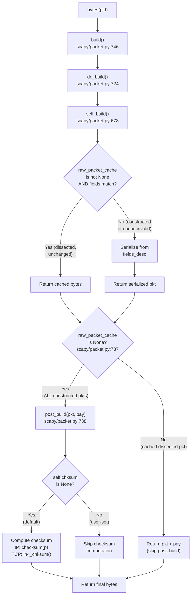

# Scapy Checksum Computation, Caching, and Field Auto-Computation: An Investigative Q&A

This document investigates five concrete scenarios that reveal how Scapy computes checksums,
manages its internal raw-packet cache, handles manual field overrides, isolates deep-copied
packets, and auto-computes the IP total-length field. Every claim is grounded in the Scapy
source code with file paths and line numbers; every hex dump was generated by executing actual
Scapy code against commit `0925ada4`.

**Scenarios covered:**

1. **Initial Checksum Computation** — How are IP and TCP checksums computed on the first `bytes()` call?
2. **Payload Modification and Recalculation** — After changing a payload byte, does Scapy return fresh or stale checksums?
3. **Manual Checksum Override** — Does a user-assigned checksum survive into the final bytes (before *and* after building)?
4. **Deep Copy Isolation** — Does modifying a `copy.deepcopy()` of a packet affect the original?
5. **IP Length Field Consistency After Growth** — After appending payload bytes, does `IP.len` match the actual byte count?

---

## Key Concepts

Before diving into the scenarios, three internal mechanisms must be understood. These are the
engine behind every behavior demonstrated below.

### 1. The `post_build()` Hook

After each layer serializes its fields into bytes (via `self_build()`), the `do_build()` method
at `scapy/packet.py` line 724 may call `post_build(pkt, pay)` — an overridable hook that
performs final fixups on the serialized header.

**For the IP layer** (`scapy/layers/inet.py` line 539):

```python
def post_build(self, p, pay):
    ihl = self.ihl
    p += b"\0" * ((-len(p)) % 4)       # pad IP options if needed
    if ihl is None:                      # line 542: auto-compute IHL
        ihl = len(p) // 4
        p = chb(((self.version & 0xf) << 4) | ihl & 0x0f) + p[1:]
    if self.len is None:                 # line 545: auto-compute total length
        tmp_len = len(p) + len(pay)
        p = p[:2] + struct.pack("!H", tmp_len) + p[4:]
    if self.chksum is None:              # line 548: auto-compute IP header checksum
        ck = checksum(p)
        p = p[:10] + chb(ck >> 8) + chb(ck & 0xff) + p[12:]
    return p + pay
```

**For the TCP layer** (`scapy/layers/inet.py` line 767):

```python
def post_build(self, p, pay):
    p += pay
    dataofs = self.dataofs
    if dataofs is None:                  # line 770: auto-compute data offset
        ...
    if self.chksum is None:              # line 775: auto-compute TCP checksum
        if isinstance(self.underlayer, IP):
            ck = in4_chksum(socket.IPPROTO_TCP, self.underlayer, p)
            p = p[:16] + struct.pack("!H", ck) + p[18:]
        ...
    return p
```

**Critical guard: `if self.chksum is None`** — If the user has explicitly set the `chksum`
field to any non-`None` value, the computation is **SKIPPED entirely**. The user's value is
preserved in the final bytes.

### 2. The `raw_packet_cache` Attribute

Every `Packet` instance has a `raw_packet_cache` attribute, initialized to `None` in
`scapy/packet.py` line 169:

```python
self.raw_packet_cache = None    # line 169
self.raw_packet_cache_fields = None  # line 170
```

This cache is populated **only during dissection** — when raw bytes are parsed into a packet
object via `do_dissect()` at `scapy/packet.py` line 1019:

```python
self.raw_packet_cache = _raw[:-len(s)] if s else _raw  # line 1019
self.explicit = 1                                       # line 1020
```

**For constructed packets** (created via `IP()/TCP()/Raw()`), `raw_packet_cache` is **always
`None`**. It is never populated during construction. This means:

- `self_build()` (line 678) always rebuilds from field values (the cache-check at line 685
  is skipped because `raw_packet_cache is None`).
- `do_build()` (line 737) always calls `post_build()` (because `raw_packet_cache is None`).
- **Caching is NOT a concern for constructed packets.** Every `bytes()` call rebuilds from
  scratch.

### 3. The `setfieldval()` Cache Invalidation

When any field is assigned on a packet layer, `setfieldval()` at `scapy/packet.py` line 472
executes:

```python
def setfieldval(self, attr, val):
    ...
    self.fields[attr] = val ...           # line 482: store the value
    self.explicit = 0                     # line 484: clear explicit flag
    self.raw_packet_cache = None          # line 485: invalidate cache
    self.raw_packet_cache_fields = None   # line 486: invalidate cache metadata
```

This ensures that if a **dissected** packet's field is changed, that layer's cached bytes are
invalidated. However, **parent layers are NOT affected** — only the layer whose field was
modified has its cache cleared. This is a critical pitfall documented in
[the pitfall section on constructed vs. dissected packets](#important-pitfall-constructed-vs-dissected-packets) below.

### Constructed vs. Dissected Packets — At a Glance

| Property | Constructed (`IP()/TCP()`) | Dissected (`IP(raw_bytes)`) |
|---|---|---|
| `chksum` default | `None` | Wire value (e.g., `0x650E`) |
| `raw_packet_cache` | Always `None` | Raw bytes of that layer |
| `explicit` | `0` | `1` |
| `post_build()` called? | **Always** (cache is `None`) | **Only if** cache was invalidated |
| Checksums recomputed on `bytes()`? | **Always** (because `chksum is None`) | **Only if** `del pkt[IP].chksum` was called |

---

## Packet Build Lifecycle

The following flowchart illustrates the path from `bytes(pkt)` to the final serialized output,
showing exactly where caching and checksum computation decisions are made.



**Key takeaway:** For constructed packets, the path is **always** A → B → C → D → E(No) → G →
H → I(Yes) → J → L. There is no shortcut through caching.

Source: `scapy/packet.py` lines 678–740, 746–756; `scapy/layers/inet.py` lines 539–551, 767–786.

---

## Scenario 1: Initial Checksum Computation

### Rationale

When constructing `IP(dst="10.0.0.1") / TCP(dport=80) / Raw(load=b"HELLO")`:

- `IP.chksum` defaults to `None` — defined as `XShortField("chksum", None)` at
  `scapy/layers/inet.py` line 533.
- `IP.len` defaults to `None` — defined as `ShortField("len", None)` at line 527.
- `TCP.chksum` defaults to `None` — defined as `XShortField("chksum", None)` at line 763.
- `raw_packet_cache` is `None` for all layers (never populated for constructed packets).

Therefore `do_build()` at `scapy/packet.py` line 737 sees `raw_packet_cache is None` and
calls `post_build()`, which computes:

1. **IHL** — `IP.post_build()` line 542: `ihl = len(p) // 4 = 20 // 4 = 5`
2. **Total Length** — line 546: `tmp_len = len(p) + len(pay) = 20 + 25 = 45`
3. **IP Checksum** — line 549: `ck = checksum(p)` — the one's complement checksum of the
   20-byte IP header, computed by `checksum()` at `scapy/utils.py` line 496:
   ```python
   def checksum(pkt):
       if len(pkt) % 2 == 1:
           pkt += b"\0"
       s = sum(array.array("H", pkt))
       s = (s >> 16) + (s & 0xffff)
       s += s >> 16
       s = ~s
       return checksum_endian_transform(s) & 0xffff
   ```
4. **TCP Checksum** — `TCP.post_build()` line 777: `ck = in4_chksum(socket.IPPROTO_TCP,
   self.underlayer, p)` — this builds an IPv4 pseudo-header (source IP + destination IP +
   protocol + TCP segment length) via `in4_pseudoheader()` at line 654, then calls
   `checksum()` on the concatenation of pseudo-header + TCP segment (header + payload).

### Test Script

```python
from scapy.all import IP, TCP, Raw, conf
conf.verb = 0
pkt = IP(dst="10.0.0.1") / TCP(dport=80) / Raw(load=b"HELLO")
raw = bytes(pkt)
print(raw.hex())
print(f"IP checksum (bytes 10-11): {raw[10:12].hex()}")
print(f"TCP checksum (bytes 36-37): {raw[36:38].hex()}")
```

### Hex Output

```
Full hex (45 bytes):
4500002d000100004006650e0aec00d00a00000100140050000000000000000050022000962b000048454c4c4f
```

**Annotated breakdown:**

| Byte Offset | Hex | Field | Value |
|---|---|---|---|
| 0 | `45` | Version + IHL | Version 4, IHL 5 (20 bytes) |
| 1 | `00` | TOS | 0 |
| 2–3 | `002d` | Total Length | **45** decimal (20 IP + 20 TCP + 5 payload) |
| 4–5 | `0001` | Identification | 1 |
| 6–7 | `0000` | Flags + Fragment Offset | 0 |
| 8 | `40` | TTL | 64 |
| 9 | `06` | Protocol | 6 (TCP) |
| **10–11** | **`650e`** | **IP Checksum** | **0x650E** (computed by `checksum()`) |
| 12–15 | `0aec00d0` | Source IP | 10.236.0.208 (auto-resolved) |
| 16–19 | `0a000001` | Destination IP | 10.0.0.1 |
| 20–21 | `0014` | TCP Source Port | 20 |
| 22–23 | `0050` | TCP Destination Port | 80 |
| 24–27 | `00000000` | Sequence Number | 0 |
| 28–31 | `00000000` | Acknowledgment Number | 0 |
| 32–33 | `5002` | Data Offset + Flags | Data Offset = 5 (20 bytes), Flags = SYN |
| 34–35 | `2000` | Window Size | 8192 |
| **36–37** | **`962b`** | **TCP Checksum** | **0x962B** (computed by `in4_chksum()`) |
| 38–39 | `0000` | Urgent Pointer | 0 |
| 40–44 | `48454c4c4f` | Payload | ASCII `"HELLO"` |

> **Note:** The source IP (`10.236.0.208`) is auto-resolved by Scapy based on the routing
> table and will vary across machines. All checksum values depend on the source IP and will
> differ accordingly.

---

## Scenario 2: Payload Modification and Recalculation

### Rationale

After the initial `bytes()` call, the packet object's fields are unchanged. Critically,
`raw_packet_cache` remains `None` for **all** layers — constructed packets **never** populate
this cache. It is set only by `do_dissect()` at `scapy/packet.py` line 1019, which is called
during dissection, not construction.

When we assign `pkt[Raw].load = b"JELLO"`:

1. `setfieldval()` at `scapy/packet.py` line 472 is called on the `Raw` layer.
2. It stores the new value (line 482) and sets `raw_packet_cache = None` (line 485) — but the
   cache was **already `None`** for a constructed packet.

**The key insight:** For constructed packets, every `bytes()` call rebuilds from scratch.
`self_build()` (line 678) finds `raw_packet_cache is None`, so it serializes all fields fresh.
`do_build()` (line 737) finds `raw_packet_cache is None`, so it calls `post_build()`.
**Scapy produces FRESH checksums, not stale cached bytes.**

**Why the IP checksum stays the same:** The IP checksum covers only the 20-byte IP header (per
RFC 791). Since the IP header fields are unchanged (the payload modification does not affect IP
header bytes), the IP checksum remains `0x650E`.

**Why the TCP checksum changes:** The TCP checksum covers the IPv4 pseudo-header + TCP header +
payload data (per RFC 793). The payload changed from `HELLO` to `JELLO` — specifically, byte 40
changed from `0x48` (ASCII `'H'`) to `0x4A` (ASCII `'J'`). In the one's complement checksum,
this changes the 16-bit word at that position from `0x4845` (`"HE"`) to `0x4A45` (`"JE"`), a
difference of `+0x0200`. Because checksum = `~sum`, the checksum decreases by `0x0200`:
from `0x962B` to `0x942B`.

### Test Script

```python
from scapy.all import IP, TCP, Raw, conf
conf.verb = 0
pkt = IP(dst="10.0.0.1") / TCP(dport=80) / Raw(load=b"HELLO")
before = bytes(pkt)
pkt[Raw].load = b"JELLO"
after = bytes(pkt)
print("BEFORE:", before.hex())
print("AFTER: ", after.hex())
```

### Full Before Hex Dump

```
BEFORE (45 bytes):
4500002d000100004006650e0aec00d00a00000100140050000000000000000050022000962b000048454c4c4f
```

### Full After Hex Dump

```
AFTER (45 bytes):
4500002d000100004006650e0aec00d00a00000100140050000000000000000050022000942b00004a454c4c4f
```

### Byte-by-Byte Comparison

Only **two bytes** differ between the before and after hex dumps:

| Byte Position | Field | Before | After | Explanation |
|---|---|---|---|---|
| 36 | TCP Checksum high byte | `0x96` | `0x94` | Recomputed: decreased by `0x02` due to payload change |
| 40 | Payload byte 0 | `0x48` (`'H'`) | `0x4A` (`'J'`) | User modification |

All other 43 bytes are identical. The IP checksum at bytes 10–11 remains `650e` because the IP
header is unchanged.

---

## Scenario 3: Manual Checksum Override

### Scenario 3a: Set Before Building

**Rationale:** When constructing `IP(dst="10.0.0.1", chksum=0xAAAA)`, the keyword argument is
processed in `Packet.__init__()` at `scapy/packet.py` line 185. The value `0xAAAA` is stored in
`self.fields["chksum"]` (line 188). When `bytes()` is called, `IP.post_build()` at
`scapy/layers/inet.py` line 548 evaluates `if self.chksum is None` — since `self.chksum` is
`0xAAAA` (not `None`), **the checksum computation is SKIPPED entirely**. The manual value
`0xAAAA` survives into the final bytes at positions 10–11.

**Test Script:**

```python
from scapy.all import IP, TCP, Raw, conf
conf.verb = 0
pkt = IP(dst="10.0.0.1", chksum=0xAAAA) / TCP(dport=80) / Raw(load=b"HELLO")
raw = bytes(pkt)
print(raw.hex())
print(f"IP checksum: {raw[10:12].hex()}")  # aaaa
```

**Full Hex Dump:**

```
4500002d000100004006aaaa0aec00d00a00000100140050000000000000000050022000962b000048454c4c4f
```

- **Bytes 10–11: `aaaa` → `0xAAAA` survived.** The `post_build()` guard skipped IP checksum
  computation.
- TCP checksum at bytes 36–37: `962b` → `0x962B` — still computed normally because
  `TCP.chksum` was `None`.

### Scenario 3b: Set After Building

**Rationale:** First we build the packet normally (getting IP checksum `0x650E`). Then we assign
`pkt[IP].chksum = 0xAAAA`. This calls `setfieldval()` at `scapy/packet.py` line 472, which:

1. Stores `0xAAAA` in `self.fields["chksum"]` (line 482).
2. Clears `raw_packet_cache = None` (line 485) — though it was already `None` for a constructed
   packet.

When `bytes()` is called again, `post_build()` evaluates `if self.chksum is None` — it finds
`0xAAAA`, so computation is skipped. **The manual value survives.**

**Test Script:**

```python
from scapy.all import IP, TCP, Raw, conf
conf.verb = 0
pkt = IP(dst="10.0.0.1") / TCP(dport=80) / Raw(load=b"HELLO")
initial = bytes(pkt)  # IP checksum = 0x650E
pkt[IP].chksum = 0xAAAA
after = bytes(pkt)
print("Initial:", initial.hex())
print("After:  ", after.hex())
print(f"IP checksum: {after[10:12].hex()}")  # aaaa
```

**Initial Hex Dump (before override):**

```
4500002d000100004006650e0aec00d00a00000100140050000000000000000050022000962b000048454c4c4f
```

**After Override Hex Dump:**

```
4500002d000100004006aaaa0aec00d00a00000100140050000000000000000050022000962b000048454c4c4f
```

- **Bytes 10–11: `aaaa` → `0xAAAA` survived in the post-build case too.**

### Summary

In **BOTH** cases (pre-build and post-build assignment), the manual checksum survives because
`IP.post_build()` uses the `if self.chksum is None` guard at `scapy/layers/inet.py` line 548.
Once the field has a non-`None` value, Scapy respects the user's override and does not
recompute.

---

## Scenario 4: Deep Copy Isolation

### Rationale

`copy.deepcopy(pkt)` calls `Packet.__deepcopy__()` at `scapy/packet.py` line 239, which
simply delegates to `self.copy()`:

```python
def __deepcopy__(self, memo):
    """Used by copy.deepcopy"""
    return self.copy()           # line 244
```

The `copy()` method at `scapy/packet.py` line 407 creates a fully independent packet:

1. **New instance:** `clone = self.__class__()` (line 409) — fresh `Packet` object.
2. **Deep-copied fields:** `clone.fields = self.copy_fields_dict(self.fields)` (line 410) and
   `clone.default_fields = self.copy_fields_dict(self.default_fields)` (line 411). This creates
   independent dictionaries with deep-copied mutable values.
3. **Recursive payload copy:** `clone.payload = self.payload.copy()` (line 422) — each layer in
   the payload chain gets its own independent copy.
4. **Underlayer re-wiring:** `clone.payload.add_underlayer(clone)` (line 423) — the copy's
   payload points back to the copy, not the original.

After the deep copy, modifying the copy's `Raw.load` field only affects the **copy's** field
dictionary. The original packet retains its original field values. When we call `bytes()` on the
original after the copy is modified, it rebuilds from its own unchanged fields and produces
**identical bytes**.

### Test Script

```python
import copy
from scapy.all import IP, TCP, Raw, conf
conf.verb = 0
pkt = IP(dst="10.0.0.1") / TCP(dport=80) / Raw(load=b"HELLO")
original_before = bytes(pkt)
pkt_copy = copy.deepcopy(pkt)
pkt_copy[Raw].load = b"WORLD"
copy_bytes = bytes(pkt_copy)
original_after = bytes(pkt)
print("Original BEFORE:", original_before.hex())
print("Original AFTER: ", original_after.hex())
print("Copy:           ", copy_bytes.hex())
print(f"Original unchanged: {original_before == original_after}")
```

### Hex Evidence

**Original BEFORE deep copy (45 bytes):**

```
4500002d000100004006650e0aec00d00a00000100140050000000000000000050022000962b000048454c4c4f
```

**Copy AFTER modification (45 bytes):**

```
4500002d000100004006650e0aec00d00a000001001400500000000000000000500220008c210000574f524c44
```

**Original AFTER copy was modified (45 bytes):**

```
4500002d000100004006650e0aec00d00a00000100140050000000000000000050022000962b000048454c4c4f
```

**Result: Original is IDENTICAL before and after** — `copy.deepcopy()` provides full isolation.

Differences between original and copy (3 regions):

| Byte Position | Field | Original | Copy | Explanation |
|---|---|---|---|---|
| 36–37 | TCP Checksum | `962b` (0x962B) | `8c21` (0x8C21) | Recomputed for "WORLD" payload |
| 40–44 | Payload | `48454c4c4f` ("HELLO") | `574f524c44` ("WORLD") | Modified in copy only |

---

## Scenario 5: IP Length Field Consistency After Growth

### Rationale

`IP.len` defaults to `None` — defined as `ShortField("len", None)` at `scapy/layers/inet.py`
line 527. In `IP.post_build()` at line 545:

```python
if self.len is None:                    # line 545
    tmp_len = len(p) + len(pay)         # line 546: IP header + payload
    p = p[:2] + struct.pack("!H", tmp_len) + p[4:]  # line 547: write at bytes 2-3
```

Because `self.len` remains `None` after construction (it was never explicitly set), **every
`bytes()` call triggers the length computation fresh**. When the payload grows from 5 bytes
(`b"HELLO"`) to 15 bytes (`b"HELLOEXTRA_____"`), the IP total length is recomputed:
from `45` (20 + 20 + 5) to `55` (20 + 20 + 15).

The IP checksum also changes because bytes 2–3 (the length field) in the IP header changed,
which affects the header checksum. The TCP checksum also changes because the TCP pseudo-header
includes the TCP segment length (which grew by 10 bytes), and the payload content changed.

### Test Script

```python
from scapy.all import IP, TCP, Raw, conf
conf.verb = 0
pkt = IP(dst="10.0.0.1") / TCP(dport=80) / Raw(load=b"HELLO")
small = bytes(pkt)
pkt[Raw].load = b"HELLOEXTRA_____"
grown = bytes(pkt)
print("Small:", small.hex())
print("Grown:", grown.hex())
```

### Hex Evidence — Small Payload (5 bytes, total 45 bytes)

```
4500002d000100004006650e0aec00d00a00000100140050000000000000000050022000962b000048454c4c4f
```

- IP Total Length (bytes 2–3): `002d` = **45 decimal**
- Actual byte count: **45**
- **Match: ✅ YES**

### Hex Evidence — Grown Payload (15 bytes, total 55 bytes)

```
4500003700010000400665040aec00d00a00000100140050000000000000000050022000cd87000048454c4c4f45585452415f5f5f5f5f
```

- IP Total Length (bytes 2–3): `0037` = **55 decimal**
- Actual byte count: **55**
- **Match: ✅ YES**

### Comparison Table

| Metric | Small Payload | Grown Payload |
|---|---|---|
| Payload | `b"HELLO"` (5 bytes) | `b"HELLOEXTRA_____"` (15 bytes) |
| IP.len field | 45 | 55 |
| Actual byte count | 45 | 55 |
| Match | ✅ Yes | ✅ Yes |
| IP checksum | 0x650E | 0x6504 |
| TCP checksum | 0x962B | 0xCD87 |

The IP checksum changed from `0x650E` to `0x6504` because the IP header's length field changed
from `0x002D` to `0x0037`. The TCP checksum changed from `0x962B` to `0xCD87` because both the
pseudo-header TCP length and the payload content changed.

---

## Important Pitfall: Constructed vs. Dissected Packets

All five scenarios above use **constructed** packets — created via `IP()/TCP()/Raw()`. For these
packets, `raw_packet_cache` is **always `None`** and fields like `chksum` default to `None`.
This means checksums are **always recomputed fresh** on every `bytes()` call.

**Dissected packets behave DIFFERENTLY.** When a packet is created from raw bytes (e.g.,
`IP(raw_bytes)`), the dissection process at `scapy/packet.py` line 1002 (`do_dissect()`)
produces fundamentally different internal state:

1. `raw_packet_cache` is populated with the raw bytes consumed by that layer (line 1019).
2. `explicit` is set to `1` (line 1020).
3. Fields like `chksum` have the **wire value** (e.g., `0x650E`), **NOT** `None`.

### The Stale Checksum Problem

When you modify a deeper layer on a dissected packet (e.g., `pkt[Raw].load = b"JELLO"`):

- Only the `Raw` layer's cache is cleared by `setfieldval()` (line 485).
- **Parent layers (IP, TCP) retain their stale cached bytes.**
- When `do_build()` (line 737) processes the IP and TCP layers, it sees
  `raw_packet_cache is not None`, so it returns `pkt + pay` **WITHOUT calling `post_build()`**.
- **Checksums are NOT recomputed. They remain stale.**

### Evidence — Dissected Packet with Modified Payload

Starting from the same valid packet bytes as Scenario 1, we dissect and then modify:

```python
from scapy.all import IP, TCP, Raw, conf
conf.verb = 0
# Build valid bytes from a constructed packet
constructed = IP(dst="10.0.0.1") / TCP(dport=80) / Raw(load=b"HELLO")
raw_bytes = bytes(constructed)

# Dissect those bytes
pkt = IP(raw_bytes)
pkt[Raw].load = b"JELLO"  # Modify payload
modified = bytes(pkt)
print("Modified dissected:", modified.hex())
```

**Output (dissected packet after payload modification):**

```
4500002d000100004006650e0aec00d00a00000100140050000000000000000050022000962b00004a454c4c4f
```

- IP checksum (bytes 10–11): `650e` — **STALE** (same as original, should be `650e` anyway since IP header unchanged)
- TCP checksum (bytes 36–37): `962b` — **STALE** (should be `942b` for "JELLO" payload)
- Payload (bytes 40–44): `4a454c4c4f` — changed to "JELLO" ✅

The TCP checksum is **wrong** — it still reflects the "HELLO" payload (`0x962B`) rather than the
correct value for "JELLO" (`0x942B`).

### The Fix: `clear_cache()` + Delete Checksum Fields

To force full recomputation on a dissected packet after modification:

```python
pkt.clear_cache()        # Recursively clear raw_packet_cache (scapy/packet.py line 664)
del pkt[IP].chksum       # Reset to None so post_build() recomputes (uses delfieldval at line 504)
del pkt[TCP].chksum      # Reset to None so post_build() recomputes
raw = bytes(pkt)         # Now checksums are fresh
```

The `clear_cache()` method at `scapy/packet.py` line 664 recursively sets `raw_packet_cache =
None` for the layer, all packet-holding fields, and the entire payload chain. The `del
pkt[IP].chksum` syntax calls `delfieldval()` at line 504, which removes `"chksum"` from
`self.fields`, causing it to fall back to the default value (`None`), which causes `post_build()`
to recompute.

**After fix:**

```
4500002d000100004006650e0aec00d00a00000100140050000000000000000050022000942b00004a454c4c4f
```

- TCP checksum: `942b` — **CORRECT** ✅ (matches the fresh constructed "JELLO" packet)

---

## Summary of Key Findings

| Scenario | Question | Answer | Evidence |
|---|---|---|---|
| 1 | Are checksums computed on first `bytes()` call? | **Yes.** `post_build()` computes them because `chksum` defaults to `None`. | IP: `0x650E`, TCP: `0x962B` |
| 2 | Does payload modification produce stale checksums? | **No** (for constructed packets). Every `bytes()` call rebuilds from scratch because `raw_packet_cache` is `None`. | TCP: `0x962B` → `0x942B`; IP: unchanged `0x650E` |
| 3a | Does `chksum=0xAAAA` survive when set before build? | **Yes.** `post_build()` skips computation when `self.chksum is not None`. | IP checksum: `0xAAAA` |
| 3b | Does `chksum=0xAAAA` survive when set after build? | **Yes.** `setfieldval()` stores the value; next `post_build()` sees non-`None` and skips. | IP checksum: `0xAAAA` |
| 4 | Does modifying a deep copy affect the original? | **No.** `copy.deepcopy()` creates fully independent packet hierarchies via `Packet.copy()`. | Original hex identical before and after copy modification |
| 5 | Does `IP.len` match actual byte count after growth? | **Yes.** `IP.len` is recomputed from scratch on every `bytes()` call because it defaults to `None`. | 45→45 ✅, 55→55 ✅ |

**Critical caveat:** These results apply to **constructed** packets. **Dissected** packets
exhibit different caching behavior — see the
[pitfall section](#important-pitfall-constructed-vs-dissected-packets) above.

---

## Source Code References

All line numbers reference Scapy commit `0925ada4`.

| File | Lines | Content |
|---|---|---|
| `scapy/packet.py` | 169–170 | `raw_packet_cache` and `raw_packet_cache_fields` initialization in `__init__()` |
| `scapy/packet.py` | 239–244 | `__deepcopy__()` delegates to `self.copy()` |
| `scapy/packet.py` | 407–426 | `copy()` creates independent instance with deep-copied fields and recursive payload copy |
| `scapy/packet.py` | 472–486 | `setfieldval()` stores field value, clears `raw_packet_cache`, clears `raw_packet_cache_fields` |
| `scapy/packet.py` | 504–517 | `delfieldval()` removes field from `self.fields`, clears cache, resets `explicit` |
| `scapy/packet.py` | 592–594 | `__bytes__()` delegates to `self.build()` |
| `scapy/packet.py` | 664–676 | `clear_cache()` recursively clears `raw_packet_cache` for layer, packet fields, and payload |
| `scapy/packet.py` | 678–713 | `self_build()` checks `raw_packet_cache` validity; if valid, returns cached bytes |
| `scapy/packet.py` | 724–740 | `do_build()` calls `self_build()`, then decides: if `raw_packet_cache is None` → `post_build()`; else → `pkt + pay` |
| `scapy/packet.py` | 746–756 | `build()` entry point: calls `do_build()` + `build_padding()` + `build_done()` |
| `scapy/packet.py` | 1002–1021 | `do_dissect()` populates `raw_packet_cache` (line 1019) and sets `explicit = 1` (line 1020) |
| `scapy/layers/inet.py` | 521–537 | `IP` class definition with `fields_desc`: `chksum=None`, `len=None`, `ihl=None` |
| `scapy/layers/inet.py` | 539–551 | `IP.post_build()`: computes IHL (line 542), total length (line 546), IP checksum (line 549) |
| `scapy/layers/inet.py` | 654–689 | `in4_pseudoheader()`: builds IPv4 pseudo-header for TCP/UDP checksum computation |
| `scapy/layers/inet.py` | 692–704 | `in4_chksum()`: computes checksum over pseudo-header + upper-layer segment |
| `scapy/layers/inet.py` | 753–765 | `TCP` class definition with `fields_desc`: `chksum=None`, `dataofs=None` |
| `scapy/layers/inet.py` | 767–786 | `TCP.post_build()`: computes data offset (line 770), TCP checksum via `in4_chksum()` (line 777) |
| `scapy/utils.py` | 496–504 | `checksum()`: one's complement sum of 16-bit words, fold carry, bitwise NOT |

---

## Reproducibility Note

- **Scapy version:** Commit `0925ada4` (Scapy 2.7.0 development)
- **Python version:** 3.12.3
- **Operating system:** Linux
- **Source IP:** `10.236.0.208` — auto-resolved by Scapy from the local routing table. This
  will differ on other machines, causing **all** checksum values to change. The IP, TCP header
  structure and byte positions remain the same.
- **Packet parameters:** `dst="10.0.0.1"`, `dport=80`, `load=b"HELLO"`, yielding 45 total
  bytes (20-byte IP header + 20-byte TCP header + 5-byte payload).
- **Reproducibility:** Run any of the test scripts above in a Python environment with this
  Scapy version installed. The hex outputs will match if the source IP resolves to the same
  address (`10.236.0.208`). If the source IP differs, only the source IP bytes (12–15) and
  checksum bytes (10–11 for IP, 36–37 for TCP) will change.
