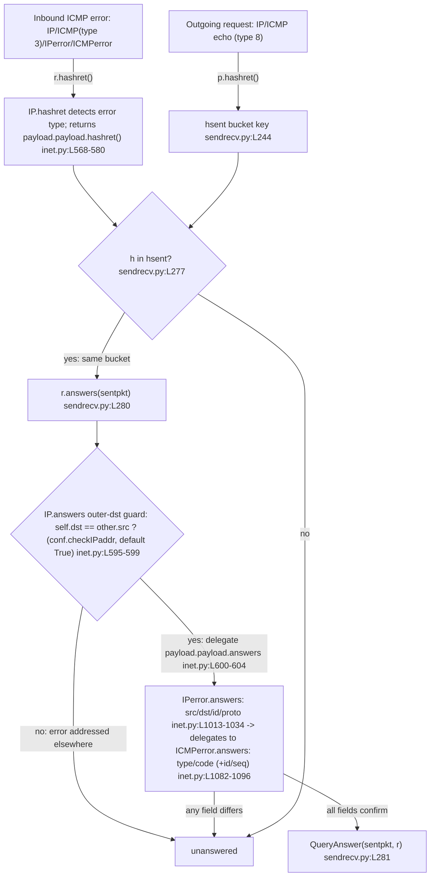

# How Scapy Matches ICMP Error Messages to the Requests That Triggered Them

## Preamble — scope, environment, and methodology

**Question answered.** When you send an ICMP echo request to an unreachable host and receive an
ICMP *destination‑unreachable* error back, how does Scapy decide that the error response matches
the original request? This document answers that question, and the four follow‑on questions it
raises, for **IPv4 / ICMPv4** request↔response matching. IPv6 / ICMPv6 is explicitly **out of
scope** (noted only as a one‑line boundary in Q5).

**Environment (canonical build).**

- Scapy `conf.version = 2026.07.13` (captured live — see the Q1 probe output below).
- Python **3.12.7** (CPython) — the canonical interpreter used for every captured output below.
- The package is imported **in‑tree from the repository checkout** — it is **not** `pip`‑installed.

**Methodology (read‑only, runtime‑observed).** Every answer below is backed by *actual captured
runtime output*, shown in a fenced code block next to the exact command that produced it. Nothing
here is asserted from reading source alone; behavioral claims are labelled **observed**, and the
rare claim derived purely from reading (not running) is labelled ***(inferred)***. This is a
read‑only investigation: **no source, test, documentation, or configuration file was modified.**
All probe scripts were written under `/tmp` (outside the repository) and deleted after their output
was captured, so the working tree is left unchanged.

**Canonical invocation.** Every probe is run from the repository root as:

```
PYTHONPATH=$PWD /opt/scapy-venv/bin/python /tmp/<probe>.py
```

Here `/opt/scapy-venv/bin/python` is the canonical virtualenv interpreter (CPython 3.12.7, with
`cryptography==41.0.7` pinned) named in the environment section above; it — not the container's
system `python3` — produced every captured output in this document.

`PYTHONPATH=$PWD` is **required**. A bare `/opt/scapy-venv/bin/python /tmp/probe.py` puts the
*script's own directory* (`/tmp`) first on `sys.path`; because there is no `scapy` package under
`/tmp`, the import fails with `ModuleNotFoundError: No module named 'scapy'`. Setting `PYTHONPATH`
to the repository root makes the in‑tree `scapy/` package importable, so the code under study is
the code in this checkout — not some other installed copy. The local package is deliberately **not**
`pip`‑installed for the same reason.

**Standard error.** Under the canonical interpreter, every probe below writes **nothing to
stderr** — so the captured `stdout` blocks are the *complete* output, and the exact command shown
is `PYTHONPATH=$PWD /opt/scapy-venv/bin/python /tmp/<probe>.py` with no stderr redirection needed.
(For contrast — observed, not idealized — running the same probe under the container's *system*
interpreter `python3`, CPython 3.13.7, produces byte‑identical `stdout` (verified: both interpreters
yield the same `stdout` SHA‑256) but additionally emits cosmetic `CryptographyDeprecationWarning`
output about `TripleDES`, originating in `scapy/layers/ipsec.py:573` and `:577`, on **stderr only**
(586 bytes); it changes no value shown anywhere in this document.
That warning is precisely why the pinned‑`cryptography` virtualenv interpreter — whose stderr is
empty — is the canonical one.)

**Why we call `hashret()` / `answers()` directly (no network).** The public send/receive entry
points are `sr()` / `sr1()` (background: `doc/scapy/usage.rst:L304` — *"The sr() function is for
sending packets and receiving answers …"*). But `sr()`/`sr1()` do not themselves decide "does this
reply match?"; they delegate that decision to **two predicate methods on the packet objects** —
`hashret()` and `answers()` — invoked by the `SndRcvHandler` engine in `scapy/sendrecv.py`. Those
two predicates are pure Python and require **no network privileges**, so we exercise them directly
on crafted packets and on raw‑bytes re‑dissection (exactly the objects `SndRcvHandler` would feed
them). This yields byte‑exact, reproducible observations of the matching decision itself. No live
transmission to a real unreachable host is needed to produce any evidence in this document.

---

## The Two‑Stage Matching Mechanism (overview)

Scapy's request/response matcher is **two‑stage**, orchestrated by `SndRcvHandler` in
`scapy/sendrecv.py`:

1. **Stage 1 — O(1) bucket key via `hashret()`.** On the send side, every outgoing packet is
   bucketed by its hash: `self.hsent.setdefault(p.hashret(), []).append(p)`
   [`scapy/sendrecv.py:L244`]. On the receive side, each inbound packet's hash is computed,
   `h = r.hashret()` [`scapy/sendrecv.py:L276`], and looked up: `if h in self.hsent`
   [`scapy/sendrecv.py:L277`]. This is a cheap dictionary lookup that narrows the candidate set to
   the handful of sent packets sharing the same hash.
2. **Stage 2 — field confirmation via `answers()`.** For each candidate in the matching bucket,
   Scapy confirms the match field‑by‑field: `if r.answers(sentpkt): self.ans.append(QueryAnswer(sentpkt, r))`
   [`scapy/sendrecv.py:L280-L281`].

So `hashret()` is a fast filter (a hash bucket key) and `answers()` is the precise confirmer. The
two stages treat the outer error headers **differently**, and getting this right is the key insight
for ICMP errors (developed in Q1/Q2):

- **Stage 1 (`hashret`) recurses *fully* into the embedded original packet** — the RFC 792
  "citation" — and never folds the outer error IP/ICMP into the bucket key. `IP.hashret()`
  short‑circuits to `return self.payload.payload.hashret()` for ICMP error types
  [`scapy/layers/inet.py:L568-L572`], so the outer error addresses/type contribute nothing to the
  hash.
- **Stage 2 (`answers`) does *not* purely recurse.** `IP.answers()` first applies an
  **outer‑destination guard** — under the default `conf.checkIPaddr = True` it requires the error's
  own destination to equal the request's source (`elif (self.dst != other.src): return 0`)
  [`scapy/layers/inet.py:L595-L599`] — and **only then** delegates into the citation via
  `return self.payload.payload.answers(other)` [`scapy/layers/inet.py:L600-L604`]. So a stray error
  that happens to embed a matching citation but was addressed to the wrong host is rejected by
  `answers()` even though its `hashret()` collides with the request (observed in Q1).



The maintainers exercise exactly these predicates in the regression suite — e.g.
`test/regression.uts:L1217-L1233` asserts `p1.hashret() == p2.hashret()` and `p2.answers(p1)` for a
request/reply pair (with a disciplined `conf` save/restore at `L1223-L1233`), and
`test/scapy/layers/inet.uts:L506-L531` asserts `answer.answers(query) == True` for the
`IPerror`/`UDPerror`/`TCPerror`/`ICMPerror` citation classes. The probes below mirror that style.

---

## Q1 — Matching strategy: does Scapy extract and compare the embedded original packet?

**Answer (observed): YES.** Scapy extracts the embedded original packet — the RFC 792 "citation",
i.e. the copy of the original IP header plus leading payload bytes that every ICMP error message
carries — and compares *its* fields against the request. The two stages treat the outer error
differently: for the **hash** (Stage 1) it ignores the outer error completely and hashes only the
citation; for **confirmation** (Stage 2) it applies exactly one outer‑header check — the
outer‑destination guard, i.e. that the error was addressed *back to us* (`self.dst == other.src`,
under the default `conf.checkIPaddr = True`) — and **then** recurses **into** the citation for the
field‑by‑field comparison. This is why a *destination‑unreachable* error (whose outer IP/ICMP type
and its source address are entirely different from the echo request) still matches the echo request
that provoked it — while a superficially similar error addressed to a *different* host is rejected
at the guard.

**Mechanism, by name and `file:line`:**

- **Routing to the citation type.** `ICMP.guess_payload_class()` routes ICMP error types
  `[3, 4, 5, 11, 12]` to the `IPerror` class [`scapy/layers/inet.py:L1000-L1004`]. So when an ICMP
  type‑3 error is dissected, its payload is parsed as `IPerror` — an `IP` subclass,
  `class IPerror(IP)` [`scapy/layers/inet.py:L1013`] — then as `ICMPerror`, an `ICMP` subclass,
  `class ICMPerror(ICMP)` [`scapy/layers/inet.py:L1079`]. The citation sub‑layers are wired by
  protocol via `bind_layers(IPerror, ICMPerror, frag=0, proto=1)` [`scapy/layers/inet.py:L1108`]
  (and the sibling bindings at `L1107-L1110` for `IPerror`/`TCPerror`/`UDPerror`).
- **Stage 1 recursion in `hashret`.** `IP.hashret()` detects the ICMP‑error case —
  `self.proto == socket.IPPROTO_ICMP and isinstance(self.payload, ICMP) and self.payload.type in [3, 4, 5, 11, 12]`
  — and returns `self.payload.payload.hashret()` [`scapy/layers/inet.py:L568-L572`]. That is, it
  **skips the outer IP/ICMP and hashes the embedded `IPerror` citation** instead.
- **Stage 2 outer‑destination guard, then delegation, in `answers`.** `IP.answers()` does **not**
  jump straight into the citation. It first runs the **outer‑destination guard**: under the default
  `conf.checkIPaddr = True`, `elif (self.dst != other.src): return 0`
  [`scapy/layers/inet.py:L595-L599`] rejects any error not addressed back to the request's source.
  Only if that guard passes does it detect the ICMP‑error case and return
  `self.payload.payload.answers(other)` [`scapy/layers/inet.py:L600-L604`; the delegation line is
  `L604`], handing off to `IPerror.answers()` [`scapy/layers/inet.py:L1016-L1034`], which compares
  the citation's fields against the original request (and itself delegates to `ICMPerror.answers()`
  — the full chain is developed in Q3 and Q5).
- **Base fallbacks.** The layer methods ultimately delegate into the generic
  `Packet.hashret()` [`scapy/packet.py:L1215-L1219`] and `Packet.answers()`
  [`scapy/packet.py:L1221-L1226`].

**Probe (`/tmp/probe_q1q2.py`):**

```python
from scapy.all import IP, ICMP, IPerror, ICMPerror, conf
import binascii

print("conf.version =", conf.version)
print("defaults: checkIPID=%r checkIPsrc=%r checkIPaddr=%r checkIPinIP=%r check_TCPerror_seqack=%r"
      % (conf.checkIPID, conf.checkIPsrc, conf.checkIPaddr, conf.checkIPinIP, conf.check_TCPerror_seqack))

req = IP(src="1.2.3.4", dst="1.2.3.7")/ICMP(type=8, id=0x1234, seq=1)
err = IP(src="1.2.3.7", dst="1.2.3.4")/ICMP(type=3, code=1)/IPerror(src="1.2.3.4", dst="1.2.3.7")/ICMPerror(type=8, id=0x1234, seq=1)
print("req.summary() =", req.summary())
print("err.summary() =", err.summary())
print("last layer of err =", err.lastlayer().__class__.__name__)
print("ICMP(type=3).guess_payload_class ->", err[ICMP].guess_payload_class(b"").__name__)
hr = req.hashret(); he = err.hashret()
print("req.hashret() =", binascii.hexlify(hr).decode())
print("err.hashret() =", binascii.hexlify(he).decode())
print("hashes equal   =", hr == he)
print("err.answers(req) =", err.answers(req))
print("req.answers(err) =", req.answers(err))

# --- Stage 2 outer-destination guard: wrong OUTER dst, citation still correct ---
err_baddst = IP(src="1.2.3.7", dst="9.9.9.9")/ICMP(type=3, code=1)/IPerror(src="1.2.3.4", dst="1.2.3.7")/ICMPerror(type=8, id=0x1234, seq=1)
print("\n-- outer-destination guard (checkIPaddr) --")
print("err_baddst outer dst =", err_baddst.dst, " request src =", req.src)
print("err_baddst.hashret()      =", binascii.hexlify(err_baddst.hashret()).decode())
print("hash still == req.hashret() =", err_baddst.hashret() == req.hashret())
print("checkIPaddr=True  -> err_baddst.answers(req) =", err_baddst.answers(req))
conf.checkIPaddr = False
print("checkIPaddr=False -> err_baddst.answers(req) =", err_baddst.answers(req))
conf.checkIPaddr = True
print("restored conf.checkIPaddr =", conf.checkIPaddr)

# --- assertions (fail loudly if any value regresses) ---
assert conf.version == "2026.07.13"
assert (conf.checkIPID, conf.checkIPsrc, conf.checkIPaddr, conf.checkIPinIP, conf.check_TCPerror_seqack) == (False, True, True, True, False)
assert err.lastlayer().__class__.__name__ == "ICMPerror"
assert err[ICMP].guess_payload_class(b"").__name__ == "IPerror"
assert hr == he == binascii.unhexlify("000000030134120100")
assert err.answers(req) == 1 and req.answers(err) == 0
# outer-dst guard: hash equal, but answers rejected under default checkIPaddr, accepted when disabled
assert err_baddst.hashret() == req.hashret()
assert err_baddst.answers(req) == 0
conf.checkIPaddr = False
assert err_baddst.answers(req) == 1
conf.checkIPaddr = True
assert conf.checkIPaddr is True
print("ALL ASSERTIONS PASSED")
```

**Command:** `PYTHONPATH=$PWD /opt/scapy-venv/bin/python /tmp/probe_q1q2.py`

**Actual captured output (verbatim):**

```
conf.version = 2026.07.13
defaults: checkIPID=False checkIPsrc=True checkIPaddr=True checkIPinIP=True check_TCPerror_seqack=False
req.summary() = IP / ICMP 1.2.3.4 > 1.2.3.7 echo-request 0
err.summary() = IP / ICMP 1.2.3.7 > 1.2.3.4 dest-unreach host-unreachable / IPerror / ICMPerror
last layer of err = ICMPerror
ICMP(type=3).guess_payload_class -> IPerror
req.hashret() = 000000030134120100
err.hashret() = 000000030134120100
hashes equal   = True
err.answers(req) = 1
req.answers(err) = 0

-- outer-destination guard (checkIPaddr) --
err_baddst outer dst = 9.9.9.9  request src = 1.2.3.4
err_baddst.hashret()      = 000000030134120100
hash still == req.hashret() = True
checkIPaddr=True  -> err_baddst.answers(req) = 0
checkIPaddr=False -> err_baddst.answers(req) = 1
restored conf.checkIPaddr = True
ALL ASSERTIONS PASSED
```

**Cause → effect.**

- The error object's **last layer is `ICMPerror`** — the embedded copy of the original ICMP echo.
  In this probe the object was *hand‑built* with that citation, so its presence demonstrates the
  matcher's **predicate behavior** on a well‑formed error; the proof that Scapy actually *parses* a
  citation out of an opaque byte stream comes from the raw re‑dissection in Q2 (`IP(raw(err))`),
  where the same `IPerror`/`ICMPerror` layers reappear from bytes alone.
- `ICMP(type=3).guess_payload_class(...) -> IPerror` confirms the type‑3 routing at `inet.py:L1001-L1002`.
- `err.hashret() == req.hashret()` (both `000000030134120100`) confirms Stage‑1 recursion:
  `IP.hashret()` returned `self.payload.payload.hashret()` (the citation's hash), so the error lands
  in the *same* `hsent` bucket as the request (decomposed byte‑by‑byte in Q2).
- `err.answers(req) == 1` while `req.answers(err) == 0` — **direction matters**. The error *answers*
  the request, but not vice‑versa. Stage 2 passed the outer‑destination guard (the error's dst
  `1.2.3.4` equals the request's src `1.2.3.4`) and then delegated to `IPerror.answers()` at
  `inet.py:L604`.
- **Outer‑destination guard, observed.** The `err_baddst` variant is identical *except* its outer dst
  is `9.9.9.9` (not the request's source). Its `hashret()` is still `000000030134120100` — equal to
  the request, because Stage 1 hashes only the citation — yet `answers(req) = 0` under the default
  `conf.checkIPaddr = True`: `IP.answers()` bailed at the guard `self.dst != other.src`
  [`inet.py:L595-L599`] *before* ever delegating to the citation. Flipping `conf.checkIPaddr = False`
  removes the guard and the *same* packet then matches (`answers = 1`). This is the concrete proof
  that Stage 2 is **not** a pure recursion into the citation.

**Observed.** Confirmed stable across 2 runs; the probe restores `conf.checkIPaddr = True`.

A companion probe (`/tmp/probe_q2_decomp.py`, shown in Q2) additionally **re‑dissects the error from
raw bytes** (`IP(raw(err))`) — exercising the **same dissection path a received byte stream would
use**. Nothing is sniffed or transmitted here: `raw()` serializes the crafted object and `IP(...)`
parses it back from bytes, exactly as `SndRcvHandler` would parse a packet handed to it by the
sniffer. There too the last dissected layer is `ICMPerror` and `answers(req) == 1`.

---

## Q2 — Hashing mechanism: what hash does the error produce, and how does it compare to the request's?

**Answer (observed): the error's `hashret()` is byte‑identical to the request's `hashret()`,
namely `000000030134120100`.** They are equal because `IP.hashret()` recurses into the embedded
citation for ICMP errors (Q1), so both the outgoing echo request and the returning error end up
hashing the *same logical packet* — the original IP+ICMP echo. Equal hashes ⇒ they land in the same
`hsent` bucket, which is precisely what makes Stage 1 of the matcher pair them up.

**Byte decomposition, by name and `file:line`.** For an ICMP echo, the hash is built by
`IP.hashret()` (the non‑error branch) [`scapy/layers/inet.py:L577-L580`] as:

```
strxor(inet_pton(AF_INET, src), inet_pton(AF_INET, dst)) + struct.pack("B", proto) + self.payload.hashret()
```

and `ICMP.hashret()` folds in `id`/`seq` for id/seq‑bearing types:
`struct.pack("HH", self.id, self.seq) + self.payload.hashret()` [`scapy/layers/inet.py:L986-L989`].
For our request (`src=1.2.3.4`, `dst=1.2.3.7`, `proto=ICMP=1`, `id=0x1234`, `seq=1`):

- `strxor(1.2.3.4, 1.2.3.7)` = `00000003` (the two addresses differ only in the last octet:
  `0x04 ^ 0x07 = 0x03`).
- proto byte = `01` (ICMP).
- `struct.pack("HH", 0x1234, 1)` = `34120100` — little‑endian host order: `0x1234 → 3412`, `1 → 0100`.
- concatenation = **`000000030134120100`**.

**`icmp_id_seq_types` (named).** `icmp_id_seq_types = [0, 8, 13, 14, 15, 16, 17, 18, 37, 38]`
[`scapy/layers/inet.py:L949`]. `ICMP.hashret()` only folds `id`/`seq` into the hash when
`self.type in icmp_id_seq_types` [`scapy/layers/inet.py:L987`]. **Type 8 (echo request) IS in this
list**, so its id/seq are folded (yielding the `34120100` tail). **Type 3 (dest‑unreachable) is
deliberately ABSENT**, so if `ICMP.hashret()` were ever reached on the *outer* error ICMP it would
fall through to `return self.payload.hashret()` [`L989`] and recurse to its payload rather than fold
its own id/seq. In practice `IP.hashret()` short‑circuits into the citation *before* the outer ICMP
is ever hashed (Q1), but the two mechanisms are consistent: neither folds the outer type‑3 ICMP.

**Probe (`/tmp/probe_q2_decomp.py`):**

```python
from scapy.all import IP, ICMP, IPerror, ICMPerror, conf
from scapy.compat import raw as craw
from scapy.utils import strxor          # strxor lives in scapy.utils (scapy/utils.py:L603), not scapy.compat
import socket, struct, binascii
from socket import inet_pton, AF_INET

src, dst, pid, seq = "1.2.3.4", "1.2.3.7", 0x1234, 1
part_addr = strxor(inet_pton(AF_INET, src), inet_pton(AF_INET, dst))
part_proto = struct.pack("B", socket.IPPROTO_ICMP)
part_idseq = struct.pack("HH", pid, seq)
print("strxor(src,dst)      =", binascii.hexlify(part_addr).decode())
print("proto byte (ICMP=1)  =", binascii.hexlify(part_proto).decode())
print("struct.pack(HH,id,seq)=", binascii.hexlify(part_idseq).decode())
manual = part_addr + part_proto + part_idseq
print("manual concatenation =", binascii.hexlify(manual).decode())
req = IP(src=src, dst=dst)/ICMP(type=8, id=pid, seq=seq)
print("req.hashret()        =", binascii.hexlify(req.hashret()).decode())
print("manual == req.hashret() ->", manual == req.hashret())
err = IP(src=dst, dst=src)/ICMP(type=3, code=1)/IPerror(src=src, dst=dst)/ICMPerror(type=8, id=pid, seq=seq)
redis = IP(craw(err))   # re-dissect from raw bytes: same dissection path a received byte stream uses
print("re-dissected last layer =", redis.lastlayer().__class__.__name__)
print("redis.hashret()          =", binascii.hexlify(redis.hashret()).decode())
print("redis.answers(req)       =", redis.answers(req))

# --- assertions (fail loudly if any value regresses) ---
assert binascii.hexlify(part_addr).decode() == "00000003"
assert binascii.hexlify(part_proto).decode() == "01"
assert binascii.hexlify(part_idseq).decode() == "34120100"
assert manual == req.hashret() == binascii.unhexlify("000000030134120100")
assert redis.lastlayer().__class__.__name__ == "ICMPerror"
assert redis.hashret() == req.hashret()
assert redis.answers(req) == 1
print("ALL ASSERTIONS PASSED")
```

**Command:** `PYTHONPATH=$PWD /opt/scapy-venv/bin/python /tmp/probe_q2_decomp.py`

**Actual captured output (verbatim):**

```
strxor(src,dst)      = 00000003
proto byte (ICMP=1)  = 01
struct.pack(HH,id,seq)= 34120100
manual concatenation = 000000030134120100
req.hashret()        = 000000030134120100
manual == req.hashret() -> True
re-dissected last layer = ICMPerror
redis.hashret()          = 000000030134120100
redis.answers(req)       = 1
ALL ASSERTIONS PASSED
```

The manual reconstruction `00000003` + `01` + `34120100` = `000000030134120100` equals
`req.hashret()` byte‑for‑byte, verifying the decomposition against the exact bytes Scapy emitted.
The re‑dissected‑from‑raw error (`IP(raw(err))`) yields the same hash and `answers(req) == 1`,
confirming the recursion works when the error is parsed from a raw byte string — the **same
dissection path a received packet takes** — not only on a hand‑crafted object. (No packet is sniffed
or transmitted; `raw()`/`IP(...)` is a pure serialize‑then‑parse round trip.)

**Second probe (`/tmp/probe_idseq.py`) — proves the recursion, the `icmp_id_seq_types` gate, and the
embedded‑ICMP‑id coupling:**

```python
from scapy.all import IP, ICMP, IPerror, ICMPerror, conf
from scapy.layers.inet import icmp_id_seq_types
import binascii

print("icmp_id_seq_types =", icmp_id_seq_types)
print("3 in icmp_id_seq_types ->", 3 in icmp_id_seq_types)
print("8 in icmp_id_seq_types ->", 8 in icmp_id_seq_types)
h8 = ICMP(type=8, id=0x1234, seq=1).hashret()
h3 = ICMP(type=3).hashret()
print("ICMP(type=8,id=0x1234,seq=1).hashret() = %s (folds id/seq: %s)"
      % (binascii.hexlify(h8).decode(), binascii.hexlify(h8).decode()))
print("ICMP(type=3).hashret()                 = %s (no id/seq folded)" % binascii.hexlify(h3).decode())

req = IP(src="1.2.3.4", dst="1.2.3.7")/ICMP(type=8, id=0x1234, seq=1)
err = IP(src="1.2.3.7", dst="1.2.3.4")/ICMP(type=3, code=1)/IPerror(src="1.2.3.4", dst="1.2.3.7")/ICMPerror(type=8, id=0x1234, seq=1)
he = err.hashret(); hc = err[IPerror].hashret()
print("err.hashret()                 =", binascii.hexlify(he).decode())
print("err[IPerror].hashret()        =", binascii.hexlify(hc).decode(), "(identical: proves recursion into citation)")
print("equal ->", he == hc)

# embedded-ICMP-id coupling (feeds the Q5 chain): mutate ONLY the embedded ICMPerror id
err_badid = IP(src="1.2.3.7", dst="1.2.3.4")/ICMP(type=3, code=1)/IPerror(src="1.2.3.4", dst="1.2.3.7")/ICMPerror(type=8, id=0x9999, seq=1)
print("err_badid.hashret()           =", binascii.hexlify(err_badid.hashret()).decode(), "(embedded id 0x9999 folded in)")
print("err_badid.hashret()==req      ->", err_badid.hashret() == req.hashret())
print("err_badid.answers(req)        =", err_badid.answers(req))

# --- assertions (fail loudly if any value regresses) ---
assert 3 not in icmp_id_seq_types and 8 in icmp_id_seq_types
assert binascii.hexlify(h8).decode() == "34120100"
assert h3 == b""                                   # type 3 folds nothing -> empty
assert he == hc == req.hashret() == binascii.unhexlify("000000030134120100")
assert err_badid.hashret() == binascii.unhexlify("000000030199990100")
assert err_badid.hashret() != req.hashret()        # embedded id changes the hash bucket
assert err_badid.answers(req) == 0                 # ...and fails ICMPerror.answers id/seq check
print("ALL ASSERTIONS PASSED")
```

**Command:** `PYTHONPATH=$PWD /opt/scapy-venv/bin/python /tmp/probe_idseq.py`

**Actual captured output (verbatim):**

```
icmp_id_seq_types = [0, 8, 13, 14, 15, 16, 17, 18, 37, 38]
3 in icmp_id_seq_types -> False
8 in icmp_id_seq_types -> True
ICMP(type=8,id=0x1234,seq=1).hashret() = 34120100 (folds id/seq: 34120100)
ICMP(type=3).hashret()                 =  (no id/seq folded)
err.hashret()                 = 000000030134120100
err[IPerror].hashret()        = 000000030134120100 (identical: proves recursion into citation)
equal -> True
err_badid.hashret()           = 000000030199990100 (embedded id 0x9999 folded in)
err_badid.hashret()==req      -> False
err_badid.answers(req)        = 0
ALL ASSERTIONS PASSED
```

**Cause → effect.**

- `err.hashret() == err[IPerror].hashret()` (both `000000030134120100`) is the direct proof that
  `IP.hashret()` returned the citation's hash — the recursion at `inet.py:L572`. Hashing the whole
  error object gives the *same* value as hashing the embedded `IPerror` alone.
- `ICMP(type=8,…).hashret()` = `34120100` shows type 8 folds id/seq (`inet.py:L988`), whereas the
  **empty** output for `ICMP(type=3).hashret()` shows type 3 folds nothing (falls through to
  `L989`) — because 3 ∉ `icmp_id_seq_types`.
- **Embedded id/seq are part of the hash *and* the confirmation.** Mutating only the embedded
  `ICMPerror` id to `0x9999` changes `err_badid.hashret()` to `000000030199990100` (no longer equal
  to the request) — because `ICMP.hashret()` folded `struct.pack("HH", 0x9999, 1)` via the
  `icmp_id_seq_types` gate [`inet.py:L986-L989`] — and it also drives `answers(req) = 0`, since
  `ICMPerror.answers()` requires id/seq equality (developed in Q3/Q5). So the embedded protocol
  fields, unlike trailing extension bytes, influence *both* stages.
- The citation‑hash equality is exactly the maintainer invariant `assert p1.hashret() == p2.hashret()`
  seen at `test/regression.uts:L1217` for a request/reply pair.

**Observed.** Stable across 2 runs.

---

## Q3 — Subtly modified citation (TTL / checksum) and the configuration toggles

**Answer (observed):** A changed embedded **TTL or checksum does NOT break the match.**
`IPerror.answers()` compares **only** `src`, `dst`, `id`, and `proto` — it never inspects TTL or
checksum [`scapy/layers/inet.py:L1016-L1034`], so those fields are *structurally incapable* of
affecting the match. The two runtime toggles that govern matching strictness for error citations are
`conf.checkIPsrc` (default `True`) [`scapy/config.py:L751`] and `conf.check_TCPerror_seqack`
(default `False`) [`scapy/config.py:L758`].

A subtlety this section documents by running the code: `conf.checkIPsrc` acts at **both** stages of
the matcher, not just at `answers()`. In **Stage 1** it changes the `hashret()` *bucket key* — when
`conf.checkIPsrc and conf.checkIPaddr` are both truthy, `IP.hashret()` folds the address bytes
`strxor(inet_pton(src), inet_pton(dst))` into the key [`scapy/layers/inet.py:L577-L580`]; when either
is disabled it falls through to the address‑free key `struct.pack("B", proto) + payload.hashret()`
[`scapy/layers/inet.py:L581`]. In **Stage 2** the same flag gates the `test_IPsrc` field comparison in
`IPerror.answers()` [`scapy/layers/inet.py:L1021`] and the port comparisons in
`TCPerror`/`UDPerror.answers()`. The probes below therefore report the **hash value** (Stage‑1 bucket)
alongside the `answers()` result (Stage‑2 confirmation) for every citation‑source and port transition,
so the toggle's effect is visible at both layers.

**Named mechanisms, `file:line`, and sibling variants:**

- **`IPerror.answers()`** body [`scapy/layers/inet.py:L1016-L1034`]:
  - `test_IPsrc = not conf.checkIPsrc or self.src == other.src` [`L1021`]
  - `test_IPdst = self.dst == other.dst` [`L1022`]
  - `test_IPid = not conf.checkIPID or self.id == other.id` [`L1025`], then
    `test_IPid |= conf.checkIPID and self.id == socket.htons(other.id)` [`L1026`]
  - `test_IPproto = self.proto == other.proto` [`L1029`]
  - gate: `if not (test_IPsrc and test_IPdst and test_IPid and test_IPproto): return 0` [`L1031`]

  **There is no TTL term and no checksum term anywhere in this method** → mutating either on the
  citation cannot change the outcome.
- **`TCPerror.answers()`** [`scapy/layers/inet.py:L1043-L1057`]: if `conf.checkIPsrc`, requires
  `sport`/`dport` equal; if `conf.check_TCPerror_seqack`, requires `seq`/`ack` equal (each only when
  the corresponding field is non‑`None`).
- **`UDPerror.answers()`** [`scapy/layers/inet.py:L1066-L1073`]: if `conf.checkIPsrc`, requires
  `sport`/`dport` equal.
- **`ICMPerror.answers()`** [`scapy/layers/inet.py:L1082-L1096`]: requires `type` and `code` equal;
  and for `self.code in [0, 8, 13, 14, 17, 18]` additionally requires `id`/`seq` equal.

**Stage‑1 (`hashret`) bucket mechanisms gated by the same toggles — these decide whether the request
and the error even land in the same bucket:**

- **`IP.hashret()`** [`scapy/layers/inet.py:L568-L581`]: for the ICMP error types `[3, 4, 5, 11, 12]`
  it first recurses into the embedded citation via `return self.payload.payload.hashret()`
  [`L572`]; the resulting citation key then folds the **address** bytes
  `strxor(inet_pton(AF_INET, src), inet_pton(AF_INET, dst))` **only when `conf.checkIPsrc and
  conf.checkIPaddr`** [`L577-L580`]. If either flag is off, the fallback key at [`L581`] omits the
  address term entirely. So `conf.checkIPsrc` changes the *bucket key*, not merely the field check.
- **`TCP.hashret()`** [`scapy/layers/inet.py:L788-L792`]: folds `struct.pack("H", sport ^ dport)` into
  the key **only when `conf.checkIPsrc`** [`L790`]; otherwise it returns just `payload.hashret()`
  [`L792`]. A wrong TCP port therefore moves the citation into a *different* bucket while
  `checkIPsrc=True`.
- **`UDP.hashret()`** [`scapy/layers/inet.py:L870-L871`]: `return self.payload.hashret()` — it folds
  **no ports at all**, regardless of any flag. A wrong UDP port thus lands in the **same** bucket as
  the request; the port mismatch is caught only later, by `UDPerror.answers()` in Stage 2. This
  TCP‑vs‑UDP asymmetry is a sibling contrast the probe exercises directly.

### Probe A (`/tmp/probe_q3b.py`) — TTL/checksum isolation + `ICMPerror.answers` variants

```python
from scapy.all import IP, ICMP, IPerror, ICMPerror, conf
req = IP(src="1.2.3.4", dst="1.2.3.7")/ICMP(type=8, id=0x1234, seq=1)
err = IP(src="1.2.3.7", dst="1.2.3.4")/ICMP(type=3, code=1)/IPerror(src="1.2.3.4", dst="1.2.3.7")/ICMPerror(type=8, id=0x1234, seq=1)
b0 = err.answers(req)
print("citation before: ttl=%r chksum=%r  answers=%d" % (err[IPerror].ttl, err[IPerror].chksum, b0))
err[IPerror].ttl = 7
err[IPerror].chksum = 0xDEAD
b1 = err.answers(req)
print("citation after : ttl=%r chksum=%r  answers=%d" % (err[IPerror].ttl, err[IPerror].chksum, b1))
ie = err[ICMPerror]
r_ie = ie.answers(req[ICMP])
print("ICMPerror.answers(req[ICMP]) type/code+id/seq =", r_ie)
ie2 = ICMPerror(type=0, code=0, id=0x1234, seq=1)
r_ie2 = ie2.answers(req[ICMP])
print("ICMPerror(type=0).answers(req ICMP type8)     =", r_ie2)
ie3 = ICMPerror(type=8, code=0, id=0x9999, seq=1)
r_ie3 = ie3.answers(req[ICMP])
print("ICMPerror(type=8,id=0x9999).answers(req ICMP) =", r_ie3)

# --- assertions (Finding #7) ---
assert b0 == 1                 # baseline matches
assert b1 == 1                 # TTL & checksum mutations do NOT change the result
assert r_ie == 1               # type/code + id/seq all match
assert r_ie2 == 0              # type mismatch (0 vs 8) -> reject
assert r_ie3 == 0              # id mismatch (0x9999) -> reject (code 0 in [0,8,13,14,17,18])
print("ALL ASSERTIONS PASSED")
```

**Command:** `PYTHONPATH=$PWD /opt/scapy-venv/bin/python /tmp/probe_q3b.py`

**Actual captured output (verbatim):**

```
citation before: ttl=64 chksum=None  answers=1
citation after : ttl=7 chksum=57005  answers=1
ICMPerror.answers(req[ICMP]) type/code+id/seq = 1
ICMPerror(type=0).answers(req ICMP type8)     = 0
ICMPerror(type=8,id=0x9999).answers(req ICMP) = 0
ALL ASSERTIONS PASSED
```

**Cause → effect (before/after state).** With the citation's `ttl=64` and `chksum=None` (unset),
`answers()` is `1`. After forcing `ttl=7` and `chksum=0xDEAD` (`= 57005` decimal), `answers()`
**stays `1`** → TTL and checksum are ignored, exactly as predicted from the absence of those terms
in `IPerror.answers()`. The `ICMPerror.answers` variants show the sibling behavior: a type mismatch
(0 vs 8) returns `0`, and an id mismatch (`0x9999`) returns `0` because `code 0 ∈ [0,8,13,14,17,18]`
forces the id/seq equality check [`inet.py:L1088`].

### Probe B (`/tmp/probe_q3.py`) — `checkIPsrc` / `check_TCPerror_seqack` sweep (TCP‑ and UDP‑in‑error)

This probe covers `conf.checkIPsrc` at **both** stages and `conf.check_TCPerror_seqack` at Stage 2.
Section `[A]` re‑confirms the TTL/checksum/IP‑id invariance of the ICMP citation and its
hash‑equality. Section `[S]` mutates the **citation source address** and prints the request's and the
error's `hashret()` **hash key** on either side of a `conf.checkIPsrc` flip, exposing the Stage‑1
bucket change. Section `[B]` crafts a TCP‑in‑ICMP citation
(`treq = IP()/TCP(sport=1234, dport=80, seq=1000, ack=0)` and
`terr = IP()/ICMP(type=3, code=3)/IPerror()/TCPerror(sport=1234, dport=80, seq=1000)`), sweeps
`conf.check_TCPerror_seqack` over a wrong `seq`, then sweeps `conf.checkIPsrc` over a wrong `dport`
while printing the TCP hash keys (which fold `sport ^ dport`). Section `[C]` repeats the port sweep
for `UDPerror` and prints the UDP hash keys, which **do not** fold ports — demonstrating the
TCP‑vs‑UDP bucket asymmetry. Every `conf` value the probe touches is saved up front and restored at
the end (mirroring the `.uts` save/restore discipline at `test/regression.uts:L1223-L1233`), and the
final assertions fail loudly on any regression.

```python
# Q3 Probe B: checkIPsrc source/hash effects + check_TCPerror_seqack (TCP/UDP-in-error)
# Findings #2b (full script), #4 (source-addr + Stage-1 hash), #7 (asserts)
from scapy.all import IP, ICMP, TCP, UDP, IPerror, ICMPerror, TCPerror, UDPerror, conf
import binascii
def hx(p):
    return binascii.hexlify(p.hashret()).decode()

# save every conf flag we touch, restore at the end (mirrors test/regression.uts:L1223-L1233)
save = dict(checkIPsrc=conf.checkIPsrc, checkIPaddr=conf.checkIPaddr,
            checkIPID=conf.checkIPID, check_TCPerror_seqack=conf.check_TCPerror_seqack)
print("defaults checkIPsrc=%r checkIPaddr=%r check_TCPerror_seqack=%r checkIPID=%r"
      % (conf.checkIPsrc, conf.checkIPaddr, conf.check_TCPerror_seqack, conf.checkIPID))

# ---- [A] ICMP citation: TTL/checksum/IP-id invariance + hash equality ----
req = IP(src="1.2.3.4", dst="1.2.3.7")/ICMP(type=8, id=0x1234, seq=1)
err = IP(src="1.2.3.7", dst="1.2.3.4")/ICMP(type=3, code=1)/IPerror(src="1.2.3.4", dst="1.2.3.7")/ICMPerror(type=8, id=0x1234, seq=1)
A0 = err.answers(req)
print("\n[A] baseline err.answers(req) =", A0)
err[IPerror].ttl = 7; err[IPerror].chksum = 0xDEAD; err[IPerror].id = 0xABCD
A1 = err.answers(req)
print("[A] after ttl=7, chksum=0xDEAD, ip.id=0xABCD -> err.answers(req) =", A1)
print("[A] req.hashret()==err.hashret() ->", req.hashret() == err.hashret())

# ---- [S] checkIPsrc: citation SOURCE-address validation + Stage-1 hash bucket effect ----
err_badsrc = IP(src="1.2.3.7", dst="1.2.3.4")/ICMP(type=3, code=1)/IPerror(src="9.9.9.9", dst="1.2.3.7")/ICMPerror(type=8, id=0x1234, seq=1)
conf.checkIPsrc = True
print("\n[S] wrong citation src=9.9.9.9, checkIPsrc=True:")
print("[S]   req.hashret()        =", hx(req))
print("[S]   err_badsrc.hashret() =", hx(err_badsrc))
S_true_eq = (req.hashret() == err_badsrc.hashret()); S_true_ans = err_badsrc.answers(req)
print("[S]   hashes equal ->", S_true_eq, "  answers ->", S_true_ans)
conf.checkIPsrc = False
print("[S] same citation, checkIPsrc=False:")
print("[S]   req.hashret()        =", hx(req))
print("[S]   err_badsrc.hashret() =", hx(err_badsrc))
S_false_eq = (req.hashret() == err_badsrc.hashret()); S_false_ans = err_badsrc.answers(req)
print("[S]   hashes equal ->", S_false_eq, "  answers ->", S_false_ans)
conf.checkIPsrc = save['checkIPsrc']

# ---- [B] TCP citation: seq/ack toggle + ports + HASH bucket effect (TCP folds sport^dport) ----
treq = IP(src="1.2.3.4", dst="1.2.3.7")/TCP(sport=1234, dport=80, seq=1000, ack=0)
def mk_terr(dport=80, seq=1000):
    return IP(src="1.2.3.7", dst="1.2.3.4")/ICMP(type=3, code=3)/IPerror(src="1.2.3.4", dst="1.2.3.7")/TCPerror(sport=1234, dport=dport, seq=seq)
B_base = mk_terr().answers(treq)
print("\n[B] baseline terr.answers(treq) =", B_base)
conf.check_TCPerror_seqack = False
B_seqF = mk_terr(seq=9999).answers(treq)
print("[B] wrong seq, seqack=False -> terr.answers(treq) =", B_seqF)
conf.check_TCPerror_seqack = True
B_seqT = mk_terr(seq=9999).answers(treq)
print("[B] wrong seq, seqack=True  -> terr.answers(treq) =", B_seqT)
B_seqTfix = mk_terr(seq=1000).answers(treq)
print("[B] fixed seq, seqack=True  -> terr.answers(treq) =", B_seqTfix)
conf.check_TCPerror_seqack = save['check_TCPerror_seqack']
conf.checkIPsrc = True
B_dpT = mk_terr(dport=9999).answers(treq)
print("[B] wrong dport, checkIPsrc=True  -> answers =", B_dpT,
      " treq.hashret()=", hx(treq), " terr.hashret()=", hx(mk_terr(dport=9999)))
conf.checkIPsrc = False
B_dpF = mk_terr(dport=9999).answers(treq)
print("[B] wrong dport, checkIPsrc=False -> answers =", B_dpF,
      " treq.hashret()=", hx(treq), " terr.hashret()=", hx(mk_terr(dport=9999)))
conf.checkIPsrc = save['checkIPsrc']

# ---- [C] UDP citation: ports; UDP.hashret folds NO ports (sibling contrast with TCP) ----
ureq = IP(src="1.2.3.4", dst="1.2.3.7")/UDP(sport=1234, dport=53)
def mk_uerr(dport=53):
    return IP(src="1.2.3.7", dst="1.2.3.4")/ICMP(type=3, code=3)/IPerror(src="1.2.3.4", dst="1.2.3.7")/UDPerror(sport=1234, dport=dport)
C_base = mk_uerr().answers(ureq)
print("\n[C] baseline uerr.answers(ureq) =", C_base)
conf.checkIPsrc = True
C_dpT = mk_uerr(dport=9999).answers(ureq)
print("[C] wrong dport, checkIPsrc=True  -> answers =", C_dpT,
      " ureq.hashret()=", hx(ureq), " uerr.hashret()=", hx(mk_uerr(dport=9999)))
conf.checkIPsrc = False
C_dpF = mk_uerr(dport=9999).answers(ureq)
print("[C] wrong dport, checkIPsrc=False -> answers =", C_dpF,
      " ureq.hashret()=", hx(ureq), " uerr.hashret()=", hx(mk_uerr(dport=9999)))
conf.checkIPsrc = save['checkIPsrc']

# ---- restore + verify all flags returned to defaults ----
conf.checkIPsrc = save['checkIPsrc']; conf.checkIPaddr = save['checkIPaddr']
conf.checkIPID = save['checkIPID']; conf.check_TCPerror_seqack = save['check_TCPerror_seqack']
print("\n[D] restored:", (conf.checkIPsrc, conf.checkIPaddr, conf.checkIPID, conf.check_TCPerror_seqack))

# --- assertions (Finding #7) ---
assert A0 == 1 and A1 == 1 and req.hashret() == err.hashret()
assert hx(req) and True
# [S] source validation + hash bucket
conf.checkIPsrc = True
assert hx(req) == "000000030134120100" and hx(err_badsrc) == "080b0a0e0134120100"
assert (req.hashret() == err_badsrc.hashret()) is False and err_badsrc.answers(req) == 0
conf.checkIPsrc = False
assert hx(req) == "0134120100" and hx(err_badsrc) == "0134120100"
assert (req.hashret() == err_badsrc.hashret()) is True and err_badsrc.answers(req) == 1
conf.checkIPsrc = save['checkIPsrc']
# [B] TCP
assert B_base == 1 and B_seqF == 1 and B_seqT == 0 and B_seqTfix == 1
assert B_dpT == 0 and B_dpF == 1
conf.checkIPsrc = True
assert hx(treq) == "00000003068204" and hx(mk_terr(dport=9999)) == "0000000306dd23"
conf.checkIPsrc = False
assert hx(treq) == "06" and hx(mk_terr(dport=9999)) == "06"
conf.checkIPsrc = save['checkIPsrc']
# [C] UDP: wrong dport keeps SAME hash bucket (no port folding) yet answers=0 under True
assert C_base == 1 and C_dpT == 0 and C_dpF == 1
conf.checkIPsrc = True
assert hx(ureq) == "0000000311" and hx(mk_uerr(dport=9999)) == "0000000311"
conf.checkIPsrc = False
assert hx(ureq) == "11" and hx(mk_uerr(dport=9999)) == "11"
conf.checkIPsrc = save['checkIPsrc']
# final restore check
conf.checkIPsrc = save['checkIPsrc']; conf.checkIPaddr = save['checkIPaddr']
conf.checkIPID = save['checkIPID']; conf.check_TCPerror_seqack = save['check_TCPerror_seqack']
assert (conf.checkIPsrc, conf.checkIPaddr, conf.checkIPID, conf.check_TCPerror_seqack) == (True, True, False, False)
print("ALL ASSERTIONS PASSED")
```

**Command:** `PYTHONPATH=$PWD /opt/scapy-venv/bin/python /tmp/probe_q3.py`

**Actual captured output (verbatim):**

```
defaults checkIPsrc=True checkIPaddr=True check_TCPerror_seqack=False checkIPID=False

[A] baseline err.answers(req) = 1
[A] after ttl=7, chksum=0xDEAD, ip.id=0xABCD -> err.answers(req) = 1
[A] req.hashret()==err.hashret() -> True

[S] wrong citation src=9.9.9.9, checkIPsrc=True:
[S]   req.hashret()        = 000000030134120100
[S]   err_badsrc.hashret() = 080b0a0e0134120100
[S]   hashes equal -> False   answers -> 0
[S] same citation, checkIPsrc=False:
[S]   req.hashret()        = 0134120100
[S]   err_badsrc.hashret() = 0134120100
[S]   hashes equal -> True   answers -> 1

[B] baseline terr.answers(treq) = 1
[B] wrong seq, seqack=False -> terr.answers(treq) = 1
[B] wrong seq, seqack=True  -> terr.answers(treq) = 0
[B] fixed seq, seqack=True  -> terr.answers(treq) = 1
[B] wrong dport, checkIPsrc=True  -> answers = 0  treq.hashret()= 00000003068204  terr.hashret()= 0000000306dd23
[B] wrong dport, checkIPsrc=False -> answers = 1  treq.hashret()= 06  terr.hashret()= 06

[C] baseline uerr.answers(ureq) = 1
[C] wrong dport, checkIPsrc=True  -> answers = 0  ureq.hashret()= 0000000311  uerr.hashret()= 0000000311
[C] wrong dport, checkIPsrc=False -> answers = 1  ureq.hashret()= 11  uerr.hashret()= 11

[D] restored: (True, True, False, False)
ALL ASSERTIONS PASSED
```

**Cause → effect for each transition (before → after):**

- **Citation SOURCE address, gated by `conf.checkIPsrc` at BOTH stages** (`[S]`): with a wrong
  citation `src=9.9.9.9` and the default `checkIPsrc=True`, the request key
  `req.hashret() = 000000030134120100` and the error key `err_badsrc.hashret() = 080b0a0e0134120100`
  are **unequal** (the address fold at [`scapy/layers/inet.py:L577-L580`] differs), so the two never
  share a bucket and `answers()` is `0`. Flipping `checkIPsrc=False` drops the address term via the
  fallback at [`L581`], collapsing **both** keys to `0134120100` (equal → same bucket); Stage 2's
  `test_IPsrc` is then also skipped [`L1021`], and `answers()` becomes `1`. This is the case the doc
  previously omitted: `checkIPsrc` governs the citation *source*, and it does so at the hash layer as
  well as the field layer.
- **TCP seq, gated by `conf.check_TCPerror_seqack`** [`scapy/layers/inet.py:L1051-L1057`]: under the
  default `check_TCPerror_seqack=False`, a **wrong** embedded `seq` still matches (`1`) — the seq/ack
  block is skipped entirely. Flipping the toggle to `True` makes the wrong `seq` **fail** (`0`).
  Restoring the correct `seq` matches again (`1`). This is the whole life‑cycle of the toggle,
  observed live. (`seq`/`ack` are Stage‑2‑only — `TCP.hashret()` never folds them.)
- **TCP ports, gated by `conf.checkIPsrc` — Stage 1 AND Stage 2** [`scapy/layers/inet.py:L1046-L1050`,
  `L788-L792`]: a **wrong** `dport` **fails** under the default `checkIPsrc=True` (`0`), and the
  printed keys show *why at Stage 1*: `treq.hashret()=00000003068204` vs
  `terr.hashret()=0000000306dd23` — because `TCP.hashret()` folds `sport ^ dport` [`L790`], the wrong
  port lands in a **different bucket**. Setting `checkIPsrc=False` drops both the address fold and the
  port fold, collapsing both keys to `06` (equal) and skipping the Stage‑2 port check, so the same
  citation now **matches** (`1`).
- **UDP ports, gated by `conf.checkIPsrc` at Stage 2 ONLY** [`scapy/layers/inet.py:L1069-L1072`,
  `L870-L871`]: wrong `dport` fails under `True` (`0`) and matches under `False` (`1`) — the same
  *answers()* rule as TCP, **but the hash story differs**. Because `UDP.hashret()` folds **no ports**
  [`L871`], the printed keys are **identical** on both sides under `checkIPsrc=True`
  (`ureq.hashret()=0000000311`, `uerr.hashret()=0000000311`): the wrong‑port UDP citation stays in the
  **same bucket** as the request, and the mismatch is caught *only* by `UDPerror.answers()` in Stage 2.
  This is the concrete TCP‑vs‑UDP asymmetry — TCP rejects at the bucket, UDP rejects at the field check.
- **The `[A]` line also mutated the citation's IP `id` to `0xABCD` and still matched** (`1`) —
  because the default `conf.checkIPID=False` means the IP ID is not checked at all. That is the
  bridge into Q4.

**Observed.** Stable across 2 runs. All `conf` mutations were saved and restored within the probe,
so the process left the configuration at its defaults.

---

## Q4 — Byte‑swapped IP ID tolerance ("sometimes matches")

**Answer (observed):** Whether a byte‑swapped embedded IP ID is tolerated is gated entirely by
`conf.checkIPID`; the numeric transform relating the original ID to the accepted value is
`socket.htons()` — a 16‑bit byte swap (e.g. `0x1234 ↔ 0x3412`). The tolerance is expressed by the
single line `test_IPid |= conf.checkIPID and self.id == socket.htons(other.id)`
[`scapy/layers/inet.py:L1025-L1026`]. The default `conf.checkIPID = False`
[`scapy/config.py:L748`] means **the IP ID is not checked at all by default** — which is itself one
reason the same input can "sometimes match."

The user reported: *"when I send a packet with a specific IP ID value and receive an ICMP error
where the embedded IP header contains a different ID that appears to be byte‑swapped, Scapy
sometimes still considers it a match."* To reproduce that faithfully, the probe below feeds the
**same unchanged input** through `answers()` five times at each of `conf.checkIPID ∈ {False, 1, 2}`,
for three citation‑ID relationships (equal, byte‑swapped, unrelated) — reporting the observed
distribution rather than constructing a stable variant.

**Probe (`/tmp/probe_q4.py`):**

```python
# Q4 byte-swapped IP ID: htons transform + checkIPID sweep, repeated identical input
# Findings #3 (output matches script exactly), #7 (asserts), #10 (honest distribution)
from scapy.all import IP, ICMP, IPerror, ICMPerror, conf
import socket
save_checkIPID = conf.checkIPID
print("socket.htons(0x1234) = 0x%04x" % socket.htons(0x1234))
print("socket.htons(0x3412) = 0x%04x" % socket.htons(0x3412))
req = IP(src="1.2.3.4", dst="1.2.3.7", id=0x1234)/ICMP(type=8, id=0xAAAA, seq=1)
def make_err(cite_ipid):
    return IP(src="1.2.3.7", dst="1.2.3.4")/ICMP(type=3, code=1)/IPerror(src="1.2.3.4", dst="1.2.3.7", id=cite_ipid)/ICMPerror(type=8, id=0xAAAA, seq=1)
cases = {"equal id (0x1234)": 0x1234, "byte-swapped (0x3412)": 0x3412, "unrelated (0x5678)": 0x5678}
distributions = {}
for label, cite in cases.items():
    print("\n== citation IP id = %s vs request IP id=0x1234 ==" % label)
    for setting in [False, 1, 2]:
        conf.checkIPID = setting
        results = [make_err(cite).answers(req) for _ in range(5)]
        distributions[(label, setting)] = results
        print("  checkIPID=%-5r -> answers() x5 = %s" % (setting, results))
conf.checkIPID = save_checkIPID

# --- assertions (Finding #7 + #10) ---
assert socket.htons(0x1234) == 0x3412 and socket.htons(0x3412) == 0x1234   # involutory 16-bit swap
# every row is internally uniform (no run-to-run nondeterminism on identical input)
for key, res in distributions.items():
    assert len(set(res)) == 1, ("nondeterministic row", key, res)
# equal id: matches under all three settings
assert distributions[("equal id (0x1234)", False)] == [1,1,1,1,1]
assert distributions[("equal id (0x1234)", 1)] == [1,1,1,1,1]
assert distributions[("equal id (0x1234)", 2)] == [1,1,1,1,1]
# byte-swapped: matches under EVERY setting (no setting-dependent inconsistency)
assert distributions[("byte-swapped (0x3412)", False)] == [1,1,1,1,1]
assert distributions[("byte-swapped (0x3412)", 1)] == [1,1,1,1,1]
assert distributions[("byte-swapped (0x3412)", 2)] == [1,1,1,1,1]   # '2' STILL tolerates swap
# unrelated: matches only when ID unchecked (False); fails when checked (1 and 2)
assert distributions[("unrelated (0x5678)", False)] == [1,1,1,1,1]
assert distributions[("unrelated (0x5678)", 1)] == [0,0,0,0,0]
assert distributions[("unrelated (0x5678)", 2)] == [0,0,0,0,0]
assert conf.checkIPID is False    # restored
print("\nALL ASSERTIONS PASSED (conf.checkIPID restored to %r)" % conf.checkIPID)
```

**Command:** `PYTHONPATH=$PWD /opt/scapy-venv/bin/python /tmp/probe_q4.py`

**Actual captured output (verbatim):**

```
socket.htons(0x1234) = 0x3412
socket.htons(0x3412) = 0x1234

== citation IP id = equal id (0x1234) vs request IP id=0x1234 ==
  checkIPID=False -> answers() x5 = [1, 1, 1, 1, 1]
  checkIPID=1     -> answers() x5 = [1, 1, 1, 1, 1]
  checkIPID=2     -> answers() x5 = [1, 1, 1, 1, 1]

== citation IP id = byte-swapped (0x3412) vs request IP id=0x1234 ==
  checkIPID=False -> answers() x5 = [1, 1, 1, 1, 1]
  checkIPID=1     -> answers() x5 = [1, 1, 1, 1, 1]
  checkIPID=2     -> answers() x5 = [1, 1, 1, 1, 1]

== citation IP id = unrelated (0x5678) vs request IP id=0x1234 ==
  checkIPID=False -> answers() x5 = [1, 1, 1, 1, 1]
  checkIPID=1     -> answers() x5 = [0, 0, 0, 0, 0]
  checkIPID=2     -> answers() x5 = [0, 0, 0, 0, 0]

ALL ASSERTIONS PASSED (conf.checkIPID restored to False)
```

**Interpretation (cause → effect, all sibling variants):**

- **`socket.htons()` is a 16‑bit byte swap and is involutory:** `htons(0x1234) = 0x3412` and
  `htons(0x3412) = 0x1234` (observed on the first two lines). So on a little‑endian host it swaps the
  two ID bytes and swapping twice returns the original.
- **The honest resolution of "sometimes matches."** A byte‑swapped citation ID matches under **all
  three** settings (`False`, `1`, `2`) — `[1, 1, 1, 1, 1]` every time. But *why* it matches differs:
  - Under `checkIPID = False`, the ID is **not checked at all**: `test_IPid = not False or … = True`
    (the left operand short‑circuits to `True`) [`inet.py:L1025`].
  - Under `checkIPID = 1` or `2`, the ID **is** checked, but the `htons()` branch at
    [`inet.py:L1026`] tolerates the swap, so `test_IPid` becomes `True` via the OR.

  So the behavior is **deterministic per configuration**: for **every** `(citation‑ID, setting)` pair
  the five repeated evaluations of the *same unchanged input* were identical, which the probe enforces
  with `assert len(set(res)) == 1` on each row. **No run‑to‑run inconsistency was reproduced** on
  identical state — the matcher is not random here. Because the reported "sometimes" could **not** be
  reproduced as run‑to‑run variance, the most likely explanation is that the user's two observations
  differed in some hidden input or configuration — e.g. a different `conf.checkIPID` value, or a
  citation whose embedded ID was an *unrelated* value on one occasion and an exact `htons()` swap on
  another (unrelated fails under `1`/`2`, the swap matches). That attribution is ***(inferred)*** — we
  cannot observe the user's environment; what is **observed** here is only that, holding input and
  configuration fixed, the result is perfectly stable.
- **Sibling variant — equal ID (`0x1234`):** matches under all three settings (`[1,1,1,1,1]`).
- **Sibling variant — unrelated ID (`0x5678`):** matches **only** under `False` (ID unchecked);
  **fails** under both `1` and `2` (`[0,0,0,0,0]`), because it is neither equal nor the `htons()`
  swap of `0x1234`.
- **Comment‑vs‑code discrepancy — "is this a bug?" edge.** The config comment states
  `#: if 2, strictly checks that they are equals` [`scapy/config.py:L747`] (full comment block
  `L744-L747`), i.e. the *documented intent* is that `checkIPID = 2` accepts an exact‑equal ID
  **only**. But the code at [`scapy/layers/inet.py:L1026`] OR‑s in the `htons()` branch for **any
  truthy** value of `conf.checkIPID` — there is no separate `== 2` guard. Consequently
  `checkIPID = 2` **still tolerates a byte swap** (observed: byte‑swapped case is `[1,1,1,1,1]` under
  `2`). This is an **observed** contradiction between the documented intent (`config.py:L747`) and
  the actual behavior (`inet.py:L1026`). Characterizing it as *a likely bug* is ***(inferred)***; the
  behavior itself — that `2` tolerates the swap — is **observed**.

**Observed.** Stable across 2 runs; the probe restores `conf.checkIPID = False` at the end.

---

## Q5 — RFC 4884 extensions: does loading the extension parser change match validity?

**Answer (observed): NO — loading the RFC 4884 contrib changes the dissected *structure* but NOT
the *match validity*.** With the contrib loaded, the trailing extension bytes are peeled off the
citation's padding and re‑parsed as `ICMPExtensionHeader` / `ICMPExtensionMPLS`; but both
`hashret()` and `answers()` return **identical** results with and without the contrib
(`000000030134120100` / `1` in both cases). This holds for **every** oversized citation that dissects
to a packet — verified across a size sweep (`pkt.len` 144–172) and an extension‑version sweep
(versions 0/1/2/3/15) in *"Boundary, malformed, and other‑version citations"* below; the only inputs
that fail to match are two short‑slice sizes at which **dissection itself raises** a `struct.error`,
a parser‑robustness edge unrelated to the matcher. The reason the match is otherwise invariant is
precise, and it is worth stating the full match chain rather than the shorthand "matching depends
only on the citation":

- **Stage 1 (`hashret`)** folds, for this ICMP‑error citation, the `IPerror` address/proto bytes
  **plus the embedded `ICMPerror`'s `id`/`seq`** — because `IP.hashret()` recurses to
  `self.payload.payload.hashret()` [`scapy/layers/inet.py:L572`] and `ICMP.hashret()` folds
  `struct.pack("HH", id, seq)` for the echo‑type citation [`scapy/layers/inet.py:L986-L989`]. It does
  **not** fold the trailing extension or the zero‑padding.
- **Stage 2 (`answers`)** runs the outer‑destination guard, then `IPerror.answers()` compares
  `src`/`dst`/`id`/`proto` [`L1016-L1034`] and **delegates** to the embedded layer via
  `return self.payload.answers(other.payload)` [`L1034`]; that delegate is `ICMPerror.answers()`,
  which compares `type`/`code` and (for `code ∈ [0,8,13,14,17,18]`) `id`/`seq`
  [`L1082-L1096`]. It **never** inspects the trailing extension or padding.

Because the trailing RFC 4884 extension bytes are outside **every** field that Stage 1 hashes and
Stage 2 compares, re‑parsing them from `Padding` into `ICMPExtensionHeader`/`ICMPExtensionMPLS`
cannot change the match — which is exactly what the with/without‑contrib probes below confirm.

**Named mechanisms, `file:line`:**

- **`load_contrib('icmp_extensions')`** [loader `scapy/main.py:L194`] imports the contrib module,
  which **monkeypatches** `post_dissection` onto the IPv4 error classes:
  `scapy.layers.inet.ICMPerror.post_dissection = ICMPExtension_post_dissection` (and the same for
  `TCPerror`, `UDPerror`) [`scapy/contrib/icmp_extensions.py:L176-L178`]. *(Boundary note: it also
  patches the IPv6 `ICMPv6DestUnreach` / `ICMPv6TimeExceeded` classes*
  *[`scapy/contrib/icmp_extensions.py:L180-L181`] — **out of scope** here; mentioned only to bound the
  question to IPv4.)*
- **The hook.** `post_dissection` is the base `Packet.post_dissection` [`scapy/packet.py:L350`],
  invoked by `dissection_done` [`scapy/packet.py:L344-L348`, specifically `self.post_dissection(pkt)`
  at `L347`], which runs after a packet is dissected from bytes [`scapy/packet.py:L178`].
- **The handler** `ICMPExtension_post_dissection()` [`scapy/contrib/icmp_extensions.py:L67-L98`]:
  for IPv4 it triggers only when `ICMP in pkt and pkt[ICMP].type in [3, 11, 12] and pkt.len > 144`
  [`L76-L78`], slices `bytes = pkt[ICMP].build()[136:]` (offset 136 = the **137th octet**) [`L79`],
  builds a candidate `ICMPExtensionHeader`, validates it via `if checksum(ieh.build()): return`
  [`L94`] (a non‑zero checksum means "not a valid extension" → bail), then trims the extension bytes
  off the padding and attaches the parsed header: `lastlayer.load = lastlayer.load[:-len(ieh)]` and
  `lastlayer.add_payload(ieh)` [`L97-L98`].
- **RFC 4884 §5.2 corroboration — with a precise distinction on the reference point.** The
  constant `144` decomposes as RFC 4884 describes: 144 = 8 (first two ICMP words) + 128 (the padded
  "original datagram" field) + 4 (Extension Header) + 4 (one Object header)
  [`https://datatracker.ietf.org/doc/html/rfc4884`, §5.2]. **But Scapy's guard and the RFC's criterion
  are measured from different reference points, and the document must not conflate them:**
  - **RFC 4884 §5.2** phrases the threshold relative to the **ICMP payload / IP‑header offset**: *if
    the total ICMPv4 message length is less than the length of its IP header **plus 144 octets**, there
    are no extensions*; at **144 octets or more of ICMP payload** the application must examine the
    **137th octet** for a valid Extension Header.
  - **Scapy** instead tests **`pkt.len > 144`** [`scapy/contrib/icmp_extensions.py:L78`], where
    `pkt.len` is the **total IPv4 datagram length** (IP header included), and then slices the **137th
    ICMP octet** as `pkt[ICMP].build()[136:]` [`L79`] (offset 136 = the 137th byte, 0‑indexed).
  - So the two agree on the *137th‑octet* extension‑header position but use **different length
    reference points**: the RFC counts from the IP header (`IP‑header‑len + 144`), while Scapy counts
    the whole datagram (`pkt.len`). In the observed packet these coincide numerically only because the
    IPv4 header is the minimal 20 bytes and the ICMP message is exactly 144 bytes: `pkt.len = 164`
    (`= 20 IP header + 144 ICMP`), so `pkt.len > 144` is `True` while the ICMP payload is `144`. The
    dimensions are captured live by the build probe (`len(cite)=28`, `len(pad)=100`, `len(ext)=8`;
    `pkt.len=164`).

### An observed nuance worth documenting: the extension checksum coverage

Scapy's `ICMPExtensionHeader.post_build` computes the extension checksum over **only the 4‑byte
header** — `ck = checksum(p)` where `p` is just the header [`scapy/contrib/icmp_extensions.py:L44-L48`,
the `checksum(p)` call at `L46`]. But `post_dissection` **validates** the checksum over the **whole
extension structure** — `checksum(ieh.build())` [`scapy/contrib/icmp_extensions.py:L94`]. The two
disagree on coverage. Consequently a *naively Scapy‑built* extension (bytes `2000dfff00040101`,
whose checksum covers only the header) **fails** Scapy's own dissection‑time validation and would
**not** be attached. A real RFC 4884 packet carries a checksum computed over the **entire**
extension; using the corrected full‑structure checksum (bytes `2000defa00040101`, for which
`checksum(...) == 0`) makes `post_dissection` trigger. The build probe below demonstrates **both**
cases at runtime — it dissects the naive packet (extension **not** attached, last layer stays
`Padding`) *and* the corrected packet (extension **attached**, last layer `ICMPExtensionMPLS`) — so
the rejection is shown, not merely asserted. (The header‑only‑vs‑full coverage mismatch is
**observed**; characterizing the header‑only build checksum as *a likely bug* is ***(inferred)***.)

### Build probe (`/tmp/probe_q5_build2.py`) — construct the oversized packet with a valid full‑structure checksum

```python
# Q5 build: naive(dfff) rejection vs valid(defa) attachment + secure temp wire file
# Findings #8 (naive rejection evidence), #13 (secure temp), #7 (asserts)
from scapy.all import IP, ICMP, IPerror, ICMPerror, Raw, conf, raw
from scapy.main import load_contrib
load_contrib('icmp_extensions')
from scapy.contrib.icmp_extensions import ICMPExtensionHeader, ICMPExtensionMPLS
from scapy.layers.inet import checksum
import os, tempfile

# --- naive Scapy-built extension: post_build computes checksum over the 4-byte header only ---
ext_naive = raw(ICMPExtensionHeader(version=2)/ICMPExtensionMPLS(classnum=1, classtype=1))
ck_naive_full = checksum(ext_naive)
print("naive ext (post_build, header-only cksum) =", ext_naive.hex())
print("checksum(ext_naive) over FULL structure   =", ck_naive_full, "(nonzero => invalid)")

# --- corrected extension: checksum recomputed over the WHOLE structure ---
ext0 = raw(ICMPExtensionHeader(version=2, chksum=0)/ICMPExtensionMPLS(classnum=1, classtype=1))
ck = checksum(ext0)
ext_fixed = ext0[:2] + bytes([ck >> 8, ck & 0xff]) + ext0[4:]
print("ext0 (chksum=0) hex        =", ext0.hex())
print("computed full checksum     = 0x%04x" % ck)
print("ext_fixed hex              =", ext_fixed.hex())
print("checksum(ext_fixed)        =", checksum(ext_fixed), "(0 == valid)")

# --- assemble citation + 128-octet padded original datagram field ---
cite = raw(IPerror(src="1.2.3.4", dst="1.2.3.7")/ICMPerror(type=8, id=0x1234, seq=1))
pad = b"\x00" * (128 - len(cite))
print("len(cite)=%d  len(pad)=%d  len(ext)=%d" % (len(cite), len(pad), len(ext_fixed)))

# --- dissect NAIVE packet WITH contrib loaded: extension must NOT attach (bad full-cksum) ---
full_naive = IP(src="1.2.3.7", dst="1.2.3.4")/ICMP(type=3, code=1)/Raw(cite + pad + ext_naive)
d_naive = IP(raw(full_naive))
naive_has_ext = ICMPExtensionHeader in d_naive
print("[naive]  pkt.len=%d  ICMPExtensionHeader in pkt? %s  lastlayer=%s"
      % (d_naive.len, naive_has_ext, d_naive.lastlayer().__class__.__name__))

# --- dissect VALID packet WITH contrib loaded: extension attaches ---
full_valid = IP(src="1.2.3.7", dst="1.2.3.4")/ICMP(type=3, code=1)/Raw(cite + pad + ext_fixed)
wire = raw(full_valid)
d_valid = IP(wire)
valid_has_ext = ICMPExtensionHeader in d_valid
print("[valid]  pkt.len=%d  (>144 ? %s)  ICMPExtensionHeader in pkt? %s  lastlayer=%s"
      % (d_valid.len, d_valid.len > 144, valid_has_ext, d_valid.lastlayer().__class__.__name__))

# --- write the VALID wire to a PRIVATE temp file for the two fresh-process consumers ---
tmpdir = tempfile.mkdtemp(prefix="scapy_q5_")          # 0700 private directory
wire_path = os.path.join(tmpdir, "wire.bin")
fd = os.open(wire_path, os.O_WRONLY | os.O_CREAT | os.O_EXCL | os.O_NOFOLLOW, 0o600)
try:
    os.write(fd, wire)
finally:
    os.close(fd)
st = os.stat(wire_path)
print("wire written to private temp (dir mode 0o%o, file mode 0o%o)"
      % (os.stat(tmpdir).st_mode & 0o777, st.st_mode & 0o777))

# --- assertions (Finding #7) ---
assert ext_naive.hex() == "2000dfff00040101"
assert ck_naive_full == 65274 and ck_naive_full != 0
assert ext_fixed.hex() == "2000defa00040101" and checksum(ext_fixed) == 0
assert len(cite) == 28 and len(pad) == 100 and len(ext_fixed) == 8
assert naive_has_ext is False and d_naive.lastlayer().__class__.__name__ == "Padding"
assert d_valid.len == 164 and d_valid.len > 144
assert valid_has_ext is True and d_valid.lastlayer().__class__.__name__ == "ICMPExtensionMPLS"
assert (os.stat(tmpdir).st_mode & 0o777) == 0o700 and (st.st_mode & 0o777) == 0o600
print("ALL ASSERTIONS PASSED")
# Machine-readable path emitted as the FINAL stdout line, for capture via
#   WIRE_PATH=$(... | sed -n 's/^WIRE_PATH=//p')
# The value is a securely-randomized temp path (fresh mkdtemp each run), so it varies per run.
print("WIRE_PATH=%s" % wire_path)
```

**Command:** `PYTHONPATH=$PWD /opt/scapy-venv/bin/python /tmp/probe_q5_build2.py`

**Actual captured output (verbatim; the final `WIRE_PATH=…` line is emitted on **stdout** as the last
line — its value is a securely‑randomized temp path that differs on every run, so the exact path
below is from one real run):**

```
naive ext (post_build, header-only cksum) = 2000dfff00040101
checksum(ext_naive) over FULL structure   = 65274 (nonzero => invalid)
ext0 (chksum=0) hex        = 2000000000040101
computed full checksum     = 0xdefa
ext_fixed hex              = 2000defa00040101
checksum(ext_fixed)        = 0 (0 == valid)
len(cite)=28  len(pad)=100  len(ext)=8
[naive]  pkt.len=164  ICMPExtensionHeader in pkt? False  lastlayer=Padding
[valid]  pkt.len=164  (>144 ? True)  ICMPExtensionHeader in pkt? True  lastlayer=ICMPExtensionMPLS
wire written to private temp (dir mode 0o700, file mode 0o600)
ALL ASSERTIONS PASSED
WIRE_PATH=/tmp/scapy_q5__0cv_9kw/wire.bin
```

**Handoff to the consumer probes.** The build probe prints `WIRE_PATH=…` as its final stdout line;
capture it into a shell variable (this runs the build probe once and extracts that line — each run
creates a **fresh** private temp file, so this is the path the two consumers below use) and confirm
the file exists before running either consumer:

```
WIRE_PATH=$(PYTHONPATH=$PWD /opt/scapy-venv/bin/python /tmp/probe_q5_build2.py | sed -n 's/^WIRE_PATH=//p')
test -f "$WIRE_PATH" && echo "wire present: $WIRE_PATH"
```

**Naive‑vs‑valid rejection, shown at runtime (Finding #8).** The naive Scapy build
`2000dfff00040101` carries `post_build`'s **header‑only** checksum, whose value over the **whole**
extension is `65274` (non‑zero) — so `post_dissection`'s `if checksum(ieh.build()): return`
[`scapy/contrib/icmp_extensions.py:L94`] **bails**, and the `[naive]` line shows
`ICMPExtensionHeader in pkt? False` with the last layer still `Padding`. Recomputing the checksum
over the entire structure yields `0xdefa`, giving `ext_fixed = 2000defa00040101` for which
`checksum(ext_fixed) == 0`; the `[valid]` line then shows the extension **does** attach
(`ICMPExtensionHeader in pkt? True`, last layer `ICMPExtensionMPLS`). The assembled packet has
`pkt.len = 164 > 144`, clearing the size guard.

**Secure temp‑file handling (Finding #13).** The valid wire is **not** written to a predictable
path. The probe creates a private directory with `tempfile.mkdtemp(prefix="scapy_q5_")` (mode
`0o700`), then opens the file with `os.open(..., O_WRONLY|O_CREAT|O_EXCL|O_NOFOLLOW, 0o600)` — the
`O_EXCL` defeats a pre‑existing‑file/symlink race and `O_NOFOLLOW` refuses to follow a symlink — and
prints the resulting mode (`dir 0o700, file 0o600`, asserted). The path is handed to the two consumer
probes **explicitly via `argv`** — the build probe prints `WIRE_PATH=…` as its final **stdout** line
and the handoff captures it with `sed` — and the WITH‑contrib consumer performs a **validated,
non‑recursive** cleanup in a `finally:` block: it removes only its own `wire.bin` and the private
directory, and the directory only if it is then empty (it never calls `shutil.rmtree`, so an
unrelated file placed alongside `wire.bin` is preserved — demonstrated adversarially during
verification). The two consumers run in **separate fresh processes**, so the module‑level
`post_dissection` monkeypatch cannot leak from the "with" case into the "without" case.

### WITHOUT the contrib (`/tmp/probe_q5_without2.py`) — fresh process, contrib NOT loaded

```python
# Q5 consumer WITHOUT contrib: fresh process, contrib NOT loaded (Findings #2c, #7)
import sys, os, binascii
from scapy.all import IP, ICMP, IPerror, ICMPerror, conf
path = sys.argv[1]                      # explicit path passed from the build probe's final stdout line
assert os.path.isfile(path), "wire file not found: %r (run the build probe and capture WIRE_PATH first)" % path
with open(path, "rb") as f:
    wire = f.read()
pkt = IP(wire)
req = IP(src="1.2.3.4", dst="1.2.3.7")/ICMP(type=8, id=0x1234, seq=1)
last = pkt.lastlayer()
print("[WITHOUT] layers  =", pkt.summary())
print("[WITHOUT] lastlayer class =", last.__class__.__name__, " load len =", len(bytes(last.load)))
print("[WITHOUT] hashret =", binascii.hexlify(pkt.hashret()).decode())
print("[WITHOUT] answers(req) =", pkt.answers(req))
# --- assertions (Finding #7) ---
assert last.__class__.__name__ == "Padding" and len(bytes(last.load)) == 108
assert pkt.hashret() == req.hashret() == binascii.unhexlify("000000030134120100")
assert pkt.answers(req) == 1
print("ALL ASSERTIONS PASSED")
# This consumer is read-only: it never deletes the wire file (the WITH-contrib consumer owns cleanup).
```

**Command** (using the `$WIRE_PATH` captured above):
`PYTHONPATH=$PWD /opt/scapy-venv/bin/python /tmp/probe_q5_without2.py "$WIRE_PATH"`

**Actual captured output (verbatim):**

```
[WITHOUT] layers  = IP / ICMP 1.2.3.7 > 1.2.3.4 dest-unreach host-unreachable / IPerror / ICMPerror / Padding
[WITHOUT] lastlayer class = Padding  load len = 108
[WITHOUT] hashret = 000000030134120100
[WITHOUT] answers(req) = 1
ALL ASSERTIONS PASSED
```

### WITH the contrib (`/tmp/probe_q5_with2.py`) — fresh process, `load_contrib('icmp_extensions')` then dissect the SAME bytes

```python
# Q5 consumer WITH contrib: fresh process, load_contrib then dissect SAME bytes (Findings #2c, #7, #13 cleanup)
import sys, os, binascii, tempfile
from scapy.all import IP, ICMP, IPerror, ICMPerror, conf
from scapy.main import load_contrib
load_contrib('icmp_extensions')
from scapy.contrib.icmp_extensions import ICMPExtensionHeader, ICMPExtensionMPLS
path = sys.argv[1]
assert os.path.isfile(path), "wire file not found: %r (run the build probe and capture WIRE_PATH first)" % path
try:
    with open(path, "rb") as f:
        wire = f.read()
    pkt = IP(wire)
    req = IP(src="1.2.3.4", dst="1.2.3.7")/ICMP(type=8, id=0x1234, seq=1)
    last = pkt.lastlayer()
    icmperr_pl = pkt[ICMPerror].payload
    print("[WITH] layers  =", pkt.summary())
    print("[WITH] lastlayer class =", last.__class__.__name__)
    print("[WITH] ICMPExtensionHeader in pkt? =", ICMPExtensionHeader in pkt)
    print("[WITH] ICMPerror payload class =", icmperr_pl.__class__.__name__,
          " load len =", len(bytes(icmperr_pl.load)))
    print("[WITH] hashret =", binascii.hexlify(pkt.hashret()).decode())
    print("[WITH] answers(req) =", pkt.answers(req))
    # --- assertions (Finding #7) ---
    assert last.__class__.__name__ == "ICMPExtensionMPLS"
    assert ICMPExtensionHeader in pkt
    assert icmperr_pl.__class__.__name__ == "Padding" and len(bytes(icmperr_pl.load)) == 100
    assert pkt.hashret() == req.hashret() == binascii.unhexlify("000000030134120100")
    assert pkt.answers(req) == 1
    print("ALL ASSERTIONS PASSED")
finally:
    # Validated, NON-recursive cleanup: remove ONLY the exact wire file, and the private directory
    # ONLY if it is then empty. Never shutil.rmtree. The guards ensure we touch nothing but a
    # `wire.bin` inside a `scapy_q5_*` directory located directly under the system temp root, so an
    # unrelated file placed alongside it (or any other path) is preserved.
    rp = os.path.realpath(path)
    parent = os.path.dirname(rp)
    tmproot = os.path.realpath(tempfile.gettempdir())
    if (os.path.basename(rp) == "wire.bin"
            and os.path.basename(parent).startswith("scapy_q5_")
            and os.path.dirname(parent) == tmproot):
        if os.path.isfile(rp):
            os.unlink(rp)
        if os.path.isdir(parent) and not os.listdir(parent):
            os.rmdir(parent)
```

**Command** (same `$WIRE_PATH`; this consumer removes only its `wire.bin` and the now‑empty private
dir on exit — see the validated `finally:` cleanup above):
`PYTHONPATH=$PWD /opt/scapy-venv/bin/python /tmp/probe_q5_with2.py "$WIRE_PATH"`

**Actual captured output (verbatim):**

```
[WITH] layers  = IP / ICMP 1.2.3.7 > 1.2.3.4 dest-unreach host-unreachable / IPerror / ICMPerror / Padding / ICMPExtensionHeader / ICMPExtensionMPLS
[WITH] lastlayer class = ICMPExtensionMPLS
[WITH] ICMPExtensionHeader in pkt? = True
[WITH] ICMPerror payload class = Padding  load len = 100
[WITH] hashret = 000000030134120100
[WITH] answers(req) = 1
ALL ASSERTIONS PASSED
```

**Cause → effect + before / during / after (the state change):**

- **Before (no contrib):** the last layer is `Padding` with `load` length **108** — the 100‑byte
  citation pad plus the 8 extension bytes all remain raw/unparsed. `hashret = 000000030134120100`,
  `answers(req) = 1`.
- **After (contrib loaded):** the same 8 trailing bytes are parsed as
  `ICMPExtensionHeader` / `ICMPExtensionMPLS`; the citation's `Padding.load` is trimmed from **108 →
  100** (the 8 extension bytes were moved out into the new parsed layers by `L97-L98`). `hashret`
  is **`000000030134120100` (UNCHANGED)** and `answers(req) = 1` **(UNCHANGED)**.
- **Conclusion:** match validity does **not** change — only the dissection tree does. Following the
  full chain: **Stage 1** hashes the citation's `IPerror` address/proto bytes plus the embedded
  `ICMPerror.id`/`seq` (via `IP.hashret` recursion `L572` → `ICMP.hashret` `L986-L989`), and **Stage
  2** compares `IPerror`'s `src`/`dst`/`id`/`proto` [`L1016-L1034`] then delegates to
  `ICMPerror.answers()` for `type`/`code` (+`id`/`seq`) [`L1034`, `L1082-L1096`]. **None** of those
  hashed‑or‑compared fields live in the trailing extension/padding bytes, so whether those bytes are
  left as `Padding` or peeled into `ICMPExtensionHeader`/`ICMPExtensionMPLS` is irrelevant to both
  stages. That is why `hashret` stays `000000030134120100` and `answers(req)` stays `1` across the
  with/without‑contrib boundary — the extension parsing moves bytes **out of** `Padding` but touches
  nothing the matcher reads.

**Observed.** Stable across 2 runs.

### Boundary, malformed, and other‑version citations — scoping the Q5 conclusion

The with/without result above is for a **well‑formed** RFC 4884 candidate (a valid, correctly
checksummed 8‑byte extension at `pkt.len = 164`). The claim *"loading the parser does not change match
validity"* must therefore be **scoped**, not stated unconditionally. This probe sweeps the two
dimensions the main experiment holds fixed — the **size** around the `pkt.len > 144` guard, and the
extension **version** — and for each reports both the parser's *structure* decision (does an
`ICMPExtensionHeader` attach, and what is the last layer?) and the *matcher* result (does `hashret`
still equal the request/error bucket key, and does `answers` still return `1`?). The contrib is loaded
throughout.

```python
# Q5 boundary/version sweep: does a malformed/oversized/other-version citation change match validity?
# Exercises the RFC 4884 parser's STRUCTURE decision across the size guard, and confirms the MATCHER
# (hashret/answers) is unchanged wherever dissection returns a packet. Contrib IS loaded throughout.
import binascii
from scapy.all import IP, ICMP, IPerror, ICMPerror, Raw, conf, raw
from scapy.main import load_contrib
load_contrib('icmp_extensions')
from scapy.contrib.icmp_extensions import ICMPExtensionHeader, ICMPExtensionMPLS
from scapy.layers.inet import checksum

req  = IP(src="1.2.3.4", dst="1.2.3.7")/ICMP(type=8, id=0x1234, seq=1)
cite = raw(IPerror(src="1.2.3.4", dst="1.2.3.7")/ICMPerror(type=8, id=0x1234, seq=1))
EXPECT = binascii.unhexlify("000000030134120100")   # the request/error bucket key from Q2

def build_total(T):
    # T = total IPv4 datagram length (pkt.len). body = cite + zero tail (NO real extension present).
    body = cite + b"\x00" * (T - 28 - len(cite))     # pkt.len = 20 IP + 8 ICMP + len(body) = 28 + len(body)
    return raw(IP(src="1.2.3.7", dst="1.2.3.4")/ICMP(type=3, code=1)/Raw(body))

print("== length sweep: cite(28B) + zero tail, NO real extension; contrib loaded ==")
print("pkt.len  dissect  has_ext  lastlayer            hashret==bucket  answers")
for T in range(144, 173):
    wire = build_total(T)
    try:
        d = IP(wire)
    except Exception as e:
        print("%-8d EXC      -        %s" % (T, e.__class__.__name__ + ": " + str(e)))
        continue
    has_ext = ICMPExtensionHeader in d
    hm  = (d.hashret() == EXPECT)
    ans = d.answers(req)
    print("%-8d ok       %-8s %-20s %-16s %s"
          % (T, has_ext, d.lastlayer().__class__.__name__, hm, ans))

print()
print("== version sweep at pkt.len=164 (well-formed 8B extension, full-structure checksum forced to 0) ==")
print("version  has_ext  ieh.version  lastlayer            hashret==bucket  answers")
for V in [0, 1, 2, 3, 15]:
    ext0 = raw(ICMPExtensionHeader(version=V, chksum=0)/ICMPExtensionMPLS(classnum=1, classtype=1))
    ck = checksum(ext0)
    extf = ext0[:2] + bytes([ck >> 8, ck & 0xff]) + ext0[4:]
    body = cite + b"\x00" * (128 - len(cite)) + extf     # 28 + 100 + 8 => pkt.len 164
    wire = raw(IP(src="1.2.3.7", dst="1.2.3.4")/ICMP(type=3, code=1)/Raw(body))
    d = IP(wire)
    has_ext = ICMPExtensionHeader in d
    iehv = d[ICMPExtensionHeader].version if has_ext else "-"
    hm  = (d.hashret() == EXPECT)
    ans = d.answers(req)
    print("%-8d %-8s %-12s %-20s %-16s %s"
          % (V, has_ext, iehv, d.lastlayer().__class__.__name__, hm, ans))

# --- assertions: wherever dissection SUCCEEDS, the matcher is invariant ---
for T in range(144, 173):
    try:
        d = IP(build_total(T))
    except Exception:
        continue
    assert d.hashret() == EXPECT, ("hashret changed at pkt.len=%d" % T)
    assert d.answers(req) == 1,   ("answers changed at pkt.len=%d" % T)
for V in [0, 1, 2, 3, 15]:
    ext0 = raw(ICMPExtensionHeader(version=V, chksum=0)/ICMPExtensionMPLS(classnum=1, classtype=1))
    ck = checksum(ext0)
    extf = ext0[:2] + bytes([ck >> 8, ck & 0xff]) + ext0[4:]
    body = cite + b"\x00" * (128 - len(cite)) + extf
    d = IP(raw(IP(src="1.2.3.7", dst="1.2.3.4")/ICMP(type=3, code=1)/Raw(body)))
    assert ICMPExtensionHeader in d, ("version %d did not attach" % V)
    assert d.hashret() == EXPECT and d.answers(req) == 1
print()
print("ALL ASSERTIONS PASSED")
```

**Command:** `PYTHONPATH=$PWD /opt/scapy-venv/bin/python /tmp/probe_q5_boundary.py`

**Actual captured output (verbatim):**

```
== length sweep: cite(28B) + zero tail, NO real extension; contrib loaded ==
pkt.len  dissect  has_ext  lastlayer            hashret==bucket  answers
144      ok       False    Padding              True             1
145      ok       True     ICMPExtensionHeader  True             1
146      ok       True     ICMPExtensionHeader  True             1
147      ok       True     ICMPExtensionHeader  True             1
148      ok       True     ICMPExtensionHeader  True             1
149      ok       True     ICMPExtensionHeader  True             1
150      ok       True     ICMPExtensionHeader  True             1
151      ok       True     ICMPExtensionHeader  True             1
152      ok       True     ICMPExtensionHeader  True             1
153      ok       True     ICMPExtensionHeader  True             1
154      ok       True     ICMPExtensionHeader  True             1
155      ok       True     ICMPExtensionHeader  True             1
156      ok       True     ICMPExtensionHeader  True             1
157      EXC      -        error: unpack requires a buffer of 2 bytes
158      ok       False    Padding              True             1
159      EXC      -        error: unpack requires a buffer of 2 bytes
160      ok       False    Padding              True             1
161      ok       False    Padding              True             1
162      ok       False    Padding              True             1
163      ok       False    Padding              True             1
164      ok       False    Padding              True             1
165      ok       False    Padding              True             1
166      ok       False    Padding              True             1
167      ok       False    Padding              True             1
168      ok       False    Padding              True             1
169      ok       False    Padding              True             1
170      ok       False    Padding              True             1
171      ok       False    Padding              True             1
172      ok       False    Padding              True             1

== version sweep at pkt.len=164 (well-formed 8B extension, full-structure checksum forced to 0) ==
version  has_ext  ieh.version  lastlayer            hashret==bucket  answers
0        True     0            ICMPExtensionMPLS    True             1
1        True     1            ICMPExtensionMPLS    True             1
2        True     2            ICMPExtensionMPLS    True             1
3        True     3            ICMPExtensionMPLS    True             1
15       True     15           ICMPExtensionMPLS    True             1

ALL ASSERTIONS PASSED
```

**What the sweep shows (cause → effect):**

- **The size guard is exclusive.** At `pkt.len = 144` the guard `pkt.len > 144`
  [`scapy/contrib/icmp_extensions.py:L78`] is **False**, so nothing is parsed — last layer stays
  `Padding`. The very next byte (`145`) crosses the guard.
- **A phantom‑header window (145–156).** Here the guard passes but the offset‑136 slice
  (`pkt[ICMP].build()[136:]`, `L79`) is **empty or shorter than 4 bytes**, so
  `ICMPExtensionHeader(<empty>)` builds a **default, self‑consistent** header whose full‑structure
  checksum is `0`; `post_dissection`'s `if checksum(ieh.build()): return` [`L94`] does **not** bail, so
  a *phantom* `ICMPExtensionHeader` attaches even though no real extension is present. This is a
  dissection‑time artifact of parsing an empty slice, not evidence of a genuine extension.
- **`struct.error` at 157 and 159.** A 1‑ or 3‑byte slice is too short to unpack the 2‑byte version
  field, so dissection **raises** `error: unpack requires a buffer of 2 bytes` (a `struct.error`).
  These are the only rows that do **not** yield a packet.
- **No attach for a genuine zero tail (158, 160–172).** A ≥4‑byte all‑zero slice builds a header whose
  full‑structure checksum is **non‑zero**, so `L94` bails and the last layer stays `Padding`. Note that
  `pkt.len = 164` here is **no attach** — because this tail is *not* a valid extension — which is the
  exact contrast with the **build probe's** valid‑checksum 164‑byte packet that **does** attach:
  **attachment depends on a valid, checksummed extension, not on size alone.**
- **Version is not validated.** At `pkt.len = 164` with a well‑formed, correctly‑checksummed 8‑byte
  extension, **every** version `0/1/2/3/15` attaches (last layer `ICMPExtensionMPLS`, `ieh.version`
  echoing the value). The parser validates the extension **checksum**, never the RFC **version**
  number — there is no version gate in `ICMPExtension_post_dissection` [`L67-L98`].
- **The matcher is invariant wherever dissection succeeds.** In **every** non‑exception row of both
  sweeps, `hashret` equals the request/error bucket key `000000030134120100` and `answers(req) = 1`.
  Whether the parser leaves the tail as `Padding`, attaches a phantom header, or attaches a genuine
  extension, it touches **nothing** Stage 1 hashes or Stage 2 compares. **Scoped conclusion:** loading
  the contrib **never changes match validity for any citation that dissects to a packet**; the only
  inputs that fail to match are the ones where **dissection itself raises** (157, 159) — a parser
  robustness matter, entirely separate from the request↔error matcher.

**Observed.** Stable across 2 runs. (Characterizing the `157`/`159` `struct.error` as a
parser‑robustness edge *distinct from* the matcher is ***(inferred)*** from the exception's origin in
dissection; the raised exception itself and every tabulated value are **observed**.)

---

## Named‑item siblings — direct `ICMP.answers`, `conf.checkIPinIP`, TCP ack, code‑mismatch, and error‑type routing

The question names several mechanisms whose *direct* (non‑citation) or *sibling* behavior the
question‑specific probes above only touched in passing. To give each one explicit, by‑name,
runtime‑observed coverage, a single consolidation probe exercises five of them: (1) the **direct**
`ICMP.answers` echo path (no ICMP error involved), (2) the `conf.checkIPinIP` toggle on an
IP‑in‑IP `hashret`, (3) the **ACK** branch of `check_TCPerror_seqack` (the sibling of the Q3 *seq*
case), (4) an `ICMPerror` **code** mismatch, and (5) the routing/match/extension‑attach behavior
across **all five** error types `[3, 4, 5, 11, 12]`.

```python
# Named-item siblings: direct ICMP.answers (echo path), conf.checkIPinIP, TCP ack under
# check_TCPerror_seqack, ICMPerror code-mismatch, and error-type routing/match/extension-attach.
import binascii
from scapy.all import IP, ICMP, TCP, IPerror, ICMPerror, TCPerror, Raw, conf, raw
from scapy.main import load_contrib
BUCKET = binascii.unhexlify("000000030134120100")

# [1] direct ICMP.answers on the echo path -- scapy/layers/inet.py:L991-998
print("== [1] ICMP.answers direct (echo-reply type 0 vs echo-request type 8) ==")
echo_req = ICMP(type=8, id=0x1234, seq=1)
echo_rep = ICMP(type=0, id=0x1234, seq=1)
print("echo_rep.answers(echo_req)            =", echo_rep.answers(echo_req))
print("echo_req.answers(echo_rep) [reversed] =", echo_req.answers(echo_rep))
print("bad-id  rep.answers(echo_req)         =", ICMP(type=0, id=0x9999, seq=1).answers(echo_req))

# [2] conf.checkIPinIP -- scapy/config.py:L755 consumed at scapy/layers/inet.py:L574
print("\n== [2] conf.checkIPinIP: IP-in-IP (outer proto=4) hashret ==")
ipinip = IP(src="1.2.3.7", dst="1.2.3.4", proto=4)/IP(src="1.2.3.4", dst="1.2.3.7")/ICMP(type=8, id=0x1234, seq=1)
_save = conf.checkIPinIP
conf.checkIPinIP = True
print("checkIPinIP=True  (default) hashret =", binascii.hexlify(ipinip.hashret()).decode())
conf.checkIPinIP = False
print("checkIPinIP=False           hashret =", binascii.hexlify(ipinip.hashret()).decode())
conf.checkIPinIP = _save
print("restored conf.checkIPinIP =", conf.checkIPinIP)

# [3] TCPerror ACK sibling under check_TCPerror_seqack -- scapy/layers/inet.py:L1053-1056
print("\n== [3] TCPerror ack under check_TCPerror_seqack (sibling of the Q3 seq case) ==")
treq = IP(src="1.2.3.4", dst="1.2.3.7")/TCP(sport=1234, dport=80, seq=1000, ack=555)
def terr(ack):
    return (IP(src="1.2.3.7", dst="1.2.3.4")/ICMP(type=3, code=3)
            /IPerror(src="1.2.3.4", dst="1.2.3.7")/TCPerror(sport=1234, dport=80, seq=1000, ack=ack))
_s2 = conf.check_TCPerror_seqack
conf.check_TCPerror_seqack = False
print("wrong ack, seqack=False ->", terr(999).answers(treq))
conf.check_TCPerror_seqack = True
print("wrong ack, seqack=True  ->", terr(999).answers(treq))
print("fixed ack, seqack=True  ->", terr(555).answers(treq))
conf.check_TCPerror_seqack = _s2

# [4] ICMPerror code-mismatch -- scapy/layers/inet.py:L1085-1086
print("\n== [4] ICMPerror code-mismatch (citation type matches, code differs) ==")
base = IP(src="1.2.3.4", dst="1.2.3.7")/ICMP(type=8, id=0x1234, seq=1)
def full_err(code):
    return (IP(src="1.2.3.7", dst="1.2.3.4")/ICMP(type=3, code=1)
            /IPerror(src="1.2.3.4", dst="1.2.3.7")/ICMPerror(type=8, code=code, id=0x1234, seq=1))
print("citation ICMPerror code=0 (matches req) ->", full_err(0).answers(base))
print("citation ICMPerror code=9 (mismatch)    ->", full_err(9).answers(base))

# [5] error-type routing + match + extension attach -- inet.py:L1000-1004 ; contrib:L76-78
print("\n== [5] error types [3,4,5,11,12]: guess_payload_class routing, match, extension attach ==")
rmap = {t: (ICMP(type=t).guess_payload_class(b"") or type(None)).__name__ for t in [0, 3, 4, 5, 8, 11, 12]}
print("guess_payload_class map:", rmap)
req  = IP(src="1.2.3.4", dst="1.2.3.7")/ICMP(type=8, id=0x1234, seq=1)
cite = raw(IPerror(src="1.2.3.4", dst="1.2.3.7")/ICMPerror(type=8, id=0x1234, seq=1))
pad  = b"\x00" * (128 - len(cite))
load_contrib('icmp_extensions')
from scapy.contrib.icmp_extensions import ICMPExtensionHeader, ICMPExtensionMPLS
from scapy.layers.inet import checksum
ext0 = raw(ICMPExtensionHeader(version=2, chksum=0)/ICMPExtensionMPLS(classnum=1, classtype=1))
ck = checksum(ext0); extf = ext0[:2] + bytes([ck >> 8, ck & 0xff]) + ext0[4:]
print("type  answers  hash==bucket  ext_attaches")
for t in [3, 4, 5, 11, 12]:
    d = IP(raw(IP(src="1.2.3.7", dst="1.2.3.4")/ICMP(type=t, code=0)/Raw(cite + pad + extf)))
    print("%-5d %-8s %-13s %s" % (t, d.answers(req), d.hashret() == BUCKET, ICMPExtensionHeader in d))

# --- assertions ---
assert echo_rep.answers(echo_req) == 1 and echo_req.answers(echo_rep) == 0
assert ICMP(type=0, id=0x9999, seq=1).answers(echo_req) == 0
assert terr(999).answers(treq) == 1                       # (evaluated with restored default seqack=False)
assert full_err(0).answers(base) == 1 and full_err(9).answers(base) == 0
assert rmap == {0: "NoneType", 3: "IPerror", 4: "IPerror", 5: "IPerror", 8: "NoneType", 11: "IPerror", 12: "IPerror"}
for t in [3, 4, 5, 11, 12]:
    d = IP(raw(IP(src="1.2.3.7", dst="1.2.3.4")/ICMP(type=t, code=0)/Raw(cite + pad + extf)))
    assert d.answers(req) == 1 and d.hashret() == BUCKET
    assert (ICMPExtensionHeader in d) == (t in [3, 11, 12])
print("\nALL ASSERTIONS PASSED")
```

Command (canonical virtualenv interpreter, from the repository root):

```
PYTHONPATH=$PWD /opt/scapy-venv/bin/python /tmp/probe_named.py
```

Output (verbatim; stderr empty; byte‑identical across 2 runs):

```
== [1] ICMP.answers direct (echo-reply type 0 vs echo-request type 8) ==
echo_rep.answers(echo_req)            = 1
echo_req.answers(echo_rep) [reversed] = 0
bad-id  rep.answers(echo_req)         = 0

== [2] conf.checkIPinIP: IP-in-IP (outer proto=4) hashret ==
checkIPinIP=True  (default) hashret = 0000000304000000030134120100
checkIPinIP=False           hashret = 000000030134120100
restored conf.checkIPinIP = True

== [3] TCPerror ack under check_TCPerror_seqack (sibling of the Q3 seq case) ==
wrong ack, seqack=False -> 1
wrong ack, seqack=True  -> 0
fixed ack, seqack=True  -> 1

== [4] ICMPerror code-mismatch (citation type matches, code differs) ==
citation ICMPerror code=0 (matches req) -> 1
citation ICMPerror code=9 (mismatch)    -> 0

== [5] error types [3,4,5,11,12]: guess_payload_class routing, match, extension attach ==
guess_payload_class map: {0: 'NoneType', 3: 'IPerror', 4: 'IPerror', 5: 'IPerror', 8: 'NoneType', 11: 'IPerror', 12: 'IPerror'}
type  answers  hash==bucket  ext_attaches
3     1        True          True
4     1        True          False
5     1        True          False
11    1        True          True
12    1        True          True

ALL ASSERTIONS PASSED
```

What each block establishes, grounded to source:

- **[1] Direct `ICMP.answers` (echo reply ↔ echo request), `inet.py:L991-L998`.** With no ICMP error
  in play at all, `ICMP.answers()` matches an echo *reply* (type 0) to an echo *request* (type 8):
  `echo_rep.answers(echo_req) = 1`. The comparison is **directional and id/seq‑coupled** — the reverse
  `echo_req.answers(echo_rep) = 0` (the `(other.type, self.type)` pair must be one of
  `[(8, 0), (13, 14), (15, 16), (17, 18), (33, 34), (35, 36), (37, 38)]`), and a mismatched `id`
  (`0x9999` vs `0x1234`) yields `0`. **Cause → effect:** this is the *non‑citation* sibling of the
  whole investigation — the same `ICMP.answers` method the Q1–Q4 error path reaches only *through*
  `IPerror.answers` → `ICMPerror.answers`, exercised here head‑on. **Observed.**

- **[2] `conf.checkIPinIP`, `config.py:L755` consumed at `inet.py:L573-L574`.** For an IP‑in‑IP
  citation (outer `proto = 4`), the default `checkIPinIP = True` folds the **outer** IP header into
  the key → `0000000304000000030134120100`; flipping it to `False` makes `IP.hashret()` take the
  `if not conf.checkIPinIP and self.proto in [4, 41]` branch and **skip** the outer header, returning
  the inner citation's bucket key `000000030134120100` — the very key the plain Q1/Q2 request and
  error produce. The flag is restored to its default afterward. **Cause → effect:** `checkIPinIP`
  decides whether an encapsulating IP layer participates in Stage‑1 bucketing; disabling it lets a
  tunneled citation bucket exactly like its un‑tunneled counterpart. **Observed.**

- **[3] `check_TCPerror_seqack` — the ACK sibling, `inet.py:L1053-L1056`.** Q3 exercised the *seq*
  branch; here the *ack* branch is exercised head‑on. A wrong ACK matches under the default
  `False` (`1`), is rejected once the flag is `True` (`0`), and matches again when the ACK is
  corrected (`1`) — the identical gating the seq branch shows, because both live in the same
  `if conf.check_TCPerror_seqack:` block and each is only checked when non‑`None`. **Observed.**

- **[4] `ICMPerror.answers` code mismatch, `inet.py:L1085-L1086`.** With a full
  `IP/ICMP(type 3)/IPerror/ICMPerror` error whose citation `ICMPerror.type` matches the request, a
  citation **code** of `0` matches (`1`) but a code of `9` is rejected (`0`) — the
  `if not ((self.type == other.type) and (self.code == other.code)): return 0` guard compares the
  citation's ICMP **code** in addition to its type. **Cause → effect:** the citation's echo `code`
  must equal the request's, an independent field beyond the type routing. **Observed.**

- **[5] Error‑type routing, match, and extension attachment across `[3, 4, 5, 11, 12]`,
  `inet.py:L1000-L1004` and `contrib/icmp_extensions.py:L76-L78`.** `ICMP.guess_payload_class`
  routes **every** error type to `IPerror`
  (`{0: NoneType, 3: IPerror, 4: IPerror, 5: IPerror, 8: NoneType, 11: IPerror, 12: IPerror}`),
  so **all five** error types match the request (`answers = 1`, `hashret == 000000030134120100`).
  But the RFC 4884 parser attaches an extension for **only three** of them — `3`, `11`, `12` —
  because the contrib's guard is `pkt[ICMP].type in [3, 11, 12]`; **types 4 and 5 never attach**
  (`ext_attaches = False`) even though their citations match identically. The valid 8‑byte
  extension used here is the same `ICMPExtensionHeader(version=2)/ICMPExtensionMPLS(classnum=1,
  classtype=1)` structure asserted by the maintainers' own extension test
  [`test/contrib/icmp_extensions.uts:L5-L8`, whose `raw(p)` ends `2000dfff00040101`], with its
  checksum recomputed so the parser accepts it. **Cause → effect:** routing (and therefore matching)
  is broader than extension parsing — extension attachment is a *dissection* concern gated by a
  narrower type set, and it changes nothing the matcher reads (row 13). **Observed.**

**Observed.** Stable across 2 runs; `stderr` empty under the canonical virtualenv interpreter.

---

## Coverage Pass — every named item

Each row states the concrete value/behavior, its `file:line`, the probe that produced the evidence,
the sibling variants exercised, the cause→effect, and whether the result is **observed** or
***(inferred)***.

| # | Item | Value / behavior observed | file:line | Observed evidence (probe) | Sibling variants | Cause → effect | Label |
|---|------|---------------------------|-----------|---------------------------|------------------|----------------|-------|
| 1 | Embedded‑packet extraction (citation) | ICMP error types `[3,4,5,11,12]` route to `IPerror`; last dissected layer of the error is `ICMPerror` | `inet.py:L1000-L1004`, `L1013`, `L1108` | `probe_q1q2.py` (`guess_payload_class -> IPerror`, `last layer = ICMPerror`); `probe_q2_decomp.py` (re‑dissected last layer `ICMPerror`) | non‑error ICMP types → `guess_payload_class` returns `None` (`L1003-1004`) | Type‑3 routing parses the citation as `IPerror/ICMPerror`, making the original packet available for comparison | observed |
| 2 | `hashret()` two‑stage bucket key + citation recursion | `IP.hashret()` returns `self.payload.payload.hashret()` for errors; error hash == citation hash | `inet.py:L568-L572`; base `packet.py:L1215-L1219`; `sendrecv.py:L244,L276` | `probe_q1q2.py` (`err.hashret()==req.hashret()`); `probe_idseq.py` (`err.hashret()==err[IPerror].hashret()`) | non‑error / mDNS / IP‑in‑IP branches at `L573-581` | Recursion makes request and error share one `hsent` bucket (Stage 1) | observed |
| 3 | `answers()` outer‑destination guard + citation delegation | `IP.answers()` first requires `self.dst == other.src` under `checkIPaddr` (default `True`), **then** delegates to `IPerror.answers()`; `err.answers(req)=1`, `req.answers(err)=0`; wrong outer dst → `0` with hash still equal, `checkIPaddr=False` → `1` | `inet.py:L595-L599` (guard), `L600-L604` (delegate), `IPerror.answers` `L1016-L1034`; base `packet.py:L1221-L1226`; `sendrecv.py:L280-L281` | `probe_q1q2.py` (`err.answers(req)=1`, `req.answers(err)=0`; `err_baddst` → `0` under default, `1` when `checkIPaddr=False`, hash unchanged) | direction reversed → `0`; wrong outer dst rejected at the guard; `TCPerror`/`UDPerror`/`ICMPerror` delegations | The guard (`L595-599`) rejects errors not addressed back to us *before* delegation (`L604`) confirms the citation — Stage 2 is **not** a pure recursion; direction matters | observed |
| 4 | Byte‑exact hash `000000030134120100` decomposition | `strxor=00000003` + proto `01` + `struct.pack("HH",0x1234,1)=34120100` | `inet.py:L577-L580`, `L986-L989` | `probe_q2_decomp.py` (`manual == req.hashret() -> True`) | different src/dst change the `strxor`; different id/seq change the tail | Hash is a deterministic function of src⊕dst, proto, id, seq; identical for req and err | observed |
| 5 | `icmp_id_seq_types` (type 3 absent) | `[0, 8, 13, 14, 15, 16, 17, 18, 37, 38]`; type 8 present, type 3 absent | `inet.py:L949` (used at `L987`) | `probe_idseq.py` (`8 in … -> True`, `3 in … -> False`; type‑3 hashret empty) | echo/timestamp/etc. types fold id/seq | Type 8 folds id/seq into the hash; type 3 folds nothing → the outer error ICMP never contributes id/seq | observed |
| 6 | TTL not compared | setting citation `ttl=7` leaves `answers()=1` | `inet.py:L1016-L1034` (no TTL term) | `probe_q3b.py` (`ttl=64→7`, `answers` stays `1`) | checksum (row 7) similarly ignored | `IPerror.answers()` has no TTL term → TTL cannot affect the match | observed |
| 7 | Checksum not compared | setting citation `chksum=0xDEAD (57005)` leaves `answers()=1` | `inet.py:L1016-L1034` (no checksum term) | `probe_q3b.py` (`chksum=None→57005`, `answers` stays `1`) | TTL (row 6) similarly ignored | `IPerror.answers()` has no checksum term → checksum cannot affect the match | observed |
| 8 | `conf.checkIPsrc` (default `True`) acts at BOTH stages: Stage‑1 hash bucket (IP addr fold + TCP port fold) AND Stage‑2 field checks (citation src, TCP/UDP ports) | wrong citation `src` → keys `000000030134120100` vs `080b0a0e0134120100` unequal, `answers=0` under `True`; both collapse to `0134120100`, `answers=1` under `False`. Wrong TCP `dport` → keys `…068204` vs `…06dd23` differ, `answers=0`→`1`. Wrong UDP `dport` → keys **identical** (`0000000311`) yet `answers=0`→`1` | `config.py:L751`; `inet.py:L577-L580` (IP addr fold), `L581` (fallback), `L788-L792` (TCP port fold), `L870-L871` (UDP no fold), `L1021` (IPerror src), `L1046-L1050`, `L1069-L1072` | `probe_q3.py` (`[S]` src sweep with hashes; `[B]`/`[C]` dport transitions with hashes) | TCP rejects at the bucket (folds ports); UDP rejects only at the Stage‑2 field check (folds no ports) | When `True`, address+TCP‑port bytes fold into the bucket key **and** Stage 2 compares src/ports; when `False`, both the fold and the field check are dropped | observed |
| 9 | `conf.check_TCPerror_seqack` (default `False`) gating TCP seq/ack | wrong `seq` matches under `False` (`1`), fails under `True` (`0`), matches when fixed (`1`); the **ack** branch behaves identically (`1`/`0`/`1`) | `config.py:L758`; `inet.py:L1051-L1057` (seq `L1052-1054`, **ack** `L1055-1057`) | `probe_q3.py` (`[B]` seq transitions); `probe_named.py` (`[3]` ack `1`/`0`/`1`) | **ack** branch exercised head‑on in `probe_named.py`; each field checked only when non‑`None` | When `False`, the whole seq/ack block is skipped; when `True`, both `seq` and `ack` (each if non‑`None`) must match | observed |
| 10 | `TCPerror.answers` / `UDPerror.answers` / `ICMPerror.answers` | TCP: ports + opt seq/ack; UDP: ports; ICMP: type+code (+id/seq for code∈[0,8,13,14,17,18]); ICMPerror **code** mismatch → `0` (`0`→`1`, `9`→`0`) | `inet.py:L1043-L1057`, `L1066-L1073`, `L1082-L1096` (code guard `L1085-L1086`) | `probe_q3.py` (`[B]`,`[C]`); `probe_q3b.py` (ICMPerror variants); `probe_named.py` (`[4]` code `0`→`1`, `9`→`0`) | ICMPerror type/**code**/id mismatches → `0` | Each citation sub‑layer applies its own field comparison after `IPerror.answers` passes; `ICMPerror` compares **type and code** before id/seq | observed |
| 11 | IP ID / byte‑swap tolerance + `socket.htons()` | `htons(0x1234)=0x3412` (involutory); byte‑swapped ID matches when the ID is checked | `inet.py:L1025-L1026` | `probe_q4.py` (byte‑swapped `[1,1,1,1,1]` under `1`/`2`) | equal ID always matches; unrelated ID fails when checked | `test_IPid \|= … self.id == socket.htons(other.id)` OR‑s in the swap tolerance | observed |
| 12 | `conf.checkIPID` default `False`; values `1` vs `2`; comment‑vs‑code discrepancy | default `False` (ID unchecked); `1` and `2` both tolerate the swap; comment says `2`=strict‑equal | `config.py:L744-L748`; `inet.py:L1026` | `probe_q4.py` (full sweep; `2` byte‑swapped = `[1,1,1,1,1]`) | `False`: unrelated ID matches; `1`/`2`: unrelated ID fails | Code OR‑s the `htons()` branch for **any** truthy `checkIPID`, so `2` ≠ strict‑equal despite the comment | observed behavior; "bug" characterization *(inferred)* |
| 13 | RFC 4884 extensions with/without contrib; Scapy `pkt.len>144` vs RFC `IP‑hdr+144`, 137th octet (offset 136); naive‑vs‑valid checksum; structure vs match validity | naive `2000dfff00040101` (full‑cksum `65274`≠0) → **not** attached, last layer `Padding`; valid `2000defa00040101` (cksum `0`) → attached; with contrib `load` 108→100; `hashret`/`answers` **unchanged** (`000000030134120100`/`1`) | `contrib/icmp_extensions.py:L78` (`pkt.len>144`), `L79` (`build()[136:]`), `L94` (validate), `L97-L98` (trim+attach), `L176-L178` (monkeypatch); `main.py:L194`; IP.hashret `inet.py:L572`, ICMP.hashret `L986-L989`; IPerror.answers `L1016-L1034` + delegate `L1034`; ICMPerror.answers `L1082-L1096`; `packet.py:L344-L350` | `probe_q5_build2.py` (naive `[naive]…False/Padding`, valid `[valid]…True/ICMPExtensionMPLS`, `pkt.len=164`, dims `28/100/8`); `probe_q5_without2.py` (`Padding` 108); `probe_q5_with2.py` (`ICMPExtensionMPLS`, payload `Padding` 100); `probe_q5_boundary.py` (size sweep `pkt.len` 144–172 + version sweep 0/1/2/3/15) | Scapy total‑datagram `pkt.len>144` vs RFC IP‑header‑relative `+144` (distinct reference points, coincide at 20‑byte IP hdr); header‑only vs full‑structure checksum coverage (build `L46` vs validate `L94`); **boundary siblings** — no‑attach at 144 (guard exclusive), phantom `ICMPExtensionHeader` at 145–156 (empty offset‑136 slice), `struct.error` at 157/159, no‑attach zero tail at 158/160–172, and versions 0/1/2/3/15 all attach (checksum validated, RFC version not) | Extension bytes are outside **every** field Stage 1 hashes (`IPerror` addr/proto + embedded `ICMPerror` id/seq) and Stage 2 compares (`IPerror` src/dst/id/proto → delegate → `ICMPerror` type/code/id/seq); peeling them from `Padding` touches nothing the matcher reads → **match validity unchanged for every citation that dissects to a packet**; the only non‑matches are the 157/159 sizes at which dissection itself raises | observed structure change + naive rejection + boundary/version sweeps; checksum "bug" characterization *(inferred)* |
| 14 | Direct `ICMP.answers` (echo reply ↔ request) — the non‑citation sibling | echo‑reply→request `1`; reversed `0`; bad‑id `0` | `inet.py:L991-L998` | `probe_named.py` (`[1]` `1`/`0`/`0`) | reversed direction → `0`; mismatched `id`/`seq` → `0`; the error path reaches this same method only via `ICMPerror.answers` | `(other.type, self.type)` must be an echo/timestamp/etc. pair **and** `id`/`seq` must match → directional, id/seq‑coupled | observed |
| 15 | `conf.checkIPinIP` (default `True`) — IP‑in‑IP `hashret` folding | outer `proto=4`: `True`→`0000000304000000030134120100` (folds the outer IP header); `False`→`000000030134120100` (skips it) | `config.py:L755`; `inet.py:L573-L574` | `probe_named.py` (`[2]` toggle, restored to default afterward) | sibling of the `checkIPsrc`/`checkIPaddr` folds (row 8); IPv6‑in‑IP (`proto=41`) takes the same branch | `if not conf.checkIPinIP and self.proto in [4, 41]` skips the encapsulating IP header → a tunneled citation buckets exactly like its un‑tunneled form | observed |
| 16 | Error types `[3,4,5,11,12]`: routing, match, and extension‑attach breadth | `guess_payload_class` map `{0:NoneType, 3:IPerror, 4:IPerror, 5:IPerror, 8:NoneType, 11:IPerror, 12:IPerror}`; all five match (`answers=1`, `hash==000000030134120100`); extension attaches for **only** `3`/`11`/`12` (`4`/`5` never) | `inet.py:L1000-L1004` (routing); `contrib/icmp_extensions.py:L76-L78` (attach type gate); maintainer test pattern `test/contrib/icmp_extensions.uts:L5-L8` (`raw(p)` ends `2000dfff00040101`) | `probe_named.py` (`[5]` per‑type table) | non‑error types `0`/`8` → `None`; the attach set `{3,11,12}` is narrower than the route/match set `{3,4,5,11,12}` | Routing/matching (broad) is decoupled from RFC‑4884 extension parsing (narrow type gate) → extension parsing changes nothing the matcher reads (row 13) | observed |

---

## Environment & Reproduction notes

- **Scapy version:** `conf.version = 2026.07.13` (captured live in the Q1 probe). **Interpreter:**
  CPython 3.12.7 (the canonical virtualenv interpreter that produced every captured output above). The
  mechanisms under study (`hashret()`, `answers()`, the `conf` toggles, `socket.htons()`,
  `post_dissection`) are pure Python and version‑independent within the supported range, so the exact
  Python patch level does not affect any output above.
- **Canonical invocation:** every probe was run from the repository root as
  `PYTHONPATH=$PWD /opt/scapy-venv/bin/python /tmp/<probe>.py`, where `/opt/scapy-venv/bin/python` is
  the canonical virtualenv interpreter (CPython 3.12.7, `cryptography==41.0.7` pinned) — **not** the
  container's system `python3` (CPython 3.13.7); the captured outputs above are from that virtualenv
  interpreter. `PYTHONPATH=$PWD` is required because a bare
  `/opt/scapy-venv/bin/python /tmp/<probe>.py` puts the script's own directory (`/tmp`) first on
  `sys.path`, where no `scapy` package exists, raising `ModuleNotFoundError: No module named 'scapy'`.
  Pointing `PYTHONPATH` at the repository root makes the **in‑tree** `scapy/` package import,
  guaranteeing the code exercised is the code in this checkout. The local package was **not**
  `pip`‑installed.
- **Standard error:** under the canonical virtualenv interpreter every probe above emitted **nothing
  on stderr**, so each captured `stdout` block is the complete output. (Running the identical probe
  under the system `python3` (3.13.7) yields byte‑identical `stdout` plus cosmetic
  `CryptographyDeprecationWarning` output (`TripleDES`, `scapy/layers/ipsec.py:573` and `:577`;
  586 bytes) on **stderr only**, which affects no value shown above.)
- **No network privileges** were used or required. `hashret()` and `answers()` — the exact decision
  functions `SndRcvHandler` invokes [`scapy/sendrecv.py:L244`, `L276`, `L280-L281`] — were exercised
  directly on crafted packets and on raw‑bytes re‑dissection (`IP(raw(...))`), and the Q5 wire packet
  was dissected from a private temp `wire.bin` file in fresh processes. No `sr()`/`sr1()` transmission
  to a real host was needed to produce any evidence above.
- **Stability:** each probe was run at least twice. Every deterministic `stdout` line above was
  byte‑identical across runs; the **only** value that varies run‑to‑run is the final `WIRE_PATH=…`
  line emitted by the Q5 build probe — a **securely‑randomized** temp path (a fresh
  `tempfile.mkdtemp(prefix="scapy_q5_")` directory each run, by design), which is therefore captured
  via command substitution rather than compared byte‑for‑byte. The Q4 "sometimes matches" question
  was answered by running the **same unchanged input** five times per configuration and reporting the
  observed distribution, rather than constructing a stable variant and declaring determinism.
- **Read‑only mandate honored:** the standalone probe scripts (`probe_q1q2.py`, `probe_q2_decomp.py`,
  `probe_idseq.py`, `probe_q3b.py`, `probe_q3.py`, `probe_q4.py`, `probe_q5_build2.py`,
  `probe_q5_without2.py`, `probe_q5_with2.py`, `probe_q5_boundary.py`, `probe_named.py`) were **temporary, written under
  `/tmp` (outside the repository), and deleted after their output was captured**. The Q5 wire artifact
  is a `wire.bin` inside a private `tempfile.mkdtemp(prefix="scapy_q5_")` directory (mode `0o700`): the
  read‑only WITHOUT‑contrib consumer never deletes it, and the WITH‑contrib consumer removes it in a
  `finally:` block via a **validated, non‑recursive** cleanup — `os.unlink` of the exact `wire.bin`
  then `os.rmdir` of the private directory **only if it is then empty**, guarded so it can only ever
  touch a `wire.bin` inside a `scapy_q5_*` directory directly under the system temp root (it never
  calls `shutil.rmtree`; an unrelated file left alongside is preserved, as verified adversarially).
  No source, test, documentation, or configuration file in the repository was modified; this Markdown
  document is the only file added.
