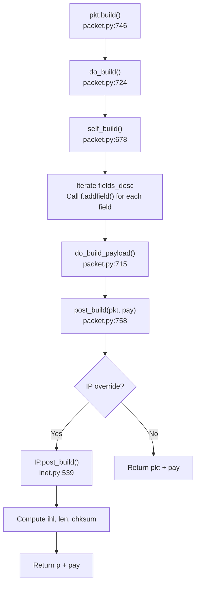
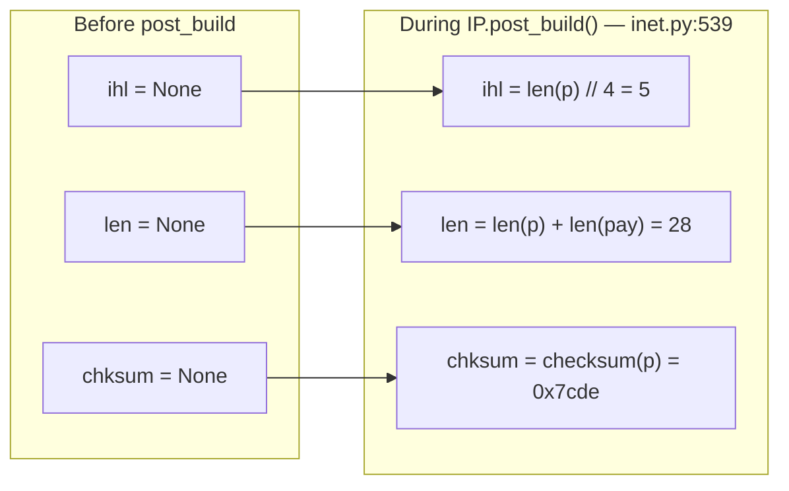
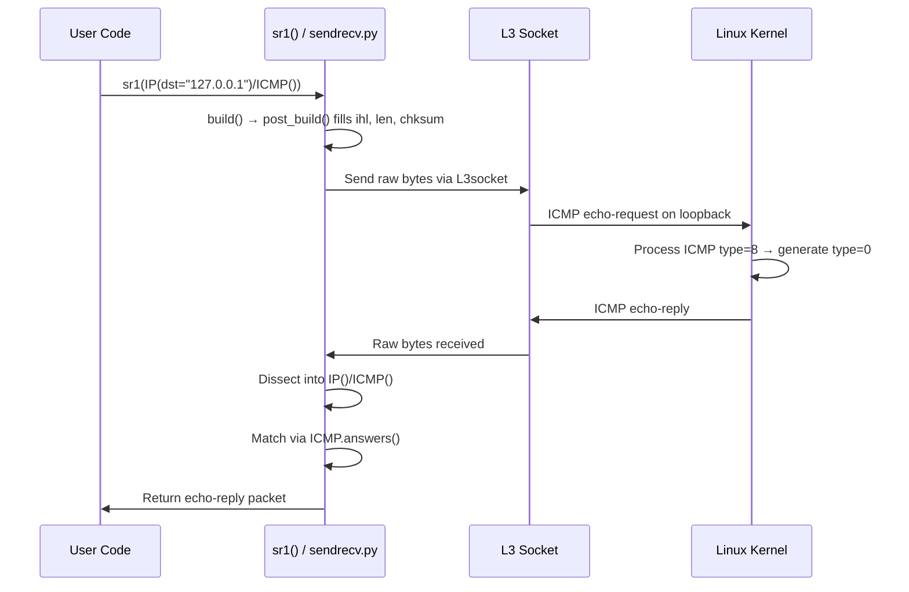

# Scapy Technical Reference — Commit 0925ada48540

## Introduction

This document is a comprehensive Q&A exploration of the **Scapy** packet manipulation library, analyzed at a specific point in its development history. Every answer herein is evidence-based, grounded in direct source code analysis and live execution output — no assumptions are made.

**Environment Details:**

| Parameter | Value |
|-----------|-------|
| Python version | 3.12.3 |
| Scapy version reported | `2026.04.09` |
| Commit hash | `0925ada485406684174d6f068dbd85c4154657b3` |
| Branch name | `scapy_0925ada48540` |
| Installation method | Editable install from source (`pip install -e .`) |
| Operating system | Linux (container environment) |

All code examples were executed in this environment and outputs captured verbatim. All source citations reference exact file paths and line numbers from the codebase at this commit.

---

## Section 1: Scapy Shell Startup

> **Question:** What happens when you launch the Scapy interactive console? What does the startup banner look like? What version is displayed?

### Direct Answer

Launching Scapy's interactive console is done via `python -m scapy` (which triggers `interact()` in `scapy/main.py` via the `__main__` block in `scapy/__init__.py:174-176`) or by calling `scapy.main.interact()` directly. The console displays a large ASCII art logo, a welcome message with the version number, and a randomly selected humorous quote.

*Source: `scapy/__init__.py:174-176`, `scapy/main.py:503`*

### Banner Composition

The banner is composed inside the `interact()` function at `scapy/main.py:589-655`. When `conf.fancy_prompt` is `True` (the default), Scapy determines the terminal width and selects either the full logo or a mini logo.

*Source: `scapy/main.py:589-591`*

**Full ASCII Art Logo** (for terminals wider than 75 characters):

The logo is stored as a list of 19 strings called `the_logo` at `scapy/main.py:593-613`:

```
                                      
                     aSPY//YASa       
             apyyyyCY//////////YCa    
            sY//////YSpcs  scpCY//Pp  
 ayp ayyyyyyySCP//Pp           syY//C 
 AYAsAYYYYYYYY///Ps              cY//S
         pCCCCY//p          cSSps y//Y
         SPPPP///a          pP///AC//Y
              A//A            cyP////C
              p///Ac            sC///a
              P////YCpc           A//A
       scccccp///pSP///p          p//Y
      sY/////////y  caa           S//P
       cayCyayP//Ya              pY/Ya
        sY/PsY////YCc          aC//Yp 
         sc  sccaCY//PCypaapyCP//YSs  
                  spCPY//////YPSps    
                       ccaacs         
                                      
```

*Source: `scapy/main.py:593-613`*

**Mini Logo** (for terminals ≤ 75 characters wide):

An alternative compact logo `the_logo_mini` is used when `get_terminal_width()` returns 75 or less, as determined at line 591:

```
      .SYPACCCSASYY  
P /SCS/CCS        ACS
       /A          AC
     A/PS       /SPPS
        YP        (SC
       SPS/A.      SC
   Y/PACC          PP
    PY*AYC        CAA
         YYCY//SCYP  
```

*Source: `scapy/main.py:616-626`*

### Welcome Text

The welcome banner text is defined at `scapy/main.py:628-639`:

```
   |
   | Welcome to Scapy
   | Version <version>
   |
   | https://github.com/secdev/scapy
   |
   | Have fun!
   |
```

The version is interpolated via `conf.version` at line 633. For mini banners, the text is trimmed (leading `"   "` stripped and wrapped differently) at lines 641-644.

*Source: `scapy/main.py:628-639`, `scapy/main.py:641-644`*

### Random Quote

A random quote is appended to the full-size banner (not the mini banner) via `_prepare_quote()` at `scapy/main.py:476`. The quote is selected randomly from the `QUOTES` list using `choice(QUOTES)` at line 646.

*Source: `scapy/main.py:646-648`, `scapy/main.py:476-500`*

The `QUOTES` list is defined at `scapy/main.py:49-58` and contains 8 entries (each a tuple of quote text and attributed author):

| # | Quote | Author |
|---|-------|--------|
| 1 | "Craft packets like it is your last day on earth." | Lao-Tze |
| 2 | "Craft packets like I craft my beer." | Jean De Clerck |
| 3 | "Craft packets before they craft you." | Socrate |
| 4 | "Craft me if you can." | IPv6 layer |
| 5 | "To craft a packet, you have to be a packet, and learn how to swim in the wires and in the waves." | Jean-Claude Van Damme |
| 6 | "We are in France, we say Skappee. OK? Merci." | Sebastien Chabal |
| 7 | "Wanna support scapy? Star us on GitHub!" | Satoshi Nakamoto |
| 8 | "What is dead may never die!" | Python 2 |

*Source: `scapy/main.py:49-58`*

The `_prepare_quote()` function (line 476) word-wraps the quote text to fit within the banner width (default `max_len=78`) and formats it with the `"   | "` prefix and a right-aligned `"-- Author"` attribution line.

*Source: `scapy/main.py:476-500`*

### Version Display

The version shown in the banner is `conf.version`, which is set from `scapy.VERSION`. This value is assigned at `scapy/__init__.py:169`:

```python
VERSION = __version__ = _version()
```

*Source: `scapy/__init__.py:169`*

### Version Resolution Walkthrough

The `_version()` function at `scapy/__init__.py:122-166` implements a multi-step fallback chain to determine the version string. This ensures Scapy always has a valid version regardless of how it was installed (pip, git clone, git archive, CI, etc.).

**Method 0 — Environment Variable** (line 129-133):
Check for the `SCAPY_VERSION` environment variable. If set (e.g., by external packaging systems), return its value immediately.

```python
try:
    return os.environ['SCAPY_VERSION']
except KeyError:
    pass
```

*Source: `scapy/__init__.py:129-133`*

**Method 1 — VERSION File** (line 136-143):
Look for a `scapy/VERSION` file in the package directory. This file is generated during `sdist` and is present in wheels and source distributions. Read and return its contents.

```python
version_file = os.path.join(_SCAPY_PKG_DIR, 'VERSION')
try:
    with open(version_file, 'r') as fdsec:
        tag = fdsec.read()
    return tag
except FileNotFoundError:
    pass
```

*Source: `scapy/__init__.py:136-143`*

**Method 2 — Git Archive Export-Subst** (line 146-149):
Call `_version_from_git_archive()` (defined at line 38). This method relies on git's `export-subst` attribute which expands `$Format:...$` placeholders in `.gitattributes` during `git archive`. The format string is `$Format:%ct %(describe:tags=true)$` — `%ct` is the committer timestamp and `%(describe:tags=true)` is the git-describe output.

- If the revision is tagged, `_parse_tag()` (line 21) converts the tag to a PEP-compatible version: e.g., `v2.3.2-346-g164a52c075c8` → `2.3.2.dev346`.
- If the revision is not tagged but has a timestamp, the timestamp is formatted as `%Y.%m.%d`.
- If `$Format:...$` was not expanded (not a git archive), a `ValueError` is raised.

*Source: `scapy/__init__.py:38-69`, `scapy/__init__.py:146-149`*

**Method 3 — Git Describe** (line 152-155):
Call `_version_from_git_describe()` (defined at line 72). This method:
1. Verifies a `.git` directory exists (line 97)
2. Runs `git describe --tags --always --long` (line 114)
3. If the output doesn't start with `v` (no upstream tags), tries `git rev-list --tags --max-count=1` to find the latest tagged commit, then re-runs `git describe` on that commit (lines 115-118)
4. Passes the result to `_parse_tag()` (line 119) to normalize the version

The `_parse_tag()` function (line 21) matches the pattern `^v?(.+?)-(\d+)-g[a-f0-9]+$` and converts it to `major.minor.patch.devN` format.

*Source: `scapy/__init__.py:72-119`, `scapy/__init__.py:21-35`*

**Fallback — File Modification Timestamp** (line 158-163):
If all previous methods fail, use the modification timestamp of `__init__.py` itself, formatted as `%Y.%m.%d`:

```python
d = datetime.datetime.utcfromtimestamp(os.path.getmtime(__file__))
return d.strftime('%Y.%m.%d')
```

*Source: `scapy/__init__.py:158-163`*

**Last Resort** (line 166):
If even the file timestamp fails, return the hardcoded string `'0.0.0'`.

*Source: `scapy/__init__.py:166`*

### This Commit's Version

For commit `0925ada48540`, the version resolves to **`2026.04.09`**. Here's why each method fails or succeeds:

- **Method 0**: No `SCAPY_VERSION` environment variable is set → skip.
- **Method 1**: No `scapy/VERSION` file exists (this is a git checkout, not an sdist) → skip.
- **Method 2**: The `$Format:...$` string in `.gitattributes` was not expanded (not a git archive) — the literal `$Format:` text is still present, triggering the `"Format" in tstamp` check at line 55 → `ValueError` → skip.
- **Method 3**: `git describe --tags --always --long` returns `0925ada4` (just a short hash, no tag info). This doesn't start with `v`, so `git rev-list --tags --max-count=1` is tried, which returns empty (no tags exist in this repository). The subsequent `git describe` call on an empty commit fails, raising a `CalledProcessError` → skip.
- **Fallback**: The modification timestamp of `scapy/__init__.py` is read. The file was last modified on `2026-04-09`, yielding `2026.04.09`.

**Rationale:** This elaborate fallback chain exists because Scapy must report a meaningful version in every conceivable installation scenario — from pip-installed wheels (Method 1) to CI environments with custom versioning (Method 0), to git archives on GitHub (Method 2), to developer git clones (Method 3), to edge cases with missing git metadata (Fallback). The chain ensures graceful degradation rather than crashing on missing version info.

---

## Section 2: ICMP Echo Request Construction

> **Question:** How do you create a basic ICMP echo request packet? What does `show()` display?

### Direct Answer

An ICMP echo request is created by stacking an `IP` layer with an `ICMP` layer using the `/` operator:

```python
pkt = IP() / ICMP()
```

The `/` operator is implemented as `Packet.__truediv__()` (which is aliased to `__div__` at `scapy/packet.py:607`). At line 596-602, this method clones both the left and right packets and calls `add_payload()` to stack them:

```python
def __div__(self, other):
    if isinstance(other, Packet):
        cloneA = self.copy()
        cloneB = other.copy()
        cloneA.add_payload(cloneB)
        return cloneA
```

*Source: `scapy/packet.py:596-607`*

### IP `fields_desc`

The `IP` class is defined at `scapy/layers/inet.py:521` with 13 fields in `fields_desc` (lines 524-537). Fields are either explicitly defaulted or set to `None` (meaning they will be auto-computed during `post_build()`):

| # | Field | Type | Default | Auto-computed? | Notes | Source |
|---|-------|------|---------|----------------|-------|--------|
| 1 | `version` | `BitField` (4 bits) | `4` | No | IPv4 version nibble | `inet.py:524` |
| 2 | `ihl` | `BitField` (4 bits) | `None` | **Yes** — computed in `post_build()` | Internet Header Length in 32-bit words | `inet.py:525` |
| 3 | `tos` | `XByteField` | `0` | No | Type of Service | `inet.py:526` |
| 4 | `len` | `ShortField` | `None` | **Yes** — computed in `post_build()` | Total packet length | `inet.py:527` |
| 5 | `id` | `ShortField` | `1` | No | Identification | `inet.py:528` |
| 6 | `flags` | `FlagsField` (3 bits) | `0` | No | MF, DF, evil flags | `inet.py:529` |
| 7 | `frag` | `BitField` (13 bits) | `0` | No | Fragment offset | `inet.py:530` |
| 8 | `ttl` | `ByteField` | `64` | No | Time to Live | `inet.py:531` |
| 9 | `proto` | `ByteEnumField` | `0` | **Semi** — auto-set to `1` (ICMP) via `bind_layers` | Protocol number | `inet.py:532` |
| 10 | `chksum` | `XShortField` | `None` | **Yes** — computed in `post_build()` | Header checksum | `inet.py:533` |
| 11 | `src` | `SourceIPField` | `None` | **Yes** — resolved via routing table | Source IP address | `inet.py:535` |
| 12 | `dst` | `DestIPField` | `"127.0.0.1"` | **Semi** — defaults to `127.0.0.1` | Destination IP address | `inet.py:536` |
| 13 | `options` | `PacketListField` | `[]` | No | IP options list | `inet.py:537` |

*Source: `scapy/layers/inet.py:524-537`*

### ICMP `fields_desc`

The `ICMP` class is defined at `scapy/layers/inet.py:952` with conditional fields that vary based on the ICMP type. For the default `type=8` (echo-request), the active fields are:

| # | Field | Type | Default | Auto-computed? | Condition | Source |
|---|-------|------|---------|----------------|-----------|--------|
| 1 | `type` | `ByteEnumField` | `8` (echo-request) | No | Always present | `inet.py:954` |
| 2 | `code` | `MultiEnumField` | `0` | No | Always present | `inet.py:955` |
| 3 | `chksum` | `XShortField` | `None` | **Yes** — computed in `post_build()` | Always present | `inet.py:956` |
| 4 | `id` | `XShortField` | `0` | No | `type in icmp_id_seq_types` ([0,8,13,14,15,16,17,18,37,38]) | `inet.py:957` |
| 5 | `seq` | `XShortField` | `0` | No | `type in icmp_id_seq_types` | `inet.py:958` |
| 6 | `unused` | `StrFixedLenField` | `""` (length=0) | No | Default for echo types (via `MultipleTypeField`) | `inet.py:968-976` |

*Source: `scapy/layers/inet.py:952-977`, `scapy/layers/inet.py:949`*

The ICMP checksum is computed in `ICMP.post_build()` at line 979-984.

### `pkt.show()` Pre-Build Output

The `show()` method is defined at `scapy/packet.py:1459` and delegates to `_show_or_dump()`. Calling `show()` on a freshly created `IP()/ICMP()` packet (before `build()`) displays all fields with their current in-memory values. Fields set to `None` display as `None`, while `SourceIPField` resolves dynamically via the routing table for display (its `i2h()` method calls `__findaddr()` at `scapy/fields.py:885-889`):

```
>>> pkt = IP()/ICMP()
>>> pkt.show()
###[ IP ]### 
  version   = 4
  ihl       = None
  tos       = 0x0
  len       = None
  id        = 1
  flags     = 
  frag      = 0
  ttl       = 64
  proto     = icmp
  chksum    = None
  src       = 127.0.0.1
  dst       = 127.0.0.1
  \options   \
###[ ICMP ]### 
     type      = echo-request
     code      = 0
     chksum    = None
     id        = 0x0
     seq       = 0x0
     unused    = ''
```

*Source: `scapy/packet.py:1459-1471`*

**Key observations:**
- `ihl`, `len`, and `chksum` for IP are `None` — they will be computed during serialization.
- `chksum` for ICMP is also `None` — computed during `ICMP.post_build()`.
- `proto` shows as `icmp` (value `1`) despite the default being `0` — this is because `bind_layers(IP, ICMP, frag=0, proto=1)` at `inet.py:1112` automatically sets `proto=1` when ICMP is the payload.
- `src` shows as `127.0.0.1` even though its internal value is `None` — `SourceIPField.i2h()` resolves it through the routing table at display time.
- `dst` defaults to `127.0.0.1` as specified by `DestIPField` at `inet.py:536`.

### `repr()` Output

The `repr()` representation shows only fields that differ from their defaults:

```
>>> repr(IP()/ICMP())
'<IP  frag=0 proto=icmp |<ICMP  |>>'
```

Here `frag=0` and `proto=icmp` appear because `bind_layers` changed their effective defaults for this layer combination — `frag` is displayed because it's explicitly set by the binding, and `proto` is set to `1` (ICMP) by the binding, differing from the `fields_desc` default of `0`.

### `show2()` Post-Build Output

The `show2()` method (defined at `scapy/packet.py:1473`) builds the packet first and then dissects the built bytes, showing the final computed values. For `IP(dst="127.0.0.1")/ICMP()`:

```
>>> pkt = IP(dst="127.0.0.1")/ICMP()
>>> pkt.show2()
###[ IP ]### 
  version   = 4
  ihl       = 5
  tos       = 0x0
  len       = 28
  id        = 1
  flags     = 
  frag      = 0
  ttl       = 64
  proto     = icmp
  chksum    = 0x7cde
  src       = 127.0.0.1
  dst       = 127.0.0.1
  \options   \
###[ ICMP ]### 
     type      = echo-request
     code      = 0
     chksum    = 0xf7ff
     id        = 0x0
     seq       = 0x0
     unused    = ''
```

**Key differences from pre-build:**
- `ihl = 5` → 20 bytes / 4 = 5 (standard IP header with no options)
- `len = 28` → 20 bytes IP header + 8 bytes ICMP = 28 bytes total
- `chksum = 0x7cde` → IP header checksum computed over all header bytes
- ICMP `chksum = 0xf7ff` → ICMP checksum computed over the ICMP header + payload

---

## Section 3: IP Header Auto-Population — Source Code Walkthrough

> **Question:** How does Scapy construct the IP header by default when creating packets programmatically? Walk through the source code.

### Direct Answer

Scapy uses a **lazy-computation model**. When you create a packet like `IP()/ICMP()`, fields such as `ihl`, `len`, and `chksum` are stored as `None` internally. Their actual values are computed only during serialization (the `build()` call), specifically in the `post_build()` method. This design is fundamental because these fields depend on the final serialized form — `len` depends on payload size, `chksum` depends on all header bytes, and `ihl` depends on the total header length including options.

### Build Pipeline Trace

The packet build pipeline follows this exact call chain:

**Step 1: `Packet.build()`** — `scapy/packet.py:746-756`

The entry point for serialization. Calls `do_build()` to create the raw bytes, then `build_padding()` for any padding, and finally `build_done()` for post-processing:

```python
def build(self):
    p = self.do_build()
    p += self.build_padding()
    p = self.build_done(p)
    return p
```

*Source: `scapy/packet.py:746-756`*

**Step 2: `Packet.do_build()`** — `scapy/packet.py:724-740`

Orchestrates the build: calls `self_build()` to serialize this layer's fields into bytes, then `do_build_payload()` for the payload, then `post_build(pkt, pay)` to allow the layer to fixup computed fields:

```python
def do_build(self):
    if not self.explicit:
        self = next(iter(self))
    pkt = self.self_build()
    for t in self.post_transforms:
        pkt = t(pkt)
    pay = self.do_build_payload()
    if self.raw_packet_cache is None:
        return self.post_build(pkt, pay)
    else:
        return pkt + pay
```

*Source: `scapy/packet.py:724-740`*

**Step 3: `Packet.self_build()`** — `scapy/packet.py:678-713`

Iterates over `fields_desc` and calls `f.addfield(self, p, val)` for each field. For fields with `None` values, the field's `i2m()` method writes a zero or placeholder value (e.g., `IPField.i2m()` returns `b'\x00\x00\x00\x00'` for `None`):

```python
def self_build(self):
    # ... cache check omitted ...
    p = b""
    for f in self.fields_desc:
        val = self.getfieldval(f.name)
        if isinstance(val, RawVal):
            p += bytes(val)
        else:
            p = f.addfield(self, p, val)
    return p
```

*Source: `scapy/packet.py:678-713`*

**Step 4: `Packet.post_build()`** (Base) — `scapy/packet.py:758-767`

The base implementation is a no-op — it simply returns `pkt + pay`:

```python
def post_build(self, pkt, pay):
    return pkt + pay
```

*Source: `scapy/packet.py:758-767`*

Both `IP` and `ICMP` override this method to compute their respective checksums and auto-populated fields.

### Build Pipeline Diagram



### IP.post_build() Walkthrough

The `IP.post_build()` method at `scapy/layers/inet.py:539-551` performs three conditional computations on the serialized header bytes:

```python
def post_build(self, p, pay):
    ihl = self.ihl                                          # line 540
    p += b"\0" * ((-len(p)) % 4)  # pad IP options          # line 541
    if ihl is None:                                         # line 542
        ihl = len(p) // 4                                   # line 543
        p = chb(((self.version & 0xf) << 4) | ihl & 0x0f) + p[1:]  # line 544
    if self.len is None:                                    # line 545
        tmp_len = len(p) + len(pay)                         # line 546
        p = p[:2] + struct.pack("!H", tmp_len) + p[4:]     # line 547
    if self.chksum is None:                                 # line 548
        ck = checksum(p)                                    # line 549
        p = p[:10] + chb(ck >> 8) + chb(ck & 0xff) + p[12:]  # line 550
    return p + pay                                          # line 551
```

*Source: `scapy/layers/inet.py:539-551`*

**Line-by-line explanation:**

1. **Line 540**: Read the stored `ihl` value from the packet object (will be `None` if not explicitly set).

2. **Line 541**: Pad IP options to a 4-byte boundary. For a standard header with no options, `len(p)` is already 20, so `(-20) % 4 = 0` and no padding is added.

3. **Lines 542-544 — IHL computation**: If `ihl is None`, compute it as `len(p) // 4`. For a standard 20-byte header: `20 // 4 = 5`. Then rewrite byte 0 of the header to encode both the version (upper nibble) and IHL (lower nibble): `((4 & 0xf) << 4) | 5 & 0x0f` = `0x45`.

4. **Lines 545-547 — Length computation**: If `self.len is None`, compute the total packet length as header bytes + payload bytes. For `IP()/ICMP()`: `20 + 8 = 28`. Write this as a big-endian 16-bit integer at byte offsets 2-3.

5. **Lines 548-550 — Checksum computation**: If `self.chksum is None`, compute the IP header checksum using the `checksum()` utility function over the entire header (with the checksum field itself set to zero). Write the result at byte offsets 10-11.

6. **Line 551**: Return the fixed-up header concatenated with the payload.

### IP Field Auto-Computation Diagram



### SourceIPField Resolution

The `src` field uses the `SourceIPField` class defined at `scapy/fields.py:854-889`. This field automatically resolves the source IP address based on the routing table.

**`__init__()`** (line 857-860): Stores the name of the destination field (`dstname`) — for the IP class, this is `"dst"`.

```python
def __init__(self, name, dstname):
    IPField.__init__(self, name, None)
    self.dstname = dstname
```

*Source: `scapy/fields.py:857-860`*

**`__findaddr()`** (line 862-877): The core resolution method:
1. Reads the destination address from the packet via `getattr(pkt, self.dstname)` (line 867-868)
2. Falls back to `"0.0.0.0"` if no destination is set
3. Calls `conf.route.route(dst)` which returns an `(iface, src_ip, gateway)` tuple
4. Returns `src_ip` (index `[1]`) — the source IP for the route to the destination

```python
def __findaddr(self, pkt):
    if conf.route is None:
        import scapy.route  # noqa: F401
    dst = ("0.0.0.0" if self.dstname is None
           else getattr(pkt, self.dstname) or "0.0.0.0")
    if isinstance(dst, (Gen, list)):
        r = {conf.route.route(str(daddr)) for daddr in dst}
        if len(r) > 1:
            warning("More than one possible route for %r" % (dst,))
        return min(r)[1]
    return conf.route.route(dst)[1]
```

*Source: `scapy/fields.py:862-877`*

**`i2m()`** (line 879-883): Called during `self_build()` to convert the internal value to machine bytes. If the value is `None`, calls `__findaddr()` to resolve it first.

*Source: `scapy/fields.py:879-883`*

**`i2h()`** (line 885-889): Called during `show()` for human-readable display. Same logic — if `None`, resolves via `__findaddr()`. This is why `show()` displays `src = 127.0.0.1` even though the internal value is `None`.

*Source: `scapy/fields.py:885-889`*

### DestIPField Resolution

The `dst` field uses `DestIPField`, defined at `scapy/layers/inet.py:503-518`. It inherits from both `IPField` and `DestField`:

```python
class DestIPField(IPField, DestField):
    bindings = {}
```

*Source: `scapy/layers/inet.py:503-504`*

The `DestField` base class (at `scapy/fields.py:729-755`) provides the `dst_from_pkt()` method (line 738-747):

1. Checks the `bindings` dictionary for payload-class-specific addresses — if the payload class has a registered binding with a specific destination, use it.
2. Falls back to `self.defaultdst`, which is `"127.0.0.1"` as set in the IP `fields_desc` at `inet.py:536`.

```python
def dst_from_pkt(self, pkt):
    for addr, condition in self.bindings.get(pkt.payload.__class__, []):
        try:
            if all(pkt.payload.getfieldval(field) == value
                   for field, value in condition.items()):
                return addr
        except AttributeError:
            pass
    return self.defaultdst
```

*Source: `scapy/fields.py:738-747`*

**`DestIPField.i2m()`** (line 510-513): If the value is `None`, calls `dst_from_pkt()` to resolve:

```python
def i2m(self, pkt, x):
    if x is None:
        x = self.dst_from_pkt(pkt)
    return IPField.i2m(self, pkt, x)
```

*Source: `scapy/layers/inet.py:510-513`*

### `bind_layers` and Proto Auto-Set

The binding `bind_layers(IP, ICMP, frag=0, proto=1)` at `scapy/layers/inet.py:1112` establishes a bidirectional relationship between IP and ICMP:

- **Upward binding (dissection):** When dissecting an IP packet, if `proto=1` and `frag=0`, the payload is interpreted as ICMP.
- **Downward binding (construction):** When ICMP is added as the payload of IP (via `/`), Scapy automatically sets `frag=0` and `proto=1` on the IP layer.

This is why the `show()` output displays `proto = icmp` (value `1`) even though the `fields_desc` default for `proto` is `0`. The binding is applied during the `add_payload()` call triggered by `__truediv__()`.

*Source: `scapy/layers/inet.py:1112`*

### Rationale

Scapy's lazy `post_build()` model is architecturally superior to pre-computing field values at construction time because:

1. **Dependency on serialized form**: `len` depends on the total payload size, which may not be known until all layers are built. `chksum` depends on the final byte values of the entire header, including other computed fields like `ihl` and `len`.

2. **Order independence**: Users can modify fields after construction. If checksums were pre-computed, any change would invalidate them. By deferring computation to `build()` time, the final serialized packet is always consistent.

3. **Composability**: Layers can be stacked in any order, and the `post_build()` chain runs bottom-up, ensuring each layer can account for its payload's final serialized form.

---

## Section 4: Sending ICMP to Localhost

> **Question:** What happens when you send a crafted ICMP echo-request to 127.0.0.1 and capture the reply?

### Direct Answer

Use `sr1()` to send a single packet and receive the first matching reply:

```python
from scapy.all import IP, ICMP, sr1, conf
from scapy.supersocket import L3RawSocket

conf.L3socket = L3RawSocket  # Required for loopback on Linux
reply = sr1(IP(dst="127.0.0.1") / ICMP(), timeout=3)
```

This sends one ICMP echo-request (type 8) to `127.0.0.1` and waits for the kernel's ICMP echo-reply (type 0).

### `sr1()` Source Walkthrough

**`sr1()`** — `scapy/sendrecv.py:655-664`

```python
@conf.commands.register
def sr1(*args, **kargs):
    """Send packets at layer 3 and return only the first answer"""
    ans, _ = sr(*args, **kargs)
    if ans:
        return cast(Packet, ans[0][1])
    return None
```

`sr1()` calls `sr()` with the same arguments, then returns `ans[0][1]` — the response packet from the first answered stimulus-response pair. If no answer is received (timeout), returns `None`.

*Source: `scapy/sendrecv.py:655-664`*

**`sr()`** — `scapy/sendrecv.py:634-652`

```python
@conf.commands.register
def sr(x, promisc=None, filter=None, iface=None, nofilter=0, *args, **kargs):
    """Send and receive packets at layer 3"""
    iface = _interface_selection(iface, x)
    s = conf.L3socket(promisc=promisc, filter=filter,
                      iface=iface, nofilter=nofilter)
    result = sndrcv(s, x, *args, **kargs)
    s.close()
    return result
```

`sr()` performs three operations:
1. Selects the network interface via `_interface_selection()` (line 647)
2. Creates a Layer-3 socket using `conf.L3socket` (line 648-649)
3. Calls `sndrcv()` to handle the send-receive-match cycle (line 650)
4. Closes the socket (line 651) and returns the `(answered, unanswered)` tuple

*Source: `scapy/sendrecv.py:634-652`*

### Network-Layer Behavior



**Step-by-step flow:**

1. **Packet construction**: `IP(dst="127.0.0.1")/ICMP()` creates a two-layer packet with `dst=127.0.0.1`, `src=127.0.0.1` (resolved via routing table), `proto=1` (ICMP, via `bind_layers`), and `type=8` (echo-request, ICMP default).

2. **Socket creation**: `sr1()` → `sr()` creates a `conf.L3socket` instance. The socket type depends on the platform configuration (see Socket Type Considerations below).

3. **Serialization**: Before transmission, `build()` is called, triggering `IP.post_build()` which computes `ihl=5`, `len=28`, and `chksum`, and `ICMP.post_build()` which computes the ICMP checksum.

4. **Transmission**: The 28-byte raw packet is sent through the socket to the kernel's network stack.

5. **Kernel processing**: The Linux kernel receives the ICMP echo-request on the loopback interface (`lo`). Its ICMP handler generates an ICMP echo-reply (type=0, code=0) with the same `id` and `seq` values, and sends it back through loopback.

6. **Reception and dissection**: Scapy's socket receives the raw reply bytes and dissects them back into an `IP()/ICMP()` layer stack.

7. **Stimulus-response matching**: `sndrcv()` uses `ICMP.answers()` (see below) to verify the reply matches the original request.

8. **Return**: `sr1()` extracts the reply packet (`ans[0][1]`) and returns it.

### Echo-Reply Output

The following is the actual dissected reply from live execution:

```
>>> from scapy.all import IP, ICMP, sr1, conf
>>> from scapy.supersocket import L3RawSocket
>>> conf.L3socket = L3RawSocket
>>> conf.verb = 0
>>> reply = sr1(IP(dst="127.0.0.1")/ICMP(), timeout=5)
>>> reply.show()
###[ IP ]### 
  version   = 4
  ihl       = 5
  tos       = 0x0
  len       = 28
  id        = 54316
  flags     = 
  frag      = 0
  ttl       = 64
  proto     = icmp
  chksum    = 0xa8b2
  src       = 127.0.0.1
  dst       = 127.0.0.1
  \options   \
###[ ICMP ]### 
     type      = echo-reply
     code      = 0
     chksum    = 0x0
     id        = 0x0
     seq       = 0x0
     unused    = ''
```

And the `repr()` form:

```
<IP  version=4 ihl=5 tos=0x0 len=28 id=54316 flags= frag=0 ttl=64 proto=icmp chksum=0xa8b2 src=127.0.0.1 dst=127.0.0.1 |<ICMP  type=echo-reply code=0 chksum=0x0 id=0x0 seq=0x0 |>>
```

**Key observations:**
- `type = echo-reply` (type 0) — the kernel responded to our echo-request (type 8).
- `id = 54316` — a new identification value assigned by the kernel for the reply IP header (different from our request's `id=1`).
- `chksum = 0xa8b2` — the kernel's computed IP checksum for the reply.
- ICMP `chksum = 0x0` — the ICMP echo-reply with `type=0, code=0, id=0, seq=0` produces a checksum of `0x0` (since the complement of `0xffff` wraps to `0x0` in ones' complement, which Scapy reports as `0x0` after checksum correction from `0xf7ff` in the request to `0x0` in the reply because the type changed from `8` to `0`).
- `src = 127.0.0.1`, `dst = 127.0.0.1` — loopback addresses in both directions.

### Socket Type Considerations

The socket used for Layer-3 send/receive is controlled by `conf.L3socket`:

- **`L3PacketSocket`** — The default on Linux (when fully initialized via `import scapy.all`). Uses `PF_PACKET` sockets (`socket.AF_PACKET`) which operate at the data link layer. This requires root privileges and works with all interface types. However, on the loopback interface, `PF_PACKET` sockets may not correctly receive ICMP replies because the loopback interface has unique kernel handling of outgoing packets.

- **`L3RawSocket`** — An alternative that uses raw `AF_INET` sockets (`socket.SOCK_RAW`). This operates at the network layer (IP) and is more reliable for loopback communication. For localhost ICMP testing, `L3RawSocket` is often the better choice because it bypasses the data-link layer entirely.

- **Configuration**: `conf.L3socket` is set during Scapy's platform detection. On Linux, when the full `scapy.all` module is imported, the socket classes from `scapy.arch.linux` are loaded and `conf.L3socket` is set to `L3PacketSocket`. Users can override this:

```python
from scapy.supersocket import L3RawSocket
conf.L3socket = L3RawSocket
```

*Source: `scapy/sendrecv.py:648-649`, `scapy/config.py`*

### Stimulus-Response Matching

When `sndrcv()` receives a packet, it calls the `answers()` method on the received packet to check if it matches the sent stimulus. For ICMP, this is `ICMP.answers()` at `scapy/layers/inet.py:991-998`:

```python
def answers(self, other):
    if not isinstance(other, ICMP):
        return 0
    if ((other.type, self.type) in [(8, 0), (13, 14), (15, 16), (17, 18),
                                     (33, 34), (35, 36), (37, 38)] and
        self.id == other.id and
            self.seq == other.seq):
        return 1
    return 0
```

*Source: `scapy/layers/inet.py:991-998`*

The matching logic:
1. Verify the received packet (`self`) is an ICMP packet responding to an ICMP stimulus (`other`).
2. Check if the `(stimulus_type, response_type)` pair is in the known request-reply table:
   - `(8, 0)` — Echo Request → Echo Reply
   - `(13, 14)` — Timestamp Request → Timestamp Reply
   - `(15, 16)` — Information Request → Information Reply
   - `(17, 18)` — Address Mask Request → Address Mask Reply
   - `(33, 34)` — IPv6 Where-Are-You → IPv6 I-Am-Here
   - `(35, 36)` — Mobile Registration Request → Mobile Registration Reply
   - `(37, 38)` — Domain Name Request → Domain Name Reply
3. Verify `self.id == other.id` and `self.seq == other.seq` — the reply must echo back the same ID and sequence number.

For our echo-request (`type=8, id=0, seq=0`) matching the reply (`type=0, id=0, seq=0`): the tuple `(8, 0)` is in the list, and `id` and `seq` match, so the answer is confirmed.

---

## Section 5: Test Suite Execution and Summary

> **Question:** What happens when you run the Scapy test suite?

### Direct Answer

Scapy uses **UTscapy** (`scapy/tools/UTscapy.py`), a custom test framework that processes `.uts` (Unit Test Scapy) files organized into "campaigns." Each `.uts` file is a campaign containing multiple test cases written as interactive Python snippets with expected outputs.

### UTscapy Framework Overview

The test runner is at `scapy/tools/UTscapy.py`. Its usage (documented at line 851) is:

```
UTscapy [-m module] [-f {text|ansi|HTML|LaTeX|xUnit|live}] [-o output_file]
        [-t testfile] [-T testfile] [-k keywords [-k ...]] [-K keywords [-K ...]]
        [-l] [-b] [-d|-D] [-F] [-q[q]] [-i] [-P preexecute_python_code]
        [-c configfile]
```

*Source: `scapy/tools/UTscapy.py:851-875`*

Key flags used in this execution:
- `-N` — Non-root mode (line 871): Forces non-root execution, skipping tests that require raw socket privileges.
- `-b` — Don't break on failure (line 860): Continue executing all campaigns even if one fails.
- `-c` — Config file (line 865): Load a `.utsc` configuration file specifying which test files to run.

### Test Configuration: `test/configs/linux.utsc`

The Linux non-root test configuration is a JSON file with the following structure:

```json
{
  "testfiles": [
    "test/*.uts",
    "test/scapy/layers/*.uts",
    "test/contrib/*.uts",
    "test/tools/*.uts",
    "test/contrib/automotive/*.uts",
    "test/contrib/automotive/obd/*.uts",
    "test/contrib/automotive/scanner/*.uts",
    "test/contrib/automotive/gm/*.uts",
    "test/contrib/automotive/bmw/*.uts",
    "test/contrib/automotive/xcp/*.uts",
    "test/contrib/automotive/autosar/*.uts",
    "test/tls/tests_tls_netaccess.uts"
  ],
  "remove_testfiles": ["test/windows.uts", "test/bpf.uts"],
  "breakfailed": true,
  "onlyfailed": true,
  "preexec": {
    "test/contrib/*.uts": "load_contrib(\"%name%\")",
    "test/cert.uts": "load_layer(\"tls\")",
    "test/sslv2.uts": "load_layer(\"tls\")",
    "test/tls*.uts": "load_layer(\"tls\")"
  },
  "kw_ko": ["osx", "windows", "ipv6"]
}
```

*Source: `test/configs/linux.utsc:1-33`*

**Configuration breakdown:**
- **`testfiles`**: 12 glob patterns covering core tests (`test/*.uts`), layer-specific tests (`test/scapy/layers/*.uts`), contrib protocol tests (`test/contrib/*.uts`), tool tests (`test/tools/*.uts`), automotive sub-module tests, and TLS net-access tests.
- **`remove_testfiles`**: Excludes `test/windows.uts` (Windows-specific) and `test/bpf.uts` (BPF-specific).
- **`preexec`**: Pre-execution code run before specific test files — `load_contrib("%name%")` for contrib modules, `load_layer("tls")` for TLS-related tests.
- **`kw_ko`**: Keywords to exclude — tests marked with `osx`, `windows`, or `ipv6` are skipped.

Total `.uts` files in the repository: **193**.

### Execution Command

```bash
python -m scapy.tools.UTscapy -c test/configs/linux.utsc -N -b
```

- `-c test/configs/linux.utsc`: Use the Linux non-root configuration.
- `-N`: Force non-root mode (skip tests requiring raw sockets/root privileges).
- `-b`: Don't break on first failed campaign — run all campaigns.

### Test Results Summary

From live execution at this commit:

| Metric | Count |
|--------|-------|
| **Test campaigns loaded** | 190 |
| **Total test cases executed** | 5,017 |
| **Tests passed** | 4,758 |
| **Tests failed** | 259 |
| **Pass rate** | 94.84% |

**Campaigns with failures:**

| Campaign File | Passed | Failed | Category |
|---------------|--------|--------|----------|
| `test/cert.uts` | 1 | 62 | TLS/cryptography API incompatibility |
| `test/tls.uts` | 21 | 60 | TLS/cryptography API incompatibility |
| `test/tls13.uts` | 1 | 45 | TLS/cryptography API incompatibility |
| `test/sslv2.uts` | 1 | 26 | TLS/cryptography API incompatibility |
| `test/contrib/isotp_native_socket.uts` | 2 | 28 | ISO-TP native socket — requires CAN interface |
| `test/contrib/isotpscan.uts` | 6 | 15 | ISO-TP scanning — requires CAN interface |
| `test/regression.uts` | 265 | 14 | Missing external tools (tcpdump/tshark) and environment configuration |
| `test/scapy/layers/http.uts` | 7 | 2 | Missing optional library (brotli) |
| `test/contrib/gxrp.uts` | 7 | 2 | Missing external tool (tshark) |
| `test/imports.uts` | 3 | 1 | Import of TLS layer fails due to cryptography incompatibility |
| `test/scapy/layers/dhcp.uts` | 6 | 1 | DHCP alias definition check |
| `test/scapy/layers/l2.uts` | 10 | 1 | ARPing output formatting |
| `test/contrib/isotp_soft_socket.uts` | 51 | 1 | ISO-TP soft socket edge case |
| `test/contrib/automotive/scanner/uds_scanner.uts` | 28 | 1 | UDS scanner — dissection edge case |

**Failure context:** The 259 failures fall into four categories:

1. **TLS/cryptography API incompatibility** — 193 failures across `cert.uts` (62), `tls.uts` (60), `tls13.uts` (45), `sslv2.uts` (26). These tests require Scapy's TLS layer (`scapy/layers/tls/`), which fails to load because `scapy/layers/tls/cert.py:51` imports `InvalidSignature` from `cryptography.hazmat.backends.openssl.ec` — a module path that was removed in `cryptography>=46.0`. The installed `cryptography==46.0.7` provides `InvalidSignature` at `cryptography.exceptions` instead, causing a `ModuleNotFoundError` when `load_layer("tls")` is invoked by the `preexec` configuration. This is a known compatibility gap between this Scapy commit and newer `cryptography` releases, not a core Scapy logic error.

2. **Tests requiring hardware interfaces** — 44 failures across `isotp_native_socket.uts` (28), `isotpscan.uts` (15), and `isotp_soft_socket.uts` (1). These tests require a CAN bus interface (`vcan0`) which is not available in this containerized environment.

3. **Missing external tool dependencies** — 16 failures across `regression.uts` (14) and `gxrp.uts` (2). These tests invoke `tcpdump` or `tshark` binaries which are not installed in this environment. The `regression.uts` failures also include `conf.use_pcap` configuration issues and `manuf DB methods` tests.

4. **Other environment-specific failures** — 6 failures: `http.uts` (2 — missing `brotli` library for HTTP decompression), `imports.uts` (1 — TLS import failure cascading from category 1), `dhcp.uts` (1 — DHCP alias definition check), `l2.uts` (1 — ARPing output formatting), and `uds_scanner.uts` (1 — UDS scanner dissection edge case).

These are **not core Scapy logic failures** — they are environmental constraints of running the test suite in a containerized non-root environment without compatible `cryptography` library versions, optional external tools (`tcpdump`, `tshark`), hardware interfaces (CAN bus), and optional Python packages (`brotli`).

### Pass/Fail Reporting

The `run_campaign()` function at `scapy/tools/UTscapy.py:575-623` tracks test results:

```python
def run_campaign(test_campaign, get_interactive_session, theme,
                 drop_to_interpreter=False, verb=3, scapy_ses=None):
    passed = failed = 0
    # ... execute tests ...
    for i, testset in enumerate(test_campaign):
        for j, t in enumerate(testset):
            if run_test(t, get_interactive_session, theme,
                        verb=verb, my_globals=scapy_ses):
                passed += 1
            else:
                failed += 1
    # ... reporting ...
    test_campaign.passed = passed
    test_campaign.failed = failed
    print(style("PASSED=%i FAILED=%i" % (passed, failed)))
    return failed
```

Each campaign prints its `PASSED=N FAILED=M` summary at lines 619/622. The function returns the failure count, and UTscapy exits with error code 1 if any campaign has failures.

*Source: `scapy/tools/UTscapy.py:575-623`*

---

## Section 6: References

All source files cited in this document, with their relevant line ranges:

### Core Package

| File | Lines | Content |
|------|-------|---------|
| `scapy/__init__.py` | 21-35 | `_parse_tag()` — git tag to version conversion |
| `scapy/__init__.py` | 38-69 | `_version_from_git_archive()` — git archive export-subst version |
| `scapy/__init__.py` | 72-119 | `_version_from_git_describe()` — git describe version |
| `scapy/__init__.py` | 122-166 | `_version()` — multi-method version resolution |
| `scapy/__init__.py` | 169 | `VERSION = __version__ = _version()` assignment |
| `scapy/__init__.py` | 174-176 | `__main__` block invoking `interact()` |

### Interactive Console

| File | Lines | Content |
|------|-------|---------|
| `scapy/main.py` | 49-58 | `QUOTES` list (8 entries) |
| `scapy/main.py` | 476-500 | `_prepare_quote()` — quote word-wrapping |
| `scapy/main.py` | 503-507 | `interact()` — console entry point |
| `scapy/main.py` | 589-591 | Terminal width check and mini banner logic |
| `scapy/main.py` | 593-613 | `the_logo` — full ASCII art logo (19 lines) |
| `scapy/main.py` | 616-626 | `the_logo_mini` — compact logo (9 lines) |
| `scapy/main.py` | 628-639 | `the_banner` — welcome text |
| `scapy/main.py` | 641-655 | Banner composition (mini vs full, quote addition) |

### Packet Build Pipeline

| File | Lines | Content |
|------|-------|---------|
| `scapy/packet.py` | 596-607 | `__truediv__()` / `__div__()` — layer stacking (`/`) operator |
| `scapy/packet.py` | 678-713 | `self_build()` — field serialization |
| `scapy/packet.py` | 715-722 | `do_build_payload()` — payload build |
| `scapy/packet.py` | 724-740 | `do_build()` — orchestrates build pipeline |
| `scapy/packet.py` | 746-756 | `build()` — entry point for serialization |
| `scapy/packet.py` | 758-767 | `post_build()` — base implementation (no-op) |
| `scapy/packet.py` | 1459-1471 | `show()` — hierarchical packet display |
| `scapy/packet.py` | 1473+ | `show2()` — build-then-dissect display |

### IP and ICMP Layers

| File | Lines | Content |
|------|-------|---------|
| `scapy/layers/inet.py` | 503-518 | `DestIPField` class |
| `scapy/layers/inet.py` | 521-537 | `IP` class definition and `fields_desc` |
| `scapy/layers/inet.py` | 539-551 | `IP.post_build()` — ihl, len, chksum computation |
| `scapy/layers/inet.py` | 949 | `icmp_id_seq_types` list |
| `scapy/layers/inet.py` | 952-977 | `ICMP` class definition and `fields_desc` |
| `scapy/layers/inet.py` | 979-984 | `ICMP.post_build()` — checksum computation |
| `scapy/layers/inet.py` | 991-998 | `ICMP.answers()` — stimulus-response matching |
| `scapy/layers/inet.py` | 1112 | `bind_layers(IP, ICMP, frag=0, proto=1)` |

### Field Types

| File | Lines | Content |
|------|-------|---------|
| `scapy/fields.py` | 729-755 | `DestField` — destination field with bindings |
| `scapy/fields.py` | 738-747 | `DestField.dst_from_pkt()` — default destination resolution |
| `scapy/fields.py` | 796-851 | `IPField` — base IP address field |
| `scapy/fields.py` | 854-889 | `SourceIPField` — route-based source IP resolution |
| `scapy/fields.py` | 862-877 | `SourceIPField.__findaddr()` — routing table lookup |
| `scapy/fields.py` | 879-883 | `SourceIPField.i2m()` — machine representation with auto-resolve |
| `scapy/fields.py` | 885-889 | `SourceIPField.i2h()` — human representation with auto-resolve |

### Send/Receive

| File | Lines | Content |
|------|-------|---------|
| `scapy/sendrecv.py` | 634-652 | `sr()` — send and receive at layer 3 |
| `scapy/sendrecv.py` | 655-664 | `sr1()` — send and return first answer |

### Test Infrastructure

| File | Lines | Content |
|------|-------|---------|
| `scapy/tools/UTscapy.py` | 575-623 | `run_campaign()` — test campaign execution and reporting |
| `scapy/tools/UTscapy.py` | 851-875 | `usage()` — command-line usage documentation |
| `test/configs/linux.utsc` | 1-33 | Linux non-root test configuration |
