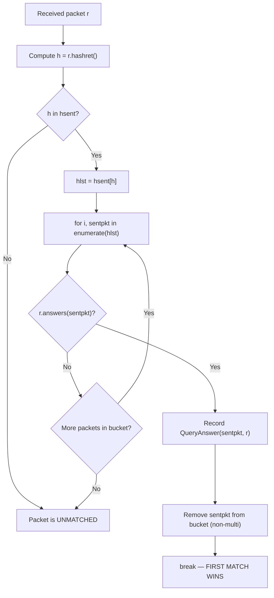
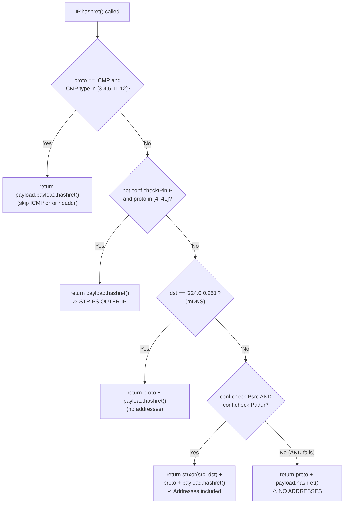
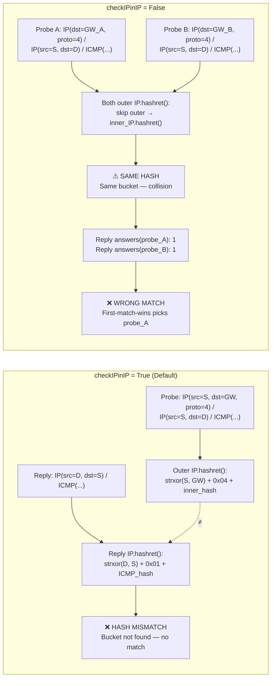

# Scapy Packet Matching Failures with Tunneled Probes

## 1. Question Summary

**Primary question:** What specific code paths within Scapy's `hashret()` / `answers()` two-phase matching pipeline cause a received response packet to be associated with an incorrect sent probe packet when probes traverse IP-in-IP or GRE tunnel endpoints?

**Secondary requirement:** Provide concrete, reproducible Python code examples demonstrating each failure scenario — executable in a Python REPL with Scapy imported, constructing packets manually without network access.

**Tertiary requirement:** Explain the root cause at the algorithm level — not workarounds, configuration tweaks, or behavioral patches.

---

## 2. Answer Summary

Scapy's send-receive functions (`sr()`, `sr1()`, `srp()`) rely on a **two-phase matching pipeline** implemented in the `SndRcvHandler` class (`Source: scapy/sendrecv.py:100-320`):

1. **Phase 1 — `hashret()` bucketing:** Each sent packet is stored in a dictionary (`hsent`) keyed by the output of its `hashret()` method. When a response arrives, Scapy computes the response's `hashret()` and looks up the corresponding bucket. If no bucket is found, the response is discarded as unmatched.

2. **Phase 2 — `answers()` validation:** Within the matching bucket, Scapy iterates over candidate sent packets and calls `response.answers(sent_packet)` for each. The **first** sent packet for which `answers()` returns truthy is declared the match — no further candidates are checked.

This pipeline produces **three distinct failure modes** when probes traverse IP-in-IP or GRE tunnel endpoints:

| # | Failure Mode | Configuration | Root Cause |
|---|-------------|---------------|------------|
| 1 | **Cross-gateway hash collision** | `checkIPinIP=False` | Outer IP is stripped from hash computation — probes to different gateways with same inner content produce identical hashes and land in the same bucket. `answers()` cannot distinguish them because the inner content is identical. |
| 2 | **Total address bypass** | `checkIPsrc=False` + `checkIPaddr=False` | The AND-condition in `IP.hashret()` (`conf.checkIPsrc and conf.checkIPaddr`) causes ALL addresses to be excluded from the hash when either flag is False. With `checkIPaddr=False`, `IP.answers()` also skips address validation. Result: any response matches any probe with the same protocol. |
| 3 | **Asymmetric tunnel hash mismatch** | Default settings (all `True`) | Sent probe's `hashret()` includes the outer tunnel IP via `strxor(src, dst)`. Response arrives decapsulated (plain IP, no outer layer) — its `hashret()` produces a completely different value. The response never finds the correct bucket, so `answers()` is never even called. |

The **fundamental design tension** is that `conf.checkIPinIP` creates a lose-lose scenario for multi-gateway tunnel probing: enabling it causes asymmetric response mismatches (Scenario 3), while disabling it causes cross-gateway hash collisions (Scenario 1).

---

## 3. Matching Pipeline Architecture

### 3.1 Two-Phase Matching Overview

The core matching logic lives in the `SndRcvHandler` class. `Source: scapy/sendrecv.py:100-320`

When you call `sr()`, `sr1()`, or `srp()`, execution flows through:

```
sr() / sr1() / srp()
    └─→ sndrcv()                    # Source: scapy/sendrecv.py:322-329
         └─→ SndRcvHandler.__init__()  # Source: scapy/sendrecv.py:114-226
              ├─→ _sndrcv_snd()      # Sends packets, populates hsent
              └─→ _sndrcv_rcv()      # Receives packets, calls _process_packet()
                   └─→ _process_packet()  # The matching callback
```

The critical data structure is `self.hsent`, initialized at line 168:

```python
self.hsent = {}  # type: Dict[bytes, List[Packet]]
```

This dictionary maps `hashret()` output (a `bytes` key) to a list of sent packets that produced that key. Multiple sent packets can share a bucket if they produce the same `hashret()` value — **this is the hash collision vector that enables incorrect matching**.

### 3.2 Phase 1: hashret() Bucketing

The `_sndrcv_snd()` method (`Source: scapy/sendrecv.py:232-268`) populates the `hsent` dictionary **before** sending each packet on the wire:

```python
# Source: scapy/sendrecv.py:244
self.hsent.setdefault(p.hashret(), []).append(p)
```

The execution sequence is:

1. For each packet `p` in the send list, compute `p.hashret()` — a layer-specific method that produces a `bytes` value
2. Use that value as a dictionary key — `setdefault()` creates a new list if the key doesn't exist
3. Append the packet to the list at that key
4. Send the packet on the wire

The `hashret()` method is **not** a single function — it is a **delegation chain**. Each protocol layer implements its own `hashret()`, appending its contribution to the result and delegating to its payload. The chain terminates at `NoPayload.hashret()`, which returns `b""`. `Source: scapy/packet.py:1812-1814`

The design intent is that `hashret()` produces the **same** value for both a request and its expected response. For example, `IP.hashret()` uses `strxor(src, dst)` — because XOR is commutative, swapping source and destination addresses (as happens between request and response) produces the same hash. `Source: scapy/layers/inet.py:577-580`, `Source: scapy/utils.py:603-609`

### 3.3 Phase 2: answers() Validation

When a packet is received, `_sndrcv_rcv()` delivers it to the `_process_packet()` callback. `Source: scapy/sendrecv.py:270-301`

The matching logic:

```python
# Source: scapy/sendrecv.py:270-301 (annotated)
def _process_packet(self, r):
    if r is None:
        return
    ok = False
    h = r.hashret()                    # Line 276: Compute response's hash
    if h in self.hsent:                # Line 277: Look up bucket
        hlst = self.hsent[h]           # Line 278: Get candidate list
        for i, sentpkt in enumerate(hlst):  # Line 279: Iterate bucket
            if r.answers(sentpkt):     # Line 280: Second validation gate
                self.ans.append(QueryAnswer(sentpkt, r))  # Line 281: Record match
                ok = True              # Line 284
                if not self.multi:
                    del hlst[i]        # Line 286: Remove matched packet from bucket
                    self.noans += 1
                else:
                    ...                # Multi mode: mark as answered
                break                  # Line 292: FIRST MATCH WINS — stop iterating
    ...
```

The two-phase nature means both gates must align for a correct match:

1. **Phase 1 gate (`hashret`):** The response's hash must match a sent packet's hash — otherwise the response is immediately discarded as unmatched (it never enters the `for` loop).
2. **Phase 2 gate (`answers`):** Within the bucket, the response must satisfy `r.answers(sentpkt)` for some sent packet — otherwise the response is also discarded.

An incorrect match occurs when **both gates pass for the wrong sent packet**: the response's `hashret()` matches a bucket containing a probe it shouldn't match, and `answers()` also accepts that probe.

### 3.4 First-Match-Wins Behavior

The `break` statement at line 292 is critical: once `r.answers(sentpkt)` returns truthy for **any** sent packet in the bucket, that sent packet is declared the match. No further candidates in the bucket are examined. `Source: scapy/sendrecv.py:292`

In non-multi mode, the matched sent packet is **removed** from the bucket (`del hlst[i]` at line 286), preventing it from matching again. In multi mode, the packet is marked with `_answered = 1` but remains in the bucket. `Source: scapy/sendrecv.py:285-291`

This means that when hash collisions place multiple probes in the same bucket, the **order of insertion** determines which probe gets matched first — and that order is the order in which probes were appended during `_sndrcv_snd()`.



---

## 4. Layer-Specific Matching Implementations

### 4.1 IP.hashret() and IP.answers()

#### IP.hashret()

`Source: scapy/layers/inet.py:568-581`

`IP.hashret()` contains five conditional branches, evaluated in order:

```python
# Source: scapy/layers/inet.py:568-581 (exact code)
def hashret(self):
    if ((self.proto == socket.IPPROTO_ICMP) and
        (isinstance(self.payload, ICMP)) and
            (self.payload.type in [3, 4, 5, 11, 12])):
        return self.payload.payload.hashret()
    if not conf.checkIPinIP and self.proto in [4, 41]:  # IP, IPv6
        return self.payload.hashret()
    if self.dst == "224.0.0.251":  # mDNS
        return struct.pack("B", self.proto) + self.payload.hashret()
    if conf.checkIPsrc and conf.checkIPaddr:
        return (strxor(inet_pton(socket.AF_INET, self.src),
                       inet_pton(socket.AF_INET, self.dst)) +
                struct.pack("B", self.proto) + self.payload.hashret())
    return struct.pack("B", self.proto) + self.payload.hashret()
```

**Branch 1 — ICMP error path** (lines 569-572): If the IP packet carries an ICMP error message (types 3=Destination Unreachable, 4=Source Quench, 5=Redirect, 11=Time Exceeded, 12=Parameter Problem), the hash skips both the IP header and the ICMP error header, delegating directly to the embedded original packet (`self.payload.payload.hashret()`). This ensures the error response hashes to the same bucket as the original probe that triggered the error.

**Branch 2 — IP-in-IP with `checkIPinIP=False`** (lines 573-574): If `conf.checkIPinIP` is `False` and the protocol is 4 (IP-in-IP) or 41 (IPv6-in-IP), the **entire outer IP layer is stripped** from the hash computation. The hash delegates directly to the payload's (inner IP's) `hashret()`. This is the branch that enables **cross-gateway hash collisions** (Scenario 1).

**Branch 3 — mDNS** (lines 575-576): If the destination is the mDNS multicast address `224.0.0.251`, addresses are excluded from the hash (only protocol + payload hash). This allows matching responses from any host on the multicast group.

**Branch 4 — Normal path with addresses** (lines 577-580): The **critical** branch for normal operation. It activates only when **both** `conf.checkIPsrc` **and** `conf.checkIPaddr` are `True`:

```python
if conf.checkIPsrc and conf.checkIPaddr:
    return (strxor(inet_pton(socket.AF_INET, self.src),
                   inet_pton(socket.AF_INET, self.dst)) +
            struct.pack("B", self.proto) + self.payload.hashret())
```

The hash is: `strxor(src_bytes, dst_bytes) + protocol_byte + payload_hash`

**Branch 5 — Fallback without addresses** (line 581): If **either** `conf.checkIPsrc` or `conf.checkIPaddr` is `False`, the AND-condition on line 577 fails and this fallback executes. The hash contains **only** the protocol byte and payload hash — **no addresses at all**. This is the **AND-condition vulnerability**.

#### The strxor() Commutativity Property

`Source: scapy/utils.py:603-609`

```python
def strxor(s1, s2):
    """Returns the binary XOR of the 2 provided strings s1 and s2.
    s1 and s2 must be of same length."""
    return b"".join(map(lambda x, y: chb(orb(x) ^ orb(y)), s1, s2))
```

XOR is commutative: `A ⊕ B == B ⊕ A`. This is the **key design property** that enables request/response hash alignment:

- **Request** with `src=A, dst=B` → `strxor(A, B)` → value `V`
- **Response** with `src=B, dst=A` → `strxor(B, A)` → value `V` (same!)

The addresses naturally swap between request and response, and `strxor()` ensures the hash value remains identical after the swap.

#### IP.answers()

`Source: scapy/layers/inet.py:583-611`

```python
# Source: scapy/layers/inet.py:583-611 (exact code)
def answers(self, other):
    if not conf.checkIPinIP:  # skip IP in IP and IPv6 in IP
        if self.proto in [4, 41]:
            return self.payload.answers(other)
        if isinstance(other, IP) and other.proto in [4, 41]:
            return self.answers(other.payload)
        if conf.ipv6_enabled \
           and isinstance(other, scapy.layers.inet6.IPv6) \
           and other.nh in [4, 41]:
            return self.answers(other.payload)
    if not isinstance(other, IP):
        return 0
    if conf.checkIPaddr:
        if other.dst == "224.0.0.251" and self.dst == "224.0.0.251":  # mDNS
            return self.payload.answers(other.payload)
        elif (self.dst != other.src):
            return 0
    if ((self.proto == socket.IPPROTO_ICMP) and
        (isinstance(self.payload, ICMP)) and
            (self.payload.type in [3, 4, 5, 11, 12])):
        # ICMP error message
        return self.payload.payload.answers(other)
    else:
        if ((conf.checkIPaddr and (self.src != other.dst)) or
                (self.proto != other.proto)):
            return 0
        return self.payload.answers(other.payload)
```

**Step 1 — `checkIPinIP=False` bypass** (lines 584-592): When `conf.checkIPinIP` is `False`, if either the response (`self`) or the probe (`other`) contains IP-in-IP encapsulation, the outer IP layer is peeled off and `answers()` is recursively called on the inner layers. This "unwraps" the tunnel for comparison purposes.

**Step 2 — Class check** (lines 593-594): If `other` is not an `IP` instance, return 0 (no match).

**Step 3 — Address validation** (lines 595-599): If `conf.checkIPaddr` is `True`, verify that `self.dst == other.src` (the response's destination must match the probe's source). For mDNS, both must be the multicast address. If the address check fails, return 0.

**Step 4 — ICMP error path** (lines 600-604): If the response carries an ICMP error, delegate validation to the embedded packet.

**Step 5 — Normal path** (lines 606-610): Check `self.src == other.dst` (if `checkIPaddr` is True) and `self.proto == other.proto`. If both pass, delegate to payload's `answers()`.

**Important asymmetry:** `IP.answers()` uses `conf.checkIPaddr` alone for address checks (lines 595, 607), while `IP.hashret()` uses `conf.checkIPsrc AND conf.checkIPaddr` (line 577). This means disabling `checkIPsrc` affects hash computation but **not** answer validation.

#### Demonstration: hashret() under different flag settings

```python
from scapy.all import *

# Two packets with different src/dst but same proto and payload
pkt1 = IP(src="10.0.0.1", dst="10.0.0.2") / ICMP(id=0x1234, seq=1)
pkt2 = IP(src="10.0.0.3", dst="10.0.0.4") / ICMP(id=0x1234, seq=1)

# Default settings: checkIPsrc=True, checkIPaddr=True
# Addresses ARE included in hash via strxor
print("Default settings:")
print("  pkt1 hashret:", pkt1.hashret().hex())  # includes strxor(10.0.0.1, 10.0.0.2)
print("  pkt2 hashret:", pkt2.hashret().hex())  # includes strxor(10.0.0.3, 10.0.0.4)
# Expected: DIFFERENT hashes (different addresses contribute different XOR values)

# With checkIPsrc=False: AND-condition fails, addresses stripped
conf.checkIPsrc = False
print("\ncheckIPsrc=False:")
print("  pkt1 hashret:", pkt1.hashret().hex())  # only proto + ICMP hash
print("  pkt2 hashret:", pkt2.hashret().hex())  # only proto + ICMP hash
# Expected: IDENTICAL hashes (addresses excluded from hash)
conf.checkIPsrc = True  # restore
```

### 4.2 ICMP.hashret() and ICMP.answers()

#### ICMP.hashret()

`Source: scapy/layers/inet.py:986-989`

```python
# Source: scapy/layers/inet.py:986-989
def hashret(self):
    if self.type in icmp_id_seq_types:
        return struct.pack("HH", self.id, self.seq) + self.payload.hashret()
    return self.payload.hashret()
```

The `icmp_id_seq_types` list (`Source: scapy/layers/inet.py:949`):

```python
icmp_id_seq_types = [0, 8, 13, 14, 15, 16, 17, 18, 37, 38]
```

For ICMP types that carry an ID and sequence number (Echo Request=8, Echo Reply=0, Timestamp=13/14, Information=15/16, Address Mask=17/18, Domain Name=37/38), the hash includes `id` and `seq` as a 4-byte packed value followed by the payload hash.

For other ICMP types (e.g., Destination Unreachable, Time Exceeded), only the payload hash is used — the id/seq fields don't exist for those types.

This means that ICMP Echo Request (type 8) and Echo Reply (type 0) both include `id` and `seq` in their hash — since both are in `icmp_id_seq_types`. A request with `id=0x1234, seq=1` and its reply with `id=0x1234, seq=1` produce the same ICMP hash contribution.

#### ICMP.answers()

`Source: scapy/layers/inet.py:991-998`

```python
# Source: scapy/layers/inet.py:991-998
def answers(self, other):
    if not isinstance(other, ICMP):
        return 0
    if ((other.type, self.type) in [(8, 0), (13, 14), (15, 16), (17, 18),
                                     (33, 34), (35, 36), (37, 38)] and
        self.id == other.id and
            self.seq == other.seq):
        return 1
    return 0
```

Three conditions must all be true:

1. **Type pair match:** The `(request_type, response_type)` pair must be in the known list (e.g., Echo Request 8 → Echo Reply 0)
2. **ID match:** `self.id == other.id`
3. **Sequence match:** `self.seq == other.seq`

When probes share the same ICMP id and seq (as happens with identical inner content in tunnel probes), `ICMP.answers()` cannot distinguish between them — it returns 1 for all of them.

### 4.3 Base Packet Delegation Chain

The matching methods form a delegation chain that walks down the protocol layer stack:

#### Packet.hashret()

`Source: scapy/packet.py:1215-1219`

```python
def hashret(self):
    """DEV: returns a string that has the same value for a request
    and its answer."""
    return self.payload.hashret()
```

Pure delegation — passes directly to the payload's `hashret()`. Any protocol layer that does not override `hashret()` simply delegates to the next layer.

#### Packet.answers()

`Source: scapy/packet.py:1221-1226`

```python
def answers(self, other):
    """DEV: true if self is an answer from other"""
    if other.__class__ == self.__class__:
        return self.payload.answers(other.payload)
    return 0
```

Two-step logic:

1. **Exact class check:** `other.__class__ == self.__class__` — this is an identity check, not `isinstance()`. The response layer must be **exactly** the same class as the probe layer.
2. **Delegation:** If classes match, delegate to payload's `answers()`.
3. **Rejection:** If classes don't match, return 0 (no match).

#### NoPayload.hashret() and NoPayload.answers()

`Source: scapy/packet.py:1812-1818`

```python
def hashret(self):
    return b""                   # Line 1812-1814: Terminal case

def answers(self, other):
    return isinstance(other, (NoPayload, conf.padding_layer))  # Line 1816-1818
```

`NoPayload` is the terminal sentinel at the bottom of every layer stack. Its `hashret()` returns `b""` (the empty bytes), terminating the hash delegation chain. Its `answers()` returns `True` only if the other packet's corresponding layer is also `NoPayload` or a padding layer.

#### Raw.answers() — The Unconditional Accept Trap

`Source: scapy/packet.py:1891-1893`

```python
class Raw(Packet):
    ...
    def answers(self, other):
        return 1
```

**`Raw.answers()` returns `1` unconditionally** — it claims to answer **any** packet, regardless of content. This is a hidden trap in tunnel matching:

If inner tunnel content is not properly dissected (e.g., due to fragmentation), it becomes a `Raw` payload. When `Raw.answers()` is reached in the delegation chain, it accepts the match without any validation.

The trigger condition: `bind_layers(IP, IP, frag=0, proto=4)` (`Source: scapy/layers/inet.py:1111`) requires `frag=0` for IP-in-IP layer binding to activate. A fragment with `frag > 0` will **not** be dissected as inner IP — the payload remains `Raw`, and `Raw.answers()` will accept any probe in the same bucket.

### 4.4 GRE Tunnel Behavior

`Source: scapy/layers/l2.py:578-611`

```python
class GRE(Packet):
    name = "GRE"
    fields_desc = [BitField("chksum_present", 0, 1),
                   BitField("routing_present", 0, 1),
                   BitField("key_present", 0, 1),
                   BitField("seqnum_present", 0, 1),
                   ...
                   ]
```

The `GRE` class inherits directly from `Packet` and provides **no custom `hashret()` or `answers()` methods**. Therefore:

- **`GRE.hashret()`** uses `Packet.hashret()` → delegates to `self.payload.hashret()` → the encapsulated IP layer's `hashret()` runs
- **`GRE.answers()`** uses `Packet.answers()` → requires exact class match (`GRE == GRE`), then delegates to `self.payload.answers(other.payload)`

GRE is **transparent** to the matching algorithm — its presence in the layer stack is effectively invisible. The matching behavior for GRE-encapsulated packets is entirely determined by the encapsulated IP layer.

Note: `bind_layers(IP, GRE, frag=0, proto=47)` (`Source: scapy/layers/inet.py:1115`) — like IP-in-IP, GRE layer binding also requires `frag=0`.



---

## 5. Configuration Flags and Their Effects

### 5.1 conf.checkIPinIP

`Source: scapy/config.py:753-755`

```python
#: if True, checks that IP-in-IP layers match. If False, do
#: not check IP layers that encapsulates another IP layer
checkIPinIP = True
```

**Default value:** `True`

**Effect on `IP.hashret()`** (`Source: scapy/layers/inet.py:573-574`):

When `False`, the outer IP layer is **completely skipped** in hash computation for IP-in-IP (proto=4) and IPv6-in-IP (proto=41) packets. The hash delegates directly to the inner payload's `hashret()`, as if the outer IP layer doesn't exist.

**Effect on `IP.answers()`** (`Source: scapy/layers/inet.py:584-592`):

When `False`, the `answers()` method recursively peels off encapsulation layers from both the response and the probe before comparing. If the response carries IP-in-IP, it delegates to `self.payload.answers(other)`. If the probe carries IP-in-IP, it delegates to `self.answers(other.payload)`.

**Implication for tunneled probes:** With `checkIPinIP=False`, probes to **different** tunnel gateways that carry **identical** inner content produce **identical** `hashret()` values. They all land in the same bucket. Since the inner ICMP id/seq and inner IP addresses are also identical, `answers()` cannot distinguish between them — any response matches the first probe in the bucket. This is the **cross-gateway collision** failure mode.

### 5.2 conf.checkIPsrc and conf.checkIPaddr

`Source: scapy/config.py:749-752`

```python
#: if 1, checks IP src in IP and ICMP IP citation match
#: (bug in some NAT stacks)
checkIPsrc = True
checkIPaddr = True
```

**Default values:** Both `True`

**The AND-condition vulnerability** (`Source: scapy/layers/inet.py:577`):

```python
if conf.checkIPsrc and conf.checkIPaddr:
```

This is an **AND gate**, not two independent checks. Both `checkIPsrc` and `checkIPaddr` must be `True` for addresses to be included in the hash. Setting **either** flag to `False` causes the AND to fail, falling through to the fallback path (line 581) where **no addresses are included in the hash at all**.

**Asymmetric behavior between `hashret()` and `answers()`:**

- `hashret()` uses `checkIPsrc AND checkIPaddr` (line 577) — disabling **either** flag strips **all** addresses from the hash
- `answers()` uses `checkIPaddr` **alone** (lines 595, 607) — `checkIPsrc` has no effect on `answers()` address validation

This creates a subtle interaction:

| `checkIPsrc` | `checkIPaddr` | Hash includes addresses? | answers() checks addresses? | Net effect |
|:---:|:---:|:---:|:---:|:---|
| `True` | `True` | ✅ Yes (`strxor`) | ✅ Yes | Full matching — correct behavior |
| `True` | `False` | ❌ No (AND fails → fallback) | ❌ No | Hash collision + no answer validation = total bypass |
| `False` | `True` | ❌ No (AND fails → fallback) | ✅ Yes | Hash collision, but answers() may still reject |
| `False` | `False` | ❌ No | ❌ No | Hash collision + no answer validation = total bypass |

### 5.3 Flag Interaction Matrix

Complete behavior matrix for all flag combinations relevant to tunnel matching:

| `checkIPinIP` | `checkIPsrc` | `checkIPaddr` | Hash includes addresses? | Hash includes outer IP? | `answers()` checks addresses? |
|:---:|:---:|:---:|:---:|:---:|:---:|
| `True` | `True` | `True` | ✅ Yes (via `strxor`) | ✅ Yes | ✅ Yes |
| `True` | `True` | `False` | ❌ No (AND fails → fallback) | ✅ Yes (in fallback as proto byte) | ❌ No |
| `True` | `False` | `True` | ❌ No (AND fails → fallback) | ✅ Yes (in fallback as proto byte) | ✅ Yes |
| `True` | `False` | `False` | ❌ No | ✅ Yes (in fallback as proto byte) | ❌ No |
| `False` | `True` | `True` | ✅ Yes (on inner IP only) | ❌ No (outer stripped) | ✅ Yes (on inner IP) |
| `False` | `True` | `False` | ❌ No | ❌ No (outer stripped) | ❌ No |
| `False` | `False` | `True` | ❌ No | ❌ No (outer stripped) | ✅ Yes (on inner IP) |
| `False` | `False` | `False` | ❌ No | ❌ No (outer stripped) | ❌ No |

Note: "Hash includes outer IP" for `checkIPinIP=True` rows with AND-condition failure means the outer IP contributes only its **protocol byte** (from the fallback path on line 581), not its addresses. The outer IP's addresses are only included when both `checkIPsrc` and `checkIPaddr` are `True`.

---

## 6. Root Cause Analysis: Failure Scenarios

### 6.1 Scenario 1 — checkIPinIP=False Cross-Gateway Hash Collision

**Setup:** Two ICMP echo probes are sent through different tunnel gateways (IP-in-IP encapsulation) to the same inner destination. The probes have identical inner content (same inner source, inner destination, ICMP id, and sequence number) but different outer destination addresses (different gateway IPs).

**Configuration:** `conf.checkIPinIP = False`

**Root cause chain:**

1. `IP.hashret()` is called on each probe. At `Source: scapy/layers/inet.py:573-574`, the condition `not conf.checkIPinIP and self.proto in [4, 41]` is `True` because `checkIPinIP` is `False` and proto=4 (IP-in-IP).
2. The method returns `self.payload.hashret()` — delegating to the **inner** IP layer's `hashret()`, completely skipping the outer IP.
3. Since both probes have identical inner content (same inner src, dst, proto, ICMP id, seq), their inner `hashret()` values are identical.
4. Both probes land in the **same** `hsent` bucket.
5. When a reply arrives, `IP.answers()` at line 584-592 peels encapsulation — comparing only inner layers.
6. The inner layers are identical across both probes, so `answers()` returns 1 for **both**.
7. Due to first-match-wins (line 292), the reply matches whichever probe was inserted into the bucket first — regardless of which gateway actually forwarded it.

**Reproducible demonstration:**

```python
from scapy.all import *

# Save original setting
original_checkIPinIP = conf.checkIPinIP
conf.checkIPinIP = False

# Two probes to DIFFERENT gateways, SAME inner content
probe_A = IP(src="1.2.3.4", dst="10.0.0.1", proto=4) / \
          IP(src="1.2.3.4", dst="192.168.1.1") / ICMP(id=0x1234, seq=1)
probe_B = IP(src="1.2.3.4", dst="10.0.0.2", proto=4) / \
          IP(src="1.2.3.4", dst="192.168.1.1") / ICMP(id=0x1234, seq=1)

# Compute hashes
hash_A = probe_A.hashret()
hash_B = probe_B.hashret()

print("probe_A hashret:", hash_A.hex())
print("probe_B hashret:", hash_B.hex())
print("Hashes equal?", hash_A == hash_B)
# Expected output:
#   probe_A hashret: <some hex value>
#   probe_B hashret: <same hex value>
#   Hashes equal? True
# Both hashes are identical because outer IP is stripped.

# A reply that came via Gateway B (decapsulated)
reply_from_B = IP(src="192.168.1.1", dst="1.2.3.4") / ICMP(type=0, id=0x1234, seq=1)

print("\nreply.answers(probe_A):", reply_from_B.answers(probe_A))
print("reply.answers(probe_B):", reply_from_B.answers(probe_B))
# Expected output:
#   reply.answers(probe_A): 1   <-- WRONG MATCH — reply came from Gateway B's path
#   reply.answers(probe_B): 1   <-- correct match
# Both return 1 because answers() also peels encapsulation.
# In the SndRcvHandler, probe_A would be matched first (first-match-wins).

# Restore setting
conf.checkIPinIP = original_checkIPinIP
```

The reply's `hashret()` also computes on the inner content (since the reply is plain IP, not encapsulated). It matches the shared bucket, and `answers()` accepts `probe_A` because the inner content matches. **The response from Gateway B's path is incorrectly attributed to the probe sent through Gateway A.**

### 6.2 Scenario 2 — checkIPsrc=False + checkIPaddr=False Total Address Bypass

**Setup:** Two ICMP echo probes are sent to **completely different** destinations (different target IPs, same ICMP id/seq and same protocol).

**Configuration:** `conf.checkIPsrc = False` and `conf.checkIPaddr = False`

**Root cause chain:**

1. `IP.hashret()` evaluates `conf.checkIPsrc and conf.checkIPaddr` at `Source: scapy/layers/inet.py:577`. With `checkIPsrc=False`, the AND fails immediately — addresses are **excluded** from the hash.
2. The hash contains only `struct.pack("B", self.proto) + self.payload.hashret()` (line 581).
3. Since both probes use proto=1 (ICMP) and the same ICMP id/seq, their hashes are identical — they land in the same bucket.
4. `IP.answers()` checks `conf.checkIPaddr` at `Source: scapy/layers/inet.py:595`. With `checkIPaddr=False`, the address validation block is **skipped entirely** — `self.dst != other.src` is never evaluated.
5. `answers()` proceeds to line 607: `conf.checkIPaddr and (self.src != other.dst)` — with `checkIPaddr=False`, this evaluates to `False and (...)` = `False`, so the address check passes trivially.
6. Protocol match succeeds (both use ICMP), payload `answers()` succeeds (same ICMP id/seq).
7. A response to **either** destination matches **both** probes.

**Reproducible demonstration:**

```python
from scapy.all import *

# Save original settings
orig_src = conf.checkIPsrc
orig_addr = conf.checkIPaddr
conf.checkIPsrc = False
conf.checkIPaddr = False

# Two probes to COMPLETELY DIFFERENT targets
probe_1 = IP(src="1.2.3.4", dst="10.0.0.1") / ICMP(id=0xAAAA, seq=1)
probe_2 = IP(src="1.2.3.4", dst="10.0.0.2") / ICMP(id=0xAAAA, seq=1)

# Compute hashes
h1 = probe_1.hashret()
h2 = probe_2.hashret()

print("probe_1 hashret:", h1.hex())
print("probe_2 hashret:", h2.hex())
print("Hashes equal?", h1 == h2)
# Expected output:
#   probe_1 hashret: <hex value>
#   probe_2 hashret: <same hex value>
#   Hashes equal? True
# Identical because addresses are excluded from hash.

# Reply from 10.0.0.2 (intended for probe_2)
reply = IP(src="10.0.0.2", dst="1.2.3.4") / ICMP(type=0, id=0xAAAA, seq=1)

print("\nreply.answers(probe_1):", reply.answers(probe_1))
print("reply.answers(probe_2):", reply.answers(probe_2))
# Expected output:
#   reply.answers(probe_1): 1   <-- WRONG — reply is from 10.0.0.2, probe_1 was to 10.0.0.1
#   reply.answers(probe_2): 1   <-- correct
# Both pass because answers() skips address validation when checkIPaddr=False.

# Restore settings
conf.checkIPsrc = orig_src
conf.checkIPaddr = orig_addr
```

### 6.3 Scenario 3 — Default Settings Asymmetric Tunnel Hash Mismatch

**Setup:** A probe is sent through a tunnel gateway using IP-in-IP encapsulation. The gateway decapsulates the probe, forwards the inner packet to the destination, and the destination sends a **plain IP** (non-encapsulated) response back to the sender. This is the standard asymmetric tunnel operation — the request is encapsulated but the response is not.

**Configuration:** All defaults — `conf.checkIPinIP = True`, `conf.checkIPsrc = True`, `conf.checkIPaddr = True`

**Root cause chain:**

1. **Sent probe hash:** `IP.hashret()` is called on the outer IP of `IP(src=S, dst=GW, proto=4) / IP(src=S, dst=D) / ICMP(...)`.
   - `checkIPinIP` is `True`, so Branch 2 (line 573) does NOT activate.
   - `checkIPsrc and checkIPaddr` is `True`, so Branch 4 (line 577) activates.
   - Hash = `strxor(inet_pton(S), inet_pton(GW)) + pack("B", 4) + inner_IP.hashret()`.
   - The **outer** addresses (`S` and `GW`) and the **outer** protocol byte (`4` = IP-in-IP) are included.

2. **Response hash:** `IP.hashret()` is called on the plain response `IP(src=D, dst=S) / ICMP(type=0, ...)`.
   - This is a normal IP packet (proto=1, ICMP), not IP-in-IP.
   - Branch 4 activates: Hash = `strxor(inet_pton(D), inet_pton(S)) + pack("B", 1) + ICMP.hashret()`.
   - The addresses are `D` and `S`, the protocol is `1` (ICMP).

3. **Hash comparison:** The probe's hash includes `strxor(S, GW)` + proto `4`, while the response's hash includes `strxor(D, S)` + proto `1`. These are **completely different** values — different addresses AND different protocol bytes.

4. **Result:** The response's `hashret()` output does not match any key in `hsent`. The `if h in self.hsent` check at `Source: scapy/sendrecv.py:277` fails. The response is discarded as unmatched. `answers()` is **never called**.

**Reproducible demonstration:**

```python
from scapy.all import *

# Ensure default settings
conf.checkIPinIP = True
conf.checkIPsrc = True
conf.checkIPaddr = True

# Probe: IP-in-IP encapsulated
probe = IP(src="1.2.3.4", dst="10.0.0.1", proto=4) / \
        IP(src="1.2.3.4", dst="192.168.1.1") / ICMP(id=0x1234, seq=1)

# Response: plain IP, decapsulated by gateway
reply = IP(src="192.168.1.1", dst="1.2.3.4") / ICMP(type=0, id=0x1234, seq=1)

print("probe  hashret:", probe.hashret().hex())
print("reply  hashret:", reply.hashret().hex())
print("Hashes equal?", probe.hashret() == reply.hashret())
# Expected output:
#   probe  hashret: <hex_A>   (includes strxor(1.2.3.4, 10.0.0.1) + proto 4 + inner hash)
#   reply  hashret: <hex_B>   (includes strxor(192.168.1.1, 1.2.3.4) + proto 1 + ICMP hash)
#   Hashes equal? False
# The hashes are COMPLETELY DIFFERENT — different addresses, different protocol bytes.

# Even though the ICMP layer content matches perfectly:
print("\nreply.answers(probe):", reply.answers(probe))
# This would return 0 anyway (class/address mismatch at IP layer),
# but the point is: answers() is NEVER REACHED in the real pipeline
# because the hash lookup already failed.
```

This is arguably the most insidious failure mode because it occurs under **default** settings. Any IP-in-IP probe whose response arrives decapsulated (the normal behavior of tunnel endpoints that terminate the tunnel) will **silently fail to match** — the response is treated as if it came from nowhere.

### 6.4 Edge Case — Raw.answers() Unconditional Accept

**Setup:** An IP-in-IP packet arrives as a fragment (frag offset > 0). The IP layer dissector cannot bind the inner content because `bind_layers(IP, IP, frag=0, proto=4)` requires `frag=0`.

**Root cause chain:**

1. `bind_layers(IP, IP, frag=0, proto=4)` at `Source: scapy/layers/inet.py:1111` specifies both `frag=0` **and** `proto=4` as matching criteria. If the outer IP has `frag != 0` (i.e., it is a non-first fragment), the layer binding does not trigger.
2. The inner content is not dissected as an `IP` layer — it remains as `Raw` bytes.
3. When `answers()` delegation reaches the `Raw` layer, `Raw.answers()` at `Source: scapy/packet.py:1891-1893` returns `1` unconditionally.
4. This means a fragmented tunneled packet whose inner content becomes `Raw` will **match any probe** in the same hashret bucket, regardless of what that probe's inner content actually is.

**Reproducible demonstration:**

```python
from scapy.all import *

# Construct an IP-in-IP packet with frag > 0 (non-first fragment)
# The inner content will NOT be dissected as IP — it becomes Raw
outer = IP(src="10.0.0.1", dst="1.2.3.4", proto=4, frag=1)
# Manually attach inner bytes that look like an IP/ICMP packet
inner_bytes = bytes(IP(src="192.168.1.1", dst="1.2.3.4") / ICMP(type=0, id=0x1234, seq=1))
frag_pkt = outer / Raw(inner_bytes)

# Verify the inner content is Raw, not IP
print("Payload type:", type(frag_pkt.payload).__name__)
# Expected output:
#   Payload type: Raw

# Raw.answers() returns 1 unconditionally
some_probe = IP(src="1.2.3.4", dst="10.0.0.1") / ICMP(id=0x9999, seq=99)
print("Raw.answers(any):", frag_pkt.payload.answers(some_probe))
# Expected output:
#   Raw.answers(any): 1
# The Raw payload claims to answer ANY packet.
```



---

## 7. The Fundamental Design Tension

The matching pipeline was designed for **direct** (non-tunneled) request/response pairs where:

- A request with `src=A, dst=B` produces a response with `src=B, dst=A`
- The `strxor(A, B)` commutativity ensures both hash to the same bucket
- `IP.answers()` verifies the address swap directly

IP-in-IP and GRE tunneling breaks this symmetry because the **encapsulation layer** may be present on the request path but absent on the response path. This creates a **fundamental design tension** with `conf.checkIPinIP`:

**With `checkIPinIP=True` (default):** The outer IP layer is included in the hash computation. The probe's hash contains `strxor(local_ip, gateway_ip) + proto_4 + inner_hash`. But the tunnel gateway decapsulates the response — the reply arrives as plain IP with `strxor(remote_ip, local_ip) + proto_1 + ICMP_hash`. These values are irreconcilably different — the hash lookup fails and the legitimate response is **silently dropped as unmatched**.

**With `checkIPinIP=False`:** The outer IP layer is stripped from hash computation. Now the probe hashes on only its inner content: `strxor(local_ip, remote_ip) + proto_1 + ICMP_hash`. The decapsulated response also hashes on `strxor(remote_ip, local_ip) + proto_1 + ICMP_hash` — these match due to strxor commutativity. But **all probes through different gateways with the same inner content also match** — because their outer IPs were the only distinguishing factor, and those were stripped. The response is matched to whichever probe was inserted first — **a wrong match**.

**Why per-probe unique identifiers don't fully resolve this:**

ICMP's `id` and `seq` fields are included in the hash by `ICMP.hashret()` (`Source: scapy/layers/inet.py:986-989`). If each probe uses a unique `id`/`seq` combination, the inner ICMP hash will differ, preventing collisions even when outer IPs are stripped.

However, this only works when the **inner content is unique per probe**. The documented user scenario involves probing the **same remote host** through **multiple tunnel gateways** — the inner IP destination, ICMP id, and seq are naturally identical across probes (since the target is the same). In this case, only the outer gateway IP distinguishes the probes, and:

- Including it (`checkIPinIP=True`) causes asymmetric hash mismatch
- Excluding it (`checkIPinIP=False`) causes cross-gateway collision

This is the **lose-lose** at the heart of the matching algorithm's interaction with tunneled probes.

---

## 8. Key Takeaways

1. **Three distinct failure modes exist for tunneled probe matching:**
   - **Cross-gateway collision** (`checkIPinIP=False`): Outer IP stripped → identical inner content → same bucket → wrong first-match-wins
   - **Total address bypass** (`checkIPsrc=False` or `checkIPaddr=False`): AND-condition strips all addresses from hash; with `checkIPaddr=False`, `answers()` also skips address checks
   - **Asymmetric tunnel mismatch** (default settings): Outer IP included in probe hash but absent in decapsulated response hash → bucket lookup fails → legitimate response silently discarded

2. **Root cause:** The `hashret()` / `answers()` pipeline was designed for direct, non-tunneled request/response pairs where IP addresses symmetrically swap between request and response. Tunnel encapsulation breaks this symmetry because the encapsulation layer may exist on the send path but not on the receive path.

3. **GRE is transparent to matching:** The `GRE` class (`Source: scapy/layers/l2.py:578-611`) inherits `Packet.hashret()` and `Packet.answers()` without customization. Matching behavior for GRE-encapsulated packets is entirely determined by the encapsulated IP layer inside the GRE tunnel.

4. **`Raw.answers()` is a hidden trap:** If tunnel inner content is not properly dissected (e.g., fragmented IP-in-IP where `frag != 0`), it becomes `Raw`, and `Raw.answers()` (`Source: scapy/packet.py:1891-1893`) returns `1` unconditionally — matching any probe in the same bucket regardless of content.

5. **The AND-condition in `IP.hashret()`** (`Source: scapy/layers/inet.py:577`) means that disabling **either** `checkIPsrc` **or** `checkIPaddr` strips **all** addresses from the hash — not just the source or destination individually. This is an AND gate, not two independent controls.

6. **The `strxor()` commutativity property** (`Source: scapy/utils.py:603-609`) is the foundational design mechanism: `strxor(A, B) == strxor(B, A)` ensures request and response hash to the same bucket after the natural address swap. This works perfectly for direct communication but fails when tunnel encapsulation/decapsulation introduces asymmetric layer stacks.

---

## 9. Source References

| File | Lines | Content |
|------|-------|---------|
| `scapy/sendrecv.py` | 100-320 | `SndRcvHandler` class: `__init__()`, `_sndrcv_snd()`, `_process_packet()`, `_sndrcv_rcv()` |
| `scapy/sendrecv.py` | 168 | `self.hsent = {}` — hash-bucket dictionary initialization |
| `scapy/sendrecv.py` | 244 | `self.hsent.setdefault(p.hashret(), []).append(p)` — bucket population |
| `scapy/sendrecv.py` | 270-301 | `_process_packet()` — matching callback with hashret lookup and answers validation |
| `scapy/sendrecv.py` | 276-280 | `h = r.hashret()`, bucket lookup, `for` loop with `r.answers(sentpkt)` |
| `scapy/sendrecv.py` | 292 | `break` — first-match-wins termination |
| `scapy/sendrecv.py` | 322-329 | `sndrcv()` wrapper function |
| `scapy/packet.py` | 1215-1219 | `Packet.hashret()` — pure delegation to `self.payload.hashret()` |
| `scapy/packet.py` | 1221-1226 | `Packet.answers()` — exact class match gate then delegation |
| `scapy/packet.py` | 1812-1814 | `NoPayload.hashret()` — returns `b""` (terminal case) |
| `scapy/packet.py` | 1816-1818 | `NoPayload.answers()` — accepts `NoPayload` or `conf.padding_layer` |
| `scapy/packet.py` | 1891-1893 | `Raw.answers()` — returns `1` unconditionally |
| `scapy/layers/inet.py` | 568-581 | `IP.hashret()` — five conditional branches including checkIPinIP and checkIPsrc/checkIPaddr AND-condition |
| `scapy/layers/inet.py` | 583-611 | `IP.answers()` — checkIPinIP bypass, address validation, ICMP error delegation |
| `scapy/layers/inet.py` | 949 | `icmp_id_seq_types = [0, 8, 13, 14, 15, 16, 17, 18, 37, 38]` |
| `scapy/layers/inet.py` | 986-989 | `ICMP.hashret()` — includes id and seq for `icmp_id_seq_types` |
| `scapy/layers/inet.py` | 991-998 | `ICMP.answers()` — type-pair, id, and seq matching |
| `scapy/layers/inet.py` | 1013-1034 | `IPerror.answers()` — embedded packet validation for ICMP errors |
| `scapy/layers/inet.py` | 1111 | `bind_layers(IP, IP, frag=0, proto=4)` — IP-in-IP binding requires `frag=0` |
| `scapy/layers/inet.py` | 1115 | `bind_layers(IP, GRE, frag=0, proto=47)` — GRE binding requires `frag=0` |
| `scapy/layers/l2.py` | 578-611 | `GRE(Packet)` class — no custom `hashret()` or `answers()` |
| `scapy/config.py` | 748 | `checkIPID = False` |
| `scapy/config.py` | 751 | `checkIPsrc = True` |
| `scapy/config.py` | 752 | `checkIPaddr = True` |
| `scapy/config.py` | 753-755 | `checkIPinIP = True` with docstring |
| `scapy/utils.py` | 603-609 | `strxor()` — commutative XOR of two equal-length byte strings |
