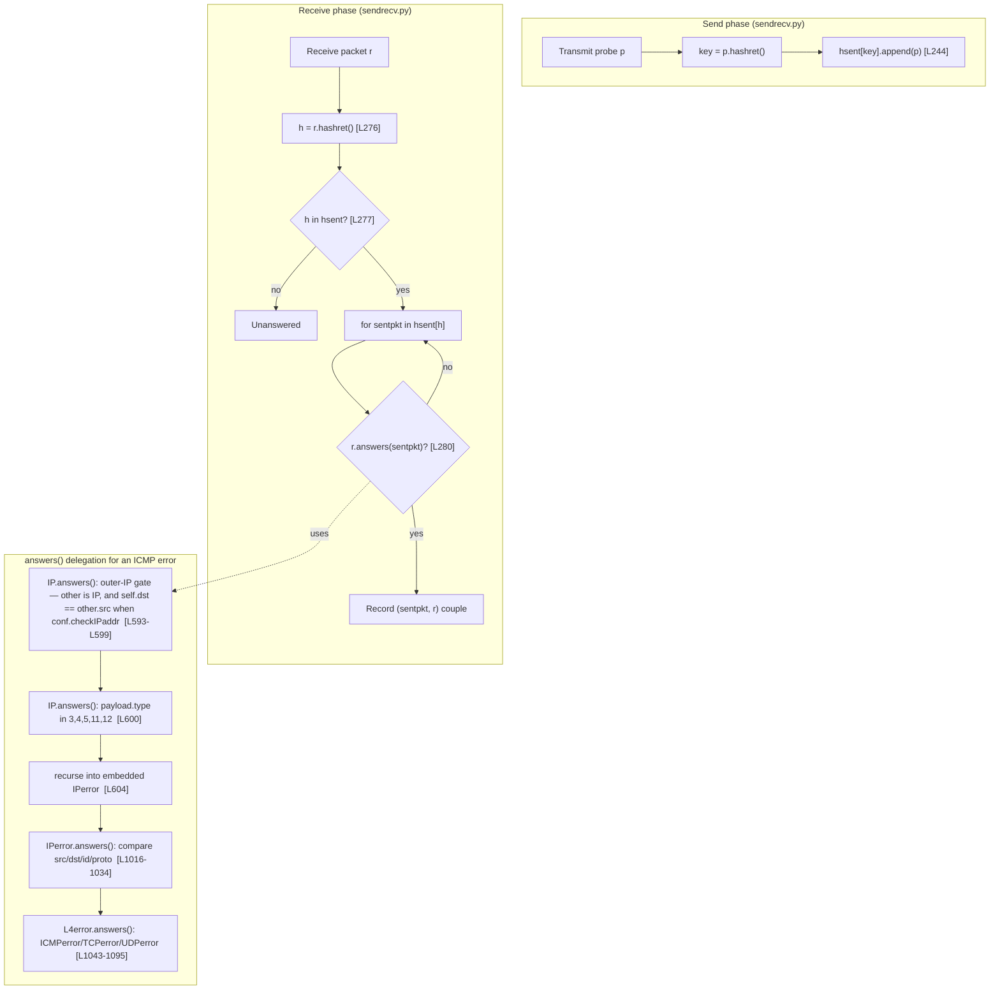

# Scapy ICMP-Error Response Matching — Source Analysis & Empirical Verification

> **Source branch:** `scapy_0925ada48540` &nbsp;•&nbsp; **HEAD:** `0925ada485406684174d6f068dbd85c4154657b3`
> **Document scope:** how Scapy's stimulus-response engine decides whether an inbound ICMP *error* message is the answer to a previously transmitted probe.

---

## 1. Scope & Method

### 1.1 What is analyzed

Scapy's central activity is a **stimulus–response loop**: a user defines a set of packets, Scapy sends them, receives answers, matches each request with its answer, and returns a list of `(request, answer)` couples plus a list of unmatched packets. This document analyzes the **matching half** of that loop, and specifically the *hard* case where the "answer" is not a direct reply but an **ICMP error** that embeds a (possibly mangled) copy of the original probe — for example an ICMP *destination-unreachable* returned in response to an ICMP *echo request*.

The analysis is grounded in five Scapy source modules, all treated as **reference-only** (none is modified):

| Module | Role in matching |
|--------|------------------|
| `scapy/sendrecv.py` | The two-stage dispatch: hash bucketing, then field-by-field confirmation. |
| `scapy/packet.py` | Base `Packet`/`NoPayload` `hashret()`/`answers()` delegation and recursion terminators. |
| `scapy/layers/inet.py` | The core: `IP`/`ICMP` and the `IPerror`/`ICMPerror`/`TCPerror`/`UDPerror` "error" layer family. |
| `scapy/config.py` | The `conf` flags that gate strict vs. tolerant comparisons. |
| `scapy/contrib/icmp_extensions.py` | The optional RFC 4884 multi-part extension parser. |

### 1.2 The six questions (verbatim)

This document answers **exactly** the following six questions and nothing beyond them. They are reproduced here verbatim and then answered, one per section, in §4–§9.

> **User Question 1 — Matching strategy:** How does Scapy determine whether an ICMP destination-unreachable error matches an original ICMP echo request? Does it extract the embedded original packet inside the ICMP error payload and compare fields, or does it use a different strategy? *(Technical scope: the `answers()` chain and the `IPerror`/`ICMPerror`/`TCPerror`/`UDPerror` "error" layer family.)*
>
> **User Question 2 — Hashing mechanism:** What hash value does Scapy generate via `hashret()` when processing an ICMP error that contains a copy of the original IP header plus a partial payload, and how does that hash compare to the hash of the original outgoing packet?
>
> **User Question 3 — Tolerance to mutation:** If the embedded original packet is subtly modified (e.g., changed TTL or checksum), does Scapy still consider it a valid match, or does matching fail?
>
> **User Question 4 — Configuration toggles:** What is the runtime behavior when `conf.checkIPsrc` (source-IP validation) and `conf.check_TCPerror_seqack` (TCP seq/ack verification in error citations) are toggled? Do they change which packets are accepted as valid responses, and what are the trade-offs of strict versus tolerant matching?
>
> **User Question 5 — IP-ID byte-swap tolerance:** When a returned ICMP error embeds an IP header whose ID appears byte-swapped, Scapy sometimes still matches. What are the exact conditions (`conf.checkIPID`) and the numeric transformation (`socket.htons` / byte swap)?
>
> **User Question 6 — RFC 4884 extensions:** When an ICMP error exceeds a size threshold and carries structured data beyond the embedded original packet, does loading Scapy's extension parsing alter packet structure in a way that changes match validity?

### 1.3 Method

Every claim below is established on two independent legs:

1. **Source citation** — the precise file and line range in the Scapy tree at HEAD `0925ada485406684174d6f068dbd85c4154657b3` that implements the behavior. Line numbers were re-confirmed against the working branch.
2. **Empirical observation** — the result of *building and running* Scapy and exercising `hashret()` / `answers()` under varied `conf` settings and packet mutations.

Scapy was exercised from an **isolated virtual environment**, importing the repository source via `PYTHONPATH` (rather than an editable install), so that no artifact such as `scapy.egg-info` was ever written into the repository. The observed runtime metadata was:

- Interpreter: **Python 3.11.15** (an isolated venv outside the repository tree).
- Scapy: imported via `PYTHONPATH=<repo-root>`; observed `conf.version` = **`2026.06.26`**.

The matching code is **pure Python** and uses no compiled component; it is therefore **version-independent** across Scapy's declared support window `requires-python = ">=3.7, <4"` (`pyproject.toml`). The analysis holds regardless of which interpreter in that range is used; the exact interpreter above is recorded only for reproducibility.

### 1.4 The no-modification constraint and how it was upheld

This is a **documentation-only** deliverable. The single artifact produced is this markdown file under `blitzy/documentation/`. The user's process directive was honored verbatim:

> *"Do not modify any source files. Temporary test scripts are fine but clean them up afterwards."*

Concretely: all verification scripts were created **outside** the repository (under `/tmp`), run against the source via `PYTHONPATH`, and **deleted** afterward. No editable install was performed. Throughout the work, `git status --porcelain` reported a clean tree apart from this new document; no Scapy `.py` file appears as modified and no `scapy.egg-info` was created. The reproduction appendix (§11) describes the ephemeral scripts in prose and inline snippets so every result can be re-derived without any script being committed.

---

## 2. The two-stage stimulus-response matching model (`scapy/sendrecv.py`)

Scapy's send/receive engine matches answers to requests in **two stages**, and **both stages must agree** before a `(request, answer)` couple is recorded.

**Stage 1 — hash bucketing (send side).** A dictionary `self.hsent` maps a *return hash* to the list of probes that share it. It is initialized empty:

```python
# scapy/sendrecv.py L168
self.hsent = {}  # type: Dict[bytes, List[Packet]]
```

As each probe `p` is transmitted, it is bucketed under the key `p.hashret()`:

```python
# scapy/sendrecv.py L244
self.hsent.setdefault(p.hashret(), []).append(p)
```

**Stage 2 — confirmation (receive side).** Each received packet `r` is keyed by its own `hashret()`; on a bucket hit, every candidate probe in that bucket is confirmed field-by-field with `r.answers(sentpkt)`:

```python
# scapy/sendrecv.py L276–L280
h = r.hashret()              # L276
if h in self.hsent:          # L277
    hlst = self.hsent[h]     # L278
    for i, sentpkt in enumerate(hlst):
        if r.answers(sentpkt):   # L280
            ...                  # record (sentpkt, r) couple
```

**Why two stages.** `hashret()` is an **O(1) bucket pre-filter**: it collapses the (potentially large) set of outstanding probes into a small candidate list keyed by a value that a request and its answer are engineered to share. `answers()` is the **authoritative confirmer**: it performs the exact field comparison that decides whether `r` truly answers `sentpkt`. Hashing alone can produce collisions (different probes can share a key); `answers()` resolves them. Conversely, `answers()` alone over every outstanding probe would be O(n) per received packet; the hash bucket avoids that. The design therefore needs both: the hash to be **cheap and equal for true pairs**, and `answers()` to be **precise**.

The remainder of this document is, in effect, a study of how `hashret()` and `answers()` are implemented for the ICMP-error case so that these two properties hold.

---

## 3. The `*error` layer family and `answers()`/`hashret()` delegation

### 3.1 Base delegation and recursion terminators (`scapy/packet.py`)

`hashret()` and `answers()` are **recursive**: each layer either contributes its own logic or delegates to its payload. The base `Packet` simply forwards to the payload:

```python
# scapy/packet.py L1215 (hashret) and L1221 (answers)
def hashret(self):
    # type: () -> bytes
    """DEV: returns a string that has the same value for a request
    and its answer."""
    return self.payload.hashret()              # L1219

def answers(self, other):
    # type: (Packet) -> int
    """DEV: true if self is an answer from other"""
    if other.__class__ == self.__class__:
        return self.payload.answers(other.payload)
    return 0
```

The recursion terminates at the `NoPayload` sentinel (`class NoPayload` — `scapy/packet.py` L1696), which represents "no further layer":

```python
# scapy/packet.py L1812 (hashret) and L1816 (answers)
def hashret(self):
    # type: () -> bytes
    return b""                                                 # L1814

def answers(self, other):
    # type: (Packet) -> bool
    return isinstance(other, (NoPayload, conf.padding_layer))  # L1818
```

So a bare layer's hash is the concatenation of its own contribution and its payload's, bottoming out at `b""`; and `answers()` walks layer-by-layer, returning false as soon as a class mismatch occurs or a non-empty/non-padding payload is required but absent. The `IP`, `ICMP`, and `*error` layers override these defaults with protocol-specific logic, detailed next.

### 3.2 How the ICMP error body becomes the `IPerror` family (`scapy/layers/inet.py`)

When an ICMP error is dissected, the bytes *after* the 8-byte ICMP header are a citation of the original datagram. Scapy parses them not as a normal `IP` packet but as a dedicated **`IPerror`** layer (and its `*error` payloads), which carry **different `answers()` semantics** from their normal counterparts. Two mechanisms cooperate:

1. **`ICMP.guess_payload_class()`** routes the ICMP body to `IPerror` for the error types:

```python
# scapy/layers/inet.py L1000–L1004
def guess_payload_class(self, payload):
    if self.type in [3, 4, 5, 11, 12]:
        return IPerror
    else:
        return None
```

2. **`bind_layers`** then chains `IPerror` to the embedded L4 citation by protocol number:

```python
# scapy/layers/inet.py L1107–L1110
bind_layers(IPerror, IPerror,   frag=0, proto=4)   # IP-in-IP citation
bind_layers(IPerror, ICMPerror, frag=0, proto=1)   # ICMP citation
bind_layers(IPerror, TCPerror,  frag=0, proto=6)   # TCP citation
bind_layers(IPerror, UDPerror,  frag=0, proto=17)  # UDP citation
```

The result: an ICMP destination-unreachable error citing an echo request dissects to `IP / ICMP / IPerror / ICMPerror`, and one citing a UDP probe dissects to `IP / ICMP / IPerror / UDPerror`. The `*error` classes (`IPerror` at L1013, `TCPerror` at L1040, `UDPerror` at L1063, `ICMPerror` at L1079) each override `answers()` to compare only the **identity fields** that survive a round trip, as detailed in §4–§7.

### 3.3 The delegation flowchart



The send phase and receive phase share a key space through `hashret()`; on the receive side, the `answers()` confirmation for an ICMP error follows the delegation chain `IP.answers → (outer-IP gate) → (ICMP-error branch) → IPerror.answers → L4error.answers`.

---

## 4. Q1 — Matching strategy

> **User Question 1 — Matching strategy:** How does Scapy determine whether an ICMP destination-unreachable error matches an original ICMP echo request? Does it extract the embedded original packet inside the ICMP error payload and compare fields, or does it use a different strategy? *(Technical scope: the `answers()` chain and the `IPerror`/`ICMPerror`/`TCPerror`/`UDPerror` "error" layer family.)*

### 4.1 Answer

**Scapy extracts the embedded original packet and compares its fields — it does *not* compare the outer ICMP error header.** When `IP.answers()` processes the received error, it first applies the same **outer-IP answer-direction sanity check** it applies to any IP reply: a non-`IP` `other` is rejected outright, and — under the default `conf.checkIPaddr=True` — the error's outer destination must equal the original probe's source (`self.dst == other.src`), confirming the error was actually addressed back to us. *Only after* that gate passes does it recognize the ICMP-error condition, **ignore the outer ICMP error header**, and recurse into the **embedded citation**, validating that against the original probe via `IPerror.answers()`. In other words, the outer IP header is **not** discarded entirely — its answer-direction is checked — whereas the outer *ICMP* error header (type/code/MTU) is what gets ignored.

### 4.2 Source

`IP.answers()` does not jump straight into the embedded citation. It first runs the standard outer-IP answer-direction checks shared by every IP reply: it rejects a non-`IP` `other` (L593–L594) and, when `conf.checkIPaddr` is enabled (the default), requires the received error's outer destination to equal the original probe's source — `self.dst == other.src` (L595–L599; the `224.0.0.251` branch is a narrow mDNS special case). Only once that gate passes does it detect the error condition — proto is ICMP, the payload is `ICMP`, and the type is one of `[3, 4, 5, 11, 12]` — and recurse into the embedded packet (L600–L604):

```python
# scapy/layers/inet.py L593–L610 — IP.answers(): outer-IP gate, then ICMP-error branch
        if not isinstance(other, IP):
            return 0
        if conf.checkIPaddr:
            if other.dst == "224.0.0.251" and self.dst == "224.0.0.251":  # mDNS
                return self.payload.answers(other.payload)
            elif (self.dst != other.src):
                return 0
        if ((self.proto == socket.IPPROTO_ICMP) and
            (isinstance(self.payload, ICMP)) and
                (self.payload.type in [3, 4, 5, 11, 12])):
            # ICMP error message
            return self.payload.payload.answers(other)

        else:
            if ((conf.checkIPaddr and (self.src != other.dst)) or
                    (self.proto != other.proto)):
                return 0
            return self.payload.answers(other.payload)
```

Here `self.payload.payload` is the embedded `IPerror` layer (the ICMP header is `self.payload`; its payload is the citation). The embedded body is parsed as the `IPerror` family because `ICMP.guess_payload_class()` returns `IPerror` for those types (L1000–L1004) and `bind_layers` chains the embedded L4 (L1107–L1110), as shown in §3.2. The field comparison itself is performed by `IPerror.answers()` (L1016–L1034), which delegates to the embedded L4's `*error.answers()`.

### 4.3 Empirical observation

Building an echo request and an ICMP destination-unreachable that cites it, then re-dissecting the error from its wire bytes:

```text
orig = IP(src="1.2.3.4", dst="5.6.7.8")/ICMP(type=8, id=0xabcd, seq=7)
err  = IP(raw(IP(src="5.6.7.8", dst="1.2.3.4")/ICMP(type=3, code=3)/orig))

err.summary()  → "IP / ICMP 5.6.7.8 > 1.2.3.4 dest-unreach port-unreachable / IPerror / ICMPerror"
err.layers()   → [IP, ICMP, IPerror, ICMPerror]
err.answers(orig) → 1
```

The presence of the **`IPerror` / `ICMPerror`** layers confirms that the embedded citation was dissected as the error family, and `answers()` returns `1` (a match).

### 4.4 Why

The outer ICMP error header carries **no identity of the original probe** — it is addressed router→host and contains only an ICMP type/code and (for some types) a next-hop MTU. The *only* probe-identifying data in the datagram is the **embedded citation** of the original packet. Therefore recursing into the citation is the **only** way to correlate the error with the probe that triggered it. Scapy's full delegation for this case is exactly:

```text
IP.answers()  →  (outer-IP gate, L593–L599)  →  (ICMP-error branch, L600–L604)  →  IPerror.answers()  →  ICMPerror/TCPerror/UDPerror.answers()
```

---

## 5. Q2 — Hashing mechanism (with byte-level decomposition)

> **User Question 2 — Hashing mechanism:** What hash value does Scapy generate via `hashret()` when processing an ICMP error that contains a copy of the original IP header plus a partial payload, and how does that hash compare to the hash of the original outgoing packet?

### 5.1 Answer

**The ICMP error and the original probe produce the *identical* `hashret()` value**, so they land in the same `hsent` bucket. For the example probe, both hash to `0x0404040c01cdab0700`.

### 5.2 Source

`IP.hashret()` has a dedicated short-circuit for ICMP errors: it skips the (reversed) outer header and returns the **embedded** packet's hash. For a normal packet it builds a symmetric key from the addresses, the protocol byte, and the L4 hash:

```python
# scapy/layers/inet.py L568–L581 — IP.hashret()
def hashret(self):
    if ((self.proto == socket.IPPROTO_ICMP) and
        (isinstance(self.payload, ICMP)) and
            (self.payload.type in [3, 4, 5, 11, 12])):
        return self.payload.payload.hashret()
    if not conf.checkIPinIP and self.proto in [4, 41]:  # IP, IPv6
        return self.payload.hashret()
    if self.dst == "224.0.0.251":  # mDNS
        return struct.pack("B", self.proto) + self.payload.hashret()
    if conf.checkIPsrc and conf.checkIPaddr:
        return (strxor(inet_pton(socket.AF_INET, self.src),
                       inet_pton(socket.AF_INET, self.dst)) +
                struct.pack("B", self.proto) + self.payload.hashret())
    return struct.pack("B", self.proto) + self.payload.hashret()
```

The L4 tail for an ICMP echo comes from `ICMP.hashret()`, which packs `id` and `seq` for the id/seq-bearing types:

```python
# scapy/layers/inet.py L986–L989 — ICMP.hashret()
def hashret(self):
    if self.type in icmp_id_seq_types:
        return struct.pack("HH", self.id, self.seq) + self.payload.hashret()  # noqa: E501
    return self.payload.hashret()
```

where `icmp_id_seq_types = [0, 8, 13, 14, 15, 16, 17, 18, 37, 38]` (L949) includes echo request type `8`, and the empty payload contributes `b""` via `NoPayload.hashret()` (`scapy/packet.py` L1812).

### 5.3 Two reasons the keys collide

The request and its reply land in the same bucket for **two independent reasons**, and it is worth stating both because they cover the two distinct response shapes:

1. **`strxor` symmetry (normal replies).** In the default normal path (L577–L580), the address component is `strxor(inet_pton(src), inet_pton(dst))`. Because XOR is commutative, `strxor(src, dst) == strxor(dst, src)`. A *normal* reply has its src/dst swapped relative to the request, yet produces the **same** address component — so its key equals the request's.
2. **Embedded-copy short-circuit (ICMP errors).** For an *ICMP error*, `IP.hashret()` ignores the reversed outer header entirely (L569–L572) and hashes the **embedded copy**, which preserves the original probe's `src → dst` orientation. The embedded copy's hash is therefore **trivially equal** to the original probe's own hash.

### 5.4 Byte-level decomposition

Both `orig.hashret()` and `err.hashret()` were observed to equal **`0x0404040c01cdab0700`**. It decomposes exactly into the three concatenated components from §5.2:

| Component | Source | Bytes |
|-----------|--------|-------|
| `strxor(inet_pton("1.2.3.4"), inet_pton("5.6.7.8"))` | L578–L579 | `04 04 04 0c` |
| protocol byte (ICMP = 1) | `struct.pack("B", 1)` (L580) | `01` |
| ICMP id/seq tail | `struct.pack("HH", 0xabcd, 7)` (L988) | `cd ab 07 00` |

- The XOR is byte-wise: `0x01^0x05=0x04`, `0x02^0x06=0x04`, `0x03^0x07=0x04`, `0x04^0x08=0x0c` → `0404040c`.
- The id/seq tail uses **native (little-endian) `H`** packing: `id=0xabcd` → `cd ab`, `seq=7` → `07 00`, giving `cdab0700`.
- Concatenation: `0404040c` | `01` | `cdab0700` = **`0404040c01cdab0700`**.

### 5.5 Why

Equal keys are *the entire point* of `hashret()`: they place a request and its answer in the same `hsent` bucket so the O(1) pre-filter (§2) succeeds, after which `answers()` confirms the match. The ICMP-error short-circuit is what makes this work for errors — without it, the reversed outer header would produce a different key and the error could never be looked up against the probe.

---

## 6. Q3 — Tolerance to mutation (TTL / checksum)

> **User Question 3 — Tolerance to mutation:** If the embedded original packet is subtly modified (e.g., changed TTL or checksum), does Scapy still consider it a valid match, or does matching fail?

### 6.1 Answer

**Matching still succeeds.** Mutating the embedded copy's `ttl` and `chksum` does *not* break the match, because `IPerror.answers()` compares **only** `src`, `dst`, `id`, and `proto` — it never inspects `ttl`, `chksum`, `len`, or `tos`.

### 6.2 Source

```python
# scapy/layers/inet.py L1016–L1034 — IPerror.answers()
def answers(self, other):
    if not isinstance(other, IP):
        return 0

    # Check if IP addresses match
    test_IPsrc = not conf.checkIPsrc or self.src == other.src          # L1021
    test_IPdst = self.dst == other.dst                                 # L1022

    # Check if IP ids match
    test_IPid = not conf.checkIPID or self.id == other.id              # L1025
    test_IPid |= conf.checkIPID and self.id == socket.htons(other.id)  # L1026

    # Check if IP protocols match
    test_IPproto = self.proto == other.proto                           # L1029

    if not (test_IPsrc and test_IPdst and test_IPid and test_IPproto): # L1031
        return 0                                                       # L1032

    return self.payload.answers(other.payload)                         # L1034
```

The only fields read from the embedded IP header are `src` (L1021), `dst` (L1022), `id` (L1025–L1026), and `proto` (L1029). `ttl`, `chksum`, `len`, and `tos` are **absent** from this comparison. Likewise, `IP.hashret()` (§5.2) never incorporates `ttl` or `chksum`, so the bucket key is unaffected by those fields.

### 6.3 Empirical observation

Re-dissecting an error whose embedded copy was built with `ttl=7` and `chksum=0xDEAD`:

```text
embedded IPerror ttl   = 7
embedded IPerror chksum = 0xdead
emut.answers(orig)     → 1          # still a match
emut.hashret()         → 0x0404040c01cdab0700   # unchanged vs orig
```

### 6.4 Why

`ttl` and `chksum` are **transit-mutated fields**: every router on the path legitimately decrements TTL and recomputes the header checksum, and the device that emits the ICMP error cites whatever it received at that point in the path. Matching on such volatile fields would discard a large fraction of *legitimate* answers. Scapy therefore matches on the **stable identity tuple** (`src`, `dst`, `id`, `proto`) only — the fields that uniquely identify the flow and survive forwarding. Because the same fields are also the only ones in the hash, both the bucket key (stage 1) and the `answers()` confirmation (stage 2) are immune to TTL/checksum mutation.

---

## 7. Q4 — `conf.checkIPsrc` and `conf.check_TCPerror_seqack` toggles

> **User Question 4 — Configuration toggles:** What is the runtime behavior when `conf.checkIPsrc` (source-IP validation) and `conf.check_TCPerror_seqack` (TCP seq/ack verification in error citations) are toggled? Do they change which packets are accepted as valid responses, and what are the trade-offs of strict versus tolerant matching?

### 7.1 Answer

**Yes — both flags gate which packets are accepted as valid responses.** `conf.checkIPsrc` controls whether the embedded **source IP** (and, for L4 citations, the **source/destination ports**) must match; `conf.check_TCPerror_seqack` controls whether the embedded TCP **seq/ack** must match. Toggling either flag flips specific borderline citations between match and non-match.

### 7.2 Source

**Embedded source IP** is verified only when `conf.checkIPsrc` is truthy (default `checkIPsrc = True`, `scapy/config.py` L751):

```python
# scapy/layers/inet.py L1021
test_IPsrc = not conf.checkIPsrc or self.src == other.src
```

When `checkIPsrc` is `False`, `test_IPsrc` is unconditionally `True`, so the embedded source address is ignored.

**Embedded TCP seq/ack** are verified only when `conf.check_TCPerror_seqack` is set (default `check_TCPerror_seqack = False`, `scapy/config.py` L758). `TCPerror.answers()` also gates the **port** comparison on `conf.checkIPsrc`:

```python
# scapy/layers/inet.py L1043–L1057 — TCPerror.answers()
def answers(self, other):
    if not isinstance(other, TCP):
        return 0
    if conf.checkIPsrc:                                  # L1046
        if not ((self.sport == other.sport) and
                (self.dport == other.dport)):
            return 0
    if conf.check_TCPerror_seqack:                       # L1050
        if self.seq is not None:
            if self.seq != other.seq:
                return 0
        if self.ack is not None:
            if self.ack != other.ack:
                return 0
    return 1                                             # L1057
```

For completeness, `UDPerror.answers()` (L1066–L1073) only ever checks `sport`/`dport`, and only under `conf.checkIPsrc`; it has no seq/ack notion:

```python
# scapy/layers/inet.py L1066–L1073 — UDPerror.answers()
def answers(self, other):
    if not isinstance(other, UDP):
        return 0
    if conf.checkIPsrc:
        if not ((self.sport == other.sport) and
                (self.dport == other.dport)):
            return 0
    return 1
```

### 7.3 Empirical observation

```text
# check_TCPerror_seqack — embedded TCP seq=2000 vs original seq=1000
conf.check_TCPerror_seqack = False  →  answers() = 1
conf.check_TCPerror_seqack = True   →  answers() = 0      # 1 → 0 (now rejected)

# checkIPsrc — embedded IP src=9.9.9.9 vs original 1.2.3.4
conf.checkIPsrc = True              →  answers() = 0
conf.checkIPsrc = False             →  answers() = 1      # 0 → 1 (now tolerated)
```

Toggling `check_TCPerror_seqack` from its default `False` to `True` flips a seq-mismatched citation **`1 → 0`**; toggling `checkIPsrc` from its default `True` to `False` flips a src-mismatched citation **`0 → 1`**.

### 7.4 Why / the strict-vs-tolerant trade-off

- **Strict mode (flags on).** Demanding that the embedded src/ports/seq/ack match byte-for-byte **reduces false positives** (a spurious or spoofed error citing the wrong flow is rejected). The cost is **dropping legitimate answers**: a NAT or a middlebox may rewrite the leading octets of the cited datagram, and many IP stacks do not reproduce the original TCP seq/ack exactly in the citation. RFC 4884 itself notes that the cited "original datagram" can be altered in transit (e.g., by a NAT rewriting addresses/ports), which is precisely why strict citation matching can miss real answers.
- **Tolerant mode (flags off).** Ignoring those fields **matches more broadly**, recovering answers behind NAT or from stacks that mangle the citation, at the **risk of more false positives**.
- **The defaults are a pragmatic middle ground.** `checkIPsrc = True` validates addressing (and ports) — cheap, usually preserved end-to-end — while `check_TCPerror_seqack = False` declines to demand byte-perfect seq/ack citations that many stacks mangle. This accepts more real answers without opening the matcher to arbitrary mismatched flows.

---

## 8. Q5 — IP-ID byte-swap tolerance (and the `checkIPID` mode-2 finding)

> **User Question 5 — IP-ID byte-swap tolerance:** When a returned ICMP error embeds an IP header whose ID appears byte-swapped, Scapy sometimes still matches. What are the exact conditions (`conf.checkIPID`) and the numeric transformation (`socket.htons` / byte swap)?

### 8.1 Answer

A byte-swapped embedded IP-ID is accepted whenever `conf.checkIPID` is **truthy** (modes `1` *and* `2`). The numeric transformation is `socket.htons()`, a 16-bit byte swap (`htons(0x0102) == 0x0201`). **Finding:** the documented "strict" **mode 2 behaves identically to mode 1** — it does *not* reject the byte-swapped ID.

### 8.2 Source

The configuration flag is documented as tri-state but defaults to `False` (`scapy/config.py` L744–L748):

```python
# scapy/config.py L744–L748
    #: ICMP IP citation received
    #: if 1, checks that they either are equal or byte swapped
    #: equals (bug in some IP stacks)
    #: if 2, strictly checks that they are equals
    checkIPID = False
```

The docstring promises three behaviors — `0`/`False` = ignore the ID, `1` = accept equal-or-byte-swapped, `2` = strictly equal. But `IPerror.answers()` consumes the flag **only via truthiness**, never as an integer mode value:

```python
# scapy/layers/inet.py L1025–L1026
test_IPid = not conf.checkIPID or self.id == other.id
test_IPid |= conf.checkIPID and self.id == socket.htons(other.id)
```

`socket.htons()` is the standard host-to-network-short conversion, i.e. a 16-bit byte swap on a little-endian host (`socket.htons(0x0102) == 0x0201`, confirmed empirically).

### 8.3 Empirical observation

With base id `0x0102` and three candidate embedded IDs — exact `0x0102`, byte-swapped `0x0201`, and unrelated `0x9999`:

| `conf.checkIPID` | (exact, swapped, unrelated) |
|------------------|-----------------------------|
| `0` | `(1, 1, 1)` — matches all (ID ignored) |
| `1` | `(1, 1, 0)` — exact + swapped match, unrelated rejected |
| `2` | `(1, 1, 0)` — **identical to mode 1** |

### 8.4 Finding (report, do not fix)

The documented "strict" **mode 2 is not implemented as stricter than mode 1**. Trace the two lines with `conf.checkIPID = 2`:

- L1025: `not conf.checkIPID` → `not 2` → `False`, so `test_IPid` becomes `self.id == other.id` (true only for the exact ID).
- L1026: `conf.checkIPID and self.id == socket.htons(other.id)` → `2 and (…)` → the integer `2` is truthy, so the byte-swap clause is **still evaluated** and OR-ed in.

Because both lines treat `conf.checkIPID` purely as a boolean, the integer mode value **never distinguishes 1 from 2**: `not 1` and `not 2` are both `False`, and `1 and …` / `2 and …` are both truthy. Mode `2` therefore **still accepts** the `htons`-swapped ID, contradicting its "strictly checks that they are equals" docstring.

This is surfaced as a **finding only**. The byte-swap clause exists deliberately because some IP stacks emit the cited IP-ID in the wrong byte order (the docstring's "bug in some IP stacks"), so tolerant matching recovers those answers. Remediating the mode-2 discrepancy would require **editing source**, which the task rules forbid; it is documented, not changed.

---

## 9. Q6 — RFC 4884 extensions: structure changes, match outcome does not

> **User Question 6 — RFC 4884 extensions:** When an ICMP error exceeds a size threshold and carries structured data beyond the embedded original packet, does loading Scapy's extension parsing alter packet structure in a way that changes match validity?

### 9.1 Answer

Loading Scapy's RFC 4884 parser (`load_contrib('icmp_extensions')`) **changes the dissected layer structure** (trailing bytes get reclassified into `ICMPExtensionHeader` and object layers) but **does not change the match outcome**. `answers()` returns the same value with or without the extension parser.

### 9.2 Source

The parser is an **optional contrib** module. Importing it monkey-patches a `post_dissection` hook onto the three IPv4 `*error` classes (and, out of scope here, the two IPv6 ICMP error classes):

```python
# scapy/contrib/icmp_extensions.py L176–L178 (IPv4) and L180–L181 (IPv6, out of scope)
scapy.layers.inet.ICMPerror.post_dissection = ICMPExtension_post_dissection   # L176
scapy.layers.inet.TCPerror.post_dissection  = ICMPExtension_post_dissection   # L177
scapy.layers.inet.UDPerror.post_dissection  = ICMPExtension_post_dissection   # L178
scapy.layers.inet6.ICMPv6DestUnreach.post_dissection  = ICMPExtension_post_dissection  # L180
scapy.layers.inet6.ICMPv6TimeExceeded.post_dissection = ICMPExtension_post_dissection  # L181
```

The hook fires only under a specific set of guards:

```python
# scapy/contrib/icmp_extensions.py L67–L98 — ICMPExtension_post_dissection() (IPv4 path)
def ICMPExtension_post_dissection(self, pkt):
    # RFC4884 section 5.2 says if the ICMP packet length
    # is >144 then ICMP extensions start at byte 137.

    lastlayer = pkt.lastlayer()
    if not isinstance(lastlayer, conf.padding_layer):     # L72–L73 guard
        return

    if IP in pkt:
        if (ICMP in pkt and
            pkt[ICMP].type in [3, 11, 12] and             # L76–L78 trigger
                pkt.len > 144):
            bytes = pkt[ICMP].build()[136:]               # L79 slice (offset 136 = 137th octet)
        else:
            return
    ...
    # validate checksum
    ieh = ICMPExtensionHeader(bytes)
    if checksum(ieh.build()):                             # L94 whole-structure checksum gate
        return  # failed
    lastlayer.load = lastlayer.load[:-len(ieh)]           # L97 relocate trailing bytes
    lastlayer.add_payload(ieh)                            # L98
```

So the hook activates only when **(a)** the contrib is loaded (L176–L178), **(b)** the last layer is a padding layer (L71–L73), **(c)** the packet has `ICMP`, the type is in `[3, 11, 12]`, and `pkt.len > 144` (L76–L78), and **(d)** the trailing extension's **whole-structure** checksum validates (`if checksum(ieh.build()): return`, L93–L95). On success it moves the trailing bytes from the last layer's `load` into a separate `ICMPExtensionHeader` layer (L97–L98); the embedded **identity tuple is never touched**.

### 9.3 RFC 4884 grounding

The numeric guards correspond directly to RFC 4884 *"Extended ICMP to Support Multi-Part Messages"* (https://datatracker.ietf.org/doc/html/rfc4884); the contrib comment at L68–L69 explicitly cites "RFC4884 section 5.2":

- The **144-octet trigger** = `8` (first two words of the ICMPv4 error header) + `128` (original datagram, zero-padded to ≥ 128 octets) + `4` (ICMP Extension Header) + `4` (one Object header). This is the `pkt.len > 144` guard (L78).
- When the payload is ≥ 144 octets, the receiver examines the **137th octet** for a valid extension header (valid version + checksum). 0-indexed offset `136` is the 137th octet, i.e. the `pkt[ICMP].build()[136:]` slice (L79).
- Extensions apply **only** to Destination Unreachable (`3`), Time Exceeded (`11`), and Parameter Problem (`12`) — the `pkt[ICMP].type in [3, 11, 12]` filter (L77).

### 9.4 Empirical observation (two isolated processes, same wire bytes)

Because importing the contrib **auto-activates** the `post_dissection` hook process-wide, the with/without comparison must dissect the **same wire bytes in two *separate* Python processes** — one importing the contrib, one not. An oversized ICMP type-3 error was built whose embedded UDP probe is padded to a 128-octet original datagram, followed by a valid 12-byte RFC 4884 extension (a 4-byte `ICMPExtensionHeader` + an 8-byte MPLS object), with the extension checksum fixed over the **whole structure**. The outer IP total length is `168` (`> 144`).

```text
WITHOUT load_contrib:
  layers  = [IP, ICMP, IPerror, UDPerror, Raw, Padding]
  answers(orig) = 1

WITH load_contrib('icmp_extensions'):
  layers  = [IP, ICMP, IPerror, UDPerror, Raw, Padding, ICMPExtensionHeader, ICMPExtensionMPLS]
  answers(orig) = 1   (UNCHANGED)
```

The layer list **gains** `ICMPExtensionHeader` / `ICMPExtensionMPLS` once the contrib is loaded, yet `answers()` is **`1` in both cases**.

### 9.5 Why

Matching reads **only the embedded header fields** — the embedded IP 20-byte header plus the start of the cited L4 (roughly the first ~28 octets) — which live far *before* the extension region at octet 137. The `post_dissection` hook only **reclassifies trailing bytes** (`Raw` / `Padding` → `ICMPExtensionHeader` / objects); it never alters the embedded identity tuple that `IPerror.answers()` and the L4 `*error.answers()` consume. Consequently the couple is recorded — or not — identically, whether or not the extension parser is loaded.

### 9.6 Secondary finding (report, do not fix)

A **naively scapy-built extension does not self-validate**. `ICMPExtensionHeader.post_build` computes the checksum over **only the 4-byte header**:

```python
# scapy/contrib/icmp_extensions.py L44–L48 — ICMPExtensionHeader.post_build()
def post_build(self, p, pay):
    if self.chksum is None:
        ck = checksum(p)                # checksum over the HEADER ONLY
        p = p[:2] + chb(ck >> 8) + chb(ck & 0xff) + p[4:]
    return p + pay
```

whereas the dissection gate validates the checksum over the **whole structure** (`if checksum(ieh.build()): return`, L94). Empirically, the **header-only** checksum that `post_build` embeds was `57343` (`0xDFFF` — deterministic: the internet checksum of the 4-byte header `0x2000_0000`), while the **whole-structure** checksum of that naive build was `56681` — **non-zero**, so the dissection gate at L94 would **reject** it. (This whole-structure value depends on the bytes of the extension object; the deterministic, build-independent anchor is the header-only `57343`.) To make the WITH-contrib case parse, the checksum had to be fixed over the **whole structure** manually (yielding `0`, which the gate accepts). This `post_build`-vs-validation asymmetry is a source-level bug **surfaced as a finding only**; correcting it would require editing source, which the rules forbid.

> **Note (out of scope):** IPv6 ICMP-error matching is not analyzed here. The contrib's IPv6 `post_dissection` registrations (L180–L181) are mentioned only for completeness; the six questions are ICMPv4-centric.

---

## 10. Synthesis & findings

### 10.1 The strict-vs-tolerant trade-off, holistically

Every question above is a facet of one design tension: **how much of the cited datagram must match before Scapy declares an answer?** Scapy resolves it by matching on a **stable identity tuple** and gating everything else behind `conf` flags:

- **Always compared** (the identity tuple): embedded IP `dst` and `proto` (`IPerror.answers`), the embedded L4 type/code and id/seq for ICMP citations (`ICMPerror.answers`).
- **Never compared** (transit-mutated): `ttl`, `chksum`, `len`, `tos` (Q3).
- **Compared by default, relaxable** via `conf.checkIPsrc`: embedded IP `src` and L4 `sport`/`dport` (Q4).
- **Not compared by default, tightenable** via `conf.check_TCPerror_seqack`: embedded TCP `seq`/`ack` (Q4).
- **Ignored by default, tolerant when enabled** via `conf.checkIPID`: embedded IP `id`, with byte-swap tolerance (Q5).

Strict settings minimize false positives but drop legitimate answers mangled by NAT/middleboxes; tolerant settings recover those answers at the cost of more false positives. The defaults (`checkIPsrc=True`, `check_TCPerror_seqack=False`, `checkIPID=False`) deliberately occupy the middle: validate addressing, don't demand byte-perfect seq/ack, ignore the volatile IP-ID. RFC 4884 extension parsing (Q6) sits entirely *outside* this tension — it changes how trailing bytes are *displayed*, never how the identity tuple is *compared*.

### 10.2 Two report-don't-fix findings

1. **`conf.checkIPID` "strict" mode 2 behaves identically to mode 1.** Byte-swapped IDs are still accepted under mode 2 because `IPerror.answers()` consumes the flag only as a boolean [`scapy/layers/inet.py` L1025–L1026; `scapy/config.py` L744–L748]. The integer mode value never distinguishes 1 from 2.
2. **`ICMPExtensionHeader.post_build` checksums only the header.** It checksums the 4-byte header [`scapy/contrib/icmp_extensions.py` L44–L48] while the dissection gate checksums the whole structure [L94], so a naively scapy-built extension fails self-validation.

Both are surfaced as findings; remediation is **out of scope** because it would require forbidden source edits.

### 10.3 Consolidated empirical results table

| Question | Scenario exercised | Observed result |
|----------|--------------------|-----------------|
| Q1 / Q2 | Echo request vs. its ICMP dest-unreach citation | Identical `hashret` `0x0404040c01cdab0700`; `answers()=1` |
| Q3 | Embedded `ttl=7`, `chksum=0xDEAD` | `answers()=1` (mutation tolerated); hash unchanged |
| Q4 | `check_TCPerror_seqack` `False`→`True` with seq mismatch | `1` → `0` (now rejected) |
| Q4 | `checkIPsrc` `True`→`False` with embedded src mismatch | `0` → `1` (now tolerated) |
| Q5 | `checkIPID=0` | Exact, byte-swapped, and unrelated all match `(1,1,1)` |
| Q5 | `checkIPID=1` and `checkIPID=2` | Exact + byte-swapped match, unrelated rejected `(1,1,0)` (modes identical) |
| Q6 | Parse >144-byte error WITHOUT `load_contrib` | Layers `…/Raw/Padding`; `answers()=1` |
| Q6 | Parse same error WITH `load_contrib` + valid checksum | Layers gain `ICMPExtensionHeader/ICMPExtensionMPLS`; `answers()=1` |

**Verification environment:** Python 3.11.15, Scapy imported via `PYTHONPATH` from the repo root, observed `conf.version` `2026.06.26`. `git status` remained clean throughout; no `scapy.egg-info` was written.

---

## 11. Reproduction appendix

The results above were produced by **ephemeral** Python scripts created **under `/tmp`** (outside the repository), run against the source via `PYTHONPATH`, and **deleted** afterward — honoring the user's directive:

> *"Do not modify any source files. Temporary test scripts are fine but clean them up afterwards."*

No script was committed; the snippets below are reproduced inline so any reader can regenerate every result. Throughout, `git status --porcelain` reported only this new document; no Scapy `.py` file was modified and no `scapy.egg-info` was created.

### 11.0 Setup

```bash
# From an isolated venv; import the in-repo source via PYTHONPATH (NO editable install).
PYTHONPATH=/path/to/repo/root python3
```
```python
from scapy.all import *          # or targeted: from scapy.layers.inet import IP, ICMP, TCP, UDP, ...
from scapy.compat import raw
print(conf.version)              # observed: 2026.06.26
```

### 11.1 Q1 / Q2 / Q3 — matching, hashing, mutation tolerance

```python
from scapy.layers.inet import IP, ICMP, IPerror
from scapy.compat import raw

orig = IP(src="1.2.3.4", dst="5.6.7.8")/ICMP(type=8, id=0xabcd, seq=7)
err  = IP(raw(IP(src="5.6.7.8", dst="1.2.3.4")/ICMP(type=3, code=3)/orig))

# Q1: the embedded citation is dissected as the IPerror family, and answers() matches
print([l.__name__ for l in err.layers()])   # [IP, ICMP, IPerror, ICMPerror]
print(err.answers(orig))                     # 1

# Q2: request and reply hash identically
print(orig.hashret().hex(), err.hashret().hex())   # 0404040c01cdab0700  (both)

# Q3: mutate the embedded copy's ttl/chksum; match still succeeds, hash unchanged
emut = IP(raw(IP(src="5.6.7.8", dst="1.2.3.4")/ICMP(type=3, code=3)/
              IP(src="1.2.3.4", dst="5.6.7.8", ttl=7, chksum=0xDEAD)/
              ICMP(type=8, id=0xabcd, seq=7)))
print(emut.answers(orig))                    # 1
print(emut.hashret().hex())                  # 0404040c01cdab0700 (unchanged)
```

### 11.2 Q4 — `check_TCPerror_seqack` and `checkIPsrc`

```python
from scapy.config import conf
from scapy.layers.inet import IP, ICMP, TCP
from scapy.compat import raw

# seq mismatch in the TCP citation
orig = IP(src="1.2.3.4", dst="5.6.7.8")/TCP(sport=1234, dport=80, seq=1000)
err  = IP(raw(IP(src="5.6.7.8", dst="1.2.3.4")/ICMP(type=3, code=3)/
              IP(src="1.2.3.4", dst="5.6.7.8")/TCP(sport=1234, dport=80, seq=2000)))
conf.check_TCPerror_seqack = False; print(err.answers(orig))   # 1
conf.check_TCPerror_seqack = True;  print(err.answers(orig))   # 0
conf.check_TCPerror_seqack = False                              # reset

# embedded src mismatch
orig2 = IP(src="1.2.3.4", dst="5.6.7.8")/TCP(sport=1234, dport=80, seq=1000)
err2  = IP(raw(IP(src="5.6.7.8", dst="1.2.3.4")/ICMP(type=3, code=3)/
               IP(src="9.9.9.9", dst="5.6.7.8")/TCP(sport=1234, dport=80, seq=1000)))
conf.checkIPsrc = True;  print(err2.answers(orig2))            # 0
conf.checkIPsrc = False; print(err2.answers(orig2))            # 1
conf.checkIPsrc = True                                          # reset
```

### 11.3 Q5 — `checkIPID` modes 0 / 1 / 2 and `socket.htons`

```python
import socket
from scapy.config import conf
from scapy.layers.inet import IP, ICMP
from scapy.compat import raw

print(hex(socket.htons(0x0102)))             # 0x201  (16-bit byte swap)

orig = IP(src="1.2.3.4", dst="5.6.7.8", id=0x0102)/ICMP(type=8, id=0xabcd, seq=7)
def err(eid):
    return IP(raw(IP(src="5.6.7.8", dst="1.2.3.4")/ICMP(type=3, code=3)/
                  IP(src="1.2.3.4", dst="5.6.7.8", id=eid)/ICMP(type=8, id=0xabcd, seq=7)))
exact, swapped, unrelated = err(0x0102), err(0x0201), err(0x9999)
for mode in (0, 1, 2):
    conf.checkIPID = mode
    print(mode, (exact.answers(orig), swapped.answers(orig), unrelated.answers(orig)))
conf.checkIPID = False                        # reset
# 0 (1,1,1)   |   1 (1,1,0)   |   2 (1,1,0)  -> modes 1 and 2 identical
```

### 11.4 Q6 — RFC 4884 extension parsing (two isolated processes)

First, **build** an oversized type-3 error with a 128-octet original datagram and a valid 12-byte MPLS extension whose checksum is fixed over the **whole structure**, and print its wire bytes as hex:

```python
from scapy.layers.inet import IP, ICMP, UDP, checksum
from scapy.packet import Raw
from scapy.compat import raw
from scapy.contrib.icmp_extensions import ICMPExtensionHeader, ICMPExtensionMPLS
from scapy.contrib.mpls import MPLS

orig = IP(src="1.2.3.4", dst="5.6.7.8")/UDP(sport=1234, dport=33434)/Raw(load=b"\xde\xad\xbe\xef")
original_datagram = raw(orig) + b"\x00" * (128 - len(raw(orig)))      # zero-pad to 128 octets

# post_build checksums the HEADER ONLY (finding); fix the WHOLE-structure checksum manually:
ck_whole = checksum(raw(ICMPExtensionHeader(chksum=0)/ICMPExtensionMPLS(stack=[MPLS(label=1234, ttl=64)])))
ext = raw(ICMPExtensionHeader(chksum=ck_whole)/ICMPExtensionMPLS(stack=[MPLS(label=1234, ttl=64)]))
assert checksum(ext) == 0                                             # whole-structure checksum now valid

full = IP(src="5.6.7.8", dst="1.2.3.4")/ICMP(type=3, code=3)/(original_datagram + ext)
print(IP(raw(full)).len)                                             # 168  (> 144)
print(raw(full).hex())                                               # <WIRE_HEX>
```

Then dissect the **same** `<WIRE_HEX>` in **two separate processes** (because importing the contrib auto-activates the hook process-wide):

```bash
# Process A — WITHOUT the contrib
PYTHONPATH=/path/to/repo/root python3 -c '
from scapy.layers.inet import IP, UDP
from scapy.packet import Raw
wire = bytes.fromhex("<WIRE_HEX>")
orig = IP(src="1.2.3.4", dst="5.6.7.8")/UDP(sport=1234, dport=33434)/Raw(load=b"\xde\xad\xbe\xef")
pkt  = IP(wire)
print([l.__name__ for l in pkt.layers()], pkt.answers(orig))
'   # [IP, ICMP, IPerror, UDPerror, Raw, Padding] 1

# Process B — WITH the contrib
PYTHONPATH=/path/to/repo/root python3 -c '
from scapy.layers.inet import IP, UDP
from scapy.packet import Raw
from scapy.all import load_contrib
load_contrib("icmp_extensions")
wire = bytes.fromhex("<WIRE_HEX>")
orig = IP(src="1.2.3.4", dst="5.6.7.8")/UDP(sport=1234, dport=33434)/Raw(load=b"\xde\xad\xbe\xef")
pkt  = IP(wire)
print([l.__name__ for l in pkt.layers()], pkt.answers(orig))
'   # [IP, ICMP, IPerror, UDPerror, Raw, Padding, ICMPExtensionHeader, ICMPExtensionMPLS] 1
```

The layer list gains `ICMPExtensionHeader` / `ICMPExtensionMPLS` in process B, while `answers()` stays `1` in both — confirming that extension parsing changes structure but not match validity.

### 11.5 Cleanup

All of the above were saved as throwaway files under `/tmp` (e.g. `/tmp/scapy_verify/*.py`), executed via `PYTHONPATH`, and removed with `rm -rf /tmp/scapy_verify` once the observations were recorded. A final `git status --porcelain` confirmed the only change in the repository is this document under `blitzy/documentation/`, with no Scapy source file modified and no `scapy.egg-info` present — fully honoring *"Do not modify any source files. Temporary test scripts are fine but clean them up afterwards."*

