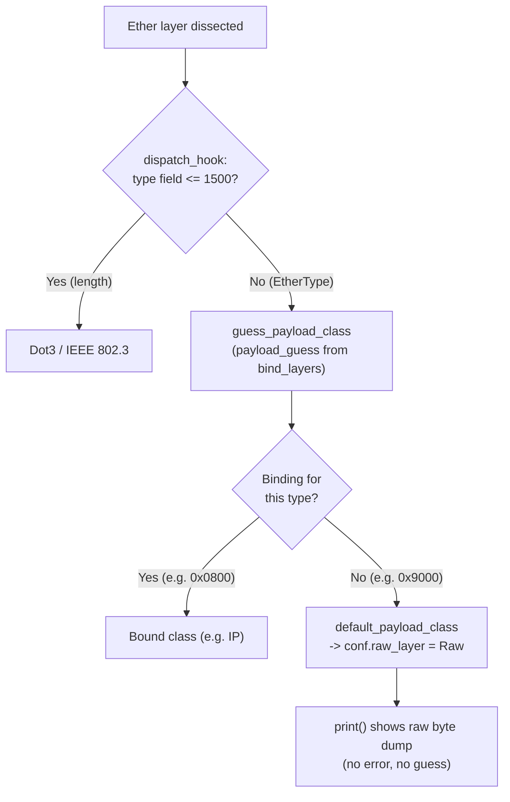

# Scapy Ethernet Frames: Build, Serialize, Re-dissect — Padding & EtherType Analysis

This document answers, **empirically and with exact source-code citations**, how Scapy
builds (`raw()`), serializes, and re-dissects Ethernet frames. It focuses on two questions
the prompt raises:

- **(a) Payload padding** at the Ethernet minimum-frame boundary — *does Scapy auto-pad short
  payloads, and if so, when?*
- **(b) The EtherType → next-protocol mapping** — *how is the 2-octet type field turned into the
  next layer, and what is the fallback for an unrecognized EtherType?*

Every behavioral claim below carries three things, in this order:
**(a)** the *empirical result* (the construction and its observed output), **(b)** the *source
citation* in the form `[<path>:<line range>]`, and **(c)** the *rationale* — *why* the behavior
occurs. Nothing here is inferred; each number was produced by building and running packets against
the repository's own source.

---

## Environment & Methodology

| Item | Value |
|------|-------|
| Python runtime | **3.13.7** (observed; the only interpreter available on the Ubuntu 25.10 host — satisfies the project's `requires-python = ">=3.7, <4"`) |
| Scapy import origin | **From repository source** — `scapy.__file__` resolves to this repo's own `scapy/__init__.py` (`is_repo_source = True`), *not* a pip-installed copy |
| Scapy build label | `2026.06.26` (`conf.version`) |
| Repository HEAD | `0925ada485406684174d6f068dbd85c4154657b3` (branch `scapy_0925ada48540`) — **all citations are pinned to this commit** |
| Probe invocation | `PYTHONPATH=. python3 <probe>` run from the repository root, so the imported `scapy` *is* the code being documented |

> **Note on the Python version.** The investigation harness was originally drafted against
> Python 3.12.3; the environment actually exercised here runs **Python 3.13.7**. Following the
> governing rule — *base every answer on the code as the source of truth; report what is observed* —
> this document states the observed runtime. The empirical Scapy results below are independent of the
> minor Python version: `raw()` lengths, dissection layer lists, and `conf.*` values are determined by
> Scapy's pure-Python logic, not by the interpreter.

**Methodology.** Answers are *empirical + cited*: each is grounded by running a packet probe from
source and then pinned to the exact lines that govern the behavior. **No repository file is modified**
— every `scapy/**` file is read-only evidence; the probe scripts are ephemeral scratch (run from a
temporary location or via `python -c`) and are never written into the repository.

**Reproduction harness note.** Probes were executed via `PYTHONPATH=. python3 -c "..."` (or an
equivalent throwaway script) from the repository root. A benign `stderr` warning —
`"Mac address to reach destination not found. Using broadcast."` — appears because no real network
route exists in this container; it is emitted while filling default field values and does **not**
affect any `raw()` length or dissection result shown here.

**The crux — three distinct lifecycle phases.** The prompt's padding questions only make sense once
three phases are kept strictly apart, because padding semantics differ in each:

1. **Build / serialization** — `pkt.build()` / `raw(pkt)`: turning a packet object into bytes.
2. **Dissection / parsing** — `Ether(_pkt=...)` / `Ether(raw(pkt))`: turning bytes back into layers.
3. **Send** — `send()` / `sendp()`: handing bytes to the OS socket.

The headline finding is that **build/`raw()` never pads to a minimum frame size**; the only
minimum-frame zero-padding lives in the **send** path (Linux backend, reactive to an `EINVAL` from
the kernel), and the `Padding` *layer* you sometimes see after a round-trip is a **dissection**
artifact of *length-bearing* layers — never something `Ether` itself produces.

---

## 1. Background — Ethernet minimum frame & EtherType-vs-length

This section provides the standards context that frames the padding and type-mapping questions. The
numeric `60` is anchored to the code; the standards facts are corroborating background.

**Minimum frame size.** Per IEEE 802.3, the minimum valid Ethernet frame is **64 octets including the
4-byte Frame Check Sequence (FCS)**. That leaves a **minimum payload of 46 octets** (42 with an
802.1Q VLAN tag); payloads shorter than this are padded with trailing zeros so the on-wire frame
reaches the minimum. Software packet libraries such as Scapy operate on frames that **exclude the
FCS** (the NIC computes and appends it), so the software-level minimum becomes **60 bytes**
(64 − 4). That value is exactly what Scapy carries as its send-time floor:
`conf.min_pkt_size = 60` `[scapy/config.py:778]`.

**EtherType vs. length disambiguation.** The 2-octet field at offset 12 of an Ethernet header is
overloaded between two frame formats:

- a value **≤ 1500 (0x05DC)** denotes a **length** → IEEE 802.3 framing (`Dot3`);
- a value **≥ 1536 (0x0600)** denotes an **EtherType** → Ethernet II framing (`Ether`);
- values strictly between 1501 and 1535 are undefined by the standard.

Scapy implements precisely this threshold in `Ether.dispatch_hook`: when the type/length field is
`<= 1500` it dissects the frame as `Dot3`, otherwise as `Ether`
`[scapy/layers/l2.py:267-272]`. The prompt's "weird" EtherType `0x9000` equals **36864**, which is far
above 1536 — so it is **unambiguously treated as an Ethernet II type field**, never as a length.

---

## 2. R1 — The three constructed test packets

The prompt asks for three representative frames. Their phrasings are preserved verbatim and mapped to
concrete Scapy constructions:

- **(a) "a normal Ethernet/IP/TCP packet"** → `Ether()/IP()/TCP()`
- **(b) "one with a short payload (~10 bytes)"** → `Ether()/Raw(b"X"*10)`
- **(c) "one with a weird EtherType (try 0x9000 or random)"** → `Ether(type=0x9000)` (a random
  alternative such as `Ether(type=0x1234)` behaves identically as long as it has no registered binding)

**(a) Empirical — construction and layer structure.**

```python
from scapy.all import Ether, IP, TCP, Raw, raw

p_normal  = Ether()/IP()/TCP()          # (a)
p_short   = Ether()/Raw(b"X"*10)        # (b)
p_weird   = Ether(type=0x9000)/Raw(b"ABCD")  # (c)
```

**(b) Source citation.** The `Ether` class is defined with exactly three fields and a **default
`type` of `0x9000`** `[scapy/layers/l2.py:244-248]`:

```python
class Ether(Packet):
    name = "Ethernet"
    fields_desc = [DestMACField("dst"),
                   SourceMACField("src"),
                   XShortEnumField("type", 0x9000, ETHER_TYPES)]
```

**(c) Rationale — the counter-intuitive bit.** The "weird" EtherType the prompt suggests, `0x9000`,
is **literally Scapy's own default `Ether.type`** `[scapy/layers/l2.py:248]`. So `Ether()` and
`Ether(type=0x9000)` produce the same type field; the only reason `0x9000` *looks* exotic is that it
has **no registered payload binding** and **no human-readable name** in the EtherType table (see R4).
Because `0x9000 = 36864 > 1536`, it is treated as an Ethernet II type (not a length) — confirming the
Background threshold.

---

## 3. R2 — Build-time auto-padding behavior: **NONE**

> *Does Scapy pad short payloads up to the minimum Ethernet frame size when you serialize, or does
> the frame stay at its natural (small) length?* — This is a **build/serialization** question.

**(a) Empirical — measured serialized lengths.**

```python
len(raw(Ether()/IP()/TCP()))     # -> 54   (= 14 Ethernet + 20 IP + 20 TCP)
len(raw(Ether()/Raw(b"X"*10)))   # -> 24   (= 14 + 10)
```

The 24-byte frame is **well below the 60-byte minimum** and is **not** padded. The frame stays at its
natural length of `14 + payload`.

**(b) Source citation.**
- `Ether` declares only `dst`/`src`/`type` and overrides **neither `post_build` nor `build_padding`**
  `[scapy/layers/l2.py:244-248]`. (Structural confirmation: `'post_build'`, `'build_padding'`, and
  `'extract_padding'` are all absent from `Ether.__dict__` — every one is inherited unchanged from the
  base `Packet`.)
- The base-class `extract_padding` simply returns `(s, None)` `[scapy/packet.py:982-991]` (the
  `return s, None` is at L990), so no length-driven trimming/padding logic is contributed by `Ether`.

**(c) Rationale.** Serialization walks the layer stack calling each layer's `build`/`post_build`.
Padding to a minimum frame size would require a layer that *adds* bytes in `post_build`/`build_padding`,
or a length field that reserves them — `Ether` has none of these. Nothing anywhere in the **build**
path consults `conf.min_pkt_size`. Therefore `raw()` emits exactly the header plus payload, and short
frames remain short.

---

## 4. R3 — `Ether(raw(packet))` round-trip behavior

> *When a packet is serialized to bytes and re-parsed, does padding persist, disappear, or appear?* —
> This is a **dissection** question, and the answer depends entirely on whether a **length-bearing**
> layer is present.

**(a) Empirical — two contrasting round-trips.**

*Case 1 — `Ether` over a non-length-bearing payload (`Raw`):*

```python
rt = Ether(raw(Ether()/Raw(b"X"*10)))
rt.layers()            # -> [Ether, Raw]
rt.haslayer(Padding)   # -> 0   (falsy: there is no Padding layer)
```

*Case 2 — length-bearing layers present, with 8 trailing zero bytes appended to the buffer:*

```python
rt2 = Ether(raw(Ether()/IP()/TCP()) + b"\x00"*8)
rt2.layers()              # -> [Ether, IP, TCP, Padding]
rt2.haslayer(Padding)     # -> True
rt2[Padding].load         # -> b"\x00\x00\x00\x00\x00\x00\x00\x00"  (8 bytes)
len(raw(rt2))             # -> 62   (= 54 + 8): the Padding PERSISTS / re-emits
```

So padding **does not appear** for the `Ether`-only frame, but **does appear** — and then
**persists** across further round-trips — once a length-bearing layer leaves trailing bytes.

**(b) Source citation.**
- Base `Packet.extract_padding` returns `(s, None)` `[scapy/packet.py:982-991]` → a layer with no
  length field (like `Ether`) forwards *all* remaining bytes to its payload and yields no padding.
- `IP.extract_padding` splits at the IP total length:
  `tmp_len = self.len - (self.ihl << 2); return s[:tmp_len], s[tmp_len:]`
  `[scapy/layers/inet.py:553-557]`.
- `TCP.extract_padding` splits at the TCP segment length:
  `tmp_len = self.len - 8; return s[:tmp_len], s[tmp_len:]` `[scapy/layers/inet.py:866-868]`.
- `Padding` is `class Padding(Raw)` whose `build_padding` **re-emits** its load bytes on rebuild
  `[scapy/packet.py:1906]` (class spans L1906-1918).

**(c) Rationale.** Padding is a **dissection artifact of *length-bearing* layers**, not anything
`Ether` does. During dissection each layer calls `extract_padding(remaining_bytes)` to decide how many
bytes belong to it versus to a trailing `Padding` layer. `Ether` inherits the base implementation that
claims nothing as padding, so for `Ether/Raw` there is simply no `Padding`. But `IP`/`TCP` know their
own length, so any bytes beyond that length are split off into a `Padding` layer. And because
`Padding(Raw)`'s `build_padding` re-emits those bytes, once a `Padding` layer exists it **survives**
subsequent `Ether(raw(...))` round-trips — which is why `len(raw(rt2))` stays at 62 rather than
collapsing back to 54.

---


## 5. R4 — Unknown-EtherType display behavior: **`Raw`, no error, no guess**

> *When you `print()` a frame whose EtherType is unknown, does Scapy show a raw byte dump, raise an
> error, or try to guess the next protocol?*

**(a) Empirical — dissect and display an unknown type.**

```python
rt = Ether(raw(Ether(type=0x9000)/Raw(b"ABCD")))
rt.payload.__class__.__name__   # -> 'Raw'
hex(rt.type)                    # -> '0x9000'
conf.debug_dissector            # -> False  (default)
rt.show()
```

`rt.show()` prints the Ethernet header followed by a `Raw` layer — a **raw byte dump, with no error
and no heuristic "guess"**:

```
###[ Ethernet ]###
  dst       = ff:ff:ff:ff:ff:ff
  src       = <host-dependent>
  type      = 0x9000
###[ Raw ]###
     load      = 'ABCD'
```

(The `src` MAC is host-dependent — it is filled from the host's routing/interface state, so the exact
value varies per machine.) Looking up the numeric type in the name table confirms why it renders
numerically:

```python
from scapy.data import ETHER_TYPES
ETHER_TYPES[0x9000]    # -> raises KeyError: 36864   (no registered name)
```

**(b) Source citation.**
- `Ether.dispatch_hook` first decides Ethernet II vs. 802.3 (`0x9000 > 1500` → stays `Ether`)
  `[scapy/layers/l2.py:267-272]`.
- The next layer is then resolved by `guess_payload_class`, which iterates the `payload_guess`
  bindings and returns a bound class only when *all* bound field values match
  `[scapy/packet.py:1062-1080]`; with no match it calls `default_payload_class`, which returns
  `conf.raw_layer` `[scapy/packet.py:1081-1090]`.
- `conf.raw_layer` is wired to `Raw` `[scapy/packet.py:1921-1922]` (`Raw` itself at
  `[scapy/packet.py:1877]`).
- The "no exception" behavior is governed by `conf.debug_dissector = False` (default)
  `[scapy/config.py:817]`.
- The numeric (un-named) display traces to the `ETHER_TYPES` name table, loaded via `load_ethertypes`
  `[scapy/data.py:526]` (default/Windows branch) / `[scapy/data.py:530]` (Unix branch); the generated
  table in `scapy/libs/ethertypes.py` has **no** `0x9000`/`36864` entry.

**(c) Rationale.** `0x9000` is a valid Ethernet II type field, so dissection proceeds past `Ether` and
asks "what's next?". No `bind_layers` registration maps `type=0x9000` to any class, so
`guess_payload_class` finds no match and falls through to `default_payload_class` → `conf.raw_layer`
(`Raw`). With `conf.debug_dissector` off, an unknown/unbound type is **not** an error condition — the
remaining bytes are simply wrapped in `Raw`, which `print()`/`.show()` renders as a byte dump. Finally,
because the type has no entry in the `ETHER_TYPES` name registry, the `XShortEnumField` cannot resolve
a name and falls back to the hexadecimal value `0x9000`. There is **no protocol guessing** beyond the
exact `payload_guess` table — Scapy does not heuristically sniff the payload to invent a layer.

The dissection-time resolution that produces this answer is:



---

## 6. R5 — Payload-size sweep & the "no build-time threshold" conclusion

> *Sweep payload sizes to find the threshold at which Scapy stops adding padding (if one exists).*

**(a) Empirical — sweep `len(raw(Ether()/Raw(b"X"*n)))`.**

| `n` (payload bytes) | `len(raw(...))` | = 14 + n? |
|---------------------|-----------------|-----------|
| 0   | 14 | ✓ |
| 1   | 15 | ✓ |
| 10  | 24 | ✓ |
| 46  | 60 | ✓ |
| 60  | 74 | ✓ |

The result is **exactly linear, `14 + n`, with no floor and no threshold**. Note that `n = 46`
reaching 60 is **coincidental arithmetic** (`14 + 46 = 60`), *not* a minimum-frame clamp — the
`n = 0 → 14` data point (far below 60) directly disproves any build-time minimum being enforced.

**(b) Source citation.** There is no build-time clamp (see R2: `Ether` overrides no padding hooks
`[scapy/layers/l2.py:244-248]`; base `extract_padding` returns `(s, None)` `[scapy/packet.py:982-991]`).
The 60-byte minimum lives **only** in the **send** path: `L2Socket.send` catches a `socket.error`
with `errno == 22` (EINVAL) and, when `len(x) < conf.min_pkt_size`, appends
`b"\x00" * (conf.min_pkt_size - len(x))` `[scapy/arch/linux.py:570-573]` (full method L565-575); the
floor is `conf.min_pkt_size = 60` `[scapy/config.py:778]`.

**(c) Rationale.** Build/`raw()` has no concept of a minimum frame size, so the serialized length grows
strictly linearly with the payload — there is no threshold to find at build time. The minimum-frame
behavior is **send-time, Linux-specific, and reactive**: Scapy first tries to send the frame as-is, and
only if the kernel rejects an undersized frame with `EINVAL` does it retry with trailing zero padding up
to `conf.min_pkt_size`. This code never runs during `build()`/`raw()`; it runs inside `send()`/`sendp()`
on the Linux backend.

---

## 7. R6 — Code walkthrough: where padding is/isn't added, and how EtherType maps to a class

This section ties the mechanisms together at the source level. It is a source-tracing answer, so the
**empirical** grounding here is *structural* (introspecting the classes), the **citations** are the
exact lines, and the **rationale** is the prose explanation in 7.1/7.2.

**(a) Empirical — structural confirmation.**

```python
# Ether contributes NO build/padding logic of its own — all inherited from base Packet:
'post_build'      in Ether.__dict__   # -> False
'build_padding'   in Ether.__dict__   # -> False
'extract_padding' in Ether.__dict__   # -> False

# The EtherType->class table that drives dissection contains the IP binding:
[(fval, cls.__name__) for fval, cls in Ether.payload_guess if fval.get('type') == 2048]
#   -> [({'type': 2048}, 'IP')]
```

### 7.1 Where padding is (and isn't) added

- **Not in `Ether`, not at build time.** `Ether` declares only `dst`/`src`/`type` and overrides no
  build/padding hooks `[scapy/layers/l2.py:244-248]`. The base `extract_padding` returns `(s, None)`
  `[scapy/packet.py:982-991]`, so a layer without a length field never splits off padding.
- **In length-bearing layers, at dissection time.** Layers that carry a length field override
  `extract_padding` to split trailing bytes into a `Padding` layer: `IP` at
  `[scapy/layers/inet.py:553-557]`, `TCP` at `[scapy/layers/inet.py:866-868]`, and `Dot3` (IEEE 802.3,
  which carries `LenField("len", ...)`) at `[scapy/layers/l2.py:275-302]`. A `Padding(Raw)` re-emits its
  bytes on rebuild `[scapy/packet.py:1906]`, so dissected padding persists across round-trips.
- **In the send path, at transmission time.** The *minimum-frame* zero-padding is introduced **only**
  by `L2Socket.send` reacting to an `EINVAL` from the kernel `[scapy/arch/linux.py:570-573]`, bounded by
  `conf.min_pkt_size = 60` `[scapy/config.py:778]`.

### 7.2 EtherType → next-protocol mapping

1. **Ethernet II vs. 802.3 selection.** `Ether.dispatch_hook` reads the 2-octet type/length field: if
   `<= 1500` it returns `Dot3`, otherwise it stays `Ether` `[scapy/layers/l2.py:267-272]`.
2. **Binding lookup.** For Ethernet II frames, the next layer is chosen by `guess_payload_class`, which
   walks the `payload_guess` list populated by `bind_layers` and returns the bound class when every bound
   field value matches `[scapy/packet.py:1062-1080]`. For example,
   `bind_layers(Ether, IP, type=2048)` (0x0800) `[scapy/layers/inet.py:1101]` is what makes a frame with
   `type = 0x0800` dissect into `IP` (structurally, `Ether.payload_guess` contains
   `({'type': 2048}, IP)`).
3. **Fallback for unrecognized type.** When no binding matches, `default_payload_class` returns
   `conf.raw_layer` `[scapy/packet.py:1081-1090]`, i.e., `Raw` `[scapy/packet.py:1921-1922]`. This is the
   `Raw` fallback for any unrecognized protocol number — exactly what `0x9000` hits.

---

## 8. Synthesis — build vs. dissection vs. send

The single most important takeaway is that **"padding" in Scapy is overloaded across three lifecycle
phases**, and conflating them produces wrong answers. Keeping them distinct:

| Phase | Trigger | Min-frame (60-byte) padding? | `Padding` *layer* produced? | Governing code |
|-------|---------|------------------------------|-----------------------------|----------------|
| **Build / serialize** | `build()` / `raw(pkt)` | **No** — length is strictly `14 + payload`; no floor | **No** — `Ether` adds none | `Ether` has no padding hooks `[scapy/layers/l2.py:244-248]`; base `extract_padding` returns `(s, None)` `[scapy/packet.py:982-991]` |
| **Dissection / parse** | `Ether(raw(pkt))` | **No** — dissection does not enforce a minimum | **Only for length-bearing layers** (IP/TCP/Dot3), and it then **persists** | `IP`/`TCP` `extract_padding` `[scapy/layers/inet.py:553-557, 866-868]`; `Dot3` `[scapy/layers/l2.py:275-302]`; `Padding(Raw)` re-emit `[scapy/packet.py:1906]` |
| **Send / transmit** | `send()` / `sendp()` | **Yes** — zeros appended to reach 60, **reactively** (only on `EINVAL`), **Linux backend only** | A `Padding` is appended to carry the zeros | `L2Socket.send` `[scapy/arch/linux.py:570-573]`; `conf.min_pkt_size = 60` `[scapy/config.py:778]` |

**Two headline insights:**

1. **There is no build-time minimum-frame padding.** `raw()` faithfully serializes header + payload with
   no floor (R2/R5). The 60-byte minimum is a **send-time, Linux-specific, reactive** behavior
   `[scapy/arch/linux.py:570-573]` driven by `conf.min_pkt_size = 60` `[scapy/config.py:778]`. The
   `Padding` *layer* you may see after a round-trip is a **dissection** artifact of length-bearing layers
   (R3), not the same thing as send-time min-frame padding.
2. **An unknown EtherType resolves to `Raw` — silently.** With `conf.debug_dissector = False`
   `[scapy/config.py:817]`, an unbound type yields a `Raw` payload (a byte dump on `print()`), with **no
   exception and no heuristic guess** (R4), via `guess_payload_class` → `default_payload_class` →
   `conf.raw_layer` `[scapy/packet.py:1062-1090, 1921-1922]`. And the prompt's "weird" `0x9000` is in fact
   Scapy's **default** `Ether.type` `[scapy/layers/l2.py:248]` — counter-intuitive, but it simply has no
   registered binding and no name in the `ETHER_TYPES` table, so it renders numerically and falls back to
   `Raw`.

---

### Appendix — Self-contained reproduction

Run from the repository root so `scapy` imports from source:

```bash
PYTHONPATH=. python3 - <<'PY'
from scapy.all import Ether, IP, TCP, Raw, Padding, conf, raw
from scapy.data import ETHER_TYPES

# R2: build sizes (no auto-pad)
print(len(raw(Ether()/IP()/TCP())))          # 54
print(len(raw(Ether()/Raw(b"X"*10))))        # 24

# R3: round-trip
a = Ether(raw(Ether()/Raw(b"X"*10)))
print([l.__name__ for l in a.layers()], a.haslayer(Padding))     # ['Ether','Raw'] 0
b = Ether(raw(Ether()/IP()/TCP()) + b"\x00"*8)
print([l.__name__ for l in b.layers()], b.haslayer(Padding), len(raw(b)))  # ['Ether','IP','TCP','Padding'] True 62

# R4: unknown EtherType
c = Ether(raw(Ether(type=0x9000)/Raw(b"ABCD")))
print(c.payload.__class__.__name__, hex(c.type), conf.debug_dissector)  # Raw 0x9000 False
try:
    ETHER_TYPES[0x9000]
except KeyError as e:
    print("KeyError:", e)                     # KeyError: 36864

# R5: sweep (linear 14 + n, no threshold)
print([len(raw(Ether()/Raw(b"X"*n))) for n in (0,1,10,46,60)])  # [14, 15, 24, 60, 74]

# conf facts
print(conf.min_pkt_size, conf.raw_layer.__name__, conf.padding_layer.__name__, conf.debug_dissector)
# 60 Raw Padding False
PY
```

