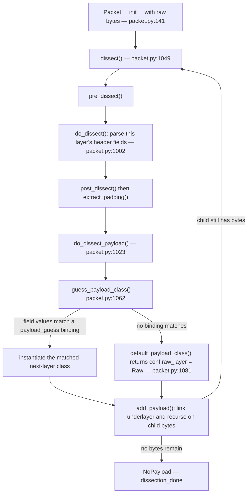

# How Scapy Dissects Raw Bytes into a Layered Packet Hierarchy

*A runtime-evidenced walkthrough of Scapy's payload-guessing dissection engine, written for a developer onboarding into this checkout.*

This document answers **how Scapy turns a flat buffer of capture bytes into a nested, multi-layer packet object, and how it decides where one layer ends and the next begins** — the "something" that hands off from one layer to the next. Every behavioral claim is paired with the **exact command** that produced it and the **complete, unedited output** observed at runtime. Statements derived from *reading* code rather than *observing* output are explicitly labelled **(inferred from source)**. Calls made directly to public methods (rather than through the dissection entry point) purely for corroboration are labelled **(supplementary API-level evidence)**.

The five sub-questions answered:

- **OBJ-1 — Layer handoff:** how the engine passes Ethernet → IP → TCP → HTTP, demonstrated on a real HTTP request.
- **OBJ-2 — Graceful failure:** what happens to an unrecognized application payload (it does *not* crash).
- **OBJ-3 — Header trust vs. byte inspection:** does Scapy believe a header field that contradicts the actual bytes?
- **OBJ-4 — Tunnel recursion depth:** does dissection recurse into a GRE-encapsulated inner packet, or stop partway?
- **OBJ-5 — Per-level evidence:** `show()`, `summary()`, `.layers()`, and field values for every scenario.

**The short answer (OBJ-1):** the "something" is the pair of methods `Packet.do_dissect_payload()` -> `Packet.guess_payload_class()` in `scapy/packet.py`, driven by a per-class dispatch table called `payload_guess` that is populated declaratively by `bind_bottom_up()` / `bind_layers()` at module import. When no table entry matches, `default_payload_class()` returns `conf.raw_layer` (the `Raw` class) and dissection "gives up gracefully" with **no exception** — that is the answer to OBJ-2. *(This mechanism is read from the source and is therefore labelled **inferred from source**; it is spelled out step-by-step, pinned to `file:line`, in Section 2. The runtime **outcomes** that confirm it — the layer chains, summaries, field values, and the `Raw`/re-raise behavior — are **observed** in Sections 4-9.)*

---

## Section 1 — Environment and how everything below was run

All evidence in this document was produced against the Scapy source in this checkout, imported directly via `PYTHONPATH`. The exact interpreter and invocation are stated here so every version-dependent value below is reproducible.

**Command (interpreter version):**

```
$ python3 --version
Python 3.13.7
```

**How every scenario below is run (methodology).** Each observation script is written **under `/tmp/scapy_qa/` — outside the repository tree** — with a `cat > /tmp/scapy_qa/<name>.py <<'PY' ... PY` here-doc, then invoked by its `/tmp` path and removed at the end (the cleanup transcript is in Section 8). No script is ever created inside the repository, so the source tree stays byte-for-byte unchanged. The canonical invocation is:

```
PYTHONPATH="$(git rev-parse --show-toplevel)" python3 /tmp/scapy_qa/<name>.py 2>&1
```

Dissection is always triggered through the **canonical entry point** — instantiating a `Packet` subclass from bytes, e.g. `Ether(raw)` / `IP(raw)`. The trailing `2>&1` merges `stderr` into `stdout`, so every transcript below is the **complete, unedited** output of the command (including the import-time warning discussed next) with nothing paraphrased or elided.

**Command + complete output (Scapy version and the governing `conf` dissection defaults):**

```bash
$ mkdir -p /tmp/scapy_qa
$ cat > /tmp/scapy_qa/env.py <<'PY'
import sys
from scapy.all import *
import scapy
print("python:", sys.version.split()[0])
print("scapy.VERSION:", scapy.VERSION)
print("conf.raw_layer:", conf.raw_layer)
print("conf.padding_layer:", conf.padding_layer)
print("conf.padding:", conf.padding)
print("conf.debug_dissector:", conf.debug_dissector)
PY
$ PYTHONPATH="$(git rev-parse --show-toplevel)" python3 /tmp/scapy_qa/env.py 2>&1
```

**Complete, unedited output (stdout+stderr merged via `2>&1`):**

```
/tmp/blitzy/scapy/blitzy-d51044c1-9295-46b6-96ce-fde0e766cd98_8ab594/scapy/layers/ipsec.py:573: CryptographyDeprecationWarning: TripleDES has been moved to cryptography.hazmat.decrepit.ciphers.algorithms.TripleDES and will be removed from this module in 48.0.0.
  cipher=algorithms.TripleDES,
/tmp/blitzy/scapy/blitzy-d51044c1-9295-46b6-96ce-fde0e766cd98_8ab594/scapy/layers/ipsec.py:577: CryptographyDeprecationWarning: TripleDES has been moved to cryptography.hazmat.decrepit.ciphers.algorithms.TripleDES and will be removed from this module in 48.0.0.
  cipher=algorithms.TripleDES,
python: 3.13.7
scapy.VERSION: 2026.07.13
conf.raw_layer: <class 'scapy.packet.Raw'>
conf.padding_layer: <class 'scapy.packet.Padding'>
conf.padding: 1
conf.debug_dissector: False
```

These four `conf` values govern the fallback path exercised throughout this document. The printed values are **observed**; the declaration/binding locations that follow are **inferred from source** (read from the files, not observed at runtime):

- `conf.raw_layer` **observed** as `<class 'scapy.packet.Raw'>`. *(Inferred from source:* it is declared `raw_layer = None` at `scapy/config.py:766` and bound to the `Raw` class at import time by `conf.raw_layer = Raw` at `scapy/packet.py:1921`.*)*
- `conf.padding_layer` **observed** as `<class 'scapy.packet.Padding'>`. *(Inferred from source:* declared `padding_layer = None` at `scapy/config.py:768`; bound by `conf.padding_layer = Padding` at `scapy/packet.py:1922`.*)*
- `conf.padding` **observed** as `1`. *(Inferred from source:* declared `padding = 1` at `scapy/config.py:787`; this is why trailing bytes become a `Padding` layer — see Section 2.*)*
- `conf.debug_dissector` **observed** as `False`. *(Inferred from source:* declared `debug_dissector = False` at `scapy/config.py:817`; this binary flag is the sole gate on the dissection path that decides whether a failed child-layer construction is re-raised or silently wrapped in `Raw` — see Sections 6 and 9.*)*

**Import-time warning (benign, unrelated to dissection).** Every script below begins with `from scapy.all import *`, which imports the IPsec layer and emits **two** `CryptographyDeprecationWarning` lines on `stderr` at *import time*. Because output is captured with `2>&1`, those two lines appear at the **top of every transcript** in this document (they are the first two lines of the `env` output above). They originate from `scapy/layers/ipsec.py:573` and `:577` (a `cryptography` library deprecation) and have nothing to do with the dissection engine; they are shown verbatim as part of each complete transcript rather than paraphrased. *(Inferred from source:* the warning is triggered by `algorithms.TripleDES` references in `scapy/layers/ipsec.py`; it is emitted once per process at import and does not recur during dissection.*)*

**Version deviation (stated explicitly, R5).** Scapy's `pyproject.toml:17` declares `requires-python = ">=3.7, <4"` (with language classifiers for 3.7-3.10 at `pyproject.toml:31-34`), and its `tox` matrix's highest CPython environment is `py311` (`tox.ini:6-7`), so the highest *explicitly documented* supported interpreter is **Python 3.11**. This container provides **Python 3.13.7** only — a documented deviation. **Every scenario below was executed on Python 3.13.7 and confirmed stable across two identical runs** (the per-scenario stability blocks and the consolidated check in Section 8). This document reports **only what was observed on Python 3.13.7** and makes no cross-interpreter-version compatibility claim. *(Inferred from source:* the dissection path is a pure-Python table lookup in `scapy/packet.py` with no interpreter-minor-version branching, so the observed structures would be expected to hold on other CPython 3.x interpreters — but that was not exercised here and is not claimed as observed.*)*

---

## Section 2 — The recursive dissection lifecycle (the "something" that dispatches layers)

Dissection is triggered by the *canonical entry point*: instantiating a `Packet` subclass with raw bytes, e.g. `Ether(raw_bytes)`. Every scenario in this document uses exactly that entry point.

> **Observed vs. inferred (R10).** This section is a **code-grounded** walkthrough: each step below is quoted verbatim from the source and pinned to a `file:line`, and is therefore **inferred from source**. The *step ordering* (which method calls which) is read from the verbatim source shown here rather than traced by instrumenting each internal call. The *outcomes* of this pipeline — the resulting layer chains, summaries, field values, and the `Raw`/re-raise behavior — are **observed at runtime** in Sections 4-9 and are what actually answer the five questions.

The lifecycle, grounded in the source:

**1. Instantiation triggers dissection — `Packet.__init__`, `scapy/packet.py:141`.** When constructed with a non-empty `_pkt`, `__init__` calls `self.dissect(_pkt)` at `scapy/packet.py:176`, and — for the top, non-internal layer — finishes with `self.dissection_done(self)` (`dissection_done` is defined at `scapy/packet.py:344` and walks the finished chain).

**2. The per-layer pipeline — `Packet.dissect`, `scapy/packet.py:1049`.** The actual body:

```python
    def dissect(self, s):
        # type: (bytes) -> None
        s = self.pre_dissect(s)

        s = self.do_dissect(s)

        s = self.post_dissect(s)

        payl, pad = self.extract_padding(s)
        self.do_dissect_payload(payl)
        if pad and conf.padding:
            self.add_payload(conf.padding_layer(pad))
```

So each layer, in order: pre-processes the buffer (`pre_dissect`), consumes **its own header** (`do_dissect`), post-processes (`post_dissect`), splits any trailing padding from the true payload (`extract_padding`), and then hands the payload to `do_dissect_payload`. If bytes remain after the payload *and* `conf.padding` is truthy (it is `1`), the leftovers are appended as a `conf.padding_layer` (`Padding`) — `scapy/packet.py:1059-1060`.

**3. Consuming this layer's header — `Packet.do_dissect`, `scapy/packet.py:1002`.** It iterates `self.fields_desc` (`scapy/packet.py:1006`) and lets each field pull its own bytes off the front of the buffer via `f.getfield(self, s)` (`scapy/packet.py:1009`), returning whatever bytes are left:

```python
    def do_dissect(self, s):
        # type: (bytes) -> bytes
        _raw = s
        self.raw_packet_cache_fields = {}
        for f in self.fields_desc:
            if not s:
                break
            s, fval = f.getfield(self, s)
            # Skip unused ConditionalField
            if isinstance(f, ConditionalField) and fval is None:
                continue
            # We need to track fields with mutable values to discard
            # .raw_packet_cache when needed.
            if (f.islist or f.holds_packets or f.ismutable) and fval is not None:
                self.raw_packet_cache_fields[f.name] = \
                    self._raw_packet_cache_field_value(f, fval, copy=True)
            self.fields[f.name] = fval
        self.raw_packet_cache = _raw[:-len(s)] if s else _raw
        self.explicit = 1
        return s
```

(The loop header is `scapy/packet.py:1006-1008`; `break` is `:1008`; the per-field `getfield` call is `:1009`.)

**4. Choosing and building the next layer — `Packet.do_dissect_payload`, `scapy/packet.py:1023`.** This is the heart of the handoff:

```python
    def do_dissect_payload(self, s):
        # type: (bytes) -> None
        if s:
            cls = self.guess_payload_class(s)
            try:
                p = cls(s, _internal=1, _underlayer=self)
            except KeyboardInterrupt:
                raise
            except Exception:
                if conf.debug_dissector:
                    if issubtype(cls, Packet):
                        log_runtime.error("%s dissector failed", cls.__name__)
                    else:
                        log_runtime.error("%s.guess_payload_class() returned "
                                          "[%s]",
                                          self.__class__.__name__, repr(cls))
                    if cls is not None:
                        raise
                p = conf.raw_layer(s, _internal=1, _underlayer=self)
            self.add_payload(p)
```

- The next class is chosen by `guess_payload_class(s)` (`scapy/packet.py:1031`).
- It is instantiated as `cls(s, _internal=1, _underlayer=self)` (`scapy/packet.py:1033`) — **recursively re-entering the same lifecycle** on the remaining bytes.
- If that child construction throws, the `except Exception:` handler (`scapy/packet.py:1036`) branches on `conf.debug_dissector` (`scapy/packet.py:1037`). When it is **falsy** (the default) the whole block is skipped and control goes straight to `p = conf.raw_layer(s, ...)` (`scapy/packet.py:1046`) — the graceful `Raw` fallback. When it is **truthy**, the handler logs one of **two** messages: if the guessed class is a `Packet` subtype it logs `"%s dissector failed"` (`scapy/packet.py:1038-1039`), **otherwise** it logs `"%s.guess_payload_class() returned [%s]"` (`scapy/packet.py:1040-1043`); it then re-raises the original exception **only when `cls is not None`** (`scapy/packet.py:1044-1045`). The child (whether the guessed class or the `Raw` fallback) is linked with `add_payload(p)` (`scapy/packet.py:1047`).

**5. The guess itself — `Packet.guess_payload_class`, `scapy/packet.py:1062`.** The default mechanism is a table lookup over declared field values:

```python
    def guess_payload_class(self, payload):
        # type: (bytes) -> Type[Packet]
        """
        DEV: Guesses the next payload class from layer bonds.
        Can be overloaded to use a different mechanism.

        :param str payload: the layer's payload
        :return: the payload class
        """
        for t in self.aliastypes:
            for fval, cls in t.payload_guess:
                try:
                    if all(v == self.getfieldval(k)
                           for k, v in fval.items()):
                        return cls  # type: ignore
                except AttributeError:
                    pass
        return self.default_payload_class(payload)
```

It walks `self.aliastypes`, and for each candidate's `payload_guess` list it returns the **first** class whose *bound field values all equal this layer's current field values* (`scapy/packet.py:1074-1076`). Crucially, the comparison is `v == self.getfieldval(k)` — it reads **this layer's declared header fields**, not the downstream payload bytes. If nothing matches, it defers to `default_payload_class(payload)` (`scapy/packet.py:1079`).

**6. The graceful default — `Packet.default_payload_class`, `scapy/packet.py:1081`:**

```python
    def default_payload_class(self, payload):
        # type: (bytes) -> Type[Packet]
        """
        DEV: Returns the default payload class if nothing has been found by the
        guess_payload_class() method.

        :param str payload: the layer's payload
        :return: the default payload class define inside the configuration file
        """
        return conf.raw_layer
```

It simply returns `conf.raw_layer` (i.e. `Raw`) — `scapy/packet.py:1090`. This is the mechanism behind OBJ-2's "give up gracefully": an unmatched payload is not an error, it is a table miss that resolves to `Raw`.

**7. What populates the table — the binding API.** Each `Packet` subclass owns a class attribute `payload_guess = []` (`scapy/packet.py:104`). It is filled declaratively at import:

- `bind_bottom_up(lower, upper, **fval)` — `scapy/packet.py:1931` — registers the **dissection** direction by appending `(fval, upper)` to `lower.payload_guess` (`scapy/packet.py:1949-1950`). This is exactly the list `guess_payload_class` scans.
- `bind_top_down(lower, upper, **fval)` — `scapy/packet.py:1953` — registers the **build** direction by setting `upper._overload_fields[lower] = fval` (`scapy/packet.py:1970-1971`), i.e. which field values are stamped onto `lower` when you *assemble* `lower/upper`.
- `bind_layers(lower, upper, **fval)` — `scapy/packet.py:1975` — calls both of the above, wiring the pair in both directions.
- `split_layers(lower, upper, **fval)` — `scapy/packet.py:2040` — the inverse, removing entries from `payload_guess` (`scapy/packet.py:2017`).

**Vocabulary** (confirmed against this checkout's own tutorial `doc/scapy/build_dissect.rst` and Scapy's official "Adding new protocols" guide): the process is called **payload guessing**; the registered pairs are **layer bonds / bindings**; **bottom-up** binding governs *dissection* (raw bytes -> objects) while **top-down** binding governs *building* (objects -> raw bytes). The tutorial describes `do_dissect_payload()`/`guess_payload_class()` at `doc/scapy/build_dissect.rst:326-332`, the `bind_layers()` mechanism at `:391-405`, and states that "each layer has a field payload_guess" at `:465-491`.

### Lifecycle diagram



The terminator of the recursion is `NoPayload` (`scapy/packet.py:1696`), the sentinel payload every leaf layer carries; `Raw` is defined at `scapy/packet.py:1877` and `Padding(Raw)` at `scapy/packet.py:1906`.

---

## Section 3 — Generic table-driven dispatch vs. per-class overrides

> **Observed vs. inferred (R10).** Like Section 2, this section is a **code-grounded** explanation of *how* the dispatch alternatives are wired, and is therefore **inferred from source** (quoted verbatim, pinned to `file:line`). The runtime **outcomes** it explains are **observed** in Section 4 (HTTP's byte-inspecting override) and Section 6 (the generic header-trusting path).

The default handoff (Section 2, step 5) is **generic and table-driven**: `guess_payload_class` matches the *declared field values* of the current layer against the bound `(fval, class)` entries in `payload_guess`. Two layers relevant to this document override that default in different ways.

**Override style (a) — `dispatch_hook` chooses the class *up front*.** A `dispatch_hook` is a `@classmethod` consulted *before* a class is instantiated, letting a family pick a different subclass based on the raw bytes. The call site is Scapy's packet **metaclass** `Packet_metaclass.__call__` (`scapy/base_classes.py:379`): before constructing an instance it checks `if "dispatch_hook" in cls.__dict__:` (`scapy/base_classes.py:384`) and, when present, replaces the class via `cls = cls.dispatch_hook(*args, **kargs)` (`scapy/base_classes.py:386`) *before* `cls.__new__`/`__init__` run. If the hook itself raises, it falls back to `conf.raw_layer` unless `conf.debug_dissector` is set (`scapy/base_classes.py:387-391`). `Ether.dispatch_hook` (`scapy/layers/l2.py:266`, method body at `:267-273`) is one such hook:

```python
    @classmethod
    def dispatch_hook(cls, _pkt=None, *args, **kargs):
        # type: (Optional[bytes], *Any, **Any) -> Type[Packet]
        if _pkt and len(_pkt) >= 14:
            if struct.unpack("!H", _pkt[12:14])[0] <= 1500:
                return Dot3
        return cls
```

It reads bytes 12-13 (the EtherType/length field): a value <= 1500 means the frame is IEEE 802.3 length-encoded, so it returns `Dot3` (`scapy/layers/l2.py:275`) instead of `Ether`. Similarly `GRE.dispatch_hook` (`scapy/layers/l2.py:598`, body `:599-603`) returns the `GRE_PPTP` subclass (`scapy/layers/l2.py:614`) when the GRE protocol field is `0x880b`:

```python
    @classmethod
    def dispatch_hook(cls, _pkt=None, *args, **kargs):
        # type: (Optional[Any], *Any, **Any) -> Type[Packet]
        if _pkt and struct.unpack("!H", _pkt[2:4])[0] == 0x880b:
            return GRE_PPTP
        return cls
```

**Override style (b) — `guess_payload_class` inspects the *payload bytes*.** `HTTP.guess_payload_class` (`scapy/layers/http.py:637`) overrides the default and actually reads the payload to distinguish a request from a response:

```python
    def guess_payload_class(self, payload):
        """Decides if the payload is an HTTP Request or Response, or
        something else.
        """
        try:
            prog = re.compile(
                br"^(?:OPTIONS|GET|HEAD|POST|PUT|DELETE|TRACE|CONNECT) "
                br"(?:.+?) "
                br"HTTP/\d\.\d$"
            )
            crlfIndex = payload.index(b"\r\n")
            req = payload[:crlfIndex]
            result = prog.match(req)
            if result:
                return HTTPRequest
            else:
                prog = re.compile(br"^HTTP/\d\.\d \d\d\d .*$")
                result = prog.match(req)
                if result:
                    return HTTPResponse
        except ValueError:
            # Anything that isn't HTTP but on port 80
            pass
        return Raw
```

It matches the first line against a request-line regex -> `HTTPRequest` (`scapy/layers/http.py:651`), else a status-line regex -> `HTTPResponse` (`scapy/layers/http.py:656`), else falls back to `Raw` (`scapy/layers/http.py:660`).

**The key contrast** *(inferred from source; confirmed observationally in Sections 4 and 6):* the generic path trusts **declared field values** and never looks at the downstream bytes — this is precisely why Scapy "trusts the header" in OBJ-3. HTTP's override is the exception that *does* read the payload bytes — which is why OBJ-1 dissects to **both** an `HTTP` layer (reached by the generic TCP-port binding) **and** an `HTTPRequest` layer (chosen by HTTP's byte-inspecting override).

---

## Section 4 — OBJ-1: Layer handoff, worked on a real HTTP request

This is the user's requested demonstration — "something like an HTTP request" — using the stack `Ether / IP / TCP / HTTP / HTTPRequest`. The script builds the packet, serialises it to bytes, and re-dissects those bytes through the canonical entry point `Ether(raw)`.

**Create the observation script and run it** (`Ether`, `IP`, `TCP` come from `from scapy.all import *`; `HTTP`/`HTTPRequest` must be imported explicitly; `conf.color_theme = NoTheme()` only strips ANSI colour codes and does not affect dissection):

```bash
$ mkdir -p /tmp/scapy_qa
$ cat > /tmp/scapy_qa/obj1.py <<'PY'
import sys
from scapy.all import *
from scapy.layers.http import HTTP, HTTPRequest

conf.color_theme = NoTheme()  # deterministic, uncolored output for the document

print("=== BUILD (assembly) ===", flush=True)
pkt = Ether()/IP()/TCP(dport=80)/HTTP()/HTTPRequest(Method=b"GET", Path=b"/", Http_Version=b"HTTP/1.1")
raw = bytes(pkt)
print("raw hex =", raw.hex(), flush=True)

print("=== DISSECT (canonical entry point: Ether(raw)) ===", flush=True)
d = Ether(raw)
print(".layers() names =", [c.__name__ for c in d.layers()], flush=True)
print(".summary() =", d.summary(), flush=True)
print("Ether.type = 0x%04x" % d[Ether].type, flush=True)
print("IP.proto =", d[IP].proto, flush=True)
print("TCP.dport =", d[TCP].dport, flush=True)
print("TCP.sport =", d[TCP].sport, flush=True)
print("=== show() ===", flush=True)
d.show()
PY
$ PYTHONPATH="$(git rev-parse --show-toplevel)" python3 /tmp/scapy_qa/obj1.py 2>&1
```

**Complete, unedited output (stdout+stderr merged via `2>&1`):**

```
/tmp/blitzy/scapy/blitzy-d51044c1-9295-46b6-96ce-fde0e766cd98_8ab594/scapy/layers/ipsec.py:573: CryptographyDeprecationWarning: TripleDES has been moved to cryptography.hazmat.decrepit.ciphers.algorithms.TripleDES and will be removed from this module in 48.0.0.
  cipher=algorithms.TripleDES,
/tmp/blitzy/scapy/blitzy-d51044c1-9295-46b6-96ce-fde0e766cd98_8ab594/scapy/layers/ipsec.py:577: CryptographyDeprecationWarning: TripleDES has been moved to cryptography.hazmat.decrepit.ciphers.algorithms.TripleDES and will be removed from this module in 48.0.0.
  cipher=algorithms.TripleDES,
=== BUILD (assembly) ===
raw hex = ffffffffffff00000000000008004500003a0001000040067cbb7f0000017f00000100500050000000000000000050022000b28d0000474554202f20485454502f312e310d0a0d0a
=== DISSECT (canonical entry point: Ether(raw)) ===
.layers() names = ['Ether', 'IP', 'TCP', 'HTTP', 'HTTPRequest']
.summary() = Ether / IP / TCP / HTTP / 'GET' '/' 'HTTP/1.1'
Ether.type = 0x0800
IP.proto = 6
TCP.dport = 80
TCP.sport = 80
=== show() ===
###[ Ethernet ]### 
  dst       = ff:ff:ff:ff:ff:ff
  src       = 00:00:00:00:00:00
  type      = IPv4
###[ IP ]### 
     version   = 4
     ihl       = 5
     tos       = 0x0
     len       = 58
     id        = 1
     flags     = 
     frag      = 0
     ttl       = 64
     proto     = tcp
     chksum    = 0x7cbb
     src       = 127.0.0.1
     dst       = 127.0.0.1
     \options   \
###[ TCP ]### 
        sport     = http
        dport     = http
        seq       = 0
        ack       = 0
        dataofs   = 5
        reserved  = 0
        flags     = S
        window    = 8192
        chksum    = 0xb28d
        urgptr    = 0
        options   = []
###[ HTTP 1 ]### 
###[ HTTP Request ]### 
           Method    = 'GET'
           Path      = '/'
           Http_Version= 'HTTP/1.1'
           A_IM      = None
           Accept    = None
           Accept_Charset= None
           Accept_Datetime= None
           Accept_Encoding= None
           Accept_Language= None
           Access_Control_Request_Headers= None
           Access_Control_Request_Method= None
           Authorization= None
           Cache_Control= None
           Connection= None
           Content_Length= None
           Content_MD5= None
           Content_Type= None
           Cookie    = None
           DNT       = None
           Date      = None
           Expect    = None
           Forwarded = None
           From      = None
           Front_End_Https= None
           HTTP2_Settings= None
           Host      = None
           If_Match  = None
           If_Modified_Since= None
           If_None_Match= None
           If_Range  = None
           If_Unmodified_Since= None
           Keep_Alive= None
           Max_Forwards= None
           Origin    = None
           Permanent = None
           Pragma    = None
           Proxy_Authorization= None
           Proxy_Connection= None
           Range     = None
           Referer   = None
           Save_Data = None
           TE        = None
           Upgrade   = None
           Upgrade_Insecure_Requests= None
           User_Agent= None
           Via       = None
           Warning   = None
           X_ATT_DeviceId= None
           X_Correlation_ID= None
           X_Csrf_Token= None
           X_Forwarded_For= None
           X_Forwarded_Host= None
           X_Forwarded_Proto= None
           X_Http_Method_Override= None
           X_Request_ID= None
           X_Requested_With= None
           X_UIDH    = None
           X_Wap_Profile= None
           Unknown_Headers= None
```

**Two-run stability (R2).** Re-run the identical command twice and compare byte-for-byte (safe: outputs go to `/tmp`, not the repo):

```bash
$ for i in 1 2; do PYTHONPATH="$(git rev-parse --show-toplevel)" python3 /tmp/scapy_qa/obj1.py > /tmp/scapy_qa/obj1.run$i.out 2>&1; done
$ sha256sum /tmp/scapy_qa/obj1.run1.out /tmp/scapy_qa/obj1.run2.out
$ diff -q /tmp/scapy_qa/obj1.run1.out /tmp/scapy_qa/obj1.run2.out && echo IDENTICAL
```

**Result (observed):**

```
4db9c7b5318b061be0c15a7190ab807ac65373ca4b60924fc1533432cfaa3671  /tmp/scapy_qa/obj1.run1.out
4db9c7b5318b061be0c15a7190ab807ac65373ca4b60924fc1533432cfaa3671  /tmp/scapy_qa/obj1.run2.out
IDENTICAL
```

**The handoff, layer by layer** *(the deciding field **values** are observed above; the mapping of each value to the binding that selects the next class is **inferred from source** — the `bind_*` declarations cited below):*

| Handoff | Deciding field (observed) | Binding — inferred from source (file:line) |
|---------|---------------------------|---------------------|
| `Ether` -> `IP` | `Ether.type = 0x0800` | `bind_layers(Ether, IP, type=2048)` — `scapy/layers/inet.py:1101` (2048 = 0x0800) |
| `IP` -> `TCP` | `IP.proto = 6` | `bind_layers(IP, TCP, frag=0, proto=6)` — `scapy/layers/inet.py:1113` |
| `TCP` -> `HTTP` | `TCP.dport = 80` (and `sport = 80`) | `bind_bottom_up(TCP, HTTP, sport=80)` / `dport=80` — `scapy/layers/http.py:748-749` (also `bind_layers(TCP, HTTP, sport=80, dport=80)` at `:750`) |
| `HTTP` -> `HTTPRequest` | payload begins `GET / HTTP/1.1\r\n` | `HTTP.guess_payload_class` byte-inspecting override — `scapy/layers/http.py:637` (request-line branch `:651`) |

The first three transitions are the **generic, header-trusting** path; the fourth is HTTP's **byte-inspecting override** (Section 3). The `show()` tree in the output makes the nesting explicit: `###[ Ethernet ]###` (`type = IPv4`) -> `###[ IP ]###` (`proto = tcp`) -> `###[ TCP ]###` (`sport/dport = http`) -> `###[ HTTP 1 ]###` -> `###[ HTTP Request ]###` with `Method='GET'`, `Path='/'`, `Http_Version='HTTP/1.1'`.

**On the build-time advisory (reported as observed).** The AAP anticipated that a build-time advisory `An HTTPResponse/HTTPRequest should always be below an HTTP` *might* print while *constructing* the packet. In this environment (Python 3.13.7, scapy 2026.07.13) that advisory did **not** appear — the complete transcript above contains only the two import-time TripleDES lines besides the intended `stdout`. *(Inferred from source:* such an advisory concerns *assembly*, not *dissection*, and would not affect the dissected structure regardless.*)*

---

## Section 5 — OBJ-2: Graceful failure on an unrecognized payload (the `Raw` fallback)

Here the TCP segment carries custom application bytes on port **9999**, which is bound to no upper layer. The question is what dissection does with bytes it does not recognise.

**Create the observation script and run it:**

```bash
$ mkdir -p /tmp/scapy_qa
$ cat > /tmp/scapy_qa/obj2.py <<'PY'
from scapy.all import *
conf.color_theme = NoTheme()

print("=== BUILD (assembly) ===", flush=True)
raw = bytes(Ether()/IP()/TCP(dport=9999)/Raw(b"CUSTOMDATA123"))
print("raw hex =", raw.hex(), flush=True)

print("=== DISSECT (canonical entry point: Ether(raw)) ===", flush=True)
d = Ether(raw)
print(".layers() names =", [c.__name__ for c in d.layers()], flush=True)
print(".summary() =", d.summary(), flush=True)
print("TCP.dport =", d[TCP].dport, flush=True)
print("Raw in packet? =", d.haslayer(Raw), flush=True)
print("Raw.load =", d[Raw].load, flush=True)
print("=== show() ===", flush=True)
d.show()

print("=== SUPPLEMENTARY API-level evidence (public methods on the dissected TCP layer) ===", flush=True)
tcp = d[TCP]
print("tcp.guess_payload_class(b'CUSTOMDATA123') =", tcp.guess_payload_class(b"CUSTOMDATA123"), flush=True)
print("tcp.default_payload_class(b'CUSTOMDATA123') =", tcp.default_payload_class(b"CUSTOMDATA123"), flush=True)
PY
$ PYTHONPATH="$(git rev-parse --show-toplevel)" python3 /tmp/scapy_qa/obj2.py 2>&1
```

**Complete, unedited output (stdout+stderr merged via `2>&1`):**

```
/tmp/blitzy/scapy/blitzy-d51044c1-9295-46b6-96ce-fde0e766cd98_8ab594/scapy/layers/ipsec.py:573: CryptographyDeprecationWarning: TripleDES has been moved to cryptography.hazmat.decrepit.ciphers.algorithms.TripleDES and will be removed from this module in 48.0.0.
  cipher=algorithms.TripleDES,
/tmp/blitzy/scapy/blitzy-d51044c1-9295-46b6-96ce-fde0e766cd98_8ab594/scapy/layers/ipsec.py:577: CryptographyDeprecationWarning: TripleDES has been moved to cryptography.hazmat.decrepit.ciphers.algorithms.TripleDES and will be removed from this module in 48.0.0.
  cipher=algorithms.TripleDES,
=== BUILD (assembly) ===
raw hex = ffffffffffff0000000000000800450000350001000040067cc07f0000017f0000010014270f00000000000000005002200088040000435553544f4d44415441313233
=== DISSECT (canonical entry point: Ether(raw)) ===
.layers() names = ['Ether', 'IP', 'TCP', 'Raw']
.summary() = Ether / IP / TCP 127.0.0.1:ftp_data > 127.0.0.1:9999 S / Raw
TCP.dport = 9999
Raw in packet? = True
Raw.load = b'CUSTOMDATA123'
=== show() ===
###[ Ethernet ]### 
  dst       = ff:ff:ff:ff:ff:ff
  src       = 00:00:00:00:00:00
  type      = IPv4
###[ IP ]### 
     version   = 4
     ihl       = 5
     tos       = 0x0
     len       = 53
     id        = 1
     flags     = 
     frag      = 0
     ttl       = 64
     proto     = tcp
     chksum    = 0x7cc0
     src       = 127.0.0.1
     dst       = 127.0.0.1
     \options   \
###[ TCP ]### 
        sport     = ftp_data
        dport     = 9999
        seq       = 0
        ack       = 0
        dataofs   = 5
        reserved  = 0
        flags     = S
        window    = 8192
        chksum    = 0x8804
        urgptr    = 0
        options   = []
###[ Raw ]### 
           load      = 'CUSTOMDATA123'

=== SUPPLEMENTARY API-level evidence (public methods on the dissected TCP layer) ===
tcp.guess_payload_class(b'CUSTOMDATA123') = <class 'scapy.packet.Raw'>
tcp.default_payload_class(b'CUSTOMDATA123') = <class 'scapy.packet.Raw'>
```

**Two-run stability (R2).** Re-run the identical command twice and compare byte-for-byte (safe: outputs go to `/tmp`, not the repo):

```bash
$ for i in 1 2; do PYTHONPATH="$(git rev-parse --show-toplevel)" python3 /tmp/scapy_qa/obj2.py > /tmp/scapy_qa/obj2.run$i.out 2>&1; done
$ sha256sum /tmp/scapy_qa/obj2.run1.out /tmp/scapy_qa/obj2.run2.out
$ diff -q /tmp/scapy_qa/obj2.run1.out /tmp/scapy_qa/obj2.run2.out && echo IDENTICAL
```

**Result (observed):**

```
52757e94e5a04c908f53ddd0778aab7372eba20c80536f2ab34a17d2a96a140e  /tmp/scapy_qa/obj2.run1.out
52757e94e5a04c908f53ddd0778aab7372eba20c80536f2ab34a17d2a96a140e  /tmp/scapy_qa/obj2.run2.out
IDENTICAL
```

**What this proves (observed).** Dissection did **not** raise; it produced a well-formed packet whose fourth layer is `Raw`. The observed layer list `['Ether', 'IP', 'TCP', 'Raw']`, the summary ending in `/ Raw`, and `Raw.load = b'CUSTOMDATA123'` together show the 13 unrecognised bytes were wrapped, not dropped or errored.

**Before/after (R7).** *Before:* after `TCP`'s header is consumed, 13 bytes `b'CUSTOMDATA123'` remain as an undissected buffer handed to `do_dissect_payload`. *After:* those exact 13 bytes live inside `Raw.load` (`b'CUSTOMDATA123'`), reachable as `d[Raw].load` (both endpoints observed in the transcript above). *(The intermediate "undissected buffer" state is **inferred from source** — it is the `s` argument to `do_dissect_payload` at `scapy/packet.py:1023-1031` — not separately printed.)*

**Why it is the no-binding path, not error handling** *(inferred from source, corroborated by the supplementary API calls above):* port 9999 matches no entry in `TCP.payload_guess` (the HTTP bindings are for 80/8080 only — `scapy/layers/http.py:748-753`), so `guess_payload_class` finds no match and defers to `default_payload_class`, which returns `conf.raw_layer` = `Raw` (`scapy/packet.py:1079-1090`). The **supplementary API-level evidence** (labelled as such because these two calls invoke the public methods directly on the already-dissected `TCP` layer rather than driving them through `Ether(raw)`) confirms the decision in isolation and is **observed**: `tcp.guess_payload_class(b"CUSTOMDATA123")` -> `<class 'scapy.packet.Raw'>` and `tcp.default_payload_class(b"CUSTOMDATA123")` -> `<class 'scapy.packet.Raw'>`. This is a table miss resolving to the default, **not** a caught exception: the `Raw` construction succeeded (observed — `Raw.load` holds all 13 bytes and no exception was raised), so the `except Exception:` fallback in `do_dissect_payload` (`scapy/packet.py:1036-1046`) was not the path taken here. *(That `Raw` — which stores its input as an opaque `load` field — does not fail on arbitrary bytes is **inferred from source** from its definition at `scapy/packet.py:1877`; the table-miss route via `default_payload_class` is separately confirmed by the supplementary API calls above.)*

---


## Section 6 — OBJ-3: Header trust vs. byte inspection

The question: given an Ethernet frame whose `type` field claims **IPv6 (0x86dd)** but whose body is actually **IPv4**, does Scapy notice the contradiction, or does it trust the header? This section presents a body-independent proof plus three cases, all through the canonical entry point `Ether(raw)`.

The combined script exercises Case 0 (body-independent proof), Case B (long body), Case A (short body, default `conf.debug_dissector`), and Case C (short body, `conf.debug_dissector = True`) in a single process; isolated re-runs of Case A and Case C follow, each with its own command, for unambiguous per-case `stderr` attribution.

**Create the combined observation script and run it:**

```bash
$ mkdir -p /tmp/scapy_qa
$ cat > /tmp/scapy_qa/obj3_clean.py <<'PY'
from scapy.all import *
conf.color_theme = NoTheme()

print("########## CASE 0: body-independent proof (SUPPLEMENTARY API-level evidence) ##########", flush=True)
e = Ether(type=0x86dd)
print("e.guess_payload_class(b'') =", e.guess_payload_class(b""), flush=True)

print("", flush=True)
print("########## CASE B: type=0x86dd (claims IPv6) over a >=40-byte IPv4 body ##########", flush=True)
rawB = bytes(Ether(dst="ff:ff:ff:ff:ff:ff", src="00:00:00:00:00:00", type=0x86dd)) + bytes(IP(src="1.2.3.4", dst="5.6.7.8")/TCP())
print("rawB hex =", rawB.hex(), flush=True)
dB = Ether(rawB)
print(".layers() names =", [c.__name__ for c in dB.layers()], flush=True)
print(".summary() =", dB.summary(), flush=True)
print("Ether.type = 0x%04x" % dB[Ether].type, flush=True)
print("IPv6.version =", dB[IPv6].version, flush=True)
print("--- show() ---", flush=True)
dB.show()

print("", flush=True)
print("########## CASE A: type=0x86dd (claims IPv6) over a SHORT 20-byte IPv4 body; default conf.debug_dissector ##########", flush=True)
rawA = bytes(Ether(dst="ff:ff:ff:ff:ff:ff", src="00:00:00:00:00:00", type=0x86dd)) + bytes(IP(src="1.2.3.4", dst="5.6.7.8"))
print("conf.debug_dissector =", conf.debug_dissector, flush=True)
print("rawA hex =", rawA.hex(), flush=True)
dA = Ether(rawA)
print(".layers() names =", [c.__name__ for c in dA.layers()], flush=True)
print(".summary() =", dA.summary(), flush=True)
print("Raw.load =", dA[Raw].load, flush=True)
print("--- show() ---", flush=True)
dA.show()

print("", flush=True)
print("########## CASE C: SAME short body WITH conf.debug_dissector = True ##########", flush=True)
conf.debug_dissector = True
print("conf.debug_dissector =", conf.debug_dissector, flush=True)
try:
    dC = Ether(rawA)
    print("NO exception; .layers() =", [c.__name__ for c in dC.layers()], flush=True)
except Exception as ex:
    print("RAISED:", type(ex).__module__ + "." + type(ex).__name__, "-", str(ex), flush=True)
finally:
    conf.debug_dissector = False
    print("conf.debug_dissector reset =", conf.debug_dissector, flush=True)
PY
$ PYTHONPATH="$(git rev-parse --show-toplevel)" python3 /tmp/scapy_qa/obj3_clean.py 2>&1
```

**Complete, unedited output (stdout+stderr merged via `2>&1`):**

```
/tmp/blitzy/scapy/blitzy-d51044c1-9295-46b6-96ce-fde0e766cd98_8ab594/scapy/layers/ipsec.py:573: CryptographyDeprecationWarning: TripleDES has been moved to cryptography.hazmat.decrepit.ciphers.algorithms.TripleDES and will be removed from this module in 48.0.0.
  cipher=algorithms.TripleDES,
/tmp/blitzy/scapy/blitzy-d51044c1-9295-46b6-96ce-fde0e766cd98_8ab594/scapy/layers/ipsec.py:577: CryptographyDeprecationWarning: TripleDES has been moved to cryptography.hazmat.decrepit.ciphers.algorithms.TripleDES and will be removed from this module in 48.0.0.
  cipher=algorithms.TripleDES,
########## CASE 0: body-independent proof (SUPPLEMENTARY API-level evidence) ##########
e.guess_payload_class(b'') = <class 'scapy.layers.inet6.IPv6'>

########## CASE B: type=0x86dd (claims IPv6) over a >=40-byte IPv4 body ##########
rawB hex = ffffffffffff00000000000086dd450000280001000040066abc0102030405060708001400500000000000000000500220007f6b0000
.layers() names = ['Ether', 'IPv6']
.summary() = Ether / 4006:6abc:102:304:506:708:14:50 > ::5002:2000:7f6b:0 (0)
Ether.type = 0x86dd
IPv6.version = 4
--- show() ---
###[ Ethernet ]### 
  dst       = ff:ff:ff:ff:ff:ff
  src       = 00:00:00:00:00:00
  type      = IPv6
###[ IPv6 ]### 
     version   = 4
     tc        = 80
     fl        = 40
     plen      = 1
     nh        = Hop-by-Hop Option Header
     hlim      = 0
     src       = 4006:6abc:102:304:506:708:14:50
     dst       = ::5002:2000:7f6b:0


########## CASE A: type=0x86dd (claims IPv6) over a SHORT 20-byte IPv4 body; default conf.debug_dissector ##########
conf.debug_dissector = False
rawA hex = ffffffffffff00000000000086dd450000140001000040006ad60102030405060708
.layers() names = ['Ether', 'Raw']
.summary() = 00:00:00:00:00:00 > ff:ff:ff:ff:ff:ff (IPv6) / Raw
Raw.load = b'E\x00\x00\x14\x00\x01\x00\x00@\x00j\xd6\x01\x02\x03\x04\x05\x06\x07\x08'
--- show() ---
###[ Ethernet ]### 
  dst       = ff:ff:ff:ff:ff:ff
  src       = 00:00:00:00:00:00
  type      = IPv6
###[ Raw ]### 
     load      = 'E\x00\x00\x14\x00\x01\x00\x00@\x00j\\xd6\x01\x02\x03\x04\x05\x06\x07\x08'


########## CASE C: SAME short body WITH conf.debug_dissector = True ##########
conf.debug_dissector = True
ERROR: IPv6 dissector failed
RAISED: struct.error - unpack requires a buffer of 16 bytes
conf.debug_dissector reset = False
```

**Two-run stability (R2).** Re-run the identical command twice and compare byte-for-byte (safe: outputs go to `/tmp`, not the repo):

```bash
$ for i in 1 2; do PYTHONPATH="$(git rev-parse --show-toplevel)" python3 /tmp/scapy_qa/obj3_clean.py > /tmp/scapy_qa/obj3_clean.run$i.out 2>&1; done
$ sha256sum /tmp/scapy_qa/obj3_clean.run1.out /tmp/scapy_qa/obj3_clean.run2.out
$ diff -q /tmp/scapy_qa/obj3_clean.run1.out /tmp/scapy_qa/obj3_clean.run2.out && echo IDENTICAL
```

**Result (observed):**

```
74c1884f449f155959cdfcb3debfaf88b4dba0ccfdffe45c53543a06fa8a1caa  /tmp/scapy_qa/obj3_clean.run1.out
74c1884f449f155959cdfcb3debfaf88b4dba0ccfdffe45c53543a06fa8a1caa  /tmp/scapy_qa/obj3_clean.run2.out
IDENTICAL
```

Note how, in the merged transcript, the single `ERROR: IPv6 dissector failed` line appears **inside the Case C block** — printed after `conf.debug_dissector = True` and immediately before `RAISED: struct.error ...` — never under Case A. That inline ordering is itself the attribution evidence.

### Case 0 — body-independent proof (supplementary API-level evidence)

`e.guess_payload_class(b'') = <class 'scapy.layers.inet6.IPv6'>` (observed above). Calling the public `guess_payload_class` on an `Ether` whose only meaningful field is `type=0x86dd`, with an **empty** payload, shows the decision is a pure function of the declared field, independent of any bytes. *(Labelled **supplementary API-level evidence** because `guess_payload_class` is invoked directly rather than via `Ether(raw)`. Keyed on `bind_layers(Ether, IPv6, type=0x86dd)` — `scapy/layers/inet6.py:4083` — inferred from source.)*

### Case B — the headline answer: **Scapy trusts the header (YES)**

With a >=40-byte body, `.layers()` is `['Ether', 'IPv6']` and, most tellingly, **`IPv6.version = 4`** (both observed above). Scapy read `Ether.type = 0x86dd`, trusted it, instantiated `IPv6`, and then reinterpreted the *IPv4* bytes through the *IPv6* header layout — yielding a nonsensical `version = 4` (an IPv6 header should have `version = 6`), a `nh = Hop-by-Hop Option Header`, and the garbage addresses `4006:6abc:102:304:506:708:14:50 > ::5002:2000:7f6b:0`. **This directly answers OBJ-3: Scapy follows the header field; it does not notice the contradiction at the guessing step.** *(Inferred from source:* it never compares the declared EtherType against the actual body, because `guess_payload_class` matches only declared field values — Section 2, step 5.*)*

### Case A — the nuance: header-trust at the guess step, `Raw` at the instantiate step

With a *short* 20-byte body, `.layers()` is `['Ether', 'Raw']` (observed above). *(Inferred from source:* the guess is still `IPv6` — header trust is unchanged, as Case 0 proved the guess is body-independent — but constructing `IPv6` from only 20 bytes fails because IPv6's fixed header needs 40, so under the default `conf.debug_dissector = False`, `do_dissect_payload` swallows that failure and wraps the bytes in `conf.raw_layer` = `Raw` at `scapy/packet.py:1046`.)* The raw IPv4 bytes therefore end up in `Raw.load = b'E\x00\x00\x14\x00\x01\x00\x00@\x00j\xd6\x01\x02\x03\x04\x05\x06\x07\x08'` (observed). This is the same graceful-fallback machinery as OBJ-2, but reached via a *caught exception* rather than a *table miss*.

> **Correction of a prior claim (reported as observed, per R10/R12).** The AAP stated that Case A logs a benign `ERROR: IPv6 dissector failed` under the default settings. **That is not what happens.** The single `ERROR: IPv6 dissector failed` line seen in the combined transcript above belongs to **Case C** (where `conf.debug_dissector = True`), *not* Case A. The isolated Case A run below is silent. *(Inferred from source:* the only `"%s dissector failed"` log statement in the tree is `scapy/packet.py:1039`, which sits **inside** the `if conf.debug_dissector:` block at `scapy/packet.py:1037`, so it cannot fire while the flag is `False`.)*

**Definitive attribution — Case A run in isolation** (explicit MACs, default `conf.debug_dissector`, no other case in the process):

```bash
$ mkdir -p /tmp/scapy_qa
$ cat > /tmp/scapy_qa/obj3_caseA.py <<'PY'
from scapy.all import *
conf.color_theme = NoTheme()
assert conf.debug_dissector == False, "expected default False"
rawA = bytes(Ether(dst="ff:ff:ff:ff:ff:ff", src="00:00:00:00:00:00", type=0x86dd)) + bytes(IP(src="1.2.3.4", dst="5.6.7.8"))
dA = Ether(rawA)
print("conf.debug_dissector =", conf.debug_dissector, flush=True)
print(".layers() names =", [c.__name__ for c in dA.layers()], flush=True)
print(".summary() =", dA.summary(), flush=True)
print("Raw.load =", dA[Raw].load, flush=True)
PY
$ PYTHONPATH="$(git rev-parse --show-toplevel)" python3 /tmp/scapy_qa/obj3_caseA.py 2>&1
```

**Complete, unedited output (stdout+stderr merged via `2>&1`)** — note there is **no** `dissector failed` line; the fallback is entirely silent aside from the two import-time warnings:

```
/tmp/blitzy/scapy/blitzy-d51044c1-9295-46b6-96ce-fde0e766cd98_8ab594/scapy/layers/ipsec.py:573: CryptographyDeprecationWarning: TripleDES has been moved to cryptography.hazmat.decrepit.ciphers.algorithms.TripleDES and will be removed from this module in 48.0.0.
  cipher=algorithms.TripleDES,
/tmp/blitzy/scapy/blitzy-d51044c1-9295-46b6-96ce-fde0e766cd98_8ab594/scapy/layers/ipsec.py:577: CryptographyDeprecationWarning: TripleDES has been moved to cryptography.hazmat.decrepit.ciphers.algorithms.TripleDES and will be removed from this module in 48.0.0.
  cipher=algorithms.TripleDES,
conf.debug_dissector = False
.layers() names = ['Ether', 'Raw']
.summary() = 00:00:00:00:00:00 > ff:ff:ff:ff:ff:ff (IPv6) / Raw
Raw.load = b'E\x00\x00\x14\x00\x01\x00\x00@\x00j\xd6\x01\x02\x03\x04\x05\x06\x07\x08'
```

**Two-run stability (R2).** Re-run the identical command twice and compare byte-for-byte (safe: outputs go to `/tmp`, not the repo):

```bash
$ for i in 1 2; do PYTHONPATH="$(git rev-parse --show-toplevel)" python3 /tmp/scapy_qa/obj3_caseA.py > /tmp/scapy_qa/obj3_caseA.run$i.out 2>&1; done
$ sha256sum /tmp/scapy_qa/obj3_caseA.run1.out /tmp/scapy_qa/obj3_caseA.run2.out
$ diff -q /tmp/scapy_qa/obj3_caseA.run1.out /tmp/scapy_qa/obj3_caseA.run2.out && echo IDENTICAL
```

**Result (observed):**

```
3cc3b842acf8307320e197589836d34bdeb9e3fb21703fce83b6556b5b3d6ba1  /tmp/scapy_qa/obj3_caseA.run1.out
3cc3b842acf8307320e197589836d34bdeb9e3fb21703fce83b6556b5b3d6ba1  /tmp/scapy_qa/obj3_caseA.run2.out
IDENTICAL
```

### Case C — the `conf.debug_dissector = True` demonstration

With the flag flipped on and the *same* short body, dissection no longer falls back to `Raw`; it **re-raises** the underlying failure. Run in isolation for unambiguous `stderr` attribution (the script prints the restored `conf.debug_dissector` value in its `finally` block so the reset is visible):

```bash
$ mkdir -p /tmp/scapy_qa
$ cat > /tmp/scapy_qa/obj3_caseC.py <<'PY'
from scapy.all import *
conf.color_theme = NoTheme()
rawA = bytes(Ether(dst="ff:ff:ff:ff:ff:ff", src="00:00:00:00:00:00", type=0x86dd)) + bytes(IP(src="1.2.3.4", dst="5.6.7.8"))
conf.debug_dissector = True
print("conf.debug_dissector =", conf.debug_dissector, flush=True)
try:
    dC = Ether(rawA)
    print("NO exception; layers =", [c.__name__ for c in dC.layers()], flush=True)
except Exception as ex:
    print("RAISED:", type(ex).__module__ + "." + type(ex).__name__, "-", str(ex), flush=True)
finally:
    conf.debug_dissector = False
    print("conf.debug_dissector reset =", conf.debug_dissector, flush=True)
PY
$ PYTHONPATH="$(git rev-parse --show-toplevel)" python3 /tmp/scapy_qa/obj3_caseC.py 2>&1
```

**Complete, unedited output (stdout+stderr merged via `2>&1`)** — the `ERROR: IPv6 dissector failed` line appears **here** (and only here), and the final line confirms the flag was reset to `False`:

```
/tmp/blitzy/scapy/blitzy-d51044c1-9295-46b6-96ce-fde0e766cd98_8ab594/scapy/layers/ipsec.py:573: CryptographyDeprecationWarning: TripleDES has been moved to cryptography.hazmat.decrepit.ciphers.algorithms.TripleDES and will be removed from this module in 48.0.0.
  cipher=algorithms.TripleDES,
/tmp/blitzy/scapy/blitzy-d51044c1-9295-46b6-96ce-fde0e766cd98_8ab594/scapy/layers/ipsec.py:577: CryptographyDeprecationWarning: TripleDES has been moved to cryptography.hazmat.decrepit.ciphers.algorithms.TripleDES and will be removed from this module in 48.0.0.
  cipher=algorithms.TripleDES,
conf.debug_dissector = True
ERROR: IPv6 dissector failed
RAISED: struct.error - unpack requires a buffer of 16 bytes
conf.debug_dissector reset = False
```

**Two-run stability (R2).** Re-run the identical command twice and compare byte-for-byte (safe: outputs go to `/tmp`, not the repo):

```bash
$ for i in 1 2; do PYTHONPATH="$(git rev-parse --show-toplevel)" python3 /tmp/scapy_qa/obj3_caseC.py > /tmp/scapy_qa/obj3_caseC.run$i.out 2>&1; done
$ sha256sum /tmp/scapy_qa/obj3_caseC.run1.out /tmp/scapy_qa/obj3_caseC.run2.out
$ diff -q /tmp/scapy_qa/obj3_caseC.run1.out /tmp/scapy_qa/obj3_caseC.run2.out && echo IDENTICAL
```

**Result (observed):**

```
881087652c939dbbaabd3372f0e103c1ed3b88d42c52a4de974888bbb053c94a  /tmp/scapy_qa/obj3_caseC.run1.out
881087652c939dbbaabd3372f0e103c1ed3b88d42c52a4de974888bbb053c94a  /tmp/scapy_qa/obj3_caseC.run2.out
IDENTICAL
```

This is the live demonstration of the binary gate at `scapy/packet.py:1037` (elaborated in Section 9). *(Inferred from source:* here the guessed class `cls` is `IPv6`, which **is** a `Packet` subtype, so the truthy flag takes the `issubtype(cls, Packet)` branch and logs `"%s dissector failed"` with `cls.__name__` = `IPv6` — `scapy/packet.py:1038-1039` — and then, because `cls is not None`, re-raises the `struct.error` — `scapy/packet.py:1044-1045`. The default `False` takes neither branch. The generic handler also has a second logging branch for the case where `cls` is not a `Packet` subtype — see Sections 2 and 9 — which this IPv6 scenario does not exercise.)*

### OBJ-3 conclusion

At the **guess step**, Scapy trusts the declared `Ether.type` field and does **not** inspect the payload bytes (Case 0 and Case B, observed). Whether that trusted guess survives depends on whether the guessed class can parse the bytes available: a sufficient body is parsed into a (semantically wrong) `IPv6` layer with `version = 4` (Case B), while an insufficient body makes the `IPv6` constructor fail and dissection falls back to `Raw` under the default flag (Case A) or re-raises when `conf.debug_dissector` is on (Case C).

---

## Section 7 — OBJ-4: Tunnel recursion depth (`IP / GRE / IP / TCP`)

The question: for GRE traffic carrying another IP packet, does parsing recurse all the way down to the inner transport layer, or stop partway? The packet is an outer IP whose payload is GRE, whose payload is an inner IP, whose payload is TCP to port 80. Dissection is triggered through the canonical entry point `IP(raw)`.

**Create the observation script and run it:**

```bash
$ mkdir -p /tmp/scapy_qa
$ cat > /tmp/scapy_qa/obj4.py <<'PY'
from scapy.all import *
conf.color_theme = NoTheme()

print("=== BUILD (assembly) ===", flush=True)
raw = bytes(IP(src="10.0.0.1", dst="10.0.0.2")/GRE(proto=0x0800)/IP(src="10.0.0.1", dst="10.0.0.2")/TCP(dport=80))
print("raw hex =", raw.hex(), flush=True)

print("=== DISSECT (canonical entry point: IP(raw)) ===", flush=True)
d = IP(raw)
print(".layers() names =", [c.__name__ for c in d.layers()], flush=True)
print(".summary() =", d.summary(), flush=True)
print("outer IP.proto =", d[IP].proto, flush=True)
print("inner IP.proto (d[GRE].payload.proto) =", d[GRE].payload.proto, flush=True)
print("innermost TCP.dport =", d[TCP].dport, flush=True)
print("=== show() ===", flush=True)
d.show()
PY
$ PYTHONPATH="$(git rev-parse --show-toplevel)" python3 /tmp/scapy_qa/obj4.py 2>&1
```

**Complete, unedited output (stdout+stderr merged via `2>&1`):**

```
/tmp/blitzy/scapy/blitzy-d51044c1-9295-46b6-96ce-fde0e766cd98_8ab594/scapy/layers/ipsec.py:573: CryptographyDeprecationWarning: TripleDES has been moved to cryptography.hazmat.decrepit.ciphers.algorithms.TripleDES and will be removed from this module in 48.0.0.
  cipher=algorithms.TripleDES,
/tmp/blitzy/scapy/blitzy-d51044c1-9295-46b6-96ce-fde0e766cd98_8ab594/scapy/layers/ipsec.py:577: CryptographyDeprecationWarning: TripleDES has been moved to cryptography.hazmat.decrepit.ciphers.algorithms.TripleDES and will be removed from this module in 48.0.0.
  cipher=algorithms.TripleDES,
=== BUILD (assembly) ===
raw hex = 4500004000010000402f668c0a0000010a000002000008004500002800010000400666cd0a0000010a000002001400500000000000000000500220007b7c0000
=== DISSECT (canonical entry point: IP(raw)) ===
.layers() names = ['IP', 'GRE', 'IP', 'TCP']
.summary() = IP / GRE / IP / TCP 10.0.0.1:ftp_data > 10.0.0.2:http S
outer IP.proto = 47
inner IP.proto (d[GRE].payload.proto) = 6
innermost TCP.dport = 80
=== show() ===
###[ IP ]### 
  version   = 4
  ihl       = 5
  tos       = 0x0
  len       = 64
  id        = 1
  flags     = 
  frag      = 0
  ttl       = 64
  proto     = gre
  chksum    = 0x668c
  src       = 10.0.0.1
  dst       = 10.0.0.2
  \options   \
###[ GRE ]### 
     chksum_present= 0
     routing_present= 0
     key_present= 0
     seqnum_present= 0
     strict_route_source= 0
     recursion_control= 0
     flags     = 0
     version   = 0
     proto     = IPv4
###[ IP ]### 
        version   = 4
        ihl       = 5
        tos       = 0x0
        len       = 40
        id        = 1
        flags     = 
        frag      = 0
        ttl       = 64
        proto     = tcp
        chksum    = 0x66cd
        src       = 10.0.0.1
        dst       = 10.0.0.2
        \options   \
###[ TCP ]### 
           sport     = ftp_data
           dport     = http
           seq       = 0
           ack       = 0
           dataofs   = 5
           reserved  = 0
           flags     = S
           window    = 8192
           chksum    = 0x7b7c
           urgptr    = 0
           options   = ''
```

**Two-run stability (R2).** Re-run the identical command twice and compare byte-for-byte (safe: outputs go to `/tmp`, not the repo):

```bash
$ for i in 1 2; do PYTHONPATH="$(git rev-parse --show-toplevel)" python3 /tmp/scapy_qa/obj4.py > /tmp/scapy_qa/obj4.run$i.out 2>&1; done
$ sha256sum /tmp/scapy_qa/obj4.run1.out /tmp/scapy_qa/obj4.run2.out
$ diff -q /tmp/scapy_qa/obj4.run1.out /tmp/scapy_qa/obj4.run2.out && echo IDENTICAL
```

**Result (observed):**

```
858b7b26ba01dceee5d371a2ffebc9949d9e37b7820ebfaf5e919b175a5b4804  /tmp/scapy_qa/obj4.run1.out
858b7b26ba01dceee5d371a2ffebc9949d9e37b7820ebfaf5e919b175a5b4804  /tmp/scapy_qa/obj4.run2.out
IDENTICAL
```

**Answer: parsing recurses ALL the way down to the inner TCP (observed).** The layer list `['IP', 'GRE', 'IP', 'TCP']` and the summary `IP / GRE / IP / TCP 10.0.0.1:ftp_data > 10.0.0.2:http S` both show four levels. The observed dispatch fields confirm each hop; the binding that selects each next class is **inferred from source**:

| Handoff | Deciding field (observed) | Binding — inferred from source (file:line) |
|---------|---------------------------|---------------------|
| outer `IP` -> `GRE` | `IP.proto = 47` | `bind_layers(IP, GRE, frag=0, proto=47)` — `scapy/layers/inet.py:1115` |
| `GRE` -> inner `IP` | `GRE.proto = 0x0800` (shown as `IPv4`) | `bind_layers(GRE, IP, proto=2048)` — `scapy/layers/inet.py:1103` (2048 = 0x0800) |
| inner `IP` -> `TCP` | inner `IP.proto = 6` | `bind_layers(IP, TCP, frag=0, proto=6)` — `scapy/layers/inet.py:1113` |

*(Inferred from source:* because both the `IP -> GRE` and `GRE -> IP` bonds exist and `do_dissect_payload` re-enters the lifecycle on each child's bytes — Section 2, step 4 — the recursion does not stop at the tunnel boundary; it continues into the encapsulated packet until the innermost `TCP` header is fully parsed.)* The observed evidence for reaching the bottom is `innermost TCP.dport = 80` (shown as `http`) and the nested `show()` tree — outer `###[ IP ]###` (`proto = gre`) -> `###[ GRE ]###` (`proto = IPv4`) -> inner `###[ IP ]###` (`proto = tcp`) -> `###[ TCP ]###` (`dport = http`).

---


## Section 8 — OBJ-5: Per-level evidence, consolidated

For every scenario this document reports the four introspection surfaces Scapy provides — `.layers()` (the class chain), `.summary()` (one-line view), field-by-field values, and the full `.show()` tree. The complete, verbatim `.show()` tree for each scenario is printed in its own section (linked below); the decisive per-level values are consolidated here. All values are **observed** through the canonical entry point except the two supplementary/exception rows, which are labelled.

| Scenario | `.layers()` (observed) | `.summary()` (observed) | Decisive per-level fields (observed) | Full `show()` |
|----------|------------------------|-------------------------|--------------------------------------|---------------|
| **OBJ-1** Ether/IP/TCP/HTTP | `['Ether', 'IP', 'TCP', 'HTTP', 'HTTPRequest']` | `Ether / IP / TCP / HTTP / 'GET' '/' 'HTTP/1.1'` | `Ether.type=0x0800`; `IP.proto=6`; `TCP.dport=80`, `TCP.sport=80`; `HTTPRequest.Method='GET'`, `Path='/'`, `Http_Version='HTTP/1.1'` | Section 4 |
| **OBJ-2** Ether/IP/TCP:9999/custom | `['Ether', 'IP', 'TCP', 'Raw']` | `Ether / IP / TCP 127.0.0.1:ftp_data > 127.0.0.1:9999 S / Raw` | `TCP.dport=9999`; `Raw.load=b'CUSTOMDATA123'` | Section 5 |
| **OBJ-3 Case 0** body-independent guess *(supplementary API-level evidence)* | n/a — no packet is dissected | n/a | `e.guess_payload_class(b'') = <class 'scapy.layers.inet6.IPv6'>` (guess is a pure function of declared `Ether.type=0x86dd`) | Section 6 |
| **OBJ-3 Case B** EtherType lie, long body | `['Ether', 'IPv6']` | `Ether / 4006:6abc:102:304:506:708:14:50 > ::5002:2000:7f6b:0 (0)` | `Ether.type=0x86dd`; `IPv6.version=4` (contradiction preserved); `nh=Hop-by-Hop Option Header` | Section 6 |
| **OBJ-3 Case A** EtherType lie, short body, default flag | `['Ether', 'Raw']` | `00:00:00:00:00:00 > ff:ff:ff:ff:ff:ff (IPv6) / Raw` | `Ether.type=0x86dd`; `Raw.load=b'E\x00\x00\x14\x00\x01\x00\x00@\x00j\xd6\x01\x02\x03\x04\x05\x06\x07\x08'` | Section 6 |
| **OBJ-3 Case C** EtherType lie, short body, `conf.debug_dissector=True` | n/a — construction raises, no packet object | n/a — no `show()` tree exists | pre-state `conf.debug_dissector=True`; raises `struct.error - unpack requires a buffer of 16 bytes`; log `ERROR: IPv6 dissector failed`; restored `conf.debug_dissector=False` | Section 6 |
| **OBJ-4** IP/GRE/IP/TCP | `['IP', 'GRE', 'IP', 'TCP']` | `IP / GRE / IP / TCP 10.0.0.1:ftp_data > 10.0.0.2:http S` | outer `IP.proto=47`; `GRE.proto=0x0800`; inner `IP.proto=6`; `TCP.dport=80` | Section 7 |

Case 0 and Case C carry no `.layers()`/`.summary()`/`show()` surfaces by nature: Case 0 is a direct public-method call on an un-dissected `Ether` (no child packet is built), and Case C's child construction **raises** under `conf.debug_dissector=True`, so no packet object — and therefore no `show()` tree — is produced; its evidentiary record is the exact exception, the log line, and the restored flag state (all shown verbatim in Section 6). Every other row's `.layers()` value was confirmed **stable across two identical runs** (per-scenario stability blocks in Sections 4-7, plus the consolidated check below). The full `show()` trees, `.summary()` strings, and `.layers()` lists were captured verbatim from the canonical entry point (`Ether(raw)` / `IP(raw)`) and appear unedited in Sections 4-7.

### Consolidated two-run stability (R2)

Every scenario script was run twice and the two outputs compared. The command and its complete, unedited result:

```bash
$ for s in env obj1 obj2 obj3_clean obj3_caseA obj3_caseC obj4; do
    for i in 1 2; do
      PYTHONPATH="$(git rev-parse --show-toplevel)" python3 /tmp/scapy_qa/$s.py > /tmp/scapy_qa/$s.run$i.out 2>&1
    done
    if diff -q /tmp/scapy_qa/$s.run1.out /tmp/scapy_qa/$s.run2.out >/dev/null; then
      printf '%-14s run1==run2 IDENTICAL  sha256=%s\n' "$s" "$(sha256sum < /tmp/scapy_qa/$s.run1.out | cut -d' ' -f1)"
    else
      printf '%-14s DIFFERS\n' "$s"
    fi
  done
```

**Result (observed):**

```
env            run1==run2 IDENTICAL  sha256=797a4185f34feb44303124eb02a7f33b1fac6193a32a3b5571df8e6cf7ece4b3
obj1           run1==run2 IDENTICAL  sha256=4db9c7b5318b061be0c15a7190ab807ac65373ca4b60924fc1533432cfaa3671
obj2           run1==run2 IDENTICAL  sha256=52757e94e5a04c908f53ddd0778aab7372eba20c80536f2ab34a17d2a96a140e
obj3_clean     run1==run2 IDENTICAL  sha256=74c1884f449f155959cdfcb3debfaf88b4dba0ccfdffe45c53543a06fa8a1caa
obj3_caseA     run1==run2 IDENTICAL  sha256=3cc3b842acf8307320e197589836d34bdeb9e3fb21703fce83b6556b5b3d6ba1
obj3_caseC     run1==run2 IDENTICAL  sha256=881087652c939dbbaabd3372f0e103c1ed3b88d42c52a4de974888bbb053c94a
obj4           run1==run2 IDENTICAL  sha256=858b7b26ba01dceee5d371a2ffebc9949d9e37b7820ebfaf5e919b175a5b4804
```

Every scenario is byte-for-byte identical across the two runs (matching sha256, `diff` clean).

### Reproducibility and cleanup (read-only proof)

Every observation script in this document was created **under `/tmp/scapy_qa/`**, i.e. **outside the repository working tree**, and removed after evidence capture. The repository source is therefore never touched. Verification:

```bash
$ ls -1 /tmp/scapy_qa/*.py
/tmp/scapy_qa/env.py
/tmp/scapy_qa/obj1.py
/tmp/scapy_qa/obj2.py
/tmp/scapy_qa/obj3_caseA.py
/tmp/scapy_qa/obj3_caseC.py
/tmp/scapy_qa/obj3_clean.py
/tmp/scapy_qa/obj4.py
$ rm -rf /tmp/scapy_qa
$ find "$(git rev-parse --show-toplevel)" \( -name 'obj*.py' -o -name 'env.py' \) -not -path '*/.venv/*'
$ git -C "$(git rev-parse --show-toplevel)" status --porcelain
 M blitzy/documentation/scapy_0925ada48540.md
```

The `find` prints nothing — no observation script was ever written inside the repository tree (the `.venv` editable install is excluded and is not part of this task's changes). The only working-tree entry reported by `git status --porcelain` is this deliverable, `blitzy/documentation/scapy_0925ada48540.md`; once it is committed, `git status --porcelain` is empty. All `scapy/**`, `doc/**`, `pyproject.toml`, `tox.ini`, tests, and configuration files remain byte-for-byte unchanged.

---

## Section 9 — Note on `conf.debug_dissector` (observed binary behavior; discrepancy flagged)

**Observed behavior — the dissection gate is binary.** The layer-handoff path branches on `conf.debug_dissector` at exactly one place, `scapy/packet.py:1037`, written as a plain truthiness test:

```python
            except Exception:
                if conf.debug_dissector:
                    if issubtype(cls, Packet):
                        log_runtime.error("%s dissector failed", cls.__name__)
                    else:
                        log_runtime.error("%s.guess_payload_class() returned "
                                          "[%s]",
                                          self.__class__.__name__, repr(cls))
                    if cls is not None:
                        raise
                p = conf.raw_layer(s, _internal=1, _underlayer=self)
```

*(Inferred from source:* any truthy value takes the same block. Inside it, the handler logs **one of two** messages: `"%s dissector failed"` when the guessed class is a `Packet` subtype (`scapy/packet.py:1038-1039`), **otherwise** `"%s.guess_payload_class() returned [%s]"` (`scapy/packet.py:1040-1043`); it then re-raises the original exception **only when `cls is not None`** (`scapy/packet.py:1044-1045`). The default `conf.debug_dissector = False` (`scapy/config.py:817`) skips the whole block and silently wraps the leftover bytes in `conf.raw_layer` (`scapy/packet.py:1046`). There is no `>= 1` / `>= 2` gradation on this path.)* The **live, observed demonstration** is OBJ-3: Case A (`False`) -> silent `Raw` fallback, no log; Case C (`True`) -> `ERROR: IPv6 dissector failed` logged and the `struct.error` re-raised (both transcripts in Section 6). In Case C the guessed class is `IPv6` (a `Packet` subtype), so the `issubtype(cls, Packet)` branch fires; the alternate `"guess_payload_class() returned [...]"` branch governs the case where the guess is not a `Packet` subtype and is not exercised by these scenarios.

**Discrepancy flagged (R10/R12).** A *graded* comparison `if conf.debug_dissector >= 2:` does exist in the codebase — but **only** at `scapy/sendrecv.py:1245`, on the sniff/receive path, which is **not** the dissection/layer-handoff path exercised by instantiating a layer from bytes. Therefore any description of `conf.debug_dissector` as a three-level (0/1/2) control does **not** apply to dissection: the dissection engine treats it as a binary flag. This document reports the **observed** binary behavior and explicitly flags the divergence rather than conforming to the graded description.

**Also flagged (reported as observed, per R10/R12):** because the `"%s dissector failed"` log at `scapy/packet.py:1039` is inside this `if conf.debug_dissector:` block, it is emitted **only** when the flag is truthy. The AAP's claim that OBJ-3 Case A logs that error under the default `False` is therefore incorrect; Section 6 demonstrates (with the isolated Case A transcript) that Case A is silent and the error belongs to Case C.

---

## Section 10 — References / citations

All `scapy/**` line numbers were verified against the Scapy source in this checkout, `scapy.VERSION = 2026.07.13`. That source tree is the **unchanged baseline commit `0925ada485406684174d6f068dbd85c4154657b3` (`0925ada4`)** — the parent of the commit that introduces this document; `0925ada4` is the Scapy source (unmodified by this read-only task), and this Markdown file is the sole addition committed on top of it (the doc-introducing commit was `73f9edd1d37ebc5767c29991e8127760178e8c05` at the time of acceptance review). Every behavioral claim above is anchored to one of the following.

**`scapy/packet.py` — the dissection engine and binding API:**

- `payload_guess = []` — the per-class dispatch table — `:104`
- `Packet.__init__` — the dissection entry point — `:141`; `self.dissect(_pkt)` triggered for non-empty `_pkt` — `:176`; `dissection_done` — `:344`
- `do_dissect` — consumes this layer's header fields — `:1002` (field loop `:1006-1008`; per-field `getfield` at `:1009`)
- `do_dissect_payload` — chooses and builds the next layer — `:1023` (`cls = self.guess_payload_class(s)` `:1031`; `p = cls(s, _internal=1, _underlayer=self)` `:1033`; `except Exception:` `:1036`; `if conf.debug_dissector:` `:1037`; `if issubtype(cls, Packet): log_runtime.error("%s dissector failed", ...)` `:1038-1039`; `else: log_runtime.error("%s.guess_payload_class() returned [%s]", ...)` `:1040-1043`; `if cls is not None: raise` `:1044-1045`; `p = conf.raw_layer(s, ...)` `:1046`; `self.add_payload(p)` `:1047`)
- `dissect` — the per-layer pipeline — `:1049` (padding-layer append `:1059-1060`)
- `guess_payload_class` — the default table lookup over declared field values — `:1062` (`for t in self.aliastypes` `:1071`; `for fval, cls in t.payload_guess` `:1072`; `all(v == self.getfieldval(k) ...)` -> `return cls` `:1074-1076`; `return self.default_payload_class(payload)` `:1079`)
- `default_payload_class` — returns `conf.raw_layer` — `:1081` (`return conf.raw_layer` `:1090`)
- `NoPayload` `:1696`; `Raw` `:1877`; `Padding(Raw)` `:1906`; `conf.raw_layer = Raw` `:1921`; `conf.padding_layer = Padding` `:1922`
- `bind_bottom_up` (dissection direction) — `:1931` (appends `(fval, upper)` to `lower.payload_guess` `:1949-1950`); `bind_top_down` (build direction) — `:1953` (`upper._overload_fields[lower] = fval` `:1970-1971`); `bind_layers` (both) — `:1975`; `split_layers` (inverse) — `:2040`

**`scapy/base_classes.py` — the metaclass call site that runs `dispatch_hook` up front:** `Packet_metaclass.__call__` — `:379`; `if "dispatch_hook" in cls.__dict__:` `:384`; `cls = cls.dispatch_hook(*args, **kargs)` `:386`; on hook exception the debug-gated fallback `if config.conf.debug_dissector: raise` / `cls = config.conf.raw_layer` — `:387-391`.

**`scapy/config.py` — dissection/fallback defaults:** `raw_layer = None` `:766`; `padding_layer = None` `:768`; `padding = 1` `:787`; `debug_dissector = False` `:817`.

**`scapy/sendrecv.py` — the *graded* comparison, off the dissection path:** `if conf.debug_dissector >= 2:` `:1245` (sniff/receive path only; does not govern layer handoff — see Section 9).

**`scapy/layers/l2.py` — Ethernet and GRE and their dispatch hooks:** `Ether` `:244` (`type` field `XShortEnumField("type", 0x9000, ETHER_TYPES)` `:248`); `Ether.dispatch_hook` selects `Dot3` for length-type frames `:266` (body `:267-273`); `Dot3` `:275`; `GRE` `:578`; `GRE.dispatch_hook` selects `GRE_PPTP` for proto `0x880b` `:598` (body `:599-603`); `GRE_PPTP(GRE)` `:614`.

**`scapy/layers/inet.py` — IPv4 family classes and bindings:** `IP` `:521` (`proto` field `ByteEnumField("proto", 0, IP_PROTOS)` `:532`); `TCP` `:753`; `UDP` `:834`; `ICMP` `:952`; `bind_layers(Ether, IP, type=2048)` `:1101`; `bind_layers(GRE, IP, proto=2048)` `:1103`; `bind_layers(IP, ICMP, frag=0, proto=1)` `:1112`; `bind_layers(IP, TCP, frag=0, proto=6)` `:1113`; `bind_layers(IP, UDP, frag=0, proto=17)` `:1114`; `bind_layers(IP, GRE, frag=0, proto=47)` `:1115`.

**`scapy/layers/inet6.py` — IPv6 bindings for the header-trust and tunnel scenarios:** `bind_layers(Ether, IPv6, type=0x86dd)` `:4083`; `bind_layers(GRE, IPv6, proto=0x86dd)` `:4085`.

**`scapy/layers/http.py` — HTTP override and TCP<->HTTP bindings:** `HTTP.guess_payload_class` byte-inspecting override `:637` (`return HTTPRequest` `:651`; `return HTTPResponse` `:656`; `return Raw` `:660`); `bind_bottom_up(TCP, HTTP, sport=80)` `:748`; `dport=80` `:749`; `bind_layers(TCP, HTTP, sport=80, dport=80)` `:750`; `sport=8080` `:752`; `dport=8080` `:753`.

**`pyproject.toml` — the Python contract:** `requires-python = ">=3.7, <4"` `:17`; language classifiers for Python 3.7-3.10 `:31-34` (used in Section 1 for the version-deviation note).

**`tox.ini` — the CI interpreter matrix:** the `envlist` whose highest CPython environment is `py311` `:6-7` (used in Section 1 to ground the "highest explicitly documented supported interpreter is Python 3.11" statement).

**`doc/scapy/build_dissect.rst` — the in-repo dissection tutorial (corroborating reference that ships with this checkout):** `self.do_dissect_payload(payl)` in the annotated `dissect()` walkthrough `:292`; the `do_dissect_payload()` / `guess_payload_class()` description `:326-332`; the `bind_layers()` mechanism, including `bind_layers(TCP, HTTP, sport=80)` / `dport=80`, `:391-405`; the `guess_payload_class()`-override approach `:411-446`; "each layer has a field payload_guess" `:465-491`.

**External corroboration (vocabulary only).** Scapy's official "Adding new protocols" guide (`https://scapy.readthedocs.io/en/latest/build_dissect.html`) and the `scapy.packet` API reference (`https://scapy.readthedocs.io/en/stable/api/scapy.packet.html`) confirm the terms *payload guessing*, *layer bonds / bindings*, and the bottom-up (dissection) vs. top-down (build) distinction. The in-repo `doc/scapy/build_dissect.rst` is preferred as the authoritative citation because it ships with this exact checkout.

---

### Coverage summary

- **OBJ-1** (layer handoff) — Section 4, with the full `Ether/IP/TCP/HTTP` handoff traced field-by-field to its bindings.
- **OBJ-2** (graceful `Raw` fallback) — Section 5, proving the no-binding path with no exception, plus supplementary API-level corroboration.
- **OBJ-3** (header trust) — Section 6, with the body-independent proof and Cases A/B/C, and the observed correction that Case A logs no error under the default flag.
- **OBJ-4** (GRE tunnel recursion) — Section 7, proving recursion reaches the innermost TCP.
- **OBJ-5** (per-level evidence) — Section 8 consolidates `.layers()`, `.summary()`, fields (including supplementary Case 0 and exception-only Case C), and points to the verbatim `.show()` trees in Sections 4-7.

Named mechanisms addressed: `Packet.__init__`, `dissect`, `do_dissect`, `do_dissect_payload`, `guess_payload_class`, `default_payload_class`, `payload_guess`, `bind_bottom_up` / `bind_top_down` / `bind_layers` / `split_layers`, `Packet_metaclass.__call__` (the `dispatch_hook` call site), `dispatch_hook` (Ether and GRE), `HTTP.guess_payload_class`, `Raw` / `Padding` / `NoPayload`, and the governing `conf` defaults (`raw_layer`, `padding_layer`, `padding`, `debug_dissector`).

Evidence discipline: every behavioral claim is paired with the exact command and its complete, unedited `2>&1` transcript; two-run stability is shown per scenario and consolidated in Section 8; code-derived statements are labelled **(inferred from source)** and direct public-method calls are labelled **(supplementary API-level evidence)**; all observation scripts lived under `/tmp` and were removed, leaving the repository unchanged.
