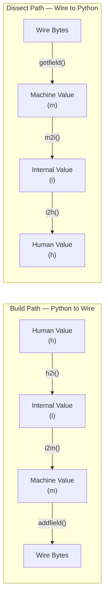
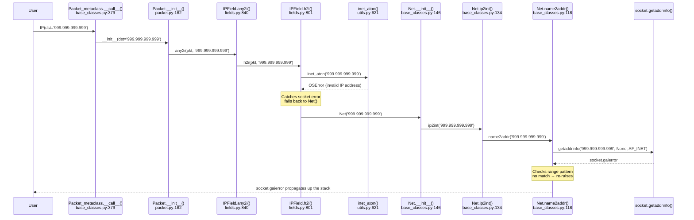
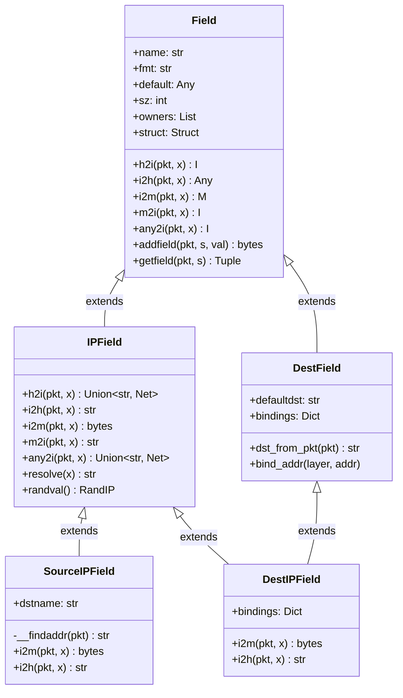

# Scapy IPv4 Field Representation and Encoding: A Technical Investigation

## Introduction

This document presents a technical investigation into how the Scapy packet-manipulation library represents and encodes IPv4 protocol fields at runtime. Scapy is a powerful Python-based network tool that provides complete control over packet construction, serialization, and dissection. At the heart of its IPv4 handling lies the `IPField` class—a specialized field type responsible for converting between human-readable IP address strings and their binary on-the-wire representation.

Four specific questions are investigated in this document:

1. **Serialization:** How do we construct a valid IPv4 packet with a destination address, a TTL value, and at least one flag, serialize it, and what is the total byte length and hexadecimal representation of the result?
2. **Python Type:** What Python type does the `dst` field expose when accessed on a constructed packet at runtime?
3. **Invalid Input:** What happens in practice when we provide a clearly invalid IPv4 destination address—at what point does an error appear and in what form?
4. **Field Class System:** What is the field class responsible for handling IPv4 addresses, how does it convert Python values into on-the-wire bytes, what validation does it perform, and how does it participate in Scapy's broader field type hierarchy?

**Methodology:** Every claim in this document is grounded in direct codebase inspection of the `scapy_0925ada48540` commit and verified through runtime experiments. Source citations reference specific file paths and line numbers. No assumptions are made—the code is treated as the authoritative source of truth.

**Environment:** All experiments were conducted using Python 3.12.3 with Scapy 2.7.0 installed as an editable package from the repository root.

---

## Section 1: Serializing a Valid IPv4 Packet

### 1.1 Packet Construction

We construct an IPv4 packet specifying a destination address, a TTL value, and the Don't Fragment (DF) flag:

```python
from scapy.all import *
pkt = IP(dst='192.168.1.1', ttl=128, flags='DF')
```

When this constructor call executes, each user-supplied field value passes through a validation and conversion pipeline before being stored internally. Specifically:

- **`dst='192.168.1.1'`** is processed by the `DestIPField` class (which inherits from `IPField`) via the `any2i()` → `h2i()` conversion chain at construction time. The field initialization loop in `Packet.__init__()` calls `self.get_field(fname).any2i(self, value)` for each user-provided field (Source: `scapy/packet.py:182-189`). The `any2i()` method at `scapy/fields.py:840-842` simply delegates to `h2i()`, which validates the address using `inet_aton()` (Source: `scapy/fields.py:801-812`). Since `'192.168.1.1'` is a valid dotted-decimal IPv4 address, `inet_aton()` succeeds and the string is stored as-is.

- **`ttl=128`** is stored directly as an integer by `ByteField`. No complex conversion is needed—the value is already in the correct internal format for a single-byte unsigned integer field.

- **`flags='DF'`** is processed by `FlagsField` (Source: `scapy/layers/inet.py:529`), which converts the human-readable string `"DF"` to the integer value `2` (bit 1 set). The three-bit flags field in the IPv4 header uses the bit ordering `["MF", "DF", "evil"]`, so `DF` corresponds to `0b010 = 2`.

- **Unspecified fields** (`version`, `ihl`, `tos`, `len`, `id`, `frag`, `proto`, `chksum`, `src`) receive their default values as declared in the `IP.fields_desc` list (Source: `scapy/layers/inet.py:524-537`). Notably, `version` defaults to `4`, `ihl` defaults to `None` (computed at serialization time), `id` defaults to `1`, `ttl` defaults to `64` (overridden here to `128`), and `chksum` defaults to `None` (computed at serialization time).

### 1.2 Serialized Output

Serializing the packet to its binary on-the-wire representation:

```python
raw_bytes = raw(pkt)
print(len(raw_bytes))   # 20
print(raw_bytes.hex())   # 450000140001400080002d930aec00c1c0a80101
```

Key observations:

- **Total length: 20 bytes** — this is the standard IPv4 header size with no options (IHL=5, meaning 5 × 4 = 20 bytes).
- **First 10 bytes (fixed):** `45 00 00 14 00 01 40 00 80 00` — these bytes are deterministic given the field values we specified and the defaults.
- **Bytes 10-11 (checksum):** `2d 93` — computed by `IP.post_build()` at serialization time. This value is **environment-dependent** because it incorporates the source IP address.
- **Bytes 12-15 (source IP):** `0a ec 00 c1` = `10.236.0.193` — auto-detected by `SourceIPField.__findaddr()` at serialization time via the system routing table (Source: `scapy/fields.py:862-877`). This value is **environment-dependent**.
- **Bytes 16-19 (destination IP):** `c0 a8 01 01` = `192.168.1.1` — the address we specified, converted to 4 binary bytes by `IPField.i2m()` → `inet_aton()` (Source: `scapy/fields.py:830-834`).

> **Note on environment dependence:** The source IP and checksum values will differ across systems. The source IP is auto-detected by querying the system routing table for the route to the destination `192.168.1.1` (via `conf.route.route(dst)`). The checksum is computed over all 20 header bytes including the source IP, so it changes whenever the source IP changes.

### 1.3 Byte-by-Byte IPv4 Header Breakdown

The following table dissects the 20-byte serialized IPv4 header:

| Offset | Field | Hex | Decimal / Description |
|--------|-------|-----|----------------------|
| 0 | Version (4 bits) + IHL (4 bits) | `45` | Version=4, IHL=5 (5×4=20 bytes header) |
| 1 | Type of Service (TOS) | `00` | 0 (default) |
| 2-3 | Total Length | `00 14` | 20 bytes (header only, no payload) |
| 4-5 | Identification | `00 01` | 1 (default value from `fields_desc`) |
| 6-7 | Flags (3 bits) + Fragment Offset (13 bits) | `40 00` | Flags=0b010 (DF=1), Fragment Offset=0 |
| 8 | Time to Live (TTL) | `80` | 128 (as specified) |
| 9 | Protocol | `00` | 0 (HOPOPT — default, no upper layer specified) |
| 10-11 | Header Checksum | varies | Computed by `post_build()` at serialization time |
| 12-15 | Source IP Address | varies | Auto-detected via `SourceIPField.__findaddr()` |
| 16-19 | Destination IP Address | `c0 a8 01 01` | 192.168.1.1 (as specified) |

**Detailed explanation of the flags byte (`40 00`):**

The 16-bit field at offset 6-7 combines the 3-bit flags and the 13-bit fragment offset. The flags are defined as `["MF", "DF", "evil"]` (Source: `scapy/layers/inet.py:529`). With only DF set:

- Bit 15 (evil/reserved): `0`
- Bit 14 (DF — Don't Fragment): `1`
- Bit 13 (MF — More Fragments): `0`
- Bits 12-0 (Fragment Offset): `0000000000000`

This gives the binary value `0100 0000 0000 0000` = `0x4000`, which serializes as `40 00` in network byte order.

### 1.4 Rationale: How post_build() Computes Length and Checksum

The `IP.post_build()` method (Source: `scapy/layers/inet.py:539-551`) is called after the initial field-by-field serialization performed by `self_build()`. It patches three fields that were left as `None` during construction:

```python
def post_build(self, p, pay):
    ihl = self.ihl
    p += b"\0" * ((-len(p)) % 4)  # pad IP options if needed
    if ihl is None:
        ihl = len(p) // 4
        p = chb(((self.version & 0xf) << 4) | ihl & 0x0f) + p[1:]
    if self.len is None:
        tmp_len = len(p) + len(pay)
        p = p[:2] + struct.pack("!H", tmp_len) + p[4:]
    if self.chksum is None:
        ck = checksum(p)
        p = p[:10] + chb(ck >> 8) + chb(ck & 0xff) + p[12:]
    return p + pay
```

The three patching steps are:

1. **IHL (Internet Header Length):** If `ihl` is `None` (the default), the method computes it as `len(p) // 4` — the header length in bytes divided by 4. For a standard 20-byte header, this yields `5`. It then patches byte 0, combining the version nibble (`4`) and IHL nibble (`5`) into `0x45` (Source: `scapy/layers/inet.py:542-544`).

2. **Total Length:** If `len` is `None` (the default), the method computes `len(p) + len(pay)` — the header length plus payload length. It patches bytes 2-3 with this value in network byte order (Source: `scapy/layers/inet.py:545-547`). For our packet with no payload, this is `20`.

3. **Header Checksum:** If `chksum` is `None` (the default), the method computes the one's complement checksum over all header bytes (with the checksum field temporarily zeroed) and patches bytes 10-11 (Source: `scapy/layers/inet.py:548-550`).

This deferred computation design is why `raw()` must be called to see the final serialized bytes—the checksum, total length, and IHL are not computed at construction time but rather at serialization time. This allows the user to add payloads or modify fields after construction without invalidating the checksum.

---

## Section 2: Python Type of the Destination Field

### 2.1 Runtime Observation

```python
pkt = IP(dst='192.168.1.1')
print(type(pkt.dst))  # <class 'str'>
print(pkt.dst)        # '192.168.1.1'
```

The Python type returned by accessing `pkt.dst` is **`str`** — the built-in Python string type from the `builtins` module. The value is the dotted-decimal string `'192.168.1.1'`, exactly as the user provided it.

### 2.2 Rationale: IPField.i2h() and Internal vs. Human Representation

To understand why `pkt.dst` returns a `str`, we need to trace the full conversion chain from construction to access:

**Step 1 — Construction (`IP(dst='192.168.1.1')`):**

When the user provides `dst='192.168.1.1'`, the field initialization loop in `Packet.__init__()` (Source: `scapy/packet.py:188-189`) calls `DestIPField.any2i(self, '192.168.1.1')`. The `any2i()` method (inherited from `IPField` at `scapy/fields.py:840-842`) simply delegates to `h2i()`:

```python
def any2i(self, pkt, x):
    return self.h2i(pkt, x)
```

The `h2i()` method (Source: `scapy/fields.py:801-812`) validates the input by calling `inet_aton(x)`. Since `'192.168.1.1'` is a valid dotted-decimal IPv4 address, `inet_aton()` succeeds (validating the address without storing the binary result), and `h2i()` returns the original string `x` unchanged:

```python
def h2i(self, pkt, x):
    if isinstance(x, bytes):
        x = plain_str(x)
    if isinstance(x, str):
        try:
            inet_aton(x)
        except socket.error:
            return Net(x)
    elif isinstance(x, list):
        return [self.h2i(pkt, n) for n in x]
    return x
```

The string `'192.168.1.1'` is stored in `self.fields['dst']` as the **internal representation**.

**Step 2 — Access (`pkt.dst`):**

When the user accesses `pkt.dst`, Scapy's `Packet.__getattr__()` retrieves the internal value and passes it through the field's `i2h()` method to convert from internal to human representation. The `IPField.i2h()` method (Source: `scapy/fields.py:814-816`) is:

```python
def i2h(self, pkt, x):
    return cast(str, x)
```

This simply casts the internal value to `str`. Since the internal value is already a `str` (set during the `h2i()` call at construction), the cast is essentially a no-op, and the same string `'192.168.1.1'` is returned.

**Summary of the chain:**

```
User provides '192.168.1.1' (str)
  → any2i() delegates to h2i()
    → h2i() validates with inet_aton(), returns same str
      → stored internally as str '192.168.1.1'
        → i2h() casts to str → user sees str '192.168.1.1'
```

The key insight is that for `IPField`, the internal representation (i) and human representation (h) are **the same type** — both are Python `str`. The conversion to binary only happens at serialization time when `i2m()` is called (which invokes `inet_aton()` to produce 4 bytes).

### 2.3 The i/m/h Field State Model

Scapy's field system is built around three distinct representations for every field value, documented in `doc/scapy/build_dissect.rst`:

- **`i` (internal):** The way Scapy manipulates the value in memory during packet construction and inspection.
- **`m` (machine):** The binary on-the-wire representation—"where the truth is," as the documentation puts it.
- **`h` (human):** How the value is displayed to the user.

The conversion between these states is handled by a set of methods on each `Field` subclass:



For `IPField` specifically, the three representations are:

| Representation | Type | Example Value | Description |
|---------------|------|---------------|-------------|
| **Human (h)** | `str` | `'192.168.1.1'` | Dotted-decimal string as the user provides/sees it |
| **Internal (i)** | `str` | `'192.168.1.1'` | Same as human — `IPField` stores IPs as strings internally |
| **Machine (m)** | `bytes` | `b'\xc0\xa8\x01\x01'` | 4-byte binary representation via `inet_aton()` |

This is a notable design choice: for `IPField`, the internal and human representations are identical (both `str`). Not all field types share this property—for example, `FlagsField` stores an integer internally but displays a human-readable flag string, and `MACField` stores a string internally but serializes to 6 raw bytes.

The authoritative reference for this three-state model is `doc/scapy/build_dissect.rst`, which explains the conversion methods and their role in the build/dissect lifecycle.

---

## Section 3: Invalid IPv4 Destination Behavior

### 3.1 Runtime Observation

```python
try:
    pkt = IP(dst='999.999.999.999')
except Exception as e:
    print(type(e))  # <class 'socket.gaierror'>
    print(e)        # [Errno -2] Name or service not known
```

**Key finding: The error occurs at construction time** — during `IP(dst='999.999.999.999')` — **not** at serialization time. The `IP` packet object is never fully created; the constructor raises the exception before completing. The `raw()` function is never reached.

Additional invalid input test cases confirm consistent behavior:

```python
# All of these raise socket.gaierror at construction time:
IP(dst='999.999.999.999')  # socket.gaierror: [Errno -2] Name or service not known
IP(dst='256.1.1.1')        # socket.gaierror: [Errno -2] Name or service not known
IP(dst='not_an_ip')        # socket.gaierror: [Errno -2] Name or service not known
IP(dst='')                 # socket.gaierror: [Errno -2] Name or service not known

# None is a special case — falls back to the default:
pkt = IP(dst=None)
print(pkt.dst)             # '127.0.0.1' (via DestIPField.dst_from_pkt)
```

The `socket.gaierror` (a subclass of `OSError`) is raised because Scapy's validation pipeline ultimately attempts DNS resolution on strings that fail `inet_aton()` validation, and `'999.999.999.999'` is neither a valid IP address nor a resolvable hostname.

### 3.2 Error Call Chain (with file:line citations)

The complete error propagation path, traced through the source code:

**1. `IP(dst='999.999.999.999')` — User invokes the IP constructor**

The `IP` class uses `Packet_metaclass` as its metaclass. Calling `IP(...)` invokes `Packet_metaclass.__call__()` (Source: `scapy/base_classes.py:379-399`), which creates a new instance via `cls.__new__()` and then calls `i.__init__(*args, **kargs)` at line 398.

**2. `Packet.__init__()` — Field initialization loop**

Inside `__init__()` (Source: `scapy/packet.py:141-205`), the method iterates through `fields_desc` and processes each user-supplied keyword argument. At lines 182-189:

```python
for field in self.fields_desc:
    fname = field.name
    try:
        value = fields.pop(fname)
    except KeyError:
        continue
    self.fields[fname] = value if isinstance(value, RawVal) else \
        self.get_field(fname).any2i(self, value)
```

When it reaches `fname='dst'` with `value='999.999.999.999'`, it calls `DestIPField.any2i(self, '999.999.999.999')`.

**3. `IPField.any2i()` — Delegates to `h2i()`**

`DestIPField` inherits `any2i()` from `IPField` (Source: `scapy/fields.py:840-842`):

```python
def any2i(self, pkt, x):
    return self.h2i(pkt, x)
```

**4. `IPField.h2i()` — Validation via `inet_aton`, fallback to `Net`**

The `h2i()` method (Source: `scapy/fields.py:801-812`) first attempts `inet_aton('999.999.999.999')` at line 807. The `inet_aton` wrapper (Source: `scapy/utils.py:621-632`) delegates to `socket.inet_aton()`, which raises `OSError: illegal IP address string passed to inet_aton` because `999.999.999.999` has octets exceeding the valid range (0-255).

The `except socket.error:` block at line 808 catches this `OSError` (since `socket.error` is an alias for `OSError` in Python 3 — they are the same class) and falls back to `return Net('999.999.999.999')` at line 809.

**5. `Net.__init__()` — Hostname resolution attempt**

The `Net` class constructor (Source: `scapy/base_classes.py:146-167`) parses the input string. Since `'999.999.999.999'` contains no `/` character, `mask` is set to `self.max_mask` (32) at line 155. It then calls `self.ip2int('999.999.999.999')` at line 160 to convert the string to an integer.

**6. `Net.ip2int()` — Calls `name2addr()`**

The `ip2int()` class method (Source: `scapy/base_classes.py:134-139`) calls `socket.inet_aton(cls.name2addr(addr))`:

```python
@classmethod
def ip2int(cls, addr):
    return cast(int, struct.unpack(
        "!I", socket.inet_aton(cls.name2addr(addr))
    )[0])
```

**7. `Net.name2addr()` — DNS resolution attempt fails**

The `name2addr()` class method (Source: `scapy/base_classes.py:118-132`) calls `socket.getaddrinfo('999.999.999.999', None, socket.AF_INET)` at line 125. This triggers the operating system's DNS resolver to look up `'999.999.999.999'` as a hostname. Since this is neither a valid IP address nor a resolvable hostname, the DNS lookup fails and **`socket.gaierror`** is raised.

The `except socket.error:` block at line 128 catches the error and checks whether the input matches a range pattern (e.g., `"10.0.0.1-10"`) at line 129. Since `'999.999.999.999'` does not match the range regex `(^|\\.)[0-9]+-[0-9]+($|\\.)`, the exception is re-raised at line 132.

**8. Exception propagates** up through `Net.ip2int()` → `Net.__init__()` → `IPField.h2i()` → `IPField.any2i()` → `Packet.__init__()` → `Packet_metaclass.__call__()` → back to the user.

The following sequence diagram illustrates the complete error propagation:



### 3.3 Why Serialization Is Never Reached

The error occurs in `Packet.__init__()` during the field initialization loop at lines 182-189 of `scapy/packet.py`. The `any2i()` method is called for every user-supplied field value **before** the packet object is fully constructed. Since the `dst` field's `any2i()` → `h2i()` → `Net()` chain raises `socket.gaierror`, the constructor never completes—`self.fields['dst']` is never assigned, and the `IP` object is never fully initialized.

Because the packet object does not exist, calling `raw()` on it is impossible. Serialization—which involves `self_build()` → field-by-field `addfield()` → `post_build()`—is never invoked. The error is a construction-time failure, not a serialization-time failure.

This is an important distinction: Scapy validates IP address inputs **eagerly** at construction time rather than **lazily** at serialization time. The `h2i()` method performs this early validation as part of the human-to-internal conversion.

### 3.4 Rationale: h2i() Validation via inet_aton + Net Fallback

The `IPField.h2i()` method (Source: `scapy/fields.py:801-812`) implements a deliberate two-stage validation strategy:

**Stage 1 — `inet_aton()` fast path:**

If the input string is a valid dotted-decimal IPv4 address (e.g., `'192.168.1.1'`), `inet_aton()` succeeds silently. The `h2i()` method does not store the binary result—it only uses `inet_aton()` as a validator. If validation passes, the original string is returned as-is. This is the fast path for the common case of valid IP address strings.

**Stage 2 — `Net()` fallback:**

If `inet_aton()` raises `socket.error` (the input is NOT a valid dotted-decimal IPv4 address), `h2i()` wraps the value in a `Net()` object (Source: `scapy/base_classes.py:112-167`). The `Net` class serves two purposes:

1. **CIDR notation handling:** Strings like `'192.168.1.0/24'` fail `inet_aton()` (because of the `/24` suffix) but are valid CIDR ranges that `Net` can parse and iterate over.
2. **Hostname resolution:** Strings like `'example.com'` fail `inet_aton()` but are valid hostnames that `Net.name2addr()` can resolve via `socket.getaddrinfo()`.

If the string is **neither** a valid IP, **nor** a valid CIDR range, **nor** a resolvable hostname, the `socket.gaierror` from `getaddrinfo()` propagates up as an unhandled exception.

This design is intentional—it allows Scapy to accept a rich variety of address specifications (dotted-decimal, CIDR ranges, hostnames) in any field that uses `IPField`, while rejecting truly invalid input at the earliest possible point.

---

## Section 4: The IPField Class and Field Type System

### 4.1 IPField Class Location and Signature

The `IPField` class is defined at `scapy/fields.py:796`:

```python
class IPField(Field[Union[str, Net], bytes]):
    def __init__(self, name, default):
        Field.__init__(self, name, default, "4s")
```

Key characteristics of this class definition:

- **Generic type parameters:** `I = Union[str, Net]` (internal representation) and `M = bytes` (machine representation). This tells us that internally, an IP field stores either a plain Python `str` or a `Net` object (for CIDR ranges/hostnames), and the wire representation is raw `bytes`.

- **Format string `"4s"`:** This specifies a 4-byte raw string for `struct` packing. The `Field.__init__()` method (Source: `scapy/fields.py:158-170`) prepends a `!` (network byte order / big-endian) prefix if no byte-order character is present, making the effective format `"!4s"`.

- **Size (`sz`):** Computed by `struct.calcsize("!4s")` = **4 bytes**, reflecting the fixed 4-byte length of an IPv4 address.

- **Inheritance:** `IPField` directly extends `Field`, the base class for all Scapy fields. Its MRO (Method Resolution Order) is: `IPField → Field → Generic → object`.

### 4.2 i2m(): Python-to-Wire Conversion

The `i2m()` method (Source: `scapy/fields.py:830-834`) converts the internal Python representation to the machine (wire) representation:

```python
def i2m(self, pkt, x):
    if x is None:
        return b'\x00\x00\x00\x00'
    return inet_aton(plain_str(x))
```

How it works:

1. **If the value is `None`:** Returns 4 zero bytes (`b'\x00\x00\x00\x00'`), representing the address `0.0.0.0`. This handles cases where no address has been set.

2. **Otherwise:** Calls `inet_aton(plain_str(x))` to convert the dotted-decimal string to its 4-byte binary representation. For example, `inet_aton('192.168.1.1')` returns `b'\xc0\xa8\x01\x01'`.

   - `plain_str()` (from `scapy/compat.py`) ensures the value is a Python 3 `str`, handling potential `bytes` input gracefully.
   - `inet_aton` is a wrapper defined at `scapy/utils.py:621-632`. On systems where Python's `socket.inet_aton('255.255.255.255')` works correctly (no bug 643005), `inet_aton` is simply an alias for `socket.inet_aton`. On systems affected by bug 643005 (where `inet_aton` incorrectly rejects the broadcast address), the wrapper provides a special case that returns `b'\xff\xff\xff\xff'` for `'255.255.255.255'`.

This method is invoked by `Field.addfield()` (Source: `scapy/fields.py:226-241`) during packet serialization:

```python
def addfield(self, pkt, s, val):
    try:
        return s + self.struct.pack(self.i2m(pkt, val))
    except struct.error as ex:
        raise ValueError(
            "Incorrect type of value for field %s:\n" % self.name +
            "struct.error('%s')\n" % ex +
            "To inject bytes into the field regardless of the type, " +
            "use RawVal. See help(RawVal)"
        )
```

The `addfield()` method calls `self.i2m(pkt, val)` to get the 4-byte binary, then packs it using `self.struct.pack()` (with format `"!4s"`), and appends the result to the accumulating raw packet bytes `s`.

### 4.3 h2i(): Validation via inet_aton and Net

The `h2i()` method (Source: `scapy/fields.py:801-812`) converts human input to internal representation, performing validation in the process:

```python
def h2i(self, pkt, x):
    if isinstance(x, bytes):
        x = plain_str(x)
    if isinstance(x, str):
        try:
            inet_aton(x)
        except socket.error:
            return Net(x)
    elif isinstance(x, list):
        return [self.h2i(pkt, n) for n in x]
    return x
```

The method handles multiple input types:

- **`bytes` input:** First converts to `str` via `plain_str()`, then proceeds with string validation.
- **`str` input:** Attempts `inet_aton(x)` as a validation check. If it succeeds, the original string `x` is returned unchanged (the binary result of `inet_aton` is discarded). If it fails with `socket.error`, the string is wrapped in `Net(x)` to handle CIDR notation or hostname resolution.
- **`list` input:** Recursively applies `h2i()` to each element, enabling multi-destination support (e.g., `IP(dst=['192.168.1.1', '10.0.0.1'])`).
- **Other types:** Returns the value as-is (e.g., a `Net` object passed directly).

The companion method `any2i()` (Source: `scapy/fields.py:840-842`) simply delegates to `h2i()`:

```python
def any2i(self, pkt, x):
    return self.h2i(pkt, x)
```

The reverse conversion `m2i()` (Source: `scapy/fields.py:836-838`) converts from machine (binary) back to internal (string) using `inet_ntoa`:

```python
def m2i(self, pkt, x):
    return inet_ntoa(x)
```

Where `inet_ntoa` is aliased to `socket.inet_ntoa` at `scapy/utils.py:634`.

### 4.4 Subclasses: SourceIPField and DestIPField

The `IPField` class has two specialized subclasses used specifically in the `IP` packet class definition.

#### SourceIPField

`SourceIPField` (Source: `scapy/fields.py:854-890`) inherits from `IPField` only:

```python
class SourceIPField(IPField):
    __slots__ = ["dstname"]

    def __init__(self, name, dstname):
        IPField.__init__(self, name, None)
        self.dstname = dstname
```

Key features:

- **`dstname` slot:** Stores the name of the destination field (typically `"dst"`) so the source IP can be auto-detected based on the route to the destination.

- **`__findaddr()` private method** (Source: `scapy/fields.py:862-877`): Looks up the system routing table via `conf.route.route(dst)` to auto-detect the appropriate source IP address for reaching the destination. This is why the source IP in our serialized packet was environment-dependent—it reflects the actual network interface that would be used to reach `192.168.1.1`.

- **Overridden `i2m()` and `i2h()`:** Both methods (lines 879-889) check if the value is `None` and, if so, call `__findaddr()` to auto-detect the source IP before delegating to the parent `IPField` implementation. This means the source IP is resolved lazily at serialization or display time, not at construction time.

#### DestIPField

`DestIPField` (Source: `scapy/layers/inet.py:503-519`) uses **dual inheritance**, inheriting from both `IPField` and `DestField`:

```python
class DestIPField(IPField, DestField):
    bindings = {}

    def __init__(self, name, default):
        IPField.__init__(self, name, None)
        DestField.__init__(self, name, default)

    def i2m(self, pkt, x):
        if x is None:
            x = self.dst_from_pkt(pkt)
        return IPField.i2m(self, pkt, x)

    def i2h(self, pkt, x):
        if x is None:
            x = self.dst_from_pkt(pkt)
        return IPField.i2h(self, pkt, x)
```

Key features:

- **Dual inheritance MRO:** `DestIPField → IPField → DestField → Field → Generic → object`. This gives `DestIPField` both the IP address conversion capabilities of `IPField` and the protocol-binding features of `DestField`.

- **`DestField` mixin** (Source: `scapy/fields.py:729-755`): Provides the `bindings` class variable and `dst_from_pkt()` method. The `bindings` dictionary maps upper-layer protocol classes to default destination addresses, enabling protocol-aware address resolution. The `dst_from_pkt()` method (line 738-747) inspects the packet's payload to determine the appropriate destination address based on registered bindings.

- **Overridden `i2m()` and `i2h()`:** Both check if the value is `None` and, if so, call `self.dst_from_pkt(pkt)` to resolve the destination from the packet's payload bindings. If no binding matches, it falls back to `self.defaultdst` (set to `'127.0.0.1'` in the `IP` class). This is why `IP(dst=None).dst` returns `'127.0.0.1'` in our experiments.

Both subclasses are used in the `IP` class (Source: `scapy/layers/inet.py:521`) `fields_desc` list (Source: `scapy/layers/inet.py:535-536`):

```python
Emph(SourceIPField("src", "dst")),
Emph(DestIPField("dst", "127.0.0.1")),
```

The `Emph()` wrapper is purely cosmetic—it causes these fields to be emphasized (displayed in a different style) when printing the packet summary, reflecting that source and destination addresses are the most important fields.

### 4.5 The Field Base Class and Its Conversion API

The `Field` class (Source: `scapy/fields.py:139-301`) is the root of Scapy's entire field type hierarchy. It uses `Field_metaclass` as its metaclass and is parameterized over two generic types `I` (internal) and `M` (machine):

```python
class Field(Generic[I, M], metaclass=Field_metaclass):
```

**Core slots** (Source: `scapy/fields.py:146-153`):

| Slot | Type | Purpose |
|------|------|---------|
| `name` | `str` | Field name (e.g., `"dst"`, `"ttl"`) |
| `fmt` | `str` | `struct` format string with byte-order prefix (e.g., `"!4s"`) |
| `default` | `Any` | Default value in internal representation |
| `sz` | `int` | Size in bytes, computed from `struct.calcsize(fmt)` |
| `owners` | `List[Type[Packet]]` | Packet classes that include this field in their `fields_desc` |
| `struct` | `struct.Struct` | Pre-compiled `struct.Struct` object for efficient packing/unpacking |

**`__init__()` method** (Source: `scapy/fields.py:158-170`):

```python
def __init__(self, name, default, fmt="H"):
    if not isinstance(name, str):
        raise ValueError("name should be a string")
    self.name = name
    if fmt[0] in "@=<>!":
        self.fmt = fmt
    else:
        self.fmt = "!" + fmt
    self.struct = struct.Struct(self.fmt)
    self.default = self.any2i(None, default)
    self.sz = struct.calcsize(self.fmt)
    self.owners = []
```

The constructor prepends `!` (network byte order) to the format string if no byte-order character is already present, creates a `struct.Struct` object for efficient repeated packing/unpacking, converts the default value through `any2i()`, and computes the field size.

**Key conversion methods** defined by the `Field` base class:

| Method | Location | Signature | Base Implementation |
|--------|----------|-----------|-------------------|
| `h2i()` | `scapy/fields.py:192-195` | `h2i(pkt, x) → I` | Identity cast: `return cast(I, x)` |
| `i2h()` | `scapy/fields.py:197-200` | `i2h(pkt, x) → Any` | Identity: `return x` |
| `m2i()` | `scapy/fields.py:202-205` | `m2i(pkt, x) → I` | Identity cast: `return cast(I, x)` |
| `i2m()` | `scapy/fields.py:207-214` | `i2m(pkt, x) → M` | None→0, str→bytes, else cast |
| `any2i()` | `scapy/fields.py:216-219` | `any2i(pkt, x) → I` | Delegates to `h2i()` |
| `addfield()` | `scapy/fields.py:226-241` | `addfield(pkt, s, val) → bytes` | `s + self.struct.pack(self.i2m(pkt, val))` |
| `getfield()` | `scapy/fields.py:243-254` | `getfield(pkt, s) → Tuple[bytes, I]` | `s[self.sz:], self.m2i(pkt, self.struct.unpack(s[:self.sz])[0])` |

The base implementations are intentionally simple—they serve as the default behavior that subclasses like `IPField` override with type-specific logic. The `addfield()` and `getfield()` methods are higher-level orchestrators that call `i2m()` and `m2i()` respectively, providing the actual serialization/deserialization interface used by the packet build/dissect machinery.

### 4.6 Field_metaclass and Registration

The `Field_metaclass` (Source: `scapy/base_classes.py:404-413`) is the metaclass for all `Field` subclasses:

```python
class Field_metaclass(type):
    def __new__(cls, name, bases, dct):
        dct.setdefault("__slots__", [])
        newcls = type.__new__(cls, name, bases, dct)
        return newcls
```

Its role is straightforward but important:

- **Automatic `__slots__` injection:** Every `Field` subclass automatically gets `__slots__` set to an empty list if not explicitly defined. This ensures all field classes use `__slots__` for memory efficiency—critical when thousands of field instances exist across hundreds of packet types.

- **Reuse as `PacketList_metaclass`:** The same metaclass is aliased as `PacketList_metaclass` at line 416, providing the same `__slots__` guarantee for packet list classes.

The companion `Packet_metaclass` (Source: `scapy/base_classes.py:281-370`) plays a more complex role in the field registration system:

- **`fields_desc` resolution:** When a new `Packet` subclass is defined, `Packet_metaclass.__new__()` resolves any references to other packet classes in `fields_desc` (lines 288-303) and handles default value overrides (lines 305-327).

- **Field owner registration:** At lines 364-366, the metaclass iterates through the resolved `fields_desc` and calls `register_owner(newcls)` on each field, so each field knows which packet classes use it.

- **Layer registration:** At lines 367-369, the metaclass registers each new packet class with `config.conf.layers`, making it available for protocol detection and binding.

### 4.7 Field Type Hierarchy (Mermaid Class Diagram)

The following diagram shows the class hierarchy relevant to IPv4 address handling:



Note the **diamond inheritance** in `DestIPField`: it inherits from both `IPField` and `DestField`, both of which independently extend `Field`. Python's C3 linearization resolves the MRO as `DestIPField → IPField → DestField → Field → Generic → object`, ensuring that `IPField`'s methods take precedence over `DestField`'s when both define the same method (such as `i2m` and `i2h`).

### 4.8 IPField's Role in the Broader Field System

The `Field` base class has **43 direct subclasses** when all Scapy layers are loaded (as verified by `len(Field.__subclasses__())` at runtime with `from scapy.all import *`). `IPField` is one of these 43 direct subclasses.

Notable sibling field types include:

| Field Class | Format | Purpose |
|------------|--------|---------|
| `ByteField` | `"B"` (1 byte) | Unsigned byte (e.g., TTL, protocol) |
| `ShortField` | `"H"` (2 bytes) | Unsigned 16-bit integer (e.g., port numbers) |
| `IntField` | `"I"` (4 bytes) | Unsigned 32-bit integer |
| `LongField` | `"Q"` (8 bytes) | Unsigned 64-bit integer |
| `MACField` | `"6s"` (6 bytes) | Ethernet MAC address |
| `IP6Field` | `"16s"` (16 bytes) | IPv6 address |
| `_StrField` | variable | Variable-length string base |
| `_BitField` | variable | Bit-level field base (for sub-byte fields) |
| `_EnumField` | varies | Enumerated value field base |
| `DestField` | N/A | Destination address mixin |
| `IPField` | `"4s"` (4 bytes) | **IPv4 address** |

`IPField` specializes the generic `Field` base class in four important ways:

1. **Binary format:** Uses `"4s"` (4-byte raw string) instead of numeric formats like `"H"` or `"I"`. This reflects that IP addresses are not arithmetic values but structured 4-byte identifiers that are best handled as raw byte strings.

2. **Full conversion method override:** `IPField` overrides **all six** conversion methods (`h2i`, `i2h`, `i2m`, `m2i`, `any2i`, `i2repr`) to use `inet_aton()`/`inet_ntoa()` for converting between dotted-decimal strings and binary bytes. The base `Field` class's generic implementations (which use identity casts and `struct.pack/unpack`) are entirely replaced.

3. **DNS/CIDR fallback in `h2i()`:** Unlike most field types that accept only their direct internal type, `IPField.h2i()` accepts hostnames and CIDR ranges in addition to dotted-decimal IP addresses, delegating to the `Net` class (Source: `scapy/base_classes.py:112-167`) for resolution.

4. **Specialized subclasses:** `IPField` has two subclasses (`SourceIPField` and `DestIPField`) that provide auto-detection capabilities for the `IP` packet's source and destination fields. No other field type in Scapy's hierarchy has this level of address-specific specialization.

The complete list of IP-related field types documented in `doc/scapy/build_dissect.rst` (line 1068-1069) includes `IPField` and `SourceIPField`. The `DestIPField` class, defined in `scapy/layers/inet.py` rather than `scapy/fields.py`, is not listed separately in the documentation but is a critical part of the IPv4 field system.

---

## Conclusion

This investigation has traced the complete lifecycle of IPv4 address handling in Scapy, from human input through internal storage to wire-format serialization, revealing a carefully designed system that balances flexibility with correctness.

**Representation and serialization:** Scapy represents IPv4 addresses as Python `str` objects internally (the `i` representation) and converts them to 4-byte binary (the `m` representation) only at serialization time via `IPField.i2m()` → `inet_aton()`. This deferred conversion, combined with the `IP.post_build()` method's lazy computation of checksum, total length, and IHL, means that the full binary output is only determined when `raw()` is called. A standard IPv4 header with no options serializes to exactly 20 bytes, with environment-dependent source IP and checksum fields.

**Validation and error handling:** Invalid IPv4 addresses are caught **at construction time** through a two-stage validation pipeline in `IPField.h2i()`. The first stage tries `inet_aton()` for fast dotted-decimal validation; the second stage falls back to the `Net` class for CIDR range parsing and hostname resolution via `socket.getaddrinfo()`. For truly invalid inputs (neither a valid IP, nor a CIDR range, nor a resolvable hostname), a `socket.gaierror` propagates from `Net.name2addr()` all the way back to the user. The packet constructor never completes, and serialization is never reached.

**Field type system:** `IPField` fits into a well-structured field type hierarchy rooted in the generic `Field` base class, which provides the `h2i`/`i2m`/`m2i`/`i2h`/`addfield`/`getfield` conversion API. With 43 direct `Field` subclasses (when all layers are loaded), Scapy's field system covers a wide range of data types from simple bytes to complex protocol-specific structures. `IPField` stands out by overriding all conversion methods with `inet_aton`/`inet_ntoa`-based logic and by having two specialized subclasses—`SourceIPField` (for automatic source address detection via routing table lookup) and `DestIPField` (for protocol-binding-aware destination addressing with dual inheritance from both `IPField` and `DestField`). Together, these classes form the complete IPv4 addressing subsystem within Scapy's field framework.
