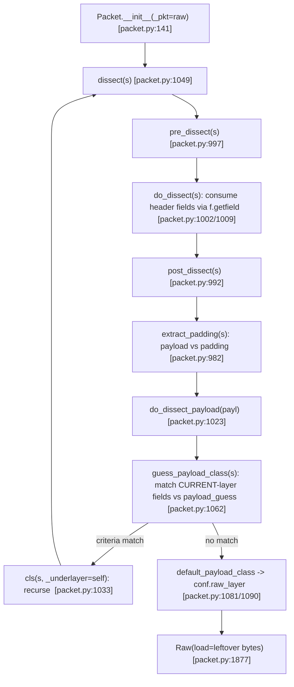

# How Scapy Dissects Raw Bytes into a Nested Packet Object — Runtime-Evidenced Report

This report answers four questions about Scapy's **dissection** engine — how it turns a raw
capture buffer (`bytes`) into a structured, nested packet object. Every behavioral claim is
backed by the **exact command run** and its **complete, unedited output**, plus `file:line`
citations naming the specific function/method/class/binding that does the work. The
investigation is strictly **read-only**: the only file written is this document; all
observation scripts lived outside the repository and were removed afterward.

## Metadata / environment (observed)

| Item | Value |
|------|-------|
| Repository root | `/tmp/blitzy/scapy/blitzy-2d54abc9-9ef7-4069-9dbc-885f7b5c3015_66543a` |
| Git working branch | `blitzy-2d54abc9-9ef7-4069-9dbc-885f7b5c3015` |
| Document stem (source branch) | `scapy_0925ada48540` |
| HEAD commit | `0925ada485406684174d6f068dbd85c4154657b3` |
| `git status --porcelain` | *empty* (pristine before and after the investigation) |
| Python | `3.11.13 (main, Oct  7 2025, 15:34:32) [Clang 20.1.4 ]` |
| Scapy `VERSION` | `2026.07.08` |
| Scapy import path | `.../blitzy-2d54abc9-9ef7-4069-9dbc-885f7b5c3015_66543a/scapy/__init__.py` (in-tree package) |

**Canonical invocation.** This is equivalent to the repository's `run_scapy` launcher
(`PYTHONPATH=$DIR exec python3 -m scapy`). The observation scripts live **outside** the repo
tree under `/tmp/scapy_obs/`, so `PYTHONPATH="$PWD"` is required to import the in-tree package;
`PYTHONPYCACHEPREFIX` keeps the repo tree free of `__pycache__` so `git status` stays empty:

```bash
cd /tmp/blitzy/scapy/blitzy-2d54abc9-9ef7-4069-9dbc-885f7b5c3015_66543a
PYTHONPYCACHEPREFIX=/tmp/scapy_pycache \
  PYTHONPATH="$PWD" /tmp/blitzy/scapy/venv311/bin/python /tmp/scapy_obs/<script>.py
```

**Methodology — run-first, real entry point.** Each scenario was executed against the in-repo
Scapy through the **real dissection entry point**: raw bytes are fed to a layer constructor
(`Ether(raw)` / `IP(raw)`), which sets `Packet.__init__`'s `_pkt` argument and triggers the
`dissect()` pipeline. The build path (`bytes(pkt)`) is used **only** to synthesize the input
bytes; no hand-built layer stack is used as evidence of dissection. Answers were written from
the captured output, not from reading alone; anything not directly observed is labeled
*inferred*.

**Determinism.** Every script's stdout (and stderr) was **byte-identical across two consecutive
runs** (verified with `diff`); the dissection results are deterministic.

**Authoritative source & corrected line numbers.** Where the in-repo source at HEAD and the
externally published Scapy docs (which track released 2.6/2.7) differ, the **in-repo source is
authoritative**. Every `file:line` below was re-grepped at HEAD `0925ada4`; where the Agent
Action Plan's (AAP) numbers had drifted or misattributed a symbol, this report uses the
verified value and flags the correction inline (see GRE `proto`, IPv6 `guess_payload_class`,
and `conf.debug_dissector`).

**Reported-version note.** The task brief anticipated Python `3.12.3`; the canonical container
runtime actually observed here (the venv matching the specified Docker image) is **`3.11.13`**,
reported as observed. Scapy dissection is pure Python and version-independent, so the outputs
are unaffected. Scapy's `[project]` table declares no mandatory runtime dependency
(`requires-python = ">=3.7, <4"` [`pyproject.toml:17`]; `dynamic = ["version","readme"]`
[`pyproject.toml:7`]; only `[project.optional-dependencies]` [`pyproject.toml:49`]), so the
core dissection path needs the standard library only.

### Environment caveat — `CryptographyDeprecationWarning` (not a result)

Because this container's virtual-env has `cryptography` installed, importing Scapy
(`from scapy.all import *`) emits a cosmetic deprecation warning to **stderr** at import
time — once per process, **before** any dissection runs. It is **non-fatal** and is **not** a
dissection result. Its complete, unedited text (identical for every run in this container) is:

```text
/tmp/blitzy/scapy/blitzy-2d54abc9-9ef7-4069-9dbc-885f7b5c3015_66543a/scapy/layers/ipsec.py:573: CryptographyDeprecationWarning: TripleDES has been moved to cryptography.hazmat.decrepit.ciphers.algorithms.TripleDES and will be removed from cryptography.hazmat.primitives.ciphers.algorithms in 48.0.0.
  cipher=algorithms.TripleDES,
/tmp/blitzy/scapy/blitzy-2d54abc9-9ef7-4069-9dbc-885f7b5c3015_66543a/scapy/layers/ipsec.py:577: CryptographyDeprecationWarning: TripleDES has been moved to cryptography.hazmat.decrepit.ciphers.algorithms.TripleDES and will be removed from cryptography.hazmat.primitives.ciphers.algorithms in 48.0.0.
  cipher=algorithms.TripleDES,
```

The warning originates from `scapy/layers/ipsec.py:573` and `:577` (a `TripleDES` algorithm
reference), not from the dissection engine. In the Q1–Q5 sections below, each run command
explicitly redirects the two streams to separate files
(`> /tmp/scapy_obs/qN.stdout 2> /tmp/scapy_obs/qN.stderr`), and **both** the complete `stdout`
block and the complete `stderr` block are shown, so each output block is the full, unedited
output of the exact command that precedes it. For Q1–Q5 this warning is the *only* content that
appeared on `stderr`. (For Q6 the `stderr` block additionally carries the `log_runtime.error`
lines that are part of that demonstration.)

## Preamble — the shared `dissect()` pipeline and the `payload_guess` hand-off

All four behaviors below are produced by **one** protocol-agnostic mechanism in
`scapy/packet.py`. Passing raw bytes to any layer constructor sets `Packet.__init__`'s `_pkt`
argument [`scapy/packet.py:141`]; when `_pkt` is non-empty, `__init__` calls `self.dissect(_pkt)`.
`dissect` [`scapy/packet.py:1049`] runs a fixed pipeline:

1. `pre_dissect(s)` [`scapy/packet.py:997`] — byte hook, default no-op (returns `s`).
2. `do_dissect(s)` [`scapy/packet.py:1002`] — consumes **this layer's** header fields by looping
   `self.fields_desc` and calling `s, fval = f.getfield(self, s)` [`scapy/packet.py:1009`];
   returns the residual bytes `s`.
3. `post_dissect(s)` [`scapy/packet.py:992`] — byte hook, default no-op.
4. `extract_padding(s)` [`scapy/packet.py:982`] — splits payload from trailing padding; the
   default returns `s, None` [`scapy/packet.py:990`] (only layers that know their own length,
   e.g. IP/UDP, override it).
5. `do_dissect_payload(payl)` [`scapy/packet.py:1023`] — decides and builds the **next** layer.

`dissect` then attaches a `Padding` layer when bytes are left over as padding:
`if pad and conf.padding:` [`scapy/packet.py:1059`] → `self.add_payload(conf.padding_layer(pad))`
[`scapy/packet.py:1060`].

**The hand-off is a header-field lookup.** `do_dissect_payload` [`scapy/packet.py:1023`] calls
`cls = self.guess_payload_class(s)` [`scapy/packet.py:1031`], then instantiates the chosen class
on the residual bytes: `p = cls(s, _internal=1, _underlayer=self)` [`scapy/packet.py:1033`] and
links it with `self.add_payload(p)` [`scapy/packet.py:1047`]. Because instantiating `cls` on `s`
re-enters `Packet.__init__` → `dissect`, the pipeline **recurses** down the stack until no bytes
remain.

`guess_payload_class` [`scapy/packet.py:1062`] is the header-driven core. It matches the
**current layer's own header fields** against a per-class binding table `payload_guess`
[`scapy/packet.py:104`] (populated by `bind_layers` / `bind_bottom_up`). The exact enclosing
condition (quoted verbatim from HEAD) is:

```python
for t in self.aliastypes:
    for fval, cls in t.payload_guess:
        try:
            if all(v == self.getfieldval(k)
                   for k, v in fval.items()):
                return cls  # type: ignore
        except AttributeError:
            pass
return self.default_payload_class(payload)
```

The comparison is `v == self.getfieldval(k)` — i.e. **field == bound value**, read from `self`
(the header just dissected). The `payload` argument is **not** inspected by this default; it is
only forwarded to `default_payload_class` when no binding matches. `default_payload_class`
[`scapy/packet.py:1081`] then returns `conf.raw_layer` [`scapy/packet.py:1090`], wired to `Raw`
(`conf.raw_layer = Raw` [`scapy/packet.py:1921`]). Terminal/fallback classes: `Raw`
[`scapy/packet.py:1877`], `Padding` [`scapy/packet.py:1906`] (`conf.padding_layer = Padding`
[`scapy/packet.py:1922`]), and `NoPayload` [`scapy/packet.py:1696`] — the sentinel payload a
layer carries when no bytes are left. `add_payload` [`scapy/packet.py:360`] links child to
parent and sets the child's `underlayer` back-reference, forming the doubly-linked nested
structure that `.layers()` / `.show()` render.

### Pipeline (with recursion)



### Preamble evidence — `extract_padding` → `Padding`, and the `NoPayload` terminal

A short `Ether/IP/UDP` frame zero-padded to 64 bytes exercises both edge behaviors: IP/UDP
length fields let `extract_padding` peel the trailing zeros into a `Padding` layer (instead of
guessing a bogus protocol), and the final layer's `.payload` is the `NoPayload` sentinel.

Script (`/tmp/scapy_obs/q5_padding_nopayload.py`):

```python
# BONUS (preamble support): observe extract_padding -> Padding, and NoPayload terminal
from scapy.all import Ether, IP, UDP, Raw, NoPayload, Padding, conf

short = Ether(dst="ff:ff:ff:ff:ff:ff", src="11:22:33:44:55:66")/IP(src="10.0.0.1",dst="10.0.0.2")/UDP(sport=1,dport=2)
raw = bytes(short)
raw_padded = raw + b"\x00" * (64 - len(raw)) if len(raw) < 64 else raw
d = Ether(raw_padded)
print("padded input len:", len(raw_padded))
print("layers():", [c.__name__ for c in d.layers()])
print("has Padding layer:", d.haslayer(Padding))
if d.haslayer(Padding):
    print("Padding.load =", repr(d[Padding].load))
print()
term = d.lastlayer()
print("lastlayer:", term.__class__.__name__)
print("type(lastlayer.payload):", type(term.payload).__name__)
print("isinstance(lastlayer.payload, NoPayload):", isinstance(term.payload, NoPayload))
print("conf.padding_layer is Padding:", conf.padding_layer is Padding)
```

Run:

```bash
cd /tmp/blitzy/scapy/blitzy-2d54abc9-9ef7-4069-9dbc-885f7b5c3015_66543a
PYTHONPYCACHEPREFIX=/tmp/scapy_pycache \
  PYTHONPATH="$PWD" /tmp/blitzy/scapy/venv311/bin/python /tmp/scapy_obs/q5_padding_nopayload.py \
  > /tmp/scapy_obs/q5.stdout 2> /tmp/scapy_obs/q5.stderr
```

Standard output — complete, unedited contents of `/tmp/scapy_obs/q5.stdout`:

```text
padded input len: 64
layers(): ['Ether', 'IP', 'UDP', 'Padding']
has Padding layer: True
Padding.load = b'\x00\x00\x00\x00\x00\x00\x00\x00\x00\x00\x00\x00\x00\x00\x00\x00\x00\x00\x00\x00\x00\x00'

lastlayer: Padding
type(lastlayer.payload): NoPayload
isinstance(lastlayer.payload, NoPayload): True
conf.padding_layer is Padding: True
```

Standard error — complete, unedited contents of `/tmp/scapy_obs/q5.stderr` (only the import-time `CryptographyDeprecationWarning` from the environment caveat above; not a dissection result):

```text
/tmp/blitzy/scapy/blitzy-2d54abc9-9ef7-4069-9dbc-885f7b5c3015_66543a/scapy/layers/ipsec.py:573: CryptographyDeprecationWarning: TripleDES has been moved to cryptography.hazmat.decrepit.ciphers.algorithms.TripleDES and will be removed from cryptography.hazmat.primitives.ciphers.algorithms in 48.0.0.
  cipher=algorithms.TripleDES,
/tmp/blitzy/scapy/blitzy-2d54abc9-9ef7-4069-9dbc-885f7b5c3015_66543a/scapy/layers/ipsec.py:577: CryptographyDeprecationWarning: TripleDES has been moved to cryptography.hazmat.decrepit.ciphers.algorithms.TripleDES and will be removed from cryptography.hazmat.primitives.ciphers.algorithms in 48.0.0.
  cipher=algorithms.TripleDES,
```

The 22 trailing `\x00` bytes are separated into `Padding` (`conf.padding_layer is Padding`),
and `type(lastlayer.payload)` is `NoPayload` — confirming both the `extract_padding`
[`scapy/packet.py:982`] split and the `NoPayload` [`scapy/packet.py:1696`] terminal.

## Q1 — Layer boundary detection / hand-off (Ethernet → IP → TCP → HTTP)

**Question.** How does Scapy decide where Ethernet ends and IP begins, where IP ends and TCP
begins, and so on down the stack? Demonstrate at runtime with a real packet (an HTTP request)
how each layer hands off to the next.

A real `Ether/IP/TCP/HTTP/HTTPRequest` buffer is synthesized with the build path, then
**dissected through the real entry point `Ether(raw)`**. For each dissected layer, the actual
`guess_payload_class` is called on that layer's payload to show the field-driven next-class
selection. (Exact input, 101 bytes:
`ffffffffffff112233445566080045000057000100004006669e0a0000010a00000230390050000003e800000001501820001b680000474554202f696e6465782e68746d6c20485454502f312e310d0a486f73743a206578616d706c652e636f6d0d0a0d0a`.)

Script (`/tmp/scapy_obs/q1_handoff.py`):

```python
# Q1 - Layer boundary detection / hand-off: real Ether/IP/TCP/HTTP/HTTPRequest
# Real entry point: feed raw bytes into Ether(raw) so the actual dissect() pipeline runs.
from scapy.all import Ether, IP, TCP
from scapy.layers.http import HTTP, HTTPRequest

# Build (build path used ONLY to synthesize raw input bytes)
pkt = (Ether(dst="ff:ff:ff:ff:ff:ff", src="11:22:33:44:55:66") /
       IP(src="10.0.0.1", dst="10.0.0.2") /
       TCP(sport=12345, dport=80, flags="PA", seq=1000, ack=1) /
       HTTP() /
       HTTPRequest(Method=b"GET", Path=b"/index.html",
                   Http_Version=b"HTTP/1.1", Host=b"example.com"))
raw = bytes(pkt)

# DISSECT via the real entry point
d = Ether(raw)

print("raw len:", len(raw))
print("layers():", [c.__name__ for c in d.layers()])
print()
e = d
print("Ether.type = 0x%04x -> gpc -> %s" % (e.type, e.guess_payload_class(bytes(e.payload)).__name__))
ip = d[IP]
print("IP.proto   = %d    -> gpc -> %s" % (ip.proto, ip.guess_payload_class(bytes(ip.payload)).__name__))
tcp = d[TCP]
print("TCP.dport  = %d   -> gpc -> %s" % (tcp.dport, tcp.guess_payload_class(bytes(tcp.payload)).__name__))
http = d[HTTP]
print("HTTP content-sniff -> gpc -> %s" % (http.guess_payload_class(bytes(http.payload)).__name__))
print()
print("=== d.show(dump=True) ===")
print(d.show(dump=True))
```

Run:

```bash
cd /tmp/blitzy/scapy/blitzy-2d54abc9-9ef7-4069-9dbc-885f7b5c3015_66543a
PYTHONPYCACHEPREFIX=/tmp/scapy_pycache \
  PYTHONPATH="$PWD" /tmp/blitzy/scapy/venv311/bin/python /tmp/scapy_obs/q1_handoff.py \
  > /tmp/scapy_obs/q1.stdout 2> /tmp/scapy_obs/q1.stderr
```

Standard output — complete, unedited contents of `/tmp/scapy_obs/q1.stdout` (including every `= None` HTTP header line):

```text
raw len: 101
layers(): ['Ether', 'IP', 'TCP', 'HTTP', 'HTTPRequest']

Ether.type = 0x0800 -> gpc -> IP
IP.proto   = 6    -> gpc -> TCP
TCP.dport  = 80   -> gpc -> HTTP
HTTP content-sniff -> gpc -> HTTPRequest

=== d.show(dump=True) ===
###[ Ethernet ]### 
  dst       = ff:ff:ff:ff:ff:ff
  src       = 11:22:33:44:55:66
  type      = IPv4
###[ IP ]### 
     version   = 4
     ihl       = 5
     tos       = 0x0
     len       = 87
     id        = 1
     flags     = 
     frag      = 0
     ttl       = 64
     proto     = tcp
     chksum    = 0x669e
     src       = 10.0.0.1
     dst       = 10.0.0.2
     \options   \
###[ TCP ]### 
        sport     = 12345
        dport     = http
        seq       = 1000
        ack       = 1
        dataofs   = 5
        reserved  = 0
        flags     = PA
        window    = 8192
        chksum    = 0x1b68
        urgptr    = 0
        options   = []
###[ HTTP 1 ]### 
###[ HTTP Request ]### 
           Method    = 'GET'
           Path      = '/index.html'
           Http_Version= 'HTTP/1.1'
           A_IM      = None
           Accept    = None
           Accept_Charset= None
           Accept_Datetime= None
           Accept_Encoding= None
           Accept_Language= None
           Access_Control_Request_Headers= None
           Access_Control_Request_Method= None
           Authorization= None
           Cache_Control= None
           Connection= None
           Content_Length= None
           Content_MD5= None
           Content_Type= None
           Cookie    = None
           DNT       = None
           Date      = None
           Expect    = None
           Forwarded = None
           From      = None
           Front_End_Https= None
           HTTP2_Settings= None
           Host      = 'example.com'
           If_Match  = None
           If_Modified_Since= None
           If_None_Match= None
           If_Range  = None
           If_Unmodified_Since= None
           Keep_Alive= None
           Max_Forwards= None
           Origin    = None
           Permanent = None
           Pragma    = None
           Proxy_Authorization= None
           Proxy_Connection= None
           Range     = None
           Referer   = None
           Save_Data = None
           TE        = None
           Upgrade   = None
           Upgrade_Insecure_Requests= None
           User_Agent= None
           Via       = None
           Warning   = None
           X_ATT_DeviceId= None
           X_Correlation_ID= None
           X_Csrf_Token= None
           X_Forwarded_For= None
           X_Forwarded_Host= None
           X_Forwarded_Proto= None
           X_Http_Method_Override= None
           X_Request_ID= None
           X_Requested_With= None
           X_UIDH    = None
           X_Wap_Profile= None
           Unknown_Headers= None

```

Standard error — complete, unedited contents of `/tmp/scapy_obs/q1.stderr` (only the import-time `CryptographyDeprecationWarning` from the environment caveat above; not a dissection result):

```text
/tmp/blitzy/scapy/blitzy-2d54abc9-9ef7-4069-9dbc-885f7b5c3015_66543a/scapy/layers/ipsec.py:573: CryptographyDeprecationWarning: TripleDES has been moved to cryptography.hazmat.decrepit.ciphers.algorithms.TripleDES and will be removed from cryptography.hazmat.primitives.ciphers.algorithms in 48.0.0.
  cipher=algorithms.TripleDES,
/tmp/blitzy/scapy/blitzy-2d54abc9-9ef7-4069-9dbc-885f7b5c3015_66543a/scapy/layers/ipsec.py:577: CryptographyDeprecationWarning: TripleDES has been moved to cryptography.hazmat.decrepit.ciphers.algorithms.TripleDES and will be removed from cryptography.hazmat.primitives.ciphers.algorithms in 48.0.0.
  cipher=algorithms.TripleDES,
```

**Mechanism (cause → effect).** At each level, `do_dissect` [`scapy/packet.py:1002`] consumes
the current layer's header fields and leaves the residual bytes; `do_dissect_payload`
[`scapy/packet.py:1023`] calls `guess_payload_class` [`scapy/packet.py:1062`], which matches
those header-field values against `payload_guess` and returns the bound next class, instantiated
on the residual bytes [`scapy/packet.py:1033`] — repeating until no bytes remain. Each observed
hand-off maps to a specific binding:

- `Ether.type = 0x0800` → `IP`, via `bind_layers(Ether, IP, type=2048)` [`scapy/layers/inet.py:1101`]
  (`2048 == 0x0800`). `Ether` [`scapy/layers/l2.py:244`] carries the `type` field
  [`scapy/layers/l2.py:248`] and does **not** override `guess_payload_class` — it uses the
  header-only default.
- `IP.proto = 6` → `TCP`, via `bind_layers(IP, TCP, frag=0, proto=6)` [`scapy/layers/inet.py:1113`].
  `IP` [`scapy/layers/inet.py:521`] carries the `proto` field [`scapy/layers/inet.py:532`].
- `TCP.dport = 80` → `HTTP`, via `bind_bottom_up(TCP, HTTP, dport=80)` [`scapy/layers/http.py:749`]
  (also `sport=80` [`scapy/layers/http.py:748`]; and `bind_layers(TCP, HTTP, sport=80, dport=80)`
  [`scapy/layers/http.py:750`]). `TCP` is [`scapy/layers/inet.py:753`].
- `HTTP` → `HTTPRequest`, via the **content-sniffing** override `HTTP.guess_payload_class`
  [`scapy/layers/http.py:637`] — this last hop does *not* use the header-field default; it
  regex-matches the payload bytes (see Synthesis). This is exactly why the report line reads
  `HTTP content-sniff -> gpc -> HTTPRequest`.

The rendered `.show()` confirms the nested structure and the friendly enum renderings
(`type = IPv4`, `proto = tcp`, `dport = http`) that reflect the same header fields the bindings
key on. This uses the requester's suggested "HTTP request" as a real `Ether/IP/TCP/HTTP/
HTTPRequest` buffer.

## Q2 — Unrecognized payload (graceful degradation)

**Question.** What happens when there is no obvious next layer — when the payload is custom
application data Scapy does not recognize? Does it "give up gracefully", and what does that look
like in the resulting object?

A TCP segment on an **unbound** port (40001) carrying custom bytes is dissected via `IP(raw)`.
(Exact input, 84 bytes:
`4500005400010000400666a10a0000010a00000230399c41000000000000000050182000e0710000deadbeef20435553544f4d2d4150502d5041594c4f4144206e6f742d612d6b6e6f776e2d70726f746f636f6c`.)

Script (`/tmp/scapy_obs/q2_unrecognized.py`):

```python
# Q2 - Unrecognized payload (graceful degradation) via real entry point IP(raw)
from scapy.all import IP, TCP, Raw, conf

custom = b'\xde\xad\xbe\xef CUSTOM-APP-PAYLOAD not-a-known-protocol'
pkt = IP(src="10.0.0.1", dst="10.0.0.2") / TCP(sport=12345, dport=40001, flags="PA") / Raw(load=custom)
raw = bytes(pkt)

# DISSECT
d = IP(raw)
print("layers():", [c.__name__ for c in d.layers()])
tcp = d[TCP]
print("TCP.gpc ->", tcp.guess_payload_class(bytes(tcp.payload)).__name__)
print("lastlayer:", d.lastlayer().__class__.__name__)
print("Raw.load =", repr(d[Raw].load))
print("conf.raw_layer is Raw:", conf.raw_layer is Raw)
print("conf.debug_dissector =", conf.debug_dissector)
print()
print("=== d.show(dump=True) ===")
print(d.show(dump=True))
```

Run:

```bash
cd /tmp/blitzy/scapy/blitzy-2d54abc9-9ef7-4069-9dbc-885f7b5c3015_66543a
PYTHONPYCACHEPREFIX=/tmp/scapy_pycache \
  PYTHONPATH="$PWD" /tmp/blitzy/scapy/venv311/bin/python /tmp/scapy_obs/q2_unrecognized.py \
  > /tmp/scapy_obs/q2.stdout 2> /tmp/scapy_obs/q2.stderr
```

Standard output — complete, unedited contents of `/tmp/scapy_obs/q2.stdout`:

```text
layers(): ['IP', 'TCP', 'Raw']
TCP.gpc -> Raw
lastlayer: Raw
Raw.load = b'\xde\xad\xbe\xef CUSTOM-APP-PAYLOAD not-a-known-protocol'
conf.raw_layer is Raw: True
conf.debug_dissector = False

=== d.show(dump=True) ===
###[ IP ]### 
  version   = 4
  ihl       = 5
  tos       = 0x0
  len       = 84
  id        = 1
  flags     = 
  frag      = 0
  ttl       = 64
  proto     = tcp
  chksum    = 0x66a1
  src       = 10.0.0.1
  dst       = 10.0.0.2
  \options   \
###[ TCP ]### 
     sport     = 12345
     dport     = 40001
     seq       = 0
     ack       = 0
     dataofs   = 5
     reserved  = 0
     flags     = PA
     window    = 8192
     chksum    = 0xe071
     urgptr    = 0
     options   = []
###[ Raw ]### 
        load      = 'ޭ\\xbe\\xef CUSTOM-APP-PAYLOAD not-a-known-protocol'

```

Standard error — complete, unedited contents of `/tmp/scapy_obs/q2.stderr` (only the import-time `CryptographyDeprecationWarning` from the environment caveat above; not a dissection result):

```text
/tmp/blitzy/scapy/blitzy-2d54abc9-9ef7-4069-9dbc-885f7b5c3015_66543a/scapy/layers/ipsec.py:573: CryptographyDeprecationWarning: TripleDES has been moved to cryptography.hazmat.decrepit.ciphers.algorithms.TripleDES and will be removed from cryptography.hazmat.primitives.ciphers.algorithms in 48.0.0.
  cipher=algorithms.TripleDES,
/tmp/blitzy/scapy/blitzy-2d54abc9-9ef7-4069-9dbc-885f7b5c3015_66543a/scapy/layers/ipsec.py:577: CryptographyDeprecationWarning: TripleDES has been moved to cryptography.hazmat.decrepit.ciphers.algorithms.TripleDES and will be removed from cryptography.hazmat.primitives.ciphers.algorithms in 48.0.0.
  cipher=algorithms.TripleDES,
```

**Mechanism.** No entry in TCP's `payload_guess` matches `dport`/`sport` 40001, so the loop in
`guess_payload_class` [`scapy/packet.py:1062`] finds no match and delegates to
`default_payload_class` [`scapy/packet.py:1081`], which returns `conf.raw_layer`
[`scapy/packet.py:1090`] — i.e. `Raw` [`scapy/packet.py:1877`] (`conf.raw_layer is Raw` →
`True`). The leftover bytes are preserved **verbatim** in `Raw.load`
(`b'\xde\xad\xbe\xef CUSTOM-APP-PAYLOAD not-a-known-protocol'`), and `lastlayer()` is `Raw`.
This is the "give up gracefully" behavior: **no exception** is raised at the default
`conf.debug_dissector = False`.

There is a **second** graceful fallback on the same path: if a *chosen* dissector raises while
building the next layer, the `except Exception` handler in `do_dissect_payload` falls back to
`p = conf.raw_layer(s, _internal=1, _underlayer=self)` [`scapy/packet.py:1046`]. Both fallbacks
are silent at the default debug level; this is examined and demonstrated in the Synthesis
(`conf.debug_dissector`).

## Q3 — Trust / header-versus-content mismatch (the user's example)

**Question (verbatim intent).** *"If I build a packet where the Ethernet `type` field claims
IPv6 (`0x86dd`) but the actual bytes are an IPv4 packet, does Scapy follow the header blindly or
does it notice something's off?"*

A **genuine IPv4** packet (`IP/TCP`; its first byte is `0x45` → version nibble 4) is wrapped in
an Ethernet frame whose `type` is set to `0x86dd` (IPv6) but whose payload is the IPv4 bytes; it
is dissected via `Ether(raw)`. A **control case** re-dissects the *same* inner bytes with only
`type=0x0800` changed. (Exact input, 54 bytes:
`ffffffffffff11223344556686dd45000028000100004006f6cbc0000201c0000202045708ae000000000000000050022000fed90000`.)

Script (`/tmp/scapy_obs/q3_mismatch.py`):

```python
# Q3 - Trust / header-vs-content mismatch (USER'S REQUIRED EXAMPLE) via Ether(raw)
from scapy.all import Ether, IP, TCP, IPv6, Raw, conf

# Build a GENUINE IPv4 packet, capture its raw bytes
inner = IP(src="192.0.2.1", dst="192.0.2.2") / TCP(sport=1111, dport=2222, flags="S")
ipv4_bytes = bytes(inner)
print("first byte = 0x%02x (version nibble=%d)" % (ipv4_bytes[0], ipv4_bytes[0] >> 4))

# Wrap in an Ethernet frame that CLAIMS IPv6 (type=0x86dd) but carries the IPv4 bytes
frame = Ether(dst="ff:ff:ff:ff:ff:ff", src="11:22:33:44:55:66", type=0x86dd) / Raw(load=ipv4_bytes)
raw = bytes(frame)

# DISSECT
d = Ether(raw)
print("Ether.type = 0x%04x" % d.type)
print("Ether.gpc ->", d.guess_payload_class(bytes(d.payload)).__name__)
print("layers():", [c.__name__ for c in d.layers()])
if d.haslayer(IPv6):
    v6 = d[IPv6]
    print("as IPv6: version =", v6.version, " nh =", v6.nh)
print("conf.debug_dissector =", conf.debug_dissector, "(no error raised)")
print()
print("=== d.show(dump=True)  [MISPARSE PROOF] ===")
print(d.show(dump=True))

# CONTROL CASE: identical inner bytes, but Ether.type=0x0800 (IPv4)
frame2 = Ether(dst="ff:ff:ff:ff:ff:ff", src="11:22:33:44:55:66", type=0x0800) / Raw(load=ipv4_bytes)
d2 = Ether(bytes(frame2))
print()
print("Q3b CONTROL (type=0x0800, SAME inner bytes): layers():", [c.__name__ for c in d2.layers()])
```

Run:

```bash
cd /tmp/blitzy/scapy/blitzy-2d54abc9-9ef7-4069-9dbc-885f7b5c3015_66543a
PYTHONPYCACHEPREFIX=/tmp/scapy_pycache \
  PYTHONPATH="$PWD" /tmp/blitzy/scapy/venv311/bin/python /tmp/scapy_obs/q3_mismatch.py \
  > /tmp/scapy_obs/q3.stdout 2> /tmp/scapy_obs/q3.stderr
```

Standard output — complete, unedited contents of `/tmp/scapy_obs/q3.stdout` (the `.show()` is the misparse proof; the last line is the control):

```text
first byte = 0x45 (version nibble=4)
Ether.type = 0x86dd
Ether.gpc -> IPv6
layers(): ['Ether', 'IPv6']
as IPv6: version = 4  nh = 0
conf.debug_dissector = False (no error raised)

=== d.show(dump=True)  [MISPARSE PROOF] ===
###[ Ethernet ]### 
  dst       = ff:ff:ff:ff:ff:ff
  src       = 11:22:33:44:55:66
  type      = IPv6
###[ IPv6 ]### 
     version   = 4
     tc        = 80
     fl        = 40
     plen      = 1
     nh        = Hop-by-Hop Option Header
     hlim      = 0
     src       = 4006:f6cb:c000:201:c000:202:457:8ae
     dst       = ::5002:2000:fed9:0


Q3b CONTROL (type=0x0800, SAME inner bytes): layers(): ['Ether', 'IP', 'TCP']
```

Standard error — complete, unedited contents of `/tmp/scapy_obs/q3.stderr` (only the import-time `CryptographyDeprecationWarning` from the environment caveat above; not a dissection result):

```text
/tmp/blitzy/scapy/blitzy-2d54abc9-9ef7-4069-9dbc-885f7b5c3015_66543a/scapy/layers/ipsec.py:573: CryptographyDeprecationWarning: TripleDES has been moved to cryptography.hazmat.decrepit.ciphers.algorithms.TripleDES and will be removed from cryptography.hazmat.primitives.ciphers.algorithms in 48.0.0.
  cipher=algorithms.TripleDES,
/tmp/blitzy/scapy/blitzy-2d54abc9-9ef7-4069-9dbc-885f7b5c3015_66543a/scapy/layers/ipsec.py:577: CryptographyDeprecationWarning: TripleDES has been moved to cryptography.hazmat.decrepit.ciphers.algorithms.TripleDES and will be removed from cryptography.hazmat.primitives.ciphers.algorithms in 48.0.0.
  cipher=algorithms.TripleDES,
```

**Answer: Scapy follows the header blindly** in its default/binding path. `guess_payload_class`
[`scapy/packet.py:1062`] matched on `self.getfieldval('type')` alone, via
`bind_layers(Ether, IPv6, type=0x86dd)` [`scapy/layers/inet6.py:4083`] — it never inspected the
payload, whose leading `0x45` is an unmistakable IPv4 version-4/IHL-5 nibble. The
mis-instantiated `IPv6` layer shows `version = 4`, which is **impossible for a real IPv6 header**
(it must be 6) — the smoking-gun proof of a misparse; the rendered "addresses"
(`4006:f6cb:c000:201:c000:202:457:8ae`, `::5002:2000:fed9:0`) are simply IPv4 header bytes
reinterpreted as an IPv6 128-bit address. **No error** is raised at `conf.debug_dissector =
False`.

The **control** proves causation: dissecting the *identical* inner bytes with only the Ethernet
`type` changed to `0x0800` yields `['Ether', 'IP', 'TCP']` — a clean parse. The single variable
that flipped the interpretation was the header `type` field. Ethernet is a header-only layer
(`Ether` does not override `guess_payload_class`), so it trusts its `type` field with no content
check. (Contrast: layers that override `guess_payload_class` to inspect content — e.g. `HTTP`
[`scapy/layers/http.py:637`]. **Inferred** from that content-sniffing override — a reasoned
inference from the cited source, not a separately observed run here — such a layer inspects the
payload bytes and so would detect this kind of header/content mismatch rather than trust the
header field alone; see Synthesis.)

## Q4 — Tunnel depth (GRE carrying another IP packet)

**Question.** For tunneled traffic such as GRE carrying another IP packet inside, does parsing
descend all the way through the nested layers or stop partway?

An `IP/GRE/IP/ICMP` buffer is dissected via `IP(raw)`. (Exact input, 52 bytes:
`4500003400010000402f0296cb007101cb007102000008004500001c000100004001f78cc0a80101c0a801020800f7ff00000000`.)

Script (`/tmp/scapy_obs/q4_tunnel.py`):

```python
# Q4 - Tunnel depth: IP/GRE/IP/ICMP full recursive descent via IP(raw)
from scapy.all import IP, GRE, ICMP

pkt = (IP(src="203.0.113.1", dst="203.0.113.2") /
       GRE() /
       IP(src="192.168.1.1", dst="192.168.1.2") /
       ICMP())
raw = bytes(pkt)

# DISSECT
d = IP(raw)
print("layers():", [c.__name__ for c in d.layers()])
print("outer IP.proto =", d.proto, "(47=GRE)")
gre = d[GRE]
print("GRE.proto = 0x%04x (0x0800=IPv4)" % gre.proto)
n = 0; i = 1
while d.getlayer(IP, i) is not None:
    n += 1; i += 1
print("number of IP layers:", n)
inner = d.getlayer(IP, 2)
print("inner IP:", inner.src, "->", inner.dst)
print()
print("=== d.show(dump=True) ===")
print(d.show(dump=True))
```

Run:

```bash
cd /tmp/blitzy/scapy/blitzy-2d54abc9-9ef7-4069-9dbc-885f7b5c3015_66543a
PYTHONPYCACHEPREFIX=/tmp/scapy_pycache \
  PYTHONPATH="$PWD" /tmp/blitzy/scapy/venv311/bin/python /tmp/scapy_obs/q4_tunnel.py \
  > /tmp/scapy_obs/q4.stdout 2> /tmp/scapy_obs/q4.stderr
```

Standard output — complete, unedited contents of `/tmp/scapy_obs/q4.stdout`:

```text
layers(): ['IP', 'GRE', 'IP', 'ICMP']
outer IP.proto = 47 (47=GRE)
GRE.proto = 0x0800 (0x0800=IPv4)
number of IP layers: 2
inner IP: 192.168.1.1 -> 192.168.1.2

=== d.show(dump=True) ===
###[ IP ]### 
  version   = 4
  ihl       = 5
  tos       = 0x0
  len       = 52
  id        = 1
  flags     = 
  frag      = 0
  ttl       = 64
  proto     = gre
  chksum    = 0x296
  src       = 203.0.113.1
  dst       = 203.0.113.2
  \options   \
###[ GRE ]### 
     chksum_present= 0
     routing_present= 0
     key_present= 0
     seqnum_present= 0
     strict_route_source= 0
     recursion_control= 0
     flags     = 0
     version   = 0
     proto     = IPv4
###[ IP ]### 
        version   = 4
        ihl       = 5
        tos       = 0x0
        len       = 28
        id        = 1
        flags     = 
        frag      = 0
        ttl       = 64
        proto     = icmp
        chksum    = 0xf78c
        src       = 192.168.1.1
        dst       = 192.168.1.2
        \options   \
###[ ICMP ]### 
           type      = echo-request
           code      = 0
           chksum    = 0xf7ff
           id        = 0x0
           seq       = 0x0
           unused    = ''

```

Standard error — complete, unedited contents of `/tmp/scapy_obs/q4.stderr` (only the import-time `CryptographyDeprecationWarning` from the environment caveat above; not a dissection result):

```text
/tmp/blitzy/scapy/blitzy-2d54abc9-9ef7-4069-9dbc-885f7b5c3015_66543a/scapy/layers/ipsec.py:573: CryptographyDeprecationWarning: TripleDES has been moved to cryptography.hazmat.decrepit.ciphers.algorithms.TripleDES and will be removed from cryptography.hazmat.primitives.ciphers.algorithms in 48.0.0.
  cipher=algorithms.TripleDES,
/tmp/blitzy/scapy/blitzy-2d54abc9-9ef7-4069-9dbc-885f7b5c3015_66543a/scapy/layers/ipsec.py:577: CryptographyDeprecationWarning: TripleDES has been moved to cryptography.hazmat.decrepit.ciphers.algorithms.TripleDES and will be removed from cryptography.hazmat.primitives.ciphers.algorithms in 48.0.0.
  cipher=algorithms.TripleDES,
```

**Mechanism.** `do_dissect_payload` [`scapy/packet.py:1023`] re-enters at each level, so nesting
is just the pipeline recursing:

- outer `IP.proto = 47` → `GRE`, via `bind_layers(IP, GRE, frag=0, proto=47)`
  [`scapy/layers/inet.py:1115`]. `GRE` is [`scapy/layers/l2.py:578`]; its `proto` field is at
  [`scapy/layers/l2.py:591`] — **correction:** the AAP cited `L594`; the verified line at HEAD
  is **591**. `GRE` does **not** override `guess_payload_class`.
- `GRE.proto = 0x0800` → inner `IP`, via `bind_layers(GRE, IP, proto=2048)`
  [`scapy/layers/inet.py:1103`].
- inner `IP.proto = 1` → `ICMP`, via `bind_layers(IP, ICMP, frag=0, proto=1)`
  [`scapy/layers/inet.py:1112`].

The result contains **two** `IP` layers (`getlayer(IP, 2)` → inner `192.168.1.1 → 192.168.1.2`)
and terminates at `ICMP`. Parsing **does not stop partway** — it descends the full tunnel.

**Honest note on trailing `Raw`.** With a bare `ICMP()` (no extra data) the stack ends exactly
at `ICMP` with **no** trailing `Raw` layer (the ICMP echo header consumes all remaining bytes;
its `.payload` is `NoPayload`). The AAP §0.5.4 illustration showed a trailing `Raw`; that was an
artifact of a different ICMP construction. The captured output here is authoritative. Either
way, the conclusion is unchanged: dissection descends through every nested layer.

## Synthesis — header-driven default vs. content/field overrides, and error handling

### Why the four behaviors are one mechanism

`guess_payload_class` [`scapy/packet.py:1062`] chooses the next layer using **only the current
layer's header fields** (`self.getfieldval(k)`) against `payload_guess` tables filled by
`bind_layers` / `bind_bottom_up`. That single fact explains all four results: hand-off (Q1) is a
successful field match; graceful fallback (Q2) is *no* match → `Raw`; the blind misparse (Q3) is
a match on a header field that disagrees with the content; tunnel depth (Q4) is the same matcher
recursing.

### Three tiers of next-layer selection (observed + cited)

1. **Header-field binding default** (no override): `Ether` [`scapy/layers/l2.py:244`], `IP`
   [`scapy/layers/inet.py:521`], `TCP` [`scapy/layers/inet.py:753`], `GRE`
   [`scapy/layers/l2.py:578`] — none override `guess_payload_class`, so they use the
   binding-table match (`field == value`). This header-only path is responsible for Q1, Q2 (no
   match), Q3 (blind), and Q4.
2. **Header-field overrides** (they override the method, but still key off a *header* field, not
   payload content):
   - `ICMP.guess_payload_class` [`scapy/layers/inet.py:1000`] —
     `if self.type in [3, 4, 5, 11, 12]: return IPerror else: return None` (keys off the ICMP
     `type` header field).
   - `IPv6` routes via `_IPv6GuessPayload.default_payload_class` [`scapy/layers/inet6.py:244`],
     keying off the `nh` (next-header) field (`ipv6nhcls.get(self.nh, Raw)`, with sub-dispatch
     for ICMPv6 / Mobile-IPv6 / Segment-Routing). **Correction:** `IPv6` —
     `class IPv6(_IPv6GuessPayload, Packet, IPTools)` [`scapy/layers/inet6.py:262`] — does *not*
     override `guess_payload_class`; the AAP's "`IPv6.guess_payload_class` L1069" actually points
     at `IPv6ExtHdrFragment.guess_payload_class` [`scapy/layers/inet6.py:1069`], a different
     class.
3. **Content-sniffing override** (inspects payload bytes): `HTTP.guess_payload_class`
   [`scapy/layers/http.py:637`] regex-matches the payload —
   `^(?:OPTIONS|GET|HEAD|POST|PUT|DELETE|TRACE|CONNECT) (?:.+?) HTTP/\d\.\d$` → `HTTPRequest`;
   `^HTTP/\d\.\d \d\d\d .*$` → `HTTPResponse`; otherwise `Raw`. `_HTTPContent.guess_payload_class`
   [`scapy/layers/http.py:425`] additionally keys off the `Connection` header (Upgrade → HTTP/2).

Tier 3 is precisely why Q1's final hop (`HTTP → HTTPRequest`) is content-driven and correct,
while Q3 misparses: `Ether` is a Tier-1 layer, so it trusts its `type` field with no content
check.

### Error handling — `conf.debug_dissector` (runtime-evidenced correction of the AAP)

`conf.debug_dissector` [`scapy/config.py:817`] (default `False`; comment at
[`scapy/config.py:816`]: *"raise exception when a packet dissector raises an exception"*) governs
the `except Exception` handler in `do_dissect_payload` [`scapy/packet.py:1037`–`1046`], quoted
verbatim from HEAD:

```python
except Exception:
    if conf.debug_dissector:
        if issubtype(cls, Packet):
            log_runtime.error("%s dissector failed", cls.__name__)
        else:
            log_runtime.error("%s.guess_payload_class() returned "
                              "[%s]",
                              self.__class__.__name__, repr(cls))
        if cls is not None:
            raise
    p = conf.raw_layer(s, _internal=1, _underlayer=self)
self.add_payload(p)
```

To observe the actual behavior, a case where a **real** dissector fails (a 1-byte truncated
`TCP`, which raises `struct.error`) and a case where `guess_payload_class` returns **`None`**
(an ICMP echo-request, `type=8`, with trailing bytes) were dissected at
`debug_dissector ∈ {0, 1, 2}`.

Script (`/tmp/scapy_obs/q6_debug_dissector.py`):

```python
# SYNTHESIS SUPPORT: how conf.debug_dissector governs the do_dissect_payload exception path.
# Case A: a REAL dissector (TCP) fails on a truncated 1-byte payload (struct.error).
# Case B: guess_payload_class returns None (ICMP echo-request with a trailing payload).
from scapy.all import IP, TCP, ICMP, Raw, conf

# --- Synthesize inputs (build path only) ---
a_raw = bytes(IP(proto=6) / Raw(load=b"\x00"))          # IP(proto=TCP) + 1 truncated TCP byte
b_raw = bytes(IP() / ICMP(type=8) / Raw(load=b"TAIL"))  # ICMP echo-request (type 8) + trailing bytes
print("Case A input (IP/proto=6 + 1 byte): %d bytes  hex=%s" % (len(a_raw), a_raw.hex()))
print("Case B input (IP/ICMP type=8 +TAIL): %d bytes  hex=%s" % (len(b_raw), b_raw.hex()))
print()

for level in (0, 1, 2):
    conf.debug_dissector = level
    # Case A: real dissector (TCP) raises struct.error internally
    try:
        d = IP(a_raw)
        print("A debug_dissector=%d: NO raise -> layers=%s" % (level, [c.__name__ for c in d.layers()]))
    except Exception as e:
        print("A debug_dissector=%d: RAISED %s: %s" % (level, type(e).__name__, e))
    # Case B: guess_payload_class returns None
    try:
        d = IP(b_raw)
        print("B debug_dissector=%d: NO raise -> layers=%s" % (level, [c.__name__ for c in d.layers()]))
    except Exception as e:
        print("B debug_dissector=%d: RAISED %s: %s" % (level, type(e).__name__, e))
conf.debug_dissector = False
```

Run:

```bash
cd /tmp/blitzy/scapy/blitzy-2d54abc9-9ef7-4069-9dbc-885f7b5c3015_66543a
PYTHONPYCACHEPREFIX=/tmp/scapy_pycache \
  PYTHONPATH="$PWD" /tmp/blitzy/scapy/venv311/bin/python /tmp/scapy_obs/q6_debug_dissector.py \
  > /tmp/scapy_obs/q6.stdout 2> /tmp/scapy_obs/q6.stderr
```

Standard output — complete, unedited contents of `/tmp/scapy_obs/q6.stdout`:

```text
Case A input (IP/proto=6 + 1 byte): 21 bytes  hex=450000150001000040067ce07f0000017f00000100
Case B input (IP/ICMP type=8 +TAIL): 32 bytes  hex=450000200001000040017cda7f0000017f00000108005a72000000005441494c

A debug_dissector=0: NO raise -> layers=['IP', 'Raw']
B debug_dissector=0: NO raise -> layers=['IP', 'ICMP', 'Raw']
A debug_dissector=1: RAISED error: unpack requires a buffer of 2 bytes
B debug_dissector=1: NO raise -> layers=['IP', 'ICMP', 'Raw']
A debug_dissector=2: RAISED error: unpack requires a buffer of 2 bytes
B debug_dissector=2: NO raise -> layers=['IP', 'ICMP', 'Raw']
```

Standard error — complete, unedited contents of `/tmp/scapy_obs/q6.stderr` (the two leading lines are the import-time caveat above, not a result; the `ERROR:` lines are `log_runtime.error` from the handler):

```text
/tmp/blitzy/scapy/blitzy-2d54abc9-9ef7-4069-9dbc-885f7b5c3015_66543a/scapy/layers/ipsec.py:573: CryptographyDeprecationWarning: TripleDES has been moved to cryptography.hazmat.decrepit.ciphers.algorithms.TripleDES and will be removed from cryptography.hazmat.primitives.ciphers.algorithms in 48.0.0.
  cipher=algorithms.TripleDES,
/tmp/blitzy/scapy/blitzy-2d54abc9-9ef7-4069-9dbc-885f7b5c3015_66543a/scapy/layers/ipsec.py:577: CryptographyDeprecationWarning: TripleDES has been moved to cryptography.hazmat.decrepit.ciphers.algorithms.TripleDES and will be removed from cryptography.hazmat.primitives.ciphers.algorithms in 48.0.0.
  cipher=algorithms.TripleDES,
ERROR: TCP dissector failed
ERROR: ICMP.guess_payload_class() returned [None]
ERROR: more TCP dissector failed
```

**Observed — and it corrects the AAP.** The AAP §0.5.4 described three tiers (`0` silent /
`1` warn-then-fall-back / `2` re-raise). The in-repo source and the runtime show a **two-tier**
behavior:

- `debug_dissector = 0` (default): **silent `Raw` fallback** in *both* cases — `['IP','Raw']` and
  `['IP','ICMP','Raw']`, no log, no exception. (This is the Q2 "graceful" behavior.)
- `debug_dissector` **nonzero** (`1` and `2` behave **identically** here): a `log_runtime.error`
  is emitted, and the exception **re-raises only when the failed class is a real `Packet`
  subclass** (`cls is not None`) — Case A logs `TCP dissector failed` and the `struct.error`
  ("unpack requires a buffer of 2 bytes") propagates. When `guess_payload_class` returned `None`
  (Case B), it logs `ICMP.guess_payload_class() returned [None]` and still falls back to `Raw` (no raise). The
  `more TCP dissector failed` line is Scapy's log-throttling of the repeated message.

So "graceful degradation" (Q2) is the **default** behavior; raising is opt-in via a nonzero
`conf.debug_dissector`, and — in this build — there is no distinct `1`-vs-`2` gradation for a
failing real dissector. This supersedes the AAP's three-tier description; the runtime and the
in-repo source are authoritative.

### `extract_padding` and `NoPayload`

`extract_padding` [`scapy/packet.py:982`] (default `return s, None`) is what lets IP/UDP peel
trailing padding into a `Padding` layer rather than a bogus protocol — observed in the Preamble
evidence (22 `\x00` → `Padding`). `NoPayload` [`scapy/packet.py:1696`] is the terminal sentinel
installed as the default `.payload` in `Packet.__init__` [`scapy/packet.py:141`] and left in
place when a layer consumes all remaining bytes (observed: `type(lastlayer.payload) ==
NoPayload`).

### Corroboration and version divergence

Scapy's published documentation ("Adding new protocols") corroborates the mechanism —
`bind_layers()` populates each layer's `payload_guess`; `guess_payload_class()` returns the first
binding whose `field == value` criteria match; otherwise `default_payload_class()` returns `Raw`.
Those docs track released 2.6/2.7, whereas this in-repo build reports `2026.07.08`; where they
differ the **in-repo source is authoritative**. One concrete divergence: upstream's newer
`do_dissect_payload` accepts a `stop_dissection_after` keyword, which is **absent** from the
in-repo `do_dissect_payload` [`scapy/packet.py:1023`] (its signature is
`def do_dissect_payload(self, s):`, verified by grep — no matches for `stop_dissection_after` in
`scapy/packet.py`).

## Coverage pass — every named item, with observed evidence + `file:line`

| Named item | Where demonstrated (observed) | Key `file:line` |
|------------|-------------------------------|-----------------|
| **Ethernet** | Q1 (`type=0x0800 → IP`), Q3 (`type=0x86dd → IPv6`, blind) | `Ether` `l2.py:244`, field `l2.py:248`; `bind_layers(Ether,IP)` `inet.py:1101`; `bind_layers(Ether,IPv6)` `inet6.py:4083` |
| **IP** | Q1 (`proto=6 → TCP`), Q2 (IP header then Raw), Q4 (outer & inner IP) | `IP` `inet.py:521`, field `inet.py:532`; `bind_layers(IP,TCP)` `inet.py:1113`; `bind_layers(IP,GRE)` `inet.py:1115` |
| **TCP** | Q1 (`dport=80 → HTTP`), Q2 (`dport=40001 → Raw`) | `TCP` `inet.py:753`; `bind_bottom_up(TCP, HTTP, sport=80)`/`bind_bottom_up(TCP, HTTP, dport=80)` `http.py:748`–`749`, `bind_layers(TCP, HTTP, sport=80, dport=80)` `http.py:750` |
| **HTTP** | Q1 (`HTTP → HTTPRequest`, content-sniff) | `HTTP` `http.py:548`; `HTTP.guess_payload_class` `http.py:637` |
| **IPv6-claim / IPv4-bytes mismatch** | Q3 (misparse `version=4`; control `type=0x0800`) | `guess_payload_class` `packet.py:1062`; `bind_layers(Ether,IPv6,type=0x86dd)` `inet6.py:4083` |
| **GRE** | Q4 (`IP → GRE → IP`) | `GRE` `l2.py:578`, `proto` field `l2.py:591`; `bind_layers(GRE,IP)` `inet.py:1103` |
| **Raw (fallback)** | Q2 (unbound port), Q6 (exception fallback) | `Raw` `packet.py:1877`; `default_payload_class` → `conf.raw_layer` `packet.py:1081`/`1090`; exception fallback `packet.py:1046` |
| **ICMP** | Q4 (inner `proto=1 → ICMP`), Q6 (Case B) | `ICMP` `inet.py:952`; `ICMP.guess_payload_class` `inet.py:1000`; `bind_layers(IP,ICMP)` `inet.py:1112` |
| **Padding / NoPayload** | Preamble evidence (`q5`) | `extract_padding` `packet.py:982`; `Padding` `packet.py:1906`; `NoPayload` `packet.py:1696` |

### Direct answers (one line each)

- **Q1 (hand-off):** each boundary is decided by the *current* layer's header field looked up in
  its `payload_guess` binding table by `guess_payload_class` [`packet.py:1062`]; observed
  `Ether.type→IP`, `IP.proto→TCP`, `TCP.dport→HTTP`, then content-sniffed `HTTP→HTTPRequest`.
- **Q2 (unrecognized):** yes, it gives up gracefully — no binding matches → `default_payload_class`
  → `Raw` [`packet.py:1081`/`1877`] with the exact bytes in `Raw.load`; no exception at default
  `conf.debug_dissector`.
- **Q3 (trust):** it follows the header **blindly** — the Ethernet `type` field alone selected
  `IPv6`, misparsing genuine IPv4 (`version=4` in the "IPv6" layer); the `type=0x0800` control on
  identical bytes parses cleanly.
- **Q4 (tunnel depth):** it descends **all the way** — `IP/GRE/IP/ICMP`, two IP layers, inner
  `192.168.1.1→192.168.1.2`; recursion via `do_dissect_payload` [`packet.py:1023`] and the
  `IP↔GRE` bindings; nothing caps depth.

### Determinism & read-only confirmation

Each scenario's stdout was **byte-identical across two consecutive runs** (`diff`). The
investigation **modified no repository file**: `git status --porcelain` was empty before and
after, all observation scripts lived outside the repo under `/tmp/scapy_obs/` (removed after
use), and `PYTHONPYCACHEPREFIX` kept bytecode out of the tree. This document is the only artifact
written.
