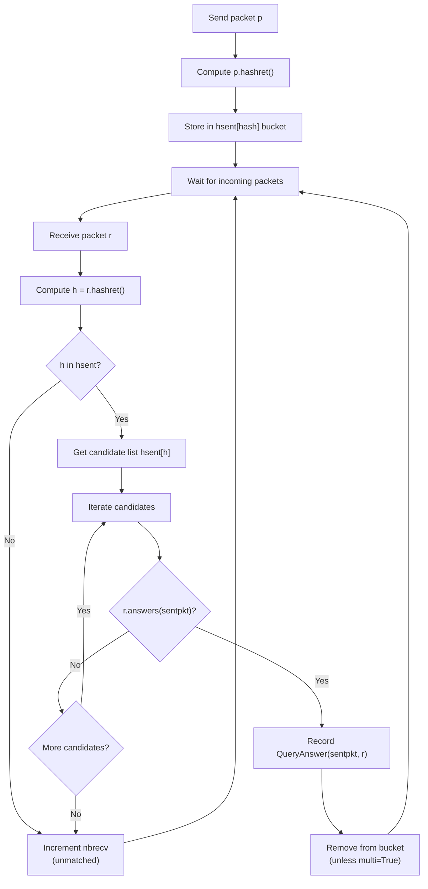
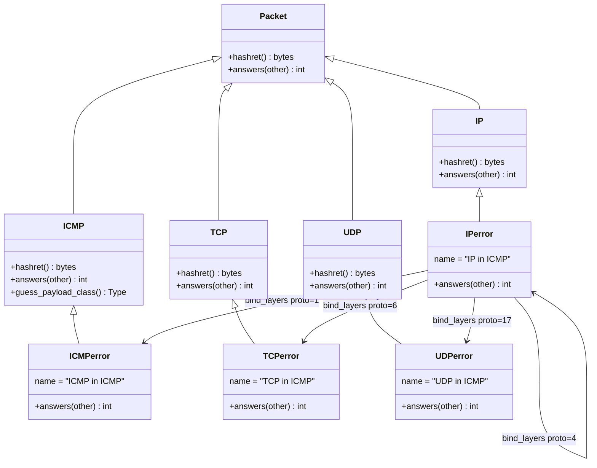

# Scapy ICMP Error Handling and Packet Matching: Deep-Dive Technical Analysis

## Purpose and Scope

This document provides comprehensive, code-grounded answers to six interconnected technical questions about Scapy's runtime behavior for ICMP error message handling and request-response packet matching. Every technical claim is traceable to specific source file line numbers in the Scapy codebase.

**Repository context:**
- **Branch:** `scapy_0925ada48540` (commit `0925ada4`)
- **Python requirement:** `>=3.7, <4` *(Source: pyproject.toml:17)*
- **License:** GPL-2.0-only

**Primary source files analyzed (read-only):**

| File | Role |
|------|------|
| `scapy/layers/inet.py` | IP, ICMP, TCP, UDP classes and error variants (`IPerror`, `ICMPerror`, `TCPerror`, `UDPerror`) with `hashret()` and `answers()` methods |
| `scapy/sendrecv.py` | `SndRcvHandler` class implementing the two-phase matching engine |
| `scapy/packet.py` | `Packet` base class and `NoPayload` with default `hashret()`/`answers()` implementations |
| `scapy/config.py` | `Conf` class with matching-related configuration flags |
| `scapy/contrib/icmp_extensions.py` | RFC 4884 ICMP extension parsing via `post_dissection` hooks |

---

## Table of Contents

- [Background: Scapy's Two-Phase Matching Architecture](#background-scapys-two-phase-matching-architecture)
- [Q1: ICMP Error Matching Strategy](#q1-icmp-error-matching-strategy)
- [Q2: Hashing Mechanism for Packet Matching](#q2-hashing-mechanism-for-packet-matching)
- [Q3: Modified Embedded Packet Tolerance](#q3-modified-embedded-packet-tolerance)
- [Q4: Configuration Settings and Runtime Behavior](#q4-configuration-settings-and-runtime-behavior)
- [Q5: Byte-Order Tolerance for IP ID](#q5-byte-order-tolerance-for-ip-id)
- [Q6: RFC 4884 Extension Parsing and Matching Impact](#q6-rfc-4884-extension-parsing-and-matching-impact)
- [Appendix: Error Variant Class Hierarchy](#appendix-error-variant-class-hierarchy)
- [Summary of Findings](#summary-of-findings)

---

## Background: Scapy's Two-Phase Matching Architecture

Scapy's send-and-receive functions (`sr`, `sr1`, `srp`, etc.) use a two-phase matching architecture to correlate received packets with previously sent requests. This architecture is implemented in the `SndRcvHandler` class. *(Source: scapy/sendrecv.py:100)*

### The SndRcvHandler Orchestrator

The `SndRcvHandler` class manages the complete send/receive lifecycle. Its critical data structure is the `hsent` dictionary, which maps hash keys (bytes) to lists of sent packets:

```python
# Source: scapy/sendrecv.py:168
self.hsent = {}  # type: Dict[bytes, List[Packet]]
```

**Send phase** — During packet transmission, each sent packet is hashed and stored in a bucket:

```python
# Source: scapy/sendrecv.py:244
self.hsent.setdefault(p.hashret(), []).append(p)
```

**Receive phase** — When a packet arrives, `_process_packet()` performs the two-phase match:

```python
# Source: scapy/sendrecv.py:270-301
def _process_packet(self, r):
    if r is None:
        return
    ok = False
    h = r.hashret()                    # Phase 1: compute hash key
    if h in self.hsent:                # Phase 1: O(1) bucket lookup
        hlst = self.hsent[h]
        for i, sentpkt in enumerate(hlst):
            if r.answers(sentpkt):     # Phase 2: precise field verification
                self.ans.append(QueryAnswer(sentpkt, r))  # Match found
                ok = True
                if not self.multi:
                    del hlst[i]
                    self.noans += 1
                # ...
                break
    if not ok:
        self.nbrecv += 1              # Unmatched packet
```

### Phase 1: `hashret()` — Hash Bucketing

The `hashret()` method produces a bytes key that must be **identical** for a request and its valid response. This enables O(1) bucket lookup to narrow the candidate set before expensive field-by-field comparison.

The hash chain traverses the entire layer stack via delegation:

- **`Packet.hashret()`** *(Source: scapy/packet.py:1215-1219)* — Base implementation delegates to the next layer:
  ```python
  def hashret(self):
      return self.payload.hashret()
  ```

- **`NoPayload.hashret()`** *(Source: scapy/packet.py:1812-1814)* — Terminal case returns empty bytes:
  ```python
  def hashret(self):
      return b""
  ```

Each protocol layer (IP, ICMP, TCP, UDP) overrides `hashret()` to inject protocol-specific fields into the hash key, then appends the result of `self.payload.hashret()`. The resulting key is the concatenation of all protocol-specific contributions down the layer stack.

### Phase 2: `answers()` — Precise Verification

After finding candidate packets in the hash bucket, the `answers()` method performs definitive field-by-field matching.

- **`Packet.answers()`** *(Source: scapy/packet.py:1221-1226)* — Base implementation: returns 0 unless the packets are the same class, in which case it delegates to payload:
  ```python
  def answers(self, other):
      if other.__class__ == self.__class__:
          return self.payload.answers(other.payload)
      return 0
  ```

- **`NoPayload.answers()`** *(Source: scapy/packet.py:1816-1818)* — Returns `True` if the other payload is also `NoPayload` or a padding layer:
  ```python
  def answers(self, other):
      return isinstance(other, (NoPayload, conf.padding_layer))
  ```

### Two-Phase Matching Architecture Flowchart



**Rationale:** This two-phase design is an optimization. The `hashret()` phase provides O(1) average-case lookup to avoid iterating all sent packets for every received packet. The `answers()` phase then performs the precise semantic check that confirms the match. The hash keys are designed so that a request and its legitimate response always produce the same key (via XOR symmetry and layer delegation), ensuring no false negatives at the bucketing stage.

---

## Q1: ICMP Error Matching Strategy

> **Question:** When an ICMP echo request is sent to an unreachable host and an ICMP destination unreachable error is received, how does Scapy determine whether the error response matches the original request? Does it extract the embedded original packet from the ICMP error payload and compare fields, or does it use a different strategy?

### Answer

**Yes, Scapy extracts the embedded original packet from the ICMP error payload and compares specific fields.** The strategy is NOT simple byte comparison but structured field-level extraction and comparison via the `answers()` delegation chain, using specialized error variant classes (`IPerror`, `TCPerror`, `UDPerror`, `ICMPerror`).

### How ICMP Error Types Are Detected

In `IP.hashret()`, Scapy detects ICMP error types and **skips the ICMP error layer entirely**, delegating directly to the embedded original packet:

```python
# Source: scapy/layers/inet.py:568-572
def hashret(self):
    if ((self.proto == socket.IPPROTO_ICMP) and
        (isinstance(self.payload, ICMP)) and
            (self.payload.type in [3, 4, 5, 11, 12])):
        return self.payload.payload.hashret()
```

The ICMP error types handled are:
- **Type 3** — Destination Unreachable
- **Type 4** — Source Quench
- **Type 5** — Redirect
- **Type 11** — Time Exceeded
- **Type 12** — Parameter Problem

When the IP payload is an ICMP message with one of these error types, `hashret()` calls `self.payload.payload.hashret()` — that is, it skips the ICMP error layer (`self.payload`) and goes directly to the **embedded original packet** (`self.payload.payload`). This embedded packet is the copy of the original IP header and partial payload that RFC 792 requires routers to include in ICMP error messages.

### How `IP.answers()` Handles ICMP Errors

The same detection logic appears in `IP.answers()`:

```python
# Source: scapy/layers/inet.py:600-604
if ((self.proto == socket.IPPROTO_ICMP) and
    (isinstance(self.payload, ICMP)) and
        (self.payload.type in [3, 4, 5, 11, 12])):
    # ICMP error message
    return self.payload.payload.answers(other)
```

Here, `self` is the received ICMP error packet's IP layer, and `other` is the original sent packet. The method delegates to the embedded original packet's `answers()` method (`self.payload.payload.answers(other)`), passing the **entire original sent packet** as `other`.

**Rationale:** This delegation design means the embedded packet (parsed as `IPerror`) compares itself against the original sent packet (parsed as `IP`). The error variant classes handle the comparison logic, knowing that fields may be modified or truncated by intermediate routers.

### Error Variant Class Parsing

When an ICMP error payload is dissected, `ICMP.guess_payload_class()` routes it to the `IPerror` class rather than plain `IP`:

```python
# Source: scapy/layers/inet.py:1000-1004
def guess_payload_class(self, payload):
    if self.type in [3, 4, 5, 11, 12]:
        return IPerror
    else:
        return None
```

The `IPerror` class then uses `bind_layers` to route its own payload to the appropriate error variant class based on protocol number:

```python
# Source: scapy/layers/inet.py:1107-1110
bind_layers(IPerror, IPerror, frag=0, proto=4)      # IP-in-IP
bind_layers(IPerror, ICMPerror, frag=0, proto=1)     # ICMP
bind_layers(IPerror, TCPerror, frag=0, proto=6)      # TCP
bind_layers(IPerror, UDPerror, frag=0, proto=17)     # UDP
```

This creates a parallel class hierarchy where each error variant class (`IPerror`, `TCPerror`, `UDPerror`, `ICMPerror`) inherits from its respective normal class (`IP`, `TCP`, `UDP`, `ICMP`) but overrides `answers()` to implement error-specific matching logic that is more tolerant of field modifications by intermediate routers.

### ICMP Error Layer Delegation Diagram

```mermaid
flowchart LR
    subgraph "Normal ICMP Reply Path"
        A1["IP.hashret()"] -->|"XOR(src,dst) + proto"| B1["ICMP.hashret()"]
        B1 -->|"pack(id, seq)"| C1["NoPayload.hashret()"]
        C1 -->|'b\"\"'| D1["Return concatenated key"]
    end

    subgraph "ICMP Error Path"
        A2["IP.hashret()"] -->|"type in 3,4,5,11,12"| B2["Skip ICMP error layer"]
        B2 -->|"self.payload.payload.hashret()"| C2["IPerror.hashret()"]
        C2 -->|"XOR(src,dst) + proto"| D2["ICMPerror/TCPerror/UDPerror.hashret()"]
        D2 --> E2["NoPayload.hashret()"]
    end

    subgraph "answers() Delegation"
        F1["IP.answers(other)"] -->|"type in 3,4,5,11,12"| G1["self.payload.payload.answers(other)"]
        G1 --> H1["IPerror.answers(original_IP)"]
        H1 -->|"checks src, dst, id, proto"| I1["TCPerror/UDPerror/ICMPerror.answers(original_payload)"]
    end
```

---

## Q2: Hashing Mechanism for Packet Matching

> **Question:** When Scapy processes an ICMP error message containing a copy of the original IP header and partial payload, what hash value does it generate, and how does this compare to the hash of the original outgoing packet?

### Answer

The hash keys are constructed by concatenating protocol-specific field contributions down the layer stack. Due to XOR symmetry in the IP and TCP layers, a request and its response (whether a normal reply or an ICMP error) produce **identical hash keys**.

### Hash Key Construction Per Layer

#### IP.hashret() — *(Source: scapy/layers/inet.py:568-581)*

`IP.hashret()` has five code paths, selected by the first matching condition:

| Condition | Hash Contribution | Lines |
|-----------|-------------------|-------|
| ICMP error (payload type in [3,4,5,11,12]) | `self.payload.payload.hashret()` — delegates to embedded packet | 569-572 |
| IP-in-IP with `checkIPinIP=False` | `self.payload.hashret()` — skips outer IP | 573-574 |
| mDNS (dst=224.0.0.251) | `struct.pack("B", proto) + payload.hashret()` | 575-576 |
| Normal (checkIPsrc=True AND checkIPaddr=True) | `strxor(inet_pton(src), inet_pton(dst)) + struct.pack("B", proto) + payload.hashret()` | 577-580 |
| Fallback | `struct.pack("B", proto) + payload.hashret()` | 581 |

**Key design:** The normal path uses `strxor()` (bitwise XOR) on the source and destination IP addresses. Since XOR is commutative (`A ⊕ B = B ⊕ A`), a packet from A→B produces the same hash contribution as a packet from B→A.

#### ICMP.hashret() — *(Source: scapy/layers/inet.py:986-989)*

```python
def hashret(self):
    if self.type in icmp_id_seq_types:
        return struct.pack("HH", self.id, self.seq) + self.payload.hashret()
    return self.payload.hashret()
```

Where `icmp_id_seq_types = [0, 8, 13, 14, 15, 16, 17, 18, 37, 38]` *(Source: scapy/layers/inet.py:949)*

- For ICMP types that carry ID and sequence fields (echo request/reply, timestamp, address mask, etc.), the hash includes `struct.pack("HH", id, seq)` using **native byte order** (no `!` prefix).
- For ICMP error types (3, 4, 5, 11, 12), which are NOT in `icmp_id_seq_types`, the hash simply delegates to `self.payload.hashret()`.

**Note:** `struct.pack("HH", ...)` uses native byte order, so the byte representation depends on the host's endianness. This is consistent because both the sent and received packets are hashed on the same machine.

#### TCP.hashret() — *(Source: scapy/layers/inet.py:788-792)*

```python
def hashret(self):
    if conf.checkIPsrc:
        return struct.pack("H", self.sport ^ self.dport) + self.payload.hashret()
    else:
        return self.payload.hashret()
```

The XOR of `sport ^ dport` is commutative: the sender's (sport=S, dport=D) produces the same value as the responder's (sport=D, dport=S), since `S ⊕ D = D ⊕ S`.

#### UDP.hashret() — *(Source: scapy/layers/inet.py:870-871)*

```python
def hashret(self):
    return self.payload.hashret()
```

UDP's `hashret()` does not include port information — it simply delegates to the payload. This means all UDP traffic between the same IP pair (with the same protocol) falls into the same hash bucket, relying entirely on `answers()` for discrimination.

#### Packet.hashret() / NoPayload.hashret()

- **`Packet.hashret()`** *(Source: scapy/packet.py:1215-1219)*: `return self.payload.hashret()` — just delegates.
- **`NoPayload.hashret()`** *(Source: scapy/packet.py:1812-1814)*: `return b""` — terminal case, returns empty bytes.

### Worked Example 1: ICMP Echo Request/Reply Pair

**Sent: ICMP echo request**
`IP(src="192.168.1.1", dst="10.0.0.1", proto=1) / ICMP(type=8, id=0x1234, seq=0x0001)`

1. **IP.hashret()**: ICMP type 8 is NOT in the error list [3,4,5,11,12] → normal path
   - `strxor(inet_pton("192.168.1.1"), inet_pton("10.0.0.1"))`
   - = `strxor(\xc0\xa8\x01\x01, \x0a\x00\x00\x01)` = **`\xca\xa8\x01\x00`**
   - + `struct.pack("B", 1)` = **`\x01`**
   - + ICMP.hashret()...

2. **ICMP.hashret()**: type 8 is in `icmp_id_seq_types` → includes id and seq
   - `struct.pack("HH", 0x1234, 0x0001)` = **`\x34\x12\x01\x00`** (little-endian native)
   - + NoPayload.hashret() = **`b""`**

3. **Total hash key**: `\xca\xa8\x01\x00` + `\x01` + `\x34\x12\x01\x00` = **`\xca\xa8\x01\x00\x01\x34\x12\x01\x00`**

**Received: ICMP echo reply**
`IP(src="10.0.0.1", dst="192.168.1.1", proto=1) / ICMP(type=0, id=0x1234, seq=0x0001)`

1. **IP.hashret()**: ICMP type 0 is NOT an error type → normal path
   - `strxor(\x0a\x00\x00\x01, \xc0\xa8\x01\x01)` = **`\xca\xa8\x01\x00`** ← SAME (XOR commutativity)
   - + `\x01` (proto)

2. **ICMP.hashret()**: type 0 is in `icmp_id_seq_types` → `\x34\x12\x01\x00`

3. **Total hash key**: **`\xca\xa8\x01\x00\x01\x34\x12\x01\x00`** — **IDENTICAL to request** ✓

### Worked Example 2: ICMP Destination Unreachable Error

**Sent: ICMP echo request** (same as above)
Hash key: `\xca\xa8\x01\x00\x01\x34\x12\x01\x00`

**Received: ICMP Destination Unreachable**
`IP(src="10.0.0.2", dst="192.168.1.1", proto=1) / ICMP(type=3, code=1) / IPerror(src="192.168.1.1", dst="10.0.0.1", proto=1) / ICMPerror(type=8, id=0x1234, seq=0x0001)`

1. **IP.hashret()**: proto is ICMP AND payload type is 3 (in error list [3,4,5,11,12]) → **ICMP error path**
   - Returns `self.payload.payload.hashret()` — delegates to `IPerror.hashret()`
   - Note: The outer IP's src/dst addresses (10.0.0.2, 192.168.1.1) are **completely ignored** by this path

2. **IPerror.hashret()**: IPerror inherits `IP.hashret()`. Its payload is `ICMPerror(type=8)`.
   - ICMPerror type 8 is NOT an error type → normal path
   - `strxor(\xc0\xa8\x01\x01, \x0a\x00\x00\x01)` = **`\xca\xa8\x01\x00`**
   - + `\x01` (proto)

3. **ICMPerror.hashret()**: ICMPerror inherits `ICMP.hashret()`. Type 8 is in `icmp_id_seq_types`.
   - `struct.pack("HH", 0x1234, 0x0001)` = `\x34\x12\x01\x00`

4. **Total hash key**: **`\xca\xa8\x01\x00\x01\x34\x12\x01\x00`** — **IDENTICAL to original request** ✓

**Rationale:** The ICMP error path in `IP.hashret()` bypasses the outer IP and ICMP error layers entirely, producing a hash key from the *embedded* original packet. Since the embedded packet contains the same addresses, protocol, and ICMP id/seq as the original request, the hash keys match exactly. This is the fundamental design insight: ICMP error responses are correlated not by the error envelope but by the embedded copy of the original packet.

---

## Q3: Modified Embedded Packet Tolerance

> **Question:** If an ICMP error response contains a subtly modified embedded original packet (e.g., changed TTL or checksum), does Scapy still consider it a valid match, or does the matching fail?

### Answer

**Scapy tolerates modified TTL and checksum in embedded packets.** These fields are NOT compared in any `answers()` method. A subtly modified embedded packet with changed TTL or checksum WILL still match. However, changing fields that ARE explicitly checked (src, dst, proto, id, ports — depending on configuration) will cause matching to FAIL.

### Fields Checked by `IPerror.answers()`

*(Source: scapy/layers/inet.py:1016-1034)*

```python
class IPerror(IP):
    name = "IP in ICMP"

    def answers(self, other):
        if not isinstance(other, IP):
            return 0

        # Check if IP addresses match
        test_IPsrc = not conf.checkIPsrc or self.src == other.src
        test_IPdst = self.dst == other.dst

        # Check if IP ids match
        test_IPid = not conf.checkIPID or self.id == other.id
        test_IPid |= conf.checkIPID and self.id == socket.htons(other.id)

        # Check if IP protocols match
        test_IPproto = self.proto == other.proto

        if not (test_IPsrc and test_IPdst and test_IPid and test_IPproto):
            return 0

        return self.payload.answers(other.payload)
```

**Fields CHECKED by `IPerror.answers()`:**

| Field | Check | Condition | Line |
|-------|-------|-----------|------|
| `src` (source IP) | `self.src == other.src` | Gated by `conf.checkIPsrc` | 1021 |
| `dst` (destination IP) | `self.dst == other.dst` | **Always checked** | 1022 |
| `id` (IP identification) | `self.id == other.id` OR byte-swapped | Gated by `conf.checkIPID` | 1025-1026 |
| `proto` (protocol number) | `self.proto == other.proto` | **Always checked** | 1029 |

**Fields IGNORED by `IPerror.answers()`:**

| Field | Status |
|-------|--------|
| TTL | **NOT checked** — routers decrement TTL, so the embedded copy typically has a different TTL |
| Checksum | **NOT checked** — recalculated values or truncated packets cause checksum differences |
| TOS/DSCP | **NOT checked** |
| Total Length | **NOT checked** |
| Flags (DF, MF) | **NOT checked** |
| Fragment Offset | **NOT checked** (though `bind_layers` requires `frag=0` for protocol dispatch) |
| Options | **NOT checked** |
| Version | **NOT checked** (implicitly same since both parsed as IP) |
| IHL | **NOT checked** |

### Fields Checked by `TCPerror.answers()`

*(Source: scapy/layers/inet.py:1043-1057)*

```python
class TCPerror(TCP):
    name = "TCP in ICMP"

    def answers(self, other):
        if not isinstance(other, TCP):
            return 0
        if conf.checkIPsrc:
            if not ((self.sport == other.sport) and
                    (self.dport == other.dport)):
                return 0
        if conf.check_TCPerror_seqack:
            if self.seq is not None:
                if self.seq != other.seq:
                    return 0
            if self.ack is not None:
                if self.ack != other.ack:
                    return 0
        return 1
```

| Field | Check | Condition | Lines |
|-------|-------|-----------|-------|
| `sport` (source port) | `self.sport == other.sport` | Gated by `conf.checkIPsrc` | 1046-1048 |
| `dport` (dest port) | `self.dport == other.dport` | Gated by `conf.checkIPsrc` | 1046-1048 |
| `seq` (sequence number) | `self.seq != other.seq` | Gated by `conf.check_TCPerror_seqack` | 1050-1053 |
| `ack` (acknowledgment) | `self.ack != other.ack` | Gated by `conf.check_TCPerror_seqack` | 1054-1056 |

**Fields IGNORED:** window, flags, checksum, urgent pointer, options, data offset.

**Note:** Port comparison is gated by `conf.checkIPsrc` (not a separate flag). This means disabling `checkIPsrc` disables BOTH source IP checking in `IPerror` AND port checking in `TCPerror`. *(Source: scapy/layers/inet.py:1046)*

### Fields Checked by `UDPerror.answers()`

*(Source: scapy/layers/inet.py:1066-1073)*

```python
class UDPerror(UDP):
    name = "UDP in ICMP"

    def answers(self, other):
        if not isinstance(other, UDP):
            return 0
        if conf.checkIPsrc:
            if not ((self.sport == other.sport) and
                    (self.dport == other.dport)):
                return 0
        return 1
```

| Field | Check | Condition | Lines |
|-------|-------|-----------|-------|
| `sport` (source port) | `self.sport == other.sport` | Gated by `conf.checkIPsrc` | 1069-1071 |
| `dport` (dest port) | `self.dport == other.dport` | Gated by `conf.checkIPsrc` | 1069-1071 |

**Fields IGNORED:** length, checksum.

### Fields Checked by `ICMPerror.answers()`

*(Source: scapy/layers/inet.py:1082-1095)*

```python
class ICMPerror(ICMP):
    name = "ICMP in ICMP"

    def answers(self, other):
        if not isinstance(other, ICMP):
            return 0
        if not ((self.type == other.type) and
                (self.code == other.code)):
            return 0
        if self.code in [0, 8, 13, 14, 17, 18]:
            if (self.id == other.id and
                    self.seq == other.seq):
                return 1
            else:
                return 0
        else:
            return 1
```

| Field | Check | Condition | Lines |
|-------|-------|-----------|-------|
| `type` | `self.type == other.type` | **Always checked** | 1085-1086 |
| `code` | `self.code == other.code` | **Always checked** | 1085-1086 |
| `id` | `self.id == other.id` | Only when `self.code in [0, 8, 13, 14, 17, 18]` | 1088-1090 |
| `seq` | `self.seq == other.seq` | Only when `self.code in [0, 8, 13, 14, 17, 18]` | 1088-1090 |

**Fields IGNORED:** checksum.

**Code observation:** Line 1088 checks `self.code in [0, 8, 13, 14, 17, 18]` — note this tests the `code` field, not `type`. The values `[0, 8, 13, 14, 17, 18]` correspond to ICMP *types* that carry id/seq fields (echo-reply=0, echo-request=8, timestamp-request=13, timestamp-reply=14, address-mask-request=17, address-mask-reply=18). However, the code checks `self.code`. In practice, most ICMP messages that reach this path have `code=0`, which is in the list, so id/seq are checked for the most common case. *(Source: scapy/layers/inet.py:1088)*

### Comprehensive Field Comparison Matrix

| IP Header Field | IPerror | TCPerror | UDPerror | ICMPerror |
|----------------|---------|----------|----------|-----------|
| src address | ✅ (gated by `checkIPsrc`) | — | — | — |
| dst address | ✅ (always) | — | — | — |
| IP ID | ✅ (gated by `checkIPID`) | — | — | — |
| Protocol | ✅ (always) | — | — | — |
| TTL | ❌ ignored | — | — | — |
| Checksum | ❌ ignored | ❌ ignored | ❌ ignored | ❌ ignored |
| TOS/DSCP | ❌ ignored | — | — | — |
| Flags | ❌ ignored | — | — | — |
| Total Length | ❌ ignored | — | — | — |
| sport | — | ✅ (gated by `checkIPsrc`) | ✅ (gated by `checkIPsrc`) | — |
| dport | — | ✅ (gated by `checkIPsrc`) | ✅ (gated by `checkIPsrc`) | — |
| TCP seq | — | ✅ (gated by `check_TCPerror_seqack`) | — | — |
| TCP ack | — | ✅ (gated by `check_TCPerror_seqack`) | — | — |
| ICMP type | — | — | — | ✅ (always) |
| ICMP code | — | — | — | ✅ (always) |
| ICMP id | — | — | — | ✅ (conditional on `code`) |
| ICMP seq | — | — | — | ✅ (conditional on `code`) |
| Window/Flags/Options | — | ❌ ignored | ❌ ignored | — |
| UDP length | — | — | ❌ ignored | — |

**Legend:** ✅ = checked, ❌ = not checked, — = not applicable to this layer

**Rationale for tolerance:** RFC 792 states that ICMP error messages must include "the internet header plus the first 64 bits of the original datagram's data." Routers may modify certain fields (TTL is decremented during forwarding), recalculate checksums, or truncate headers. By only checking fields that identify the flow (addresses, ports, protocol) rather than fields that change in transit (TTL, checksum), Scapy achieves robust matching that works with real-world network behavior.

---

## Q4: Configuration Settings and Runtime Behavior

> **Question:** What runtime behavior is observed when `conf.checkIPsrc`, `conf.checkIPID`, and `conf.check_TCPerror_seqack` are toggled? How do these settings affect which packets Scapy considers valid responses, and what trade-offs exist between strict matching and tolerating real-world network variations?

### Answer

Five configuration flags in `scapy/config.py` control matching strictness. Each gates specific field comparisons in the `hashret()` and `answers()` methods.

### `conf.checkIPID` — IP Identification Check

*(Source: scapy/config.py:743-748)*

```python
#: if 0, doesn't check that IPID matches between IP sent and
#: ICMP IP citation received
#: if 1, checks that they either are equal or byte swapped
#: equals (bug in some IP stacks)
#: if 2, strictly checks that they are equals
checkIPID = False
```

**Default:** `False` (equivalent to `0`) — IP ID checking is **disabled**.

**Behavior in `IPerror.answers()`** *(Source: scapy/layers/inet.py:1025-1026)*:

| `checkIPID` value | `not conf.checkIPID` | Exact match checked? | Byte-swap checked? | Effect |
|-------------------|---------------------|---------------------|-------------------|--------|
| `0` / `False` | `True` | No (short-circuited) | No | IP ID is **ignored** |
| `1` / `True` | `False` | Yes | Yes | Accept exact OR byte-swapped |
| `2` | `False` (2 is truthy) | Yes | **Yes** (same as mode 1) | Accept exact OR byte-swapped |

**⚠️ Implementation discrepancy:** The config comment claims mode 2 "strictly checks that they are equals" (no byte-swap tolerance), but the implementation treats modes 1 and 2 identically. See [Q5](#q5-byte-order-tolerance-for-ip-id) for detailed analysis.

### `conf.checkIPsrc` — Source IP and Port Check

*(Source: scapy/config.py:749-751)*

```python
#: if 1, checks IP src in IP and ICMP IP citation match
#: (bug in some NAT stacks)
checkIPsrc = True
```

**Default:** `True` — Source IP checking is **enabled**.

**Effects across multiple methods:**

| Method | Effect when `True` | Effect when `False` | Source |
|--------|-------------------|-------------------|--------|
| `IPerror.answers()` | Checks `self.src == other.src` | Skips source IP comparison | inet.py:1021 |
| `TCPerror.answers()` | Checks sport and dport match | Skips port comparison entirely | inet.py:1046-1048 |
| `UDPerror.answers()` | Checks sport and dport match | Skips port comparison entirely | inet.py:1069-1071 |
| `IP.hashret()` | Includes `strxor(src, dst)` in hash key | Omits IP addresses from hash key | inet.py:577 |
| `TCP.hashret()` | Includes `sport ^ dport` in hash key | Omits ports from hash key | inet.py:789 |
| `TCP.answers()` | Checks `sport==other.dport` and `dport==other.sport` | Skips port comparison | inet.py:810-813 |
| `UDP.answers()` | Checks `self.dport != other.sport` | Skips port comparison | inet.py:876-878 |

**Trade-off:** Disabling `checkIPsrc` allows matches through NAT devices (where the source IP is rewritten), but significantly increases false positive risk because both `IPerror` source IP and `TCPerror`/`UDPerror` port comparisons are bypassed.

### `conf.checkIPaddr` — IP Address Check in hashret/answers

*(Source: scapy/config.py:752)*

```python
checkIPaddr = True
```

**Default:** `True` — IP address checking is **enabled**.

**Effects:**

| Method | Effect when `True` | Effect when `False` | Source |
|--------|-------------------|-------------------|--------|
| `IP.hashret()` | Includes `strxor(src, dst)` in hash key (with checkIPsrc) | Omits IP addresses from hash key | inet.py:577 |
| `IP.answers()` | Checks `self.dst != other.src` → return 0 | Skips address verification | inet.py:595-599 |
| `IP.answers()` | Checks `self.src != other.dst` → return 0 | Skips address verification | inet.py:607 |

**Trade-off:** Disabling removes ALL IP address verification from the normal (non-error) matching path. This is the most aggressive relaxation — it effectively matches packets purely by protocol and payload.

### `conf.checkIPinIP` — IP-in-IP Encapsulation Check

*(Source: scapy/config.py:753-755)*

```python
#: if True, checks that IP-in-IP layers match. If False, do
#: not check IP layers that encapsulates another IP layer
checkIPinIP = True
```

**Default:** `True` — IP-in-IP encapsulation checking is **enabled**.

**Effects:**

| Method | Effect when `True` | Effect when `False` | Source |
|--------|-------------------|-------------------|--------|
| `IP.hashret()` | Normal processing | For proto 4 (IP) or 41 (IPv6): skips outer IP, delegates to `self.payload.hashret()` | inet.py:573-574 |
| `IP.answers()` | Normal processing | Unwraps IP-in-IP and IPv6-in-IP: delegates to inner layer | inet.py:584-592 |

**Trade-off:** Disabling allows matching on the inner tunnel payload when IP-in-IP or IPv6-in-IP encapsulation is present, ignoring the outer tunnel headers.

### `conf.check_TCPerror_seqack` — TCP Sequence/Acknowledgment Check

*(Source: scapy/config.py:756-758)*

```python
#: if 1, also check that TCP seq and ack match the
#: ones in ICMP citation
check_TCPerror_seqack = False
```

**Default:** `False` — TCP seq/ack checking is **disabled**.

**Effect in `TCPerror.answers()`** *(Source: scapy/layers/inet.py:1050-1056)*:
- When `True`: Checks `self.seq == other.seq` and `self.ack == other.ack` (with null-safety via `is not None` checks)
- When `False`: Skips seq/ack comparison

**Trade-off:** Enabling provides stronger matching but may reject legitimate ICMP errors from routers that truncate TCP headers. Per RFC 792, routers must include only "the first 64 bits of the original datagram's data" — for TCP this covers only the source port, destination port, and sequence number (first 12 of the 20-byte header minimum), so the acknowledgment field may be truncated or zeroed by some implementations.

### Configuration Interaction Matrix

| Config Flag | Default | IPerror.answers() | TCPerror.answers() | UDPerror.answers() | ICMPerror.answers() | IP.hashret() | TCP.hashret() |
|---|---|---|---|---|---|---|---|
| `checkIPsrc` | `True` | Gates src IP check | Gates sport/dport check | Gates sport/dport check | No effect | Gates `strxor(src,dst)` inclusion | Gates `sport^dport` inclusion |
| `checkIPID` | `0`/`False` | Gates IP ID check (with byte-swap) | No effect | No effect | No effect | No effect | No effect |
| `checkIPaddr` | `True` | No effect | No effect | No effect | No effect | Gates `strxor(src,dst)` inclusion | No effect |
| `checkIPinIP` | `True` | No effect | No effect | No effect | No effect | Gates IP-in-IP unwrap | No effect |
| `check_TCPerror_seqack` | `False` | No effect | Gates seq/ack check | No effect | No effect | No effect | No effect |

### Matching Strictness Profiles

**Strict profile** (all enabled, `checkIPID=2`):
- Most precise matching — checks IP addresses, IP ID, ports, TCP seq/ack
- Risk: May miss legitimate responses through NAT, buggy IP stacks with byte-swapped IDs, or routers that truncate TCP headers
- Note: Due to the implementation discrepancy, `checkIPID=2` provides the same behavior as `checkIPID=1` (byte-swap tolerance is still active)

**Default profile** (`checkIPsrc=True`, `checkIPaddr=True`, `checkIPinIP=True`, `checkIPID=0`, `check_TCPerror_seqack=False`):
- Pragmatic balance — checks addresses and ports but ignores IP ID and TCP seq/ack in ICMP errors
- Tolerates common real-world variations (routers modifying IP ID, truncating TCP headers)
- Good false-positive resistance via address and port checking

**Loose profile** (all disabled):
- Maximum tolerance — matches only on protocol and payload structure
- Highest false-positive risk — may match unrelated packets
- Useful for debugging in complex network environments with heavy NAT, tunneling, or broken stacks

---

## Q5: Byte-Order Tolerance for IP ID

> **Question:** Under what exact conditions does Scapy accept a byte-swapped IP ID value in an ICMP error's embedded header as a match, and what numeric transformation relates the original ID to the alternative accepted value?

### Answer

Scapy accepts a byte-swapped IP ID when `conf.checkIPID` is truthy (value 1 or 2). The transformation is `socket.htons()`, which swaps the two bytes of a 16-bit integer on little-endian hosts.

### The Exact Code

*(Source: scapy/layers/inet.py:1025-1026)*

```python
test_IPid = not conf.checkIPID or self.id == other.id
test_IPid |= conf.checkIPID and self.id == socket.htons(other.id)
```

### Step-by-Step Evaluation

**Line 1025:** `test_IPid = not conf.checkIPID or self.id == other.id`

This uses Python's short-circuit evaluation:

| `conf.checkIPID` | `not conf.checkIPID` | Evaluation | `test_IPid` |
|---|---|---|---|
| `0` / `False` | `True` | Short-circuits to `True` | `True` (ID check skipped) |
| `1` / `True` | `False` | Evaluates `self.id == other.id` | `True` if exact match, else `False` |
| `2` | `False` (2 is truthy) | Evaluates `self.id == other.id` | `True` if exact match, else `False` |

**Line 1026:** `test_IPid |= conf.checkIPID and self.id == socket.htons(other.id)`

The `|=` operator is bitwise OR assignment. Since Python booleans are integers (`True=1`, `False=0`), this OR's the byte-swap check into the result:

| `conf.checkIPID` | `conf.checkIPID and ...` | Evaluation |
|---|---|---|
| `0` / `False` | Short-circuits to `0` (falsy) | `test_IPid` unchanged (already `True` from line 1025) |
| `1` / `True` | Evaluates `self.id == socket.htons(other.id)` | If byte-swap matches, `test_IPid` becomes `True` |
| `2` | `2 and ...` → evaluates RHS (2 is truthy) | If byte-swap matches, `test_IPid` becomes `True` |

**Combined result:** When `checkIPID` is truthy, `test_IPid` is `True` if EITHER the exact ID matches OR the byte-swapped ID matches.

### The `socket.htons()` Transformation

`socket.htons()` converts a 16-bit integer from **host byte order** to **network byte order** (big-endian). On little-endian systems (most x86/x64 processors), this swaps the two bytes:

```
Host byte order (little-endian):   0xAABB  →  stored as [BB, AA]
Network byte order (big-endian):   0xBBAA  →  stored as [BB, AA]
```

The numeric transformation: `htons(0xAABB)` = `0xBBAA` on little-endian hosts.

On big-endian hosts, `htons()` is a no-op: `htons(0xAABB)` = `0xAABB`.

### Numerical Worked Example

**Scenario:** Original packet sent with IP ID = `0x1234` (decimal 4660). An intermediate router generates an ICMP error with the embedded IP ID byte-swapped to `0x3412` (decimal 13330) — a known bug in some IP stack implementations.

**On a little-endian host:**

```
Original IP ID:     0x1234
other.id:           0x1234
socket.htons(0x1234) = 0x3412

self.id (from embedded packet): 0x3412
self.id == other.id?            0x3412 == 0x1234 → False
self.id == htons(other.id)?     0x3412 == 0x3412 → True ✓

Result: test_IPid = True (match accepted via byte-swap tolerance)
```

**The relationship:** If the original ID is `X`, the byte-swapped alternative is `htons(X)`. The two values are related by:
- `htons(X) = ((X & 0xFF) << 8) | ((X >> 8) & 0xFF)`
- Example: `htons(0x1234)` = `(0x34 << 8) | 0x12` = `0x3400 | 0x0012` = `0x3412`

### Implementation Discrepancy: Mode 1 vs Mode 2

The config comment *(Source: scapy/config.py:743-747)* documents three modes:

| Mode | Documented behavior |
|------|-------------------|
| `0` | Don't check IP ID |
| `1` | Check equal OR byte-swapped equal |
| `2` | **Strictly** check equal only (no byte-swap tolerance) |

**However, the implementation does NOT distinguish mode 1 from mode 2.**

The code at *(Source: scapy/layers/inet.py:1025-1026)*:
```python
test_IPid = not conf.checkIPID or self.id == other.id
test_IPid |= conf.checkIPID and self.id == socket.htons(other.id)
```

When `conf.checkIPID = 2`:
- Line 1025: `not 2` → `False` → evaluates `self.id == other.id`
- Line 1026: `2 and self.id == socket.htons(other.id)` → `2` is truthy → evaluates the byte-swap check
- Result: **SAME behavior as mode 1** — both allow byte-swap tolerance

To implement mode 2 correctly (strict equality only), line 1026 would need to be:
```python
test_IPid |= conf.checkIPID == 1 and self.id == socket.htons(other.id)
```

This would restrict the byte-swap check to mode 1 only, making mode 2 truly strict. **This is a code-level finding: the strict mode documented in the config comment is not actually implemented.**

---

## Q6: RFC 4884 Extension Parsing and Matching Impact

> **Question:** When an ICMP error packet exceeds a certain size threshold and contains additional structured data per RFC 4884, does loading Scapy's extension parsing (`load_contrib("icmp_extensions")`) alter the packet structure in a way that changes whether the response is considered a valid match?

### Answer

**No, loading `load_contrib("icmp_extensions")` does NOT alter whether a response is considered a valid match.** The extension parsing operates on padding data via `post_dissection` hooks and does not modify any fields that `hashret()` or `answers()` examine.

### How `load_contrib("icmp_extensions")` Works

When `load_contrib("icmp_extensions")` is called, it imports `scapy/contrib/icmp_extensions.py`. At module level, this file monkey-patches `post_dissection` methods onto the error variant classes:

```python
# Source: scapy/contrib/icmp_extensions.py:176-181
scapy.layers.inet.ICMPerror.post_dissection = ICMPExtension_post_dissection
scapy.layers.inet.TCPerror.post_dissection = ICMPExtension_post_dissection
scapy.layers.inet.UDPerror.post_dissection = ICMPExtension_post_dissection

scapy.layers.inet6.ICMPv6DestUnreach.post_dissection = ICMPExtension_post_dissection
scapy.layers.inet6.ICMPv6TimeExceeded.post_dissection = ICMPExtension_post_dissection
```

### The `ICMPExtension_post_dissection()` Function

*(Source: scapy/contrib/icmp_extensions.py:67-98)*

```python
def ICMPExtension_post_dissection(self, pkt):
    # RFC4884 section 5.2 says if the ICMP packet length
    # is >144 then ICMP extensions start at byte 137.

    lastlayer = pkt.lastlayer()
    if not isinstance(lastlayer, conf.padding_layer):
        return                          # No padding → no extensions possible

    if IP in pkt:
        if (ICMP in pkt and
            pkt[ICMP].type in [3, 11, 12] and
                pkt.len > 144):         # Size threshold: >144 bytes
            bytes = pkt[ICMP].build()[136:]  # Extensions start at byte 137 (offset 136)
        else:
            return
    # ... IPv6 handling omitted for brevity ...
    else:
        return

    # validate checksum
    ieh = ICMPExtensionHeader(bytes)
    if checksum(ieh.build()):
        return  # failed checksum validation

    lastlayer.load = lastlayer.load[:-len(ieh)]  # Trim padding
    lastlayer.add_payload(ieh)                     # Append parsed extension header
```

**Trigger conditions:**
1. The last layer of the packet must be a padding layer (`conf.padding_layer`) *(line 72)*
2. The packet must contain an IP layer with an ICMP layer *(lines 75-76)*
3. The ICMP type must be 3 (Destination Unreachable), 11 (Time Exceeded), or 12 (Parameter Problem) *(line 77)*
4. The IP packet length must be > 144 bytes *(line 78)*
5. The parsed extension header must pass checksum validation *(lines 93-95)*

### Why Matching Is Unaffected

**1. `post_dissection` runs AFTER full dissection** — It is called after all layers have been parsed and their fields set. The `hashret()` and `answers()` methods operate on the already-parsed layer fields, not on raw bytes.

**2. Extension parsing modifies only the padding layer** — Lines 97-98 show that the function trims the `lastlayer.load` (padding bytes) and appends the `ICMPExtensionHeader` as a new payload of the padding layer. It does NOT modify any fields of `IPerror`, `TCPerror`, `UDPerror`, or `ICMPerror`.

**3. Fields checked by `answers()` are untouched:**

| Error Variant | Fields Checked | Modified by Extension Parsing? |
|---|---|---|
| `IPerror.answers()` | src, dst, id, proto | ❌ No |
| `TCPerror.answers()` | sport, dport, seq, ack | ❌ No |
| `UDPerror.answers()` | sport, dport | ❌ No |
| `ICMPerror.answers()` | type, code, id, seq | ❌ No |

**4. `hashret()` chain is unaffected** — The `hashret()` method traverses layers via `self.payload.hashret()`. With extensions loaded, the layer chain becomes: `...ErrorVariant → Padding → ICMPExtensionHeader → NoPayload`. Without extensions, it's: `...ErrorVariant → Padding → NoPayload`. In both cases:
- The extension header's `hashret()` (inherited from `Packet.hashret()`) delegates to its payload's `hashret()`.
- The chain still terminates at `NoPayload.hashret()` returning `b""`.
- The intermediate extension header contributes nothing to the hash key (it has no `hashret()` override).
- The padding layer's `hashret()` similarly just delegates downward.

Therefore, the hash key is identical whether or not extension parsing is loaded.

### Extension Types Supported

When extensions are parsed, the following types are recognized:

| Extension | Class | classnum | classtype | RFC | Source |
|---|---|---|---|---|---|
| MPLS Label Stack | `ICMPExtensionMPLS` | 1 | 1 | RFC 4950 | icmp_extensions.py:101-108 |
| Interface Information | `ICMPExtensionInterfaceInformation` | 2 | (any) | RFC 5837 | icmp_extensions.py:111-171 |

```python
# Source: scapy/contrib/icmp_extensions.py:186-187
bind_layers(ICMPExtensionHeader, ICMPExtensionMPLS, classnum=1, classtype=1)
bind_layers(ICMPExtensionHeader, ICMPExtensionInterfaceInformation, classnum=2)
```

**Rationale:** The extension parsing is purely a dissection-time convenience that provides structured access to MPLS and interface information data in ICMP error packets. Since it only reinterprets padding bytes as structured data — without modifying the core protocol fields — it has zero impact on the matching algorithm. This is an elegant design: the matching logic and extension parsing are completely orthogonal.

---

## Appendix: Error Variant Class Hierarchy

The error variant classes form a parallel class hierarchy alongside the normal protocol classes. Each error variant inherits from its parent protocol class but overrides `answers()` with error-specific matching logic.



**Key observations:**

1. **Error variants do NOT override `hashret()`** — They inherit their parent's `hashret()` implementation. `IPerror` uses `IP.hashret()`, `TCPerror` uses `TCP.hashret()`, etc. *(Source: scapy/layers/inet.py:1013, 1040, 1063, 1079 — no hashret override in any error variant class)*

2. **Error variants ONLY override `answers()`** — Each implements error-specific field checking that is more tolerant than the normal class's `answers()`:
   - `IPerror.answers()` *(line 1016)* checks a configurable subset of IP fields
   - `TCPerror.answers()` *(line 1043)* checks ports and optionally seq/ack
   - `UDPerror.answers()` *(line 1066)* checks only ports
   - `ICMPerror.answers()` *(line 1082)* checks type, code, and conditionally id/seq

3. **`bind_layers` creates the dispatch chain** *(Source: scapy/layers/inet.py:1107-1110)*: When `IPerror` parses its payload, `bind_layers` ensures the next layer is the correct error variant based on `proto` and `frag=0`.

---

## Summary of Findings

### Answers to the Six Questions

1. **Q1 — ICMP Error Matching Strategy:** Scapy **extracts the embedded original packet** from the ICMP error payload using error variant classes (`IPerror`, `TCPerror`, `UDPerror`, `ICMPerror`). Both `hashret()` and `answers()` in `IP` detect ICMP error types [3, 4, 5, 11, 12] and delegate to `self.payload.payload` — the embedded original packet — bypassing the ICMP error layer entirely. Matching is performed by structured field-level comparison, not byte comparison.

2. **Q2 — Hashing Mechanism:** The hash key is constructed by concatenating protocol-specific fields down the layer stack: `strxor(src, dst)` at IP level (ensuring XOR commutativity), protocol byte, `struct.pack("HH", id, seq)` at ICMP level, and `struct.pack("H", sport ^ dport)` at TCP level. For ICMP errors, `IP.hashret()` skips the error envelope and hashes the embedded packet, producing a key **identical** to the original request's key.

3. **Q3 — Modified Embedded Packet Tolerance:** Scapy is **highly tolerant** of modifications. TTL, checksum, TOS, flags, fragment offset, total length, IP options, TCP window/flags/options, and UDP length/checksum are all **ignored**. Only src (configurable), dst, IP ID (configurable), protocol, ports (configurable), and TCP seq/ack (configurable) are checked.

4. **Q4 — Configuration Settings:** Five flags control matching strictness: `checkIPsrc` (default `True`), `checkIPID` (default `False`), `checkIPaddr` (default `True`), `checkIPinIP` (default `True`), and `check_TCPerror_seqack` (default `False`). The defaults represent a pragmatic balance: strict enough for address/port verification but tolerant of IP ID variations and TCP header truncation in ICMP errors. Notably, `checkIPsrc` controls port checking in `TCPerror` and `UDPerror` in addition to source IP checking in `IPerror`.

5. **Q5 — Byte-Order Tolerance:** When `conf.checkIPID` is truthy (1 or 2), Scapy accepts an IP ID that matches either exactly (`self.id == other.id`) or via `socket.htons()` byte-swap (`self.id == socket.htons(other.id)`). This tolerates bugs in IP stacks that byte-swap the IP ID in ICMP error citations. **Implementation discrepancy discovered:** The config comment documents mode 2 as "strictly checks that they are equals" but the code treats modes 1 and 2 identically — both allow byte-swap tolerance. There is no special `conf.checkIPID == 2` branch in the implementation.

6. **Q6 — RFC 4884 Extension Parsing:** Loading `load_contrib("icmp_extensions")` adds `post_dissection` hooks to error variant classes that parse ICMP extensions when `pkt.len > 144` and the ICMP type is in [3, 11, 12]. This parsing reinterprets padding bytes as structured extension data (MPLS labels, interface information) but does **NOT** modify any fields used by `hashret()` or `answers()`. The matching algorithm is completely unaffected by whether extension parsing is loaded.

### Key Implementation Findings

- **Two-phase architecture:** `hashret()` provides O(1) bucketing; `answers()` provides precise verification. Both are required for correctness.
- **XOR symmetry in hashret:** Ensures request and response produce identical hash keys via commutative XOR on IP addresses and TCP ports.
- **ICMP error layer bypass:** Both `hashret()` and `answers()` skip the ICMP error envelope entirely, operating on the embedded original packet copy.
- **High tolerance for real-world variations:** TTL, checksum, and many IP/TCP/UDP header fields are intentionally NOT checked.
- **`checkIPID` mode 2 discrepancy:** Strict mode is documented in `scapy/config.py:747` but not implemented in `scapy/layers/inet.py:1025-1026` — modes 1 and 2 behave identically.
- **`ICMPerror.answers()` checks `self.code`:** Line 1088 checks `self.code in [0, 8, 13, 14, 17, 18]` to decide whether to verify id/seq — the values correspond to ICMP types but the field tested is `code`.
- **RFC 4884 extension parsing is orthogonal to matching:** It operates on padding data after dissection and does not touch matching-relevant fields.

---

*All findings are derived from read-only source code analysis of the Scapy codebase on branch `scapy_0925ada48540`. No Scapy source files were modified.*
