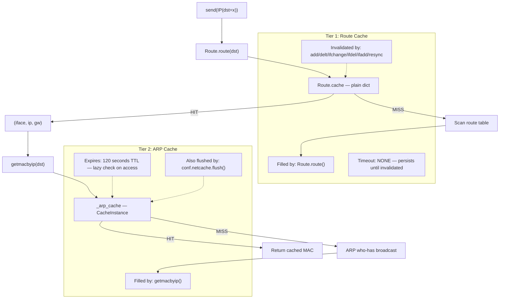
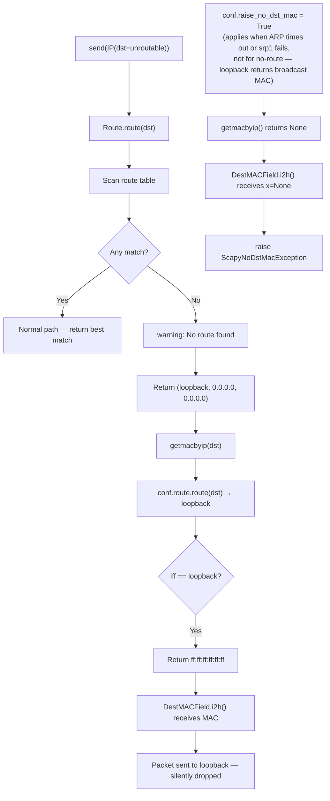

# Scapy Internal Routing and ARP Resolution — Technical Q&A

This document is a **deep-code-analysis Q&A report** tracing Scapy's internal packet-routing and ARP-resolution behavior. Every answer is grounded in the actual source code — no assumptions, only code-as-truth.

**Analysis branch:** `scapy_0925ada48540`
**Runtime:** Python 3.11 on Linux

---

## Table of Contents

- [Introduction and Environment Setup](#introduction-and-environment-setup)
- [Q1: Interface Selection Without Explicit Parameter](#q1-interface-selection-without-explicit-parameter)
- [Q2: MAC Address Resolution for External Destinations](#q2-mac-address-resolution-for-external-destinations)
- [Q3: ARP Behavior on Rapid Repeated Sends](#q3-arp-behavior-on-rapid-repeated-sends)
- [Q4: Sending to an Unroutable Destination](#q4-sending-to-an-unroutable-destination)
- [References](#references)

---

## Introduction and Environment Setup

### Purpose

This document answers four targeted questions about Scapy's internal behavior when sending packets:

1. **Interface Selection** — How does Scapy choose the outgoing network interface when none is explicitly specified?
2. **MAC Address Resolution** — Once an interface and gateway are identified, how does Scapy resolve the next-hop MAC address via ARP?
3. **ARP Caching** — When the same packet is sent twice in quick succession, does Scapy re-ARP or use a cache?
4. **No-Route Error Handling** — What happens when a packet is sent to a destination with no matching route?

### Environment Setup

To reproduce the analysis, install Scapy from the repository into a virtual environment:

```bash
python3.11 -m venv /tmp/scapy_venv
source /tmp/scapy_venv/bin/activate
pip install -e .
```

Validate the installation by starting an interactive session:

```python
>>> from scapy.all import *
>>> conf.route
```

This should display the system's routing table as parsed by Scapy. The output format is:

```
Network       Netmask        Gateway       Iface  Output IP    Metric
0.0.0.0       0.0.0.0        10.0.2.2      eth0   10.0.2.15    100
10.0.2.0      255.255.255.0  0.0.0.0       eth0   10.0.2.15    100
127.0.0.0     255.0.0.0      0.0.0.0       lo     127.0.0.1    1
```

### Source Code Conventions

Throughout this document, source citations use the format:

> `Source: scapy/route.py:146-197`

This means "file `scapy/route.py`, lines 146 through 197." Function signatures are provided so readers can locate the code independently of line-number drift.

---

## Q1: Interface Selection Without Explicit Parameter

### Summary

When you call `send(IP(dst="8.8.8.8"))` without specifying an `iface` parameter, Scapy performs a **four-step resolution chain**:

1. `send()` calls `_interface_selection(iface=None, packet)`.
2. `_interface_selection()` extracts the first packet and calls its `.route()` method.
3. `IP.route()` delegates to `conf.route.route(dst)` — the global IPv4 routing table.
4. `Route.route()` performs a **longest-prefix-match** against all known routes, with **metric as tie-breaker**, and returns `(iface, output_ip, gateway_ip)`.

The interface name from step 4 becomes the sending interface. If any step fails, Scapy falls back to `conf.iface`, which is set at startup by `get_working_if()`.

### Detailed Code-Path Trace

#### Step 1: The `send()` Entry Point

`Source: scapy/sendrecv.py:421-448`

```python
@conf.commands.register
def send(x,                  # type: _PacketIterable
         iface=None,         # type: Optional[_GlobInterfaceType]
         **kargs             # type: Any
         ):
```

`send()` is the public Layer 3 send function, registered as a Scapy command via `@conf.commands.register`. The **very first operation** it performs (line 442) is:

```python
iface = _interface_selection(iface, x)
```

It then delegates to the internal `_send()` function (line 443-448) with a socket factory `lambda iface: iface.l3socket()`, which creates a Layer 3 raw socket bound to the selected interface.

#### Step 2: `_interface_selection()` Logic

`Source: scapy/sendrecv.py:616-631`

```python
def _interface_selection(iface,    # type: Optional[_GlobInterfaceType]
                         packet    # type: _PacketIterable
                         ):
    # type: (...) -> _GlobInterfaceType
    """
    Select the network interface according to the layer 3 destination
    """
    if iface is None:
        try:
            iff = next(packet.__iter__()).route()[0]
        except AttributeError:
            iff = None
        return iff or conf.iface
    return iface
```

The logic is straightforward:

| Condition | Action |
|-----------|--------|
| `iface is not None` (user specified) | Return it directly — no route lookup needed |
| `iface is None` (user omitted) | Extract the first packet via `next(packet.__iter__())`, call `.route()[0]` on it |
| `.route()` raises `AttributeError` (non-IP packet) | Fall back to `conf.iface` |
| `.route()[0]` returns `None` | Fall back to `conf.iface` |

The `[0]` index extracts the **interface name** from the route tuple `(iface, output_ip, gateway_ip)`.

#### Step 3: `IP.route()` Delegation

`Source: scapy/layers/inet.py:559-566`

```python
def route(self):
    dst = self.dst
    if isinstance(dst, Gen):
        dst = next(iter(dst))
    if conf.route is None:
        # unused import, only to initialize conf.route
        import scapy.route  # noqa: F401
    return conf.route.route(dst)
```

`IP.route()` reads the destination IP from `self.dst`, handles generator-based destinations by extracting the first value, and delegates to the global routing table `conf.route.route(dst)`.

The `conf.route is None` guard triggers lazy initialization: importing `scapy.route` executes `conf.route = Route()` (at `scapy/route.py:216`), which calls `Route.__init__()` → `Route.resync()` → `read_routes()` to populate the routing table from the operating system.

#### Step 4: `Route.route()` — The Longest-Prefix-Match Algorithm

`Source: scapy/route.py:146-197`

This is the **core routing algorithm**. Here is the complete step-by-step trace:

```python
def route(self, dst=None, verbose=conf.verb):
    # type: (Optional[str], int) -> Tuple[str, str, str]
```

**Returns:** `(iface, output_ip, gateway_ip)`

**Step 4a — Cache check (lines 163-164):**

```python
if dst in self.cache:
    return self.cache[dst]
```

If this destination string has been looked up before and the cache has not been invalidated, the cached result is returned immediately. The route cache is a plain Python `dict` with no TTL — entries persist until `invalidate_cache()` is called.

**Step 4b — Wildcard normalization (lines 166-172):**

```python
_dst = dst.split("/")[0].replace("*", "0")
while True:
    idx = _dst.find("-")
    if idx < 0:
        break
    m = (_dst[idx:] + ".").find(".")
    _dst = _dst[:idx] + _dst[idx + m:]
```

Scapy supports wildcard patterns like `"192.168.*.1-5"`. This code normalizes them to a single representative IP by replacing `*` with `0` and stripping range suffixes. The result `_dst` is a plain dotted-quad IP string.

**Step 4c — Route table scan (lines 174-185):**

```python
atol_dst = atol(_dst)
paths = []
for d, m, gw, i, a, me in self.routes:
    if not a:  # some interfaces may not currently be connected
        continue
    aa = atol(a)
    if aa == atol_dst:
        paths.append(
            (0xffffffff, 1, (conf.loopback_name, a, "0.0.0.0"))
        )
    if (atol_dst & m) == (d & m):
        paths.append((m, me, (i, a, gw)))
```

For each route entry `(network, netmask, gateway, interface, address, metric)`:

| Check | Purpose |
|-------|---------|
| `if not a` | Skip disconnected interfaces (no IP assigned) |
| `aa == atol_dst` | **Loopback shortcut**: if destination is the interface's own IP, add a loopback entry with mask `0xffffffff` (maximum specificity) and metric `1` |
| `(atol_dst & m) == (d & m)` | **Prefix match**: if the destination falls within this route's network, add it as a candidate |

Both checks are evaluated independently (note: no `elif`), so a local-address match can produce *two* entries — the loopback shortcut and the regular prefix match.

**Step 4d — No-match fallback (lines 187-190):**

```python
if not paths:
    if verbose:
        warning("No route found (no default route?)")
    return conf.loopback_name, "0.0.0.0", "0.0.0.0"
```

If no route matched, Scapy emits a warning (controlled by `conf.verb`) and returns the loopback interface with zeroed addresses. See [Q4](#q4-sending-to-an-unroutable-destination) for the full error-path analysis.

**Step 4e — Sort and select (line 193):**

```python
paths.sort(key=lambda x: (-x[0], x[1]))
```

Candidates are sorted by:
1. **Greatest netmask first** (`-x[0]`): the most-specific route wins (longest prefix match)
2. **Lowest metric first** (`x[1]`): among equally-specific routes, the lowest metric wins

**Step 4f — Cache and return (lines 195-197):**

```python
ret = paths[0][2]
self.cache[dst] = ret
return ret
```

The best match's route tuple `(iface, output_ip, gateway_ip)` is cached under the destination string key, then returned.

### Route Table Source: `/proc/net/route` on Linux

`Source: scapy/arch/linux.py:231-314`

```python
def read_routes():
    # type: () -> List[Tuple[int, int, str, str, str, int]]
```

On Linux, the route table is populated by parsing `/proc/net/route`:

1. **Loopback route** (lines 241-254): A loopback entry is added first by querying the loopback interface's address via `ioctl(SIOCGIFADDR)`.
2. **Kernel routes** (lines 268-308): Each line of `/proc/net/route` is parsed for `iff, dst, gw, flags, metric, msk`.
   - Routes without `RTF_UP` are skipped (line 276-277).
   - Routes with `RTF_REJECT` are skipped (line 278-279).
   - Interface addresses are obtained via `ioctl(SIOCGIFADDR)` (lines 280-295).
3. **Return format**: A list of 6-tuples `(network, netmask, gateway, interface, address, metric)`, where `network` and `netmask` are integers, and the rest are strings (except `metric`, which is an integer).

### `conf.iface` Fallback: `get_working_if()`

`Source: scapy/interfaces.py:350-365`

```python
def get_working_if():
    # type: () -> NetworkInterface
    """Return an interface that works"""
    routes = conf.route.routes[:]
    routes.sort(key=lambda x: x[1])
    ifaces = (x[3] for x in routes)
    for ifname in itertools.chain(ifaces, conf.ifaces.values()):
        iface = resolve_iface(ifname)
        if iface.is_valid():
            return iface
    return resolve_iface(conf.loopback_name)
```

`get_working_if()` is called at startup to set `conf.iface`. Its strategy:

1. Sort routes by **mask ascending** — smallest mask (most general route, typically the default route `0.0.0.0/0`) comes first.
2. Iterate through the interfaces associated with those routes, checking `is_valid()`.
3. If no routing interface works, try all known interfaces.
4. Last resort: return the loopback interface.

### Platform Dispatch

`Source: scapy/arch/__init__.py:126-151`

The `read_routes()` function is imported conditionally based on the platform:

| Platform | Import Source | Detection Constant |
|----------|--------------|-------------------|
| Linux | `scapy.arch.linux` | `LINUX` (`scapy/consts.py:13`) |
| BSD (macOS, FreeBSD, OpenBSD, NetBSD) | `scapy.arch.unix` | `BSD` (`scapy/consts.py:21`) |
| Windows | `scapy.arch.windows` | `WINDOWS` (`scapy/consts.py:19`) |
| Solaris | `scapy.arch.solaris` | `SOLARIS` (`scapy/consts.py:18`) |

### Interface Selection Flow Diagram

```mermaid
flowchart TD
    A["send(IP(dst=x))"] --> B["_interface_selection(iface=None, x)"]
    B --> C{iface provided?}
    C -- Yes --> D[Return provided iface]
    C -- No --> E["next(packet.__iter__()).route()&#91;0&#93;"]
    E --> F["IP.route()"]
    F --> G["conf.route.route(dst)"]
    G --> H{dst in cache?}
    H -- Yes --> I[Return cached result]
    H -- No --> J[Scan route table]
    J --> K{Any match found?}
    K -- No --> L["warning + return loopback"]
    K -- Yes --> M["Sort by -mask, +metric"]
    M --> N["Cache and return best match"]
    E -- "AttributeError" --> O["Return conf.iface"]
```



### Interactive Example

```python
>>> from scapy.all import *
>>> conf.route.route("8.8.8.8")
('eth0', '10.0.2.15', '10.0.2.2')
```

This tells us:
- **Interface:** `eth0` — the default route's interface
- **Output IP:** `10.0.2.15` — the source IP that will be used
- **Gateway:** `10.0.2.2` — the next-hop router (ARP will target this IP, not `8.8.8.8`)

---

## Q2: MAC Address Resolution for External Destinations

### Summary

Once routing determines the outgoing interface and gateway, Scapy must resolve the **next-hop MAC address** to build the Ethernet frame. The resolution chain is:

1. When the `Ether` frame is built, `DestMACField.i2h()` detects that `dst` is `None`.
2. It calls `conf.neighbor.resolve(pkt, pkt.payload)` — the **neighbor resolution framework**.
3. The `Neighbor` class looks up a registered resolver for the `(Ether, IP)` pair.
4. The registered resolver `inet_register_l3()` calls `getmacbyip(l3.dst)`.
5. `getmacbyip()` performs the actual resolution:
   - Checks if the IP is multicast (return computed multicast MAC).
   - Performs a route lookup to get the gateway.
   - **Critical: If there is a gateway, ARPs for the gateway's IP, not the final destination.**
   - Checks the ARP cache (120-second TTL).
   - On cache miss, sends an ARP who-has broadcast via `srp1()`.
   - Caches and returns the result.

### Detailed Code-Path Trace

#### Step 1: `DestMACField` Triggers Neighbor Resolution

`Source: scapy/layers/l2.py:161-179`

```python
class DestMACField(MACField):
    def __init__(self, name):
        MACField.__init__(self, name, None)

    def i2h(self, pkt, x):
        if x is None and pkt is not None:
            try:
                x = conf.neighbor.resolve(pkt, pkt.payload)
            except socket.error:
                pass
            if x is None:
                if conf.raise_no_dst_mac:
                    raise ScapyNoDstMacException()
                else:
                    x = "ff:ff:ff:ff:ff:ff"
                    warning("Mac address to reach destination not found. Using broadcast.")
        return super(DestMACField, self).i2h(pkt, x)
```

When the `Ether` layer's `dst` field is `None` (the default), the `i2h()` method ("internal to human-readable") triggers neighbor resolution. The fallback behavior depends on `conf.raise_no_dst_mac`:

| `conf.raise_no_dst_mac` | Behavior when resolution fails |
|--------------------------|-------------------------------|
| `False` (default) | Uses broadcast MAC `"ff:ff:ff:ff:ff:ff"` and emits a warning |
| `True` | Raises `ScapyNoDstMacException` |

`Source: scapy/error.py:38-39` — `ScapyNoDstMacException` is defined as:

```python
class ScapyNoDstMacException(Scapy_Exception):
    pass
```

#### Step 2: `Neighbor.resolve()` and the Resolver Registry

`Source: scapy/layers/l2.py:94-112`

```python
class Neighbor:
    def __init__(self):
        self.resolvers = {}

    def register_l3(self, l2, l3, resolve_method):
        self.resolvers[l2, l3] = resolve_method

    def resolve(self, l2inst, l3inst):
        k = l2inst.__class__, l3inst.__class__
        if k in self.resolvers:
            return self.resolvers[k](l2inst, l3inst)
        return None
```

The `Neighbor` class is a **resolver registry** that maps `(Layer2_type, Layer3_type)` pairs to callable resolvers. When `resolve()` is called:

1. It constructs the key `(type(l2inst), type(l3inst))` — e.g., `(Ether, IP)`.
2. If a resolver is registered for that pair, it calls it with the L2 and L3 instances.
3. If no resolver matches, returns `None`.

The global instance is created at `scapy/layers/l2.py:115`:

```python
conf.neighbor = Neighbor()
```

#### Step 3: `inet_register_l3()` Wires Ether+IP to `getmacbyip()`

`Source: scapy/layers/inet.py:1125-1130`

```python
def inet_register_l3(l2, l3):
    return getmacbyip(l3.dst)

conf.neighbor.register_l3(Ether, IP, inet_register_l3)
conf.neighbor.register_l3(Dot3, IP, inet_register_l3)
```

The resolver for `(Ether, IP)` simply extracts the destination IP from the L3 packet and calls `getmacbyip()`. The same resolver is registered for `(Dot3, IP)` — IEEE 802.3 frames.

#### Step 4: `getmacbyip()` — The Complete Resolution Function

`Source: scapy/layers/l2.py:121-156`

```python
@conf.commands.register
def getmacbyip(ip, chainCC=0):
    # type: (str, int) -> Optional[str]
    """Return MAC address corresponding to a given IP address"""
```

This is the heart of ARP resolution. The algorithm proceeds through these checks:

**Check 0 — Input normalization (lines 125-127):**

```python
if isinstance(ip, Net):
    ip = next(iter(ip))
ip = inet_ntoa(inet_aton(ip or "0.0.0.0"))
```

Before any resolution logic, the function normalizes its input. If a `Net` object is passed (e.g., `Net("192.168.1.0/24")`), the first IP address is extracted via iteration. The IP string is then round-tripped through `inet_aton()`/`inet_ntoa()` to ensure a canonical dotted-quad representation. A `None` or empty input is mapped to `"0.0.0.0"`.

**Check 1 — Multicast (lines 128-130):**

```python
tmp = [orb(e) for e in inet_aton(ip)]
if (tmp[0] & 0xf0) == 0xe0:  # mcast @
    return "01:00:5e:%.2x:%.2x:%.2x" % (tmp[1] & 0x7f, tmp[2], tmp[3])
```

If the destination IP is in the multicast range (`224.0.0.0/4`), the MAC address is **computed deterministically** using the standard multicast MAC mapping — no ARP needed.

**Check 2 — Route lookup (line 131):**

```python
iff, _, gw = conf.route.route(ip)
```

Calls `Route.route()` (documented in Q1) to get the interface and gateway.

**Check 3 — Loopback/broadcast (lines 132-133):**

```python
if (iff == conf.loopback_name) or (ip in conf.route.get_if_bcast(iff)):
    return "ff:ff:ff:ff:ff:ff"
```

If the route points to loopback, or if the destination IP is a broadcast address for the interface, returns broadcast MAC.

**Check 4 — Gateway indirection (lines 134-135):**

```python
if gw != "0.0.0.0":
    ip = gw
```

> **This is critical.** For external destinations routed through a gateway, Scapy **replaces the destination IP with the gateway IP** before performing ARP. The ARP who-has query targets the gateway, not the final destination. This mirrors how real network stacks operate: the Ethernet frame is addressed to the gateway router, which then forwards the IP packet onward.

**Check 5 — ARP cache lookup (lines 137-139):**

```python
mac = _arp_cache.get(ip)
if mac:
    return mac
```

The `_arp_cache` is a `CacheInstance` with a 120-second TTL. If a valid (non-expired) entry exists, it is returned immediately — no ARP broadcast needed.

**Check 6 — ARP broadcast (lines 141-148):**

```python
res = srp1(Ether(dst=ETHER_BROADCAST) / ARP(op="who-has", pdst=ip),
           type=ETH_P_ARP,
           iface=iff,
           timeout=2,
           verbose=0,
           chainCC=chainCC,
           nofilter=1)
```

On cache miss, Scapy sends an ARP who-has request:
- **Destination MAC:** `ETHER_BROADCAST` (`b"\xff" * 6`, defined at `scapy/data.py:38`)
- **ARP operation:** `"who-has"` (opcode 1)
- **ARP target IP:** `ip` (which may be the gateway IP due to the indirection above)
- **EtherType filter:** `ETH_P_ARP` (`0x806`, defined at `scapy/data.py:48`)
- **Timeout:** 2 seconds
- **Interface:** the interface from the route lookup

`srp1()` sends at Layer 2 and waits for a single response.

The `srp1()` call is wrapped in a `try/except` block (lines 141, 149-151):

```python
try:
    res = srp1(...)
except Exception as ex:
    warning("getmacbyip failed on %s", ex)
    return None
```

If `srp1()` raises any exception (e.g., permission error, socket error, or any other runtime failure), `getmacbyip()` logs a warning via `warning()` and returns `None`. This is a **third exit path** — in addition to "response received" (returns MAC) and "timeout with no response" (returns `None`) — that triggers the `DestMACField.i2h()` fallback behavior (broadcast MAC or `ScapyNoDstMacException`, depending on `conf.raise_no_dst_mac`).

**Check 7 — Cache store and return (lines 152-156):**

```python
if res is not None:
    mac = res.payload.hwsrc
    _arp_cache[ip] = mac
    return mac
return None
```

If an ARP reply is received, the sender's hardware address (`hwsrc`) is extracted, cached in `_arp_cache`, and returned. If no reply arrives within the 2-second timeout, `None` is returned, which will trigger the `DestMACField` fallback behavior (broadcast or exception).

### ARP Cache: `_arp_cache` with 120-Second TTL

`Source: scapy/layers/l2.py:117-118`

```python
_arp_cache = conf.netcache.new_cache("arp_cache", 120)
```

The ARP cache is a `CacheInstance` (from `scapy/config.py:347`) with a 120-second timeout. See [Q3](#q3-arp-behavior-on-rapid-repeated-sends) for the full caching analysis.

### ARP Resolution Chain Diagram

```mermaid
flowchart TD
    A["Ether frame build"] --> B["DestMACField.i2h(pkt, x=None)"]
    B --> C["conf.neighbor.resolve(pkt, pkt.payload)"]
    C --> D["resolvers&#91;(Ether, IP)&#93;"]
    D --> E["inet_register_l3(l2, l3)"]
    E --> F["getmacbyip(l3.dst)"]
    F --> G{Multicast IP?}
    G -- Yes --> H["Return computed mcast MAC"]
    G -- No --> I["conf.route.route(ip)"]
    I --> J{Loopback or broadcast?}
    J -- Yes --> K["Return ff:ff:ff:ff:ff:ff"]
    J -- No --> L{Gateway != 0.0.0.0?}
    L -- Yes --> M["ip = gateway — INDIRECTION"]
    L -- No --> N["ip = destination"]
    M --> O{ARP cache hit?}
    N --> O
    O -- Yes --> P["Return cached MAC"]
    O -- No --> Q["srp1(ARP who-has)"]
    Q --> R{Response received?}
    R -- Yes --> S["Cache MAC and return"]
    R -- No --> T["Return None"]
```



### Interactive Example

```python
>>> from scapy.all import *
>>> # Route lookup for an external IP shows the gateway
>>> conf.route.route("8.8.8.8")
('eth0', '10.0.2.15', '10.0.2.2')
>>> # getmacbyip will ARP for the GATEWAY (10.0.2.2), not 8.8.8.8
>>> getmacbyip("8.8.8.8")  # Sends: ARP who-has 10.0.2.2
'52:54:00:12:35:02'
```

The returned MAC address belongs to the **gateway router** (`10.0.2.2`), not to `8.8.8.8`. This is the gateway indirection at work.

---

## Q3: ARP Behavior on Rapid Repeated Sends

### Summary

When the same packet is sent twice in quick succession, the **second send produces no ARP traffic**. This is due to a **two-tier caching architecture**:

1. **Tier 1 — Route Cache** (`Route.cache`): A plain `dict` that caches route lookups with no timeout. Entries persist until any route table mutation triggers `invalidate_cache()`.
2. **Tier 2 — ARP Cache** (`_arp_cache`): A `CacheInstance` with a **120-second TTL**. Entries expire lazily (checked on access, not by a background sweeper).

On the first send, both caches are populated. On the second send (within 120 seconds), both return cached results — the route lookup returns immediately and `getmacbyip()` returns the cached MAC without sending any ARP broadcast.

### Two-Tier Cache Architecture

#### Tier 1: Route Cache (`Route.cache`)

`Source: scapy/route.py:37-39`

```python
def invalidate_cache(self):
    self.cache = {}  # type: Dict[str, Tuple[str, str, str]]
```

| Property | Value |
|----------|-------|
| **Type** | Plain Python `dict` |
| **Key** | Destination IP string (e.g., `"8.8.8.8"`) |
| **Value** | Route tuple `(iface, output_ip, gateway_ip)` |
| **Timeout** | None — entries persist indefinitely |
| **Invalidation** | `invalidate_cache()` replaces the entire dict with `{}` |
| **Lookup** | `Route.route()` line 163: `if dst in self.cache: return self.cache[dst]` |
| **Store** | `Route.route()` line 196: `self.cache[dst] = ret` |

**Invalidation triggers** — `invalidate_cache()` is called by:

| Method | Source | Trigger |
|--------|--------|---------|
| `Route.add()` | `scapy/route.py:90` | Adding a new route |
| `Route.delt()` | `scapy/route.py:98` | Deleting a route |
| `Route.ifchange()` | `scapy/route.py:109` | Interface address change |
| `Route.ifdel()` | `scapy/route.py:127` | Interface removal |
| `Route.ifadd()` | `scapy/route.py:137` | Interface addition |
| `Route.resync()` | `scapy/route.py:41` | Re-reading routes from OS |

Additionally, `Route.ifchange()` (line 125) calls `conf.netcache.flush()`, which flushes **all** caches including the ARP cache.

#### Tier 2: ARP Cache (`_arp_cache`)

`Source: scapy/layers/l2.py:117-118`

```python
_arp_cache = conf.netcache.new_cache("arp_cache", 120)
```

| Property | Value |
|----------|-------|
| **Type** | `CacheInstance` (subclass of `dict`, from `scapy/config.py:347`) |
| **Key** | IP string (may be the gateway IP due to indirection) |
| **Value** | MAC address string (e.g., `"52:54:00:12:35:02"`) |
| **Timeout** | 120 seconds |
| **Expiry model** | Lazy — checked on access via `__getitem__()` |
| **Lookup** | `getmacbyip()` line 137: `mac = _arp_cache.get(ip)` |
| **Store** | `getmacbyip()` line 154: `_arp_cache[ip] = mac` |

**TTL enforcement** is implemented in `CacheInstance.__getitem__()`:

`Source: scapy/config.py:364-373`

```python
def __getitem__(self, item):
    val = super(CacheInstance, self).__getitem__(item)
    if self.timeout is not None:
        t = self._timetable[item]
        if time.time() - t > self.timeout:
            raise KeyError(item)
    return val
```

When an entry is accessed, the current time is compared against the stored timestamp in `_timetable`. If more than 120 seconds have elapsed, a `KeyError` is raised — the `.get()` method (line 375-382) catches this and returns `None`, triggering a fresh ARP resolution.

`Source: scapy/config.py:384-389`

```python
def __setitem__(self, item, v):
    if item in self.__slots__:
        return object.__setattr__(self, item, v)
    self._timetable[item] = time.time()
    super(CacheInstance, self).__setitem__(item, v)
```

When an entry is stored, the current timestamp is recorded in `_timetable[item]`.

### Cache Comparison Table

| Property | Route Cache (`Route.cache`) | ARP Cache (`_arp_cache`) |
|----------|---------------------------|------------------------|
| **Defined in** | `scapy/route.py:39` | `scapy/layers/l2.py:118` |
| **Underlying type** | `dict` | `CacheInstance` (dict subclass) |
| **Timeout** | None (infinite) | 120 seconds |
| **Expiry model** | Manual invalidation only | Lazy (checked on access) |
| **Invalidation** | `invalidate_cache()` on any route mutation | TTL expiry, or `flush()` |
| **Scope** | Route lookups (`dst` → `(iface, ip, gw)`) | ARP results (`ip` → `mac`) |
| **Nuclear flush** | `Route.invalidate_cache()` | `conf.netcache.flush()` |

### First Send: Full Resolution Path

When `send(IP(dst="8.8.8.8"))` is called for the first time:

1. **`Route.route("8.8.8.8")`** — Cache MISS (`"8.8.8.8" not in self.cache`).
   - Scans the entire route table.
   - Finds the default route `(0, 0, "10.0.2.2", "eth0", "10.0.2.15", 100)`.
   - Stores `self.cache["8.8.8.8"] = ("eth0", "10.0.2.15", "10.0.2.2")`.
   - Returns `("eth0", "10.0.2.15", "10.0.2.2")`.

2. **`getmacbyip("8.8.8.8")`** — Gateway indirection: `gw = "10.0.2.2"`, so `ip` becomes `"10.0.2.2"`.
   - `_arp_cache.get("10.0.2.2")` → Cache MISS (returns `None`).
   - Sends ARP broadcast: `who-has 10.0.2.2`.
   - Receives reply with `hwsrc = "52:54:00:12:35:02"`.
   - Stores `_arp_cache["10.0.2.2"] = "52:54:00:12:35:02"`.
   - Returns `"52:54:00:12:35:02"`.

**Network traffic observed:** One ARP who-has broadcast, one ARP is-at reply.

### Second Send (Within 120 Seconds): Both Caches Hit

When `send(IP(dst="8.8.8.8"))` is called again immediately:

1. **`Route.route("8.8.8.8")`** — Cache HIT at line 163-164.
   - Returns `("eth0", "10.0.2.15", "10.0.2.2")` from `self.cache["8.8.8.8"]`.
   - **No route table scan.**

2. **`getmacbyip("8.8.8.8")`** — Gateway indirection: `ip` becomes `"10.0.2.2"`.
   - `_arp_cache.get("10.0.2.2")` → Cache HIT (entry is less than 120 seconds old).
   - Returns `"52:54:00:12:35:02"`.
   - **No ARP broadcast sent.**

**Network traffic observed:** Zero ARP traffic.

### Cache Expiry and Invalidation

**After 120 seconds:**
- `_arp_cache.get("10.0.2.2")` → The `__getitem__` check finds `time.time() - t > 120`, raises `KeyError` → `.get()` returns `None`.
- A fresh ARP who-has is sent.
- `Route.cache` still has the entry (no timeout) — the route lookup is still cached.

**After `conf.route.resync()`:**
- `Route.invalidate_cache()` is called, clearing `Route.cache`.
- Both route and ARP lookups happen fresh on the next send.

**Nuclear option — `conf.netcache.flush()`:**

`Source: scapy/config.py:516-519`

```python
def flush(self):
    for c in self._caches_list:
        c.flush()
```

This iterates over all registered `CacheInstance` objects and calls `flush()` on each, resetting them completely. This clears the ARP cache (and any other registered caches like `ndisc_cache`).

### Two-Tier Cache Architecture Diagram



---

## Q4: Sending to an Unroutable Destination

### Summary

When `send(IP(dst="x.x.x.x"))` is called with a destination that has **no matching route** in the table (and no default route exists), the failure is **soft by default**:

1. `Route.route()` finds no matching paths.
2. A warning `"No route found (no default route?)"` is emitted.
3. The loopback interface is returned with zeroed addresses: `(conf.loopback_name, "0.0.0.0", "0.0.0.0")`.
4. `getmacbyip()` detects the loopback interface and returns broadcast MAC `"ff:ff:ff:ff:ff:ff"`.
5. The packet is technically "sent" to loopback with a broadcast MAC — it never reaches any network.

The failure can be made **hard** by setting `conf.raise_no_dst_mac = True`, which causes `DestMACField.i2h()` to raise `ScapyNoDstMacException` during frame construction.

### Detailed Code-Path Trace

#### Step 1: `Route.route()` Empty-Match Branch

`Source: scapy/route.py:187-190`

```python
if not paths:
    if verbose:
        warning("No route found (no default route?)")
    return conf.loopback_name, "0.0.0.0", "0.0.0.0"
```

After scanning all routes in `self.routes`, if no entry's prefix matched the destination IP, the `paths` list is empty. The function:

1. **Emits a warning** (if `verbose` is truthy, which defaults to `conf.verb`).
2. **Returns the loopback fallback tuple:** `(conf.loopback_name, "0.0.0.0", "0.0.0.0")`.

`conf.loopback_name` is `"lo"` on Linux, `"lo0"` on BSD/macOS.

`Source: scapy/config.py:911`

```python
loopback_name = "lo" if LINUX else "lo0"
```

#### Step 2: The Warning Message

`Source: scapy/error.py:132-137`

```python
def warning(x, *args, **kargs):
    """Prints a warning during runtime."""
    log_runtime.warning(x, *args, **kargs)
```

The `warning()` function delegates to `log_runtime`, which is `logging.getLogger("scapy.runtime")`.

`Source: scapy/error.py:123-124`

```python
log_runtime = logging.getLogger("scapy.runtime")
log_runtime.addFilter(ScapyFreqFilter())
```

The `ScapyFreqFilter` (lines 42-75) **throttles repeated warnings**: after 3 occurrences from the same call site within `conf.warning_threshold` seconds, subsequent warnings are suppressed. This prevents flooding the console when many unroutable packets are sent in a loop.

`Source: scapy/error.py:42-75`

The filter logic:
1. For each warning, it extracts the caller's line number from the stack trace.
2. It checks if a warning from that same line occurred within `conf.warning_threshold` seconds.
3. The first 3 occurrences pass through (the third with "more " prepended to the message).
4. Subsequent occurrences (4th and beyond) within the threshold window are suppressed.

#### Step 3: Loopback Fallback → Broadcast MAC

The returned tuple `("lo", "0.0.0.0", "0.0.0.0")` cascades into `getmacbyip()`:

`Source: scapy/layers/l2.py:131-133`

```python
iff, _, gw = conf.route.route(ip)
if (iff == conf.loopback_name) or (ip in conf.route.get_if_bcast(iff)):
    return "ff:ff:ff:ff:ff:ff"
```

Since `iff == "lo"` (which equals `conf.loopback_name`), the function immediately returns broadcast MAC `"ff:ff:ff:ff:ff:ff"` — no ARP broadcast is sent.

#### Step 4: `conf.raise_no_dst_mac` Behavior

`Source: scapy/config.py:908-910`

```python
#: When True, raise exception if no dst MAC found otherwise broadcast.
#: Default is False.
raise_no_dst_mac = False
```

This configuration flag changes the error behavior at the `DestMACField.i2h()` level:

`Source: scapy/layers/l2.py:173-178`

```python
if x is None:
    if conf.raise_no_dst_mac:
        raise ScapyNoDstMacException()
    else:
        x = "ff:ff:ff:ff:ff:ff"
        warning("Mac address to reach destination not found. Using broadcast.")
```

| `conf.raise_no_dst_mac` | Behavior | Error Type |
|--------------------------|----------|------------|
| `False` (default) | Silently uses broadcast MAC; emits warning | Soft failure — packet "sent" but goes nowhere |
| `True` | Raises `ScapyNoDstMacException` | Hard failure — exception at frame-build time |

**Note:** For the no-route scenario, `getmacbyip()` actually returns `"ff:ff:ff:ff:ff:ff"` (not `None`) because the loopback check triggers first. The `conf.raise_no_dst_mac` behavior is more relevant when `getmacbyip()` returns `None` — e.g., when the gateway doesn't respond to ARP within the 2-second timeout.

#### Step 5: When the Failure Surfaces

The no-route failure surfaces at **different points** depending on configuration:

| Configuration | Failure Point | Behavior |
|---------------|--------------|----------|
| Default (`conf.raise_no_dst_mac = False`) | `Route.route()` (warning only) | Warning printed; packet sent to loopback with broadcast MAC; silently discarded |
| `conf.raise_no_dst_mac = True` | `DestMACField.i2h()` (exception) | `ScapyNoDstMacException` raised during Ether frame construction |

In the default case, the failure is **observable but not fatal**:
- The "No route found" warning appears in the console.
- The packet is addressed to `"ff:ff:ff:ff:ff:ff"` and sent via the loopback interface.
- It never reaches any physical network — it is effectively dropped.

### No-Route Error Path Diagram



### Interactive Example

```python
>>> from scapy.all import *
>>> # Remove the default route to simulate no-route scenario
>>> conf.route.delt(net="0.0.0.0/0", gw="10.0.2.2")
>>> conf.route.route("8.8.8.8")
WARNING: No route found (no default route?)
('lo', '0.0.0.0', '0.0.0.0')
>>> # The loopback interface is returned with zero addresses
>>> # Restore the route
>>> conf.route.resync()
```

### Warning Throttling

If you send many unroutable packets in a loop, the `ScapyFreqFilter` prevents console flooding:

```python
>>> for i in range(10):
...     conf.route.route("8.8.8.8")  # with no default route
WARNING: No route found (no default route?)
WARNING: No route found (no default route?)
WARNING: more No route found (no default route?)
# Subsequent warnings (4th–10th) suppressed within conf.warning_threshold window
```

`Source: scapy/error.py:42-75` — The filter allows 3 warnings (the first two normally, the third prefixed with "more "), then suppresses further occurrences from the same call site until the threshold window expires.

---

## References

### Source Files Cited

| File | Key Contents | Lines Referenced |
|------|-------------|-----------------|
| `scapy/route.py` | `Route` class, `route()` longest-prefix-match algorithm, `invalidate_cache()`, route cache (`dict`) | 31-197 |
| `scapy/sendrecv.py` | `send()`, `_send()`, `_interface_selection()`, `sr()`, `sr1()` | 396-448, 616-631 |
| `scapy/layers/l2.py` | `Neighbor` class, `DestMACField`, `SourceMACField`, `getmacbyip()`, `_arp_cache`, `Ether`, ARP packet class | 94-179 |
| `scapy/layers/inet.py` | `IP.route()`, `inet_register_l3()`, Ether+IP resolver registration | 559-566, 1125-1130 |
| `scapy/config.py` | `CacheInstance` (TTL-based cache), `NetCache`, `conf.raise_no_dst_mac`, `conf.loopback_name` | 347-519, 908-911 |
| `scapy/interfaces.py` | `get_working_if()`, `resolve_iface()`, `NetworkInterfaceDict` | 350-365, 386-400 |
| `scapy/error.py` | `ScapyNoDstMacException`, `Scapy_Exception`, `warning()`, `ScapyFreqFilter`, `log_runtime` | 30-137 |
| `scapy/arch/__init__.py` | Platform dispatch (LINUX/BSD/WINDOWS/SOLARIS), architecture-specific imports | 126-151 |
| `scapy/arch/linux.py` | `read_routes()` — parses `/proc/net/route`, loopback route, flag filtering | 231-314 |
| `scapy/data.py` | `ETHER_BROADCAST` (`b"\xff" * 6`), `ETHER_ANY`, `ETH_P_ARP` (`0x806`), `ETH_P_ALL` | 37-48 |
| `scapy/consts.py` | Platform detection: `LINUX`, `BSD`, `WINDOWS`, `SOLARIS`, `DARWIN` | 13-24 |

### Key Data Structures

| Structure | Location | Type | Purpose |
|-----------|----------|------|---------|
| `Route.routes` | `scapy/route.py:34` | `List[Tuple[int, int, str, str, str, int]]` | Route table: `(net, mask, gw, iface, addr, metric)` |
| `Route.cache` | `scapy/route.py:39` | `Dict[str, Tuple[str, str, str]]` | Route cache: `dst → (iface, output_ip, gateway_ip)` |
| `_arp_cache` | `scapy/layers/l2.py:118` | `CacheInstance` (timeout=120) | ARP cache: `ip → mac` |
| `Neighbor.resolvers` | `scapy/layers/l2.py:97` | `Dict[Tuple[Type, Type], Callable]` | L2-L3 resolver registry |
| `conf.route` | `scapy/route.py:216` | `Route` | Global IPv4 routing table |
| `conf.neighbor` | `scapy/layers/l2.py:115` | `Neighbor` | Global neighbor resolver |
| `conf.netcache` | `scapy/config.py:488-502` | `NetCache` | Container for all cache instances |

### Key Functions

| Function | Location | Signature | Returns |
|----------|----------|-----------|---------|
| `send()` | `scapy/sendrecv.py:421` | `send(x, iface=None, **kargs)` | `Optional[PacketList]` |
| `_interface_selection()` | `scapy/sendrecv.py:616` | `_interface_selection(iface, packet)` | `_GlobInterfaceType` |
| `IP.route()` | `scapy/layers/inet.py:559` | `route(self)` | `Tuple[str, str, str]` |
| `Route.route()` | `scapy/route.py:146` | `route(self, dst=None, verbose=conf.verb)` | `Tuple[str, str, str]` |
| `getmacbyip()` | `scapy/layers/l2.py:122` | `getmacbyip(ip, chainCC=0)` | `Optional[str]` |
| `Neighbor.resolve()` | `scapy/layers/l2.py:103` | `resolve(self, l2inst, l3inst)` | `Optional[str]` |
| `get_working_if()` | `scapy/interfaces.py:350` | `get_working_if()` | `NetworkInterface` |
| `read_routes()` | `scapy/arch/linux.py:231` | `read_routes()` | `List[Tuple[int, int, str, str, str, int]]` |
| `warning()` | `scapy/error.py:132` | `warning(x, *args, **kargs)` | `None` |

### Key Configuration

| Setting | Location | Default | Purpose |
|---------|----------|---------|---------|
| `conf.verb` | `scapy/config.py` | `2` | Verbosity level; controls warning output in `Route.route()` |
| `conf.raise_no_dst_mac` | `scapy/config.py:910` | `False` | When `True`, raises exception instead of using broadcast MAC |
| `conf.loopback_name` | `scapy/config.py:911` | `"lo"` (Linux) / `"lo0"` (BSD) | Loopback interface name |
| `conf.iface` | Set by `get_working_if()` | Best available interface | Default interface when no route-based selection is possible |
| `conf.warning_threshold` | `scapy/config.py` | `>0` | Seconds within which repeated warnings from same call site are throttled |
