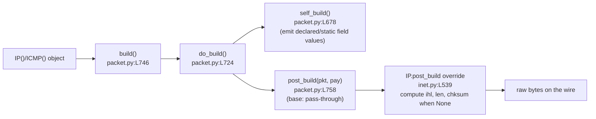

# How Scapy Works — A Grounded Q&A Walkthrough

> **Checkout under study:** branch `scapy_0925ada48540`, HEAD commit `0925ada485406684174d6f068dbd85c4154657b3`
> **Question answered:** *"I just set up Scapy from a specific commit and want to understand how it works before diving into packet crafting."*

This document answers **seven** sub-questions about how Scapy behaves and how it is built. Every answer follows the same shape:

1. **Observed output (verbatim)** — the real thing that was printed when the code was actually run, with the command that produced it.
2. **Source citations (`file:line`)** — the exact lines in the source tree that implement the behavior.
3. **Reasoning** — *why* it behaves that way.

The methodology was **run‑first**: the code paths were executed inside the target runtime, the real output was captured, and only then was this document written. All source citations were verified against this exact checkout.

> ⚠️ **A note on verbatim values.** This checkout produces a version string derived from a *date* and a startup banner that contains a *randomly chosen* quote. Both may differ if you re‑run on a different day or a different launch — that variability is itself documented below. Where a value is volatile (banner quote, reply packet `id`/`chksum`, date), that is stated explicitly.

---

## Environment note (what "this runtime" is)

All output below was captured in the container built from the image tagged for commit `0925ada485406684174d6f068dbd85c4154657b3`. The concrete runtime realities matter because a few answers depend on them:

| Fact | Observed value | How it was checked |
|------|----------------|--------------------|
| Python interpreter | **3.13.7** | `python3 --version` |
| `cryptography` package | **43.0.0** | `python3 -c "import cryptography; print(cryptography.__version__)"` |
| IPython | **absent** (import fails) | `python3 -c "import IPython"` → `ModuleNotFoundError` |
| PyX | **absent** (import fails) | `python3 -c "import pyx"` → `ModuleNotFoundError` |
| Privilege | **root** (`uid=0`) | `id -u` |
| Scapy source | run from the working tree via `PYTHONPATH`, **not** pip‑installed | `import scapy; scapy.__file__` → `…/scapy/__init__.py` |

**Python version vs. the declared support window.** The project declares `requires-python = ">=3.7, <4"` [`pyproject.toml:L17`] and the `tox` matrix tops out at `py311` [`tox.ini:L6`], yet the container runs **Python 3.13.7** — *above* the highest environment the project's own tooling enumerates. Scapy nonetheless imports and runs. This is worth knowing because a couple of test failures below are attributable to the newer runtime/library stack rather than to Scapy itself.

> **Honesty flag (read this before Q1 and Q7).** Some pre‑existing notes about this task were captured on a *different* runtime (Python 3.12.3, `cryptography` 41.0.7). Two observations differ here and are reported with **the values actually observed in this Python 3.13.7 / cryptography 43.0.0 environment**: (a) a TripleDES deprecation warning **does** appear at startup here (Q1); (b) `test/imports.uts` has one failing case and the test‑suite failure profile is dominated by a TLS/cryptography API removal (Q7).

---

## Q1 — Start the Scapy shell and show the startup

### Command

```console
$ printf 'exit\n' | ./run_scapy
```

`run_scapy` is a thin launcher: it sets `PYTHONPATH` to the repo and execs the module — `PYTHONPATH=$DIR exec "$PYTHON" -m scapy $@` (with `PYTHON` defaulting to `python3`). So `./run_scapy` and `python -m scapy` are equivalent entry points.

### Observed output (verbatim, ANSI color stripped)

```text
INFO: Can't import PyX. Won't be able to use psdump() or pdfdump().
INFO: No IPv6 support in kernel
/tmp/blitzy/scapy/blitzy-1519dbbe-6e67-4b1d-941a-74e467e5aea2_4cdf04/scapy/layers/ipsec.py:573: CryptographyDeprecationWarning: TripleDES has been moved to cryptography.hazmat.decrepit.ciphers.algorithms.TripleDES and will be removed from this module in 48.0.0.
  cipher=algorithms.TripleDES,
/tmp/blitzy/scapy/blitzy-1519dbbe-6e67-4b1d-941a-74e467e5aea2_4cdf04/scapy/layers/ipsec.py:577: CryptographyDeprecationWarning: TripleDES has been moved to cryptography.hazmat.decrepit.ciphers.algorithms.TripleDES and will be removed from this module in 48.0.0.
  cipher=algorithms.TripleDES,
WARNING: IPython not available. Using standard Python shell instead.
AutoCompletion, History are disabled.
                                      
                     aSPY//YASa       
             apyyyyCY//////////YCa       |
            sY//////YSpcs  scpCY//Pp     | Welcome to Scapy
 ayp ayyyyyyySCP//Pp           syY//C    | Version 2026.07.01
 AYAsAYYYYYYYY///Ps              cY//S   |
         pCCCCY//p          cSSps y//Y   | https://github.com/secdev/scapy
         SPPPP///a          pP///AC//Y   |
              A//A            cyP////C   | Have fun!
              p///Ac            sC///a   |
              P////YCpc           A//A   | Craft packets like I craft my beer.
       scccccp///pSP///p          p//Y   |               -- Jean De Clerck
      sY/////////y  caa           S//P   |
       cayCyayP//Ya              pY/Ya
        sY/PsY////YCc          aC//Yp 
         sc  sccaCY//PCypaapyCP//YSs  
                  spCPY//////YPSps    
                       ccaacs         
                                      
>>> Use exit() or Ctrl-D (i.e. EOF) to exit
>>> 
now exiting InteractiveConsole...
```

**The quote line rotates.** The two lines beginning `| Craft packets like I craft my beer.` / `|   -- Jean De Clerck` are chosen at **random** each launch. Repeated runs produced, for example, `Craft me if you can. — IPv6 layer`, `— Python 2`, `— Sebastien Chabal`, and `— Socrate`. Everything else in the banner is stable.

### Source citations (`file:line`)

- Entry point registered as a console script: `scapy = "scapy.main:interact"` [`pyproject.toml:L47`].
- `interact()` — the function that boots the console — is defined at [`scapy/main.py:L503`].
- The fancy banner is built under `if conf.fancy_prompt:` [`scapy/main.py:L589`]; `conf.fancy_prompt` is `True` by default (it is only forced off by the `-H` flag at [`scapy/main.py:L532`]).
- The banner text is assembled in the list `the_banner = [ … ]` [`scapy/main.py:L628`], including `"   | Welcome to Scapy"` [`scapy/main.py:L632`] and `"   | Version %s" % conf.version` [`scapy/main.py:L633`].
- The random quote is selected with `quote, author = choice(QUOTES)` [`scapy/main.py:L646`], where `QUOTES` is defined at [`scapy/main.py:L49`].
- A narrow‑terminal variant is chosen by `mini_banner = (get_terminal_width() or 84) <= 75` [`scapy/main.py:L591`]; the non‑fancy fallback is `banner_text = "Welcome to Scapy (%s)" % conf.version` [`scapy/main.py:L657`].
- The shell backend is selected at `if IPYTHON:` [`scapy/main.py:L662`]; when IPython is missing, the standard Python `code.InteractiveConsole` is used, which is why the prompt is `>>>`.
- The TripleDES warning originates from the IPsec layer using the (now‑deprecated) `algorithms.TripleDES` at [`scapy/layers/ipsec.py:L573`] and [`scapy/layers/ipsec.py:L577`].

### Reasoning

- **It is the "fancy" banner** (the ASCII logo) because `conf.fancy_prompt` is `True`. The banner interpolates the live `conf.version`, which is why the logo panel reads `Version 2026.07.01` (see Q2 for where that value comes from).
- **The informational / warning lines *are* part of "what startup looks like":**
  - `INFO: Can't import PyX…` — PyX is not installed, so the PostScript/PDF dump helpers are unavailable.
  - `INFO: No IPv6 support in kernel` — the container kernel exposes no IPv6, which Scapy detects at import.
  - `WARNING: IPython not available. Using standard Python shell instead.` + `AutoCompletion, History are disabled.` — IPython is absent, so Scapy falls back to the plain Python REPL (hence the `>>>` prompt and the loss of history/completion).
- **The random quote** confirms the banner is non‑deterministic by design; documenting one capture plus the observed rotations is the honest way to answer "what does startup look like".
- **TripleDES deprecation warning — reported honestly for this environment.** With **`cryptography` 43.0.0**, merely *referencing* `algorithms.TripleDES` (which `scapy/layers/ipsec.py` does at import time to register the `DES` and `3DES` ESP algorithms) raises a `CryptographyDeprecationWarning`. The warning text even names the removal target — *"will be removed from this module in 48.0.0"*. Note the subtlety in the source: the `warnings.catch_warnings()` suppression block at [`scapy/layers/ipsec.py:L580`]–[`scapy/layers/ipsec.py:L584`] only wraps the *CAST5/Blowfish* registrations that follow it — it does **not** cover the TripleDES references at L573/L577 — so those two warnings escape to the console. (On an older `cryptography` such as 41.0.7 the reference did not trigger the warning at all, so this line would *not* appear; it is shown here because this environment ships 43.0.0.)

---

## Q2 — Identify the running version

### Command & observed output (verbatim)

```console
$ python3 -c "from scapy.config import conf; print(repr(conf.version))"
'2026.07.01'
$ python3 -c "import scapy; print(repr(scapy.VERSION))"
'2026.07.01'
```

The reported version is **`2026.07.01`**. To show *why*, here is a probe that walks the same fallback chain `_version()` uses, plus the raw git facts:

```text
SCAPY_VERSION env set? -> False
VERSION file exists? -> False   (scapy/VERSION)
git_archive RAISED -> ValueError not a git archive
git_describe RAISED -> ValueError tag has invalid format
mtime-fallback date -> 2026.07.01   (from scapy/__init__.py)

$ git tag | wc -l                        -> 0
$ git describe --tags --always --long    -> 0925ada4
```

### Source citations (`file:line`)

- `conf.version` is a read‑only view of the module constant: `version = ReadOnlyAttribute("version", VERSION)` [`scapy/config.py:L726`].
- That constant is computed once at import: `VERSION = __version__ = _version()` [`scapy/__init__.py:L169`].
- `_version()` [`scapy/__init__.py:L122`] tries, in order:
  - **Method 0** — environment override `os.environ['SCAPY_VERSION']` [`scapy/__init__.py:L131`];
  - **Method 1** — a `scapy/VERSION` file (created only by `sdist`/wheel builds);
  - **Method 2** — `_version_from_git_archive()` [`scapy/__init__.py:L38`], called at [`scapy/__init__.py:L147`];
  - **Method 3** — `_version_from_git_describe()` [`scapy/__init__.py:L72`], called at [`scapy/__init__.py:L153`];
  - **Fallback** — the modification date of `scapy/__init__.py`: `datetime.datetime.utcfromtimestamp(os.path.getmtime(__file__))` [`scapy/__init__.py:L160`] formatted with `d.strftime('%Y.%m.%d')` [`scapy/__init__.py:L161`];
  - **Last resort** — the literal `'0.0.0'`.

### Reasoning

The value **`2026.07.01`** is the **date‑format fallback**, *not* a release tag. Each earlier method fails for this checkout, which the probe confirms:

- `SCAPY_VERSION` is **unset** → Method 0 skipped.
- There is **no `scapy/VERSION` file** (it is only generated during packaging) → Method 1 skipped.
- The tree is **not a git archive** → `_version_from_git_archive()` raises `ValueError: not a git archive` → Method 2 skipped.
- `git describe` returns only the **bare short hash** `0925ada4` because the repository has **0 tags**; that string does not match the expected `vX.Y.Z` tag shape, so `_version_from_git_describe()` raises `ValueError: tag has invalid format` → Method 3 skipped.
- Execution therefore reaches the fallback: the **modification time of `scapy/__init__.py`**, which in this container is 2026‑07‑01, formatted as `%Y.%m.%d` → **`2026.07.01`**.

Because the value is derived from a file's mtime, **it is date‑dependent**: re‑running on a different day would yield that day's date. The `2026.07.01` shown here is the value observed in this container on that date. (Side note: on Python 3.13 the fallback line uses the now‑deprecated `datetime.utcfromtimestamp`, which surfaces a `DeprecationWarning` only under `python -W all`; it is suppressed by default and does not affect the value.)

---

## Q3 — Create a basic ICMP echo request (`IP()/ICMP()`) and show which IP‑header fields auto‑populate

### Command & observed output (verbatim)

Build the packet and inspect the *stored* (pre‑build) field values, then serialize with `raw()` and re‑dissect to reveal the values Scapy computed:

```text
# bare IP() field-level defaults (getfieldval):
  IP().getfieldval('proto') = 0  renders: 'hopopt'
  IP().getfieldval('src') = None  IP().getfieldval('dst') = None

# IP()/ICMP() pre-build getfieldval:
  IP.version=4  IP.ihl=None  IP.tos=0  IP.len=None  IP.id=1  IP.flags=<Flag 0 ()>
  IP.frag=0  IP.ttl=64  IP.proto=1  IP.chksum=None  IP.src=None  IP.dst=None
  ICMP.type=8  ICMP.code=0  ICMP.chksum=None

# ICMP overload:  ICMP().overload_fields = {<class 'scapy.layers.inet.IP'>: {'frag': 0, 'proto': 1}}
# src/dst nuance: getfieldval('src')=None & getfieldval('dst')=None, but attribute .src='127.0.0.1' & .dst='127.0.0.1'
```

```text
raw length = 28 bytes
raw bytes  = 4500001c0001000040017cde7f0000017f0000010800f7ff00000000
IP.version->4  IP.ihl->5  IP.tos->0  IP.len->28  IP.id->1  IP.flags-><Flag 0 ()>
IP.frag->0  IP.ttl->64  IP.proto->1 (human 'icmp')  IP.chksum->31966 (0x7cde)  IP.src->'127.0.0.1'  IP.dst->'127.0.0.1'
summary() -> IP / ICMP 127.0.0.1 > 127.0.0.1 echo-request 0
```

### Source citations (`file:line`)

The `IP` class and its `fields_desc` are at [`scapy/layers/inet.py:L521`]–[`scapy/layers/inet.py:L537`]:

| Field | Declaration | Line |
|-------|-------------|------|
| `version` | `BitField("version", 4, 4)` | `scapy/layers/inet.py:L524` |
| `ihl` | `BitField("ihl", None, 4)` | `scapy/layers/inet.py:L525` |
| `tos` | `XByteField("tos", 0)` | `scapy/layers/inet.py:L526` |
| `len` | `ShortField("len", None)` | `scapy/layers/inet.py:L527` |
| `id` | `ShortField("id", 1)` | `scapy/layers/inet.py:L528` |
| `flags` | `FlagsField("flags", 0, 3, ["MF", "DF", "evil"])` | `scapy/layers/inet.py:L529` |
| `frag` | `BitField("frag", 0, 13)` | `scapy/layers/inet.py:L530` |
| `ttl` | `ByteField("ttl", 64)` | `scapy/layers/inet.py:L531` |
| `proto` | `ByteEnumField("proto", 0, IP_PROTOS)` | `scapy/layers/inet.py:L532` |
| `chksum` | `XShortField("chksum", None)` | `scapy/layers/inet.py:L533` |
| `src` | `Emph(SourceIPField("src", "dst"))` | `scapy/layers/inet.py:L535` |
| `dst` | `Emph(DestIPField("dst", "127.0.0.1"))` | `scapy/layers/inet.py:L536` |

- ICMP defaults to an **echo‑request**: `ByteEnumField("type", 8, icmptypes)` [`scapy/layers/inet.py:L954`] (class `ICMP` at [`scapy/layers/inet.py:L952`]).
- The `proto` overload comes from the layer binding `bind_layers(IP, ICMP, frag=0, proto=1)` [`scapy/layers/inet.py:L1112`]. Sibling bindings: IP→IP `proto=4` [`scapy/layers/inet.py:L1111`], IP→TCP `proto=6` [`scapy/layers/inet.py:L1113`], IP→UDP `proto=17` [`scapy/layers/inet.py:L1114`], IP→GRE `proto=47` [`scapy/layers/inet.py:L1115`].

### Reasoning

The IP fields fall into **three groups**:

1. **Static defaults** — emitted exactly as declared and visible before build: `version=4`, `tos=0`, `id=1`, `flags=0`, `frag=0`, `ttl=64`.
2. **`None` placeholders → auto‑computed at serialization** — `ihl`, `len`, and `chksum` are declared `None` and only get real values when the packet is built (see Q6). Re‑dissecting the raw bytes shows them resolved: **`ihl=5`**, **`len=28`**, **`chksum=0x7cde`** (decimal 31966).
3. **Context‑resolved fields:**
   - **`proto`** — the *field‑level* default is `0` (a bare `IP()` renders `hopopt`), but stacking `ICMP` overloads it to `1` via `bind_layers`. This is visible even *before* build because the overload is stored on the child layer: `ICMP().overload_fields == {IP: {'frag': 0, 'proto': 1}}`. Re‑dissected, `proto` renders as `icmp`.
   - **`src`** — declared `None` and resolved from the route to `dst` (→ `127.0.0.1`); `dst` itself defaults to `127.0.0.1`.

**A key subtlety:** `getfieldval('src')`/`getfieldval('dst')` return the *raw stored* value, which is `None` for `src` and `None` for `dst`'s stored form — yet **attribute access** (`p.src`, `p.dst`) and `show()` return the *resolved human* value `127.0.0.1`. That difference is the "auto‑population" the question asks about, happening at read time for display and at build time for the wire.

**Byte‑level proof** that the placeholders were computed — the 28 raw bytes decode field‑by‑field:

```text
45        version=4, ihl=5           (0x4_ / 0x_5)
00        tos=0
001c      len=28
0001      id=1
0000      flags=0, frag=0
40        ttl=64
01        proto=1 (icmp)
7cde      header checksum
7f000001  src = 127.0.0.1
7f000001  dst = 127.0.0.1
0800f7ff00000000   ICMP: type=8 code=0 chksum=0xf7ff id=0 seq=0
```


---

## Q4 — What `show()` outputs

### Command & observed output (verbatim)

```console
$ python3 -c "from scapy.all import IP, ICMP; (IP()/ICMP()).show()"
```

```text
###[ IP ]### 
  version   = 4
  ihl       = None
  tos       = 0x0
  len       = None
  id        = 1
  flags     = 
  frag      = 0
  ttl       = 64
  proto     = icmp
  chksum    = None
  src       = 127.0.0.1
  dst       = 127.0.0.1
  \options   \
###[ ICMP ]### 
     type      = echo-request
     code      = 0
     chksum    = None
     id        = 0x0
     seq       = 0x0
     unused    = ''
```

### Source citations (`file:line`)

- `Packet.show()` is defined at [`scapy/packet.py:L1459`]; it delegates the actual rendering to the helper `_show_or_dump()` [`scapy/packet.py:L1383`].

### Reasoning

`show()` prints the packet **layer by layer** (`###[ IP ]###`, then `###[ ICMP ]###`), one field per line, using each field's **human‑readable** (`i2repr`) view of the *current* value — i.e. the state **before** serialization. That is why:

- the unresolved placeholders `ihl`, `len`, and `chksum` display literally as **`None`** (they have not been computed yet — contrast with the built values in Q3: `ihl=5`, `len=28`, `chksum=0x7cde`);
- enumerated fields display **names**, not numbers: `proto = icmp`, `type = echo-request`;
- `SourceIPField`/`DestIPField` display the **resolved** address `127.0.0.1` (attribute/`i2h` access resolves the route, per Q3's "src/dst nuance");
- `tos` shows as `0x0` because it is an `XByteField` (hex display) and `id`/`seq` as `0x0` for the same reason (`XShortField`);
- the empty `flags` line and `\options   \` line reflect a zero flags value and an empty options list.

In short, `show()` is a *pre‑build inspection* view — ideal for confirming what you have crafted before sending — and it deliberately shows `None` for the fields Scapy will fill in for you at build time.

---

## Q5 — Send a crafted ICMP packet to `127.0.0.1` and describe the network‑layer behavior

### Command & observed output (verbatim)

```console
$ # pkt = IP(dst="127.0.0.1")/ICMP(); sr1(pkt, timeout=3)  -- first with the default
$ # conf.L3socket, then again after switching conf.L3socket = L3RawSocket
```

```text
packet: IP / ICMP 127.0.0.1 > 127.0.0.1 echo-request 0
route : ('lo', '127.0.0.1', '0.0.0.0')

--- Attempt 1: DEFAULT conf.L3socket = L3PacketSocket (PF_PACKET) ---
Begin emission:
Finished sending 1 packets.

Received 1 packets, got 0 answers, remaining 1 packets
  sr1 result: None (0 answers)

--- Attempt 2: conf.L3socket = L3RawSocket (AF_INET raw) ---
Begin emission:
Finished sending 1 packets.

Received 2 packets, got 1 answers, remaining 0 packets
  sr1 result: IP / ICMP 127.0.0.1 > 127.0.0.1 echo-reply 0
  reply detail: <IP  version=4 ihl=5 tos=0x0 len=28 id=23866 flags= frag=0 ttl=64 proto=icmp chksum=0x1fa5 src=127.0.0.1 dst=127.0.0.1 |<ICMP  type=echo-reply code=0 chksum=0x0 id=0x0 seq=0x0 |>>
```

Context observed at the same time: `uid = 0` (root), `conf.iface = eth0`, `conf.L3socket = L3PacketSocket` (the default on Linux). During emission Scapy also prints progress markers (`.` for each packet sent, `*` for each received) which interleave with the lines above.

> The reply's `id` (`23866`) and `chksum` (`0x1fa5`) are **volatile** — the OS sets a fresh IP identification on each generated reply, so these two values change from run to run. The `echo-reply` summary and the L3/L4 structure are stable.

### Source citations (`file:line`)

- `send()` [`scapy/sendrecv.py:L422`] and `sr1()` [`scapy/sendrecv.py:L656`] are the L3 send / send‑and‑receive‑one entry points.
- Route resolution: `Route.route()` [`scapy/route.py:L146`] — invoked as `conf.route.route("127.0.0.1")`.
- Default L3 socket on Linux: `L3PacketSocket` [`scapy/arch/linux.py:L587`] (a `PF_PACKET` socket).
- Alternative L3 socket: `L3RawSocket` [`scapy/supersocket.py:L283`] (an `AF_INET` raw socket).
- Which socket class L3 send uses is `conf.L3socket` [`scapy/config.py:L772`], selected per‑platform (e.g. set to `L3PacketSocket` at [`scapy/config.py:L647`], to `L3RawSocket` at [`scapy/config.py:L672`]).

### Reasoning

At the network layer, Scapy first **resolves a route** for the destination. `conf.route.route("127.0.0.1")` returns the tuple **`('lo', '127.0.0.1', '0.0.0.0')`** — egress interface `lo`, chosen source `127.0.0.1`, and no gateway (`0.0.0.0`). That is also how the source address gets selected for a `src`‑less packet (see Q6).

The **observed reply capture depends on which L3 socket implementation is used** — this is the important behavioral detail:

- With the **default `L3PacketSocket`** (`PF_PACKET`), the packet was sent (`Finished sending 1 packets.`) but the sniffer saw **`0 answers`** on loopback. This is a well‑known limitation of `PF_PACKET` capture on the loopback path in this configuration: the kernel's loopback echo‑reply is not delivered back through the `AF_PACKET` capture the way it would be on a real NIC, so `sr1` times out and returns `None`.
- After switching to **`L3RawSocket`** (`AF_INET` raw), the same send **captured the echo‑reply**: `IP / ICMP 127.0.0.1 > 127.0.0.1 echo-reply 0`, and the full reply decodes as an `IP/ICMP type=echo-reply`.

Both behaviors are reported because *the network‑layer outcome you observe is a function of the socket type*, not of the packet you crafted.

**Privileges.** Raw‑socket send/receive requires elevated privileges. Here the process ran as **root (`uid=0`)**, so both attempts were permitted. If raw‑socket privileges were unavailable, the send would instead raise a permission error (e.g. `PermissionError: [Errno 1] Operation not permitted` / a `socket.error`) — in that case the correct answer is to record the exact error rather than assume the send succeeded.

> The `conf.L3socket` switch in Attempt 2 was made **only inside a throwaway process** used for observation; no Scapy configuration is persisted, and the repository is unchanged.


---

## Q6 — How Scapy constructs the IP header by default (from the source)

This answer is grounded in **source reading**; every computed value it describes was already *observed* in Q3 (`ihl=5`, `len=28`, `chksum=0x7cde`, `src=127.0.0.1`).

### The build pipeline (`file:line`)

Serialization of any packet flows through four methods on the `Packet` base class, then a per‑layer hook:



- `build()` [`scapy/packet.py:L746`] is the public serialization entry.
- It calls `do_build()` [`scapy/packet.py:L724`], which first calls `self_build()` [`scapy/packet.py:L678`] to emit this layer's **declared field values** (the static defaults like `version=4`, `ttl=64`), then...
- ...calls `post_build(pkt, pay)` [`scapy/packet.py:L758`] — the base implementation is a pass‑through, but layers may override it.

### The IP‑specific override (`file:line`)

`IP` overrides `post_build` at [`scapy/layers/inet.py:L539`]. This is where the `None` placeholders become real bytes:

- **`ihl`** — when `self.ihl is None`, it is set to `len(p) // 4` (the header length in 32‑bit words) at [`scapy/layers/inet.py:L543`], then packed back into the first byte together with `version`.
- **`len`** — when `self.len is None`, the total length `len(p) + len(pay)` is packed into bytes 2–3 at [`scapy/layers/inet.py:L546`]–[`scapy/layers/inet.py:L547`].
- **`chksum`** — when `self.chksum is None`, the header checksum `checksum(p)` is computed and written into bytes 10–11 at [`scapy/layers/inet.py:L549`].

> Note on citations: `scapy/layers/inet.py:L533` is the **field declaration** `XShortField("chksum", None)`; the **method** that computes the checksum begins at `scapy/layers/inet.py:L539`. Both are cited here to avoid confusion.

### Source‑address resolution (`file:line`)

The `src` field is a `SourceIPField("src", "dst")` [`scapy/layers/inet.py:L535`], whose class is defined at [`scapy/fields.py:L854`]. When `src` is `None`, its `i2m()` [`scapy/fields.py:L879`] delegates to the private `__findaddr()` [`scapy/fields.py:L862`], which returns `conf.route.route(dst)[1]` [`scapy/fields.py:L877`] — i.e. the **source address the route picks for that destination**. For a `127.0.0.1` destination this yields `127.0.0.1` (matching the route tuple from Q5).

### Reasoning — the "smart defaults" design

Scapy deliberately splits IP fields into **literal defaults** and **`None` placeholders**:

- Fields with meaningful constants (`version=4`, `ttl=64`, …) carry those literals directly and are emitted verbatim by `self_build()`.
- Fields whose correct value **depends on the finished packet** — `ihl` (depends on header size), `len` (depends on total size), `chksum` (depends on all header bytes) — are declared `None` on purpose. They are intentionally left for `post_build()` to compute *during serialization*, once the surrounding bytes exist.

The pay‑off: a user can write `IP()/ICMP()` and get a **valid on‑the‑wire packet** without manually filling in the header length, total length, checksum, or source address. Each of those is computed exactly when enough information is available:

| Field | Declared | Computed in `post_build`/`i2m` | Observed (Q3) |
|-------|----------|-------------------------------|---------------|
| `ihl` | `None` | `len(p)//4` | `5` |
| `len` | `None` | `len(p)+len(pay)` | `28` |
| `chksum` | `None` | `checksum(p)` | `0x7cde` |
| `src` | `None` | `conf.route.route(dst)[1]` | `127.0.0.1` |

Ordered summary of the default construction path: **`build()` → `do_build()` → `self_build()` (static fields) → `post_build()` (IP override computes `ihl`, `len`, `chksum`)**, with `src` resolved through the route by `SourceIPField`.

---

## Q7 — Run the test suite: how many tests, and the pass/fail summary

### How Scapy tests are organized

Scapy does **not** use pytest or `unittest`. It ships a **custom** framework, **UTscapy** [`scapy/tools/UTscapy.py`]. Tests are written in a `.uts` DSL and grouped into **campaigns** by JSON `.utsc` configs under `test/configs/`. The Linux campaign is [`test/configs/linux.utsc`], which globs the test files, removes `test/windows.uts` and `test/bpf.uts`, sets `breakfailed: true` / `onlyfailed: true`, and excludes tests keyed `osx`, `windows`, `ipv6` (`kw_ko`).

### "How many tests" — two different counts

1. **File surface** — a *static* count of test files: `find . -name '*.uts' | wc -l` = **193**. Breakdown (verified):

   | Location | `.uts` files |
   |----------|--------------|
   | `test/contrib/` | 100 |
   | `test/scapy/layers/` | 46 |
   | `test/` (top level) | 19 |
   | `test/contrib/automotive/**` | 23 |
   | `test/tools/` | 3 |
   | `test/tls/` | 1 |
   | `test/scapy/` (top level) | 1 |
   | **Total** | **193** |

2. **Executed `UnitTest` cases** — the number the question really asks for — must be **measured by running UTscapy**. (Note: `test/packet.uts` does **not** exist in this checkout.)

### Observed output (verbatim) — representative suites

Every run used the flags `-t <file> -q -N` (`-N` = force non‑root, for reproducibility). The runner prints a version banner and a per‑campaign `PASSED=/FAILED=` line:

```console
$ python3 -m scapy.tools.UTscapy -t test/fields.uts -qq -N
━ UTScapy - Scapy 2026.07.01 - 3.13.7
Campaign CRC=32E6B059  SHA=CE16EAB755790C266C6377EC7A6140397E0D1402
PASSED=138 FAILED=0
```

Additional measured suites (same runner):

```text
test/fields.uts      -> PASSED=138  FAILED=0    (CRC=32E6B059)
test/random.uts      -> PASSED=11   FAILED=0    (CRC=3D33A34F)
test/imports.uts     -> PASSED=3    FAILED=1    (CRC=6870F36F)
test/regression.uts  -> PASSED=284  FAILED=3    (CRC=29F3B353)
```

### Observed output (verbatim) — the full Linux campaign

Running the whole `linux.utsc` campaign (`-N -b` to run every campaign, plus the environment skip keys `-K tshark -K vcan_socket -K manufdb`), then aggregating the 190 per‑campaign `Passed=/Failed=` lines:

```text
TOTAL PASSED=4811  TOTAL FAILED=197   (across 190 campaigns; 5008 executed test cases)
```

Only **8** of the 190 campaigns reported any failure:

```text
test/cert.uts                                  -> Failed=62
test/tls.uts                                   -> Failed=60
test/tls13.uts                                 -> Failed=45
test/sslv2.uts                                 -> Failed=26
test/imports.uts                               -> Failed=1
test/scapy/layers/dhcp.uts                     -> Failed=1
test/contrib/isotp_soft_socket.uts             -> Failed=1
test/contrib/automotive/scanner/uds_scanner.uts-> Failed=1
```

### Source citations (`file:line`)

- Custom framework: **UTscapy** [`scapy/tools/UTscapy.py`].
- Per‑campaign summary print `print(style("PASSED=%i FAILED=%i" % (passed, failed)))` [`scapy/tools/UTscapy.py:L619`] (and again at [`scapy/tools/UTscapy.py:L622`]); the HTML/campaign‑level form `"PASSED=%(passed)i FAILED=%(failed)i" % test_campaign` [`scapy/tools/UTscapy.py:L717`].
- The version banner `" UTScapy - Scapy %s - %s"` [`scapy/tools/UTscapy.py:L972`] — which is why the header reads `Scapy 2026.07.01 - 3.13.7`.
- Campaign definition: [`test/configs/linux.utsc`]. Orchestration matrix: `tox.ini` `envlist` [`tox.ini:L6`].

### Reasoning

- **File surface vs. test cases.** A naive "how many tests" answer of **193** counts *files*, not tests. The number the developer wants is the count of executed `UnitTest` cases, which is only knowable by **running** UTscapy. The clean, deterministic baseline is **`test/fields.uts` → PASSED=138 FAILED=0** (its `CRC=32E6B059` / SHA are reproducible run‑to‑run). Across the whole Linux campaign, **5008** test cases executed (**4811 passed, 197 failed**).

- **Why there are failures at all — and why the number is environment‑dependent (reported honestly):**
  - **194 of the 197 failures are one root cause:** `test/cert.uts` (62), `test/tls.uts` (60), `test/tls13.uts` (45), `test/sslv2.uts` (26) and the single `test/imports.uts` failure (1) all stem from the TLS layer failing to import. In this environment (`cryptography` **43.0.0**), `scapy/layers/tls/cert.py:51` does `from cryptography.hazmat.backends.openssl.ec import InvalidSignature`, but that module was **removed** in modern `cryptography`, producing `ModuleNotFoundError: No module named 'cryptography.hazmat.backends.openssl.ec'`. This is a source‑vs‑library‑version incompatibility, **not** a defect exercised by the test itself, and fixing it is out of scope for this read‑only task.
  - The **3 remaining failures** are pure environment constraints: `test/regression.uts` fails `Test manuf DB methods` (no flat Wireshark *manuf* file present), and two IPv6 cases — `Sending and receiving an ICMPv6EchoRequest` and `Ether IPv6 checking for dst` — which cannot pass because the kernel reports **no IPv6 support** (the same `INFO: No IPv6 support in kernel` line seen at startup in Q1).

- **This is why `test/imports.uts` shows `PASSED=3 FAILED=1`** here (its four subtests are *prepare*, *core imports*, *layer imports*, *contrib imports*; only **layer imports** fails, on the TLS `cert.py` import above).

- **Runtime caveats.** `linux.utsc` sets `breakfailed: true`, so a plain full run stops at the first failing campaign; `-b` overrides that to run everything (used above). Full‑campaign runs are long, so test execution was **time‑bounded**. The clean per‑suite numbers (`fields.uts` 138/0, `random.uts` 11/0) are the most stable evidence; the campaign aggregate (4811/197) and its failure profile are environment‑specific and are reported exactly as measured.


---

## Coverage pass — all seven sub-questions answered

Each item below has (a) verbatim observed output, (b) exact `file:line` citations, and (c) reasoning, in the section indicated.

- [x] **Q1 — Shell startup.** Fancy ASCII banner captured verbatim, including the info/warning lines (PyX absent, no kernel IPv6, IPython absent → standard shell). Honestly reported that the **TripleDES `CryptographyDeprecationWarning` *does* appear here** (this environment ships `cryptography` 43.0.0), from `scapy/layers/ipsec.py:573`/`:577`, and that the banner quote is random. Entry point `pyproject.toml:L47` → `interact()` `scapy/main.py:L503`.
- [x] **Q2 — Version.** `conf.version` / `scapy.VERSION` = **`2026.07.01`**, shown to be the **date fallback** for a **tagless checkout** (0 git tags; `git describe` → `0925ada4`) via the full `_version()` fallback‑chain probe. Cited `scapy/__init__.py:L122`–`L169`, `scapy/config.py:L726`.
- [x] **Q3 — `IP()/ICMP()` field auto‑population.** Classified fields into static defaults, `None` placeholders (`ihl`→5, `len`→28, `chksum`→0x7cde), and context‑resolved (`proto`→icmp via `bind_layers`; `src`→127.0.0.1 via route). Serialized to **28 bytes** and decoded byte‑by‑byte. Cited `scapy/layers/inet.py:L521`–`L537`, `:L954`, `:L1112`.
- [x] **Q4 — `show()` output.** Full verbatim field‑by‑field rendering embedded; explained it is the *pre‑build* human view (placeholders show `None`; enums show names). Cited `scapy/packet.py:L1459` / `:L1383`.
- [x] **Q5 — Localhost send.** Route resolved to **`('lo', '127.0.0.1', '0.0.0.0')`**; default **`L3PacketSocket` → 0 answers**, **`L3RawSocket` → echo‑reply** captured verbatim. Both behaviors documented, plus the raw‑socket privilege requirement. Cited `scapy/sendrecv.py:L422`/`L656`, `scapy/route.py:L146`, `scapy/arch/linux.py:L587`, `scapy/supersocket.py:L283`, `scapy/config.py:L772`.
- [x] **Q6 — Default IP construction (source).** Traced `build()` → `do_build()` → `self_build()` → `post_build()` with the IP override computing `ihl`/`len`/`chksum`, and `SourceIPField` resolving `src` from the route. Cited `scapy/packet.py:L678`–`L769`, `scapy/layers/inet.py:L539`–`L551`, `scapy/fields.py:L854`–`L883`.
- [x] **Q7 — Test suite.** Distinguished the **193 `.uts` file surface** from **measured executed cases**. Reported `test/fields.uts` **PASSED=138 FAILED=0** (clean baseline) and the full Linux campaign **PASSED=4811 FAILED=197 across 190 campaigns**, with 194/197 failures traced to the TLS `cryptography` API removal (`scapy/layers/tls/cert.py:51`) and the rest to IPv6/manuf environment limits. Cited `scapy/tools/UTscapy.py:L619`, `test/configs/linux.utsc`.

### Environment realities recorded (per the run‑first, be‑honest rules)

- Container **Python 3.13.7** — above the declared `requires-python = ">=3.7, <4"` [`pyproject.toml:L17`] and the `tox` `envlist` top of `py311` [`tox.ini:L6`] — yet Scapy imports and runs.
- **`cryptography` 43.0.0** (not 41.0.7): this is why the TripleDES warning is visible at startup (Q1) and why the TLS layer import fails, dominating the test‑failure count (Q7).
- The reported **version is a date fallback** (`2026.07.01`), not a release tag; it is date‑dependent.
- Volatile values are flagged where they occur: the **banner quote** (random per launch) and the **reply packet's `id`/`chksum`** (fresh per reply).

### Verification & repository hygiene

- All source citations were checked against this checkout (`0925ada48540…`) with `grep -n`/`sed` before being written.
- This document is the **only** artifact added to the repository. All observation was done in throwaway processes; temporary scripts lived under `/tmp` and were removed; a stray test‑generated file (`RMBA_dump.hex`) produced by a suite run was deleted, leaving the working tree clean.

